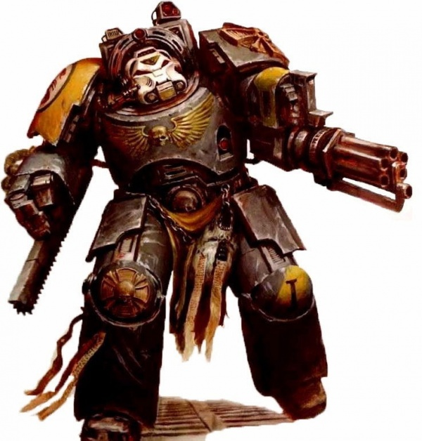
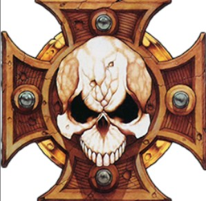
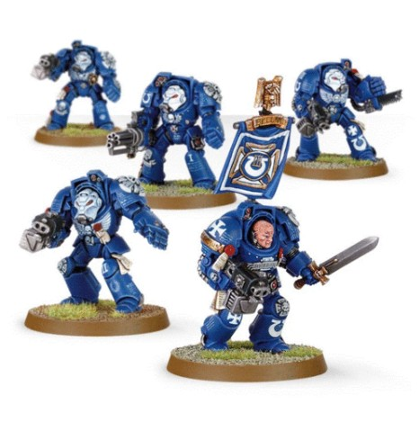
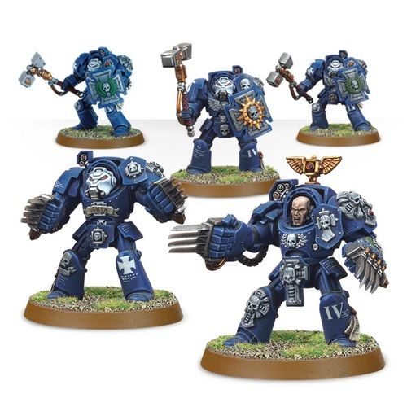
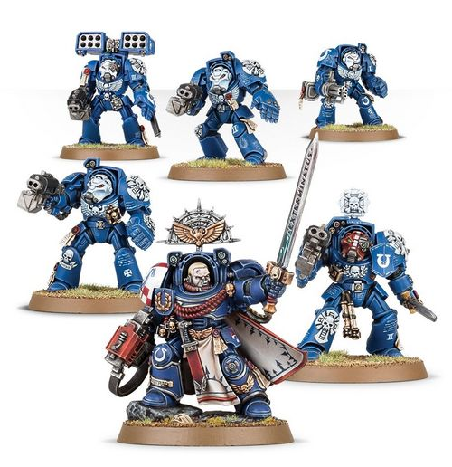
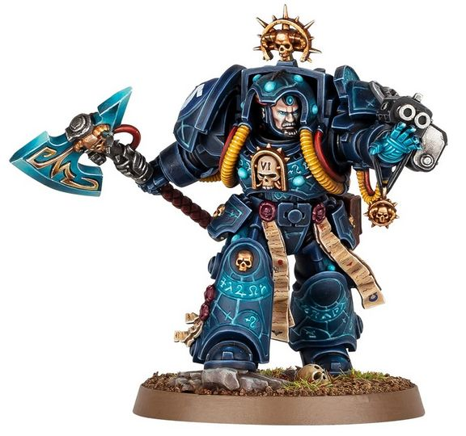
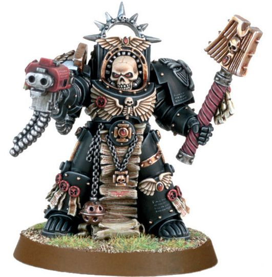

# 0283 终结者 Terminator

精校状态：中文行文已逐段精校，部分术语仍为暂定

分类：通用概念 / 帝国 Imperium / 中央政务部 Adeptus Terra / 阿斯塔特修会 Adeptus Astartes

原文来源：https://www.bilibili.com/opus/1035458491310931988

原作者：帝国神选罐头

原文时间：2025年02月19日 08:27

[返回分类目录](目录.md) · [全书目录](../../目录.md)

<!-- A0283-B0001 -->
**英文原文**

Terminators per se is a term normally used to refer to Space Marine Veterans wearing powerful Tactical Dreadnought Armour, more commonly referred to as Terminator Armour. In most Codex Chapters, they are members of the elite 1st Company of a Space Marine Chapter. Others can wear Terminator Armour as well, even in a Codex-compliant chapter, such as Librarians (who do not belong to a company), and other exceptions exist as well, such as in the Inquisition, but these are not typically referred to as "Terminators".

<!-- /A0283-B0001 -->

<!-- A0283-B0002 -->

原译文

终结者本身是一个术语，通常用来指穿着强大的战术无畏装甲的星际战士老兵，通常被称为终结者装甲。在大多数圣典战团中，他们是星际战士战团精英第一连的成员。其他人也可以穿终结者盔甲，即使是在符合圣典的战团中，比如智库（不属于连队），也存在其他例外情况，比如在审判庭，但这些通常不被称为“终结者”。

**校订译文**

“终结者”通常指穿着强大战术无畏护甲的星际战士老兵；这种护甲更常被称为终结者护甲。在多数遵循《阿斯塔特圣典》的战团中，他们隶属于精锐的第一连。不过，即使在严格遵循圣典的战团里，不编入常规连队的智库员等其他人员，也可能获准穿着此甲；审判庭中也有相应例外。这些人通常并不因此被直接称为“终结者”。

<!-- /A0283-B0002 -->

<!-- A0283-B0003 图片 -->

<!-- A0283-B0004 -->

原译文

Red Scorpions Terminator 红蝎终结者

**校订译文**

Red Scorpions Terminator 红蝎终结者

<!-- /A0283-B0004 -->

<!-- A0283-B0005 -->
## Overview 概述

<!-- /A0283-B0005 -->

<!-- A0283-B0006 -->
**英文原文**

Within a typical Space Marine Chapter, only the members of the 1st Company have full access to the rare and extremely resilient Terminator Armour. Each suit is treated as an important relic and seen as a physical representation of the Chapter's fighting spirit.

<!-- /A0283-B0006 -->

<!-- A0283-B0007 -->

原译文

在典型的星际战士中，只有第一连的成员才能完全使用罕见且极具韧性的终结者装甲。每一个套装都被视为一件重要的圣物，并被视为该战团战斗精神的实物代表。

**校订译文**

在典型的星际战士战团中，只有第一连成员能够普遍配备稀有而坚固无比的终结者护甲。每一套都被奉为重要圣物，是战团战斗精神的实体象征。

<!-- /A0283-B0007 -->

<!-- A0283-B0008 -->
**英文原文**

The main, widespread model of this armour, the most common in the Space Marine Chapters, is called the Indomitus pattern.

<!-- /A0283-B0008 -->

<!-- A0283-B0009 -->

原译文

这种盔甲的主要、广泛的型号，在星际战士中最为常见，被称为不屈型。

**校订译文**

星际战士战团中最普及的终结者护甲型号，称为不屈型。

<!-- /A0283-B0009 -->

<!-- A0283-B0010 -->
**英文原文**

The most revered part of each suit of armour is the Crux Terminatus, a cross-shaped badge placed on the left shoulder plate. According to legend, the Crux Terminatus worn by Terminator captains contains a shard of the armour the Emperor wore at the height of the Horus Heresy. To a Terminator, the loss of his Crux is unthinkable.

<!-- /A0283-B0010 -->

<!-- A0283-B0011 -->

原译文

每套盔甲中最受尊敬的部分是终结者十字章，这是一个放置在左肩甲上的十字形徽章。据传说，终结者连长佩戴的终结者十字章包含一块帝皇在荷鲁斯叛乱巅峰时期穿戴的盔甲碎片。对于终结者来说，失去十字章是不可想象的。

**校订译文**

护甲上最受尊崇的部分，是安置于左肩甲的终结者十字章。相传，终结者连长的十字章内，封存着帝皇在荷鲁斯之乱最激烈时期所穿护甲的一块碎片。对终结者而言，遗失十字章是无法想象的耻辱。

<!-- /A0283-B0011 -->

<!-- A0283-B0012 图片 -->

<!-- A0283-B0013 -->

原译文

The Crux Terminatus 终结者十字章

**校订译文**

The Crux Terminatus 终结者十字章

<!-- /A0283-B0013 -->

<!-- A0283-B0014 -->
**英文原文**

All suits have built-in teleportation devices which allow them to deploy anywhere via deep strike, although more often they are deployed using Land Raiders. Squads consist of a Terminator sergeant and between 4 and 9 Terminators.

<!-- /A0283-B0014 -->

<!-- A0283-B0015 -->

原译文

所有套装都有内置的传送装置，可以通过深入打击部署到任何地方，尽管更常见的是使用兰德掠袭者部署。小队由一名终结者军士和4至9名终结者组成。

**校订译文**

每套护甲都内置传送装置，使穿戴者能够通过深度打击部署到任意地点；不过，他们更常搭乘兰德掠袭者战车出战。小队由一名终结者军士与四至九名终结者组成。

<!-- /A0283-B0015 -->

<!-- A0283-B0016 -->
### Terminator Squad 终结者小队

<!-- /A0283-B0016 -->

<!-- A0283-B0017 -->
**英文原文**

Terminator Squads fight with the standard armament of a storm bolter for ranged combat and a power fist or chainfist for close combat. The storm bolter can be swapped for an assault cannon or heavy flamer, or supplemented with a shoulder-mounted cyclone missile launcher.

<!-- /A0283-B0017 -->

<!-- A0283-B0018 -->

原译文

终结者小队在远程战斗中使用风暴爆矢枪的标准武器，在近距离战斗中使用动力拳或链锯拳。风暴爆矢枪可以换成突击炮或重型火焰枪，也可以补充肩上安装的旋风导弹发射器。

**校订译文**

终结者小队的标准装备，是用于远程射击的风暴爆矢枪，以及用于近战的动力拳或链锯拳。风暴爆矢枪可换成突击炮或重型火焰喷射器，也可保留并增配肩载旋风导弹发射器。

**校注：** 已核同一人物、组织、型号或事件，与全书核心术语及后续专篇统一；原译保留对照。

<!-- /A0283-B0018 -->

<!-- A0283-B0019 图片 -->

<!-- A0283-B0020 -->

原译文

Ultramarines Terminator Squad 极限战士终结者小队

**校订译文**

Ultramarines Terminator Squad 极限战士终结者小队

<!-- /A0283-B0020 -->

<!-- A0283-B0021 -->
### Terminator Assault Squad 终结者突击小队

原题：Terminator Assault Squad 突击终结者小队

<!-- /A0283-B0021 -->

<!-- A0283-B0022 -->
**英文原文**

Terminator Assault Squads are oriented toward close combat. To maximise their effectiveness, they swap their standard armament for a pair of Lightning Claws, or a thunder hammer and storm shield. They often battle in close quarters, such as spaceship boarding actions or in the lower levels of a hive.

<!-- /A0283-B0022 -->

<!-- A0283-B0023 -->

原译文

突击终结者小队的目标是近距离作战。为了最大限度地提高效率，他们将标准武器换成了一对闪电爪，或者一把雷霆锤和风暴盾。它们经常在近距离内战斗，比如登上战舰或在巢都的较低层。

**校订译文**

终结者突击小队专注近战。为充分发挥效能，他们将标准武器换成成对的闪电爪，或雷霆锤与风暴盾。舰船跳帮战、巢都底层等狭窄环境，都是他们经常作战的地方。

<!-- /A0283-B0023 -->

<!-- A0283-B0024 图片 -->

<!-- A0283-B0025 -->

原译文

Ultramarines Assault Terminator Squad 极限战士突击终结者小队

**校订译文**

Ultramarines Assault Terminator Squad 极限战士终结者突击小队

<!-- /A0283-B0025 -->

<!-- A0283-B0026 -->
### Terminator Command Squad 终结者指挥小队

原题：Terminator Command Squad 终结者指挥组

<!-- /A0283-B0026 -->

<!-- A0283-B0027 -->
**英文原文**

Essentially a Space Marine Command Squad equipped with Terminator Armour, a Terminator Command Squad squad consists of one terminator sergeant and three to nine terminators. The terminator sergeant is armed with a power weapon and storm bolter and the rest are armed with power fists and storm bolters. Some swap their storm bolters for assault cannons or heavy flamers or keep them and add cyclone missile launchers, and some swap their power fists for chainfists, especially when boarding actions are carried out. A Terminator Command Squad may include a Company Ancient and/or Company Champion, similarly clad in Terminator Armour. Naturally, their captain may accompany them, similarly clad.

<!-- /A0283-B0027 -->

<!-- A0283-B0028 -->

原译文

本质上是一个配备终结者盔甲的星际战士指挥组，终结者指挥组由一名终结者军士和三到九名终结者组成。终结者军士装备了一把动力武器和风暴爆矢枪，其余的则装备了动力拳和风暴爆矢枪。一些人将风暴爆矢枪换成突击炮或重型火焰枪，或者保留它们并增加旋风导弹发射器，还有一些人将动力拳换成链锯拳，尤其是在跳帮行动时。终结者指挥组可能包括一名身穿终结者盔甲的连队旗手和/或连队冠军。当然，他们的连长也可以穿着同样的盔甲陪伴他们。

**校订译文**

终结者指挥小队就是穿着终结者护甲的星际战士指挥小队，由一名终结者军士率领三至九名终结者。军士装备动力武器与风暴爆矢枪，其他成员则装备动力拳与风暴爆矢枪。有些人将爆矢枪换成突击炮或重型喷火器，也有人保留爆矢枪、另加旋风导弹发射器；跳帮作战时，还常有人把动力拳换成链锯拳。小队可以编入同样穿着终结者护甲的连队旗手、连队冠军，或同时配备二者；连长当然也可以身着同样的护甲随队作战。

<!-- /A0283-B0028 -->

<!-- A0283-B0029 图片 -->

<!-- A0283-B0030 -->

原译文

Terminator Command Squad 终结者指挥组

**校订译文**

Terminator Command Squad 终结者指挥小队

<!-- /A0283-B0030 -->

<!-- A0283-B0031 -->
### Non-Company Loyalist Space Marine Terminators 不属常规连队的忠诚派终结者护甲使用者

原题：Non-Company Loyalist Space Marine Terminators 无连队忠诚派星际战士终结者

<!-- /A0283-B0031 -->

<!-- A0283-B0032 -->
**英文原文**

Apothecaries may be granted access to Terminator Armour, usually to accompany a Terminator Command Squad; similarly, Librarians and Chaplains may wear the suit into battle.

<!-- /A0283-B0032 -->

<!-- A0283-B0033 -->

原译文

药剂师可能被允许进入终结者盔甲，通常陪同终结者指挥组；同样，智库和牧师也可以穿着这件套装参加战斗。

**校订译文**

药剂师也可能获准穿着终结者护甲，通常是为了随终结者指挥小队行动。智库员与教士同样可以身穿此甲出战。

<!-- /A0283-B0033 -->

<!-- A0283-B0034 图片 -->

<!-- A0283-B0035 -->

原译文

Dark Angels Deathwing Terminator Apothecary 黑暗天使死翼终结者药剂师

**校订译文**

Dark Angels Deathwing Terminator Apothecary 黑暗天使死翼终结者药剂师

<!-- /A0283-B0035 -->

<!-- A0283-B0036 -->
## Loyalist Variations 忠诚派变体

<!-- /A0283-B0036 -->

<!-- A0283-B0037 -->
**英文原文**

The Dark Angels' 1st company is known as the Deathwing and is composed entirely of Terminator Squads. Unlike a traditional Codex Chapter, which distinguishes between Tactical and Assault roles, each Deathwing Terminator Squad is armed with a custom combination of heavy, close combat, or ranged weaponry, depending on the squad's role on the battlefield. Membership in the Deathwing also confers access to some of the chapter's most closely guarded secrets. There are no Veteran Squads in the Deathwing. Deathwing Terminator Squads may arm their heavy weapon carriers with plasma cannons, and they may be accompanied by a Watcher in the Dark.

<!-- /A0283-B0037 -->

<!-- A0283-B0038 -->

原译文

黑暗天使的第一连被称为死翼，完全由终结者小队组成。与区分战术和突击角色的传统圣典战团不同，每个死翼终结者小队都配备了重型、近战或远程武器的定制组合，具体取决于小队在战场上的角色。死亡的成员还有资格可以接触到战团一些最严格保密的秘密。死翼没有老兵小队。死翼终结者小队可能会用等离子炮武装他们的重型武器携带者，他们可能会由黑暗守望者陪同。

**校订译文**

黑暗天使第一连称为死翼，全部由终结者小队组成。传统圣典战团将终结者分为战术与突击两类，死翼则不同：每支小队会按战场任务，自行混合配备重武器、近战武器与远程武器。成为死翼成员，也意味着能够接触战团最严密守护的一部分秘密。死翼不编设老兵小队。其终结者的重武器射手可配备等离子炮，小队也可能有黑暗守望者随行。

**校注：** 本篇英文称死翼全由终结者组成且没有老兵小队，与第0286篇剑卫老兵归属的英文叙述存在版本差异，保留并列待核。

<!-- /A0283-B0038 -->

<!-- A0283-B0039 图片 -->

<!-- A0283-B0040 -->

原译文

Librarian in Terminator Armour 终结者盔甲智库

**校订译文**

Librarian in Terminator Armour 身穿终结者护甲的智库员

<!-- /A0283-B0040 -->

<!-- A0283-B0041 -->
### Salamanders 火蜥蜴

<!-- /A0283-B0041 -->

<!-- A0283-B0042 -->
**英文原文**

The Salamanders chapter uses an altered version of the Codex Astartes, with 12 squads in each company rather than the standard 10, including up to 120 Veterans or Terminators which are known as the Firedrakes.

<!-- /A0283-B0042 -->

<!-- A0283-B0043 -->

原译文

火蜥蜴战团使用了阿斯塔特圣典的修改版本，每个连队有12个小队，而不是标准的10个小队，其中包括多达120名老兵或终结者，被称为火龙。

**校订译文**

火蜥蜴遵循经调整的《阿斯塔特圣典》编制，每连设十二个小队，而非标准的十个；其中称为“火龙”的部队，可包含多达一百二十名老兵或终结者。

<!-- /A0283-B0043 -->

<!-- A0283-B0044 图片 -->

<!-- A0283-B0045 -->

原译文

Black Templar Chaplain in Terminator Armour 黑色圣堂终结者盔甲牧师

**校订译文**

Black Templar Chaplain in Terminator Armour 身穿终结者护甲的黑色圣堂教士

<!-- /A0283-B0045 -->

<!-- A0283-B0046 -->
### Space Wolves 太空野狼

<!-- /A0283-B0046 -->

<!-- A0283-B0047 -->
**英文原文**

The Wolf Guard of the Space Wolves are the retinue of a Wolf Lord, the equivalent of a Codex Chapter's Command Squad or Honour Guard. Wolf Guard have access to terminator armour, but unlike other chapters, they only wear it when the tactical situation so demands; the Space Wolves do not support permanent Terminator Squads.

<!-- /A0283-B0047 -->

<!-- A0283-B0048 -->

原译文

太空野狼的野狼卫队是狼主的随从，相当于圣典战团的指挥组或荣誉卫队。野狼卫队可以使用终结者盔甲，但与其他战团不同，他们只在战术情况需要时才穿；太空野狼不支持永久的终结者小队。

**校订译文**

太空野狼的野狼守卫是狼主的随从，相当于圣典战团的指挥小队或荣誉卫队。他们可以穿着终结者护甲，但与其他战团不同，只有战术需要时才会使用；太空野狼不设常备的终结者小队。

<!-- /A0283-B0048 -->

<!-- A0283-B0049 -->
**英文原文**

Each Wolf Guard can also take command of a main Battle-Brother squad. Wolf Guard, in this case, may also retain their Terminator armour.

<!-- /A0283-B0049 -->

<!-- A0283-B0050 -->

原译文

每个野狼卫队还可以指挥一个主要的战斗兄弟小队。在这种情况下，野狼卫队也可能保留他们的终结者盔甲。

**校订译文**

每名野狼守卫也可以受命指挥一支普通战斗兄弟小队，并可继续穿着终结者护甲。

<!-- /A0283-B0050 -->

<!-- A0283-B0051 -->
### Grey Knights 灰骑士

<!-- /A0283-B0051 -->

<!-- A0283-B0052 -->
**英文原文**

Unlike any other Space Marine force, the Grey Knights chapter is unique in that nearly its entire chapter can be outfitted in Terminator armour when required. Terminators of the Grey Knights use Storm Bolters and their preference of a Nemesis Force Weapon. Some may replace their storm bolter to be equipped with Incinerators, Psycannons, or Psilencers instead. Furthermore, they also make use of psychic powers as is characteristic of their chapter.

<!-- /A0283-B0052 -->

<!-- A0283-B0053 -->

原译文

与任何其他星际战士不同，灰骑士部队的独特之处在于，几乎整个部队都可以在需要时配备终结者盔甲。灰骑士的终结者使用风暴爆矢枪和他们对复仇女神动力武器的偏好。有些人可能会用焚化炮、灵能炮或除魔炮代替他们的风暴爆矢枪。此外，他们还利用了灵能力量，这是他们战团的特点。

**校订译文**

灰骑士与其他星际战士战团不同：必要时，几乎全团都能配备终结者护甲。他们的终结者使用风暴爆矢枪，以及自选的复仇女神灵能武器；部分成员会将爆矢枪换成焚化炮、灵能炮或除魔炮。他们也能施展灵能，延续灰骑士战团的独特作战传统。

**校注：** Force Weapon 指灵能武器，原译动力武器混淆了 Power Weapon。Nemesis Force Weapon 暂译复仇女神灵能武器。

<!-- /A0283-B0053 -->

<!-- A0283-B0054 -->
### Adeptus Custodes 帝皇禁军

原题：Adeptus Custodes 禁军

<!-- /A0283-B0054 -->

<!-- A0283-B0055 -->
**英文原文**

Allarus and Aquilon Custodians of the Adeptus Custodes wear Terminator Armour into battle.

<!-- /A0283-B0055 -->

<!-- A0283-B0056 -->

原译文

阿拉鲁斯和天鹰禁军们身着终结者盔甲投入战斗。

**校订译文**

阿拉鲁斯和天鹰卫士身着终结者盔甲投入战斗。

**校注：** 已核同一人物、组织、型号或事件，与全书核心术语及后续专篇统一；原译保留对照。

<!-- /A0283-B0056 -->

<!-- A0283-B0057 -->
## Chaos Terminators 混沌终结者

<!-- /A0283-B0057 -->

<!-- A0283-B0058 -->
**英文原文**

Terminators in service of the Traitor Legions turned renegade thousands of years ago and have had a long time to hone their skills, making them some of the most deadly troops in the galaxy.

<!-- /A0283-B0058 -->

<!-- A0283-B0059 -->

原译文

数千年前，为叛徒军团服务的终结者变成了叛徒，他们花了很长时间磨练自己的技能，使他们成为银河系中最致命的部队之一。

**校订译文**

效力于叛变军团的终结者，早在数千年前便已反叛。他们在漫长岁月中不断磨炼技艺，成为银河系最致命的战士之一。

<!-- /A0283-B0059 -->

本篇核心术语与暂定项

以下列出本篇出现的英文原形及核心术语表用词。同形词可能指不同对象，具体词义以本篇正文和校注为准；单复数、别名和仅见于图注的名称可能尚未列入。完整候选见[术语表](../../术语表/双语术语候选.csv)。

| 英文 | 采用中文 | 状态 |
| --- | --- | --- |
| Dark Angels | 黑暗天使 | 官方已核对 |
| Grey Knights | 灰骑士 | 官方已核对 |
| Space Wolves | 太空野狼 | 官方已核对 |
| Adeptus Custodes | 帝皇禁军 | 官方已核对 |
| Deep Strike | 深度打击 | 官方已核对 |
| Terminator | 终结者 | 官方已核对 |
| Horus Heresy | 荷鲁斯之乱 | 官方已核对 |
| Inquisition | 审判庭 | 暂定 |
| Teleportation | 传送 | 暂定 |
| Indomitus | 不屈学派 | 暂定·学派语境 |
| Emperor | 帝皇 | 官方已核对 |
| Horus | 荷鲁斯 | 暂定·官方待核 |
| Salamanders | 火蜥蜴 | 暂定·官方待核 |
| Company Champion | 连队冠军 | 暂定·官方待核 |
| Company Ancient | 连队旗手 | 暂定·官方待核 |
| Command Squad | 指挥小队 | 暂定·官方待核 |
| Nemesis Force Weapon | 复仇女神灵能武器 | 暂定·官方待核 |
| Ancient | 旗手 | 官方已核对 |
| Terminator Squad | 终结者小队 | 官方已核对 |
| Aquilon Custodians | 天鹰卫士 | 官方已核对 |
| Honour Guard | 荣誉卫队 | 暂定·官方待核 |
| Champion | 冠军 | 暂定·官方待核 |
| Space Marine | 星际战士 | 暂定·官方待核 |
| Chapter | 战团 | 暂定·官方待核 |
| Captain | 连长 | 暂定·官方待核 |
| Veteran | 老兵 | 暂定·官方待核 |
| Terminators | 终结者 | 暂定·官方待核 |
| Sergeant | 军士 | 暂定·官方待核 |
| Brother | 修士 | 暂定·官方待核 |
| Battle-Brother | 战斗兄弟 | 暂定·官方待核 |
| Codex Astartes | 阿斯塔特圣典 | 暂定·官方待核 |
| Nemesis | 复仇女神 | 暂定·官方待核 |
| Land Raiders | 兰德掠袭者 | 暂定·官方待核 |
| Assault Squads | 突击小队 | 暂定·官方待核 |
| Codex Chapter | 圣典战团 | 暂定·官方待核 |
| Missile Launchers | 导弹发射器 | 暂定·官方待核 |
| Terminator Squads | 终结者小队 | 暂定·官方待核 |
| Terminator Assault Squads | 终结者突击小队 | 暂定·官方待核 |
| Powers | 能天使 | 暂定·官方待核 |
| Flamers | 火妖（奸奇单位）／火焰喷射器（武器） | 语境定译·对应官译已核 |
| Wolf Guard | 野狼守卫 | 官方词根参考·通称待核 |
| Dreadnought | 无畏机甲 | 暂定·官方待核 |
| Chaplains | 教士 | 暂定·官方待核 |
| Firedrakes | 火龙 | 暂定·官方待核 |
| The Dark | 《黑暗》 | 暂定·官方待核 |
| Crux | 南十字 | 暂定·官方待核 |
| Thunder Hammer | 雷霆锤 | 暂定·官方待核 |
| Force weapon | 灵能武器 | 暂定·官方待核 |
| Missile Launcher | 导弹发射器 | 暂定·官方待核 |
| Cyclone Missile Launcher | 旋风导弹发射器 | 暂定·官方待核 |
| Assault Cannon | 突击炮 | 暂定·官方待核 |
| Bolter | 爆矢枪 | 暂定·官方待核 |
| Storm bolter | 风暴爆矢枪 | 官方已核对 |
| Flamer | 火焰喷射器（武器）／火妖（奸奇单位） | 语境定译·对应官译已核 |
| Heavy flamer | 重型火焰喷射器 | 官方已核对 |
| Power fist | 动力拳 | 官方已核对 |
| Power weapon | 动力武器 | 官方已核对 |
| Storm Shield | 风暴盾 | 暂定·官方待核 |
| Terminator Armour | 终结者盔甲 | 暂定·官方待核 |
| Crux Terminatus | 终结者十字章 | 暂定·官方待核 |
| Indomitus Pattern | 不屈型 | 暂定·官方待核 |
| Resilient | 坚韧号 | 暂定·官方待核 |
| The Loss | 失落 | 暂定·官方待核 |

