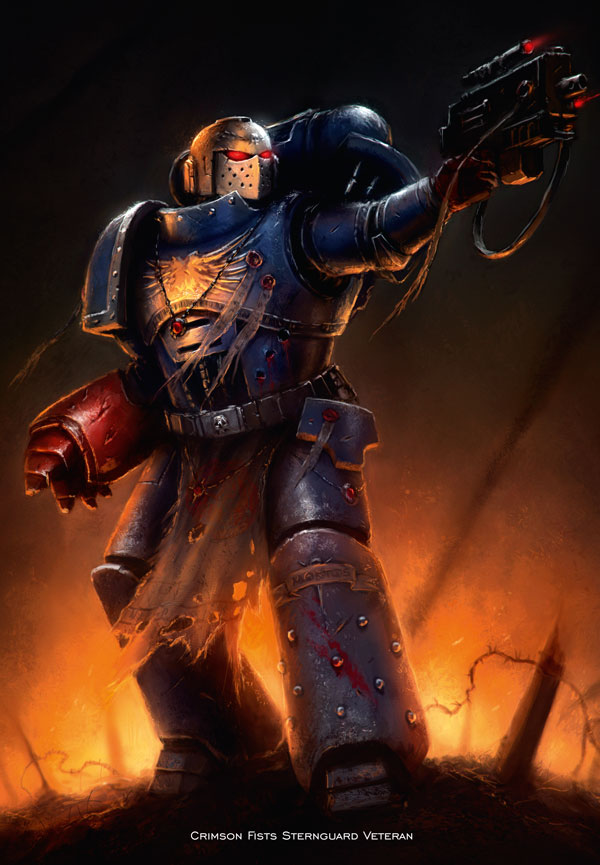
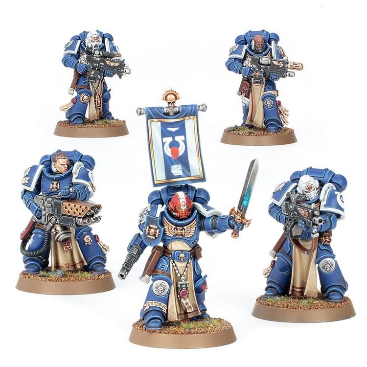
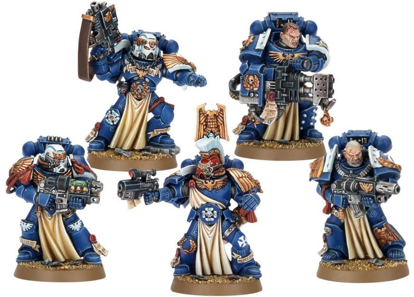

# 0285 肃卫老兵 Sternguard Veteran

精校状态：中文行文已逐段精校，部分术语仍为暂定

分类：通用概念 / 帝国 Imperium / 中央政务部 Adeptus Terra / 阿斯塔特修会 Adeptus Astartes

原文来源：https://www.bilibili.com/opus/1051859012928143362

原作者：帝国神选罐头

原文时间：2025年04月04日 13:10

[返回分类目录](目录.md) · [全书目录](../../目录.md)

<!-- A0285-B0001 -->
**英文原文**

The Sternguard are members of the 1st Company of a Space Marine Chapter. Their primary role is to cover a fighting retreat by the rest of a Space Marine force, holding the enemy at bay with their superior training and ranged weaponry.

<!-- /A0285-B0001 -->

<!-- A0285-B0002 -->

原译文

肃卫是星际战士战团第一连的成员。他们的主要作用是掩护星际战士其他部队的战斗撤退，用他们高超训练和远程武器将敌人挡住。

**校订译文**

肃卫老兵隶属星际战士战团第一连，主要任务是掩护其他部队边打边撤，以精湛的训练和远程火力阻挡追兵。

<!-- /A0285-B0002 -->

<!-- A0285-B0003 图片 -->

<!-- A0285-B0004 -->

原译文

Crimson Fists Sternguard Veteran 绯红之拳肃卫老兵

**校订译文**

Crimson Fists Sternguard Veteran 绯红之拳肃卫老兵

<!-- /A0285-B0004 -->

<!-- A0285-B0005 -->
## Overview 概述

<!-- /A0285-B0005 -->

<!-- A0285-B0006 -->
**英文原文**

While every member of a Chapter's 1st Company is proficient in all manner of weaponry, Sternguard Veterans prefer ranged combat over close-quarters fighting. Though occasionally armed with heavier weapons such as lascannons or heavy flamers, Sternguard Veterans prefer to use their bolters, meticulously modified with enhanced scopes and specialised ammunition.

<!-- /A0285-B0006 -->

<!-- A0285-B0007 -->

原译文

虽然一个战团第一连的每个成员都精通各种武器，但肃卫老兵更喜欢远程战斗而不是近距离战斗。虽然偶尔会配备重型武器，如激光炮或重型火焰枪，但肃卫老兵更喜欢使用他们的爆矢枪，经过精心改装，配有增强的瞄准镜和专用弹药。

**校订译文**

第一连战士虽都精通各种武器，肃卫老兵却更偏爱远程交锋。有时，他们也携带激光炮、重型喷火器等重武器，但最青睐的仍是精心改造、配有强化瞄具和特种弹药的爆矢枪。

<!-- /A0285-B0007 -->

<!-- A0285-B0008 图片 -->

<!-- A0285-B0009 -->

原译文

Sternguard Veterans Squad 肃卫老兵小队

**校订译文**

Sternguard Veterans Squad 肃卫老兵小队

<!-- /A0285-B0009 -->

<!-- A0285-B0010 -->
**英文原文**

Sternguard Squads deploy wherever the battleline is most fierce, facing down the most impossible odds with icy calm and precise bursts of bolter fire. They are the image of what every Space Marine aspires to become, and the pinnacle of any Chapter's fighting force. Though there is friendly rivalry with their counterpart Vanguard Veterans, such competition does not get in the way of their bonds in battle, and each will fight to the death for the other.

<!-- /A0285-B0010 -->

<!-- A0285-B0011 -->

原译文

肃卫小队部署在战线最激烈的地方，用冰冷的平静和爆矢枪精确的开火射击来面对最不可能的困难。他们是每个星际战士渴望成为的形象，也是任何一个战团战斗力量的巅峰。尽管他们与先锋老兵有着友好的竞争，但这种竞争不会妨碍他们在战斗中的关系，双方都会为对方战斗至死。

**校订译文**

肃卫小队总被投入战线最激烈之处，以冷峻的镇定和精准的爆矢点射，应对几乎不可能取胜的局面。他们是每位星际战士向往的榜样，也是战团战力的顶峰。肃卫与先锋老兵之间虽有友善的竞争，却绝不会因此损害战场上的情谊；双方都愿为彼此奋战至死。

<!-- /A0285-B0011 -->

<!-- A0285-B0012 -->
## Special Equipment 特殊装备

<!-- /A0285-B0012 -->

<!-- A0285-B0013 -->
**英文原文**

All Sternguard Veterans are equipped with extra kinds of specialised ammunition for use in battle. In addition to standard Bolter rounds they have access to:

<!-- /A0285-B0013 -->

<!-- A0285-B0014 -->

原译文

所有肃卫老兵都配备了额外种类的专用弹药，用于战斗。除了标准的爆矢外，他们还可以使用：

**校订译文**

肃卫老兵除标准爆矢弹外，还能使用多种特种弹药：

<!-- /A0285-B0014 -->

<!-- A0285-B0015 图片 -->

<!-- A0285-B0016 -->

原译文

Sternguard Veterans Squad 肃卫老兵小队

**校订译文**

Sternguard Veterans Squad 肃卫老兵小队

<!-- /A0285-B0016 -->

<!-- A0285-B0017 -->
**英文原文**

Dragonfire Bolts: These hollow shells explode with superheated gas, allowing them to bypass cover with ease.

<!-- /A0285-B0017 -->

<!-- A0285-B0018 -->

原译文

龙火爆矢：这些空心外壳在过热气体中爆炸，使它们能够轻松绕过覆盖。

**校订译文**

龙火爆矢：中空弹体爆炸时释放超高温气体，能够轻易杀伤掩体后的敌人。

<!-- /A0285-B0018 -->

<!-- A0285-B0019 -->
**英文原文**

Hellfire Rounds: Replacing the bolt's explosive charge with needles of mutagenic acid, these were originally designed to combat Tyranids.

<!-- /A0285-B0019 -->

<!-- A0285-B0020 -->

原译文

地狱火弹药：用诱变酸针代替爆矢的炸药，这些最初是为了对抗泰伦而设计的。

**校订译文**

地狱火弹：以携带诱变酸液的细针取代爆炸装药，最初为对抗泰伦而研制。

<!-- /A0285-B0020 -->

<!-- A0285-B0021 -->
**英文原文**

Kraken Pattern Penetrator Rounds: Modified with an adamantine core and more propellant, Kraken Bolts have a longer range and better armour penetration.

<!-- /A0285-B0021 -->

<!-- A0285-B0022 -->

原译文

克拉肯型穿甲弹：克拉肯爆矢采用精金弹芯和更多推进剂进行改装，射程更远，装甲穿透力更好。

**校订译文**

克拉肯型穿甲弹：采用精金弹芯，并增加推进剂，因此射程更远、穿甲能力更强。

<!-- /A0285-B0022 -->

<!-- A0285-B0023 -->
**英文原文**

Metal Storm Shells: Capable of wreaking havoc against unarmoured foes.

<!-- /A0285-B0023 -->

<!-- A0285-B0024 -->

原译文

金属风暴弹药：能够对未穿盔甲的敌人造成严重破坏。

**校订译文**

金属风暴弹：能对缺乏护甲的敌人造成严重杀伤。

<!-- /A0285-B0024 -->

<!-- A0285-B0025 -->
**英文原文**

Tempest Bolts: These rounds incorporate tiny plasma shock generators that emit electromagnetic and thermal radiation when the shell detonates. Produced only on the Forgeworld of Mars, tempest shells are noted as particularly effective against machines and other mechanical targets.

<!-- /A0285-B0025 -->

<!-- A0285-B0026 -->

原译文

暴风爆矢：这些子弹装有微型等离子冲击发生器，当子弹爆炸时会发射出电磁和热辐射。暴风弹药仅在火星铸造世界生产，被认为对机械和其他机械目标特别有效。

**校订译文**

暴风爆矢：内置微型等离子冲击发生器，弹体引爆时释放电磁与热辐射。这种弹药仅在铸造世界火星生产，对机械及其他机械化目标尤为有效。

<!-- /A0285-B0026 -->

<!-- A0285-B0027 -->
**英文原文**

Vengeance Rounds: Employing unstable flux core technology which makes them hazardous to use, but superior at penetrating power armour. these were originally designed to combat Traitor Marines.

<!-- /A0285-B0027 -->

<!-- A0285-B0028 -->

原译文

复仇弹药：采用不稳定的通量核心技术，使其使用起来很危险，但在穿透动力盔甲方面表现出色。这些最初是为了对抗叛徒星际战士而设计的。

**校订译文**

复仇弹：采用不稳定的通量核心技术，使用起来颇为危险，却极善于贯穿动力甲。它最初是为对抗叛变星际战士而设计的。

<!-- /A0285-B0028 -->

本篇核心术语与暂定项

以下列出本篇出现的英文原形及核心术语表用词。同形词可能指不同对象，具体词义以本篇正文和校注为准；单复数、别名和仅见于图注的名称可能尚未列入。完整候选见[术语表](../../术语表/双语术语候选.csv)。

| 英文 | 采用中文 | 状态 |
| --- | --- | --- |
| Tyranids | 泰伦虫族 | 官方已核对 |
| Mars | 火星 | 暂定·官方待核 |
| Dragonfire Bolts | 龙火爆矢 | 暂定·官方待核 |
| Hellfire Rounds | 地狱火弹 | 暂定·官方待核 |
| Kraken Pattern Penetrator Rounds | 克拉肯型穿甲弹 | 暂定·官方待核 |
| Metal Storm Shells | 金属风暴弹 | 暂定·官方待核 |
| Tempest Bolts | 暴风爆矢 | 暂定·官方待核 |
| Vengeance Rounds | 复仇弹 | 暂定·官方待核 |
| Power Armour | 动力盔甲 | 暂定·官方待核 |
| Space Marine | 星际战士 | 暂定·官方待核 |
| Chapter | 战团 | 暂定·官方待核 |
| Vanguard | 先锋 | 暂定·官方待核 |
| Sternguard Veterans | 肃卫老兵 | 暂定·官方待核 |
| Vanguard Veterans | 先锋老兵 | 暂定·官方待核 |
| Flamers | 火妖（奸奇单位）／火焰喷射器（武器） | 语境定译·对应官译已核 |
| Vengeance | 复仇号 | 暂定·官方待核 |
| Bolt | 爆矢 | 暂定·官方待核 |
| Bolter | 爆矢枪 | 暂定·官方待核 |
| Kraken | 克拉肯 | 暂定·官方待核 |

