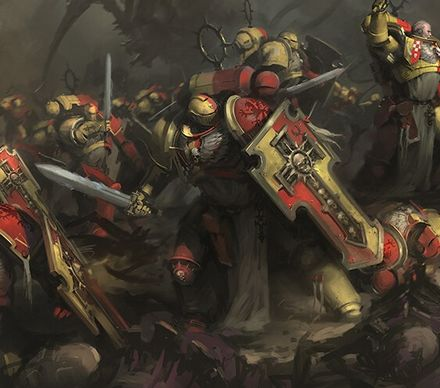
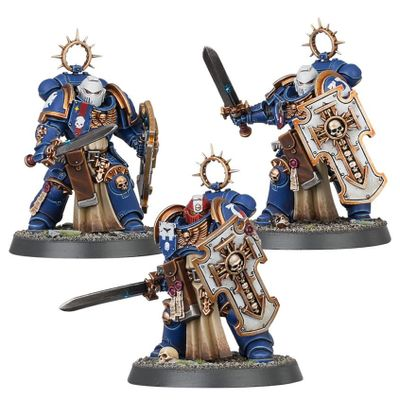

# 0286 剑卫老兵 Bladeguard Veteran

精校状态：中文行文已逐段精校，部分术语仍为暂定

分类：通用概念 / 帝国 Imperium / 中央政务部 Adeptus Terra / 阿斯塔特修会 Adeptus Astartes

原文来源：https://www.bilibili.com/opus/1019189258259267593

原作者：帝国神选罐头

原文时间：2025年01月06日 12:14

[返回分类目录](目录.md) · [全书目录](../../目录.md)

<!-- A0286-B0001 -->
**英文原文**

Bladeguard Veterans are Primaris First Company veterans.

<!-- /A0286-B0001 -->

<!-- A0286-B0002 -->

原译文

剑卫老兵是第一连队的老兵。

**校订译文**

剑卫老兵是第一连中的原铸星际战士老兵。

<!-- /A0286-B0002 -->

<!-- A0286-B0003 图片 -->

<!-- A0286-B0004 -->

原译文

Howling Griffons Bladeguard Veteran 咆哮狮鹫剑卫老兵

**校订译文**

Howling Griffons Bladeguard Veteran 咆哮狮鹫剑卫老兵

<!-- /A0286-B0004 -->

<!-- A0286-B0005 -->
**英文原文**

Bladeguard veterans go into battle clad in richly ornamented armor, covered with seals of purity and adorned with victory icons and heraldic items. Their imposing storm shields are the work of entire generations of Chapter Serfs, and the powerful force-field generators they house are said to protect the soul of their wearer as well as their flesh. This equipment comes out of the chapter's reliquaries during wartime, and it reminds Battle Brothers who see it in battle of the legacy they swore to honor upon their enthronement.

<!-- /A0286-B0005 -->

<!-- A0286-B0006 -->

原译文

剑卫老兵身着装饰华丽的盔甲进入战斗，上面覆盖着纯洁印记，装饰着胜利的图标和纹章。他们强大的风暴盾是几代战团侍从的杰作，据说他们所拥有的强大灵能力场发生器可以保护装备者的灵魂和肉体。这件装备是在战争期间从本战团的圣物箱中取出的，它提醒了在战斗中看到它的战斗兄弟，他们在就职时发誓要尊重的遗产。

**校订译文**

剑卫老兵身披华丽的护甲，遍饰纯洁印记、胜利徽记与纹章。他们威武的风暴盾凝聚着数代战团农奴的心血，内置强大的力场发生器；据说，这些盾牌不仅保护肉身，也守护持盾者的灵魂。战时，装备才会从战团的圣物收藏中取出，提醒每一位目睹它们的战斗兄弟：加入战团时，他们曾立誓守护怎样的传承。

**校注：** force-field generator 为力场发生器，原文未说明为灵能力场。 英文为 Chapter serfs，沿第9篇定译战团农奴；不与普通侍从混同。

<!-- /A0286-B0006 -->

<!-- A0286-B0007 图片 -->

<!-- A0286-B0008 -->

原译文

Ultramarines Bladeguard Veteran Squad 极限战士剑卫老兵

**校订译文**

Ultramarines Bladeguard Veteran Squad 极限战士剑卫老兵小队

<!-- /A0286-B0008 -->

<!-- A0286-B0009 -->
## Chapter Variations 各战团的不同做法

原题：Chapter Variations 战团变体

<!-- /A0286-B0009 -->

<!-- A0286-B0010 -->
**英文原文**

The Dark Angels' Bladeguard Veterans serve in the Deathwing, after having earned the hard-won trust of the Chapter's Inner Circle.

<!-- /A0286-B0010 -->

<!-- A0286-B0011 -->

原译文

黑暗天使的剑卫老兵在获得战团内环来之不易的信任后，在死翼服役。

**校订译文**

黑暗天使的剑卫老兵，只有赢得战团内环难能可贵的信任，才会获准在死翼服役。

<!-- /A0286-B0011 -->

<!-- A0286-B0012 -->
**英文原文**

The Space Wolves’ Bladeguard Veterans fight as part of the Chapter’s elite Wolf Guard.

<!-- /A0286-B0012 -->

<!-- A0286-B0013 -->

原译文

太空野狼的剑卫老兵作为本战团的精英野狼守卫的一部分作战。

**校订译文**

太空野狼的剑卫老兵，则作为精锐野狼守卫的一员投入战斗。

<!-- /A0286-B0013 -->

本篇核心术语与暂定项

以下列出本篇出现的英文原形及核心术语表用词。同形词可能指不同对象，具体词义以本篇正文和校注为准；单复数、别名和仅见于图注的名称可能尚未列入。完整候选见[术语表](../../术语表/双语术语候选.csv)。

| 英文 | 采用中文 | 状态 |
| --- | --- | --- |
| Dark Angels | 黑暗天使 | 官方已核对 |
| Space Wolves | 太空野狼 | 官方已核对 |
| Equipment | 装备 | 编辑用语已统一 |
| Chapter | 战团 | 暂定·官方待核 |
| Chapter serfs | 战团农奴 | 暂定·官方待核 |
| Wolf Guard | 野狼守卫 | 官方词根参考·通称待核 |
| The Dark | 《黑暗》 | 暂定·官方待核 |

