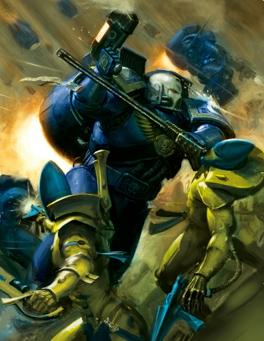
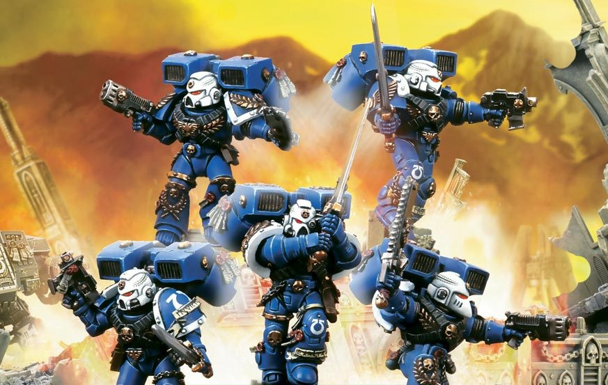

# 0287 先锋老兵 Vanguard Veteran

精校状态：中文行文已逐段精校，部分术语仍为暂定

分类：通用概念 / 帝国 Imperium / 中央政务部 Adeptus Terra / 阿斯塔特修会 Adeptus Astartes

原文来源：https://www.bilibili.com/opus/1036603740062220304

原作者：帝国神选罐头

原文时间：2025年02月22日 10:31

[返回分类目录](目录.md) · [全书目录](../../目录.md)

<!-- A0287-B0001 -->
**英文原文**

Vanguard Veterans are members of the First Company of a Space Marine Chapter who specialize in melee combat and are thus ideally suited to spearhead any offensive action.

<!-- /A0287-B0001 -->

<!-- A0287-B0002 -->

原译文

先锋老兵是星际战士第一连的成员，专门从事近战，因此非常适合领导任何进攻行动。

**校订译文**

先锋老兵隶属星际战士战团第一连，专精近战，是担任进攻先锋的理想人选。

<!-- /A0287-B0002 -->

<!-- A0287-B0003 图片 -->

<!-- A0287-B0004 -->

原译文

Vanguard Veteran 先锋老兵

**校订译文**

Vanguard Veteran 先锋老兵

<!-- /A0287-B0004 -->

<!-- A0287-B0005 -->
## Overview 概述

<!-- /A0287-B0005 -->

<!-- A0287-B0006 -->
**英文原文**

While every member of the Chapter's 1st Company is proficient in all manner of weaponry, those of the Vanguard Squads have completely immersed themselves in the art of close-quarter fighting. Having served for lengthy rotations among their Chapter's Assault Squads, Vanguard Veterans are some of the best hand-to-hand fighters in the Chapter.

<!-- /A0287-B0006 -->

<!-- A0287-B0007 -->

原译文

虽然第一连队的每个成员都精通各种武器，但先锋小队的成员完全沉浸在近距离战斗的艺术中。先锋老兵在他们战团的突击小队中服役了很长时间，是战团中最好的肉搏战战士之一。

**校订译文**

第一连的每名战士都精通各种武器，但先锋小队将全部心力投入近身格斗。他们曾在所属战团的突击小队中长期轮值，是全团最出色的近战战士之一。

<!-- /A0287-B0007 -->

<!-- A0287-B0008 -->
**英文原文**

Therefore they are armed with Bolt Pistols, Chainswords, krak and frag grenades and wear jump packs; however their position in the Chapter gives them access to more specialized weapons from the Chapter's armoury, such as Relic Blades. Such is the honour and rarity of this ancient weaponry that Vanguard Veterans will fight even harder to recover them from the battlefield.

<!-- /A0287-B0008 -->

<!-- A0287-B0009 -->

原译文

因此，他们配备了爆矢手枪、链锯剑、穿甲和破片手榴弹，并佩戴了跳跃背包；然而，他们在战团中的地位使他们能够从战团的军械库中获得更专业的武器，如圣物剑。就是因为这种古老武器的荣誉和稀有性，先锋老兵将更加努力地战斗来从战场上夺回它们。

**校订译文**

先锋老兵通常配备爆矢手枪、链锯剑、穿甲与破片手榴弹，以及跳跃背包。凭借在战团中的地位，他们还可从军械库领取圣物剑等专门武器。这些古老兵器稀有而荣耀，即使遗落战场，先锋老兵也会奋不顾身地将其夺回。

<!-- /A0287-B0009 -->

<!-- A0287-B0010 图片 -->

<!-- A0287-B0011 -->

原译文

Ultramarines Vanguard Veteran Squad 极限战士先锋老兵小队

**校订译文**

Ultramarines Vanguard Veteran Squad 极限战士先锋老兵小队

<!-- /A0287-B0011 -->

<!-- A0287-B0012 -->
**英文原文**

Vanguard Squads are most often used as rapid-reaction forces, used to attack the weaker points in an enemy's line or to reinforce an ally in trouble. Due to their equipment and fighting style they rarely remain stationary and after destroying one enemy quickly move on to engage another. Vanguard Veterans are often in friendly rivalry with their battle-brothers, Sternguard Veterans, due to differences in their fighting styles.

<!-- /A0287-B0012 -->

<!-- A0287-B0013 -->

原译文

先锋小队最常被用作快速反应部队，用于攻击敌人战线上的薄弱点或增援陷入困境的盟友。由于他们的装备和战斗风格，他们很少保持静止，在摧毁一个敌人后，他们会迅速与另一个敌人交战。由于战斗风格的差异，先锋老兵经常与他们的战斗兄弟肃卫老兵进行友好的竞争。

**校订译文**

先锋小队通常充当快速反应部队，攻击敌阵薄弱处，或增援陷入困境的友军。其装备与战法决定了他们很少停留一地：消灭一个敌人，便立刻转向下一个目标。近战与远程作战的风格差异，也让先锋老兵和肃卫老兵之间常有友善的竞争。

<!-- /A0287-B0013 -->

<!-- A0287-B0014 -->
## Wargear 战备

<!-- /A0287-B0014 -->

<!-- A0287-B0015 -->
**英文原文**

Besides their standard equipment, Vanguard Veterans have access to their Chapter's entire arsenal of close-combat weaponry, including:

<!-- /A0287-B0015 -->

<!-- A0287-B0016 -->

原译文

除了他们的标准装备外，先锋老兵还可以使用他们战团的全部近战武器库，包括：

**校订译文**

除标准装备外，先锋老兵还可以选用战团军械库中的全部近战武器，包括：

<!-- /A0287-B0016 -->

<!-- A0287-B0017 -->

原译文

Eviscerators 开膛手

**校订译文**

Eviscerators 开膛手

<!-- /A0287-B0017 -->

<!-- A0287-B0018 -->

原译文

Storm Shields 风暴盾

**校订译文**

Storm Shields 风暴盾

<!-- /A0287-B0018 -->

<!-- A0287-B0019 -->
**英文原文**

Power Weapons, including Lightning Claws, Power Fists, Relic Blades, and Thunder Hammers

<!-- /A0287-B0019 -->

<!-- A0287-B0020 -->

原译文

动力武器，包括闪电爪，动力拳，圣物剑和雷霆锤

**校订译文**

动力武器，包括闪电爪，动力拳，圣物剑和雷霆锤

<!-- /A0287-B0020 -->

<!-- A0287-B0021 -->
**英文原文**

Grav-Pistols, Hand Flamers, Inferno Pistols, and Plasma Pistols

<!-- /A0287-B0021 -->

<!-- A0287-B0022 -->

原译文

重力手枪，喷火手枪，炼狱手枪和等离子手枪

**校订译文**

重力手枪，喷火手枪，炼狱手枪和等离子手枪

<!-- /A0287-B0022 -->

<!-- A0287-B0023 -->

原译文

Melta Bombs 热熔炸弹

**校订译文**

Melta Bombs 热熔炸弹

<!-- /A0287-B0023 -->

<!-- A0287-B0024 -->
**英文原文**

They may also choose, instead of their jump packs, to ride into battle in one of the following:

<!-- /A0287-B0024 -->

<!-- A0287-B0025 -->

原译文

他们也可以选择以下方式之一而不是通过跳跃背包进入战斗：

**校订译文**

他们也可以卸下跳跃背包，改乘以下载具出战：

<!-- /A0287-B0025 -->

<!-- A0287-B0026 -->

原译文

Rhinos 犀牛装甲车

**校订译文**

Rhinos 犀牛战车

<!-- /A0287-B0026 -->

<!-- A0287-B0027 -->

原译文

Razorbacks 豪猪战车

**校订译文**

Razorbacks 豪猪战车

<!-- /A0287-B0027 -->

<!-- A0287-B0028 -->

原译文

Drop Pods 空投仓

**校订译文**

Drop Pods 空降舱

<!-- /A0287-B0028 -->

本篇核心术语与暂定项

以下列出本篇出现的英文原形及核心术语表用词。同形词可能指不同对象，具体词义以本篇正文和校注为准；单复数、别名和仅见于图注的名称可能尚未列入。完整候选见[术语表](../../术语表/双语术语候选.csv)。

| 英文 | 采用中文 | 状态 |
| --- | --- | --- |
| Equipment | 装备 | 编辑用语已统一 |
| Ancient | 旗手 | 官方已核对 |
| Frag Grenades | 破片手榴弹 | 暂定·官方待核 |
| Space Marine | 星际战士 | 暂定·官方待核 |
| Chapter | 战团 | 暂定·官方待核 |
| Vanguard | 先锋 | 暂定·官方待核 |
| Armoury | 军械库 | 暂定·官方待核 |
| Sternguard Veterans | 肃卫老兵 | 暂定·官方待核 |
| Vanguard Veterans | 先锋老兵 | 暂定·官方待核 |
| Assault Squads | 突击小队 | 暂定·官方待核 |
| Vanguard Squads | 先锋小队 | 暂定·官方待核 |
| Flamers | 火妖（奸奇单位）／火焰喷射器（武器） | 语境定译·对应官译已核 |
| Bolt | 爆矢 | 暂定·官方待核 |
| Power Weapons | 动力武器 | 暂定·官方待核 |

