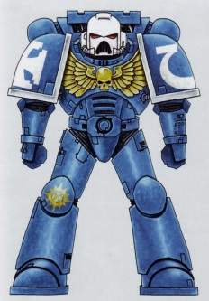
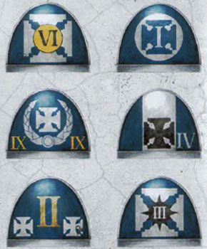
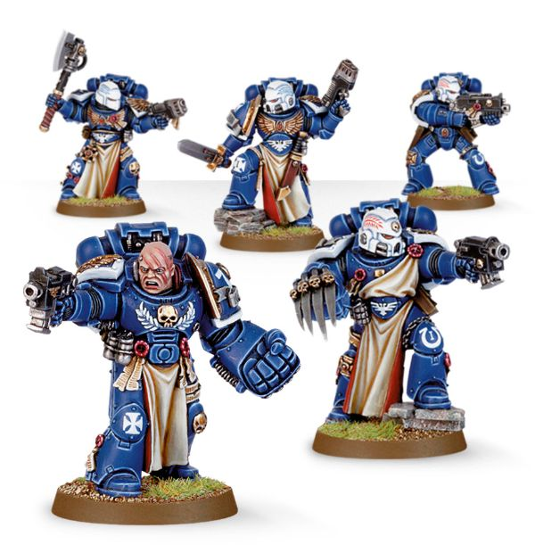

# 0288 老兵小队 Veteran Squad

精校状态：中文行文已逐段精校，部分术语仍为暂定

分类：通用概念 / 帝国 Imperium / 中央政务部 Adeptus Terra / 阿斯塔特修会 Adeptus Astartes

原文来源：https://www.bilibili.com/opus/1036603916119179267

原作者：帝国神选罐头

原文时间：编辑于 2025年07月26日 11:46

[返回分类目录](目录.md) · [全书目录](../../目录.md)

<!-- A0288-B0001 -->
**英文原文**

Veteran Space Marines are mostly members of the 1st Company of a Space Marine Chapter, the so called Veteran Company. They form the Chapter's battle-hardened core and have wide access to its armoury. Recently, though predominately identified with the 1st Company, each Space Marine Company maintains its own Veteran Squads.

<!-- /A0288-B0001 -->

<!-- A0288-B0002 -->

原译文

星际战士老兵大多是星际战士战团第一连的成员，即所谓的老兵连。他们构成了该战团久经沙场的核心，可以广泛使用其军械库。最近，虽然主要与第一连联系在一起，但每个星际战士连队都有自己的老兵小队。

**校订译文**

星际战士老兵大多隶属战团第一连，也就是老兵连。他们是战团久经战火考验的核心，拥有广泛调用军械库装备的权利。不过，近来虽仍以第一连最为集中，各个星际战士连也都保有自己的老兵小队。

<!-- /A0288-B0002 -->

<!-- A0288-B0003 图片 -->

<!-- A0288-B0004 -->

原译文

Ultramarines Firstborn Veteran 极限战士长子老兵

**校订译文**

Ultramarines Firstborn Veteran 极限战士长子老兵

<!-- /A0288-B0004 -->

<!-- A0288-B0005 -->
## Overview 概述

<!-- /A0288-B0005 -->

<!-- A0288-B0006 -->
**英文原文**

To be promoted into the 1st Company is a great honour for all battle-brothers. Those that have proven themselves worthy usually have centuries of service behind them and have risen to the rank of a sergeant. Sometimes a less experienced Marine may be accepted after committing several acts of outstanding heroism. The Marines of the 1st Company bear the privilege of taking the Chapter's finest and most revered equipment to battle, as well as the duty to return with it afterwards.

<!-- /A0288-B0006 -->

<!-- A0288-B0007 -->

原译文

晋升为第一连队是所有战斗兄弟的莫大荣誉。那些证明自己值得的人通常有几个世纪的服役经验，并已晋升为军士。有时，一个经验不足的星际战士在做出几次杰出的英勇行为后可能会被接受。第一连的星际战士有权携带战团最精良、最受尊敬的装备参加战斗，并有义务在战斗结束后携带这些装备返回。

**校订译文**

晋入第一连，是每位战斗兄弟的莫大荣誉。获选者通常已服役数百年，并晋升为军士；有时，资历较浅的战士也会因屡建奇功而获准加入。第一连战士有权携带战团最精良、最受尊崇的装备出征，也有责任将其完好带回。

<!-- /A0288-B0007 -->

<!-- A0288-B0008 图片 -->

<!-- A0288-B0009 -->

原译文

Shoulder pads with Veteran heraldry 肩甲老兵纹章

**校订译文**

Shoulder pads with Veteran heraldry 肩甲老兵纹章

<!-- /A0288-B0009 -->

<!-- A0288-B0010 -->
**英文原文**

Most frequently, 1st Company Veteran squads are attached to other Space Marine strike forces rather than the entire formation fighting as one. They are usually used as a devastatingly powerful adaptable force, capable of performing any role required of them. When working with other forces, they serve as peerless mentors and share their wisdom and experience with their less experienced Battle Brothers. Because of their status, Veterans take their pick from their Chapter's armouries and thus each warrior wages war with their preferred weaponry. Commanders know that Veteran squads are best utilized when given a wide remit to prosecute the battle in whichever way they deem best. As such, Veteran squads are much less rigid in their doctrine than the Battle-Brothers of other companies.

<!-- /A0288-B0010 -->

<!-- A0288-B0011 -->

原译文

最常见的是，第一连老兵小队隶属于其他星际战士打击部队，而不是整个编队作为一个整体作战。他们通常被用作一种具有毁灭性的强大适应力，能够执行任何需要他们的角色。在与其他部队合作时，他们担任无与伦比的导师，并与经验不足的战斗兄弟分享他们的智慧和经验。由于他们的地位，老兵从他们战团的军械库中挑选武器，因此每个战士都用他们喜欢的武器发动战争。指挥官们知道，当老兵小队被赋予广泛的职权，以他们认为最好的方式进行战斗时，他们会得到最好的利用。因此，与其他连队的战斗兄弟相比，老兵小队的教义要宽松得多。

**校订译文**

第一连的老兵小队通常分配给其他星际战士打击部队，而不以全连集结的方式出战。他们战力惊人、应变灵活，能够承担任何所需任务。与其他部队并肩作战时，他们也是最优秀的导师，向年轻战斗兄弟传授经验与智慧。老兵可以从战团军械库自行挑选装备，以最擅长的武器迎敌。指挥官深知，让老兵小队自由选择他们认为最有效的战法，才能充分发挥其威力；因此，他们对作战条令的遵循，远比其他连队灵活。

<!-- /A0288-B0011 -->

<!-- A0288-B0012 图片 -->

<!-- A0288-B0013 -->

原译文

Veterans 老兵

**校订译文**

Veterans 老兵

<!-- /A0288-B0013 -->

<!-- A0288-B0014 -->
## Heraldry 纹章

<!-- /A0288-B0014 -->

<!-- A0288-B0015 -->
**英文原文**

Members of the 1st Company traditionally wear white helmets. The sergeant's red helmet is adorned with a white stripe.

<!-- /A0288-B0015 -->

<!-- A0288-B0016 -->

原译文

第一连的成员传统上戴白色头盔。中士的红色头盔上装饰着白色条纹。

**校订译文**

第一连传统上采用白色头盔；军士的头盔则为红色，并绘有一道白条纹。

<!-- /A0288-B0016 -->

<!-- A0288-B0017 -->
**英文原文**

Their power armour features white or silver trimmed shoulder pads. The tactical symbol on the right shoulder is a stylized cross which is derived from the Crux Terminatus. A small crux, known as "Terminator honours" is carried on the left knee pad.

<!-- /A0288-B0017 -->

<!-- A0288-B0018 -->

原译文

他们的动力盔甲有白色或银色镶边的护肩。右肩上的战术符号是一个风格化的十字架，源自终结者十字章。左肩甲上有一个被称为“终结者荣誉”的小十字章。

**校订译文**

他们的动力甲肩甲采用白色或银色镶边。右肩的战术标志，是源自终结者十字章的变形十字；左膝甲还佩有一枚较小的十字徽，称为“终结者荣誉”。

**校注：** 英文为 left knee pad 左膝甲，原译错成左肩甲。

<!-- /A0288-B0018 -->

<!-- A0288-B0019 -->
## Veteran Squads 老兵小队

原题：Veteran Squads 变体小队

<!-- /A0288-B0019 -->

<!-- A0288-B0020 -->
**英文原文**

Terminators are trained to fight in Tactical Dreadnought Armour, the toughest armour the Chapter has to offer. Terminators that are geared for close combat fight together in Terminator Assault Squads.

<!-- /A0288-B0020 -->

<!-- A0288-B0021 -->

原译文

终结者经过训练，可以穿着战术无畏盔甲作战，这是战团提供的最坚固的盔甲。突击终结者小队是为近距离战斗而设计的终结者。

**校订译文**

终结者受过专门训练，能穿着战团最坚固的战术无畏护甲作战。专注近战的成员，则编入终结者突击小队。

<!-- /A0288-B0021 -->

<!-- A0288-B0022 -->
**英文原文**

Vanguard Veterans excel in close combat. Apart from a huge assortment of melee weapons, jump packs are often used to add the advantage of speed to their attacks.

<!-- /A0288-B0022 -->

<!-- A0288-B0023 -->

原译文

先锋老兵擅长近战。除了种类繁多的近战武器外，跳跃背包还经常被用来为他们的攻击增加速度优势。

**校订译文**

先锋老兵擅长近战。除了种类繁多的近战武器外，跳跃背包还经常被用来为他们的攻击增加速度优势。

<!-- /A0288-B0023 -->

<!-- A0288-B0024 -->
**英文原文**

Sternguard Veterans are experts at ranged combat. They rely on finely crafted weapons and highly specialised ammunition to take on all manners of foes.

<!-- /A0288-B0024 -->

<!-- A0288-B0025 -->

原译文

肃卫老兵是远程作战的专家。他们依靠精工武器和高度专业化的弹药来对付各种各样的敌人。

**校订译文**

肃卫老兵精通远程作战，依靠精工武器与特种弹药，应对各种敌人。

<!-- /A0288-B0025 -->

<!-- A0288-B0026 -->
**英文原文**

Bladeguard Veterans are a new type of Primaris Space Marine Veteran which serve in the First Company.

<!-- /A0288-B0026 -->

<!-- A0288-B0027 -->

原译文

剑卫老兵是在第一连服役的新型原铸星际战士老兵。

**校订译文**

剑卫老兵是在第一连服役的新型原铸星际战士老兵。

<!-- /A0288-B0027 -->

<!-- A0288-B0028 -->
**英文原文**

Veteran Intercessor and Veteran Assault Intercessor squads.

<!-- /A0288-B0028 -->

<!-- A0288-B0029 -->

原译文

仲裁者老兵和突击仲裁者老兵小队。

**校订译文**

仲裁者老兵和突击仲裁者老兵小队。

<!-- /A0288-B0029 -->

<!-- A0288-B0030 -->
**英文原文**

Company Veterans are the fighting elite of their respective company and act as their Captain's bodyguards and closest advisors. They equip themselves for any battlefield situation, leading offensives or reinforcing weakening elements of the battle line.

<!-- /A0288-B0030 -->

<!-- A0288-B0031 -->

原译文

连队老兵是各自连队的战斗精英，担任连长的护卫和最亲密的顾问。他们为任何战场情况做好准备，领导进攻或加强战线的薄弱环节。

**校订译文**

连队老兵是各自连队的精锐，担任连长的护卫与亲近顾问。他们按战场需要选择装备，既能率先发动攻势，也能增援战线上的薄弱部位。

<!-- /A0288-B0031 -->

<!-- A0288-B0032 -->
## Chapter Variants 各战团的不同编制

原题：Chapter Variants 战团变体

<!-- /A0288-B0032 -->

<!-- A0288-B0033 -->
**英文原文**

Some Codex-divergent Chapters have their own unique veteran formations. Below are some notable examples:

<!-- /A0288-B0033 -->

<!-- A0288-B0034 -->

原译文

一些圣典分歧战团有自己独特的老兵编队。以下是一些值得注意的例子：

**校订译文**

一些未完全遵循《阿斯塔特圣典》的战团，拥有独特的老兵编队，例如：

<!-- /A0288-B0034 -->

<!-- A0288-B0035 -->
**英文原文**

The Sword Brethren of the Black Templars

<!-- /A0288-B0035 -->

<!-- A0288-B0036 -->

原译文

黑色圣堂的圣剑兄弟会

**校订译文**

黑色圣堂的圣剑兄弟会

<!-- /A0288-B0036 -->

<!-- A0288-B0037 -->
**英文原文**

The Wolf Guard of the Space Wolves

<!-- /A0288-B0037 -->

<!-- A0288-B0038 -->

原译文

太空野狼的野狼守卫

**校订译文**

太空野狼的野狼守卫

<!-- /A0288-B0038 -->

<!-- A0288-B0039 -->
**英文原文**

The Deathwing of the Dark Angels and their successors

<!-- /A0288-B0039 -->

<!-- A0288-B0040 -->

原译文

黑暗天使及其子战团的死翼

**校订译文**

黑暗天使及其子战团的死翼

<!-- /A0288-B0040 -->

<!-- A0288-B0041 -->
**英文原文**

The Sanguinary Guard of the Blood Angels and their Successors

<!-- /A0288-B0041 -->

<!-- A0288-B0042 -->

原译文

圣血天使及其子战团的圣血卫队

**校订译文**

圣血天使及其子战团的圣血守卫

<!-- /A0288-B0042 -->

<!-- A0288-B0043 -->
**英文原文**

The Tempest Blades of the Storm Wardens

<!-- /A0288-B0043 -->

<!-- A0288-B0044 -->

原译文

风暴看守者的暴风之刃

**校订译文**

风暴看守者的暴风之刃

<!-- /A0288-B0044 -->

<!-- A0288-B0045 -->
**英文原文**

The Firedrakes of the Salamanders

<!-- /A0288-B0045 -->

<!-- A0288-B0046 -->

原译文

火蜥蜴的火龙

**校订译文**

火蜥蜴的火龙

<!-- /A0288-B0046 -->

<!-- A0288-B0047 -->
**英文原文**

The Morlocks of the Iron Hands

<!-- /A0288-B0047 -->

<!-- A0288-B0048 -->

原译文

钢铁之手的莫洛克

**校订译文**

钢铁之手的莫洛克

<!-- /A0288-B0048 -->

本篇核心术语与暂定项

以下列出本篇出现的英文原形及核心术语表用词。同形词可能指不同对象，具体词义以本篇正文和校注为准；单复数、别名和仅见于图注的名称可能尚未列入。完整候选见[术语表](../../术语表/双语术语候选.csv)。

| 英文 | 采用中文 | 状态 |
| --- | --- | --- |
| Space Marines | 星际战士 | 官方已核对 |
| Black Templars | 黑色圣堂 | 官方已核对 |
| Blood Angels | 圣血天使 | 官方已核对 |
| Dark Angels | 黑暗天使 | 官方已核对 |
| Space Wolves | 太空野狼 | 官方已核对 |
| Terminator | 终结者 | 官方已核对 |
| Sanguinary | 圣血学派 | 暂定·学派语境 |
| Equipment | 装备 | 编辑用语已统一 |
| Iron Hands | 钢铁之手 | 暂定·官方待核 |
| Salamanders | 火蜥蜴 | 暂定·官方待核 |
| Mentors | 导师战团 | 暂定·官方待核 |
| Sanguinary Guard | 圣血守卫 | 官方已核对 |
| Power Armour | 动力盔甲 | 暂定·官方待核 |
| Space Marine | 星际战士 | 暂定·官方待核 |
| Chapter | 战团 | 暂定·官方待核 |
| Captain | 连长 | 暂定·官方待核 |
| Veteran | 老兵 | 暂定·官方待核 |
| Terminators | 终结者 | 暂定·官方待核 |
| Sergeant | 军士 | 暂定·官方待核 |
| Vanguard | 先锋 | 暂定·官方待核 |
| Primaris Space Marine | 原铸星际战士 | 暂定·官方待核 |
| The Black Templars | 黑色圣堂 | 暂定·官方待核 |
| Armoury | 军械库 | 暂定·官方待核 |
| Sternguard Veterans | 肃卫老兵 | 暂定·官方待核 |
| Vanguard Veterans | 先锋老兵 | 暂定·官方待核 |
| Assault Squads | 突击小队 | 暂定·官方待核 |
| Intercessor | 仲裁者 | 暂定·官方待核 |
| Veteran Intercessor | 仲裁者老兵 | 暂定·官方待核 |
| Storm Wardens | 风暴看守者 | 暂定·官方待核 |
| Space Marine Company | 星际战士连队 | 暂定·官方待核 |
| Veteran Company | 老兵连队 | 暂定·官方待核 |
| Terminator Assault Squads | 终结者突击小队 | 暂定·官方待核 |
| Risen | 赦天使 | 暂定·官方待核 |
| Wolf Guard | 野狼守卫 | 官方词根参考·通称待核 |
| Sword Brethren | 圣剑兄弟会 | 官方词根参考·通称待核 |
| Dreadnought | 无畏机甲 | 暂定·官方待核 |
| Morlocks | 莫洛克 | 暂定·官方待核 |
| Firedrakes | 火龙 | 暂定·官方待核 |
| Bear | 熊 | 暂定·官方待核 |
| The Dark | 《黑暗》 | 暂定·官方待核 |
| The Blood | 鲜血 | 暂定·官方待核 |
| Crux | 南十字 | 暂定·官方待核 |
| Crux Terminatus | 终结者十字章 | 暂定·官方待核 |

