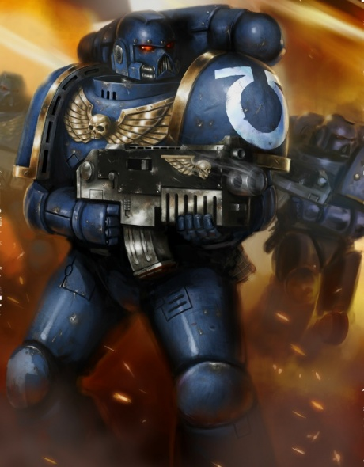
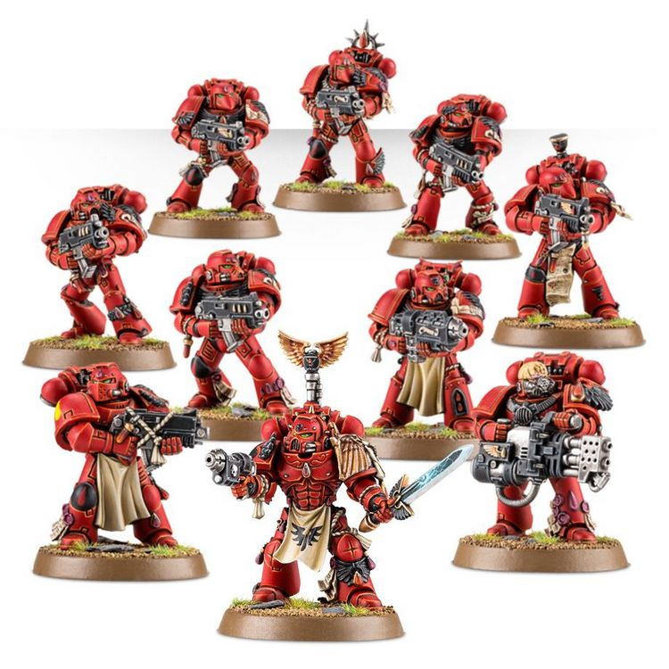

# 0289 战术小队 Tactical Squad

精校状态：中文行文已逐段精校，部分术语仍为暂定

分类：通用概念 / 帝国 Imperium / 中央政务部 Adeptus Terra / 阿斯塔特修会 Adeptus Astartes

原文来源：https://www.bilibili.com/opus/1035086456916279301

原作者：帝国神选罐头

原文时间：2025年02月18日 08:24

[返回分类目录](目录.md) · [全书目录](../../目录.md)

<!-- A0289-B0001 -->
**英文原文**

Of the Tactical Space Marine, bedrock of his Chapter and paragon to his brothers, I shall tell thee.

<!-- /A0289-B0001 -->

<!-- A0289-B0002 -->
**英文原文**

He shall be steeped in the lore of battle and schooled in all manner of weapon and strategy. With combat blade, boltgun and grenade he shall assail the foe. But these are mere tools: a Tactical Marine's true weapons are his courage, his wits, and his dedication to his brothers.

<!-- /A0289-B0002 -->

<!-- A0289-B0003 -->
**英文原文**

He will bring his foe to battle in a manner and time of his choosing, never himself caught unready or ill-prepared for the task at hand. In defence he shall be stalwart as the mountain, a bulwark stood firm against the enemies of Man. In attack he shall strike with the wrath of the Immortal Emperor, felling the foe without mercy, remorse, or fear.

<!-- /A0289-B0003 -->

<!-- A0289-B0004 -->
**英文原文**

Roboute Guilliman, quoted in the Apocrypha of Skaros

<!-- /A0289-B0004 -->

<!-- A0289-B0005 -->

原译文

关于战术星际战士，他们是战团的基石，是兄弟们的楷模，我将讲述。

**校订译文**

战术星际战士，是战团的基石、兄弟们的楷模。关于他们，我将如此告诫汝等：

<!-- /A0289-B0005 -->

<!-- A0289-B0006 -->

原译文

战术星际战士应沉浸于战斗知识的海洋，研习各类武器与战略。他将手持战斗刀、爆弹枪与手榴弹，向敌人发起攻击。但这些不过是工具而已：战术星际战士真正的武器，是他的勇气、智慧，以及对兄弟们的奉献精神。

**校订译文**

他须精研战斗之学，通晓一切武器与战略；以战斗短刃、爆矢枪和手榴弹迎击敌人。然而，这些不过是工具。他真正的武器，是勇气、智慧，以及对兄弟们的忠诚。

<!-- /A0289-B0006 -->

<!-- A0289-B0007 -->

原译文

他会选择合适的时机与方式，主动与敌人交战，面对手头的任务，永远不会毫无准备或准备不足。防守时，他将如高山般坚毅，是抵御人类之敌的坚固壁垒。进攻时，他将带着不朽帝皇的怒火出击，无情、无悔、无畏地击倒敌人。

**校订译文**

他会选择合适的时机与方式，主动与敌人交战，面对手头的任务，永远不会毫无准备或准备不足。防守时，他将如高山般坚毅，是抵御人类之敌的坚固壁垒。进攻时，他将带着不朽帝皇的怒火出击，无情、无悔、无畏地击倒敌人。

<!-- /A0289-B0007 -->

<!-- A0289-B0008 -->

原译文

罗伯特·基里曼，引自斯卡罗斯经书

**校订译文**

——罗保特·基里曼，载于《斯卡罗斯次经》

**校注：** Apocrypha of Skaros 暂译斯卡罗斯次经，与第0232篇标题统一；保留其书名性质。

<!-- /A0289-B0008 -->

<!-- A0289-B0009 -->
**英文原文**

A Tactical Squad is a type of Firstborn warrior formation in a Space Marine army. A Tactical Squad is the most versatile and tactically flexible force in the Space Marine army, making up the majority of the four Battle Companies and the entirety of two of the four Reserve Companies in a typical Codex Chapter. This makes them the most common type of unit in the Space Marine forces.

<!-- /A0289-B0009 -->

<!-- A0289-B0010 -->

原译文

战术小队是星际战士中的一种长子战士编队。战术小队是星际战士中最多才多艺、战术最灵活的部队，在典型的圣典战团中，它构成了四个战斗连的大部分和四个预备连中的两个的全部。这使他们成为星际战士中最常见的部队类型。

**校订译文**

战术小队是由长子星际战士组成的部队，也是星际战士军队中用途最广、战术最灵活的单位。在典型的圣典战团中，四个战斗连的大部分兵力，以及四个预备连中的整整两个连，都由战术小队构成。因此，它们也是星际战士中最常见的单位。

<!-- /A0289-B0010 -->

<!-- A0289-B0011 图片 -->

<!-- A0289-B0012 -->

原译文

Ultramarines Tactical Squad Marine 极限战士战术小队战士

**校订译文**

Ultramarines Tactical Squad Marine 极限战士战术小队战士

<!-- /A0289-B0012 -->

<!-- A0289-B0013 -->
## Training and Deployment 训练与部署

<!-- /A0289-B0013 -->

<!-- A0289-B0014 -->
**英文原文**

Prior to service in a Tactical Squad, Space Marines must prove themselves capable in all aspects of warfare by completing several campaigns in Assault and Devastator Squads, a process that can last years or decades. Not all Space Marines are able to make the transition, either possessing a particular talent or obsession within one area, or simply lacking the mental flexibility required to embrace the Tactical Squad's fluid nature.

<!-- /A0289-B0014 -->

<!-- A0289-B0015 -->

原译文

在战术小队服役之前，星际战士必须通过在突击和毁灭小队完成几次战役来证明自己在战争的各个方面都有能力，这一过程可能会持续数年或数十年。并非所有星际战士都能实现这种转变，要么在一个领域内拥有特定的天赋或痴迷，要么只是缺乏接受战术小队流动性所需的灵活心理。

**校订译文**

加入战术小队前，星际战士须先在突击小队与破坏者小队中参加多场战役，证明自己能够胜任战争的各个方面；这一过程可能持续数年，甚至数十年。并非所有人都能完成转变：有些战士的天赋或兴趣过于集中于某一领域，有些则缺乏战术小队灵活应变所需的思维弹性。

<!-- /A0289-B0015 -->

<!-- A0289-B0016 图片 -->

<!-- A0289-B0017 -->

原译文

Blood Angels Tactical Squad 圣血天使战术小队

**校订译文**

Blood Angels Tactical Squad 圣血天使战术小队

<!-- /A0289-B0017 -->

<!-- A0289-B0018 -->
**英文原文**

The basic squad is made up of four Space Marines and one Space Marine Sergeant; up to five additional Marines may be added.

<!-- /A0289-B0018 -->

<!-- A0289-B0019 -->

原译文

小队基础由四名星际战士和一名星际战士军士组成；最多可以增加五名星际战士。

**校订译文**

基本编制为一名星际战士军士与四名战士，最多可再增加五名战士。

<!-- /A0289-B0019 -->

<!-- A0289-B0020 -->
## Equipment 装备

<!-- /A0289-B0020 -->

<!-- A0289-B0021 -->
**英文原文**

All Tactical Marines wear the standard Space Marine power armour and carry a bolt pistol, a boltgun, Combat Knife and frag and krak grenades. They may also be armed with a variety of Flamers, Meltaguns, Plasma Guns, Grav-Guns, Heavy Bolters, Heavy Flamers, Lascannons, Missile Launchers, Multi-meltas, Plasma Cannons and Grav-Cannons.

<!-- /A0289-B0021 -->

<!-- A0289-B0022 -->

原译文

所有战术星际战士都穿着标准的星际战士动力盔甲，并携带一把爆矢手枪、一挺爆矢枪、战斗刀以及破片和穿甲手榴弹。他们还可能配备各种火焰枪、热熔枪、等离子枪、重力枪、重型爆矢枪、重型火焰枪、激光炮、导弹发射器、多管热熔、等离子炮和重力炮。

**校订译文**

所有战术星际战士都穿着标准动力甲，携带爆矢手枪、爆矢枪、战斗刀，以及破片和穿甲手榴弹。其他可选武器包括喷火器、热熔枪、等离子枪、重力枪、重型爆矢枪、重型喷火器、激光炮、导弹发射器、多管热熔、等离子炮和重力炮。

<!-- /A0289-B0022 -->

<!-- A0289-B0023 -->
**英文原文**

The Space Marine Sergeant may also have melta bombs and teleport homer, and can exchange his boltgun and/or bolt pistol for a Chainsword, Combi-melta, Combi-flamer, Combi-plasma, Combi-grav, Storm Bolter, Plasma pistol, Grav-pistol, Power weapon, or Power fist.

<!-- /A0289-B0023 -->

<!-- A0289-B0024 -->

原译文

星际战士军士也可能拥有热熔炸弹和传送信标，并可以将他的爆矢枪和/或爆矢手枪换成链锯剑、复合热熔枪、复合火焰枪、复合等离子枪、复合重力枪、风暴爆矢枪、等离子手枪、重力手枪、动力武器或动力拳。

**校订译文**

星际战士军士也可能拥有热熔炸弹和传送信标，并可以将他的爆矢枪和/或爆矢手枪换成链锯剑、复合热熔枪、复合喷火器、复合等离子枪、复合重力枪、风暴爆矢枪、等离子手枪、重力手枪、动力武器或动力拳。

**校注：** 已核同一人物、组织、型号或事件，与全书核心术语及后续专篇统一；原译保留对照。

<!-- /A0289-B0024 -->

本篇核心术语与暂定项

以下列出本篇出现的英文原形及核心术语表用词。同形词可能指不同对象，具体词义以本篇正文和校注为准；单复数、别名和仅见于图注的名称可能尚未列入。完整候选见[术语表](../../术语表/双语术语候选.csv)。

| 英文 | 采用中文 | 状态 |
| --- | --- | --- |
| Space Marines | 星际战士 | 官方已核对 |
| Boltgun | 爆矢枪 | 官方已核对 |
| Bolt Pistol | 爆矢手枪 | 官方已核对 |
| Chainsword | 链锯剑 | 官方已核对 |
| Roboute Guilliman | 罗保特·基里曼 | 官方已核对 |
| Teleport Homer | 传送信标 | 暂定·官方待核 |
| Emperor | 帝皇 | 官方已核对 |
| Apocrypha of Skaros | 斯卡罗斯次经 | 暂定·官方待核 |
| Tactical Squad | 战术小队 | 官方已核对 |
| Power Armour | 动力盔甲 | 暂定·官方待核 |
| Krak Grenades | 穿甲手榴弹 | 暂定·官方待核 |
| Space Marine | 星际战士 | 暂定·官方待核 |
| Chapter | 战团 | 暂定·官方待核 |
| Sergeant | 军士 | 暂定·官方待核 |
| Devastator | 破坏者 | 暂定·官方待核 |
| Firstborn | 长子 | 暂定·官方待核 |
| Devastator Squads | 破坏者小队 | 暂定·官方待核 |
| Codex Chapter | 圣典战团 | 暂定·官方待核 |
| Missile Launchers | 导弹发射器 | 暂定·官方待核 |
| Battle Companies | 战斗连队 | 暂定·官方待核 |
| Reserve Companies | 预备连队 | 暂定·官方待核 |
| Flamers | 火妖（奸奇单位）／火焰喷射器（武器） | 语境定译·对应官译已核 |
| Bulwark | 壁垒号 | 暂定·官方待核 |
| Tactical Marine | 战术战士 | 暂定·官方待核 |
| Mercy | 仁慈 | 暂定·官方待核 |
| Combi-Flamer | 复合喷火器 | 暂定·官方待核 |
| Combi-Melta | 复合热熔枪 | 暂定·官方待核 |
| Bolt | 爆矢 | 暂定·官方待核 |
| Bolter | 爆矢枪 | 暂定·官方待核 |
| Storm bolter | 风暴爆矢枪 | 官方已核对 |
| Flamer | 火焰喷射器（武器）／火妖（奸奇单位） | 语境定译·对应官译已核 |
| Combi-Grav | 复合重力枪 | 暂定·官方待核 |
| Grav-Pistol | 重力手枪 | 暂定·官方待核 |
| Combat Knife | 战斗刀 | 暂定·官方待核 |
| Plasma pistol | 等离子手枪 | 官方已核对 |
| Grenade | 手榴弹 | 暂定·官方待核 |
| Power fist | 动力拳 | 官方已核对 |
| Power weapon | 动力武器 | 官方已核对 |

