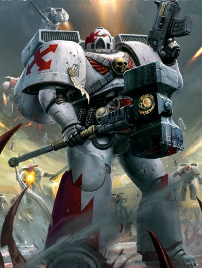
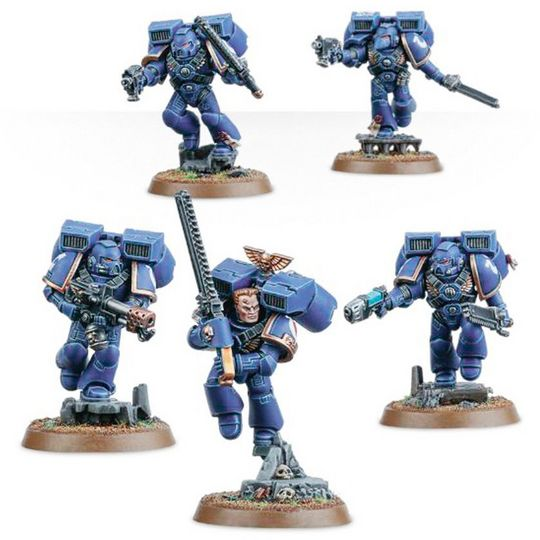

# 0290 突击小队 Assault Squad

精校状态：中文行文已逐段精校，部分术语仍为暂定

分类：通用概念 / 帝国 Imperium / 中央政务部 Adeptus Terra / 阿斯塔特修会 Adeptus Astartes

原文来源：https://www.bilibili.com/opus/1018747508008943625

原作者：帝国神选罐头

原文时间：2025年01月05日 07:40

[返回分类目录](目录.md) · [全书目录](../../目录.md)

<!-- A0290-B0001 -->
**英文原文**

And of the Assault Marine so do I decree:

<!-- /A0290-B0001 -->

<!-- A0290-B0002 -->
**英文原文**

He shall descend upon the perfidious foe as an Angel of Judgment from on high. Let the jump pack be his wings, and the roar of its engines a hymn of retribution.

<!-- /A0290-B0002 -->

<!-- A0290-B0003 -->
**英文原文**

Let the chainsword be his sceptre of decree, its harsh voice singing joyfully with each and every blow. With it shall the Assault Marine bring bloody retribution to the heretic, the traitor, and all alien aggressors who trespass on the Emperor's domain.

<!-- /A0290-B0003 -->

<!-- A0290-B0004 -->
**英文原文**

So will the Assault Marine be the hunter of warlords and the slayer of kings. His armour shall run slick with the life-blood of the vanquished, and all shall honour his name.

<!-- /A0290-B0004 -->

<!-- A0290-B0005 -->
**英文原文**

Roboute Guilliman, quoted in the Apocrypha of Skaros

<!-- /A0290-B0005 -->

<!-- A0290-B0006 -->

原译文

关于突击星际战士，我如此下令：

**校订译文**

关于突击星际战士，我如此下令：

<!-- /A0290-B0006 -->

<!-- A0290-B0007 -->

原译文

他将如同来自高空的审判天使般降临在背信弃义的敌人身上。让跳跃背包成为他的翅膀，引擎的轰鸣声成为复仇的赞歌。让链锯剑成为他的裁决权杖，其刺耳的声音在每一次挥击中欢快地歌唱。凭借此，突击星际战士将给异端、叛徒以及所有侵犯帝皇领地的外星侵略者带来血腥的报复。因此，突击星际战士将成为军阀的猎手和国王的杀戮者。他的盔甲将被战败者的鲜血浸湿，所有人都将尊崇他的名字。

**校订译文**

他将如同来自高空的审判天使般降临在背信弃义的敌人身上。让跳跃背包成为他的翅膀，引擎的轰鸣声成为复仇的赞歌。让链锯剑成为他的裁决权杖，其刺耳的声音在每一次挥击中欢快地歌唱。凭借此，突击星际战士将给异端、叛徒以及所有侵犯帝皇领地的外星侵略者带来血腥的报复。因此，突击星际战士将成为军阀的猎手和国王的杀戮者。他的盔甲将被战败者的鲜血浸湿，所有人都将尊崇他的名字。

<!-- /A0290-B0007 -->

<!-- A0290-B0008 -->

原译文

罗伯特·基里曼，引自斯卡罗斯经书

**校订译文**

——罗保特·基里曼，载于《斯卡罗斯次经》

<!-- /A0290-B0008 -->

<!-- A0290-B0009 -->
**英文原文**

An Assault Squad is a Firstborn Space Marine unit that excels at close combat. In a typical Codex Chapter, two Assault Squads make up part of each of the four Battle Companies, and the entire 8th Reserve Company is composed of Assault Squads, meaning such a chapter has 18 Assault Squads.

<!-- /A0290-B0009 -->

<!-- A0290-B0010 -->

原译文

突击小队是长子星际战士，擅长近战。在一个典型的圣典战团中，四个战斗连各有两个突击小队，整个第八预备连由突击小队组成，这意味着这样一个战团有18个突击小队。

**校订译文**

突击小队是由长子星际战士组成的近战单位。在典型的圣典战团中，四个战斗连各编有两个突击小队，第八预备连则完全由突击小队组成，全团共计十八个。

<!-- /A0290-B0010 -->

<!-- A0290-B0011 图片 -->

<!-- A0290-B0012 -->

原译文

White Scars Assault Squad 白疤突击小队

**校订译文**

White Scars Assault Squad 白疤突击小队

<!-- /A0290-B0012 -->

<!-- A0290-B0013 -->
## Training and Deployment 训练和部署

<!-- /A0290-B0013 -->

<!-- A0290-B0014 -->
**英文原文**

Marines are commonly assigned to Assault Squads after exemplary service in a Devastator Squad, where they have garnered experience in holding their ground against any foe. As an Assault Marine, they must not only prove themselves in close combat, but learn other vital skills, such as the operation and maintenance of Space Marine Bikes and Land Speeders. Assault Squads are used for a variety of roles; reconnaissance-in-force, decapitation strikes, and counter-assault missions are common assignments for Assault Squads.

<!-- /A0290-B0014 -->

<!-- A0290-B0015 -->

原译文

星际战士通常在毁灭者小队服役后被分配到突击小队，在那里他们积累了对抗任何敌人的经验。作为一名突击星际战士，他们不仅要在近距离战斗中证明自己，还要学习其他重要技能，如星际战士摩托和兰德速攻艇的操作和维护。突击小队被用于各种角色；突击小队的常见任务包括部队侦察、斩首打击和反击任务。

**校订译文**

星际战士通常先在破坏者小队中表现出色，积累坚守阵地、抵御强敌的经验，才会被调入突击小队。突击战士不仅要证明自己的近战能力，还须学习摩托与兰德速攻艇的操作、维护等关键技能。他们承担多种任务，常见的包括武装侦察、斩首打击与反突击。

<!-- /A0290-B0015 -->

<!-- A0290-B0016 -->
**英文原文**

The Assault Squad is made up of four to nine Assault Marines, led by a Space Marine Sergeant. Because they often operate far ahead of the main force, the Sergeant has a direct uplink to the myriad datastreams and tactical overlays used to coordinate the Space Marine army, allowing for complete situational awareness.

<!-- /A0290-B0016 -->

<!-- A0290-B0017 -->

原译文

突击小队由四至九名突击星际战士组成，由一名星际战士军士领导。由于他们经常在主力部队之前行动，军士可以直接连接到用于协调星际战士的大量数据流和战术覆盖，从而实现完全的情景感知。

**校订译文**

突击小队由一名星际战士军士率领四至九名突击战士。由于小队常远远超前于主力行动，军士能够直接接入用于协调部队的数据流与战术态势图，从而全面掌握战场情况。

<!-- /A0290-B0017 -->

<!-- A0290-B0018 -->
## Equipment 装备

<!-- /A0290-B0018 -->

<!-- A0290-B0019 -->
**英文原文**

Besides their power armour, Assault Marines are commonly armed with a bolt pistol, chainsword, frag and krak grenades, and equipped with jump packs. These jump packs not only allow them to quickly traverse dangerous terrain with ease, but also for controlled low-altitude descents from Thunderhawk Gunships. When required, the Assault Marines may forgo their jump packs, instead riding into battle in a Rhino or Drop Pod. One squadmate may replace his bolt pistol and carry a flamer instead, while another can replace his for a plasma pistol.

<!-- /A0290-B0019 -->

<!-- A0290-B0020 -->

原译文

除了他们的动力盔甲外，突击星际战士通常还装备有爆矢手枪、链锯剑、破片和穿甲手榴弹，并配备跳跃背包。这些跳跃背包不仅使它们能够轻松快速地穿越危险地形，还可以从雷鹰炮艇进行受控的低空降落。必要时，突击星际战士可以放弃他们的跳跃背包，而是乘坐犀牛或空降仓进入战斗。一名队员可以更换他的爆矢手枪并携带火焰枪，而另一名队员则可以更换他的等离子手枪。

**校订译文**

突击战士身穿动力甲，通常携带爆矢手枪、链锯剑、破片与穿甲手榴弹，并装备跳跃背包。背包既能帮助他们迅速越过危险地形，也能让他们从雷鹰炮艇进行可控的低空跃降。必要时，他们会卸下背包，改乘犀牛战车或空降舱。一名队员可将爆矢手枪换成喷火器，另一名则可换成等离子手枪。

**校注：** 另一名战士用等离子手枪替换爆矢手枪，原译遗漏替换对象。

<!-- /A0290-B0020 -->

<!-- A0290-B0021 图片 -->

<!-- A0290-B0022 -->

原译文

Assault squad 突击小队

**校订译文**

Assault squad 突击小队

<!-- /A0290-B0022 -->

<!-- A0290-B0023 -->
**英文原文**

The Sergeant can also carry melta bombs and a combat shield into battle. He can also replace his bolt pistol and/or chainsword with a storm shield, plasma pistol, grav-pistol, power weapon, power fist, Eviscerator, thunder hammer, and either one or a pair of lightning claws.

<!-- /A0290-B0023 -->

<!-- A0290-B0024 -->

原译文

军士还可以携带热熔炸弹和战斗盾进入战斗。他还可以用风暴盾、等离子手枪、重力手枪、动力武器、动力拳、开膛手、雷霆锤和一个或一对闪电爪代替他的爆矢手枪和/或链锯剑。

**校订译文**

军士还可以携带热熔炸弹和战斗盾进入战斗。他还可以用风暴盾、等离子手枪、重力手枪、动力武器、动力拳、开膛手、雷霆锤和一个或一对闪电爪代替他的爆矢手枪和/或链锯剑。

<!-- /A0290-B0024 -->

<!-- A0290-B0025 -->
## Chapter Variations 各战团的不同做法

原题：Chapter Variations 战团变体

<!-- /A0290-B0025 -->

<!-- A0290-B0026 -->
**英文原文**

Within the Space Wolves Chapter, Assault Squads are known as Skyclaws. Unlike their counterparts in Codex Chapters, most Skyclaws are Neophytes (called Blood Claws by the Chapter) whose first exposure to combat as a Space Marine is with close-combat weapons; Skyclaws are those Blood Claws who have demonstrated special aptitude for close quarters battle and the use of Jump Packs.

<!-- /A0290-B0026 -->

<!-- A0290-B0027 -->

原译文

在太空野狼战团中，突击小队被称为天爪。与圣典战团中的同行不同，大多数天爪是新进者（该战团称之为血爪），他们作为星际战士首次接触战斗是使用近战武器；天爪是指那些在近距离战斗和使用跳跃背包方面表现出特殊才能的血爪。

**校订译文**

太空野狼的突击小队称为天爪。与圣典战团的同类部队不同，天爪大多来自战团称为“血爪”的新兵；这些新兵初次以星际战士身份作战，便使用近战武器。其中在近身格斗与跳跃背包运用上展现特殊才能的人，才会成为天爪。

<!-- /A0290-B0027 -->

<!-- A0290-B0028 -->
**英文原文**

Due to the mostly aggressive style of warfare of the Blood Angels, scouts, after graduating, join the ranks of Assault Squads, rather than the Devastator Squads, as is demanded in the Codex Astartes.

<!-- /A0290-B0028 -->

<!-- A0290-B0029 -->

原译文

由于圣血天使的战争风格大多具有侵略性，侦察兵在结束服役后加入突击小队，而不是像阿斯塔特圣典中要求的那样加入毁灭者小队。

**校订译文**

圣血天使偏好猛烈进攻。因此，侦察兵完成训练后，通常先加入突击小队，而非按《阿斯塔特圣典》的规定进入破坏者小队。

<!-- /A0290-B0029 -->

本篇核心术语与暂定项

以下列出本篇出现的英文原形及核心术语表用词。同形词可能指不同对象，具体词义以本篇正文和校注为准；单复数、别名和仅见于图注的名称可能尚未列入。完整候选见[术语表](../../术语表/双语术语候选.csv)。

| 英文 | 采用中文 | 状态 |
| --- | --- | --- |
| Blood Angels | 圣血天使 | 官方已核对 |
| Space Wolves | 太空野狼 | 官方已核对 |
| Bolt Pistol | 爆矢手枪 | 官方已核对 |
| Chainsword | 链锯剑 | 官方已核对 |
| Roboute Guilliman | 罗保特·基里曼 | 官方已核对 |
| Emperor | 帝皇 | 官方已核对 |
| Apocrypha of Skaros | 斯卡罗斯次经 | 暂定·官方待核 |
| Rhino | 犀牛战车 | 官方已核对 |
| Devastator Squad | 破坏者小队 | 官方已核对 |
| Drop Pod | 空降舱 | 官方已核·中英对照 |
| Power Armour | 动力盔甲 | 暂定·官方待核 |
| Krak Grenades | 穿甲手榴弹 | 暂定·官方待核 |
| Space Marine | 星际战士 | 暂定·官方待核 |
| Chapter | 战团 | 暂定·官方待核 |
| Sergeant | 军士 | 暂定·官方待核 |
| Devastator | 破坏者 | 暂定·官方待核 |
| Codex Astartes | 阿斯塔特圣典 | 暂定·官方待核 |
| Land Speeders | 兰德速攻艇 | 暂定·官方待核 |
| Firstborn | 长子 | 暂定·官方待核 |
| Assault Squads | 突击小队 | 暂定·官方待核 |
| Devastator Squads | 破坏者小队 | 暂定·官方待核 |
| Codex Chapter | 圣典战团 | 暂定·官方待核 |
| Battle Companies | 战斗连队 | 暂定·官方待核 |
| Blood Claws | 血爪 | 官方已核对 |
| Bikes | 摩托 | 暂定·官方待核 |
| Assault Marine | 突击战士 | 暂定·官方待核 |
| The Blood | 鲜血 | 暂定·官方待核 |
| Thunder Hammer | 雷霆锤 | 暂定·官方待核 |
| Bolt | 爆矢 | 暂定·官方待核 |
| Flamer | 火焰喷射器（武器）／火妖（奸奇单位） | 语境定译·对应官译已核 |
| Grav-Pistol | 重力手枪 | 暂定·官方待核 |
| Plasma pistol | 等离子手枪 | 官方已核对 |
| Jump Pack | 跳跃背包 | 暂定·官方待核 |
| Power fist | 动力拳 | 官方已核对 |
| Power weapon | 动力武器 | 官方已核对 |
| Eviscerator | 开膛者 | 暂定·官方待核 |
| Combat Shield | 战斗盾 | 暂定·官方待核 |
| Storm Shield | 风暴盾 | 暂定·官方待核 |

