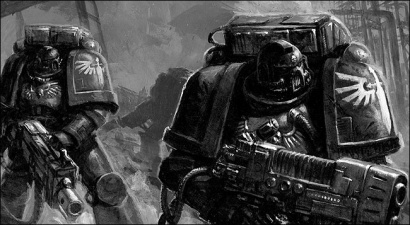
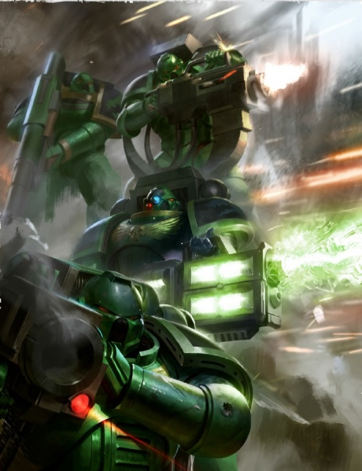
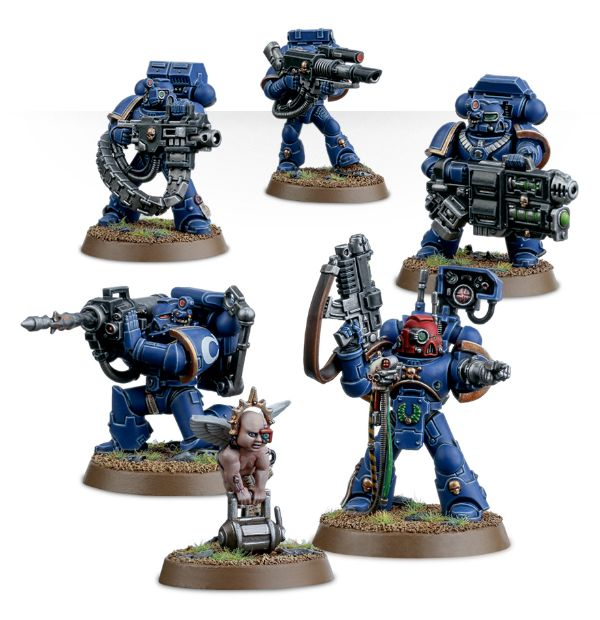

# 0291 破坏者小队 Devastator Squad

精校状态：中文行文已逐段精校，部分术语仍为暂定

分类：通用概念 / 帝国 Imperium / 中央政务部 Adeptus Terra / 阿斯塔特修会 Adeptus Astartes

原文来源：https://www.bilibili.com/opus/1022077439073845255

原作者：帝国神选罐头

原文时间：2025年01月14日 07:02

[返回分类目录](目录.md) · [全书目录](../../目录.md)

原篇名：毁灭者小队 Devastator Squad

<!-- A0291-B0001 -->
**英文原文**

A Devastator's reach shall be without limit and his touch without mercy. Fire shall roar from his fingertips, but it shall consume him not. Thunder will roar when he calls, yet it will swallow him not.

<!-- /A0291-B0001 -->

<!-- A0291-B0002 -->
**英文原文**

Let the Devastator squad be thy blazing wrath, bringing the light of the Emperor's justice to the darkest corners of the battlefield. Wherever he stands, that shall be his fortress of righteousness. He shall hold in his gift the fate of all who pass before his unblinking gaze.

<!-- /A0291-B0002 -->

<!-- A0291-B0003 -->
**英文原文**

All shall fear him, and he shall fear no one.

<!-- /A0291-B0003 -->

<!-- A0291-B0004 -->
**英文原文**

Roboute Guilliman, quoted in the Apocrypha of Skaros.

<!-- /A0291-B0004 -->

<!-- A0291-B0005 -->

原译文

毁灭者的影响无限，他的触碰毫不留情。火焰从他的指尖咆哮而出，但不会将他吞噬。当他高呼时雷声轰鸣，但不会将他吞没。

**校订译文**

破坏者之射程，当无所不至；其打击，当毫不留情。烈焰自指尖咆哮，却不能焚尽其身；雷霆应其呼唤而至，却不能将其吞没。

<!-- /A0291-B0005 -->

<!-- A0291-B0006 -->

原译文

让毁灭者小队成为炽热的愤怒，将帝皇的正义之光带到战场最黑暗的角落。无论他站在哪里，那里都将是他正义的堡垒。他将掌握所有在他坚定注视下经过之人的命运。

**校订译文**

让破坏者小队成为汝炽烈的怒火，将帝皇的正义之光带至战场最黑暗的角落。他立足之处，便是正义的堡垒；凡经过他不移目光之前者，其命运皆握于他手。

<!-- /A0291-B0006 -->

<!-- A0291-B0007 -->

原译文

所有人都将畏惧他，而他无所畏惧。

**校订译文**

所有人都将畏惧他，而他无所畏惧。

<!-- /A0291-B0007 -->

<!-- A0291-B0008 -->

原译文

罗伯特·基里曼，引自斯卡罗斯经书

**校订译文**

——罗保特·基里曼，载于《斯卡罗斯次经》

<!-- /A0291-B0008 -->

<!-- A0291-B0009 -->
**英文原文**

Devastator Squads are specialised Firstborn Space Marine squads tasked with long-range fire support, entrusted with the Chapter’s rarest heavy weaponry. In a typical Codex Chapter, two Devastator Squads are assigned to each of the four Battle Companies, while the entirety of the 9th Reserve Company is composed of Devastators.

<!-- /A0291-B0009 -->

<!-- A0291-B0010 -->

原译文

毁灭者小队是专业的长子星际战士小队，负责远程火力支援，并负责本战团最稀有的重型武器。在典型的圣典战团中，四个战斗连各有两个毁灭者小队，而整个第九预备连由毁灭者组成。

**校订译文**

破坏者小队是长子星际战士中的专门火力支援部队，负责远程支援，并获配战团最稀有的重武器。在典型的圣典战团中，四个战斗连各有两个破坏者小队，第九预备连则完全由破坏者组成。

<!-- /A0291-B0010 -->

<!-- A0291-B0011 图片 -->

<!-- A0291-B0012 -->

原译文

Dark Angels Devastators 黑暗天使毁灭者

**校订译文**

Dark Angels Devastators 黑暗天使破坏者

<!-- /A0291-B0012 -->

<!-- A0291-B0013 -->
## Training and Deployment 训练与部署

原题：Training and Deployment 培训和部署

<!-- /A0291-B0013 -->

<!-- A0291-B0014 -->
**英文原文**

Most Devastator Squads are composed of Space Marines who have recently been promoted from Scout Squads. Though veterans of dozens, even hundreds, of campaigns, service in a Devastator Squad will be their first experience in power armour as part of the main Space Marine army. Those newly-appointed to a Squad, armed only with basic gear, are given the primary duty of providing close support and calling out targets for their more experienced battle-brothers. These Space Marines are armed with the squad's four heavy weapons, an honour earned only after the Marine has proven himself steady and dependable in the heat of battle.

<!-- /A0291-B0014 -->

<!-- A0291-B0015 -->

原译文

大多数毁灭者小队由最近从侦察小队晋升的星际战士组成。尽管他们是经历过数十次，甚至数百次战役的老兵，但在毁灭者小队中服役将是他们作为星际战士主力部队的一员首次穿上动力甲的经历。那些被新任命到小队中、仅配备基本装备的人，被赋予为经验更丰富的战友提供近距离支援以及指出目标的首要职责。这些星际战士配备了该小队的四种重型武器，这是在星际战士在激烈的战斗中证明自己稳定可靠后才获得的荣誉。

**校订译文**

破坏者小队的多数成员，刚从侦察小队晋升而来。他们虽已参加数十场、甚至数百场战役，但此时才首次穿着动力甲，作为星际战士主力的一员作战。新调入者通常只有基础装备，主要为更有经验的战斗兄弟提供近距离支援，并指示目标。小队的四件重武器由这些资深成员使用；只有在激战中证明自己沉稳可靠的战士，才会获得这样的荣誉。

**校注：** 四件重武器由有经验的战士操作，原译代词含混并误写四种武器。

<!-- /A0291-B0015 -->

<!-- A0291-B0016 图片 -->

<!-- A0291-B0017 -->

原译文

Salamanders Devastator Squad 火蜥蜴毁灭者小队

**校订译文**

Salamanders Devastator Squad 火蜥蜴破坏者小队

<!-- /A0291-B0017 -->

<!-- A0291-B0018 -->
**英文原文**

The Devastator Squad is made up of between four to nine Devastator Marines and a Space Marine Sergeant. The type and use of these heavy weapons can vary greatly, depending on the mission or nature of the Chapter itself.

<!-- /A0291-B0018 -->

<!-- A0291-B0019 -->

原译文

毁灭者小队由四至九名毁灭者星际战士和一名星际战士军士组成。这些重型武器的类型和使用可能会有很大差异，这取决于该战团本身的性质或任务。

**校订译文**

破坏者小队由一名星际战士军士与四至九名破坏者组成。所用重武器的种类与战法，会随任务需要和战团特质而大幅变化。

<!-- /A0291-B0019 -->

<!-- A0291-B0020 -->
**英文原文**

After completing tours of service in the Devastators, Marines are typically assigned to Assault or Tactical Squads.

<!-- /A0291-B0020 -->

<!-- A0291-B0021 -->

原译文

在完成毁灭者的服役后，星际战士通常被分配到突击小队或战术小队。

**校订译文**

完成破坏者小队的轮值服役后，星际战士通常会调入突击小队或战术小队。

<!-- /A0291-B0021 -->

<!-- A0291-B0022 -->
## Chapter Variants 各战团的不同做法

原题：Chapter Variants 战团变体

<!-- /A0291-B0022 -->

<!-- A0291-B0023 -->
**英文原文**

The Dark Angels' combat doctrines favour the usage of devastating amounts of firepower over furious close combat assaults.

<!-- /A0291-B0023 -->

<!-- A0291-B0024 -->

原译文

黑暗天使的战斗理论倾向于使用毁灭性的火力，而不是激烈的近战攻击。

**校订译文**

黑暗天使的战斗理论倾向于使用毁灭性的火力，而不是激烈的近战攻击。

<!-- /A0291-B0024 -->

<!-- A0291-B0025 -->
**英文原文**

Within the Space Wolves Chapter, Devastator Squads are known as Long Fangs. Unlike their counterparts in the Codex Chapters, the Long Fangs are the most experienced of the Chapter's warriors, having completed lengthy tours of duty as Blood Claws and then Grey Hunters.

<!-- /A0291-B0025 -->

<!-- A0291-B0026 -->

原译文

在太空野狼战团中，毁灭者小队被称为长牙。与圣典战团中的同行不同，长牙是该战团中经验最丰富的战士，他们完成了漫长的血爪和灰猎之旅。

**校订译文**

太空野狼的破坏者小队称为长牙。与圣典战团的同类部队不同，长牙是战团经验最丰富的战士，先后经历了漫长的血爪与灰色猎手服役阶段。

<!-- /A0291-B0026 -->

<!-- A0291-B0027 -->
**英文原文**

Likewise, the Blood Angels chapter assigns only older and more experienced Marines to the Devastator Squads (mostly after they have worked out their aggression amid the ranks of the Assault Squads), since most Blood Angels have a marked preference for close quarters battle.

<!-- /A0291-B0027 -->

<!-- A0291-B0028 -->

原译文

同样，圣血天使战团只将年龄较大、经验丰富的星际战士分配给毁灭者小队（主要是在他们在突击小队中锻炼出侵略性之后），因为大多数圣血天使都明显更喜欢近距离战斗。

**校订译文**

圣血天使同样只将年长、经验丰富的星际战士调入破坏者小队，通常是在他们于突击小队中充分宣泄过好战冲动之后；这是因为大多数圣血天使都明显偏爱近战。

**校注：** worked out their aggression 指此前已宣泄好战冲动，原译锻炼出侵略性倒置原意。

<!-- /A0291-B0028 -->

<!-- A0291-B0029 -->
## Equipment 装备

<!-- /A0291-B0029 -->

<!-- A0291-B0030 -->
**英文原文**

In addition to their power armour, Devastator Marines are armed with bolt pistols, boltguns, frag and krak grenades. The Sergeant also carries a Signum and may be equipped with melta bombs as well. The Sergeant can also replace his boltgun and/or pistol for a chainsword, combi weapon, plasma pistol, Grav-pistol, power weapon, and power fist. For transportation the Squad can be carried into battle in a Drop Pod, Rhino or Razorback.

<!-- /A0291-B0030 -->

<!-- A0291-B0031 -->

原译文

除了他们的动力盔甲，毁灭者星际战士还装备了爆矢手枪、爆矢枪、破片和穿甲手榴弹。军士还携带目标指示器，并可能配备热熔炸弹。军士还可以用链锯剑、复合武器、等离子手枪、重力手枪、动力武器和动力拳代替他的爆矢枪和/或手枪。为了运输，该小队可以用空降仓、犀牛或豪猪进行战斗。

**校订译文**

破坏者身穿动力甲，携带爆矢手枪、爆矢枪、破片与穿甲手榴弹。军士另配目标指示器，也可携带热熔炸弹，并可将爆矢枪、爆矢手枪或两者，换成链锯剑、复合武器、等离子手枪、重力手枪、动力武器或动力拳。小队可搭乘空降舱、犀牛战车或豪猪战车出战。

<!-- /A0291-B0031 -->

<!-- A0291-B0032 图片 -->

<!-- A0291-B0033 -->

原译文

Devastator Squad 毁灭者小队

**校订译文**

Devastator Squad 破坏者小队

<!-- /A0291-B0033 -->

<!-- A0291-B0034 -->
**英文原文**

Four of the Devastators replace their boltguns for any combination of the following:

<!-- /A0291-B0034 -->

<!-- A0291-B0035 -->

原译文

四个毁灭者将其爆矢枪替换为以下任意组合：

**校订译文**

其中四名破坏者可以各自用以下武器之一替换爆矢枪，组合不限：

<!-- /A0291-B0035 -->

<!-- A0291-B0036 -->

原译文

Grav-Cannon 重力炮

**校订译文**

Grav-Cannon 重力炮

<!-- /A0291-B0036 -->

<!-- A0291-B0037 -->

原译文

Heavy Bolter 重型爆矢枪

**校订译文**

Heavy Bolter 重型爆矢枪

<!-- /A0291-B0037 -->

<!-- A0291-B0038 -->

原译文

Lascannon 激光炮

**校订译文**

Lascannon 激光炮

<!-- /A0291-B0038 -->

<!-- A0291-B0039 -->

原译文

Missile Launcher 导弹发射器

**校订译文**

Missile Launcher 导弹发射器

<!-- /A0291-B0039 -->

<!-- A0291-B0040 -->

原译文

Multi-melta 多管热熔

**校订译文**

Multi-melta 多管热熔

<!-- /A0291-B0040 -->

<!-- A0291-B0041 -->

原译文

Plasma Cannon 等离子炮

**校订译文**

Plasma Cannon 等离子炮

<!-- /A0291-B0041 -->

本篇核心术语与暂定项

以下列出本篇出现的英文原形及核心术语表用词。同形词可能指不同对象，具体词义以本篇正文和校注为准；单复数、别名和仅见于图注的名称可能尚未列入。完整候选见[术语表](../../术语表/双语术语候选.csv)。

| 英文 | 采用中文 | 状态 |
| --- | --- | --- |
| Space Marines | 星际战士 | 官方已核对 |
| Blood Angels | 圣血天使 | 官方已核对 |
| Dark Angels | 黑暗天使 | 官方已核对 |
| Space Wolves | 太空野狼 | 官方已核对 |
| Boltgun | 爆矢枪 | 官方已核对 |
| Chainsword | 链锯剑 | 官方已核对 |
| Roboute Guilliman | 罗保特·基里曼 | 官方已核对 |
| Emperor | 帝皇 | 官方已核对 |
| Mission | 教团／传教机构 | 暂定 |
| Apocrypha of Skaros | 斯卡罗斯次经 | 暂定·官方待核 |
| Signum | 目标指示器 | 暂定·官方待核 |
| Rhino | 犀牛战车 | 官方已核对 |
| Razorback | 豪猪战车 | 官方已核对 |
| Devastator Squad | 破坏者小队 | 官方已核对 |
| Drop Pod | 空降舱 | 官方已核·中英对照 |
| Grey Hunters | 灰色猎手 | 官方已核对 |
| Power Armour | 动力盔甲 | 暂定·官方待核 |
| Krak Grenades | 穿甲手榴弹 | 暂定·官方待核 |
| Space Marine | 星际战士 | 暂定·官方待核 |
| Chapter | 战团 | 暂定·官方待核 |
| Sergeant | 军士 | 暂定·官方待核 |
| Devastator | 破坏者 | 暂定·官方待核 |
| Scout | 侦察兵 | 暂定·官方待核 |
| Firstborn | 长子 | 暂定·官方待核 |
| Tactical Squads | 战术小队 | 暂定·官方待核 |
| Assault Squads | 突击小队 | 暂定·官方待核 |
| Devastator Squads | 破坏者小队 | 暂定·官方待核 |
| Codex Chapter | 圣典战团 | 暂定·官方待核 |
| Battle Companies | 战斗连队 | 暂定·官方待核 |
| Blood Claws | 血爪 | 官方已核对 |
| Mercy | 仁慈 | 暂定·官方待核 |
| The Dark | 《黑暗》 | 暂定·官方待核 |
| The Blood | 鲜血 | 暂定·官方待核 |
| Bolt | 爆矢 | 暂定·官方待核 |
| Grav-Pistol | 重力手枪 | 暂定·官方待核 |
| Plasma pistol | 等离子手枪 | 官方已核对 |
| Power fist | 动力拳 | 官方已核对 |
| Power weapon | 动力武器 | 官方已核对 |

