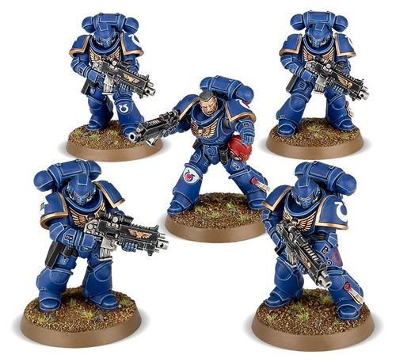
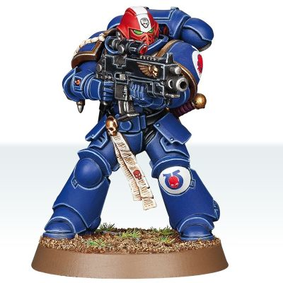
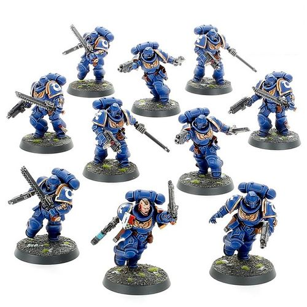
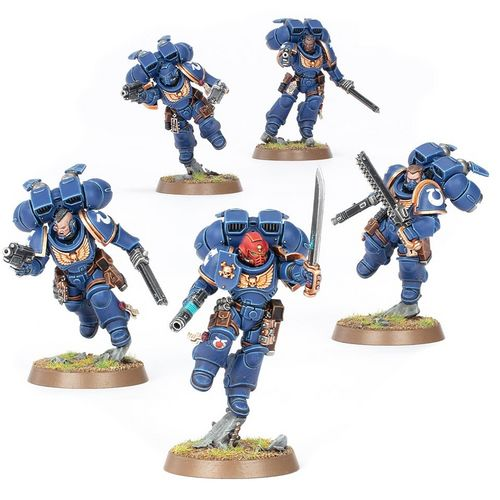
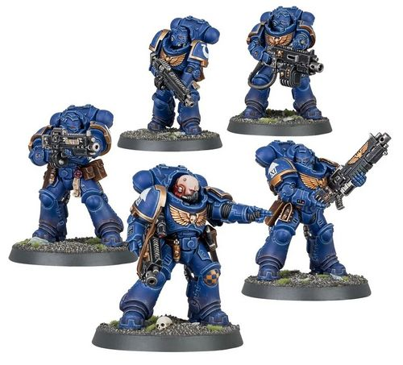

# 0292 仲裁者小队 Intercessor Squad

精校状态：中文行文已逐段精校，部分术语仍为暂定

分类：通用概念 / 帝国 Imperium / 中央政务部 Adeptus Terra / 阿斯塔特修会 Adeptus Astartes

原文来源：https://www.bilibili.com/opus/1024791789684391939

原作者：帝国神选罐头

原文时间：2025年01月21日 14:35

[返回分类目录](目录.md) · [全书目录](../../目录.md)

原篇名：仲裁者小队 Intercessos Squad

<!-- A0292-B0001 -->
**英文原文**

An Intercessor Squad is the mainstay Primaris Space Marine unit, theoretically analogous to Tactical Squads, but typically without the mixed weaponry common amongst their firstborn brothers.

<!-- /A0292-B0001 -->

<!-- A0292-B0002 -->

原译文

仲裁者小队是原铸星际战士的主力部队，理论上类似于战术小队，但通常没有他们长子兄弟中常见的混合武器。

**校订译文**

仲裁者小队是原铸星际战士的主力单位，理论上相当于战术小队，但通常不会像长子同袍那样混合配备不同武器。

**校注：** 原篇名将 Intercessor 错写为 Intercessos，现据正文及官方单位名订正；原篇名另行保留。

<!-- /A0292-B0002 -->

<!-- A0292-B0003 -->
## Overview 概述

<!-- /A0292-B0003 -->

<!-- A0292-B0004 -->
**英文原文**

Intercessor Squads form a core of reliable and adaptable warriors that can lay down fire while advancing or holding terrain. Capable of leveling overlapping salvos of firepower, Intercessor Squads often form the flexible fighting core of newly founded Primaris Chapters. Many other established Chapters have taken to fielding them alongside their Tactical Squads. Recently reinforced Chapters such as the Crimson Fists and Scythes of the Emperor have found these new warriors fit for a multitude of tasks. More Codex-divergent Chapters have found their own roles for Intercessor Squads, from the stern dropsite defenders of the Raven Guard to the breach-suppressors of the Imperial Fists.

<!-- /A0292-B0004 -->

<!-- A0292-B0005 -->

原译文

仲裁者小队由可靠且适应性强的战士组成，他们可以在推进或守住地形的同时开火。具有使齐射火力达到相同水平的能力，通常构成新成立的原铸战团的灵活战斗核心。许多其他著名战团已经开始将他们与战术小队一起部署。最近加强的战团，如绯红之拳和帝皇之镰，发现这些新战士适合执行多种任务。从暗鸦守卫的严峻降落点防御到帝国之拳的突破压制，更多的非圣典战团为仲裁者小队找到了自己的角色。

**校订译文**

仲裁者是可靠而灵活的战士，既能边推进边开火，也能据守要地。凭借交错覆盖的齐射火力，仲裁者小队常成为新建原铸战团的作战骨干。许多历史悠久的战团也让他们与战术小队并肩行动；近期得到增援的绯红之拳、帝皇之镰等战团，更发现这些新战士能胜任多种任务。其他未完全遵循圣典的战团也为他们安排了独特职责，例如暗鸦守卫让他们坚守空降场，帝国之拳则用他们压制突破口。

**校注：** overlapping salvos 指交错覆盖的齐射火力，不是把火力调至相同水平。

<!-- /A0292-B0005 -->

<!-- A0292-B0006 图片 -->

<!-- A0292-B0007 -->

原译文

Intercessor Squad 仲裁者小队

**校订译文**

Intercessor Squad 仲裁者小队

<!-- /A0292-B0007 -->

<!-- A0292-B0008 -->
## Equipment 装备

<!-- /A0292-B0008 -->

<!-- A0292-B0009 -->
**英文原文**

Each member of an Intercessor Squad carries some variant of a bolt rifle, the standard version of which has a longer range and greater armour penetration than a bolter. Additionally, each Intercessor also bears a bolt pistol and frag and krak grenades. This load-out allows Intercessor Squads to dominate any firefight, laying down punishing fire to eliminate all but the most resilient of foes. However, Intercessor Squads are not purely ranged specialists. They are capable of punching clean through walls, enduring the heat of raging infernos, and ripping apart xenos horrors with their gauntleted hands.

<!-- /A0292-B0009 -->

<!-- A0292-B0010 -->

原译文

一个仲裁者小队的每个成员都携带一种爆矢步枪的变体，其标准版本比爆矢枪具有更长的射程和更大的装甲穿透力。此外，每位仲裁者还配备了一支爆矢手枪以及破片和穿甲手榴弹。这种配置使仲裁者小队能够主导任何交火，释放惩戒火力消灭除最有韧性的敌人之外的所有敌人。然而，仲裁者小队并不是纯粹的远程专家。他们能够穿透墙壁，忍受肆虐的地狱之热，并用他们的双手撕裂令人憎恶的异型。

**校订译文**

每名仲裁者都携带某一种型号的爆矢步枪；其标准型比普通爆矢枪射程更远，穿甲能力更强。此外，他们还配备爆矢手枪、破片与穿甲手榴弹。这套装备使他们足以主宰枪战，以猛烈火力消灭除最顽强目标之外的一切敌人。不过，仲裁者并非只擅长远程射击：他们能够徒手击穿墙壁，承受熊熊烈焰的高温，并用覆甲双手撕碎恐怖的异形。

<!-- /A0292-B0010 -->

<!-- A0292-B0011 -->
## Veteran Intercessors 仲裁者老兵

<!-- /A0292-B0011 -->

<!-- A0292-B0012 -->
**英文原文**

Veteran intercessors are sometimes represented in a Chapter's 1st Company. Some veteran intercessors are those battle-brothers who have wrought glories throughout their career, while others are firstborn who have since crossed the Rubicon Primaris. Sternguard Veterans in modern chapters are functionally also veteran intercessors, as they are both veterans and armed with bolt rifles.

<!-- /A0292-B0012 -->

<!-- A0292-B0013 -->

原译文

仲裁者老兵有时会在战团的第一连队中代表。一些仲裁者老兵是那些在整个生涯中取得了辉煌成就的战斗兄弟，而另一些则是长子，他们已经跨越了原铸界限。现在的战团中的肃卫老兵在功能上也是仲裁者老兵，因为他们都是老兵，并配备了爆矢步枪。

**校订译文**

战团第一连中，有时也会出现仲裁者老兵。有些是在漫长军旅中屡建功勋的战斗兄弟，有些则是接受原铸跨越手术的长子星际战士。在现代战团里，肃卫老兵同样是使用爆矢步枪的资深战士，因此在职能上也可视作仲裁者老兵。

**校注：** 原英文对现代肃卫老兵与仲裁者老兵作职能类比，中文保留，不据此将两个单位名称合并。

<!-- /A0292-B0013 -->

<!-- A0292-B0014 图片 -->

<!-- A0292-B0015 -->

原译文

Intercessor Veteran Sergeant 仲裁者老兵军士

**校订译文**

Intercessor Veteran Sergeant 仲裁者老兵军士

<!-- /A0292-B0015 -->

<!-- A0292-B0016 -->
## Variants 变体

<!-- /A0292-B0016 -->

<!-- A0292-B0017 -->
### Assault Intercessors 突击仲裁者

<!-- /A0292-B0017 -->

<!-- A0292-B0018 -->
**英文原文**

Intercessors aimed towards close combat are known as Assault Intercessors. These are among the most common type of Close Support Squad within a modern Chapter. They are equipped with Chainswords and Heavy Bolt Pistols, while the commanding Sergeant is equipped with a Power Sword, Power Fist, or Thunder Hammer and a Plasma Pistol or Hand Flamer. With or without their jump packs, they are the Primaris equivalent of Assault Squads.

<!-- /A0292-B0018 -->

<!-- A0292-B0019 -->

原译文

旨在近距离作战的仲裁者被称为突击仲裁者。这些是现在战团中最常见的近战支援小队类型之一。他们配备了链锯剑和重型爆矢手枪，而指挥官则配备了动力剑、动力拳或雷霆锤以及等离子手枪或喷火手枪。无论有没有跳跃背包，他们都相当于原铸的突击小队。

**校订译文**

专注近战的仲裁者称为突击仲裁者，是现代战团中最常见的近距离支援小队之一。他们装备链锯剑与重型爆矢手枪；率队军士则配有动力剑、动力拳或雷霆锤，再搭配等离子手枪或火焰手枪。无论是否装备跳跃背包，他们都承担原铸部队中相当于突击小队的职责。

**校注：** 已核同一人物、组织、型号或事件，与全书核心术语及后续专篇统一；原译保留对照。

<!-- /A0292-B0019 -->

<!-- A0292-B0020 图片 -->

<!-- A0292-B0021 -->

原译文

Assault Intercessor Squad 突击仲裁者小队

**校订译文**

Assault Intercessor Squad 突击仲裁者小队

<!-- /A0292-B0021 -->

<!-- A0292-B0022 -->
### Jump Pack Assault Intercessors 跳跃背包突击仲裁者

<!-- /A0292-B0022 -->

<!-- A0292-B0023 -->
**英文原文**

Jump Pack Assault Intercessors are chosen from the most aggressive members of their Chapter, and pair their close combat skills with the raw mass of a fully armoured Space Marine flying headfirst into enemies.

<!-- /A0292-B0023 -->

<!-- A0292-B0024 -->

原译文

跳跃背包突击仲裁者是从其所在战团中最具攻击性的成员中挑选出来的，他们的近战技能与一名全副武装的星际战士的原始质量相结合，直接飞向敌人。

**校订译文**

跳跃背包突击仲裁者从战团最富进攻性的成员中选拔。他们将近战技巧与全副武装的星际战士自身重量结合，迎头撞入敌阵。

<!-- /A0292-B0024 -->

<!-- A0292-B0025 图片 -->

<!-- A0292-B0026 -->

原译文

Jump Pack Intercessors 跳跃背包仲裁者

**校订译文**

Jump Pack Intercessors 跳跃背包仲裁者

<!-- /A0292-B0026 -->

<!-- A0292-B0027 -->
### Fortis Kill Team 至强杀戮小队

<!-- /A0292-B0027 -->

<!-- A0292-B0028 -->
**英文原文**

The Deathwatch will often field Fortis Kill-Teams based around Intercessors which may also include Assault Intercessors.

<!-- /A0292-B0028 -->

<!-- A0292-B0029 -->

原译文

死亡守望通常会派出以仲裁者为基础的至强杀戮小队，其中也可能包括突击仲裁者。

**校订译文**

死亡守望通常会派出以仲裁者为基础的至强杀戮小队，其中也可能包括突击仲裁者。

<!-- /A0292-B0029 -->

<!-- A0292-B0030 -->
### Heavy Intercessors 重装仲裁者

<!-- /A0292-B0030 -->

<!-- A0292-B0031 -->
**英文原文**

Those Intercessors who wear Gravis Pattern Power Armour are known as Heavy Intercessors. These are used to secure ground, blunt enemy counter-attacks, and are immovable in the defense. They are equipped with Executor Bolt Rifles, Executor Heavy Bolters, Heavy Bolt Rifles, Heavy Bolters, Hellstorm Bolt Rifles, or Hellstorm Heavy Bolters.

<!-- /A0292-B0031 -->

<!-- A0292-B0032 -->

原译文

那些穿着格拉维斯型动力盔甲的仲裁者被称为重装仲裁者。这些用于保护地面，削弱敌人的反击，在防御中是不可撼动的。他们配备了执行者爆矢步枪、执行者重型爆矢枪、重型爆矢步枪、重型爆矢枪，地狱风暴爆矢步枪或地狱风暴重型爆矢枪。

**校订译文**

重装仲裁者穿着重装型动力甲，用于巩固阵地、挫败敌方反击，在防御中坚如磐石。他们可装备执行者爆矢步枪、执行者重型爆矢枪、重型爆矢步枪、重型爆矢枪、地狱风暴爆矢步枪或地狱风暴重型爆矢枪。

<!-- /A0292-B0032 -->

<!-- A0292-B0033 图片 -->

<!-- A0292-B0034 -->

原译文

Heavy Intercessor Squad 重装仲裁者小队

**校订译文**

Heavy Intercessor Squad 重装仲裁者小队

<!-- /A0292-B0034 -->

<!-- A0292-B0035 -->
### Indomitor Kill Team 不屈杀戮小队

<!-- /A0292-B0035 -->

<!-- A0292-B0036 -->
**英文原文**

The Deathwatch will often field Indomitor Kill-Teams based around Heavy Intercessors.

<!-- /A0292-B0036 -->

<!-- A0292-B0037 -->

原译文

死亡守望通常会派出以重装仲裁者为基础的不屈杀戮小队。

**校订译文**

死亡守望通常会派出以重装仲裁者为基础的不屈杀戮小队。

<!-- /A0292-B0037 -->

<!-- A0292-B0038 -->
## Intercession Squads 仲裁杀戮小队

<!-- /A0292-B0038 -->

<!-- A0292-B0039 -->
**英文原文**

Intercession Squads are Kill Team Units composed of different operatives selected within Intercessor marines.

<!-- /A0292-B0039 -->

<!-- A0292-B0040 -->

原译文

仲裁杀戮小队是由仲裁者战士中选出的不同特工组成的杀戮小队。

**校订译文**

仲裁杀戮小队是由仲裁者战士中选出的不同特工组成的杀戮小队。

<!-- /A0292-B0040 -->

<!-- A0292-B0041 -->
## Notable Intercessors 著名仲裁者

<!-- /A0292-B0041 -->

<!-- A0292-B0042 -->
**英文原文**

Anicius — Silver Templars

<!-- /A0292-B0042 -->

<!-- A0292-B0043 -->

原译文

阿尼修斯 — 银色颅骨

**校订译文**

阿尼修斯——银色圣堂

**校注：** Silver Templars 为银色圣堂，不是 Silver Skulls 银色颅骨。

<!-- /A0292-B0043 -->

<!-- A0292-B0044 -->
**英文原文**

Kaphorn Osmosor — Raptors

<!-- /A0292-B0044 -->

<!-- A0292-B0045 -->

原译文

卡锋·奥斯莫索尔 — 猛禽

**校订译文**

卡锋·奥斯莫索尔 — 猛禽

<!-- /A0292-B0045 -->

<!-- A0292-B0046 -->
**英文原文**

Lyone — Novamarines/Deathwatch

<!-- /A0292-B0046 -->

<!-- A0292-B0047 -->

原译文

莱昂 — 新星战士/死亡守望

**校订译文**

莱昂 — 新星战士/死亡守望

<!-- /A0292-B0047 -->

<!-- A0292-B0048 -->
**英文原文**

Kajurah Swiftwind — White Scars

<!-- /A0292-B0048 -->

<!-- A0292-B0049 -->

原译文

卡朱拉·旋风 — 白色疤痕

**校订译文**

卡朱拉·疾风——白疤

<!-- /A0292-B0049 -->

本篇核心术语与暂定项

以下列出本篇出现的英文原形及核心术语表用词。同形词可能指不同对象，具体词义以本篇正文和校注为准；单复数、别名和仅见于图注的名称可能尚未列入。完整候选见[术语表](../../术语表/双语术语候选.csv)。

| 英文 | 采用中文 | 状态 |
| --- | --- | --- |
| Deathwatch | 死亡守望 | 官方已核对 |
| Bolt Pistol | 爆矢手枪 | 官方已核对 |
| Imperial Fists | 帝国之拳 | 暂定 |
| Emperor | 帝皇 | 官方已核对 |
| Gravis Pattern Power Armour | 重装型动力甲 | 暂定·官方待核 |
| Intercessor Squad | 仲裁者小队 | 官方已核对 |
| White Scars | 白疤 | 官方已核 |
| Raven Guard | 暗鸦守卫 | 官方已核 |
| Scars | 伤疤 | 暂定·官方待核 |
| Crimson Fists | 绯红之拳 | 暂定·官方待核 |
| Power Armour | 动力盔甲 | 暂定·官方待核 |
| Krak Grenades | 穿甲手榴弹 | 暂定·官方待核 |
| Space Marine | 星际战士 | 暂定·官方待核 |
| Chapter | 战团 | 暂定·官方待核 |
| Veteran | 老兵 | 暂定·官方待核 |
| Sergeant | 军士 | 暂定·官方待核 |
| Primaris Space Marine | 原铸星际战士 | 暂定·官方待核 |
| Raptors | 猛禽 | 暂定·官方待核 |
| Novamarines | 新星战士 | 暂定·官方待核 |
| Scythes of the Emperor | 帝皇之镰 | 暂定·官方待核 |
| Silver Templars | 银色圣堂 | 暂定·官方待核 |
| Firstborn | 长子 | 暂定·官方待核 |
| Sternguard Veterans | 肃卫老兵 | 暂定·官方待核 |
| Tactical Squads | 战术小队 | 暂定·官方待核 |
| Assault Squads | 突击小队 | 暂定·官方待核 |
| Intercessor | 仲裁者 | 暂定·官方待核 |
| Assault Intercessors | 突击仲裁者 | 暂定·官方待核 |
| Heavy Intercessors | 重装仲裁者 | 暂定·官方待核 |
| Close Support Squad | 近战支援小队 | 暂定·官方待核 |
| Rubicon Primaris | 原铸跨越手术 | 暂定·官方待核 |
| Xenos | 异形 | 暂定·官方待核 |
| Lyone | 莱昂 | 暂定·官方待核 |
| Wrought | 锻造秘库 | 暂定·官方待核 |
| Thunder Hammer | 雷霆锤 | 暂定·官方待核 |
| Bolt | 爆矢 | 暂定·官方待核 |
| Heavy Bolt | 重爆矢 | 暂定·官方待核 |
| Bolter | 爆矢枪 | 暂定·官方待核 |
| Bolt Rifle | 爆矢步枪 | 暂定·官方待核 |
| Flamer | 火焰喷射器（武器）／火妖（奸奇单位） | 语境定译·对应官译已核 |
| Hand Flamer | 火焰手枪 | 暂定·官方待核 |
| Plasma pistol | 等离子手枪 | 官方已核对 |
| Jump Pack | 跳跃背包 | 暂定·官方待核 |
| Power fist | 动力拳 | 官方已核对 |
| Resilient | 坚韧号 | 暂定·官方待核 |

