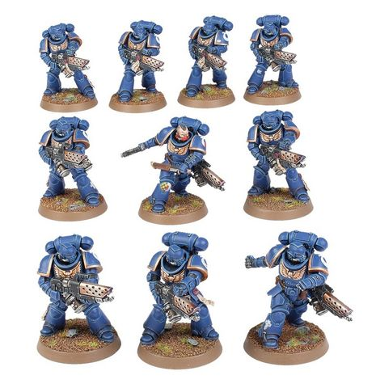

# 0293 焚狱者小队 Infernus Squad

精校状态：中文行文已逐段精校，部分术语仍为暂定

分类：通用概念 / 帝国 Imperium / 中央政务部 Adeptus Terra / 阿斯塔特修会 Adeptus Astartes

原文来源：https://www.bilibili.com/opus/1024420227795910674

原作者：帝国神选罐头

原文时间：2025年01月20日 14:33

[返回分类目录](目录.md) · [全书目录](../../目录.md)

<!-- A0293-B0001 -->
**英文原文**

Infernus Squads are a type of Primaris Space Marine formation.

<!-- /A0293-B0001 -->

<!-- A0293-B0002 -->

原译文

焚狱者小队是原铸星际战士的一种编队。

**校订译文**

焚狱者小队是原铸星际战士的一种编队。

<!-- /A0293-B0002 -->

<!-- A0293-B0003 图片 -->

<!-- A0293-B0004 -->

原译文

Infernus Squad 焚狱者小队

**校订译文**

Infernus Squad 焚狱者小队

<!-- /A0293-B0004 -->

<!-- A0293-B0005 -->
**英文原文**

Wielding pyreblasters, Infernus Squads purge enemy forces with incandescent firestorms. Acting as close-up ranged combat specialists, they are often used to clear enemy trenches and bunkers and can easily burn through dense structures and vegetation.

<!-- /A0293-B0005 -->

<!-- A0293-B0006 -->

原译文

焚狱者小队挥舞着焚焰枪，用炽热的火焰风暴清除敌军。作为近距离作战专家，他们经常被用来清理敌人的战壕和掩体，很容易烧毁密集的结构和植被。

**校订译文**

焚狱者小队使用焚焰枪，以炽热的火焰风暴肃清敌军。他们专精近距离射击，常负责清剿战壕与碉堡，也能轻易烧穿密集的建筑结构和植被。

<!-- /A0293-B0006 -->

本篇核心术语与暂定项

以下列出本篇出现的英文原形及核心术语表用词。同形词可能指不同对象，具体词义以本篇正文和校注为准；单复数、别名和仅见于图注的名称可能尚未列入。完整候选见[术语表](../../术语表/双语术语候选.csv)。

| 英文 | 采用中文 | 状态 |
| --- | --- | --- |
| Clear | 清明 | 暂定·官方待核 |
| Space Marine | 星际战士 | 暂定·官方待核 |
| Primaris Space Marine | 原铸星际战士 | 暂定·官方待核 |

