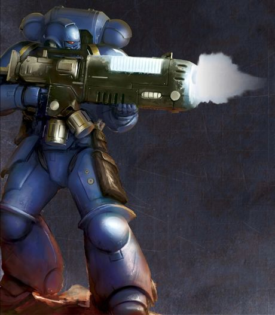
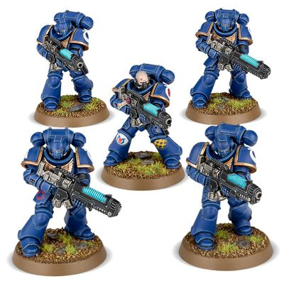

# 0294 地狱轰击者小队 Hellblaster Squad

精校状态：中文行文已逐段精校，部分术语仍为暂定

分类：通用概念 / 帝国 Imperium / 中央政务部 Adeptus Terra / 阿斯塔特修会 Adeptus Astartes

原文来源：https://www.bilibili.com/opus/1023969488152821785

原作者：帝国神选罐头

原文时间：编辑于 2025年02月10日 10:06

[返回分类目录](目录.md) · [全书目录](../../目录.md)

<!-- A0294-B0001 -->
**英文原文**

A Hellblaster Squad is a Primaris Space Marine unit analogous to Devastator Squads or Sternguard Veterans depending on the loadout they choose. Hellblaster Squads provide deadly fire power with their Plasma Incinerators.

<!-- /A0294-B0001 -->

<!-- A0294-B0002 -->

原译文

地狱轰击者小队是一支原铸星际战士部队，类似于毁灭者小队或肃卫老兵，具体取决于他们选择的装载。地狱轰击者小队用他们的等离子焚化者提供致命的火力。

**校订译文**

地狱轰击者小队是原铸星际战士单位。根据装备配置不同，其职责类似破坏者小队或肃卫老兵，以等离子焚化枪提供致命火力。

<!-- /A0294-B0002 -->

<!-- A0294-B0003 图片 -->

<!-- A0294-B0004 -->

原译文

Ultramarines Hellblaster 极限战士地狱轰击者

**校订译文**

Ultramarines Hellblaster 极限战士地狱轰击者

<!-- /A0294-B0004 -->

<!-- A0294-B0005 -->
## Overview 概述

<!-- /A0294-B0005 -->

<!-- A0294-B0006 -->
**英文原文**

Hellblaster Squads are heavy fire support infantry of the Primaris Space Marines, specializing in plasma weaponry. If deployed at the correct point and time, a single Hellblaster Squad can blunt the thundering assault of an armoured spearhead, or lay low even the most titanic xenos. Harking back to the single-armament specialties of the Space Marine Legions, these squads are nonetheless strategically versatile. The plasma incinerators carried by Hellblasters are light enough to be fired on the move while still retaining the stopping power to drop a rampaging Hive Tyrant or Battlewagon with sustained fire.

<!-- /A0294-B0006 -->

<!-- A0294-B0007 -->

原译文

地狱轰击者小队是原铸星际战士的重型火力支援步兵，专门从事等离子武器。如果在正确的时间和地点部署，一个地狱轰击者小队可以减弱装甲矛头的雷霆般的突击，或者即使是最巨大的异型也能击倒。回到星际战士的单一武器专长，这些小队在战略上仍然是多才多艺的。地狱爆破者所携带的等离子焚化者足够轻便，能够在移动中开火，同时仍然具有强大的制停能力，通过持续射击可以击倒狂暴的虫巢暴君或战斗要塞。

**校订译文**

地狱轰击者是原铸星际战士中的重型火力支援步兵，专精等离子武器。只要部署时机与位置得当，一支小队就能遏止装甲突击部队的猛烈攻势，甚至击倒最庞大的异形。他们沿袭了古代星际战士军团统一使用单一武器的专门编制，却仍具有广泛的战略用途。等离子焚化枪轻便到足以边行进边射击，同时又有足够威力，能以持续火力击倒狂暴的虫巢暴君，或摧毁战斗堡垒。

**校注：** Battlewagon按GW09第30/GW10第29官译战斗堡垒；不同于Battle Fortress。

<!-- /A0294-B0007 -->

<!-- A0294-B0008 图片 -->

<!-- A0294-B0009 -->

原译文

Hellblaster Squad 地狱轰击者小队

**校订译文**

Hellblaster Squad 地狱轰击者小队

<!-- /A0294-B0009 -->

<!-- A0294-B0010 -->
**英文原文**

The only limiting factor on the usefulness of these squads is the comparative scarcity and instability of their weapons. As such, Hellblaster Squads comprise the finest marksmen each company can provide, and will only resort to supercharging their plasma incinerators in truly dire circumstances. They are not afraid to do so, however, and more than one squad has martyred itself in battle, turning the tide at the cost of their own immolation.

<!-- /A0294-B0010 -->

<!-- A0294-B0011 -->

原译文

这些小队有用性的唯一限制因素是其武器的相对稀缺和不稳定。因此，地狱轰击者小队由每个连队能提供的最优秀的射手组成，只有在真正糟糕的情况下才会对他们的等离子焚化者进行过载。然而，他们并不害怕这样做，不止一个小队在战斗中牺牲了自己，以此为代价扭转了战局。

**校订译文**

限制地狱轰击者发挥的，只有武器相对稀缺且不稳定这一点。因此，小队由各连最优秀的射手组成，只有危局真正迫近时，才会将等离子焚化枪过载。他们并不畏惧这样做：已有不止一支小队在战斗中以自身焚灭为代价，换取战局逆转。

<!-- /A0294-B0011 -->

本篇核心术语与暂定项

以下列出本篇出现的英文原形及核心术语表用词。同形词可能指不同对象，具体词义以本篇正文和校注为准；单复数、别名和仅见于图注的名称可能尚未列入。完整候选见[术语表](../../术语表/双语术语候选.csv)。

| 英文 | 采用中文 | 状态 |
| --- | --- | --- |
| Space Marines | 星际战士 | 官方已核对 |
| Hive Tyrant | 虫巢暴君 | 官方已核对 |
| Battlewagon | 战斗堡垒 | 官方已核对 |
| Hellblaster Squad | 地狱轰击者小队 | 官方已核对 |
| Armoured Spearhead | 装甲矛头编队 | 暂定·官方待核 |
| Space Marine | 星际战士 | 暂定·官方待核 |
| Devastator | 破坏者 | 暂定·官方待核 |
| Hellblaster | 地狱轰击者 | 暂定·官方待核 |
| Primaris Space Marine | 原铸星际战士 | 暂定·官方待核 |
| Sternguard Veterans | 肃卫老兵 | 暂定·官方待核 |
| Devastator Squads | 破坏者小队 | 暂定·官方待核 |
| Hellblaster Squads | 地狱轰击者小队 | 暂定·官方待核 |
| Xenos | 异形 | 暂定·官方待核 |

