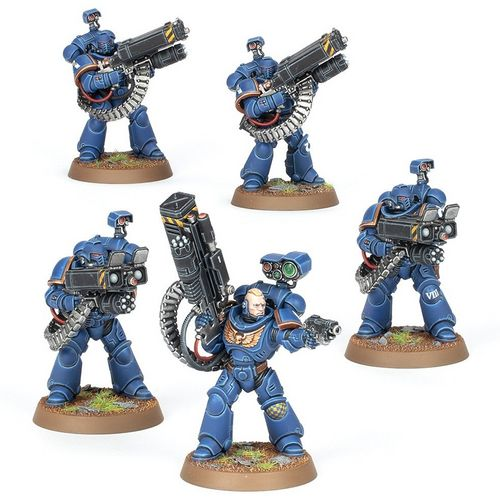

# 0295 寂灭小队 Desolation Squad

精校状态：中文行文已逐段精校，部分术语仍为暂定

分类：通用概念 / 帝国 Imperium / 中央政务部 Adeptus Terra / 阿斯塔特修会 Adeptus Astartes

原文来源：https://www.bilibili.com/opus/1022076661683716096

原作者：帝国神选罐头

原文时间：2025年01月14日 06:59

[返回分类目录](目录.md) · [全书目录](../../目录.md)

<!-- A0295-B0001 -->
**英文原文**

Desolation Squads are missile launcher-equipped Primaris Space Marines.

<!-- /A0295-B0001 -->

<!-- A0295-B0002 -->

原译文

寂灭小队是装备导弹发射器的原铸星际战士。

**校订译文**

寂灭小队由装备导弹发射器的原铸星际战士组成。

<!-- /A0295-B0002 -->

<!-- A0295-B0003 图片 -->

<!-- A0295-B0004 -->

原译文

Ultramarines Desolation Squad 极限战士寂灭小队

**校订译文**

Ultramarines Desolation Squad 极限战士寂灭小队

<!-- /A0295-B0004 -->

<!-- A0295-B0005 -->
## Description 描述

<!-- /A0295-B0005 -->

<!-- A0295-B0006 -->
**英文原文**

Desolation Squads provide devastating direct fire barrages, be it against masses of enemy troops or armor. With a simultaneous option of various munitions, Desolators wield a variety of mission-based weaponry. These include anti-personnel Superfrag Rocket Launchers or anti-armor Superkrak Rocket Launchers. Desolation Squad Sergeants, meanwhile, wield Vengor Launchers and use their Signum targeting system to guide the squad's aim. All three weapons also come attached with a belt-fed Castellan Launcher, which can be fired separately (and indirectly).

<!-- /A0295-B0006 -->

<!-- A0295-B0007 -->

原译文

寂灭小队提供毁灭性的直接火力弹幕，无论是针对大量敌军还是装甲部队。通过同时选择各种弹药，寂灭者可以使用各种基于任务的武器。这些包括杀伤人员的超级破片火箭发射器或反装甲的超级穿甲火箭发射器。与此同时，寂灭小队的军士挥舞着威格尔发射器，并使用他们的目标指示器瞄准系统来指向小队的目标。这三种武器都配有带式堡主发射器，可以单独（或间接）发射。

**校订译文**

寂灭小队能以毁灭性的直射弹幕，对付密集敌军或装甲目标。他们按任务选择武器，并能同时使用多种弹药，例如杀伤步兵的超级破片火箭发射器，以及反装甲的超级穿甲火箭发射器。军士则装备威格尔发射器，借助目标指示器瞄准系统引导全队射击。这三种武器都附带一具弹链供弹的堡主发射器，可以独立发射，也能实施间接射击。

**校注：** belt-fed 是弹链供弹；括注 and indirectly 补充间接射击能力，不是与独立发射互斥。

<!-- /A0295-B0007 -->

本篇核心术语与暂定项

以下列出本篇出现的英文原形及核心术语表用词。同形词可能指不同对象，具体词义以本篇正文和校注为准；单复数、别名和仅见于图注的名称可能尚未列入。完整候选见[术语表](../../术语表/双语术语候选.csv)。

| 英文 | 采用中文 | 状态 |
| --- | --- | --- |
| Space Marines | 星际战士 | 官方已核对 |
| Mission | 教团／传教机构 | 暂定 |
| Signum | 目标指示器 | 暂定·官方待核 |
| Castellan Launcher | 堡主发射器 | 暂定·官方待核 |
| Desolation Squad | 寂灭小队 | 官方已核对 |
| Desolators | 荒芜者 | 暂定·官方待核 |
| Castellan | 堡主 | 官方已核对 |
| System | 星系（恒星系统） | 暂定·官方待核 |
| Missile Launcher | 导弹发射器 | 暂定·官方待核 |

