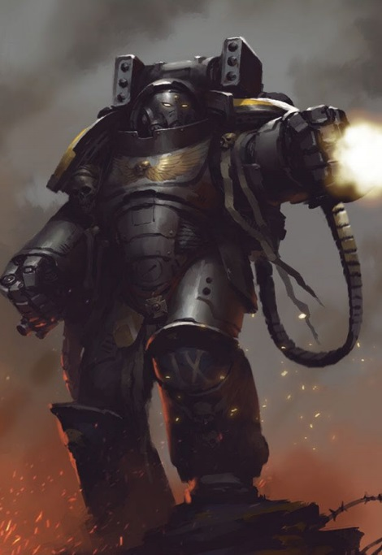
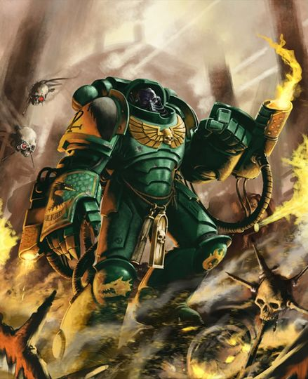

# 0296 侵略者小队 Aggressor Squad

精校状态：中文行文已逐段精校，部分术语仍为暂定

分类：通用概念 / 帝国 Imperium / 中央政务部 Adeptus Terra / 阿斯塔特修会 Adeptus Astartes

原文来源：https://www.bilibili.com/opus/1018029247741034568

原作者：帝国神选罐头

原文时间：2025年01月03日 09:13

[返回分类目录](目录.md) · [全书目录](../../目录.md)

<!-- A0296-B0001 -->
**英文原文**

An Aggressor Squad is a Primaris Space Marine heavy attack unit.

<!-- /A0296-B0001 -->

<!-- A0296-B0002 -->

原译文

侵略者小队是一支原铸星际战士重型攻击部队。

**校订译文**

侵略者小队是一支原铸星际战士重型攻击部队。

<!-- /A0296-B0002 -->

<!-- A0296-B0003 图片 -->

<!-- A0296-B0004 -->

原译文

Aggressor Space Marine 星际战士侵略者

**校订译文**

Aggressor Space Marine 星际战士侵略者

<!-- /A0296-B0004 -->

<!-- A0296-B0005 -->
## Overview 概述

<!-- /A0296-B0005 -->

<!-- A0296-B0006 -->
**英文原文**

Primaris Aggressors are clad in durable Gravis Pattern Power Armour, which despite its appearance keeps them quite mobile, unlike their more heavily-armoured Centurion cousins. They're able to negotiate rough terrain, making them versatile troops. Often employed in specific circumstances or on certain terrain, Aggressor Squads are used as reserves to plug breaches in gun lines or to spearhead an advance. The range of their weaponry is not significant, but when they get close enough to open fire, the result is a sweeping fusillade of large-calibre bolter shells that can shatter enemy charges.

<!-- /A0296-B0006 -->

<!-- A0296-B0007 -->

原译文

原铸侵略者身穿耐用的格拉维斯型动力盔甲，尽管外观如此，但与装甲更重的表亲百夫长不同，他们具有相当的机动性。他们能够穿越崎岖的地形，使他们成为多才多艺的部队。侵略者小队通常在特定情况下或在特定地形上使用，被用作预备队，以堵塞枪线的缺口或带头推进。他们的武器射程并不显著，但当他们靠近到足以开火时，后果是大口径爆弹的扫射，可以粉碎敌人的冲锋。

**校订译文**

原铸侵略者身穿坚固的重装型动力甲，外表虽然笨重，却不像护甲更厚的百夫长那样行动迟缓。他们能穿越崎岖地形，具备良好的战场适应性。侵略者小队常在特定战况或地形下投入使用，既能作为预备队填补火力阵线的缺口，也能充当推进先锋。武器射程虽不算远，但一旦进入射击距离，他们的大口径爆矢齐射便能横扫敌阵，粉碎冲锋。

<!-- /A0296-B0007 -->

<!-- A0296-B0008 图片 -->

<!-- A0296-B0009 -->

原译文

Salamanders Aggressor Marine 火蜥蜴侵略者战士

**校订译文**

Salamanders Aggressor Marine 火蜥蜴侵略者战士

<!-- /A0296-B0009 -->

<!-- A0296-B0010 -->
**英文原文**

Aggressors wield either twin flame gauntlets that billow forth burning promethium or boltstorm gauntlets that barrage the enemy with bolter shells. Some are also equipped with shoulder-mounted fragstorm grenade launchers.

<!-- /A0296-B0010 -->

<!-- A0296-B0011 -->

原译文

侵略者要么挥舞着双联火焰臂铠，射出滚滚向前燃烧的钷素，要么挥舞着爆矢风暴臂铠，用爆矢弹幕扫射敌人。有些还配备了肩扛式破片风暴榴弹发射器。

**校订译文**

侵略者可使用成对的火焰臂铠，喷出滚滚燃烧的钷素；也可使用爆矢风暴臂铠，以爆矢弹幕轰击敌人。部分成员还装备肩载破片风暴榴弹发射器。

<!-- /A0296-B0011 -->

<!-- A0296-B0012 -->
**英文原文**

Since being introduced during the Ultima Founding and Roboute Guilliman’s reworking of the Codex Astartes, Aggressor Squads have proven themselves as a devastating force many times over. Chapters that have embraced the Aggressors include the Iron Hands, Salamanders, and Black Templars.

<!-- /A0296-B0012 -->

<!-- A0296-B0013 -->

原译文

自从在极限建军和罗伯特·基利曼对阿斯塔特圣典的修改中引入以来，侵略者小队已经多次证明自己是一支毁灭性的力量。采纳侵略者的战团包括钢铁之手、火蜥蜴和黑色圣堂。

**校订译文**

在极限建军与罗保特·基里曼修订《阿斯塔特圣典》之后，侵略者小队开始投入使用，并多次证明其毁灭性的战力。钢铁之手、火蜥蜴与黑色圣堂等战团，都积极采用这种部队。

<!-- /A0296-B0013 -->

本篇核心术语与暂定项

以下列出本篇出现的英文原形及核心术语表用词。同形词可能指不同对象，具体词义以本篇正文和校注为准；单复数、别名和仅见于图注的名称可能尚未列入。完整候选见[术语表](../../术语表/双语术语候选.csv)。

| 英文 | 采用中文 | 状态 |
| --- | --- | --- |
| Black Templars | 黑色圣堂 | 官方已核对 |
| Roboute Guilliman | 罗保特·基里曼 | 官方已核对 |
| Iron Hands | 钢铁之手 | 暂定·官方待核 |
| Salamanders | 火蜥蜴 | 暂定·官方待核 |
| Gravis Pattern Power Armour | 重装型动力甲 | 暂定·官方待核 |
| Aggressor Squad | 侵略者小队 | 官方已核对 |
| Founding | 建军 | 暂定·官方待核 |
| Power Armour | 动力盔甲 | 暂定·官方待核 |
| Space Marine | 星际战士 | 暂定·官方待核 |
| Aggressor | 侵略者 | 暂定·官方待核 |
| Primaris Space Marine | 原铸星际战士 | 暂定·官方待核 |
| Codex Astartes | 阿斯塔特圣典 | 暂定·官方待核 |
| Ultima Founding | 极限建军 | 暂定·官方待核 |
| Aggressor Squads | 侵略者小队 | 暂定·官方待核 |
| Gun | 甘 | 暂定·官方待核 |
| Promethium | 钷素 | 暂定·官方待核 |
| Bolter | 爆矢枪 | 暂定·官方待核 |
| Grenade | 手榴弹 | 暂定·官方待核 |

