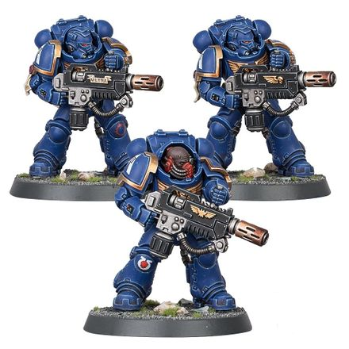

# 0297 根除者小队 Eradicator Squad

精校状态：中文行文已逐段精校，部分术语仍为暂定

分类：通用概念 / 帝国 Imperium / 中央政务部 Adeptus Terra / 阿斯塔特修会 Adeptus Astartes

原文来源：https://www.bilibili.com/opus/1022838356949598215

原作者：帝国神选罐头

原文时间：2025年01月16日 08:15

[返回分类目录](目录.md) · [全书目录](../../目录.md)

<!-- A0297-B0001 -->
**英文原文**

An Eradicator Squad are a type of Primaris Space Marine unit.

<!-- /A0297-B0001 -->

<!-- A0297-B0002 -->

原译文

根除者小队是一种原铸星际战士部队。

**校订译文**

根除者小队是一种原铸星际战士部队。

<!-- /A0297-B0002 -->

<!-- A0297-B0003 图片 -->

<!-- A0297-B0004 -->

原译文

Ultramarines Eradicator Squad 极限战士根除者小队

**校订译文**

Ultramarines Eradicator Squad 极限战士根除者小队

<!-- /A0297-B0004 -->

<!-- A0297-B0005 -->
**英文原文**

Eradicator Squads wear Gravis Pattern Power Armour, which allows them to stride unharmed through waves of incoming fire before bringing their own destructive anti-armour Melta Rifles, Heavy Melta Rifles, and Multi-Meltas to bear.

<!-- /A0297-B0005 -->

<!-- A0297-B0006 -->

原译文

根除者小队穿着格拉维斯型动力盔甲，这使他们能够在携带自己的破坏性反装甲热熔步枪、重型热熔步枪和多管热熔之前，在来袭的炮火中毫发无损地大步前进。

**校订译文**

根除者小队身穿重装型动力甲，足以迎着敌方层层火力毫发无损地推进，直至进入射程，以热熔步枪、重型热熔步枪与多管热熔等毁灭性的反装甲武器开火。

<!-- /A0297-B0006 -->

本篇核心术语与暂定项

以下列出本篇出现的英文原形及核心术语表用词。同形词可能指不同对象，具体词义以本篇正文和校注为准；单复数、别名和仅见于图注的名称可能尚未列入。完整候选见[术语表](../../术语表/双语术语候选.csv)。

| 英文 | 采用中文 | 状态 |
| --- | --- | --- |
| Gravis Pattern Power Armour | 重装型动力甲 | 暂定·官方待核 |
| Eradicator Squad | 根除者小队 | 官方已核对 |
| Power Armour | 动力盔甲 | 暂定·官方待核 |
| Space Marine | 星际战士 | 暂定·官方待核 |
| Eradicator | 根除者 | 暂定·官方待核 |
| Primaris Space Marine | 原铸星际战士 | 暂定·官方待核 |
| Eradicator Squads | 根除者小队 | 暂定·官方待核 |
| Bear | 熊 | 暂定·官方待核 |

