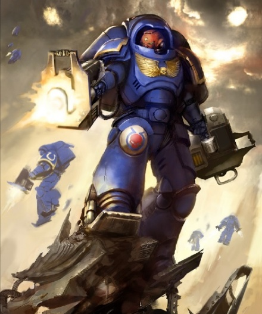
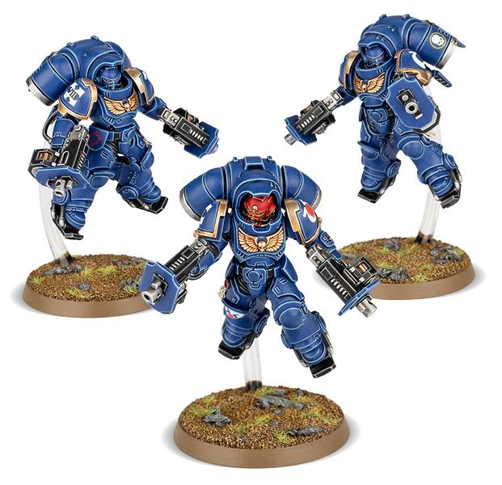

# 0298 先驱者小队 Inceptor Squad

精校状态：中文行文已逐段精校，部分术语仍为暂定

分类：通用概念 / 帝国 Imperium / 中央政务部 Adeptus Terra / 阿斯塔特修会 Adeptus Astartes

原文来源：https://www.bilibili.com/opus/1024420025933496386

原作者：帝国神选罐头

原文时间：2025年01月20日 14:32

[返回分类目录](目录.md) · [全书目录](../../目录.md)

<!-- A0298-B0001 -->
**英文原文**

An Inceptor Squad is a jump pack equipped Primaris Space Marine unit, although it is not equivalent to standard Assault Squads, as its standard wargear relies entirely on guns rather than melee weapons.

<!-- /A0298-B0001 -->

<!-- A0298-B0002 -->

原译文

先驱者小队是一支装备跳跃背包的原铸星际战士部队，尽管它并不等同于标准的突击小队，因为它的标准作战装备完全依赖于枪支而不是近战武器。

**校订译文**

先驱者小队是装备跳跃背包的原铸星际战士单位，但与常规突击小队不同：其标准武器完全以枪械为主，而非近战兵器。

<!-- /A0298-B0002 -->

<!-- A0298-B0003 图片 -->

<!-- A0298-B0004 -->

原译文

Inceptor Space Marines 先驱者星际战士

**校订译文**

Inceptor Space Marines 先驱者星际战士

<!-- /A0298-B0004 -->

<!-- A0298-B0005 -->
## Overview 概述

<!-- /A0298-B0005 -->

<!-- A0298-B0006 -->
**英文原文**

The swiftest of the Primaris Space Marines, Inceptors fill the role of spearhead troops. They hit the enemy in one sudden and overwhelming blow, leaving them reeling as follow-up waves of Space Marines drive home the attack.

<!-- /A0298-B0006 -->

<!-- A0298-B0007 -->

原译文

先驱者是原铸星际战士中速度最快的，担任先锋部队的角色。他们在一次突然的压倒性打击中击中敌人，让他们在后续的星际战士的攻击中摇摇欲坠。

**校订译文**

先驱者是行动最迅捷的原铸星际战士，承担突击先锋的职责。他们以骤然而压倒性的打击令敌人陷入混乱，再由后续星际战士梯队乘势扩大战果。

<!-- /A0298-B0007 -->

<!-- A0298-B0008 图片 -->

<!-- A0298-B0009 -->

原译文

Inceptor Squad 先驱者小队

**校订译文**

Inceptor Squad 先驱者小队

<!-- /A0298-B0009 -->

<!-- A0298-B0010 -->
**英文原文**

Equipped with heavy jump packs and reinforced Mk.X "Gravis" Armour, Inceptors are dropped from low orbit onto the battlefield below. Leaping from the assault bays of low-orbiting attack craft, these daring warriors brave the fury of re-entry. If the enemy detects their approach at all, they will often do so under the misapprehension that the Inceptors are stray warheads, or castoff debris from orbital combat. Some squads intentionally make planetfall amidst such falling debris. By the time the foe realizes that they are under attack, the Inceptors are already upon them.

<!-- /A0298-B0010 -->

<!-- A0298-B0011 -->

原译文

配备重型跳跃背包和加固的Mk.X“格拉维斯”盔甲，先驱者从低空轨道投掷到下面的战场上。这些勇敢的战士从低空轨道的攻击艇跳下，勇敢地面对重返大气层的愤怒。如果敌人发现了他们的接近，他们通常会误以为先驱者是迷失的弹头，或者是轨道战斗中散落的碎片。一些小队故意在这些坠落的碎片中空降星球。当敌人意识到他们受到攻击时，先驱者已经在他们上方了。

**校订译文**

先驱者配备重型跳跃背包与加固的 X 型重装型护甲，从低轨道直接空降战场。这些勇士跃出低轨攻击艇的突击舱，迎着再入大气层的猛烈冲击落下。即使敌人察觉，也常将他们误认为流散的弹头或轨道战残骸；有些小队更刻意混在坠落残骸之中。等敌人意识到遭受袭击，先驱者早已杀到面前。

<!-- /A0298-B0011 -->

<!-- A0298-B0012 -->
**英文原文**

Despite the ground-shattering force with which they land, Inceptors touch down with absolute control, opening fire immediately with the bulky but rapid-firing assault bolters that form their primary armaments, though some instead wield Plasma Exterminators. Servo-equipped boot-plates allow Inceptor Squads to survive landing at intense speeds, and provide extra boost when they jump from the ground. Often paired with squads deployed by Drop Pod, Inceptors are the perfect troops to blast out a beachhead and then provide fire support to keep it clear. They also slaughter crucial command assets or silence flak batteries before the main Space Marine attack descends.

<!-- /A0298-B0012 -->

<!-- A0298-B0013 -->

原译文

尽管他们降落时具有毁灭性的力量，但先驱者还是以绝对的控制力着陆，立即用构成其主要武器的笨重但可快速射击的突击爆矢枪开火，尽管有些人使用等离子歼灭者。配备伺服系统的靴板使先驱者小队能够以极快的速度着陆，并在从地面跳下时提供额外的动力。先驱者通常与空降仓部署的小队配对，是破开滩头阵地然后提供火力支援以保持其畅通的完美部队。他们还屠杀了关键的指挥者，或在主要的星际战士袭击降临之前压制了防空炮。

**校订译文**

先驱者着地时足以震碎地面，却仍能精准控制落点，并立即以沉重而射速迅猛的突击爆矢枪开火；部分成员则使用等离子灭绝枪。靴底的伺服装置使他们能承受高速着陆，也为再次跃起提供额外推力。先驱者常与乘坐空降舱的部队协同，既能轰出登陆立足点，又能用火力守住它。他们还会在星际战士主力降临前，摧毁关键指挥目标，或消灭防空炮阵地。

**校注：** Plasma Exterminator 暂译等离子灭绝枪，与 Plasma Incinerator 等离子焚化枪分开；jump from the ground 是从地面跃起，不是向下跳。

<!-- /A0298-B0013 -->

本篇核心术语与暂定项

以下列出本篇出现的英文原形及核心术语表用词。同形词可能指不同对象，具体词义以本篇正文和校注为准；单复数、别名和仅见于图注的名称可能尚未列入。完整候选见[术语表](../../术语表/双语术语候选.csv)。

| 英文 | 采用中文 | 状态 |
| --- | --- | --- |
| Space Marines | 星际战士 | 官方已核对 |
| Clear | 清明 | 暂定·官方待核 |
| Inceptor Squad | 先驱者小队 | 官方已核对 |
| Drop Pod | 空降舱 | 官方已核·中英对照 |
| Space Marine | 星际战士 | 暂定·官方待核 |
| Inceptor | 先驱者 | 暂定·官方待核 |
| Primaris Space Marine | 原铸星际战士 | 暂定·官方待核 |
| Inceptors | 先驱者 | 暂定·官方待核 |
| Assault Squads | 突击小队 | 暂定·官方待核 |
| Absolute | 绝对号 | 暂定·官方待核 |
| Jump Pack | 跳跃背包 | 暂定·官方待核 |

