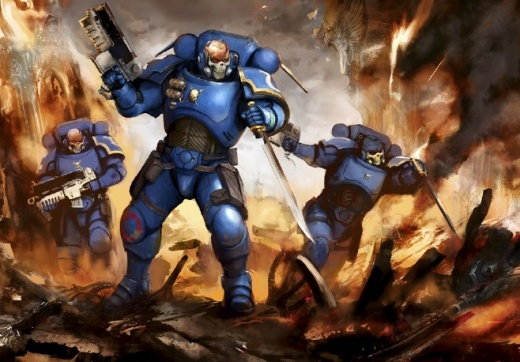
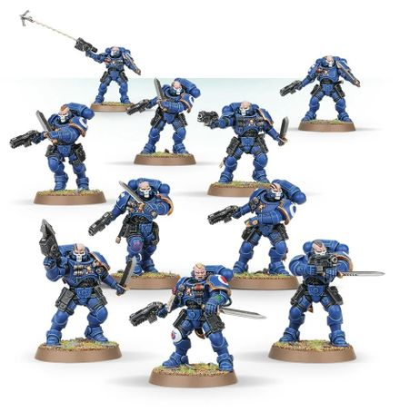
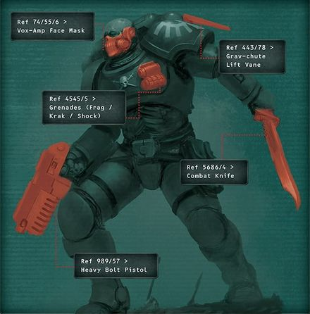

# 0299 掠夺者小队 Reiver Squad

精校状态：中文行文已逐段精校，部分术语仍为暂定

分类：通用概念 / 帝国 Imperium / 中央政务部 Adeptus Terra / 阿斯塔特修会 Adeptus Astartes

原文来源：https://www.bilibili.com/opus/1032883340596740105

原作者：帝国神选罐头

原文时间：2025年02月12日 09:54

[返回分类目录](目录.md) · [全书目录](../../目录.md)

<!-- A0299-B0001 -->
**英文原文**

A Reiver Squad is a close combat Primaris Space Marine Vanguard reconnaissance and special operations unit, that wears skull faced helms and is equipped with silent power armour, that has been adapted for stealth work. These are the guerrilla warfare specialists of the Primaris Space Marines.

<!-- /A0299-B0001 -->

<!-- A0299-B0002 -->

原译文

掠夺者小队是一个近距离战斗的原铸星际战士先锋侦察和特种作战部队，戴着骷髅头盔，配备了静音动力盔甲，已经适应了秘密行动工作。这些是原铸星际战士的游击战专家。

**校订译文**

掠夺者小队是原铸先锋星际战士中的近战侦察与特种作战单位。他们头戴骷髅面盔，身穿专为潜行改装的静音动力甲，是原铸部队的游击战专家。

<!-- /A0299-B0002 -->

<!-- A0299-B0003 图片 -->

<!-- A0299-B0004 -->

原译文

Reiver Squad 掠夺者小队

**校订译文**

Reiver Squad 掠夺者小队

<!-- /A0299-B0004 -->

<!-- A0299-B0005 -->
## Overview 概述

<!-- /A0299-B0005 -->

<!-- A0299-B0006 -->
**英文原文**

All Space Marines are experts of the rapid strike, but Reiver Squads take such skills to the next level. They are specially trained and equipped to launch effective unexpected assaults. They do so with a sudden fury and shocking violence, for the Reiver Squads fulfil the role of terror troops that sow fear and confusion amongst their foes. Each member of this Primaris squad is outfitted in Mark X Phobos Armour. The suit’s lighter-weight ceramite and streamlined design allow for greater mobility, and its servo-motors are engineered to be completely silent. Above all else, Reiver Squads depend on stealth and secrecy to accomplish their missions.

<!-- /A0299-B0006 -->

<!-- A0299-B0007 -->

原译文

所有的星际战士都是快速打击的专家，但掠夺者小队将这种技能提升到了一个新的水平。他们受过专门训练，装备精良，能够发动有效的突袭。他们这样做伴随着极速狂怒和令人震惊的暴力，因为掠夺者小队扮演着恐惧部队的角色，在敌人中散播恐惧和混乱。这个原铸小队的每个成员都装备了Mark X 福波斯盔甲。该套装的轻质陶钢和流线型设计使其具有更大的机动性，其伺服电机被设计为完全静音。最重要的是，掠夺者小队依靠隐形和秘密来完成任务。

**校订译文**

所有星际战士都擅长迅速打击，掠夺者却将这项本领推至极致。他们接受专门训练，配备相应装备，以突如其来的狂怒与暴力发动高效袭击，在敌阵中播散恐惧和混乱。每名成员都身穿 X 型恐惧型护甲：轻质陶钢和精简设计提升机动性，伺服马达则能完全静音。潜行与隐秘，是掠夺者完成任务的首要依靠。

**校注：** Phobos 护甲采用恐惧型护甲，依据GW-09中文32页/GW-10英文31页的连长、智库员与副官装备名称；不与同名卫星混译。

<!-- /A0299-B0007 -->

<!-- A0299-B0008 图片 -->

<!-- A0299-B0009 -->

原译文

Reiver Squad 掠夺者小队

**校订译文**

Reiver Squad 掠夺者小队

<!-- /A0299-B0009 -->

<!-- A0299-B0010 -->
**英文原文**

To aid them in their role, some Reiver Squads are equipped with grav-chutes, allowing them to be air-dropped to the battlefield from fast-moving transport craft. Using directional fins, the Reiver Squad can glide to their destination from high altitudes and pull out of steep descents when deploying from high-velocity aircraft, hugging terrain contours while flying dangerously low. Less noticeable than Jump Pack infantry Reiver Squads can descend unnoticed behind enemy lines before silently getting into position. Reivers can also use Grapnel Launchers to scale vast heights and cross from building to building. There is nothing that can prepare an enemy for the savage suddenness with which the Reivers attack. Such an unpredictable assault also unnerves those nearby, for the strike is enough to set even well-trained, professional soldiers on the back foot. Against less disciplined troops, the Reiver Squad is more devastating still – the ferocious destruction of one enemy group can set off a chain reaction of panic that ripples down the line as the roaring Reivers move to bring down their next target.

<!-- /A0299-B0010 -->

<!-- A0299-B0011 -->

原译文

为了帮助他们发挥作用，一些掠夺者小队配备了重力伞，使他们能够从快速移动的运输船上空投到战场上。通过使用方向翼，掠夺者小队可以从高空滑向目的地，从高速飞行的飞机上跳伞时，能在急速下降中及时拉起，在超低空飞行时紧贴地形轮廓。比起跳跃背包步兵，掠夺者小队更不引人注目的是他们可以在不知不觉中潜入敌后，然后默默地进入阵地。掠夺者还可以使用抓钩发射器来攀登巨大的高度，并从一栋建筑穿越到另一栋建筑。没有什么能让敌人为掠夺者的野蛮突袭做好准备。这种不可预测的袭击也让附近的人感到不安，因为这次袭击足以让训练有素的专业士兵措手不及。面对纪律较差的部队，掠夺者小队更具破坏性——对一个敌方团体的凶猛破坏会引发连锁反应，随着咆哮的掠夺者行动起来摧毁他们的下一个目标，恐慌会波及整个战线。

**校订译文**

部分掠夺者小队配备重力伞，可以从高速运输机直接空投。借助导向翼，他们能从高空滑向目标，也能在急坠中拉起，贴着地形作危险的超低空滑行。与跳跃背包步兵相比，他们更难被发现，往往能悄然降入敌后，再无声地进入攻击位置。抓钩发射器则帮助他们攀越高处、穿行于楼宇之间。掠夺者的袭击突然而凶猛，敌人根本来不及防备；即使训练有素的职业军人，也会被打得措手不及，周围部队随之心惊胆战。纪律较差的军队更是不堪一击：一支部队被惨烈歼灭，便可能引发恐慌的连锁反应，随着掠夺者咆哮着扑向下个目标，迅速传遍整条战线。

<!-- /A0299-B0011 -->

<!-- A0299-B0012 -->
**英文原文**

Many Chapters have incorporated Reiver Squads into their attack plans, perhaps none more successfully than the Raven Guard and the White Scars. Chapter Variations of Reiver Squads exist, such as the Hounds of Morkai of the Space Wolves.

<!-- /A0299-B0012 -->

<!-- A0299-B0013 -->

原译文

许多战团都将掠夺者小队纳入了他们的攻击计划，也许没有比暗鸦守卫和白色疤痕更成功的了。掠夺者小队的战团变体是存在的，比如太空野狼中的莫凯猎犬。

**校订译文**

许多战团都将掠夺者纳入进攻计划，其中或许以暗鸦守卫与白疤运用得最为出色。各战团也发展出自己的变体，例如太空野狼的莫凯猎犬。

<!-- /A0299-B0013 -->

<!-- A0299-B0014 -->
**英文原文**

Reivers wield Bolt Carbines, Grapnel Launchers, power swords, Grenades, Shock Grenades, and Heavy Bolt Pistols and have had their left pauldrons enlarged, in order to provide them with better protection in melee combat.

<!-- /A0299-B0014 -->

<!-- A0299-B0015 -->

原译文

掠夺者挥舞着爆矢卡宾枪、抓钩发射器、动力剑、手榴弹、震撼手榴弹和重型爆矢手枪，并扩大了他们的左肩甲，以便在近战中为他们提供更好的保护。

**校订译文**

掠夺者配备爆矢卡宾枪、抓钩发射器、动力剑、手榴弹、震撼手榴弹与重型爆矢手枪。加大的左肩甲，则为近战提供额外保护。

<!-- /A0299-B0015 -->

<!-- A0299-B0016 图片 -->

<!-- A0299-B0017 -->

原译文

Reiver Wargear 掠夺者战备

**校订译文**

Reiver Wargear 掠夺者战备

<!-- /A0299-B0017 -->

<!-- A0299-B0018 -->
## Types of Vanguard Reivers 先锋掠夺者种类

<!-- /A0299-B0018 -->

<!-- A0299-B0019 -->
**英文原文**

Sergeant - They are masters of psychological warfare and terror tactics. Sergeants in charge of Phobos Strike Teams wield them like scalpels, slicing apart the tenuous strands of their enemies' morale. Once they are done, the foe's forces have been reduced to a nerveless and broken tangle.

<!-- /A0299-B0019 -->

<!-- A0299-B0020 -->

原译文

军士 - 他们是心理战和恐惧战术的大师。负责福波斯突击队的军士像手术刀一样挥舞着他们，割断了敌人士气的薄弱环节。一旦完成，敌人的力量就变成了一团无力和破碎的乱麻。

**校订译文**

军士——心理战与恐惧战术的大师。率领恐惧打击小队的军士，像操纵手术刀一样指挥麾下战士，切断敌军本已脆弱的士气纽带；行动结束时，敌人只剩一团胆寒、溃散的乱军。

<!-- /A0299-B0020 -->

<!-- A0299-B0021 -->
**英文原文**

Warrior - They burst from the shadows amidst vox-amplified howls and make short and bloody work of their victims.

<!-- /A0299-B0021 -->

<!-- A0299-B0022 -->

原译文

战士 - 他们在音阵放大的嚎叫声中从阴影中突然出现，对受害者进行了简短而血腥的攻击。

**校订译文**

战士——伴随通讯器放大的嚎叫冲出阴影，迅速而血腥地解决目标。

<!-- /A0299-B0022 -->

本篇核心术语与暂定项

以下列出本篇出现的英文原形及核心术语表用词。同形词可能指不同对象，具体词义以本篇正文和校注为准；单复数、别名和仅见于图注的名称可能尚未列入。完整候选见[术语表](../../术语表/双语术语候选.csv)。

| 英文 | 采用中文 | 状态 |
| --- | --- | --- |
| Space Marines | 星际战士 | 官方已核对 |
| Space Wolves | 太空野狼 | 官方已核对 |
| Phobos | 火卫一 | 暂定·官方待核 |
| Reiver Squad | 掠夺者小队 | 官方已核对 |
| Phobos Armour | 恐惧型护甲 | 官方已核 |
| White Scars | 白疤 | 官方已核 |
| Raven Guard | 暗鸦守卫 | 官方已核 |
| Scars | 伤疤 | 暂定·官方待核 |
| Power Armour | 动力盔甲 | 暂定·官方待核 |
| Space Marine | 星际战士 | 暂定·官方待核 |
| Chapter | 战团 | 暂定·官方待核 |
| Sergeant | 军士 | 暂定·官方待核 |
| Vanguard | 先锋 | 暂定·官方待核 |
| Reiver | 掠夺者 | 暂定·官方待核 |
| Primaris Space Marine | 原铸星际战士 | 暂定·官方待核 |
| Bolt | 爆矢 | 暂定·官方待核 |
| Heavy Bolt | 重爆矢 | 暂定·官方待核 |
| Jump Pack | 跳跃背包 | 暂定·官方待核 |
| Reivers | 掠夺者 | 暂定·官方待核 |

