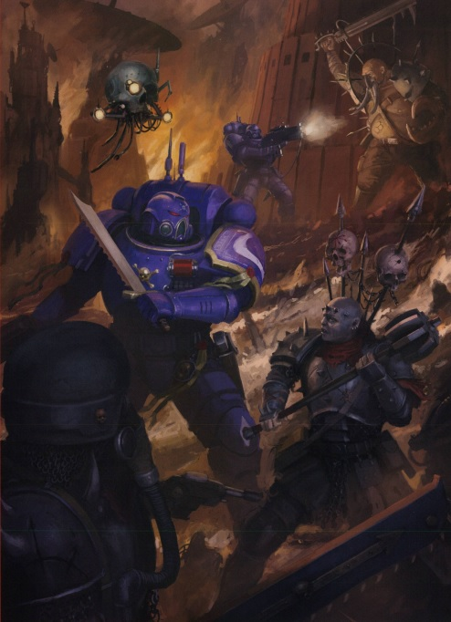
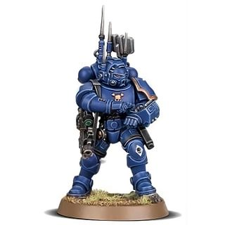
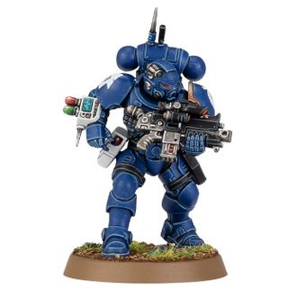
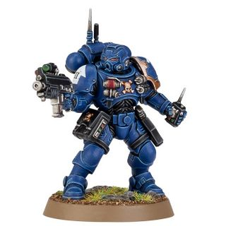
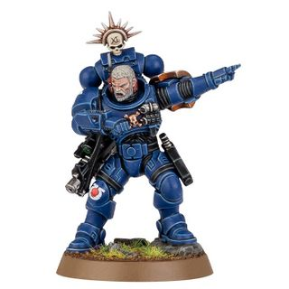
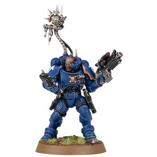
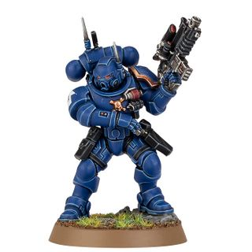

# 0300 渗透者 Infiltrator

精校状态：中文行文已逐段精校，部分术语仍为暂定

分类：通用概念 / 帝国 Imperium / 中央政务部 Adeptus Terra / 阿斯塔特修会 Adeptus Astartes

原文来源：https://www.bilibili.com/opus/1036358080796819477

原作者：帝国神选罐头

原文时间：2025年02月21日 18:38

[返回分类目录](目录.md) · [全书目录](../../目录.md)

<!-- A0300-B0001 -->
**英文原文**

Infiltrators are a type of Primaris Space Marine Vanguard unit.

<!-- /A0300-B0001 -->

<!-- A0300-B0002 -->

原译文

渗透者是原铸星际战士先锋部队的一种。

**校订译文**

渗透者是原铸星际战士先锋部队的一种。

<!-- /A0300-B0002 -->

<!-- A0300-B0003 图片 -->

<!-- A0300-B0004 -->

原译文

Infiltrators 渗透者

**校订译文**

Infiltrators 渗透者

<!-- /A0300-B0004 -->

<!-- A0300-B0005 -->
## Overview 概述

<!-- /A0300-B0005 -->

<!-- A0300-B0006 -->
**英文原文**

Clad in Mk.X Phobos Armour, Infiltrators are responsible for disrupting enemy communications and sabotaging targets of opportunity. Their back-mounted Omni-Scramblers intercept signals across a broad spectrum, scrambling frequencies and shutting down enemy communications. When the time comes for the Infiltrators to fight directly, they emerge from their hiding places under cover of smoke grenades and cut down their foes with disciplined volleys from their marksman Bolt Carbines. Infiltrators are drilled extensively in survival and self-sufficiency techniques due to the long lengths of time they spend behind enemy lines.

<!-- /A0300-B0006 -->

<!-- A0300-B0007 -->

原译文

穿上Mk.X福波斯盔甲，渗透者负责扰乱敌人的通信，趁机破坏目标。他们的后置全知扰频器可以拦截大范围的信号，扰乱频率并关闭敌方通信。当渗透者直接战斗的时候，他们会在烟雾弹的掩护下从藏身之处出来，用神射手爆矢卡宾枪的纪律齐射来消灭敌人。由于渗透者在敌后待的时间很长，他们在生存和自给自足技术方面接受了广泛的训练。

**校订译文**

渗透者身穿 X 型恐惧型护甲，负责扰乱敌方通讯，并伺机破坏暴露的目标。背负的全频扰频器能够截获宽频段信号、干扰频率，切断敌人的通讯。需要正面交战时，他们就在烟雾弹掩护下现身，以射手型爆矢卡宾枪进行严整齐射，将敌人击倒。由于经常长期滞留敌后，渗透者也接受了充分的生存与自给训练。

<!-- /A0300-B0007 -->

<!-- A0300-B0008 -->
## Types of Vanguard Infiltrators 先锋渗透者种类

<!-- /A0300-B0008 -->

<!-- A0300-B0009 -->
### Commsman 通信兵

<!-- /A0300-B0009 -->

<!-- A0300-B0010 -->
**英文原文**

Commsmen act as a strategic nexus upon the battlefield for Phobos Strike Teams, a conduit through which Vox-exchanges and intelligence inloads pass like lightning. The presence of a Commsman increases the Strike Team's versatility and swiftness of action.

<!-- /A0300-B0010 -->

<!-- A0300-B0011 -->

原译文

通信兵在福波斯打击小队的战场上充当着战略纽带，音阵对话和情报输入像闪电一样穿过。通信兵的存在增加了打击小队的灵活性和行动速度。

**校订译文**

通信兵是恐惧打击小队在战场上的战略枢纽，通讯与情报经由他们迅速传递，使小队行动更加灵活、迅捷。

<!-- /A0300-B0011 -->

<!-- A0300-B0012 图片 -->

<!-- A0300-B0013 -->

原译文

Commsman 通信兵

**校订译文**

Commsman 通信兵

<!-- /A0300-B0013 -->

<!-- A0300-B0014 -->
### Helix Adept 螺旋医疗员

原题：Helix Adept 医疗兵

<!-- /A0300-B0014 -->

<!-- A0300-B0015 -->
**英文原文**

A Helix Adept is a trained Apothecary, typically included in a squad of Infiltrators and also Phobos Strike Teams.

<!-- /A0300-B0015 -->

<!-- A0300-B0016 -->

原译文

医疗兵是一名训练有素的药剂师，通常包括在渗透者小队和福波斯突击小队中。

**校订译文**

螺旋医疗员是接受过训练的药剂师，通常配属渗透者小队，也会加入恐惧打击小队。

**校注：** 本篇英文把 Helix Adept 写作受训药剂师；第0266篇明确说尚未成为正式药剂师。保留原文的资格差异并提示待核，不静默改写。

<!-- /A0300-B0016 -->

<!-- A0300-B0017 图片 -->

<!-- A0300-B0018 -->

原译文

Helix Adept 医疗兵

**校订译文**

Helix Adept 螺旋医疗员

<!-- /A0300-B0018 -->

<!-- A0300-B0019 -->
### Saboteur 破坏专家

原题：Saboteur 破坏者

<!-- /A0300-B0019 -->

<!-- A0300-B0020 -->
**英文原文**

Saboteurs are well prepared to rig any target for destruction, with a deadly array of melta charges, super-krak munitions and even anti-plant canisters.

<!-- /A0300-B0020 -->

<!-- A0300-B0021 -->

原译文

破坏者已做好充分准备，使用一系列致命的热熔炸药、超级穿甲弹，甚至反植物霰弹筒，对任何目标进行破坏。

**校订译文**

破坏专家备有多种致命器材，包括热熔装药、超级穿甲弹药，甚至清除植被的药剂罐，能够为各种目标布设毁灭性的破坏手段。

**校注：** Saboteur 暂译破坏专家，以区分官译破坏者小队 Devastator Squad；anti-plant canisters 为清除植被的容器装药，非霰弹筒。

<!-- /A0300-B0021 -->

<!-- A0300-B0022 图片 -->

<!-- A0300-B0023 -->

原译文

Saboteur 破坏者

**校订译文**

Saboteur 破坏专家

<!-- /A0300-B0023 -->

<!-- A0300-B0024 -->
### Sergeant 军士

<!-- /A0300-B0024 -->

<!-- A0300-B0025 -->
**英文原文**

Sergeants are strategic and tactical leader of exceptional skills, exemplars to their Battle Brothers and deadly enemies to the Emperor's foes. Those who command Phobos Strike Teams must be all of these things, for it is by their words and actions that the Kill Team stands or falls.

<!-- /A0300-B0025 -->

<!-- A0300-B0026 -->

原译文

军士是具有卓越技能的战略和战术领导者，是他们战斗兄弟的榜样，也是帝皇之敌的死敌。指挥福波斯突击小队的人必须具备所有这些能力，因为杀戮小队的成败取决于他们的言行。

**校订译文**

军士是战略与战术能力出众的领袖，既是战斗兄弟的榜样，也是帝皇之敌的致命对手。恐惧打击小队的指挥者必须兼具这些素质，因为整个杀戮小队的成败，都系于他的言行。

<!-- /A0300-B0026 -->

<!-- A0300-B0027 图片 -->

<!-- A0300-B0028 -->

原译文

Sergeant 军士

**校订译文**

Sergeant 军士

<!-- /A0300-B0028 -->

<!-- A0300-B0029 -->
### Veteran 老兵

<!-- /A0300-B0029 -->

<!-- A0300-B0030 -->
**英文原文**

Veterans are experienced Infiltrators who stalk their enemies like armored gheists. They wield weaponry selected from their Chapter's most rarefied armories, each one augmented through the careful attentions of master artificers. So-armed, Veterans can act as the nemeses of any foe.

<!-- /A0300-B0030 -->

<!-- A0300-B0031 -->

原译文

老兵是经验丰富的渗透者，他们像披甲幽灵一样跟踪敌人。他们挥舞着从战团军械库中挑选出来的最稀有的武器，每一件都经过工匠大师的精心照料。如此武装，老兵可以成为任何敌人的克星。

**校订译文**

老兵是经验丰富的渗透者，如同披甲幽魂般追猎敌人。他们从战团最珍稀的武器收藏中挑选装备，再由工匠大师精心强化。凭借这样的武装，他们足以成为任何敌人的克星。

<!-- /A0300-B0031 -->

<!-- A0300-B0032 图片 -->

<!-- A0300-B0033 -->

原译文

Veteran 老兵

**校订译文**

Veteran 老兵

<!-- /A0300-B0033 -->

<!-- A0300-B0034 -->
### Voxbreaker 音阵破坏者

<!-- /A0300-B0034 -->

<!-- A0300-B0035 -->
**英文原文**

Voxbreakers use their specialized equipment allows them to scan and isolate enemy threats. Voxbreakers can also break into and plunder their foe's communications for strategic intelligence.

<!-- /A0300-B0035 -->

<!-- A0300-B0036 -->

原译文

音阵破坏者使用他们的专用装备可以扫描和隔离敌人的威胁。音阵破坏者还可以侵入和掠夺敌人的通信，以获取战略情报。

**校订译文**

音阵破坏者运用专门设备扫描并辨别敌方威胁，也能侵入敌人的通讯网络，窃取战略情报。

<!-- /A0300-B0036 -->

<!-- A0300-B0037 图片 -->

<!-- A0300-B0038 -->

原译文

Voxbreaker 音阵破坏者

**校订译文**

Voxbreaker 音阵破坏者

<!-- /A0300-B0038 -->

<!-- A0300-B0039 -->
### Warrior 战士

<!-- /A0300-B0039 -->

<!-- A0300-B0040 -->
**英文原文**

Warriors are swift and aggressive in thought and deed, even by the standards of their brotherhood. Few foes can evade their pinpoint volleys for long or the bone-crushing blows of the Warrior's armored fists.

<!-- /A0300-B0040 -->

<!-- A0300-B0041 -->

原译文

战士们在思想和行动上都很敏捷和有侵略性，即使以他们兄弟的标准来衡量也是如此。很少有敌人能长时间躲避他们的精准齐射或战士装甲拳头的粉碎性打击。

**校订译文**

战士——即使以同袍的标准衡量，他们的思维与行动也格外迅捷、富于进攻性。鲜有敌人能长久避开其精准齐射，或承受覆甲重拳足以碎骨的打击。

<!-- /A0300-B0041 -->

<!-- A0300-B0042 图片 -->

<!-- A0300-B0043 -->

原译文

Warrior 战士

**校订译文**

Warrior 战士

<!-- /A0300-B0043 -->

本篇核心术语与暂定项

以下列出本篇出现的英文原形及核心术语表用词。同形词可能指不同对象，具体词义以本篇正文和校注为准；单复数、别名和仅见于图注的名称可能尚未列入。完整候选见[术语表](../../术语表/双语术语候选.csv)。

| 英文 | 采用中文 | 状态 |
| --- | --- | --- |
| Equipment | 装备 | 编辑用语已统一 |
| Emperor | 帝皇 | 官方已核对 |
| Marksman | 神射手 | 暂定·官方待核 |
| Brotherhood | 兄弟会 | 暂定·官方待核 |
| Phobos | 火卫一 | 暂定·官方待核 |
| Master | 导师（审判庭职衔）／舰务官（舰员职务） | 语境定译·官方待核 |
| Helix Adept | 螺旋医疗员 | 暂定·官方待核 |
| Apothecary | 药剂师 | 官方已核对 |
| Phobos Armour | 恐惧型护甲 | 官方已核 |
| Adept | 帝国任职者（广义）／文吏（行政语境） | 语境定译·官方待核 |
| Space Marine | 星际战士 | 暂定·官方待核 |
| Chapter | 战团 | 暂定·官方待核 |
| Vanguard | 先锋 | 暂定·官方待核 |
| Primaris Space Marine | 原铸星际战士 | 暂定·官方待核 |
| Exemplars | 模范者 | 暂定·官方待核 |
| Omni-scramblers | 全频扰频器 | 暂定·官方待核 |
| Bolt | 爆矢 | 暂定·官方待核 |

