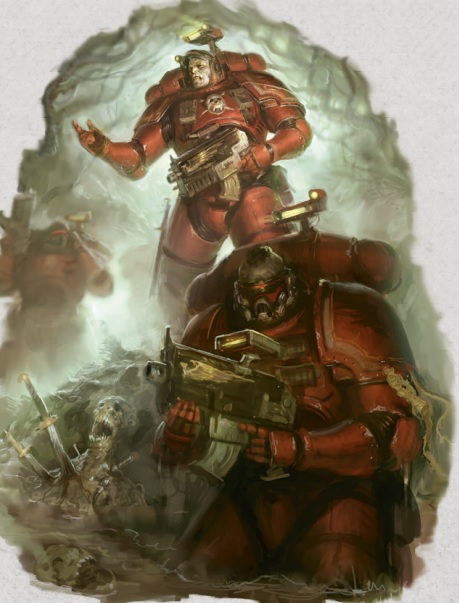
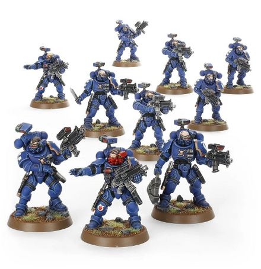
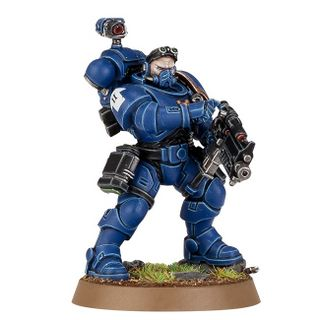
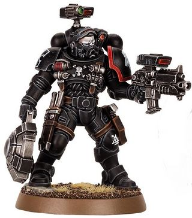
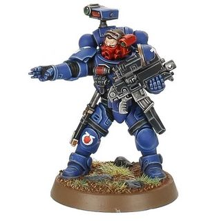
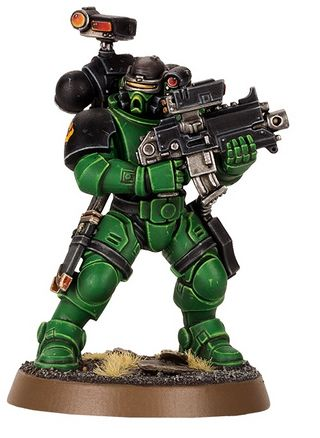

# 0301 入侵者 Incursor

精校状态：中文行文已逐段精校，部分术语仍为暂定

分类：通用概念 / 帝国 Imperium / 中央政务部 Adeptus Terra / 阿斯塔特修会 Adeptus Astartes

原文来源：https://www.bilibili.com/opus/1024420124697821190

原作者：帝国神选罐头

原文时间：2025年01月20日 14:33

[返回分类目录](目录.md) · [全书目录](../../目录.md)

<!-- A0301-B0001 -->
**英文原文**

Incursors are a type of Primaris Space Marine Vanguard unit.

<!-- /A0301-B0001 -->

<!-- A0301-B0002 -->

原译文

入侵者是一类原铸星际战士先锋部队。

**校订译文**

入侵者是一类原铸星际战士先锋部队。

<!-- /A0301-B0002 -->

<!-- A0301-B0003 图片 -->

<!-- A0301-B0004 -->

原译文

Incursor Squad 入侵者小队

**校订译文**

Incursor Squad 入侵者小队

<!-- /A0301-B0004 -->

<!-- A0301-B0005 -->
## Overview 概述

<!-- /A0301-B0005 -->

<!-- A0301-B0006 -->
**英文原文**

Incursor Squads fulfill an aggressive, close-quarters gunfighting role within Astartes forces. Their mission typically sees them storming defended positions, flanking, or spearheading advances to rapidly knock out key enemy assets such as power generators and communication centers. Key to this role are their Occulus Bolt Carbines and the Divinator-class Auspexes that feed directly into their highly advanced transpectral combat visors. This remarkable combination of visual and multi-spectral observation and analysis technology gathers every scrap of data from the wearer's surroundings. It employs a slaved Machine Spirit to collate the findings at a thousand times the speed of human thought and feed the resultant information to the Incursor's field of vision. Armed with this tightly controlled flood of intelligence, Incursors fight in an almost precognitive fashion.

<!-- /A0301-B0006 -->

<!-- A0301-B0007 -->

原译文

入侵者小队在阿斯塔特部队中扮演着激进的近距离枪战角色。他们的任务通常是突袭防御阵地、侧翼或带头推进，以迅速摧毁发电机和通信中心等关键敌方高价值目标。这一角色的关键是他们的全知者爆矢卡宾枪和占卜师级鸟卜仪，它们直接用他们高度先进的幽灵战斗面罩供电。这种视觉和多光谱观察和分析技术的卓越结合收集了佩戴者周围环境的每一条数据。它采用了一种奴工机魂，以人类思维速度的一千倍来整理研究结果，并将得到的信息提供给入侵者的视野。有了这种严格控制的情报洪流，入侵者几乎以预知的方式进行战斗。

**校订译文**

入侵者小队是阿斯塔特部队中积极进取的近距离射击单位，通常负责攻坚、迂回侧击或率先推进，迅速摧毁发电设施、通讯中心等关键目标。全知者爆矢卡宾枪与占卜师级鸟卜仪，是其战法的核心；这些设备会把信息直接传入先进的跨光谱战斗目镜。视觉与多光谱观测、分析技术相结合，收集周围环境中的每一项数据，再由从属机魂以人类思考速度的一千倍整理，最终将结果送入战士的视野。凭借这股经过严密处理的信息洪流，入侵者作战时几乎如同拥有预知能力。

**校注：** feed into 指输送信息，不是供电；slaved Machine Spirit 指从属机魂，不是奴工。transpectral 为跨光谱，不是幽灵。

<!-- /A0301-B0007 -->

<!-- A0301-B0008 图片 -->

<!-- A0301-B0009 -->

原译文

Incursor Squad 入侵者小队

**校订译文**

Incursor Squad 入侵者小队

<!-- /A0301-B0009 -->

<!-- A0301-B0010 -->
**英文原文**

The visors of the Incursors also allow them to see foes through solid walls, smoke, and absolute darkness. They can detect high-altitude drop troops, the signatures of teleporting foes before they materialize, the tectonic tremors that indicate an enemy is about to emerge from a tunnel, and they can even form predictive models of their opponents' fighting patterns in real time. They couple this ability with constant training in combat knife techniques and heavy duty haywire mines to knock out enemy armor.

<!-- /A0301-B0010 -->

<!-- A0301-B0011 -->

原译文

入侵者的面罩也使他们能够透过坚固的墙壁、烟雾和绝对的黑暗看到敌人。它们可以探测到高空空降部队、在传送的敌人出现之前识别敌人的特征、表明敌人即将从隧道中出现的构造震动，甚至可以实时形成对手战斗模式的预测模型。他们将这种能力与战斗刀技术和重任失控地雷的持续训练相结合，以摧毁敌人的装甲。

**校订译文**

入侵者的目镜能看穿墙体、烟雾与彻底的黑暗。他们可以发现高空伞降部队，在传送者现身前捕捉其信号，从地下震动判断敌军即将钻出隧道，甚至实时预测敌人的格斗套路。结合反复磨炼的战斗刀技巧，以及用于摧毁装甲目标的重型紊乱地雷，这种感知能力令他们格外危险。

**校注：** Haywire Mine 暂译紊乱地雷，重型对应 heavy duty；原译重任失控地雷误拆词义。

<!-- /A0301-B0011 -->

<!-- A0301-B0012 -->
## Types of Vanguard Incursors 先锋入侵者类别

<!-- /A0301-B0012 -->

<!-- A0301-B0013 -->
### Marksman 射手

<!-- /A0301-B0013 -->

<!-- A0301-B0014 -->
**英文原文**

Marksmen employ Divinator-Class Auspexes to precognitively track where their targets will be and then accordingly place their kill shots with Occulus Bolt Carbines.

<!-- /A0301-B0014 -->

<!-- A0301-B0015 -->

原译文

射手使用占卜师级鸟卜仪来预知他们的目标将在哪里，然后相应地用全知者爆矢卡宾枪射击。

**校订译文**

射手使用占卜师级鸟卜仪预测目标即将抵达的位置，再以全知者爆矢卡宾枪打出致命一击。

<!-- /A0301-B0015 -->

<!-- A0301-B0016 图片 -->

<!-- A0301-B0017 -->

原译文

Incursor Marksman 入侵者射手

**校订译文**

Incursor Marksman 入侵者射手

<!-- /A0301-B0017 -->

<!-- A0301-B0018 -->
### Minelayer 布雷者

<!-- /A0301-B0018 -->

<!-- A0301-B0019 -->
**英文原文**

Minelayers plant heavy duty Haywire Mines, at pre-cogitated nexuses of probable enemy movement.

<!-- /A0301-B0019 -->

<!-- A0301-B0020 -->

原译文

布雷者在预先考虑过的敌人可能移动的地点埋设了重任失控地雷。

**校订译文**

布雷者预先计算敌军可能经过的关键节点，再于这些位置埋设重型紊乱地雷。

<!-- /A0301-B0020 -->

<!-- A0301-B0021 图片 -->

<!-- A0301-B0022 -->

原译文

Incursor Minelayer 入侵者布雷者

**校订译文**

Incursor Minelayer 入侵者布雷者

<!-- /A0301-B0022 -->

<!-- A0301-B0023 -->
### Sergeant 军士

<!-- /A0301-B0023 -->

<!-- A0301-B0024 -->
**英文原文**

Sergeants tend towards aggressive and dynamic strategies. Those in command of Phobos Strike Teams lead them in furious covert offensives, that leave enemy command structures and logistical chains in tatters. This then makes them ripe for a planetary onslaught by a full-blown Space Marine Strike Force.

<!-- /A0301-B0024 -->

<!-- A0301-B0025 -->

原译文

军士倾向于攻击性和动态策略。普罗比斯突击小队的指挥官带领他们进行了激烈的秘密攻势，使敌人的指挥结构和后勤链支离破碎。这使他们为全面的星际战士打击部队的行星攻击做好了准备。

**校订译文**

军士偏好主动而灵活的战术。率领恐惧打击小队时，他们会发动猛烈的隐秘攻势，将敌人的指挥体系与后勤链条打得支离破碎，为完整的星际战士打击部队发动行星总攻创造条件。

<!-- /A0301-B0025 -->

<!-- A0301-B0026 图片 -->

<!-- A0301-B0027 -->

原译文

Incursor Sergeant 入侵者军士

**校订译文**

Incursor Sergeant 入侵者军士

<!-- /A0301-B0027 -->

<!-- A0301-B0028 -->
### Warrior 战士

<!-- /A0301-B0028 -->

<!-- A0301-B0029 -->
**英文原文**

Warriors are potent offensive skirmishers who use their oracular auspices to spot enemy targets. The Warriors then press swiftly upon their foes' positions before engaging in bloody, one-sided firefights with the outmaneuvered enemy.

<!-- /A0301-B0029 -->

<!-- A0301-B0030 -->

原译文

战士是强大的进攻性散兵，他们利用高深莫测的预兆来发现敌人的目标。然后，战士迅速向敌人的阵地推进，然后与堕落的敌人进行血腥的、单方面的交火。

**校订译文**

战士是进攻能力出众的散兵，借助具有预测功能的鸟卜仪发现目标，迅速逼近敌军阵地，再对已经失去机动优势的敌人展开血腥而悬殊的枪战。

**校注：** outmaneuvered 指战术机动上落于下风，不是堕落；oracular auspices 按本篇设备语境理解为具预测作用的鸟卜仪。

<!-- /A0301-B0030 -->

<!-- A0301-B0031 图片 -->

<!-- A0301-B0032 -->

原译文

Incursor Warrior 入侵者战士

**校订译文**

Incursor Warrior 入侵者战士

<!-- /A0301-B0032 -->

本篇核心术语与暂定项

以下列出本篇出现的英文原形及核心术语表用词。同形词可能指不同对象，具体词义以本篇正文和校注为准；单复数、别名和仅见于图注的名称可能尚未列入。完整候选见[术语表](../../术语表/双语术语候选.csv)。

| 英文 | 采用中文 | 状态 |
| --- | --- | --- |
| Phobos | 火卫一 | 暂定·官方待核 |
| Mission | 教团／传教机构 | 暂定 |
| Space Marine | 星际战士 | 暂定·官方待核 |
| Vanguard | 先锋 | 暂定·官方待核 |
| Incursor | 入侵者 | 暂定·官方待核 |
| Primaris Space Marine | 原铸星际战士 | 暂定·官方待核 |
| Absolute | 绝对号 | 暂定·官方待核 |
| Bolt | 爆矢 | 暂定·官方待核 |
| Combat Knife | 战斗刀 | 暂定·官方待核 |

