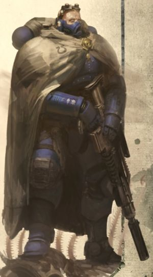
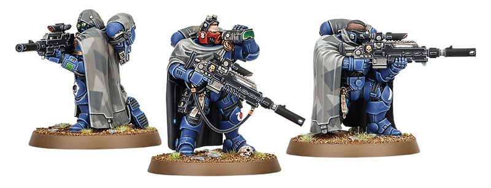

# 0302 歼灭者 Eliminator

精校状态：中文行文已逐段精校，部分术语仍为暂定

分类：通用概念 / 帝国 Imperium / 中央政务部 Adeptus Terra / 阿斯塔特修会 Adeptus Astartes

原文来源：https://www.bilibili.com/opus/1036357960524103680

原作者：帝国神选罐头

原文时间：编辑于 2025年09月24日 13:22

[返回分类目录](目录.md) · [全书目录](../../目录.md)

<!-- A0302-B0001 -->
**英文原文**

Eliminators are Vanguard Primaris Space Marine snipers that utilize a range of exotic and deadly ammunition tailored to their target.

<!-- /A0302-B0001 -->

<!-- A0302-B0002 -->

原译文

歼灭者是先锋原铸星际战士狙击手，他们使用一系列针对目标量身定制的奇异和致命的弹药。

**校订译文**

歼灭者是原铸先锋星际战士中的狙击手，使用针对不同目标专门配制的稀有、致命弹药。

<!-- /A0302-B0002 -->

<!-- A0302-B0003 图片 -->

<!-- A0302-B0004 -->

原译文

Vanguard Eliminator 先锋歼灭者

**校订译文**

Vanguard Eliminator 先锋歼灭者

<!-- /A0302-B0004 -->

<!-- A0302-B0005 -->
**英文原文**

Eliminator Squads utilize an even more stripped-down version of the Mk.X Phobos Armour, allowing them to operate with maximum stealth. These warriors serve as dedicated marksman and fire support specialists that haunt the shadows of the battlefield seeking out targets of opportunity and bringing them down from a range. Their primary armament is the Mk.III Shrike Pattern Bolt Sniper Rifle, Las Fusil, or Instigator Bolt Carbine.

<!-- /A0302-B0005 -->

<!-- A0302-B0006 -->

原译文

歼灭战小队使用了Mk.X福波斯盔甲的简化版本，使他们能够以最大的隐身能力作战。这些战士是专业的神枪手和火力支援专家，在战场的阴影中寻找机会目标，并将其从远处击落。他们的主要武器是Mk.III伯劳型爆矢狙击步枪、激光狙击枪或煽动者爆矢卡宾枪。

**校订译文**

歼灭者小队穿着进一步精简的 X 型恐惧型护甲，以求最大程度地隐蔽行动。他们是专职神射手与火力支援专家，在战场阴影中游猎，寻找可乘之机，从远处击倒目标。主要武器包括 Mk.III 伯劳鸟型爆矢狙击步枪、激光狙击枪或煽动者爆矢卡宾枪。

**校注：** 已核同一人物、组织、型号或事件，与全书核心术语及后续专篇统一；原译保留对照。

<!-- /A0302-B0006 -->

<!-- A0302-B0007 图片 -->

<!-- A0302-B0008 -->

原译文

Vanguard Eliminator 先锋歼灭者

**校订译文**

Vanguard Eliminator 先锋歼灭者

<!-- /A0302-B0008 -->

<!-- A0302-B0009 -->
**英文原文**

The optical sights of this weapon can be tailored for any situation, from thermoscopic vision to precision auspex scans that can penetrate several feet of solid matter. Once locked on to, there is nowhere for an Eliminator's prey to hide. Each member of the squad carries spare magazines filled with special ammunition, tailored for every eventuality. Hyperfrag rounds detonate in a shower of shrapnel, Executioner rounds are sophisticated self-guided missiles slaved to a miniaturized cogitator that can seek their target from behind cover, while mortis rounds spew self-replicating mutagenic toxins into the flesh of a target.

<!-- /A0302-B0009 -->

<!-- A0302-B0010 -->

原译文

这种武器的光学瞄准器可以针对任何情况进行定制，从热视觉到可以穿透几英尺固体物质的精密鸟卜仪扫描。一旦锁定，歼灭者的猎物就无处可藏。小队的每个成员都带着装满特殊弹药的备用弹夹，为各种可能的情况量身定制。超级破片弹在一阵弹片引爆，刽子手弹药是复杂的自导导弹，由一个微型沉思者控制，可以从掩体后面寻找目标，而死亡弹药则将自我复制的诱变毒素注入目标体内。

**校订译文**

武器瞄具可按环境调整，从热成像到能够穿透数英尺厚实物质的精密鸟卜扫描，无所不包。一旦被锁定，猎物便无处藏身。每名队员都携带装有特种弹药的备用弹匣，以应对各种情况：超级破片弹引爆后散射密集弹片；处刑者弹则是由微型沉思者控制的精密自导弹药，能够追击藏在掩体后的目标；死亡弹会把能自我复制的诱变毒素注入目标血肉。

**校注：** Executioner rounds 暂译处刑者弹；与装药用途不同的药剂师 Carnifex 刽子手器械分开登记。

<!-- /A0302-B0010 -->

<!-- A0302-B0011 -->
## Chapter Variations 各战团的不同做法

原题：Chapter Variations 战团变体

<!-- /A0302-B0011 -->

<!-- A0302-B0012 -->
**英文原文**

Wolf Scouts of the Space Wolves (take up the role of Eliminator as required)

<!-- /A0302-B0012 -->

<!-- A0302-B0013 -->

原译文

太空野狼的野狼侦察兵（根据需要担任歼灭者）

**校订译文**

太空野狼的狼侦查（依任务需要担任歼灭者）

**校注：** Wolf Scouts采用GW09第34/GW10第33官译狼侦查，保留官方“侦查”写法；原野狼侦察兵见对照。

<!-- /A0302-B0013 -->

本篇核心术语与暂定项

以下列出本篇出现的英文原形及核心术语表用词。同形词可能指不同对象，具体词义以本篇正文和校注为准；单复数、别名和仅见于图注的名称可能尚未列入。完整候选见[术语表](../../术语表/双语术语候选.csv)。

| 英文 | 采用中文 | 状态 |
| --- | --- | --- |
| Space Wolves | 太空野狼 | 官方已核对 |
| Sniper rifle | 狙击步枪 | 暂定·官方待核 |
| Bolt Sniper Rifle | 爆矢狙击步枪 | 暂定·官方待核 |
| Instigator Bolt Carbine | 煽动者爆矢卡宾枪 | 暂定·官方待核 |
| Las Fusil | 激光狙击枪 | 暂定·官方待核 |
| Marksman | 神射手 | 暂定·官方待核 |
| Phobos | 火卫一 | 暂定·官方待核 |
| Phobos Armour | 恐惧型护甲 | 官方已核 |
| Executioner rounds | 处刑者弹 | 暂定·官方待核 |
| Space Marine | 星际战士 | 暂定·官方待核 |
| Vanguard | 先锋 | 暂定·官方待核 |
| Eliminator | 歼灭者 | 暂定·官方待核 |
| Primaris Space Marine | 原铸星际战士 | 暂定·官方待核 |
| Eliminator Squads | 歼灭者小队 | 暂定·官方待核 |
| Fusil | 相位火枪 | 暂定·官方待核 |
| Wolf Scouts | 狼侦查 | 官方已核对 |
| Mk.III Shrike Pattern Bolt Sniper Rifle | Mk.III 伯劳鸟型爆矢狙击步枪 | 暂定·官方待核 |
| Bolt | 爆矢 | 暂定·官方待核 |
| Bolt Carbine | 爆矢卡宾枪 | 暂定·官方待核 |
| Auspex | 鸟卜仪 | 暂定·官方待核 |

