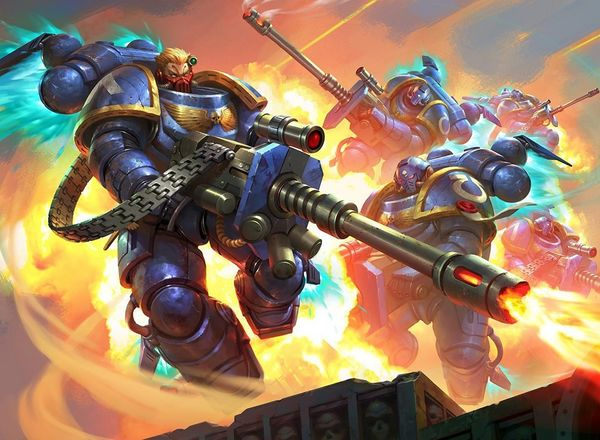
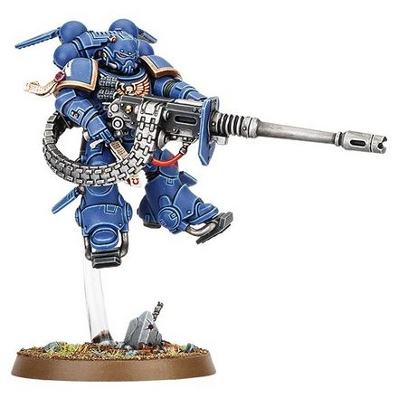

# 0303 压制者 Suppressor

精校状态：中文行文已逐段精校，部分术语仍为暂定

分类：通用概念 / 帝国 Imperium / 中央政务部 Adeptus Terra / 阿斯塔特修会 Adeptus Astartes

原文来源：https://www.bilibili.com/opus/1035086203559346195

原作者：帝国神选罐头

原文时间：2025年02月18日 08:23

[返回分类目录](目录.md) · [全书目录](../../目录.md)

<!-- A0303-B0001 -->
**英文原文**

Suppressors are Fire support warriors clad in Omnis Pattern power armour, a variant of Gravis Armour.

<!-- /A0303-B0001 -->

<!-- A0303-B0002 -->

原译文

压制者是身穿全知型动力盔甲的火力支援战士，这是格拉维斯盔甲的一种变体。

**校订译文**

压制者是穿着全知型动力甲的火力支援战士；这种护甲是重装型护甲的变型。

<!-- /A0303-B0002 -->

<!-- A0303-B0003 图片 -->

<!-- A0303-B0004 -->

原译文

Suppressors 压制者

**校订译文**

Suppressors 压制者

<!-- /A0303-B0004 -->

<!-- A0303-B0005 -->
## Overview 概述

<!-- /A0303-B0005 -->

<!-- A0303-B0006 -->
**英文原文**

The Omnis Pattern is lighter than the standard Gravis configuration and is equipped with a jump pack, grav-chute, and shock absorbers. Suppressors rely on their mobility to maneuver into enfilading positions where their accelerator autocannons will tear through heavily armoured enemies and light vehicles.

<!-- /A0303-B0006 -->

<!-- A0303-B0007 -->

原译文

全知型比标准格拉维斯型配置更轻，配备了跳跃背包、重力伞和减震器。压制者依靠其机动性机动到包围位置，在那里他们的加速自动炮将撕裂重型装甲敌人和轻型车辆。

**校订译文**

全知型护甲比标准重装型配置更轻，配备跳跃背包、重力伞与减震装置。压制者凭借机动性抢占能够沿敌阵纵向扫射的位置，以加速自动炮撕裂重甲敌军与轻型载具。

**校注：** enfilading positions 指可沿敌军队列纵向射击的位置，不是包围位置。

<!-- /A0303-B0007 -->

<!-- A0303-B0008 -->
**英文原文**

Suppressors specialise in rapid responses to heavily armoured enemy threats, entering battle either by dropping directly into the action via grav chutes or in long, bounding leaps with their jump packs. As soon as a target is sighted, the Suppressors engage their shock-absorbing servo plates and let fly with their accelerator autocannons. The brutal ferocity of the foot-long, armour-piercing shells they unleash will blast apart anyone caught in their path and force even the most stoic enemies to seek shelter from the murderous firestorm.

<!-- /A0303-B0008 -->

<!-- A0303-B0009 -->

原译文

压制者擅长对重型装甲敌人的威胁做出快速反应，他们要么通过重力伞直接投入战斗，要么用跳跃背包进行长距离跳跃。一旦发现目标，压制者就会接合其减震伺服板，并飞行使用其加速自动炮。他们发射的长达一英尺的穿甲炮弹的残酷凶猛将炸开任何被困在他们路上的人，甚至迫使最坚忍不拔的敌人对这凶残的火力风暴寻求掩体。

**校订译文**

压制者专门快速应对敌方重甲威胁，既可用重力伞直降战场，也可借跳跃背包连续远跃。一旦发现目标，他们便启动减震伺服板，以加速自动炮猛烈开火。长达一英尺的穿甲炮弹能将弹道上的敌人炸得粉碎；即使最沉着的对手，也不得不躲避这场致命的火力风暴。

**校注：** let fly 指开火，不是边飞行边使用武器。

<!-- /A0303-B0009 -->

<!-- A0303-B0010 图片 -->

<!-- A0303-B0011 -->

原译文

Vanguard Suppressor 先锋压制者

**校订译文**

Vanguard Suppressor 先锋压制者

<!-- /A0303-B0011 -->

<!-- A0303-B0012 -->
## Chapter Variations 各战团的不同做法

原题：Chapter Variations 战团变体

<!-- /A0303-B0012 -->

<!-- A0303-B0013 -->
**英文原文**

Grey Hunters of the Space Wolves (take up the role of Suppressors as required)

<!-- /A0303-B0013 -->

<!-- A0303-B0014 -->

原译文

太空野狼的灰猎（根据需要扮演压制者的角色）

**校订译文**

太空野狼的灰色猎手，可按需要承担压制者职责。

<!-- /A0303-B0014 -->

<!-- A0303-B0015 -->
## Wargear 战备

<!-- /A0303-B0015 -->

<!-- A0303-B0016 -->
**英文原文**

Suppressors never wield any primary weapon other than their signature accelerator autocannons. Their full loadout:

<!-- /A0303-B0016 -->

<!-- A0303-B0017 -->

原译文

压制者除了其标志性的加速自动炮外，不使用任何主要武器。他们的满载：

**校订译文**

压制者的主武器始终是标志性的加速自动炮。完整装备如下：

<!-- /A0303-B0017 -->

<!-- A0303-B0018 -->

原译文

MkX Omnis Armour MkX全知型盔甲

**校订译文**

MkX Omnis Armour MkX全知型盔甲

<!-- /A0303-B0018 -->

<!-- A0303-B0019 -->

原译文

Jump Pack 跳跃背包

**校订译文**

Jump Pack 跳跃背包

<!-- /A0303-B0019 -->

<!-- A0303-B0020 -->

原译文

Grav-Chute 重力伞

**校订译文**

Grav-Chute 重力伞

<!-- /A0303-B0020 -->

<!-- A0303-B0021 -->

原译文

Accelerator Autocannon 加速自动炮

**校订译文**

Accelerator Autocannon 加速自动炮

<!-- /A0303-B0021 -->

<!-- A0303-B0022 -->

原译文

Bolt Pistol 爆矢手枪

**校订译文**

Bolt Pistol 爆矢手枪

<!-- /A0303-B0022 -->

<!-- A0303-B0023 -->

原译文

Frag Grenades 破片手榴弹

**校订译文**

Frag Grenades 破片手榴弹

<!-- /A0303-B0023 -->

<!-- A0303-B0024 -->

原译文

Krak Grenades 穿甲手榴弹

**校订译文**

Krak Grenades 穿甲手榴弹

<!-- /A0303-B0024 -->

<!-- A0303-B0025 -->

原译文

Smoke Grenades 烟雾手榴弹

**校订译文**

Smoke Grenades 烟雾手榴弹

<!-- /A0303-B0025 -->

本篇核心术语与暂定项

以下列出本篇出现的英文原形及核心术语表用词。同形词可能指不同对象，具体词义以本篇正文和校注为准；单复数、别名和仅见于图注的名称可能尚未列入。完整候选见[术语表](../../术语表/双语术语候选.csv)。

| 英文 | 采用中文 | 状态 |
| --- | --- | --- |
| Space Wolves | 太空野狼 | 官方已核对 |
| Grey Hunters | 灰色猎手 | 官方已核对 |
| Omnis Pattern Power Armour | 全知型动力甲 | 暂定·官方待核 |
| Power Armour | 动力盔甲 | 暂定·官方待核 |
| Ferocity | 凶猛 | 暂定·官方待核 |
| Jump Pack | 跳跃背包 | 暂定·官方待核 |
| Grav Chutes | 重力伞 | 暂定·官方待核 |

