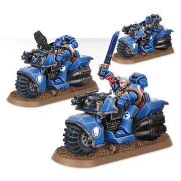
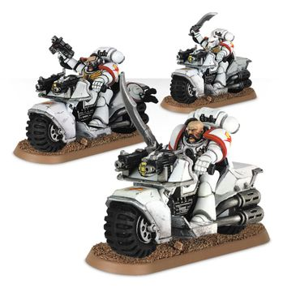
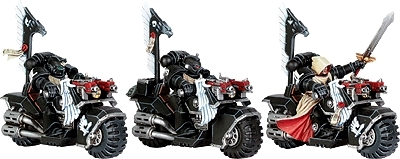
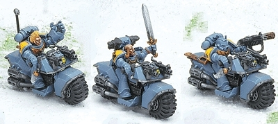

# 0305 摩托小队 Bike Squad

精校状态：中文行文已逐段精校，部分术语仍为暂定

分类：通用概念 / 帝国 Imperium / 中央政务部 Adeptus Terra / 阿斯塔特修会 Adeptus Astartes

原文来源：https://www.bilibili.com/opus/1034056072802861080

原作者：帝国神选罐头

原文时间：2025年02月15日 13:45

[返回分类目录](目录.md) · [全书目录](../../目录.md)

<!-- A0305-B0001 -->
**英文原文**

Use your Bike squads as a blade, striking the enemy and turning aside his counter-blows in equal measure. But in all things beware that speed is nothing without direction, just as even the mightiest weapon is worthless without careful aim.

<!-- /A0305-B0001 -->

<!-- A0305-B0002 -->
**英文原文**

A biker's stance should always be resolute and dauntless, but neer immobile or rigid. Speed is his advantage, and surprise his deadliest weapon. In fluidity he will find success, and in success shall he find renown.

<!-- /A0305-B0002 -->

<!-- A0305-B0003 -->
**英文原文**

Roboute Guilliman, quoted in the Apocrypha of Skaros.

<!-- /A0305-B0003 -->

<!-- A0305-B0004 -->

原译文

将你的摩托小队化作利刃，打击敌人的同时有效化解敌人的反击。但无论何时都要警惕，没有方向的速度毫无意义，正如再强大的武器，若不精心瞄准也毫无价值。

**校订译文**

将你的摩托小队化作利刃，打击敌人的同时有效化解敌人的反击。但无论何时都要警惕，没有方向的速度毫无意义，正如再强大的武器，若不精心瞄准也毫无价值。

<!-- /A0305-B0004 -->

<!-- A0305-B0005 -->

原译文

骑手的姿态应始终坚定无畏，但绝不能静止不动或僵化刻板。速度是他们的优势，出其不意则是他们最致命的武器。在灵活多变中他们会收获成功，而在成功中他们将赢得荣誉。

**校订译文**

骑手的姿态应始终坚定无畏，但绝不能静止不动或僵化刻板。速度是他们的优势，出其不意则是他们最致命的武器。在灵活多变中他们会收获成功，而在成功中他们将赢得荣誉。

<!-- /A0305-B0005 -->

<!-- A0305-B0006 -->

原译文

罗伯特·基里曼，引自斯卡罗斯经书

**校订译文**

——罗保特·基里曼，载于《斯卡罗斯次经》

<!-- /A0305-B0006 -->

<!-- A0305-B0007 -->
**英文原文**

Space Marine Bike Squads are fast moving, light-attack units mounted on Space Marine Bikes.

<!-- /A0305-B0007 -->

<!-- A0305-B0008 -->

原译文

星际战士摩托小队是配备星际战士摩托进行快速移动的轻型攻击部队。

**校订译文**

星际战士摩托小队是骑乘战斗摩托的快速轻型攻击部队。

<!-- /A0305-B0008 -->

<!-- A0305-B0009 图片 -->

<!-- A0305-B0010 -->

原译文

Ultramarines Bike Squadron 极限战士摩托中队

**校订译文**

Ultramarines Bike Squadron 极限战士摩托中队

<!-- /A0305-B0010 -->

<!-- A0305-B0011 -->
## Overview 概述

<!-- /A0305-B0011 -->

<!-- A0305-B0012 -->
**英文原文**

These squads are used by Space Marines for a variety of missions, including reconnaissance and breakthrough of enemy lines. Able to outflank enemy forces with ease, these Squads are often paired with Scout Squads or Land Speeder flights, but are more than capable of operating on their own. For Chapters which follow the dictates of the Codex Astartes, all Assault Marines and Scouts are trained in how to operate a bike, as well as the entire 6th Company.

<!-- /A0305-B0012 -->

<!-- A0305-B0013 -->

原译文

这些小队被星际战士用于各种任务，包括侦察和突破敌方战线。这些小队能够轻松地从侧面包围敌军，通常与侦察小队或兰德速攻艇编队配对，但它们完全有能力独立作战。对于遵循阿斯塔特圣典规定的战团，所有突击星际战士和侦察兵以及整个第六连都接受了如何操作摩托的培训。

**校订译文**

摩托小队执行侦察、突破敌阵等多种任务，能够轻易迂回敌军侧翼，常与侦察小队或兰德速攻艇编队协同，也完全能够独立行动。遵循《阿斯塔特圣典》的战团，会让所有突击战士、侦察兵及第六连全体成员，接受摩托驾驶训练。

<!-- /A0305-B0013 -->

<!-- A0305-B0014 图片 -->

<!-- A0305-B0015 -->

原译文

White Scars Bike Squadron 白色疤痕摩托中队

**校订译文**

White Scars Bike Squadron 白疤摩托中队

<!-- /A0305-B0015 -->

<!-- A0305-B0016 -->
**英文原文**

A Bike Squad consists of a Sergeant and two to seven bikers on bikes, and may include two more bikers riding the same attack bike. In addition to the weapons mounted on their bikes, the Space Marines carry bolt pistols or chainswords, as well as frag and krak grenades. Some of the bikers may carry a flamer, grav-gun, meltagun, or plasma gun instead of a pistol, and the sergeant sometimes instead carries a power weapon or combi weapon, as needed. If present, the attack bike is armed with either a heavy bolter or multi-melta on its sidecar (the marine driving the bike is typically armed like the other bikers).

<!-- /A0305-B0016 -->

<!-- A0305-B0017 -->

原译文

摩托小队由一名军士和两到七名骑手组成，可能还包括另外两名骑同一辆攻击摩托的骑手。除了摩托上安装的武器外，星际战士还携带爆矢手枪或链锯剑，以及破片和穿甲手榴弹。一些骑手可能会携带火焰枪、重力枪、热熔枪或等离子枪，而不是手枪，军士有时会根据需要携带动力武器或复合武器。如果存在，攻击摩托的侧车上会配备重型爆矢枪或多管热熔（驾驶摩托的星际战士通常会像其他骑手一样配备武器）。

**校订译文**

摩托小队由一名军士与两至七名骑手组成，还可增配一辆由两人共同操作的攻击摩托。除车载武器外，战士携带爆矢手枪或链锯剑，以及破片与穿甲手榴弹。部分骑手可用喷火器、重力枪、热熔枪或等离子枪替换手枪；军士也可按需要选择动力武器或复合武器。若小队编有攻击摩托，其边斗配备重型爆矢枪或多管热熔，驾驶员的个人武器则通常与其他骑手相同。

<!-- /A0305-B0017 -->

<!-- A0305-B0018 -->
## Chapter Variants 各战团的不同做法

原题：Chapter Variants 战团变体

<!-- /A0305-B0018 -->

<!-- A0305-B0019 -->
**英文原文**

Some Chapters do not abide by the Codex Astartes, and operate their Bike Squads in a different manner. The Dark Angels' 2nd Company, the Ravenwing, is completely mounted on Bikes, Attack Bikes, and Land Speeders. The Salamanders use fewer companies, but with more Marines in each company, and so bikes only feature in the 2nd, 3rd, and 4th Companies.

<!-- /A0305-B0019 -->

<!-- A0305-B0020 -->

原译文

有些战团不遵守阿斯塔特圣典，并以不同的方式运作他们的摩托小队。黑暗天使的第二连，鸦翼，完全配备了摩托、攻击摩托和兰德速攻艇。火蜥蜴使用的连队较少，但每个连队都有更多的星际战士，因此摩托只出现在第二、第三和第四连队。

**校订译文**

一些战团按自身传统运用摩托小队。黑暗天使第二连“鸦翼”的全体成员，都搭乘摩托、攻击摩托或兰德速攻艇作战。火蜥蜴的连数较少，但单连人数更多，摩托部队只编入第二、第三和第四连。

<!-- /A0305-B0020 -->

<!-- A0305-B0021 图片 -->

<!-- A0305-B0022 -->

原译文

Dark Angels Bike Squadron 黑暗天使摩托中队

**校订译文**

Dark Angels Bike Squadron 黑暗天使摩托中队

<!-- /A0305-B0022 -->

<!-- A0305-B0023 -->
**英文原文**

While the Space Wolves make use of Bike Squads, the only Wolves known to ride bikes are the Swiftclaws. Even then, only a few of them do this, as it is considered an overly headstrong approach to warfare. At the opposite end of the spectrum, the White Scars are most famous for making heavy use of Bikes due to the open plains on which they train on Mundus Planus.

<!-- /A0305-B0023 -->

<!-- A0305-B0024 -->

原译文

虽然太空野狼使用摩托小队，但已知唯一会骑摩托的野狼是迅爪。即便如此，他们中只有少数人这样做，因为这被认为是一种过于任性的战争方式。与之相对的，白色疤痕最出名的是大量使用摩托，因为他们在蒙达斯·普莱纳斯上开阔的平原训练。

**校订译文**

太空野狼虽也使用摩托小队，已知骑乘摩托的却只有迅爪，而且人数不多；这种战法在战团看来过于鲁莽。白疤则恰恰相反，以大量运用摩托闻名，因为他们平时就在蒙达斯·普莱纳斯的辽阔平原上训练。

<!-- /A0305-B0024 -->

<!-- A0305-B0025 图片 -->

<!-- A0305-B0026 -->

原译文

Space Wolves Bike Squadron 太空野狼摩托中队

**校订译文**

Space Wolves Bike Squadron 太空野狼摩托中队

<!-- /A0305-B0026 -->

本篇核心术语与暂定项

以下列出本篇出现的英文原形及核心术语表用词。同形词可能指不同对象，具体词义以本篇正文和校注为准；单复数、别名和仅见于图注的名称可能尚未列入。完整候选见[术语表](../../术语表/双语术语候选.csv)。

| 英文 | 采用中文 | 状态 |
| --- | --- | --- |
| Space Marines | 星际战士 | 官方已核对 |
| Dark Angels | 黑暗天使 | 官方已核对 |
| Space Wolves | 太空野狼 | 官方已核对 |
| Roboute Guilliman | 罗保特·基里曼 | 官方已核对 |
| Salamanders | 火蜥蜴 | 暂定·官方待核 |
| Apocrypha of Skaros | 斯卡罗斯次经 | 暂定·官方待核 |
| White Scars | 白疤 | 官方已核 |
| Scars | 伤疤 | 暂定·官方待核 |
| Krak Grenades | 穿甲手榴弹 | 暂定·官方待核 |
| Space Marine | 星际战士 | 暂定·官方待核 |
| Sergeant | 军士 | 暂定·官方待核 |
| Scout | 侦察兵 | 暂定·官方待核 |
| Codex Astartes | 阿斯塔特圣典 | 暂定·官方待核 |
| Land Speeders | 兰德速攻艇 | 暂定·官方待核 |
| Bike Squads | 摩托小队 | 暂定·官方待核 |
| Bikes | 摩托 | 暂定·官方待核 |
| Mundus Planus | 蒙达斯·普莱纳斯 | 暂定·官方待核 |
| Gun | 甘 | 暂定·官方待核 |
| The Dark | 《黑暗》 | 暂定·官方待核 |
| Bolt | 爆矢 | 暂定·官方待核 |
| Bolter | 爆矢枪 | 暂定·官方待核 |
| Heavy bolter | 重型爆矢枪 | 官方已核对 |
| Flamer | 火焰喷射器（武器）／火妖（奸奇单位） | 语境定译·对应官译已核 |
| Meltagun | 热熔枪 | 官方已核对 |
| Multi-melta | 多管热熔 | 官方已核对 |
| Plasma gun | 等离子枪 | 官方已核对 |
| Power weapon | 动力武器 | 官方已核对 |

