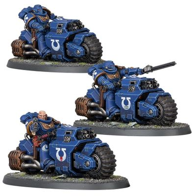

# 0306 原铸摩托警卫 Primaris Outrider

精校状态：中文行文已逐段精校，部分术语仍为暂定

分类：通用概念 / 帝国 Imperium / 中央政务部 Adeptus Terra / 阿斯塔特修会 Adeptus Astartes

原文来源：https://www.bilibili.com/opus/1031874792067694608

原作者：帝国神选罐头

原文时间：编辑于 2025年02月17日 18:21

[返回分类目录](目录.md) · [全书目录](../../目录.md)

原篇名：原铸先遣者 Primaris Outrider

<!-- A0306-B0001 -->
**英文原文**

Primaris Outriders are Primaris Space Marines who ride to battle on Space Marine Bikes.

<!-- /A0306-B0001 -->

<!-- A0306-B0002 -->

原译文

原铸先遣者是乘坐星际战士摩托参加战斗的原铸星际战士。

**校订译文**

原铸摩托警卫是骑乘星际战士摩托出战的原铸星际战士。

**校注：** Outrider Squad 官译摩托警卫小队（GW-09中文32页/GW-10英文31页）；此处个体称谓按词组对应暂作摩托警卫。

<!-- /A0306-B0002 -->

<!-- A0306-B0003 图片 -->

<!-- A0306-B0004 -->

原译文

Ultramarines Primaris Outriders 极限战士原铸先遣者

**校订译文**

Ultramarines Primaris Outriders 极限战士原铸摩托警卫

<!-- /A0306-B0004 -->

<!-- A0306-B0005 -->
**英文原文**

Outriders are most commonly used to advance ahead of the main lines and to guard the flanks of larger formations. In battle, they perform lightning fast hit-and-run attacks on enemy strongholds, and are employed to chase down any who would seek to escape. Their Raider Pattern bikes are equipped with frontal Bolters while they themselves wield Chainswords and Bolt Pistols. The bike incorporates advanced suspension units to tackle rough terrain. The performance of the bike is effective as long as the rider can dominate its bellicose Machine Spirit.

<!-- /A0306-B0005 -->

<!-- A0306-B0006 -->

原译文

先遣者最常用于在主战线前方前进，并保护较大编队的侧翼。在战斗中，他们对敌人的据点进行闪电般的攻击，并被用来追捕任何试图逃跑的人。他们的突袭者型摩托配备了前部爆矢枪，而他们自己则挥舞着链锯剑和爆矢手枪。这辆摩托采用了先进的悬架装置，以应对崎岖的地形。只要骑手能够驾驭其好战的机魂，摩托的性能就是有效的。

**校订译文**

摩托警卫通常先于主战线推进，或保护较大编队的侧翼。他们对敌方据点发动闪电般的袭扰，打了就走，也负责追歼逃敌。骑乘的突袭者型摩托前部装有爆矢枪，骑手本人则携带链锯剑与爆矢手枪。先进的悬挂系统让车辆能够应付崎岖地形；只要骑手能驾驭其好战的机魂，就能充分发挥性能。

<!-- /A0306-B0006 -->

本篇核心术语与暂定项

以下列出本篇出现的英文原形及核心术语表用词。同形词可能指不同对象，具体词义以本篇正文和校注为准；单复数、别名和仅见于图注的名称可能尚未列入。完整候选见[术语表](../../术语表/双语术语候选.csv)。

| 英文 | 采用中文 | 状态 |
| --- | --- | --- |
| Space Marines | 星际战士 | 官方已核对 |
| Space Marine | 星际战士 | 暂定·官方待核 |
| Raider | 掠袭者飞艇 | 官方已核对 |
| Bikes | 摩托 | 暂定·官方待核 |
| Bolt | 爆矢 | 暂定·官方待核 |

