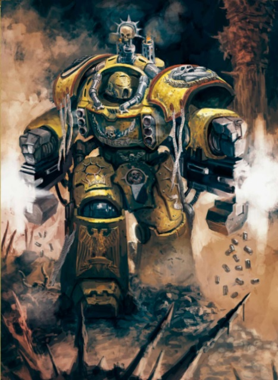
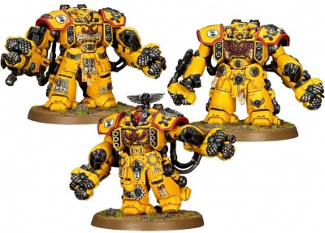
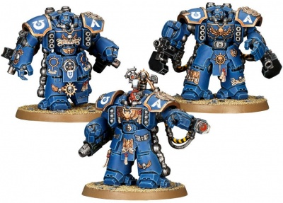

# 0307 百夫长 Centurion

精校状态：中文行文已逐段精校，部分术语仍为暂定

分类：通用概念 / 帝国 Imperium / 中央政务部 Adeptus Terra / 阿斯塔特修会 Adeptus Astartes

原文来源：https://www.bilibili.com/opus/1019533607254884357

原作者：帝国神选罐头

原文时间：2025年01月07日 10:31

[返回分类目录](目录.md) · [全书目录](../../目录.md)

<!-- A0307-B0001 -->
**英文原文**

Centurions are a type of Space Marine heavy infantry equipped with Centurion Armour. Essentially walking tanks, Centurion units are commonly divided into two types of squads.

<!-- /A0307-B0001 -->

<!-- A0307-B0002 -->

原译文

百夫长是一种配备百夫长装甲的星际战士重步兵。百夫长部队基本上是步行坦克，通常分为两类小队。

**校订译文**

百夫长是装备百夫长护甲的星际战士重步兵，堪称行走的坦克，通常分为两类小队。

<!-- /A0307-B0002 -->

<!-- A0307-B0003 图片 -->

<!-- A0307-B0004 -->

原译文

Devastator Centurion 毁灭百夫长

**校订译文**

Devastator Centurion 破坏者百夫长

<!-- /A0307-B0004 -->

<!-- A0307-B0005 -->
## Overview 概述

<!-- /A0307-B0005 -->

<!-- A0307-B0006 -->
**英文原文**

A Centurion Warsuit allows a Space Marine to stride into battle with the firepower of a battle tank and the protection of thick ablative plates of ceramite, making him immune to all but the most powerful of weapons. Named for the Space Marine leaders of old, the Centurion STC design was unearthed in the aftermath of the Age of Apostasy, and after sanction by the Adeptus Mechanicus they found their way into the armories of almost every Space Marine chapter.

<!-- /A0307-B0006 -->

<!-- A0307-B0007 -->

原译文

百夫长战服使星际战士能够凭借战斗坦克的火力和厚厚的陶钢烧蚀板的保护，大步投入战斗，使他对除最强大的武器外的所有武器都免疫。百夫长STC的设计以古代星际战士领导者的名字命名，是在叛教时代之后出土的，在机械神教的批准下，它们几乎进入了每个星际战士战团的军械库。

**校订译文**

百夫长战甲赋予星际战士主战坦克般的火力，并以厚重的陶钢烧蚀装甲防护，使除最强大武器之外的攻击都难以伤其分毫。这项以古代星际战士指挥官职衔命名的 STC 设计，在叛教时代后被重新发掘；经机械修会认可，便进入几乎所有星际战士战团的军械库。

<!-- /A0307-B0007 -->

<!-- A0307-B0008 -->
**英文原文**

Centurions are brutal weapons specialists tactically deployed as line-breakers and besiegers, where haste is less important than durability. The suits themselves do not interfere with the Black Carapace of a Space Marine, and they do not need to be surgically implanted within the warsuit as is the case with a Dreadnought. Battle-Brothers learn to pilot Centurions as part of their vehicle training, and pilots are not chosen from the 1st Company. Instead, they are chosen from the Chapter's Assault and Devastator units. The most frequent explanation of this is that a Centurion's role requires a Space Marine to be fully immersed in a particular style of war, while the bulky exosuits lack the degree of tactical flexibility that the Chapter's Veterans require.

<!-- /A0307-B0008 -->

<!-- A0307-B0009 -->

原译文

百夫长是残酷的武器专家，战术上被部署为突袭者和围攻者，在这里，耐久比速度更重要。套装本身不会干扰星际战士的黑色甲壳，也不需要像无畏那样通过手术植入套装。战斗兄弟学习驾驶百夫长是他们车辆训练的一部分，驾驶员不是从第一连中选出的。相反，他们是从本战团的突击小队和毁灭者小队中挑选出来的。对此最常见的解释是，百夫长的角色要求星际战士完全沉浸在特定的战争风格中，而笨重的外服缺乏该战团老兵所需的战术灵活性。

**校订译文**

百夫长是火力凶猛的武器专家，主要执行突破战线与攻城任务；在这些场合，坚固耐用比迅捷更重要。战甲不会干扰穿戴者的黑色甲壳，也不必像无畏机甲那样，以手术将战士永久植入其中。战斗兄弟在载具训练中学习驾驶百夫长，驾驶员从战团的突击与破坏者单位选拔，而不选自第一连。通常认为，这是因为百夫长需要专注于特定战法，而笨重的外骨骼，又无法满足老兵所需的战术灵活性。

**校注：** line-breakers 为突破防线者，不是普通突袭者；外骨骼由战士穿戴，无须像无畏机甲一样外科植入。

<!-- /A0307-B0009 -->

<!-- A0307-B0010 -->
**英文原文**

Space Marines are trained extensively to pilot Centurion suits, in particular to deal with a Devastator Centurion suit's enormous recoil and the complexities of using a siege drill under fire while operating an Assault Centurion suit. Only after a Space Marine has mastered operating tanks and aircraft will they be permitted to pilot a Centurion suit.

<!-- /A0307-B0010 -->

<!-- A0307-B0011 -->

原译文

星际战士经过广泛的训练，可以驾驶百夫长套装，特别是处理毁灭者百夫长套装的巨大后坐力，以及在操作突击百夫长装甲时在炮火下使用攻城钻的复杂情况。只有在星际战士掌握了操作坦克和飞机后，他们才被允许驾驶百夫长套装。

**校订译文**

驾驶百夫长需要充分训练，尤其要学会驾驭破坏者百夫长的巨大后坐力，或在敌火下操纵突击百夫长的攻城钻。只有先精通坦克与飞行器操作，星际战士才会获准驾驶这种战甲。

<!-- /A0307-B0011 -->

<!-- A0307-B0012 -->
## Types 类型

<!-- /A0307-B0012 -->

<!-- A0307-B0013 -->
### Assault Centurion 突击百夫长

<!-- /A0307-B0013 -->

<!-- A0307-B0014 -->
**英文原文**

Assault Centurions are deployed when an enemy stronghold must be assaulted head-on in an environment too compact for an Ironclad Dreadnought. The chapter's foremost close combat experts, these squads are solely focused on closing with the enemy and destroying them face-to-face. Once assault centurions have broken through, units of tactical marines will follow into the breach to secure the area.

<!-- /A0307-B0014 -->

<!-- A0307-B0015 -->

原译文

当敌人的要塞必须在一个对铁甲无畏来说过于紧凑的环境中遭到正面攻击时，就会部署突击百夫长。本战团最重要的近战专家，这些小队只专注于与敌人接近并面对面摧毁他们。一旦突击百夫长突破，战术星际战士部队将紧随其后，确保该地区的安全。

**校订译文**

当敌方据点必须正面强攻，而地形又狭窄到容不下铁甲无畏机甲时，突击百夫长便会投入战斗。他们是战团最顶尖的近战专家，只专注于逼近敌人、当面将其摧毁。突破之后，战术战士紧随其后涌入缺口，巩固夺取的区域。

<!-- /A0307-B0015 -->

<!-- A0307-B0016 图片 -->

<!-- A0307-B0017 -->

原译文

Centurion Assault Squad 百夫长突击小队

**校订译文**

Centurion Assault Squad 百夫长突击小队

<!-- /A0307-B0017 -->

<!-- A0307-B0018 -->
**英文原文**

Assault centurions are armed primarily with two siege drills, each of which is equipped with either a flamer or meltagun, along with a hurricane bolter or ironclad assault launcher mounted on their chests. They share the same weakness as their devastator centurion cousins, a severe lack of speed, which hampers them more due to their lack of long-ranged weapons.

<!-- /A0307-B0018 -->

<!-- A0307-B0019 -->

原译文

突击百夫长主要配备两个攻城钻，每个钻都配备一个喷火器或热熔枪，以及一个安装在胸前的飓风爆矢枪或铁甲突击发射器。他们和他们的百夫长表亲有着同样的弱点，严重缺乏速度，由于缺乏远程武器，这更阻碍了他们。

**校订译文**

突击百夫长的主要武器是两具攻城钻，每具都附有喷火器或热熔枪；胸前另装飓风爆矢枪或铁甲突击发射器。他们与破坏者百夫长一样，严重缺乏速度；由于缺少远程武器，这一弱点对突击型的影响尤其明显。

<!-- /A0307-B0019 -->

<!-- A0307-B0020 -->
### Devastator Centurion 破坏者百夫长

原题：Devastator Centurion 毁灭百夫长

<!-- /A0307-B0020 -->

<!-- A0307-B0021 -->
**英文原文**

Devastator Centurions are deployed for missions that require Space Marines to bring exceptional levels of firepower, such as siege warfare or bringing the firepower of a tank into confined quarters. Centurion armour suits for these missions are given to Devastators. Their only real weakness is their lack of speed, as they are easily outpaced by fast-moving foes. Thus, they are primarily employed to besiege defended enemy positions or to defend their own fortifications or used as mobile firebases to strengthen the advancing battle line.

<!-- /A0307-B0021 -->

<!-- A0307-B0022 -->

原译文

毁灭百夫长被部署到需要星际战士提供特殊火力等级的任务中，如围攻战或将坦克的火力带入密闭空间。用于这些任务的百夫长装甲套装被赠送给毁灭。他们唯一真正的弱点是缺乏速度，因为他们很容易被快速移动的敌人超越。因此，它们主要用于围攻防守的敌人阵地或保卫自己的防御工事，或用作移动火力点，以增强前进的战线。

**校订译文**

破坏者百夫长用于需要极强火力的任务，例如攻城，或将坦克级火力带入狭窄空间。为此配备的百夫长战甲，由破坏者战士操作。它们真正的弱点只有速度不足，容易被行动迅速的敌人甩开，因此主要用于攻打坚固敌阵、保卫己方工事，或作为移动火力支点，加强推进中的战线。

<!-- /A0307-B0022 -->

<!-- A0307-B0023 图片 -->

<!-- A0307-B0024 -->

原译文

Centurion Devastator Squad 百夫长毁灭小队

**校订译文**

Centurion Devastator Squad 百夫长破坏者小队

<!-- /A0307-B0024 -->

<!-- A0307-B0025 -->
**英文原文**

Centurion Devastators are commonly armed with twin heavy bolters, but sometimes are equipped with twin lascannons or a grav-cannon with an attached grav-amp to increase its power. Their chests are also equipped with either a hurricane bolter (with 3 of the 6 guns on each side of the chest) or a pair of missile launchers.

<!-- /A0307-B0025 -->

<!-- A0307-B0026 -->

原译文

毁灭百夫长通常配备双联重型爆矢枪，但有时也会配备双联激光炮或带有重力放大器的重力炮来增加其功率。他们的胸甲里还装有飓风爆矢枪（胸甲两侧各有6门枪中的3门）或一对导弹发射器。

**校订译文**

破坏者百夫长通常配备双联重型爆矢枪，也可使用双联激光炮，或搭载重力放大器的重力炮。胸部另装飓风爆矢枪——六挺枪在左右各排三挺——或一对导弹发射器。

**校注：** 已核同一人物、组织、型号或事件，与全书核心术语及后续专篇统一；原译保留对照。

<!-- /A0307-B0026 -->

本篇核心术语与暂定项

以下列出本篇出现的英文原形及核心术语表用词。同形词可能指不同对象，具体词义以本篇正文和校注为准；单复数、别名和仅见于图注的名称可能尚未列入。完整候选见[术语表](../../术语表/双语术语候选.csv)。

| 英文 | 采用中文 | 状态 |
| --- | --- | --- |
| Space Marines | 星际战士 | 官方已核对 |
| Adeptus Mechanicus | 机械修会 | 官方已核对 |
| Age of Apostasy | 叛教时代 | 暂定·官方待核 |
| STC | 标准建造模板 | 暂定·官方待核 |
| Centurion Warsuit | 百夫长战甲 | 暂定·官方待核 |
| Devastator Centurion | 破坏者百夫长 | 暂定·官方待核 |
| Space Marine | 星际战士 | 暂定·官方待核 |
| Chapter | 战团 | 暂定·官方待核 |
| Devastator | 破坏者 | 暂定·官方待核 |
| Centurions | 百夫长 | 暂定·官方待核 |
| Missile Launchers | 导弹发射器 | 暂定·官方待核 |
| Black Carapace | 黑色甲壳 | 暂定·官方待核 |
| Dreadnought | 无畏机甲 | 暂定·官方待核 |
| Ironclad Assault Launcher | 铁甲突击发射器 | 暂定·官方待核 |
| Bolter | 爆矢枪 | 暂定·官方待核 |
| Hurricane Bolter | 飓风爆矢枪 | 暂定·官方待核 |
| Flamer | 火焰喷射器（武器）／火妖（奸奇单位） | 语境定译·对应官译已核 |
| Meltagun | 热熔枪 | 官方已核对 |
| Grav-Amp | 重力放大器 | 暂定·官方待核 |
| Ironclad Dreadnought | 铁甲无畏机甲 | 暂定·官方待核 |

