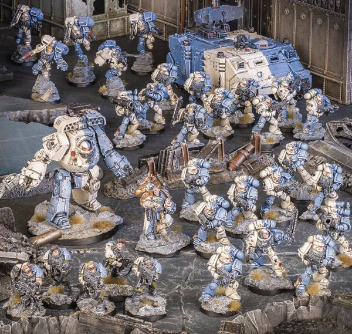

# 0312 涅尔瓦打击部队 Strike Force Nerva

精校状态：中文行文已逐段精校，部分术语仍为暂定

分类：通用概念 / 帝国 Imperium / 中央政务部 Adeptus Terra / 阿斯塔特修会 Adeptus Astartes

原文来源：https://www.bilibili.com/opus/1034708916434370569

原作者：帝国神选罐头

原文时间：2025年02月17日 07:59

[返回分类目录](目录.md) · [全书目录](../../目录.md)

<!-- A0312-B0001 -->
**英文原文**

Strike Force Nerva is a task force of the Novamarines Space Marine Chapter.

<!-- /A0312-B0001 -->

<!-- A0312-B0002 -->

原译文

涅尔瓦打击部队是新星战士星际战士的一支特遣部队。

**校订译文**

涅尔瓦打击部队是新星战士战团的一支特遣部队。

<!-- /A0312-B0002 -->

<!-- A0312-B0003 图片 -->

<!-- A0312-B0004 -->

原译文

Strike Force Nerva 涅尔瓦打击部队

**校订译文**

Strike Force Nerva 涅尔瓦打击部队

<!-- /A0312-B0004 -->

<!-- A0312-B0005 -->
## Сomposition 构成

<!-- /A0312-B0005 -->

<!-- A0312-B0006 -->
**英文原文**

Space Marine Captain Gilad Nerva (armed with power sword Vis Major)

<!-- /A0312-B0006 -->

<!-- A0312-B0007 -->

原译文

星际战士连长吉拉德·涅尔瓦（装备动力剑天灾）

**校订译文**

星际战士连长吉拉德·涅尔瓦（装备动力剑天灾）

<!-- /A0312-B0007 -->

<!-- A0312-B0008 -->
**英文原文**

Tactical Squad Larus - Space Marines Tactical Squad of 10 Marines

<!-- /A0312-B0008 -->

<!-- A0312-B0009 -->

原译文

拉鲁斯战术小队 - 星际战士10人战术小队

**校订译文**

拉鲁斯战术小队 - 星际战士10人战术小队

<!-- /A0312-B0009 -->

<!-- A0312-B0010 -->
**英文原文**

Other 2 Tactical Squads of 10 Tactical Space Marines each

<!-- /A0312-B0010 -->

<!-- A0312-B0011 -->

原译文

其他2个战术小队，每个小队由10名战术星际战士组成

**校订译文**

其他2个战术小队，每个小队由10名战术星际战士组成

<!-- /A0312-B0011 -->

<!-- A0312-B0012 -->
**英文原文**

Assault Squad Sor (4 Assault Marines and Assault Sergeant Olus Sor)

<!-- /A0312-B0012 -->

<!-- A0312-B0013 -->

原译文

索尔突击小队（4名突击战士和突击军士奥卢斯·索尔）

**校订译文**

索尔突击小队（4名突击战士和突击军士奥卢斯·索尔）

<!-- /A0312-B0013 -->

<!-- A0312-B0014 -->
**英文原文**

The Contemptor Dreadnought Decebal

<!-- /A0312-B0014 -->

<!-- A0312-B0015 -->

原译文

蔑视者无畏德塞巴鲁斯

**校订译文**

蔑视者无畏机甲德塞巴鲁斯

<!-- /A0312-B0015 -->

<!-- A0312-B0016 -->
**英文原文**

Space Marine Scout Squad of 5 Scouts.

<!-- /A0312-B0016 -->

<!-- A0312-B0017 -->

原译文

由5名侦察兵组成的星际战士侦察小队。

**校订译文**

由5名侦察兵组成的星际战士侦察小队。

<!-- /A0312-B0017 -->

<!-- A0312-B0018 -->
**英文原文**

The Damocles Rhino Fulmen

<!-- /A0312-B0018 -->

<!-- A0312-B0019 -->

原译文

达摩克利斯犀牛装甲车闪电号

**校订译文**

达摩克利斯型犀牛战车“闪电号”

<!-- /A0312-B0019 -->

本篇核心术语与暂定项

以下列出本篇出现的英文原形及核心术语表用词。同形词可能指不同对象，具体词义以本篇正文和校注为准；单复数、别名和仅见于图注的名称可能尚未列入。完整候选见[术语表](../../术语表/双语术语候选.csv)。

| 英文 | 采用中文 | 状态 |
| --- | --- | --- |
| Space Marines | 星际战士 | 官方已核对 |
| Rhino | 犀牛战车 | 官方已核对 |
| Tactical Squad | 战术小队 | 官方已核对 |
| Scout Squad | 侦察小队 | 官方已核对 |
| Strike Force Nerva | 涅尔瓦打击部队 | 暂定·官方待核 |
| Space Marine | 星际战士 | 暂定·官方待核 |
| Chapter | 战团 | 暂定·官方待核 |
| Captain | 连长 | 暂定·官方待核 |
| Sergeant | 军士 | 暂定·官方待核 |
| Scout | 侦察兵 | 暂定·官方待核 |
| Novamarines | 新星战士 | 暂定·官方待核 |
| Tactical Squads | 战术小队 | 暂定·官方待核 |
| Dreadnought | 无畏机甲 | 暂定·官方待核 |
| Gilad Nerva | 吉拉德·涅尔瓦 | 暂定·官方待核 |
| Decebal | 德切巴尔 | 暂定·官方待核 |
| Fulmen | 闪电号 | 暂定·官方待核 |

