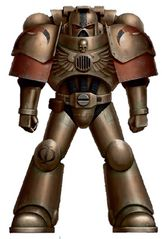
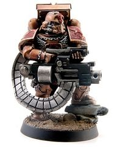
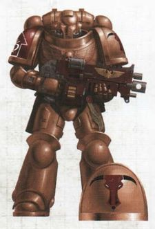
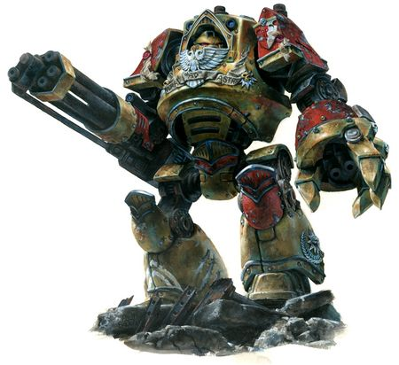
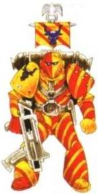

# 0316 米诺陶 Minotaurs

精校状态：中文行文已逐段精校，部分术语仍为暂定

分类：通用概念 / 帝国 Imperium / 中央政务部 Adeptus Terra / 阿斯塔特修会 Adeptus Astartes

原文来源：https://www.bilibili.com/opus/1122808994975449091

原作者：帝国神选罐头

原文时间：2025年10月12日 17:52

[返回分类目录](目录.md) · [全书目录](../../目录.md)

<!-- A0316-B0001 -->
**英文原文**

The Minotaurs are a loyalist Space Marine Chapter with a particularly brutal reputation and mysterious ties to the High Lords of Terra.

<!-- /A0316-B0001 -->

<!-- A0316-B0002 -->

原译文

米诺陶是一个忠诚的星际战士战团，有着特别残酷的声誉，与泰拉的高领主有着神秘的联系。

**校订译文**

米诺陶是忠于帝国的星际战士战团，以格外残酷著称，与泰拉高领主有着神秘联系。

<!-- /A0316-B0002 -->

<!-- A0316-B0003 图片 -->

<!-- A0316-B0004 图片 -->

<!-- A0316-B0005 -->
**英文原文**

Founding Chapter:Unknown/Classified(believed to be 'Chimeric')

<!-- /A0316-B0005 -->

<!-- A0316-B0006 -->

原译文

建军战团：未知/机密（据信是“嵌合”）

**校订译文**

母团：未知／机密，据信采用嵌合基因种子。

<!-- /A0316-B0006 -->

<!-- A0316-B0007 -->
**英文原文**

Founding:M36 (Cursed) 21st Founding

<!-- /A0316-B0007 -->

<!-- A0316-B0008 -->

原译文

建军：M36（诅咒）第21次建军

**校订译文**

建军：M36（诅咒）第21次建军

<!-- /A0316-B0008 -->

<!-- A0316-B0009 -->
**英文原文**

Descendants:Unknown

<!-- /A0316-B0009 -->

<!-- A0316-B0010 -->

原译文

子战团：未知

**校订译文**

子战团：未知

<!-- /A0316-B0010 -->

<!-- A0316-B0011 -->
**英文原文**

Chapter Master:Asterion Moloc

<!-- /A0316-B0011 -->

<!-- A0316-B0012 -->

原译文

战团长：阿斯特里昂·莫洛克

**校订译文**

战团长：阿斯特里昂·莫洛克

<!-- /A0316-B0012 -->

<!-- A0316-B0013 -->
**英文原文**

Homeworld:Fleet Based

<!-- /A0316-B0013 -->

<!-- A0316-B0014 -->

原译文

家园世界：舰基

**校订译文**

母星：无，以舰队为基地。

<!-- /A0316-B0014 -->

<!-- A0316-B0015 -->
**英文原文**

Fortress-Monastery:Daedelos Krata

<!-- /A0316-B0015 -->

<!-- A0316-B0016 -->

原译文

堡垒修道院：代达罗斯迷宫号

**校订译文**

要塞修道院：代达洛斯·克拉塔号

<!-- /A0316-B0016 -->

<!-- A0316-B0017 -->
**英文原文**

Colours:Bronze with red right pauldron

<!-- /A0316-B0017 -->

<!-- A0316-B0018 -->

原译文

颜色：黄铜配红色右肩甲

**校订译文**

涂装：青铜色，右肩甲为红色。

<!-- /A0316-B0018 -->

<!-- A0316-B0019 -->
**英文原文**

Specialty:Siege Warfare, Attrition Warfare, Shock Assault, Close Combat

<!-- /A0316-B0019 -->

<!-- A0316-B0020 -->

原译文

专长：攻城战、消耗战、震慑突击、近战

**校订译文**

专长：攻城战、消耗战、震慑突击、近战

<!-- /A0316-B0020 -->

<!-- A0316-B0021 -->
**英文原文**

Strength:approx. full-strength (1,000 Marines)

<!-- /A0316-B0021 -->

<!-- A0316-B0022 -->

原译文

力量：大约满员（1000名战士）

**校订译文**

兵力：约为满编，即一千名星际战士。

<!-- /A0316-B0022 -->

<!-- A0316-B0023 -->
**英文原文**

Battle Cry:Unknown

<!-- /A0316-B0023 -->

<!-- A0316-B0024 -->

原译文

战吼：未知

**校订译文**

战吼：未知

<!-- /A0316-B0024 -->

<!-- A0316-B0025 -->
## History 历史

<!-- /A0316-B0025 -->

<!-- A0316-B0026 -->
**英文原文**

The Minotaurs are a relatively mysterious Chapter of the Adeptus Astartes, as they are principally notable for the fact that, beyond the last thousand years, most records of them appear to have been locked away under seals so tight even members of the Inquisition find them difficult to open. In addition, other records appear to have been lost or mislaid. The matter is made even more complex by the existence of conflicting historical records relating Minotaurs Astartes chapter. These records have led to uncertainty on if the "Minotaurs" who appeared in M32, M36, and M41 are the same chapter or multiple chapters who have shared the same name. Finally, the chapter is rumored to possess some form of direct tie to the High Lords of Terra themselves that circumvents other forms of Imperial bureaucracy completely, a rumour that has given the Ordo Hereticus some cause for concern.

<!-- /A0316-B0026 -->

<!-- A0316-B0027 -->

原译文

米诺陶是阿斯塔特修会中相对神秘的战团，因为他们的主要特点是，在过去的一千年里，它们的大多数记录似乎都被密封得很紧，即使是审判庭的成员也很难打开。此外，其他记录似乎已经丢失或放错地方。由于存在与米诺陶阿斯塔特战团相关的相互矛盾的历史记录，这一问题变得更加复杂。这些记录导致了M32、M36和M41中出现的“米诺陶”是同一战团还是多个同名战团的不确定性。最后，有传言称，这一战团与泰拉的高领主有某种形式的直接联系，完全绕过了其他形式的帝国官僚机构，这一传言让讨逆修会感到担忧。

**校订译文**

米诺陶战团颇为神秘。除最近一千年外，更早的大多数档案似乎都被严密封存，连审判庭也难以查阅，另有一些记录遗失或错置。历史记载彼此矛盾，更添疑云：第32、36和41千年出现的“米诺陶”，究竟是同一战团，还是几个使用同名的不同战团，尚无定论。传言他们与泰拉高领主有直接联系，可以完全绕过其他帝国官僚机构；异端审判庭对此颇为忧虑。

**校注：** beyond the last thousand years 指最近一千年以外的更早历史，原译把封存范围反转为过去一千年。

<!-- /A0316-B0027 -->

<!-- A0316-B0028 图片 -->

<!-- A0316-B0029 -->

原译文

Founding 建军

**校订译文**

Founding 建军

<!-- /A0316-B0029 -->

<!-- A0316-B0030 -->
**英文原文**

A chapter listed as the Minotaurs was recorded in action as early as M32, in the suppression of the Solar Rebellion, notably working along side other Astartes chapters. However, other records state that the Minotaurs were not founded until the 'Cursed' 21st Founding in M36. Their recorded actions between M36 and M38 led to the Minotaurs being known as berserkers. While noted for quick responses to calls upon them for aid, they were also known for ignoring command-trees and battle-plans completely and simply engaging the enemy unto their destruction. This reputation for being unreliable allies resulted in the Minotaurs being shunned by the main body of Imperial forces. This suited the Minotaurs fine, and sometime in M38, they simply disappeared from Imperial records.

<!-- /A0316-B0030 -->

<!-- A0316-B0031 -->

原译文

早在M32时期，就有一个被列为米诺陶的战团被记录在镇压太阳叛乱的行动中，特别是与其他阿斯塔特战团一起工作。然而，其他记录表明，米诺陶直到M36的“诅咒”第21次建军才成立。他们在M36和M38之间的记录行动导致米诺陶被称为狂战士。虽然他们以对援助呼吁的快速反应而闻名，但他们也以完全无视指挥树和作战计划而闻名，只是将敌人消灭在外。这种不可靠盟友的声誉导致米诺陶被帝国军队的主力所回避。这很适合米诺陶，在M38的某个时候，他们只是从帝国记录中消失了。

**校订译文**

早在第32千年，便有名为米诺陶的战团参与镇压太阳叛乱、与其他阿斯塔特战团协作的记录。但另一些档案称，他们直到第36千年的第二十一次“诅咒建军”才成立。第36至38千年的战绩使他们获得狂战士之名：求援时响应迅速，抵达后却完全无视指挥体系与作战计划，只顾扑向敌人，直至将其消灭。因此，帝国主力往往不愿同这支不可靠的盟军合作；米诺陶对此毫不介意，并在第38千年某时从帝国记录中消失。

<!-- /A0316-B0031 -->

<!-- A0316-B0032 -->
### Reappearance 再现

<!-- /A0316-B0032 -->

<!-- A0316-B0033 -->
**英文原文**

The Minotaurs unexpectedly reappeared at the beginning of M41, during the Macharian Heresy. The Departmento Munitorum noted discrepancies in the behavior, structure, and appearance of the Minotaurs, compared to their records since the Cursed Founding. In a change from their previous disposition, they operated in concert with larger Imperial battle-plans, much like their reported actions in M32, although still preferring to keep to themselves. While they attempted to remain aloof from Imperial observers, no-one was able to miss the fact that they were a fully-armed and equipped Chapter who deployed a dozen Strike Cruisers during the campaign - a notable (and curious) amount of resources for a supposedly long-missing, minor Chapter. Some observers have noted that the Minotaurs respond immediately and slavishly to directives issued by the High Lords of Terra themselves, and have linked this apparent unquestioning behavior with their large amounts of high quality war materiel. However, this speculation cannot be proved.

<!-- /A0316-B0033 -->

<!-- A0316-B0034 -->

原译文

米诺陶在M41开始时，在马卡里安叛乱期间意外地重新出现。军务部注意到，与诅咒建军以来的记录相比，米诺陶的行为、结构和外观存在差异。与之前的部署不同，他们与更大的帝国作战计划协同作战，就像他们在M32中报告的行动一样，尽管他们仍然更喜欢独处。虽然他们试图与帝国观察者保持距离，但没有人能忽视这样一个事实，即他们是一个全副武装、装备精良的战团，在战役中部署了十几艘打击巡洋舰 — 对于一个据称长期失踪的小战团来说，这是一笔可观的（也是奇怪的）资源。一些观察者注意到，米诺陶会立即并盲目地回应泰拉高领主发布的指令，并将这种明显的无条件行为与他们大量的高质量战争物资联系起来。然而，这种猜测无法得到证实。

**校订译文**

第41千年初，马卡里安叛乱期间，米诺陶意外再现。军务部发现，他们的行为、组织与外观，都不同于诅咒建军以来的旧记录。他们仍喜独行，却开始配合帝国总体作战计划，倒与第32千年的记载相似。尽管刻意疏远帝国观察者，他们装备齐全、一次部署十二艘打击巡洋舰的事实仍十分醒目；对一个长期失踪的小战团而言，这种资源尤其反常。有观察者发现他们对高领主的命令立即服从、毫不质疑，因而猜测其优质军备与此有关，但尚无证据证实。

<!-- /A0316-B0034 -->

<!-- A0316-B0035 -->
**英文原文**

The Minotaurs of M41, whilst appearing more at home within the bounds of the Imperium and seemingly enjoying the patronage of the High Lords, have still managed to acquire an unsavoury reputation amongst some of their fellow Adeptus Astartes, The Ultramarines and their allied Successor Chapters in particular have refused to fight alongside the Minotaurs as a result of both the Euxcine Incident (in which Minotaurs almost completely eradicated the Inceptors chapter and took several of their relics and their flagship for their own armoury), which some saw as an over-reaction, as well as their public insulting of Marneus Calgar and the provocation given to the Genesis Chapter during the fourteenth siege of Antagonis.

<!-- /A0316-B0035 -->

<!-- A0316-B0036 -->

原译文

M41的米诺陶虽然在帝国范围内表现得更为自在，似乎得到了高领主的庇护，但在他们的一些战友中仍然获得了令人不快的声誉，尤其是极限战士和他们的盟友子战团，由于黑海事件（米诺陶几乎完全消灭了先驱者战团，并拿走了他们的几件圣物和旗舰作为自己的军械库），他们拒绝与米诺陶并肩作战，一些人认为这是一种过度反应，以及他们对马涅乌斯·卡尔加的公开侮辱和在第十四次对立围城期间对起源战团的挑衅。

**校订译文**

第41千年的米诺陶似乎更适应帝国体系，也得到高领主庇护，却仍在阿斯塔特同僚间名声不佳。极限战士及其盟友子团尤其拒绝与他们并肩作战。原因包括尤克辛事件——米诺陶几乎灭尽先驱者战团，夺走多件圣物和旗舰，许多人认为惩罚过度；此外，他们还公开侮辱马涅乌斯·卡尔加，并在第十四次安塔戈尼斯围城战中挑衅起源战团。

**校注：** Euxcine/Antagonis 按专名暂作尤克辛/安塔戈尼斯，原黑海/对立不宜无据直接替换为普通词。

<!-- /A0316-B0036 -->

<!-- A0316-B0037 -->
**英文原文**

The Minotaurs entered the Badab War, at the request of Legate Inquisitor Frain on the side of the loyalist Imperial forces as part of the wave of reinforcements that arrived in the Maelstrom Zone in 907.M41. The Minotaurs committed their entire chapter-strength to the campaign, and operated as a largely-independent raiding and harassment force for much of it. They achieved fame for their cold-blooded and merciless attacks on the Secessionists, and were considered the pre-eminent close-combat and shock-assault troops in the war until the arrival of the Carcharodons. Their most lauded achievement during the war was their complete defeat and forced surrender of the Lamenters Secessionist Chapter, which took the form of a 17 hour battle made up of vicious boarding-actions and close-quarter battles. While victorious, this battle did result in significant casualties for the Minotaurs and they spent most of the rest of the war on interdiction duties in the space-lanes, as well as carrying out punitive actions against previously rebel worlds. They were present at the end of the war in some small capacity due to their expertise in siegecraft, and at the war's end departed with several vessels of the Lamenters' fleet as prizes.

<!-- /A0316-B0037 -->

<!-- A0316-B0038 -->

原译文

米诺陶应审判官使节弗兰的要求，加入了巴达布战争，作为907.M41抵达大漩涡战区的增援部队的一部分。米诺陶将其整个战团的力量都投入到了这场战役中，并在其中大部分时间里作为一支基本独立的突袭和骚扰部队运作。他们以对分离主义者的冷血无情攻击而闻名，在噬人鲨到来之前，他们被认为是战争中杰出的近战和突击部队。他们在战争中最受赞誉的成就是彻底击败并迫使恸哭者分离主义战团投降，以17小时的战斗形式进行，由残酷的跳帮行动和近距离战斗组成。虽然取得了胜利，但这场战斗确实给米诺陶造成了重大伤亡，他们在战争的剩余时间里大部分时间都在太空航线执行阻截任务，并对以前的叛乱世界采取惩罚行动。由于他们在攻城方面的专业知识，他们在战争结束时以一些小规模的身份出现，并在战争结束后带着恸哭者舰队的几艘舰船作为奖品离开了。

**校订译文**

907.M41，米诺陶应审判官使节弗兰之请，作为增援抵达大漩涡地区，在巴达布战争中支援帝国忠诚派。他们投入全团兵力，战争大部分时间独立进行袭扰，以对分离派冷酷无情的攻击闻名。噬人鲨抵达前，他们被视为战场上首屈一指的近战与突击力量。最受称道的战果，是经过十七小时激烈跳帮和近战，彻底击败恸哭者，迫其投降。但米诺陶也伤亡惨重，此后主要封锁航线，惩戒曾叛乱的世界。战争末期，他们凭攻城专长派出少量部队参战；战后则携夺自恸哭者舰队的数艘战利舰离去。

<!-- /A0316-B0038 -->

<!-- A0316-B0039 -->
**英文原文**

In the closing decade of M41, the Minotaurs were extremely active, with forces of unknown strength aiding in the early stages of the retaking of Rynn's World and harrowing the excommunicated Night Reapers Chapter alongside the Red Templars and Grey Knights. Almost immediately after the conclusion of the campaign against the Night Reapers, the entire Chapter was deployed in the Orphean War. Despite their efforts, the Orpheus Sector was formally disbanded and the Minotaurs were charged with purging it with the aid of the former Battlefleet Orpheus.

<!-- /A0316-B0039 -->

<!-- A0316-B0040 -->

原译文

在M41的最后十年，米诺陶非常活跃，未知部队的力量在重新夺回林恩世界的早期阶段提供了帮助，并与红色圣堂和灰骑士一起折磨了绝罚午夜收割者战团。几乎在对午夜收割者的战役结束后不久，整个战团就被部署到了俄耳甫斯战争中。尽管他们做出了努力，俄耳甫斯星区还是被正式解体，米诺陶被命令在前俄耳甫斯战斗舰队的帮助下对其进行净化。

**校订译文**

第41千年最后十年，米诺陶行动频繁：一支兵力不详的部队参与瑞恩世界反攻初期作战，又与红色圣堂、灰骑士共同讨伐遭绝罚的暗夜收割者战团。该战役刚结束，全团便投入俄耳甫斯战争。尽管奋战，俄耳甫斯星区最终仍被正式撤销，米诺陶奉命在原俄耳甫斯战斗舰队协助下清剿该地区。

<!-- /A0316-B0040 -->

<!-- A0316-B0041 -->
### Dark Imperium 黑暗帝国

<!-- /A0316-B0041 -->

<!-- A0316-B0042 -->
**英文原文**

Sometime after the formation of the Great Rift, much of the Minotaurs Gene-seed stock was supposedly tainted by a Death Guard invasion. They thus begun a quest to reach Terra and pure gene-stock lest the Chapter waste away. The Minotaurs were amongst the first to receive the Primaris programme assets and were the first Space Marines who were deployed on Terra after the start of Indomitus Crusade, not only to cleanse it of the Chaos Cults and other rebels that remained there after the massive Daemonic Incursion, but also to replenish and recover their gene-seed stocks. The Minotaurs arrived in a full Chapter strength (including the Daedelos Krata).

<!-- /A0316-B0042 -->

<!-- A0316-B0043 -->

原译文

大裂隙形成后的某个时候，米诺陶的大部分基因种子库被认为受到了死亡守卫入侵的污染。因此，他们开始探索泰拉和纯净基因库，以免战团衰弱。米诺陶是首批获得原铸计划资产的人之一，也是不屈远征开始后部署在泰拉上的第一批星际战士，他们不仅要清除泰拉上在大规模恶魔入侵后留下的混沌教派和其他叛乱者，还要补充和恢复他们的基因种子库。米诺陶以全战团兵力抵达（包括代达罗斯迷宫号）。

**校订译文**

大裂隙形成后某时，据称死亡守卫的入侵污染了米诺陶大部分基因种子。他们为免战团消亡，急切前往泰拉寻求纯净基因种源。米诺陶是最早获得原铸计划资源的战团之一，也是不屈远征开启后首批部署于泰拉的星际战士，既要清除恶魔大举入侵后残留的混沌教派与叛乱者，也要恢复、补充基因种子储备。他们以全团兵力抵达，包括代达洛斯·克拉塔号。

<!-- /A0316-B0043 -->

<!-- A0316-B0044 图片 -->

<!-- A0316-B0045 -->

原译文

Minotaur in MKX Armour MKX盔甲的米诺陶

**校订译文**

Minotaur in MKX Armour MKX盔甲的米诺陶

<!-- /A0316-B0045 -->

<!-- A0316-B0046 -->
**英文原文**

Later it was revealed that the Minotaurs had been used to bring the Hexarchy members out into the open. When the coup was suppressed and all of the rebel 'Lords' were killed by Assassins, the Minotaurs briefly battled the Sisters of Silence and Custodes, who were protecting the High Lord and Master of the Assassinorum. However, they ultimately obeyed the decision of one of the loyalist High Lords - Violeta Roskavler, Master of the Administratum - and departed from Terra.

<!-- /A0316-B0046 -->

<!-- A0316-B0047 -->

原译文

后来有消息透露，米诺陶曾被用来将六头叛乱的成员带到户外。当政变被镇压，所有反叛的“领主”都被刺客杀害时，米诺陶曾短暂地与保护高领主和刺客大师的寂静修女与禁军作战。然而，他们最终服从了一位忠诚的高领主 — 内务部长维奥莱塔·罗斯卡夫勒的决定，离开了泰拉。

**校订译文**

后来人们才得知，米诺陶的介入是为诱使六人联盟成员暴露自身。政变遭镇压、反叛高领主皆被刺客杀死后，米诺陶曾与保护高领主兼刺客庭之主的寂静修女和禁军短暂交战。最终，他们服从忠诚派高领主、内政部之主维奥莱塔·罗斯卡夫勒的决定，离开泰拉。

<!-- /A0316-B0047 -->

<!-- A0316-B0048 -->
### Chapter Timeline 战团时间线

<!-- /A0316-B0048 -->

<!-- A0316-B0049 -->
**英文原文**

M32 — Noted to have taken part in the counter-attack against the Solar Rebellion, despite the fact that this pre-dates their believed founding by several millennia. However, other evidence contradicts these assertions, consigning the entire event to conjecture

<!-- /A0316-B0049 -->

<!-- A0316-B0050 -->

原译文

注意到参与了对太阳叛乱的反击，尽管事实上这比他们认为的建军早了几千年。然而，其他证据与这些说法相矛盾，使整个事件成为猜测

**校订译文**

第32千年——据记载参加反击太阳叛乱，比通常认为的建军时间早数千年；其他证据却否定这一说法，故事件仍属存疑。

<!-- /A0316-B0050 -->

<!-- A0316-B0051 -->
**英文原文**

M36 — Founded as part of the 'Cursed' 21st Founding.

<!-- /A0316-B0051 -->

<!-- A0316-B0052 -->

原译文

作为“诅咒”第21次建军的一部分而成立。

**校订译文**

第36千年——于第二十一次“诅咒建军”成立。

<!-- /A0316-B0052 -->

<!-- A0316-B0053 -->
**英文原文**

M37

**补译**

第37千年

<!-- /A0316-B0053 -->

<!-- A0316-B0054 -->
**英文原文**

999.M37 — War for the Andromax System - Deployed along side and coordinated with the Adeptus Custodes and Adeptus Mechanicus forces. Destroying traitor forces in their captured strongholds.

<!-- /A0316-B0054 -->

<!-- A0316-B0055 -->

原译文

安德洛马克斯星系战争-与禁军和机械神教部队并肩部署并协调。在被占领的据点摧毁叛徒势力。

**校订译文**

999.M37——安德洛马克斯恒星系战争：与禁军、机械修会协同作战，摧毁盘踞占领据点的叛军。

<!-- /A0316-B0055 -->

<!-- A0316-B0056 -->
**英文原文**

M38 — Disappeared from Imperial Records.

<!-- /A0316-B0056 -->

<!-- A0316-B0057 -->

原译文

从帝国记录中消失了。

**校订译文**

第38千年——从帝国记录中消失。

<!-- /A0316-B0057 -->

<!-- A0316-B0058 -->
**英文原文**

M40

**补译**

第40千年

<!-- /A0316-B0058 -->

<!-- A0316-B0059 -->
**英文原文**

M41

**补译**

第41千年

<!-- /A0316-B0059 -->

<!-- A0316-B0060 -->
**英文原文**

c.053.M41 to 077.M41 — Reappeared and joined the suppression of the Macharian Heresy; the Euxcine Incident took place at some point during this time.

<!-- /A0316-B0060 -->

<!-- A0316-B0061 -->

原译文

再次出现并加入了对马卡里安叛乱的镇压；黑海事件发生在这段时间的某个时刻。

**校订译文**

约053.M41至077.M41——再度出现，参与镇压马卡里安叛乱；尤克辛事件发生于此期间。

<!-- /A0316-B0061 -->

<!-- A0316-B0062 -->

原译文

760.M41 — The Defence of Hermetica. 何米狄克防御战

**校订译文**

760.M41 — The Defence of Hermetica. 何米狄克防御战

<!-- /A0316-B0062 -->

<!-- A0316-B0063 -->
**英文原文**

pre-907.M41 — Combated Orkz from the Octarian Empire, during this time they insulted the Genesis Chapter.

<!-- /A0316-B0063 -->

<!-- A0316-B0064 -->

原译文

与来自奥克塔瑞安帝国的欧克战斗，在这段时间里，他们侮辱了起源战团。

**校订译文**

907.M41以前——与奥克塔瑞安帝国的欧克蛮人交战，期间侮辱起源战团。

<!-- /A0316-B0064 -->

<!-- A0316-B0065 -->

原译文

907-912.M41 — The Badab War. 巴达布战争

**校订译文**

907-912.M41 — The Badab War. 巴达布战争

<!-- /A0316-B0065 -->

<!-- A0316-B0066 -->
**英文原文**

908.M41 — Battle of the Optera System. Utterly defeated the Lamenters chapter in close quarters combat.

<!-- /A0316-B0066 -->

<!-- A0316-B0067 -->

原译文

奥普特拉星系之战。在近距离战斗中彻底击败了恸哭者。

**校订译文**

908.M41——奥普特拉恒星系之战：在近战中彻底击败恸哭者。

<!-- /A0316-B0067 -->

<!-- A0316-B0068 -->
**英文原文**

260911.M41 — The Battle of Shaprias, The Lamptan Intervention

<!-- /A0316-B0068 -->

<!-- A0316-B0069 -->

原译文

沙皮亚斯之战，兰普坦干预

**校订译文**

260911.M41——沙皮亚斯之战、兰普坦干预。

**校注：** 原文日期260911.M41原样保留，不擅拆成六位之外的标准纪年；0266999.M41同理。

<!-- /A0316-B0069 -->

<!-- A0316-B0070 -->
**英文原文**

913.M41 — The Minotaurs Chapter leaves the Maelstrom Zone.

<!-- /A0316-B0070 -->

<!-- A0316-B0071 -->

原译文

米诺陶战团离开了大漩涡战区。

**校订译文**

913.M41——离开大漩涡地区。

<!-- /A0316-B0071 -->

<!-- A0316-B0072 -->
**英文原文**

989.M41-992.M41 — Reclaiming Rynn's World from Ork menace.

<!-- /A0316-B0072 -->

<!-- A0316-B0073 -->

原译文

从欧克的威胁中夺回林恩世界。

**校订译文**

989.M41—992.M41——从欧克蛮人手中收复瑞恩世界。

<!-- /A0316-B0073 -->

<!-- A0316-B0074 -->
**英文原文**

989-992.M41 — Harrowing of the Night Reapers, culminating in the Perun Cross Incident.

<!-- /A0316-B0074 -->

<!-- A0316-B0075 -->

原译文

午夜收割者的折磨，最终导致佩伦十字事件。

**校订译文**

989—992.M41——讨伐暗夜收割者，以佩伦十字事件告终。

<!-- /A0316-B0075 -->

<!-- A0316-B0076 -->
**英文原文**

Pre-992.M41 — Defense of the Black Gates of Hive Vitria. Battled against the Genestealer Cult of the Dreaming Deeps.

<!-- /A0316-B0076 -->

<!-- A0316-B0077 -->

原译文

保卫维特里亚巢都的黑门。与梦幻深渊的基因窃取者教派作战。

**校订译文**

992.M41以前——保卫维特里亚巢都黑门，对抗梦幻深渊基因窃取者教派。

<!-- /A0316-B0077 -->

<!-- A0316-B0078 -->
**英文原文**

Pre-992.M41 — The Bifrost Uprising.

**补译**

992.M41以前——比弗罗斯特起义。

<!-- /A0316-B0078 -->

<!-- A0316-B0079 -->

原译文

992-995.M41 — The Orphean War. 俄耳甫斯战争

**校订译文**

992-995.M41 — The Orphean War. 俄耳甫斯战争

<!-- /A0316-B0079 -->

<!-- A0316-B0080 -->
**英文原文**

995.M41 — Assault on the moon of Ghatist

<!-- /A0316-B0080 -->

<!-- A0316-B0081 -->

原译文

对加提斯特卫星的袭击

**校订译文**

995.M41——袭击加提斯特卫星。

<!-- /A0316-B0081 -->

<!-- A0316-B0082 -->
**英文原文**

0266999.M41 — Charged with the Exterminatus of the worlds of the Orpheus Sector by decree of the High Lords of Terra.

<!-- /A0316-B0082 -->

<!-- A0316-B0083 -->

原译文

根据泰拉高领主的命令，负责灭绝俄耳甫斯星区的世界。

**校订译文**

0266999.M41——奉泰拉高领主敕令，对俄耳甫斯星区诸世界执行灭绝令。

**校注：** Exterminatus 为灭绝令，不能仅泛称净化或战役消灭。

<!-- /A0316-B0083 -->

<!-- A0316-B0084 -->
**英文原文**

M42

**补译**

第42千年

<!-- /A0316-B0084 -->

<!-- A0316-B0085 -->
**英文原文**

Unknown Date.M42 — The 7th Plague Company of the Death Guard launches an attack on the Minotaurs Fortress-Monastery, and while defeated they nonetheless are able to taint the Chapter's gene-seed. The Minotaurs begin a desperate quest for survival to reach Terra and access purified gene-seed.

<!-- /A0316-B0085 -->

<!-- A0316-B0086 -->

原译文

死亡守卫第七瘟疫连队对米诺陶的要塞修道院发动攻击，虽然被击败，但他们仍然能够污染该战团的基因种子。米诺陶开始了一场绝望的生存之旅，以到达泰拉并获得纯净的基因种子。

**校订译文**

第42千年，日期不详——死亡守卫第七瘟疫连袭击米诺陶要塞修道院，虽被击退，仍污染了其基因种子。米诺陶急赴泰拉，寻求纯净种源以延续战团。

<!-- /A0316-B0086 -->

<!-- A0316-B0087 -->
**英文原文**

Unknown Date.M42 — taking a part in the Hexarchy rebellion on Terra.

<!-- /A0316-B0087 -->

<!-- A0316-B0088 -->

原译文

参加了泰拉上的六头叛乱。

**校订译文**

第42千年，日期不详——参与泰拉六人联盟政变。

<!-- /A0316-B0088 -->

<!-- A0316-B0089 -->
**英文原文**

Unknown Date.M42 — During the Indomitus Crusade, as part of Task Force Faustus III and Task Force Faustus IV, deployed recapture the void docks over Bosphori Deo from the Thousand Sons.

<!-- /A0316-B0089 -->

<!-- A0316-B0090 -->

原译文

在不屈远征期间，作为浮士德三号特遣部队和浮士德四号特遣部队的一部分，部署了从千子手中夺回神博斯普鲁斯海峡之上的虚空码头。

**校订译文**

第42千年，日期不详——不屈远征期间，作为浮士德三号与四号特遣部队的一部分，从千子手中夺回博斯弗里·迪奥上空的虚空船坞。

<!-- /A0316-B0090 -->

<!-- A0316-B0091 -->

原译文

Unknown Date.M42 — Pariah Crusade 帕里亚远征

**校订译文**

Unknown Date.M42 — Pariah Crusade 帕里亚远征

<!-- /A0316-B0091 -->

<!-- A0316-B0092 -->

原译文

Unknown Date.M42 — Nachmund Rift War 纳克蒙德走廊战争

**校订译文**

Unknown Date.M42 — Nachmund Rift War 纳克蒙德走廊战争

<!-- /A0316-B0092 -->

<!-- A0316-B0093 -->
## Organisation 组织

<!-- /A0316-B0093 -->

<!-- A0316-B0094 -->
**英文原文**

The Minotaurs appear to have no particularly distinctive organisational facets on the surface, and are only really notable for two somewhat unusual factors. The first is that they seem to prefer to operate in Chapter-strength whenever possible and do not appear to engage in small-scale campaigns. The second is that they are supremely well-equipped and seem able to replace losses of both material and personnel with little difficulty.

<!-- /A0316-B0094 -->

<!-- A0316-B0095 -->

原译文

米诺陶表面上似乎没有特别独特的组织方面，只有两个不同寻常的因素值得注意。首先，他们似乎更喜欢尽可能以战团的力量运作，似乎不参与小规模的战役。第二，他们装备精良，似乎能够毫不费力地弥补物资和人员的损失。

**校订译文**

米诺陶表面上似乎没有特别独特的组织方面，只有两个不同寻常的因素值得注意。首先，他们似乎更喜欢尽可能以战团的力量运作，似乎不参与小规模的战役。第二，他们装备精良，似乎能够毫不费力地弥补物资和人员的损失。

<!-- /A0316-B0095 -->

<!-- A0316-B0096 -->
**英文原文**

Because of this, the numbers of Minotaurs are estimated to be almost always around full-strength. They do not seem to have any difficulty in recruiting initiates, and appear to have an indoctrination and conversion process that is remarkably swift. Imperial observers during the Antigonis campaign noted that the transition from neophyte to Scout to full Marine in the Chapter was remarkably fast, and also highlighted the heavy use of hypno-indoctrination and neuro-cerebral surgery involved, as well as the monitoring and 'refreshing' of these techniques in full Marines by the Apothecaries of the Chapter. These methods have lead to rumors that their chapter master, as possibly other members, are engrammatically-enforced personalities and memories.

<!-- /A0316-B0096 -->

<!-- A0316-B0097 -->

原译文

因此，据估计，米诺陶的数量几乎总是处于满员状态。他们似乎在招募修士方面没有任何困难，而且似乎有一个非常迅速的灌输和皈依过程。安提戈尼斯战役期间的帝国观察者指出，该战团从新进者到侦察兵再到正式战士的过渡速度非常快，并强调了大量使用催眠灌输和神经脑手术，以及该战团药剂师在正式战士中对这些技术的监测和“更新”。这些方法引发了谣言，称他们的战团长，可能还有其他成员，都是强制植入的个性和记忆。

**校订译文**

因此，米诺陶几乎总被估计为满编。他们招募候选人似乎毫无困难，改造与思想灌输也异常迅速。安提戈尼斯战役中，帝国观察者发现，从新兵到侦察兵、再到正式星际战士的过程短得惊人，其间大量采用催眠灌输和脑神经手术；正式战士也持续接受药剂师监测与“刷新”。这些做法引发传闻：战团长乃至其他成员的人格与记忆，可能是由强制植入的记忆印痕塑成。

**校注：** 本篇 Antigonis 与前文 Antagonis 异拼均保留英文，中文分别音译；待原出处核实是否同一地点。

<!-- /A0316-B0097 -->

<!-- A0316-B0098 -->
### Armoury 军械库

<!-- /A0316-B0098 -->

<!-- A0316-B0099 -->
**英文原文**

From a purely technical point of view, the Minotaurs are superbly equipped with Space Marine arms and armour. Their armoury includes extensive stocks of Mk VIII and void-modified Mk III Power Armour, with sufficient access to Terminator Armour to equip the majority of their First Company, including the rare Tartaros and Arkonak patterns. In addition to large stockpiles of Vindicators and Predators, they are able to field squadrons of Storm Eagle Gunships and Spartan Assault Tanks. Due to their tradition of taking relic wargear from Astartes chapters they have defeated, many of the relics in their armoury were taken from other chapters.

<!-- /A0316-B0099 -->

<!-- A0316-B0100 -->

原译文

从纯粹的技术角度来看，米诺陶装备了星际战士的武器和盔甲。他们的军械库包括大量的Mk VIII和虚空改装的Mk III动力盔甲，有足够的机会获得终结者盔甲，以装备他们第一连队的大多数人，包括罕见的塔尔塔罗斯和阿科纳克。除了大量的维护者和掠食者之外，他们还能够部署风暴鹰炮艇和斯巴达突击坦克中队。由于他们的传统是从他们击败的阿斯塔特战团中拿走圣物，他们军械库中的许多圣物都是从其他战团中拿走的。

**校订译文**

单论装备，米诺陶拥有极其精良的星际战士军备。军械库大量储存Mk VIII及适应虚空作战的Mk III动力护甲，终结者护甲足以装备第一连大多数成员，包括罕见的塔尔塔罗斯型和阿科纳克型。他们拥有大量维护者战车与掠食者战车，也能部署成队风暴鹰炮艇机和斯巴达突击坦克。依照夺取被击败战团遗物的传统，军械库中许多圣物都来自其他阿斯塔特战团。

<!-- /A0316-B0100 -->

<!-- A0316-B0101 -->
### Hecaton Dreadnoughts 赫卡顿无畏

<!-- /A0316-B0101 -->

<!-- A0316-B0102 -->
**英文原文**

The Minotaurs are able to field an unusual number of Contemptor Pattern Dreadnoughts, with at least ten active during the Orphean War. These are addressed Hecaton, a word of Terran origin thought to mean "giant","legion", or "a monster enslaved". While Space Marines are typically reverent towards Dreadnoughts, the Hecaton are treated with cold indifference.

<!-- /A0316-B0102 -->

<!-- A0316-B0103 -->

原译文

米诺陶能够部署数量不寻常的蔑视者型无畏，在俄耳甫斯战争期间至少有10架活跃。这些被称为赫卡顿，这是一个起源于泰拉的词，意思是“巨人”、“军团”或“被奴役的怪物”。虽然星际战士通常对无畏怀有敬意，但赫卡顿却被冷漠对待。

**校订译文**

米诺陶能够部署数量不寻常的蔑视者型无畏，在俄耳甫斯战争期间至少有10架活跃。这些被称为赫卡顿，这是一个起源于泰拉的词，意思是“巨人”、“军团”或“被奴役的怪物”。虽然星际战士通常对无畏怀有敬意，但赫卡顿却被冷漠对待。

<!-- /A0316-B0103 -->

<!-- A0316-B0104 图片 -->

<!-- A0316-B0105 -->

原译文

Hecaton Morbus 赫卡顿莫比斯

**校订译文**

Hecaton Morbus 赫卡顿莫比斯

<!-- /A0316-B0105 -->

<!-- A0316-B0106 -->
## Combat Doctrine 作战理论

<!-- /A0316-B0106 -->

<!-- A0316-B0107 -->
**英文原文**

The Minotaurs who disappeared in M38 were known as barely restrained berzerkers in battle, forgoing any combat methods that did not include melee or hand to hand. They were known to respond quickly to any distress calls from embattled Imperial worlds. Upon reaching a combat zone, the chapter would throw themselves full force into the fight with little care for reconnaissance, intel, strategy, or causalities. Once satisfied, they would immediately withdraw all forces and leave. Other Imperial commanders noted that the chapter was often as much of a hindrance as help, as they refused to coordinate with any other Imperial forces.

<!-- /A0316-B0107 -->

<!-- A0316-B0108 -->

原译文

在M38消失的米诺陶在战斗中几乎是不受控制的狂战士，放弃了任何不包括近战或肉搏的战斗方法。众所周知，他们对来自四面楚歌的帝国世界的任何求救信号都能迅速做出反应。到达战区后，该战团将全力投入战斗，几乎不关心侦察、情报、战略或伤亡。一旦满意，他们将立即撤出所有部队并离开。其他帝国指挥官指出，该战团往往既是帮助，也是阻碍，因为他们拒绝与任何其他帝国军队协调。

**校订译文**

在M38消失的米诺陶在战斗中几乎是不受控制的狂战士，放弃了任何不包括近战或肉搏的战斗方法。众所周知，他们对来自四面楚歌的帝国世界的任何求救信号都能迅速做出反应。到达战区后，该战团将全力投入战斗，几乎不关心侦察、情报、战略或伤亡。一旦满意，他们将立即撤出所有部队并离开。其他帝国指挥官指出，该战团往往既是帮助，也是阻碍，因为他们拒绝与任何其他帝国军队协调。

<!-- /A0316-B0108 -->

<!-- A0316-B0109 -->
**英文原文**

After the Minotaurs' reappearance in early M41, their combat doctrines apparently changed as much as their appearance. The Minotaurs showing a far greater willingness to work with the greater Imperial military structures, where as before they ignored them entirely. While still known for being merciless and relentless in combat, the Minotaurs no longer become uncontrolled berzerkers. The Minotaurs now display a preference for deploying in as few divisions as possible (full chapter strength if possible), which allows them to excel at siegecraft, attrition warfare, and combating monstrous enemies with sheer weight of numbers if need be. Unlike previously, the Minotaurs now rely heavily on tactics and battlefield data, with their Chapter Master: Asterion Moloc often reviewing and analyzing combat data aboard their flagship. A key tactic of the Minotaurs is to engage in attrition warfare in a confined area, willing to suffer any loss as long as they achieve victory. Since their reappearance, the Minotaurs no longer are shown to respond to just any distress calls. Instead they have been shown to only respond quickly and without question to missions issued by the High Lords, of which involve combating other Astartes, seemingly to prove themselves against fellow Astartes chapters. The Minotaurs are also noted to be so strict with their security protocols that it borders on paranoia, being distrustful of even many other Imperial servants, however with the Imperial Fists they have displayed outright hostility and violence.

<!-- /A0316-B0109 -->

<!-- A0316-B0110 -->

原译文

米诺陶在M41早期重新出现后，他们的战斗理论显然与他们的外表一样发生了变化。米诺陶表现出更大的意愿与更大的帝国军事结构合作，在那里，他们像以前一样完全忽略了他们。虽然米诺陶在战斗中仍然以无情和严苛而闻名，但他们不再成为不受控制的狂战士。米诺陶现在倾向于尽可能少地部署师（如果可能的话，部署全战团兵力），这使他们能够擅长攻城、消耗战，并在必要时以庞大的兵力对抗可怕的敌人。与以前不同，米诺陶现在严重依赖战术和战场数据，他们的战团长：阿斯特里昂·莫洛克经常在旗舰上审查和分析战斗数据。米诺陶的一个关键战术是在一个封闭的区域内进行消耗战，只要取得胜利，他们愿意承受任何损失。自从他们再次出现后，米诺陶不再对任何求救信号做出反应。相反，他们被证明只会对高领主发出的任务做出迅速而毫无疑问的反应，其中涉及打击其他阿斯塔特，似乎是为了证明自己对抗阿斯塔特的战友。米诺陶也被认为对他们的安全协议非常严格，近乎偏执，甚至对许多其他帝国之仆都不信任，但他们对帝国之拳表现出了彻底的敌意和暴力。

**校订译文**

第41千年初再现后，米诺陶的战法与外观都大为改变。他们愿意配合以前全然无视的帝国军事体系，仍冷酷凶狠，却不再是失控狂战士。他们尽量集中兵力，最好全团出动，不作过多拆分，以擅长攻城、消耗战，必要时凭数量压倒强大怪物。战团如今高度依赖战术与战场情报，阿斯特里昂·莫洛克常在旗舰分析数据。其关键战法是在狭小地域展开消耗，不惜损失以求胜利。他们也不再回应每一道求救信号，而只对高领主命令立即服从；这些任务常针对其他阿斯塔特，仿佛意在证明自身更强。战团安保严格到近乎偏执，连许多帝国人员也不信任，对帝国之拳更表现出公开敌意与暴力。

**校注：** divisions 在这里指兵力拆分，不是军队师级编制。

<!-- /A0316-B0110 -->

<!-- A0316-B0111 -->
## Gene-Seed 基因种子

<!-- /A0316-B0111 -->

<!-- A0316-B0112 -->
**英文原文**

Fragmentary records of the Minotaurs founded during the Cursed Founding of M36 indicate that their gene-seed was chimeric. While they avoided the genetic mutation that occurred in other Chapters from the same Founding, they quickly achieved an unsavoury reputation being uncontrolled berserkers. However, whether this is the same chapter as is currently recorded under the Minotaur name is highly uncertain, as records of a Minotaurs chapter predates the Cursed Founding. The current Minotaurs show no tendencies for becoming wild berzerkers, instead being far more controlled and strategic, as well as being known as brooding, malign, and obsessed with their defenses and security protocols to the point of paranoia.

<!-- /A0316-B0112 -->

<!-- A0316-B0113 -->

原译文

在M36诅咒建军期间发现的米诺陶的零碎记录表明，它们的基因种子是嵌合的。虽然他们避免了同一建军的其他战团中发生的基因突变，但他们很快就以不受控制的狂战而闻名。然而，这是否与目前以米诺陶的名义记录的战团是同一战团是高度不确定的，因为米诺陶战团的记录早于诅咒建军。目前的米诺陶并没有表现出成为狂战士的倾向，相反，他们更具控制力和战略性，并且被称为险恶、有害，痴迷于他们的防御和安全协议，甚至偏执。

**校订译文**

有关第36千年诅咒建军中米诺陶的零星档案表明，其基因种子为嵌合型。他们没有出现同次建军其他战团的变异，却因失控的狂战行为声名狼藉。不过，由于更早已有同名战团记录，无法确定这支部队是否就是后来的米诺陶。后者并无狂暴失控倾向，反而克制且讲究战略，性情阴沉、凶戾，对防御与安保执着到近乎偏执。

<!-- /A0316-B0113 -->

<!-- A0316-B0114 -->
## Noted Elements of the Minotaurs 已知米诺陶战团装备与人员

原题：Noted Elements of the Minotaurs 著名的米诺陶成员

<!-- /A0316-B0114 -->

<!-- A0316-B0115 -->
### Relics 圣物

<!-- /A0316-B0115 -->

<!-- A0316-B0116 -->

原译文

The Black Spear 黑矛

**校订译文**

The Black Spear 黑矛

<!-- /A0316-B0116 -->

<!-- A0316-B0117 -->

原译文

Crozius Arkanos 阿卡诺斯权杖

**校订译文**

Crozius Arkanos 阿卡诺斯权杖

<!-- /A0316-B0117 -->

<!-- A0316-B0118 -->

原译文

Unmaker's Touch 毁灭之触

**校订译文**

Unmaker's Touch 毁灭之触

<!-- /A0316-B0118 -->

<!-- A0316-B0119 -->

原译文

Assassin Bolts 刺客爆矢枪

**校订译文**

Assassin Bolts 刺客爆矢弹

<!-- /A0316-B0119 -->

<!-- A0316-B0120 -->
### Chapter Fleet 战团舰队

<!-- /A0316-B0120 -->

<!-- A0316-B0121 -->
**英文原文**

Daedelos Krata — Heavy Assault Carrier/Relic-Ship

<!-- /A0316-B0121 -->

<!-- A0316-B0122 -->

原译文

代达罗斯迷宫 — 重型攻击母舰/圣物舰

**校订译文**

代达洛斯·克拉塔号——重型突击母舰／圣物舰。

<!-- /A0316-B0122 -->

<!-- A0316-B0123 -->
**英文原文**

Daughter of Tempests — Battle Barge. Claimed from the Lamenters. Destroyed in the Amarah Void Battle

<!-- /A0316-B0123 -->

<!-- A0316-B0124 -->

原译文

暴风之女 — 战斗驳船，出自恸哭者。在阿玛拉虚空战中被摧毁

**校订译文**

暴风之女号——从恸哭者夺取的战斗驳船，在阿玛拉虚空战中被毁。

<!-- /A0316-B0124 -->

<!-- A0316-B0125 -->
**英文原文**

Fidelitas Lambda — Battle Barge. Destroyed in the Amarah Void Battle

<!-- /A0316-B0125 -->

<!-- A0316-B0126 -->

原译文

忠诚之 Λ — 战斗驳船，在阿玛拉虚空战中被摧毁

**校订译文**

忠诚·兰姆达号——战斗驳船，在阿玛拉虚空战中被毁。

<!-- /A0316-B0126 -->

<!-- A0316-B0127 -->
**英文原文**

Fidelitas Omicron - Battle Barge

<!-- /A0316-B0127 -->

<!-- A0316-B0128 -->

原译文

忠诚之 Ο - 战斗驳船

**校订译文**

忠诚·奥米克戎号——战斗驳船。

<!-- /A0316-B0128 -->

<!-- A0316-B0129 -->
**英文原文**

Bronze Catechist - Strike Cruiser.

<!-- /A0316-B0129 -->

<!-- A0316-B0130 -->

原译文

黄铜传教士 - 打击巡洋舰

**校订译文**

青铜传教士号——打击巡洋舰。

<!-- /A0316-B0130 -->

<!-- A0316-B0131 -->
### Notable Vehicles 著名载具

<!-- /A0316-B0131 -->

<!-- A0316-B0132 -->
**英文原文**

Dakor Rex — Land Raider Phobos. Destroyed in the Siege of Isin.

<!-- /A0316-B0132 -->

<!-- A0316-B0133 -->

原译文

达科尔君主 — 火卫一兰德掠袭者者。在伊辛围城中被摧毁。

**校订译文**

达科尔君主号——火卫一型兰德掠袭者，在伊辛围城战中被毁。

<!-- /A0316-B0133 -->

<!-- A0316-B0134 -->
**英文原文**

Scylia — MkIIIc Damocles Command Rhino. Lost in action in the New Vassburg Hive Counter-Assault.

<!-- /A0316-B0134 -->

<!-- A0316-B0135 -->

原译文

斯基利亚 — MkIIIc达摩克利斯指挥犀牛。在新瓦斯堡巢都反击战中损失。

**校订译文**

斯基利亚 — MkIIIc达摩克利斯指挥犀牛。在新瓦斯堡巢都反击战中损失。

<!-- /A0316-B0135 -->

<!-- A0316-B0136 -->
**英文原文**

Taratus — Spartan Assault Tank.

<!-- /A0316-B0136 -->

<!-- A0316-B0137 -->

原译文

塔拉图斯 — 斯巴达突击坦克。

**校订译文**

塔拉图斯 — 斯巴达突击坦克。

<!-- /A0316-B0137 -->

<!-- A0316-B0138 -->
**英文原文**

Glory of Krata — Razorback. Destroyed in the Blood Purge of Crixos.

<!-- /A0316-B0138 -->

<!-- A0316-B0139 -->

原译文

克拉塔之荣 — 豪猪。在血洗克里索斯中被摧毁。

**校订译文**

克拉塔之荣号——豪猪战车，在克里索斯血腥清洗中被毁。

<!-- /A0316-B0139 -->

<!-- A0316-B0140 -->
**英文原文**

Spear Thrust — Thunderhawk.

<!-- /A0316-B0140 -->

<!-- A0316-B0141 -->

原译文

矛冲 — 雷鹰

**校订译文**

矛冲 — 雷鹰

<!-- /A0316-B0141 -->

<!-- A0316-B0142 -->
### Notable Members 著名成员

<!-- /A0316-B0142 -->

<!-- A0316-B0143 -->
**英文原文**

Asterion Moloc — Chapter Master.

<!-- /A0316-B0143 -->

<!-- A0316-B0144 -->

原译文

阿斯特里昂·莫洛克 — 战团长。

**校订译文**

阿斯特里昂·莫洛克 — 战团长。

<!-- /A0316-B0144 -->

<!-- A0316-B0145 图片 -->

<!-- A0316-B0146 -->

原译文

Asterion Moloc 阿斯特里昂·莫洛克

**校订译文**

Asterion Moloc 阿斯特里昂·莫洛克

<!-- /A0316-B0146 -->

<!-- A0316-B0147 -->
**英文原文**

Ivanus Enkomi — Reclusiarch.

<!-- /A0316-B0147 -->

<!-- A0316-B0148 -->

原译文

伊万努斯·恩科米 — 隐修长。

**校订译文**

伊万努斯·恩科米 — 隐修长。

<!-- /A0316-B0148 -->

<!-- A0316-B0149 -->
**英文原文**

Zelaos — Terminator Brevet-Captain.

<!-- /A0316-B0149 -->

<!-- A0316-B0150 -->

原译文

泽洛斯 — 终结者布晋升连长。

**校订译文**

泽洛斯——终结者部队的荣誉晋衔连长。

**校注：** Brevet-Captain 暂译荣誉晋衔连长，表示brevet晋衔，不是原译残缺的布晋升；精确组织职权待核。

<!-- /A0316-B0150 -->

<!-- A0316-B0151 -->
**英文原文**

Thoul — Captain.

<!-- /A0316-B0151 -->

<!-- A0316-B0152 -->

原译文

索尔 — 连长

**校订译文**

索尔 — 连长

<!-- /A0316-B0152 -->

<!-- A0316-B0153 -->
**英文原文**

Ulrech — Captain

<!-- /A0316-B0153 -->

<!-- A0316-B0154 -->

原译文

乌尔里希 — 连长

**校订译文**

乌尔里希 — 连长

<!-- /A0316-B0154 -->

<!-- A0316-B0155 -->
**英文原文**

Hamath Kraatos — Vigilator-Sergeant of the 9th Company.

<!-- /A0316-B0155 -->

<!-- A0316-B0156 -->

原译文

哈马特·卡拉托斯 — 第九连队的警戒者军士。

**校订译文**

哈马特·卡拉托斯 — 第九连队的警戒者军士。

<!-- /A0316-B0156 -->

<!-- A0316-B0157 -->
**英文原文**

Geryon — Veteran Sergeant and later Contemptor Pattern Dreadnought. Severely wounded in the Amarah Void Battle.

<!-- /A0316-B0157 -->

<!-- A0316-B0158 -->

原译文

吉里昂 — 老兵军士，后来成为蔑视者无畏。在阿玛拉虚空战中受重伤。

**校订译文**

吉里昂 — 老兵军士，后来成为蔑视者无畏。在阿玛拉虚空战中受重伤。

<!-- /A0316-B0158 -->

<!-- A0316-B0159 -->
**英文原文**

Aiakos — Hecaton, Contemptor Pattern Dreadnought.

<!-- /A0316-B0159 -->

<!-- A0316-B0160 -->

原译文

艾亚科斯 — 赫卡顿，蔑视者无畏

**校订译文**

艾亚科斯 — 赫卡顿，蔑视者无畏

<!-- /A0316-B0160 -->

<!-- A0316-B0161 -->
**英文原文**

Morbus — Hecaton, Contemptor Pattern Dreadnought.

<!-- /A0316-B0161 -->

<!-- A0316-B0162 -->

原译文

莫比斯 — 赫卡顿，蔑视者无畏

**校订译文**

莫比斯 — 赫卡顿，蔑视者无畏

<!-- /A0316-B0162 -->

<!-- A0316-B0163 -->
**英文原文**

Palaemon — Hecaton, Contemptor Pattern Dreadnought. Presumed killed in the Amarah Void Battle.

<!-- /A0316-B0163 -->

<!-- A0316-B0164 -->

原译文

帕莱蒙 — 赫卡顿，蔑视者无畏。推测在阿玛拉虚空战中阵亡。

**校订译文**

帕莱蒙 — 赫卡顿，蔑视者无畏。推测在阿玛拉虚空战中阵亡。

<!-- /A0316-B0164 -->

<!-- A0316-B0165 -->
**英文原文**

Ephesios — Dreadnought

<!-- /A0316-B0165 -->

<!-- A0316-B0166 -->

原译文

以弗所 — 无畏

**校订译文**

埃菲西奥斯——无畏机甲。

<!-- /A0316-B0166 -->

<!-- A0316-B0167 -->
**英文原文**

Zojek — Battle-Brother

<!-- /A0316-B0167 -->

<!-- A0316-B0168 -->

原译文

佐杰克 — 战斗兄弟

**校订译文**

佐杰克 — 战斗兄弟

<!-- /A0316-B0168 -->

<!-- A0316-B0169 -->
## Trivia 琐事

<!-- /A0316-B0169 -->

<!-- A0316-B0170 -->
**英文原文**

The Minotaurs were originally depicted as possessing a unique heraldry style. This colour scheme is referenced in the paint scheme of the current Minotaur's weapons.

<!-- /A0316-B0170 -->

<!-- A0316-B0171 -->

原译文

米诺陶最初被描绘成具有独特的纹章风格。这种配色方案在当前米诺陶武器的配色方案中得到了引用。

**校订译文**

米诺陶最初被描绘成具有独特的纹章风格。这种配色方案在当前米诺陶武器的配色方案中得到了引用。

<!-- /A0316-B0171 -->

<!-- A0316-B0172 图片 -->

<!-- A0316-B0173 -->

原译文

original Minotaurs heraldry 原初米诺陶纹章

**校订译文**

original Minotaurs heraldry 原初米诺陶纹章

<!-- /A0316-B0173 -->

<!-- A0316-B0174 -->
### Conflicting sources 来源冲突

<!-- /A0316-B0174 -->

<!-- A0316-B0175 -->
**英文原文**

While the Imperial Armour campaign books describe the Minotaurs as using siege / attrition tactics, having a brooding/malign/paranoid demeanour; the 8th edition Deathwatch codex states that they are masters of shock assault, have a "bombastic" demeanour, and revel in the spectacle of war.

<!-- /A0316-B0175 -->

<!-- A0316-B0176 -->

原译文

帝国装甲战役书籍将米诺陶描述为使用围攻/消耗战术，具有险恶/恶毒/偏执的举止；第8版死亡守望圣典指出，他们是震慑突击大师，举止“空洞”，陶醉于战争的场面。

**校订译文**

《帝国装甲》战役书将米诺陶描述为擅长攻城与消耗战，性情阴沉、凶戾、偏执；第八版《圣典：死亡守望》则称其擅长震慑突击，作风张扬浮夸，陶醉于战争的壮观景象。

<!-- /A0316-B0176 -->

<!-- A0316-B0177 -->
**英文原文**

In the 8th edition Deathwatch codex, while a Minotaur is listed as leading one of the kill teams of Talasa Prime, the heraldry displayed for the kill team is incorrect. The heraldry displayed is the iconography and colours of the Taurans, with the exception of the bull's head being the red of the Minotaurs. It should be noted that both chapters' heraldry appear correctly later in the codex.

<!-- /A0316-B0177 -->

<!-- A0316-B0178 -->

原译文

在第8版死亡守望圣典中，虽然一位米诺陶被列为塔拉萨主星杀戮小队的领导者之一，但为杀戮小队展示的纹章是不正确的。所展示的纹章是米诺陶的肖像和颜色，但米诺陶的牛头是红色。应该指出的是，这两个战团的纹章在圣典的后面出现是正确的。

**校订译文**

第八版《圣典：死亡守望》列出一名米诺陶战士，担任塔拉萨主星某杀戮小队领袖，但展示的纹章有误：主体图案与配色属于陶兰战团，唯牛头采用米诺陶的红色。两团的正确纹章，都在该圣典后文出现。

<!-- /A0316-B0178 -->

<!-- A0316-B0179 -->
## Notes 注释

<!-- /A0316-B0179 -->

<!-- A0316-B0180 -->
**英文原文**

Eadwine Brown, a playtester for the Badab War campaign, is the creator of the current incarnation of the Minotaurs chapter. He has also publicly stated that they are of Iron Warriors geneseed, with the indications of this in their lore being their chapter's specialization in siege and attrition warfare, as well as their demeanour. While the "chimeric" Minotaurs are a different chapter entirely.

<!-- /A0316-B0180 -->

<!-- A0316-B0181 -->

原译文

埃德温·布朗是巴达布战役的游戏测试者，是米诺陶战团当前化身的创造者。他还公开表示，他们是钢铁勇士的基因种子，在他们的传说中，这一点的迹象是他们的战团专门从事围攻和消耗战，以及他们的举止。而“嵌合”米诺陶则是完全不同的一个战团。

**校订译文**

巴达布战争战役测试员埃德温·布朗创造了如今这一版米诺陶战团。他曾公开表示，这支米诺陶使用钢铁勇士的基因种子，攻城与消耗战专长、性情描写都是提示；使用嵌合基因种子的米诺陶则是完全不同的另一个战团。

**校注：** 这是条目转述创作者的公开说明，不同于已查得GW官方网站直接认证；正文仍保留记录矛盾及基因来源的不确定性。

<!-- /A0316-B0181 -->

本篇核心术语与暂定项

以下列出本篇出现的英文原形及核心术语表用词。同形词可能指不同对象，具体词义以本篇正文和校注为准；单复数、别名和仅见于图注的名称可能尚未列入。完整候选见[术语表](../../术语表/双语术语候选.csv)。

| 英文 | 采用中文 | 状态 |
| --- | --- | --- |
| Space Marines | 星际战士 | 官方已核对 |
| Adeptus Astartes | 阿斯塔特修会 | 官方已核对 |
| Deathwatch | 死亡守望 | 官方已核对 |
| Grey Knights | 灰骑士 | 官方已核对 |
| Adeptus Custodes | 帝皇禁军 | 官方已核对 |
| Adeptus Mechanicus | 机械修会 | 官方已核对 |
| Death Guard | 死亡守卫 | 官方已核对 |
| Thousand Sons | 千子 | 官方已核对 |
| Terminator | 终结者 | 官方已核对 |
| Ultramarines | 极限战士 | 官方已核对 |
| Great Rift | 大裂隙 | 官方已核对 |
| Inquisition | 审判庭 | 暂定 |
| Inquisitor | 审判官 | 官方已核对 |
| Imperium | 帝国 | 暂定·简称 |
| Indomitus | 不屈学派 | 暂定·学派语境 |
| Administratum | 内政部 | 暂定 |
| Maelstrom | 大漩涡 | 官方已核对 |
| Imperial Fists | 帝国之拳 | 暂定 |
| Departmento Munitorum | 军务部 | 暂定 |
| Battle Barge | 战斗驳船 | 暂定·官方待核 |
| Iron Warriors | 钢铁勇士 | 暂定·官方待核 |
| Terra | 泰拉 | 暂定·官方待核 |
| High Lords of Terra | 泰拉高领主 | 暂定·官方待核 |
| Sisters of Silence | 寂静修女 | 暂定·官方待核 |
| Indomitus Crusade | 不屈远征 | 暂定·官方待核 |
| Ordo Hereticus | 异端审判庭 | 用户指定 |
| Sector | 星区 | 暂定·官方待核 |
| Badab | 巴达布 | 暂定·官方待核 |
| Rynn's World | 瑞恩世界 | 暂定·官方待核 |
| Talasa Prime | 塔拉萨主星 | 暂定·官方待核 |
| Phobos | 火卫一 | 暂定·官方待核 |
| Land Raider | 兰德掠袭者战车 | 官方已核对 |
| Master | 导师（审判庭职衔）／舰务官（舰员职务） | 语境定译·官方待核 |
| Neophyte | 新进者 | 暂定 |
| Reclusiarch | 隐修长 | 暂定·官方待核 |
| Ivanus Enkomi | 伊万努斯·恩科米 | 暂定·官方待核 |
| Minotaurs | 米诺陶 | 暂定·官方待核 |
| Rhino | 犀牛战车 | 官方已核对 |
| Razorback | 豪猪战车 | 官方已核对 |
| Master of the Administratum | 内政部之主 | 暂定·官方待核 |
| Daedelos Krata | 代达洛斯·克拉塔 | 暂定·官方待核 |
| Euxcine Incident | 尤克辛事件 | 暂定·官方待核 |
| Night Reapers | 暗夜收割者 | 暂定·官方待核 |
| Bosphori Deo | 博斯弗里·迪奥 | 暂定·官方待核 |
| Taurans | 陶兰战团 | 暂定·官方待核 |
| Founding | 建军 | 暂定·官方待核 |
| Power Armour | 动力盔甲 | 暂定·官方待核 |
| Space Marine | 星际战士 | 暂定·官方待核 |
| Chapter | 战团 | 暂定·官方待核 |
| Fortress-monastery | 要塞修道院 | 暂定·官方待核 |
| Chapter Master | 战团长 | 暂定·官方待核 |
| Captain | 连长 | 暂定·官方待核 |
| Veteran | 老兵 | 暂定·官方待核 |
| Sergeant | 军士 | 暂定·官方待核 |
| Brother | 修士 | 暂定·官方待核 |
| Scout | 侦察兵 | 暂定·官方待核 |
| Battle-Brother | 战斗兄弟 | 暂定·官方待核 |
| Marneus Calgar | 马涅乌斯·卡尔加 | 暂定·官方待核 |
| Asterion Moloc | 阿斯忒里昂·摩洛克 | 暂定·官方待核 |
| Genesis Chapter | 起源战团 | 暂定·官方待核 |
| Inceptors | 先驱者 | 暂定·官方待核 |
| Lamenters | 恸哭者 | 暂定·官方待核 |
| Armoury | 军械库 | 暂定·官方待核 |
| Predators | 掠食者 | 暂定·官方待核 |
| Vindicators | 维护者 | 暂定·官方待核 |
| Carcharodons | 噬人鲨 | 暂定·官方待核 |
| Red Templars | 红色圣堂 | 暂定·官方待核 |
| Gene-seed | 基因种子 | 暂定·官方待核 |
| Strike Cruiser | 打击巡洋舰 | 暂定·官方待核 |
| Initiates | 进阶者 | 官方已核 |
| Land Raider Phobos | 福波斯型兰德掠袭者战车 | 暂定·官方待核 |
| Raider | 掠袭者飞艇 | 官方已核对 |
| Dreadnought | 无畏机甲 | 暂定·官方待核 |
| Merciless | 无情号 | 暂定·官方待核 |
| The Blood | 鲜血 | 暂定·官方待核 |
| Amarah | 阿玛拉 | 暂定·官方待核 |
| Hexarchy | 六头集团 | 暂定·官方待核 |
| System | 星系（恒星系统） | 暂定·官方待核 |
| Optera | 奥普特拉 | 暂定·官方待核 |
| Shaprias | 沙普里亚斯 | 暂定·官方待核 |
| Macharian Heresy | 马卡里安叛乱 | 暂定·官方待核 |
| Fidelitas Omicron | 忠诚奥密克戎号 | 暂定·官方待核 |
| Antagonis | 对抗星 | 暂定·官方待核 |
| Orpheus Sector | 俄耳甫斯星区 | 暂定·官方待核 |
| Violeta Roskavler | 维奥莱塔·罗斯卡夫勒 | 暂定·官方待核 |
| Terminator Armour | 终结者盔甲 | 暂定·官方待核 |
| Contemptor Pattern Dreadnought | 蔑视者型无畏机甲 | 暂定·官方待核 |
| Damocles Command Rhino | 达摩克利斯指挥犀牛 | 暂定·官方待核 |
| Imperial Armour | 帝国装甲 | 暂定·官方待核 |
| Spartan Assault Tank | 斯巴达突击坦克 | 暂定·官方待核 |
| Perun Cross Incident | 佩伦十字事件 | 暂定·官方待核 |

