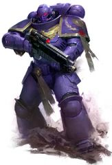
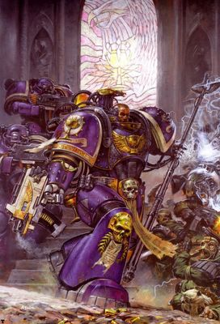
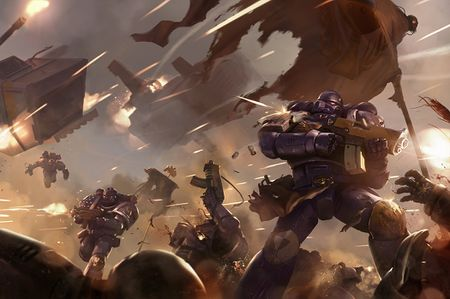
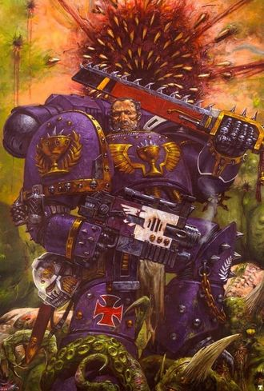

# 0317 饮魂者 Soul Drinkers

精校状态：中文行文已逐段精校，部分术语仍为暂定

分类：通用概念 / 帝国 Imperium / 中央政务部 Adeptus Terra / 阿斯塔特修会 Adeptus Astartes

原文来源：https://www.bilibili.com/opus/1139051839775309830

原作者：帝国神选罐头

原文时间：编辑于 2026年01月01日 10:07

[返回分类目录](目录.md) · [全书目录](../../目录.md)

<!-- A0317-B0001 -->
**英文原文**

The Soul Drinkers are a Successor Chapter of the Imperial Fists, formerly considered a Renegade Chapter.

<!-- /A0317-B0001 -->

<!-- A0317-B0002 -->

原译文

饮魂者是帝国之拳的子战团，以前被认为是变节战团。

**校订译文**

饮魂者是帝国之拳的子战团，以前被认为是变节战团。

**校注：** 开篇概括为帝国之拳子团，后文又记基因检验否定多恩血统；按原稿并存，不提前改定唯一来源。

<!-- /A0317-B0002 -->

<!-- A0317-B0003 图片 -->

<!-- A0317-B0004 图片 -->

<!-- A0317-B0005 -->
**英文原文**

Founding Chapter:Initital: Imperial Fists, Later: Unclear

<!-- /A0317-B0005 -->

<!-- A0317-B0006 -->

原译文

建军战团：最初：帝国之拳，后期：不详

**校订译文**

建军战团：最初：帝国之拳，后期：不详

<!-- /A0317-B0006 -->

<!-- A0317-B0007 -->
**英文原文**

Founding:Initial: Second Founding, Current: Ultima Founding

<!-- /A0317-B0007 -->

<!-- A0317-B0008 -->

原译文

建军：最初：二次建军，现在：极限建军

**校订译文**

建军：最初：二次建军，现在：极限建军

<!-- /A0317-B0008 -->

<!-- A0317-B0009 -->
**英文原文**

Descendants:None

<!-- /A0317-B0009 -->

<!-- A0317-B0010 -->

原译文

子战团：无

**校订译文**

子战团：无

<!-- /A0317-B0010 -->

<!-- A0317-B0011 -->
**英文原文**

Chapter Master:Unknown, formerly Sarpedon

<!-- /A0317-B0011 -->

<!-- A0317-B0012 -->

原译文

战团长：未知，前为萨尔佩冬

**校订译文**

战团长：未知，前为萨尔佩冬

<!-- /A0317-B0012 -->

<!-- A0317-B0013 -->
**英文原文**

Homeworld:Fleet Based

<!-- /A0317-B0013 -->

<!-- A0317-B0014 -->

原译文

家园世界：舰基

**校订译文**

母星：无，以舰队为基地。

<!-- /A0317-B0014 -->

<!-- A0317-B0015 -->
**英文原文**

Fortress-Monastery:The Brokenback (Former)

<!-- /A0317-B0015 -->

<!-- A0317-B0016 -->

原译文

堡垒修道院：断背号（前）

**校订译文**

要塞修道院：断背号（前）

<!-- /A0317-B0016 -->

<!-- A0317-B0017 -->
**英文原文**

Colours:Purple, Gold, Bone

<!-- /A0317-B0017 -->

<!-- A0317-B0018 -->

原译文

配色：紫色，金色，骨色

**校订译文**

配色：紫色，金色，骨色

<!-- /A0317-B0018 -->

<!-- A0317-B0019 -->
**英文原文**

Specialty:Boarding Actions, Drop Pod Assaults and Close Range Firefights.

<!-- /A0317-B0019 -->

<!-- A0317-B0020 -->

原译文

专业：跳帮行动、空投舱袭击和近距离交火。

**校订译文**

专业：跳帮行动、空降舱袭击和近距离交火。

<!-- /A0317-B0020 -->

<!-- A0317-B0021 -->
**英文原文**

Strength:Currently Codex strength

<!-- /A0317-B0021 -->

<!-- A0317-B0022 -->

原译文

力量：目前圣典力量

**校订译文**

兵力：现为圣典规定的满编规模。

<!-- /A0317-B0022 -->

<!-- A0317-B0023 -->
**英文原文**

Battle Cry:"For Dorn! For the Emperor and for freedom!", "Cold and fast, Soul Drinkers!"

<!-- /A0317-B0023 -->

<!-- A0317-B0024 -->

原译文

战吼：“为了多恩！为了帝皇和自由！”，“冷漠而迅捷，饮魂者！”

**校订译文**

战吼：“为了多恩！为了帝皇和自由！”，“冷漠而迅捷，饮魂者！”

<!-- /A0317-B0024 -->

<!-- A0317-B0025 -->
## Overview 概述

<!-- /A0317-B0025 -->

<!-- A0317-B0026 -->
**英文原文**

The original Soul Drinkers did not fit the standard template of Excommunicate Traitoris. Unlike most Renegade Space Marines, who have devoted themselves to the Chaos gods, the Soul Drinkers despised the Ruinous Powers as much if not more than they hate the Imperium that cast them out. Instead, they developed an ideology that stated that the Imperium has betrayed everything the Emperor has stood for; so they still fought the powers of chaos even though they disagree with what the Imperium now stands for. Some within the Chapter thought that the Imperium should be destroyed for the good of mankind.

<!-- /A0317-B0026 -->

<!-- A0317-B0027 -->

原译文

最初的饮魂者不符合绝罚叛徒的标准模板。与大多数献身于混沌诸神的变节星际战士不同，饮魂者鄙视毁灭力量的程度，甚至超过了他们所憎恨的驱逐他们的帝国。相反，他们发展了一种意识形态，认为帝国背叛了帝皇所代表的一切；因此，尽管他们不同意帝国现在所代表的东西，但他们仍然与混沌的力量战斗。战团中的一些人认为，为了人类的利益，帝国应该被摧毁。

**校订译文**

最初的饮魂者并不符合典型“绝罚叛徒”的形象。多数变节星际战士转投混沌诸神，饮魂者对毁灭诸神的憎恶，却不亚于、甚至超过对驱逐他们的帝国的仇恨。他们认为帝国背叛了帝皇的全部理想，因此虽反对当时的帝国，仍继续对抗混沌。战团内甚至有人主张，为人类福祉，必须摧毁帝国。

<!-- /A0317-B0027 -->

<!-- A0317-B0028 -->
**英文原文**

Since their refounding, the Soul Drinkers are considered an exemplar and heroic chapter lauded by the wider Imperium. Their Primaris members are ignorant of their Chapter's storied history.

<!-- /A0317-B0028 -->

<!-- A0317-B0029 -->

原译文

自他们重建以来，饮魂者被视为更广泛的帝国所赞扬的典范和英雄战团。他们的原铸成员对他们战团的传奇历史一无所知。

**校订译文**

自他们重建以来，饮魂者被视为更广泛的帝国所赞扬的典范和英雄战团。他们的原铸成员对他们战团的传奇历史一无所知。

<!-- /A0317-B0029 -->

<!-- A0317-B0030 -->
## History 历史

<!-- /A0317-B0030 -->

<!-- A0317-B0031 -->
### Founding 建军

<!-- /A0317-B0031 -->

<!-- A0317-B0032 -->
**英文原文**

The Soul Drinkers were created by Rogal Dorn during the Second Founding following the Horus Heresy. The Chapter was formed primarily from the remaining fleet based shock attack elements of the Imperial Fists Legion. At its founding, Dorn also presented the Chapter with one of its oldest and most revered artifacts - a weapon known as the Soulspear - as a symbol of purpose and as a sign that, despite being split into separate Chapters, all of the Imperial Fists successors were still united in spirit and brotherhood.

<!-- /A0317-B0032 -->

<!-- A0317-B0033 -->

原译文

饮魂者是罗格·多恩在荷鲁斯叛乱之后的二次建军期间建立的。该战团主要由帝国之拳军团剩余的舰基突击部队成员组成。在建立之初，多恩还向该战团赠送了其最古老、最受尊敬的圣物之一 — 一件被称为灵魂之矛的武器 — 作为目的的象征，并作为一个标志，表明尽管被分成了不同的战团，但所有帝国之拳的子战团仍然在精神和兄弟情谊上团结一致。

**校订译文**

荷鲁斯之乱后的二次建军期间，罗格·多恩创建了饮魂者战团，成员主要来自帝国之拳军团残存的舰基突击部队。建团之初，多恩还赠予他们一件最古老、最受尊崇的圣物——灵魂之矛，以昭示战团的使命，也提醒他们：尽管已经分属不同战团，帝国之拳的子嗣仍以共同的精神和兄弟情谊紧密相连。

<!-- /A0317-B0033 -->

<!-- A0317-B0034 图片 -->

<!-- A0317-B0035 -->

原译文

Soul Drinkers led by Sarpedon 萨尔佩冬领导的饮魂者

**校订译文**

Soul Drinkers led by Sarpedon 萨尔佩冬领导的饮魂者

<!-- /A0317-B0035 -->

<!-- A0317-B0036 -->
**英文原文**

M32

**补译**

第32千年

<!-- /A0317-B0036 -->

<!-- A0317-B0037 -->
### War of the Beast 野兽战争

<!-- /A0317-B0037 -->

<!-- A0317-B0038 -->
**英文原文**

544-546.M32: The War of the Beast — The Soul Drinkers combined with other Imperial Fists Successor Chapters into a Legion as per the Last Wall protocol at the behest of Koorland. Chapter Master Euclydeas was given a third of the combined fleet of the forces at Terra. During the conflict, the Soul Drinkers contributed a portion of their strength to rebuild the Imperial Fists.

<!-- /A0317-B0038 -->

<!-- A0317-B0039 -->

原译文

野兽战争 — 在库兰德的命令下，饮魂者与其他帝国之拳子战团按照最终高墙协议合并为一个军团。战团长欧克莱迪亚斯在泰拉获得了联合舰队三分之一的部队。在冲突期间，饮魂者贡献了一部分力量来重建帝国之拳。

**校订译文**

544—546.M32，野兽战争——饮魂者奉库兰德之命，按最终高墙协议，与其他帝国之拳子团重组军团。战团长欧克莱迪亚斯受命指挥驻泰拉联合舰队的三分之一。战争中，饮魂者又抽调部分兵力，重建帝国之拳。

<!-- /A0317-B0039 -->

<!-- A0317-B0040 -->
**英文原文**

M41

**补译**

第41千年

<!-- /A0317-B0040 -->

<!-- A0317-B0041 -->
**英文原文**

???.M41: A Soul Drinkers detachment, led by Commander Caeon, supported a large force of Imperial Guard against the Eldar on Quixian Obscura.

<!-- /A0317-B0041 -->

<!-- A0317-B0042 -->

原译文

由卡昂指挥官率领的一支饮魂者分遣队支援了一支庞大的帝国卫队，以对抗奎贤暗体的灵族。

**校订译文**

第41千年，日期不详——卡昂指挥官率饮魂者分遣队，在奎克西安·奥布斯库拉支援大批帝国卫队，对抗灵族。

<!-- /A0317-B0042 -->

<!-- A0317-B0043 -->
### Becoming Renegades 成为变节者

<!-- /A0317-B0043 -->

<!-- A0317-B0044 -->
### The Soulspear 灵魂之矛

<!-- /A0317-B0044 -->

<!-- A0317-B0045 -->
**英文原文**

It began with an operation to obtain one of the Chapter's lost relics, the great Soulspear, a weapon used by Rogal Dorn during the Great Crusade, from a criminal organization that had come to possess it. Three companies of Marines, led by Commander Caeon were called on by the Adeptus Administratum to assault the base of operations of the cartel, located in orbit of the planet Lakonia. Just as the 300 Soul Drinkers had taken the orbital defense platform where the relic was being held, and were about to reclaim the Spear, a detachment of Adeptus Mechanicus forces, supposedly there to support the Imperial effort to capture the platform, teleported into the vault that the Spear was stored in and made off with the relic before the Soul Drinkers could react.

<!-- /A0317-B0045 -->

<!-- A0317-B0046 -->

原译文

它始于一项行动，从一个拥有它的犯罪组织那里获得该战团丢失的圣物之一，伟大的灵魂之矛，这是罗格·多恩在大远征期间使用的武器。由卡昂指挥官领导的三个星际战士连队被内务部召唤，袭击位于拉科尼亚行星轨道上的企业联盟行动基地。正当300名饮魂者占领了存放圣物的轨道防御平台，并准备夺回长矛时，一支据称是为了支援帝国夺取平台的机械神教部队分遣队，在饮魂者做出反应之前，被传送到储存长矛的秘库，并带走了圣物。

**校订译文**

事件始于收回失落圣物灵魂之矛的行动。这件罗格·多恩在大远征中使用的武器，落入一个犯罪集团之手。内政部征召卡昂指挥官率领的三个连，攻击该集团位于拉科尼亚轨道的基地。三百名饮魂者刚夺下保存圣物的轨道防御平台，正要取回长矛，一支名义上协助作战的机械修会分遣队却传送进秘库，抢先带走了圣物。

<!-- /A0317-B0046 -->

<!-- A0317-B0047 -->
**英文原文**

The Soul Drinkers then fortified the platform and demanded the return of their relic, but it had already been passed along to another vessel that was en route to the Forge World of Koden Tertius. The Mechanicus then revealed a great siege cannon from their starship; the Soul Drinkers were forced to board and destroy the Mechanicus weapon before it could be used against them, slaying thousands of Tech-Guard in the process. After taking out the weapon, the Soul Drinkers detonated explosives on the orbital platform, causing it to fall into Lakonia's atmosphere and burn up, before fleeing aboard their two Strike Cruisers.

<!-- /A0317-B0047 -->

<!-- A0317-B0048 -->

原译文

饮魂者随后加强了平台，并要求归还他们的圣物，但它已经被转交给另一艘正在前往科登三号铸造世界的战舰。机械教随后从他们的星舰上展示了一门巨大的攻城炮；饮魂者被迫跳帮并摧毁机械教武器，在对他们使用之前，在此过程中杀死了数千名技术卫队。取出武器后，饮魂者在轨道平台上引爆了炸药，使其落入拉科尼亚的大气层并燃烧殆尽，然后乘坐他们的两艘打击巡洋舰逃离。

**校订译文**

饮魂者加固平台，要求归还圣物，但长矛已转交另一艘前往科登三号铸造世界的船舰。机械教随即从星舰中展露巨型攻城炮。饮魂者被迫跳帮，在巨炮开火前将其摧毁，杀死数千名护教军。随后，他们炸毁轨道平台，使其坠入拉科尼亚大气层烧毁，再乘两艘打击巡洋舰撤离。

<!-- /A0317-B0048 -->

<!-- A0317-B0049 -->
**英文原文**

The Imperial forces present for the taking of the star fort pursued the Soul Drinkers, in an operation that came to be known as the Lakonia Persecution. Eventually, the Soul Drinkers made their stand in an asteroid-filled region called the Cerberian Field. The Imperial fleet, unable to enter the Field without sustaining massive casualties, attempted to blockade the region in order to starve the Soul Drinkers of supplies. After five months with seemingly no success, Lord Inquisitor Gorgo Tsouras of the Ordo Hereticus arrived to take charge of the situation.

<!-- /A0317-B0049 -->

<!-- A0317-B0050 -->

原译文

为夺取星堡而出现的帝国部队在一次被称为拉科尼亚迫害的行动中追捕了饮魂者。最终，饮魂者在一个被称为塞伯里亚领域的充斥小行星的地区站稳了脚跟。帝国舰队无法在不造成大规模伤亡的情况下进入领域，试图封锁该地区，以使饮魂者缺乏补给。在五个月也似乎没有成功之后，讨逆修会的领主审判官戈尔戈·楚拉斯来到这里负责处理这一情况。

**校订译文**

参与夺取星堡的帝国部队随即展开追捕，史称拉科尼亚迫害。饮魂者最终在小行星密布的刻耳柏里安星域固守。帝国舰队不愿冒巨量伤亡深入，便封锁外围，试图断绝其补给。五个月未见成效后，异端审判庭领主审判官戈尔戈·楚拉斯抵达，接管局势。

<!-- /A0317-B0050 -->

<!-- A0317-B0051 -->
**英文原文**

The Inquisition, caring not for the reasons why, saw only that the Soul Drinkers had attacked another Imperial institution and demanded they surrender themselves. After Sarpedon's refusal, the entire Chapter was declared Excommunicate Traitoris. Soon after, the rest of the Soul Drinkers and their fleet arrived to extract the two beleaguered Cruisers that they might answer for their actions to the Chapter Master, Gorgoleon.

<!-- /A0317-B0051 -->

<!-- A0317-B0052 -->

原译文

审判庭不关心原因，只看到饮魂者袭击了另一个帝国机构，并要求他们投降。在萨尔佩冬拒绝后，整个战团被宣布为绝罚叛徒。不久之后，其余的饮魂者和他们的舰队抵达，营救了两艘陷入困境的巡洋舰，他们可能会向战团长戈尔戈伦为自己的行为负责。

**校订译文**

审判庭无意追究缘由，只认定饮魂者攻击了另一帝国机构，要求其投降。萨尔佩冬拒绝后，全团遭到叛徒绝罚。不久，战团余部与舰队抵达，将两艘受困巡洋舰接出，带回人员向战团长戈尔戈伦解释自身行为。

<!-- /A0317-B0052 -->

<!-- A0317-B0053 图片 -->

<!-- A0317-B0054 -->

原译文

Soul Drinkers 饮魂者

**校订译文**

Soul Drinkers 饮魂者

<!-- /A0317-B0054 -->

<!-- A0317-B0055 -->

原译文

1st Chapter War 第一次战团战争

**校订译文**

1st Chapter War 第一次战团战争

<!-- /A0317-B0055 -->

<!-- A0317-B0056 -->
**英文原文**

Gorgoleon was obstinate, and saw the Soul Drinkers of Sarpedon at fault, and fought him for the fate of the Chapter. Sarpedon emerged victorious thanks to a set of mutations that granted him the power to overcome Gorgoleon, sparking a war within the Chapter.

<!-- /A0317-B0056 -->

<!-- A0317-B0057 -->

原译文

戈尔戈伦很固执，认为萨尔佩冬的饮魂者有错，并为战团的命运与他战斗。萨尔佩冬取得了胜利，这要归功于一系列突变，这些突变赋予了他战胜戈尔戈伦的力量，引发了战团内部的战争。

**校订译文**

戈尔戈伦很固执，认为萨尔佩冬的饮魂者有错，并为战团的命运与他战斗。萨尔佩冬取得了胜利，这要归功于一系列突变，这些突变赋予了他战胜戈尔戈伦的力量，引发了战团内部的战争。

<!-- /A0317-B0057 -->

<!-- A0317-B0058 -->
**英文原文**

Most of the Novices and some others refused to follow mutant Sarpedon, and took up arms and barricaded themselves throughout the fleet. It took Sarpedon and his forces, who counted most of the Chapter's specialists amongst them, several months to root them out and kill them all.

<!-- /A0317-B0058 -->

<!-- A0317-B0059 -->

原译文

大多数新兵和其他一些人拒绝跟随突变的萨尔佩冬，并拿起武器在整个舰队中设置路障。萨尔佩冬和他的部队花了几个月的时间才将他们铲除并全部杀死，他们中的大多数都是战团的专家。

**校订译文**

大多数新兵及部分战士拒绝追随已经变异的萨尔佩冬，在舰队各处据守反抗。萨尔佩冬的支持者包括战团大多数专业人员，仍花了数月才逐一清剿，将反对者全部杀死。

<!-- /A0317-B0059 -->

<!-- A0317-B0060 -->
### Under the Sway of a Daemon Prince 在恶魔亲王的控制下

原题：Under the Sway of a Daemon Prince 在恶魔王子的控制下

<!-- /A0317-B0060 -->

<!-- A0317-B0061 -->
**英文原文**

Disillusioned by the Imperium, and unknowingly under the influence of a Tzeentch Daemon Prince in the guise of an aspect of the Emperor, Sarpedon opted to keep his Chapter renegade, scuttled the Soul Drinker fleet, and resettled the Chapter into a Space Hulk they dubbed the Brokenback. Soon after, the Daemon Prince Abraxes mislead the Soul Drinkers into attacking one of his rivals, the Nurgle Daemon Prince Ve'Meth. After slaying Ve'Meth, who took the form of a virus infesting several hundred ordinary people, Abraxes revealed his true nature. He handed Sarpedon the Soulspear and offered the Soul Drinkers the chance to serve as his personal retinue of Chaos Space Marines. Though Sarpedon considered his options, he ultimately refused, attacking Abraxes and his daemons and slaying them.

<!-- /A0317-B0061 -->

<!-- A0317-B0062 -->

原译文

萨尔佩冬对帝国感到失望，并在不知不觉中受到了一个伪装成帝皇的奸奇恶魔王子的影响，他选择让自己的战团叛变，摧毁了饮魂者舰队，并将战团重新安置在他们称之为断背号的太空废船上。不久之后，恶魔王子阿布拉克斯误导了饮魂者攻击他的对手之一，纳垢恶魔王子维'梅斯。在杀死了以病毒形态感染数百名普通人的维'梅斯之后，阿布拉克斯揭示了他的真实本性。他将灵魂之矛交给了萨尔佩冬，并让饮魂者有机会成为他的混沌星际战士私人随从。尽管萨尔佩冬考虑了他的选择，但他最终拒绝了，攻击了阿布拉克斯和他的恶魔并杀死了他们。

**校订译文**

萨尔佩冬对帝国感到失望，并在不知不觉中受到了一个伪装成帝皇的奸奇恶魔亲王的影响，他选择让自己的战团叛变，摧毁了饮魂者舰队，并将战团重新安置在他们称之为断背号的太空废船上。不久之后，恶魔亲王阿布拉克斯误导了饮魂者攻击他的对手之一，纳垢恶魔亲王维'梅斯。在杀死了以病毒形态感染数百名普通人的维'梅斯之后，阿布拉克斯揭示了他的真实本性。他将灵魂之矛交给了萨尔佩冬，并让饮魂者有机会成为他的混沌星际战士私人随从。尽管萨尔佩冬考虑了他的选择，但他最终拒绝了，攻击了阿布拉克斯和他的恶魔并杀死了他们。

<!-- /A0317-B0062 -->

<!-- A0317-B0063 -->
### The Empire of Teturact 泰图拉克帝国

<!-- /A0317-B0063 -->

<!-- A0317-B0064 -->
**英文原文**

The heretic Teturact, a life-form produced by Adeptus Mechanicus experiments in Human mutations on desolate Stratix Luminae, was carving a vast empire out of the Imperium of Man. His ability to project noxious, mind-controlling viruses and even raise the dead with them won him godhood in the eyes of those he infected. He was able to claim several important Imperial worlds, including the Hives of Stratix, the Forge World Salshan Anterior, and several others including agri-worlds and other strategic targets. One of these worlds was Stratix Luminae, a world where the old Soul Drinkers had once fought, granting Sarpedon a knowledge of the experiments carried out there. Still in the grips of the mutations brought on by Abraxes, Sarpedon believed this facility and its research represented the best chance of curing the Chapter of those mutations.

<!-- /A0317-B0064 -->

<!-- A0317-B0065 -->

原译文

异端泰图拉克是由机械神教在荒凉的斯特拉蒂克斯之光上进行的人类突变实验产生的一种生命形态，它正在从人类帝国中雕刻出一个庞大的帝国。他能够投射有害的、控制思维的病毒，甚至用它们复活死者，这为他赢得了感染者眼中的神性。他能够声称拥有几个重要的帝国世界，包括斯特拉蒂克斯的巢都、铸造世界萨尔尚边境，以及其他几个包括农业世界和其他战略目标的世界。其中一个世界是斯特拉蒂克斯之光，一个古老的饮魂者曾经战斗过的世界，让萨尔佩冬了解了那里进行的实验。萨尔佩冬仍然掌握着阿布拉克斯带来的突变，他认为这个设施及其研究代表了治愈这些突变的最佳机会。

**校订译文**

异端泰图拉克是机械修会在荒凉的斯特拉蒂克斯之光进行人类变异实验所造的生命体，正从人类帝国疆域中割据出自己的帝国。他能散播控制心智的恶毒病毒，甚至藉此复活死者，在受感染者眼中俨然为神。他夺取了斯特拉蒂克斯诸巢都、萨尔尚·安特里奥铸造世界，以及其他农业和战略世界。其中的斯特拉蒂克斯之光曾是饮魂者旧日战场，因此萨尔佩冬知道当地实验的存在。战团仍受阿布拉克斯引发的变异折磨，他认为这些设施与研究是治愈变异的最佳希望。

<!-- /A0317-B0065 -->

<!-- A0317-B0066 -->
**英文原文**

The Soul Drinkers sought out the surviving Mechanicus personnel from Stratix Luminae across several of the worlds under Teturact's sway, all the while dodging the efforts of the Inquisitorial Taskforce Thaddeus to track them down and bring them to justice, before finally collecting all the pieces of the puzzle that sent them to Stratix Luminae itself. Teturact intervened personally, intentionally breaking up his flag-battleship in orbit to rain debris and his undead followers down on the Soul Drinkers. Sarpedon was able to stun the powerful Teturact long enough for Inquisitor Thaddeus to shoot him, and Sarpedon extinguished Teturacts soul and brought about the ruination of his fledgling empire.

<!-- /A0317-B0066 -->

<!-- A0317-B0067 -->

原译文

饮魂者们在泰图拉克掌控下的几个世界，搜索来自斯特拉蒂克斯之光的幸存机械教人员，同时躲避撒迪厄斯的审判庭特遣部队追踪他们并将他们绳之以法的努力，最后收集了将他们送到斯特拉蒂克斯之光的所有拼图碎片。泰图拉克亲自介入，故意在轨道上击碎他的旗舰，将碎片和他的亡灵追随者倾泻在饮魂者身上。萨尔佩冬能够让强大的泰图拉克昏迷足够长的时间，以便审判官撒迪厄斯射杀他，萨尔佩冬熄灭了泰图拉克的灵魂，并导致了他羽翼未丰的帝国的毁灭。

**校订译文**

饮魂者一面躲避撒迪厄斯审判庭特遣队的追捕，一面在泰图拉克占领的各世界寻找斯特拉蒂克斯之光的幸存机械教人员，最终拼合线索，返回该世界。泰图拉克亲自干预，故意在轨道上解体自己的旗舰，使残骸与亡灵追随者如雨砸向饮魂者。萨尔佩冬短暂震慑住强大的泰图拉克，让审判官撒迪厄斯有机会开枪击中他；随后，萨尔佩冬扑灭其灵魂，使这个新生帝国崩溃。

<!-- /A0317-B0067 -->

<!-- A0317-B0068 -->
### Dealing with Tellos 处置泰洛斯

原题：Dealing with Tellos 与泰洛斯的交易

<!-- /A0317-B0068 -->

<!-- A0317-B0069 -->
**英文原文**

After the defeat of the heretic Teturact, the Soul Drinkers were forced to flee Stratix Luminae, leaving several assault squads, who were under Tellos' command, behind. Tellos, who had bordered on Khornate rage before this betrayal, quickly fell under the Blood God's influence, subverting his assault squads to the service of Khorne. Chapter Master Sarpedon quickly caught wind of this heresy by his battle-brother and tracked Tellos to Entymion IV, an Imperial world held by a mysterious alliance of Dark Eldar and Slaaneshi Cultists. The Imperial Guard, with the assistance of the Crimson Fists, were at that moment trying to liberate the world.

<!-- /A0317-B0069 -->

<!-- A0317-B0070 -->

原译文

异端泰图拉克被击败后，饮魂者被迫逃离斯特拉蒂克斯之光，留下了几个由泰洛斯指挥的突击小队。泰洛斯在这次背叛之前曾接近恐虐的愤怒，很快就受到了血神的影响，策反了他的突击小队为恐虐服务。战团长萨尔佩冬很快就察觉到了他的战斗兄弟所的这一异端，并将泰洛斯追踪到恩提米昂四号，这是一个由黑暗灵族和色孽邪教徒组成的神秘联盟所控制的帝国世界。帝国卫队在绯红之拳的协助下，当时正试图解放世界。

**校订译文**

击败异端泰图拉克后，饮魂者被迫逃离斯特拉蒂克斯之光，将泰洛斯指挥的几个突击小队留在了那里。遭到遗弃前，泰洛斯便已濒临恐虐式的狂怒，此后很快彻底受血神操纵，带领自己的突击小队转奉恐虐。战团长萨尔佩冬得知兄弟的异端行为后，一路追踪至恩提米昂四号。这颗帝国世界被黑暗灵族与色孽邪教徒组成的神秘联盟控制，帝国卫队正与绯红之拳联手，试图将其解放。

<!-- /A0317-B0070 -->

<!-- A0317-B0071 -->
**英文原文**

The Crimson Fists force was initially small, serving as a spearhead for the array of Imperial Guard regiments attempting to retake the capital city of Gravenhold. However, they quickly fell afoul of Tellos' Soul Drinkers, clashing indecisively as the Fists took up overwatch positions in a cathedral. In the aftermath, recognizing the chalice emblem and believing the entire Soul Drinkers Chapter present, Crimson Fists Commander Reinez sent word of the Soul Drinkers presence to Rynn's World, who responded with the Fists 2nd Company under Chaplain Inhuaca, placing himself and the Company under Reinez's command with orders to destroy the Soul Drinkers and bring back Chief Librarian Sarpedon's head.

<!-- /A0317-B0071 -->

<!-- A0317-B0072 -->

原译文

绯红之拳部队最初规模较小，是试图夺回首都墓堡城的帝国卫队兵团的先锋。然而，他们很快就与泰洛斯的饮魂者发生了冲突，当绯红之拳在一座大教堂里占据守望者的位置时，他们犹豫不决地发生了冲突。之后，认识到圣杯徽章并相信整个饮魂者战团都在场，绯红之拳指挥官雷内斯向林恩世界发出了饮魂者在场的消息，林恩世界以因华卡牧师领导的第二连队作为回应，将自己和连队置于雷内斯的指挥之下，命令摧毁饮魂者并带回首席智库萨尔佩冬的头颅。

**校订译文**

绯红之拳最初兵力很少，为夺回首府墓堡城的多个帝国卫队团充当先锋。他们很快与泰洛斯的饮魂者交火，并在一座圣堂设置掩护阵位，战斗未分胜负。看到圣杯徽章后，指挥官雷内斯误以为饮魂者全团到场，向瑞恩世界求援。因华卡教士遂率第二连赶来，归雷内斯指挥，奉命消灭饮魂者、带回首席智库员萨尔佩冬的首级。

<!-- /A0317-B0072 -->

<!-- A0317-B0073 -->
**英文原文**

Upon their arrival on Entymion IV, Sarpedon's Soul Drinkers immediately began investigating the situation. Their method of infiltrating the world, hijacking a pair of landers from the Imperial Navy, quickly alerted the Crimson Fists as to their location. After securing the assistance of the Armoured Fist units of the Fornux Lix Fire Drakes Regiment, the Crimson Fists dove deep into the city and fought the Soul Drinkers in a brutal brawl within the city's Mercantile Chamber. The Soul Drinkers pulled back after capturing the Fists Company Standard and killing the company Librarian.

<!-- /A0317-B0073 -->

<!-- A0317-B0074 -->

原译文

在他们抵达恩提米昂四号后，萨尔佩冬的饮魂者立即开始调查情况。他们渗透世界的方法，从帝国海军劫持了一对登陆艇，帝国海军迅速向绯红之拳通报了他们的位置。在获得弗努克斯·利克斯火龙兵团装甲之拳部队的协助后，绯红之拳潜入城市深处，在城市的贸易大厅内与饮魂者进行了残酷的战斗。在俘获了绯红之拳连队旗手并杀死了连队智库后，饮魂者撤退了。

**校订译文**

抵达恩提米昂四号后，萨尔佩冬开始调查。他们劫持两艘帝国海军登陆艇潜入行星的举动，很快暴露了位置。绯红之拳获得弗努克斯·利克斯火龙团装甲之拳部队支援后，深入城市，在贸易大厅与饮魂者激战。饮魂者夺走对方连旗、杀死该连智库员后撤离。

<!-- /A0317-B0074 -->

<!-- A0317-B0075 -->
**英文原文**

Throughout this fight, the Dark Eldar present on the world observed the Soul Drinkers fighting against the loyalist forces. The intervention of the brainwashed slave army of the Dark Eldar deterred Fists pursuit as the Soul Drinkers retreated beneath the city. They were quickly approached by the Dark Eldar- who, clearly bearing betrayal in mind - offered Sarpedon an Alliance, which Sarpedon - also planning betrayal - accepted.

<!-- /A0317-B0075 -->

<!-- A0317-B0076 -->

原译文

在这场战斗中，世界上的黑暗灵族观察到饮魂者与忠诚派部队作战。黑暗灵族被洗脑的奴隶军队的干预阻止了绯红之拳的追捕，因为饮魂者撤退到了城市下面。黑暗灵族很快找到了他们，他显然考虑到了背叛，向萨尔佩冬提出了一个联盟，萨尔佩冬也计划背叛，并接受了这个联盟。

**校订译文**

在这场战斗中，世界上的黑暗灵族观察到饮魂者与忠诚派部队作战。黑暗灵族被洗脑的奴隶军队的干预阻止了绯红之拳的追捕，因为饮魂者撤退到了城市下面。黑暗灵族很快找到了他们，他显然考虑到了背叛，向萨尔佩冬提出了一个联盟，萨尔佩冬也计划背叛，并接受了这个联盟。

<!-- /A0317-B0076 -->

<!-- A0317-B0077 -->
**英文原文**

Interested in nothing save finding Tellos, Sarpedon split the Soul Drinkers into two parts to blunt the Imperial Guard for the Dark Eldar, all the while the Soul Drinkers Scouts sought out Tellos in the city. The Scouts soon located Tellos and his retinue as they butchered through a Guard regiment, and Chaplain Iktinos and his flock were able to hold them in place long enough for Sarpedon to arrive and defeat Tellos, collapsing a span bridge on top of him. The Dark Eldar still benefited from this, buying time for a secret army of mutated human slaves to fully awaken beneath the city and begin a slaughter so great it would propel Entymion IV to the status of Daemon World, one ruled by the Dark Eldar as a second Commorragh. The Soul Drinkers would ultimately have the last laugh, using their Scouts to trick the Crimson Fists into attacking the Dark Eldar stronghold on the world, slaying all the xenos and preventing their plan from reaching fruition. Though prematurely stopped, the hole in reality leading into the Warp tainted the world beyond hope, and the whole world was destroyed by Exterminatus.

<!-- /A0317-B0077 -->

<!-- A0317-B0078 -->

原译文

萨尔佩冬除了找到泰洛斯外，什么都不感兴趣，他把饮魂者分成两部分，以削弱黑暗灵族的帝国卫队，而饮魂者侦察兵一直在城里寻找泰洛斯。侦察兵很快找到了泰洛斯和他的追随者，因为他们在一个卫队兵团中屠杀了他们，牧师伊克蒂诺斯和他的信众能够将他们保持在原地足够长的时间，以便萨尔佩冬到达并击败泰洛斯，在他身上倒塌了一座跨桥。黑暗灵族仍然从中受益，为一支由变异人类奴隶组成的秘密军队争取时间，让他们在城市下完全唤醒，开始一场大规模的屠杀，这场屠杀将把恩提米昂四号推向恶魔世界的状态，一个由黑暗灵族统治的第二个科摩罗。饮魂者最终笑到最后，利用他们的侦察兵诱骗绯红之拳攻击世界上的黑暗灵族要塞，杀死所有的异型，阻止他们的计划实现。虽然过早地停止了，但现实中通向亚空间的空洞却让世界毫无希望，整个世界都被灭绝令摧毁了。

**校订译文**

萨尔佩冬只想找到泰洛斯，遂将饮魂者分为两路，替黑暗灵族牵制帝国卫队，同时派侦察兵搜寻目标。侦察兵发现泰洛斯及其追随者正在屠杀一个卫队团；伊克蒂诺斯教士与信众将他们拖住，直至萨尔佩冬赶到，击垮一段桥梁压住泰洛斯，赢得战斗。这仍让黑暗灵族获益：他们争取到时间，唤醒藏于城下的变异人类奴隶大军，打算以骇人屠杀将恩提米昂四号变为恶魔世界，建立自己统治的第二个科摩罗。然而，饮魂者最终用侦察兵诱使绯红之拳攻击黑暗灵族据点，歼灭异形、挫败计划。尽管阴谋中途败露，通往亚空间的现实裂口已使行星污染至无可挽救，最终仍被灭绝令摧毁。

<!-- /A0317-B0078 -->

<!-- A0317-B0079 -->

原译文

2nd Chapter War 第二次战团战争

**校订译文**

2nd Chapter War 第二次战团战争

<!-- /A0317-B0079 -->

<!-- A0317-B0080 -->
**英文原文**

The Soul Drinkers found another Chapter War brewing between Sarpedon, and the new Sergent Eumenes, taken from a planet that hated the Imperium, to restock the Chapter. Eumenes felt that the fight should be taken directly to the Emperor. He wanted to take out the Astronomican, and blot out the light that guides the Emperor's ships through the warp to start the Imperium over. Sarpedon, however, struck a new course for the Chapter after being given advice from Chaplain Iktinos that a planet called Vanqualis was under attack from a horde of Orks and needed their protection. Afterwords, the Soul Drinkers would be able to benefit by taking on supplies for their new home, the Brokenback. Sarpedon led the Soul Drinkers through the jungles of Vanqualis to battle the Orks, but in his absence Eumenes took control of the Brokenback and started a coup that included a great deal of the forces on the planet. After consolidating, Sarpedon's Soul Drinkers set out to take an old fortress from the rebels. Once there, Librarian Gresk warned Sarpedon to leave. Sarpedon did, before Eumenes bombarded the land surrounding the fortress from the Brokenback.

<!-- /A0317-B0080 -->

<!-- A0317-B0081 -->

原译文

饮魂者发现，萨尔佩冬和从一个憎恨帝国的行星上被带走的新军事欧迈尼斯之间正在酝酿另一场战团战争，以更新战团。欧迈尼斯认为这场战斗应该直接交给帝皇。他想取得星炬，并抹去引导帝皇的船只穿过亚空间的光以重新开始帝国。然而，萨尔佩冬在得到牧师伊克蒂诺斯的建议后，为战团开辟了一条新的道路，即一个名为凡奎利斯的行星正受到一群欧克的攻击，需要他们的保护。事后，饮魂者将能够通过为他们的新家园断背号购买物资而受益。萨尔佩冬带领饮魂者穿过凡奎利斯的丛林与欧克作战，但在他缺席的情况下，欧迈尼斯控制了断背号并发动了一场政变，其中包括行星上的许多部队。在合并后，萨尔佩冬的饮魂者开始从叛乱者手中夺取一座旧堡垒。一到那里，智库格里斯克就警告萨尔佩冬离开。萨尔佩冬做了，在欧迈尼斯从断背号轰炸堡垒周围的土地之前。

**校订译文**

萨尔佩冬与新晋军士欧迈尼斯之间，又开始酝酿战团内战。欧迈尼斯来自一个憎恨帝国的世界，被招入战团补充兵力；他主张直接对帝皇开战，摧毁星炬、熄灭引导帝国船舰的光芒，迫使帝国重建。萨尔佩冬却听取伊克蒂诺斯教士建议，前去援救遭欧克蛮人攻击的凡奎利斯，也藉此为断背号获取补给。他带兵穿越丛林作战时，欧迈尼斯夺取断背号，并策动大量地面人员叛乱。萨尔佩冬整合忠于自己的部队，前往夺回叛军占领的古堡，却被智库员格里斯克警告赶快撤离；他及时离开，躲过欧迈尼斯从断背号发起的轨道轰炸。

<!-- /A0317-B0081 -->

<!-- A0317-B0082 -->
**英文原文**

The Howling Griffons Chapter had sent three Companies under Lord-Librarian Mercaeno to the world to honor an old debt the Chapter owed Vanqualis. The Griffons had also allowed Inquisitor Thaddeus, now disfavored within the Inquisition, to tag along on the suspicions of the Soul Drinkers involvement. Though he realized that Mercaeno didn't comprehend what the Soul Drinkers really were, he could not convince him of this fact. Thaddeus tried to leave the Strike Cruiser and warn Sarpedon of the Griffons, but had to kill one of the Griffons in a close-quarters firefight before he could escape. Mercaeno and his Griffons landed shortly thereafter, and did battle with Sarpedon's group while the traitors watched bemusedly from the sidelines. It was during this that Mercaeno killed Thaddeus for killing his battle-brother.

<!-- /A0317-B0082 -->

<!-- A0317-B0083 -->

原译文

咆哮狮鹫战团派遣了三个连队，由领主智库梅尔卡诺领导，前往世界各地偿还战团欠凡奎利斯的旧债。狮鹫还允许现在在审判庭内不受欢迎的审判官撒迪厄斯对饮魂者的参与表示怀疑。虽然他意识到梅尔卡诺并不理解饮魂者到底是什么，但他无法说服他相信这一事实。撒迪厄斯试图离开打击巡洋舰并警告萨尔佩冬狮鹫的存在，但在他逃脱之前，不得不在近距离交火中杀死一名狮鹫。不久之后，梅尔卡诺和他的狮鹫登陆，并与萨尔佩顿的小队作战，而叛徒则困惑地站在场边观看。正是在这期间，梅尔卡诺杀死了撒迪厄斯，因为他杀死了他的战斗兄弟。

**校订译文**

为偿还对凡奎利斯的旧日恩义，咆哮狮鹫派领主智库员梅尔卡诺率三个连来援。已在审判庭失势的撒迪厄斯怀疑饮魂者也在当地，获准随行。他知道梅尔卡诺误解了饮魂者，却无法说服对方，遂试图离舰警告萨尔佩冬，为脱身不得不在近距离交火中杀死一名狮鹫。梅尔卡诺随后登陆，与萨尔佩冬部队交战，叛军则困惑地作壁上观。梅尔卡诺也在此战杀死撒迪厄斯，为被杀的战斗兄弟复仇。

<!-- /A0317-B0083 -->

<!-- A0317-B0084 -->
### Aftermath 余波

<!-- /A0317-B0084 -->

<!-- A0317-B0085 -->
**英文原文**

Sarpedon could not get off Vanqualis, and conceded to Eumenes' wishes. Eumenes became the new Chapter Master. Sarepdon led the loyal Soul Drinkers to Techmarine Lygris, loyal to Sarpedon, but was stuck on the Brokenback until Eumenes let him shuttle Sarpedon and his forces back to their ship in time to repel a boarding attack from the Howling Griffons. Sarpedon and Mercaeno engaged in a titanic psychic duel, tiring each other out until Eumenes struck down Mercaeno from behind and throwing Sarpedon in the brig. Sarpedon then attacked psyker-latent Scout Scamandar in the Brokenback's brig, incapacitating him. Sarpedon then made his way to the bridge, where he duels Eumenes. Though Eumenes had both the Soulspear and Mercaeno's force axe, Sarpedon impales him with his mutated legs, and wins back the Chapter he won from Gorgoleon.

<!-- /A0317-B0085 -->

<!-- A0317-B0086 -->

原译文

萨尔佩冬无法离开凡奎利斯，并屈从于欧迈尼斯的意愿。欧迈尼斯成为了新的战团长。萨尔佩冬带领忠诚的饮魂者前往技术军士莱格里斯，但被困在断背号上，直到欧迈尼斯让他将萨尔佩冬和他的部队及时送回他们的船上，击退了咆哮狮鹫的跳帮攻击。萨尔佩冬和梅尔卡诺进行了一场巨大的灵能决斗，互相折磨，直到欧迈尼斯从后面击倒了梅尔卡诺，并将萨尔佩冬扔进了禁闭室。萨尔佩冬随后在断背号的禁闭室里袭击了潜在的灵能者侦察兵斯卡曼德，使他丧失了行动能力。萨尔佩冬随后前往舰桥上，在那里他与欧迈尼斯决斗。尽管欧迈尼斯拥有灵魂之矛和梅尔卡诺的灵能斧，但萨尔佩冬用他变异的腿刺穿了他，并夺回了他从戈尔戈伦手中赢得的战团。

**校订译文**

无法离开凡奎利斯的萨尔佩冬被迫屈服，承认欧迈尼斯为新战团长。忠于萨尔佩冬的科技战士莱格里斯原被困在断背号上，直至欧迈尼斯准他接回萨尔佩冬等人，以抵御咆哮狮鹫跳帮。萨尔佩冬与梅尔卡诺展开惊人的灵能对决，两败俱疲；欧迈尼斯从背后击倒梅尔卡诺，再将萨尔佩冬关入禁闭室。萨尔佩冬制服具有潜在灵能的侦察兵斯卡曼德，逃至舰桥挑战欧迈尼斯。即使对方手持灵魂之矛和梅尔卡诺的灵能斧，他仍以变异蛛腿将其刺穿，再度夺回战团。

**校注：** 英文主语衔接有残缺；结合“让他运送萨尔佩冬返回”理解，被困船上者为科技战士莱格里斯，不是仍在地面的萨尔佩冬。

<!-- /A0317-B0086 -->

<!-- A0317-B0087 -->
### Necrons 太空死灵

原题：Necrons 死灵

<!-- /A0317-B0087 -->

<!-- A0317-B0088 -->
**英文原文**

While fleeing from a Adeptus Mechanicus task force, the Soul Drinkers Space Hulk is severely damaged and low on fuel. Forced to run, the Soul Drinkers go deep into the veiled regions in search of fuel. They run into the Necrons on many worlds, all with signs of previous human settlement, but now infested with the undying xenos. Eventually they discover the last of the human worlds that the Necrons are still in the process of cleansing, and the Soul Drinkers make a deal with the survivors. They allow the human's time to retreat to their space-craft while they hold the Necron forces off, in exchange for the Soul Drinkers receiving fuel.

<!-- /A0317-B0088 -->

<!-- A0317-B0089 -->

原译文

在逃离机械神教特遣部队时，饮魂者太空废船严重受损，燃料不足。被迫逃跑，饮魂者深入帷幕地区寻找燃料。他们在许多世界上遇到了死灵，所有这些都有以前人类定居的迹象，但现在却被永恒的异型所侵扰。最终，他们发现了最后一个人类世界，死灵仍在清除过程中，饮魂者与幸存者达成了协议。他们允许人类有时间撤退到他们的宇宙飞船上，同时阻止死灵部队，以换取饮魂者获得燃料。

**校订译文**

逃避机械修会特遣队时，断背号严重受损，燃料不足，饮魂者被迫深入帷幕地区寻觅补给。许多曾有人类定居的世界已被太空死灵占据。最终，他们找到一颗仍在遭清剿的最后人类世界，与幸存者约定：饮魂者掩护居民撤入船舰，对方则提供燃料。

<!-- /A0317-B0089 -->

<!-- A0317-B0090 -->
**英文原文**

The Souldrinkers hold out aganist the Necrons, and the human population reach their spaceport but a Necron fleet arrives in-system, preventing them from leaving. The Adeptus Mechanicus fleet arrives shortly after, and the two fleets begin fighting against each other. It is immediately obvious that the imperial forces would be destroyed, so they began a complex pattern of manoeuvers to delay the inevitable.

<!-- /A0317-B0090 -->

<!-- A0317-B0091 -->

原译文

饮魂者坚持对抗死灵，人类到达了他们的太空港，但死灵舰队进入了星系，阻止了他们离开。不久之后，机械神教舰队抵达，两支舰队开始相互交战。很明显，帝国军队将被摧毁，因此他们开始了一种复杂的策略来拖延不可避免的事情。

**校订译文**

饮魂者守住防线，人类抵达太空港，却被进入恒星系的太空死灵舰队封死退路。机械修会舰队随后赶到，与死灵交火。帝国舰队明显无法取胜，只得依靠复杂机动拖延注定的败局。

<!-- /A0317-B0091 -->

<!-- A0317-B0092 -->
**英文原文**

When the Soul Drinkers realized they could not beat the approaching Necron force on the ground, and the Mechanicus would lose in space, Sarpedon offered an alliance with the Mechanicus. Chaplain Iktinos and his "flock" remained behind to help defend the spaceport and the surviving humans. It is revealed that his "flock" is loyal to his secret master as well, and no longer consider themselves Soul Drinkers.

<!-- /A0317-B0092 -->

<!-- A0317-B0093 -->

原译文

当饮魂者意识到他们无法在地面上击败即将到来的死灵部队，机械教将在太空中失败时，萨尔佩冬提出与机械教结盟。牧师伊克蒂诺斯和他的信众留下来帮助保卫太空港和幸存的人类。据透露，他的信众也忠于他的秘密主人，不再认为自己是饮魂者。

**校订译文**

当饮魂者意识到他们无法在地面上击败即将到来的死灵部队，机械教将在太空中失败时，萨尔佩冬提出与机械教结盟。教士伊克蒂诺斯和他的信众留下来帮助保卫太空港和幸存的人类。据透露，他的信众也忠于他的秘密主人，不再认为自己是饮魂者。

<!-- /A0317-B0093 -->

<!-- A0317-B0094 -->
**英文原文**

Accepting the alliance the Mechanicus and Soul Drinkers set off for the main Necron hub, planning to destroy the Necron Lord and leave the rest of the enemy forces leaderless.

<!-- /A0317-B0094 -->

<!-- A0317-B0095 -->

原译文

机械教和饮魂者接受了联盟，出发前往主要的死灵中心，计划摧毁死灵领主，让其他敌军失去领导。

**校订译文**

机械教和饮魂者接受了联盟，出发前往主要的死灵中心，计划摧毁死灵领主，让其他敌军失去领导。

<!-- /A0317-B0095 -->

<!-- A0317-B0096 -->
**英文原文**

Arriving at the Tomb World, the Mechanicus crash their ship into the planet and deployed alongside the Soul Drinkers. A long bloody battle begins as they race to kill the Necron lord, before the Necrons superior numbers begin to change the odds. Finally they arrive at the Necron Lord's location and Sarpedon duels with it and wins. However in typical Necron fashion it gets back up, and begins crushing him to death. Only by the sacrifice of Techmarine Lygris was the lord defeated.

<!-- /A0317-B0096 -->

<!-- A0317-B0097 -->

原译文

到达墓穴世界后，机械教将他们的飞船撞向行星，并部署在饮魂者旁边。一场漫长的血腥战斗开始了，因为他们在死灵的人数优势开始改变可能性之前，就争相杀死死灵领主。最后，他们到达了死灵领主的位置，萨尔佩冬与之决斗并获胜。然而，以典型的死灵风格，它又回来了，开始压制他。只有靠技术军士莱格里斯的牺牲才击败了领主。

**校订译文**

抵达墓穴世界后，机械教让舰船撞落地表，与饮魂者共同出击。他们必须抢在太空死灵以数量优势压垮己方前，杀死死灵领主。血战许久，萨尔佩冬终于与其决斗并获胜；但敌人如死灵惯常那样再度起身，几乎将他碾死。莱格里斯牺牲自己，才最终击败领主。

<!-- /A0317-B0097 -->

<!-- A0317-B0098 -->
**英文原文**

Gathering his forces, Sarpedon lead his remaining troops towards the crashed Adeptus Mechanicus ship, where their promised transports were to be awaiting them. Instead three Imperial Fists Thunderhawk gunships deployed upon the surface, while twenty Terminator armoured elites teleport onto the planet, lead by First Captain Darnath Lysander. He ordered the Soul Drinkers to surrender or be destroyed. Sarpedon replies with the challenge of a personal duel. Despite Sarpedon's warp enhanced strength, he was tired from the earlier fighting and was swiftly beaten. The book ends with Sarpedon hoping that Luko follows his last order to surrender if he was beaten.

<!-- /A0317-B0098 -->

<!-- A0317-B0099 -->

原译文

萨尔佩冬召集他的部队，带领剩下的部队前往坠毁的机械神教船只，他们承诺的运输舰将在那里等待他们。相反，三架帝国之拳雷鹰炮艇部署在表面上，而二十名终结者装甲精英在第一连长达纳斯·莱山德的带领下传送到行星上。他命令饮魂者要么投降，要么被消灭。萨尔佩冬以个人决斗的挑战作为回应。尽管萨尔佩冬的亚空间增强了力量，但他在之前的战斗中已经疲惫不堪，很快就被击败了。这本书的结尾是萨尔佩冬希望卢科遵守他最后的命令，如果他被打败就投降。

**校订译文**

萨尔佩冬集结残兵，返回坠毁的机械修会舰船，原定运输艇应在那里接应。等来的却是三架帝国之拳雷鹰，以及第一连长达纳斯·莱山德率领、传送落地的二十名终结者。莱山德要求饮魂者投降，否则消灭全员。萨尔佩冬提出单挑，虽有亚空间增强的力量，却已在前战耗尽体力，很快败下阵来。小说在此结束，他只盼卢科遵守自己最后的命令：若决斗失败，就率众投降。

<!-- /A0317-B0099 -->

<!-- A0317-B0100 -->
### Endgame 终局

<!-- /A0317-B0100 -->

<!-- A0317-B0101 -->
**英文原文**

After their capture, the remaining Soul Drinkers were brought to trial on board The Phalanx, and a conclave of Imperial Fist successor chapters and other concerned parties gathered to pass judgement on them. During the trial, Commander Gethsemar of the Angels Sanguine stated that the Sanguinary Priests of his Chapter had examined the gene-seed of the Soul Drinkers, as part of their research into the link between the gene-seed and the related Primarch and also to see if the chapters fall was related to corruption of the gene-seed, and they discovered that Rogal Dorn is not the Chapter's Primarch.

<!-- /A0317-B0101 -->

<!-- A0317-B0102 -->

原译文

在他们被捕后，剩下的饮魂者被带到山阵号上接受审判，一个帝国之拳子战团和其他有关各方的秘会聚集在一起对他们进行审判。在审判期间，圣血天使的指挥官革责玛尼表示，他的战团的圣血祭司已经检查了饮魂者的基因种子，作为他们研究基因种子与相关原体之间联系的一部分，并查看战团的堕落是否与基因种子的腐化有关，他们发现罗格·多恩不是战团的原体。

**校订译文**

被俘的饮魂者被带上山阵号受审，帝国之拳各子团与相关各方召开审判会议。鲜血天使指挥官革责玛尼表示，该团圣血祭司研究过饮魂者的基因种子，以探究其与原体的关系，并确认叛变是否源自种子腐化。检验结果却发现，罗格·多恩并非他们的基因原体。

**校注：** Angels Sanguine 暂译鲜血天使，与Blood Angels圣血天使区分，原译混同两战团。

<!-- /A0317-B0102 -->

<!-- A0317-B0103 图片 -->

<!-- A0317-B0104 -->

原译文

Soul Drinker Marine at the time of their renegade period 变节时期的饮魂者战士

**校订译文**

Soul Drinker Marine at the time of their renegade period 变节时期的饮魂者战士

<!-- /A0317-B0104 -->

<!-- A0317-B0105 -->
**英文原文**

During the subsequent trial, it was learned that Daenyathos was in fact still alive as a Dreadnought, and had laid down the seeds of a Chapter which would rebel against the Imperium, using the Chaplaincy as his agents in his absence. Knowing that the Imperial Fists would try to claim authority over their supposed successor, Daenyathos had himself brought aboard and the Phalanx and freed by a cult he had seeded millennia earlier. Escape, Daenyathos used the Predator's Eye warp gate within the Phalanx to release a daemon (which by chance was Abraxes). Daenyathos planned to have Abraxes bring the Imperium into a new dark age, believing that a stronger Imperium (which he would rule over) would emerge from the ashes.

<!-- /A0317-B0105 -->

<!-- A0317-B0106 -->

原译文

在随后的审判中，人们得知戴尼亚索斯实际上还活着，是一位无畏，并在他缺席的情况下，利用牧师作为他的代理人，为反抗帝国的战团埋下了种子。知道帝国之拳会试图对他们所谓的子战团宣称权威，戴尼亚索斯将自己带上了山阵号，并被他数千年前播种的教派解放。摆脱后，戴尼亚索斯使用山阵号内的掠食者之眼亚空间之门释放了一个恶魔（碰巧是阿布拉克斯）。戴尼亚索斯计划让阿布拉克斯将帝国带入一个新的黑暗时代，相信一个更强大的帝国（他将统治）将从灰烬中出现。

**校订译文**

审判期间，众人才得知戴尼亚索斯仍以无畏机甲之身活着，长久以来通过教士团代理人，暗中播下反叛帝国的种子。他料定帝国之拳会对自认的子团行使管辖权，便安排自己登上山阵号，再由数千年前埋下的教派势力释放。逃脱后，他开启舰内掠食者之眼亚空间门，放出一只恶魔，恰好就是阿布拉克斯。他打算藉恶魔将帝国拖入新的黑暗时代，相信灰烬中将诞生更强大、由自己统治的帝国。

<!-- /A0317-B0106 -->

<!-- A0317-B0107 -->
**英文原文**

While Iktinos and his flock joined Daenyathos, the majority of the surviving Soul Drinkers refused to be Daenyathos's pawns, and joined the Imperial Fists in fighting off Abraxes's army and closing the warp gate. By the battle's end, Abraxes had been defeated by Captain Luko and Sarpedon had destroyed Daenyathos's Dreadnought, taking him prisoner. In the process, however, all the remaining Soul Drinkers except for Sarpedon, Daenyathos, Luko, and Graevus were killed. Luko, Graevus, and Sarpedon chose to walk into the warp gate, with Sarpedon dragging a screaming Daenyathos with him, bringing an end to the Soul Drinkers chapter, their ultimate fates are unknown. Now convinced that they were in fact loyal servants of the Emperor, the Imperial Fists inscribed a column in the Phalanx's Apothecarion with the names of the fallen Soul Drinkers, holding them as worthy and honourable brothers in death.

<!-- /A0317-B0107 -->

<!-- A0317-B0108 -->

原译文

当伊克蒂诺斯和他的信众加入戴尼亚索斯时，大多数幸存的饮魂者拒绝成为戴尼亚索斯的棋子，并加入了帝国之拳，击退了阿布拉克斯的军队并关闭了亚空间之门。战斗结束时，卢科连长击败了阿布拉克斯，萨尔佩冬摧毁了戴尼亚索斯的无畏，将他俘虏。然而，在这个过程中，除了萨尔佩冬、戴尼亚索斯、卢科和格雷夫斯之外，所有剩下的饮魂者都被杀死了。卢科、格雷夫斯和萨尔佩冬选择走进亚空间之门，萨尔佩冬拖着尖啸的戴尼亚索斯，结束了饮魂者战团，他们的最终命运未知。现在确信他们实际上是帝皇的忠实仆人，帝国之拳在山阵号的药剂部刻下了陨落的饮魂者的名字，将他们视为死后值得尊敬的兄弟。

**校订译文**

伊克蒂诺斯与信众投向戴尼亚索斯，余下饮魂者大多拒绝受其操纵，转而与帝国之拳一起抵抗阿布拉克斯军队，设法关闭亚空间门。战斗结束时，卢科击败阿布拉克斯，萨尔佩冬摧毁戴尼亚索斯的无畏机体、将其俘获；但饮魂者只剩萨尔佩冬、戴尼亚索斯、卢科和格雷夫斯四人。卢科、格雷夫斯与萨尔佩冬选择步入亚空间门，萨尔佩冬还拖着尖叫的戴尼亚索斯，旧饮魂者战团就此终结，四人最终命运不明。帝国之拳终于承认他们忠于帝皇，将陨落饮魂者的名字刻在山阵号药剂部的一根柱子上，尊其为死后仍值得敬重的兄弟。

**校注：** 原文先说关闭传送门，后又说四人走入门内；按过程表达为设法关闭，保留后文实际进门与生死未知，不声称四人已经死亡。

<!-- /A0317-B0108 -->

<!-- A0317-B0109 -->
**英文原文**

Despite the Imperial Fists' recognition of the Soul Drinkers' ultimate loyalty, the Chapter still presented an awkward legacy to the Imperium. As a result, the Inquisition surpressed information on the Soul Drinkers and ensured that the Chapter was mostly forgotten over the following time.

<!-- /A0317-B0109 -->

<!-- A0317-B0110 -->

原译文

尽管帝国之拳承认饮魂者的终极忠诚，但战团仍然给帝国留下了尴尬的遗产。因此，审判庭压制了关于饮魂者的信息，并确保战团在接下来的时间里基本上被遗忘。

**校订译文**

尽管帝国之拳承认饮魂者的终极忠诚，但战团仍然给帝国留下了尴尬的遗产。因此，审判庭压制了关于饮魂者的信息，并确保战团在接下来的时间里基本上被遗忘。

<!-- /A0317-B0110 -->

<!-- A0317-B0111 -->
### Refounding 重建

<!-- /A0317-B0111 -->

<!-- A0317-B0112 -->
**英文原文**

In the Age of the Dark Imperium the Soul Drinkers were refounded by order of Roboute Guilliman, formed by Primaris Space Marines, and took part in the Indomitus Crusade. The new Chapter had almost no knowledge of their predecessor, but its members initially believed their origins to be illustrious and honorable. The new Chapter, eager to prove worthy of its name, scored a much-needed victory in the Keprian Reclamation. However, the Soul Drinkers once again earned the ire of the Inquisition in the process, and learned that the original Soul Drinkers had been deliberately forgotten, causing its Marines to wonder about themselves and their heritage.

<!-- /A0317-B0112 -->

<!-- A0317-B0113 -->

原译文

在黑暗帝国时代，饮魂者被罗伯特·基里曼命令由原铸星际战士重建，并参加了不屈远征。新战团几乎不知道他们的前任，但其成员最初认为他们的起源是杰出而光荣的。新战团渴望证明自己名副其实，在凯普里安垦区取得了急需的胜利。然而，在此过程中，饮魂者再次引起了审判庭的愤怒，并得知最初的饮魂者被故意遗忘，导致其战士对自己和他们的遗产感到怀疑。

**校订译文**

黑暗帝国时代，罗保特·基里曼下令以原铸星际战士重建饮魂者，投入不屈远征。新成员几乎不知前身历史，起初只相信自己的战团光荣卓著。他们急于证明无愧此名，在凯普里安收复战取得急需的胜利，却再次触怒审判庭，并得知前代饮魂者曾被刻意从历史中抹去，从此开始怀疑自身与传承。

<!-- /A0317-B0113 -->

<!-- A0317-B0114 -->
## Combat Doctrine 作战理论

<!-- /A0317-B0114 -->

<!-- A0317-B0115 -->
**英文原文**

The combat philosophy of the Soul Drinkers is based in large part around the Catechisms Martial, a treatise on battle written by the warrior Daenyathos. Every Marine carries a copy of the tome with them.

<!-- /A0317-B0115 -->

<!-- A0317-B0116 -->

原译文

饮魂者的战斗哲学在很大程度上基于战士戴尼亚索斯撰写的《战争教义问答》，这是一篇关于战斗的论文。每位战士都随身携带一本这本巨著。

**校订译文**

饮魂者的战斗哲学在很大程度上基于战士戴尼亚索斯撰写的《战争教义问答》，这是一篇关于战斗的论文。每位战士都随身携带一本这本巨著。

<!-- /A0317-B0116 -->

<!-- A0317-B0117 -->
**英文原文**

The Chapter specialised in ship-to-ship and Drop Pod assaults.

<!-- /A0317-B0117 -->

<!-- A0317-B0118 -->

原译文

战团专门从事舰对舰和空投舱攻击。

**校订译文**

战团专门从事舰对舰和空降舱攻击。

<!-- /A0317-B0118 -->

<!-- A0317-B0119 -->
## Geneseed & Culture 基因种子&文化

<!-- /A0317-B0119 -->

<!-- A0317-B0120 -->
### Original 原战团

原题：Original 起源

<!-- /A0317-B0120 -->

<!-- A0317-B0121 -->
**英文原文**

The Soul Drinkers were initially founded as a Chapter of Imperial Fists descent. By M32, their Geneseed was presumably still pure enough to allow the Chapter to help refounding its destroyed parent Chapter. However, at some point between M32 and M41, something appears to have happened to the Soul Drinkers which drastically altered or completely replaced their Geneseed, as if the Chapter had been refounded despite the Imperium's lack of knowledge on such an event. Either way, their Geneseed was no longer recognizable as belonging to the Sons of Dorn. However, it must be pointed out that the Great Scouring-era Imperial Fists Legion absorbed the Thousand Sons' Fifth Fellowship. Such incidents could mean that, already by the time of the Second Founding, not all Imperial Fists (or their successors) carried Dorn's geneseed.

<!-- /A0317-B0121 -->

<!-- A0317-B0122 -->

原译文

饮魂者最初是作为帝国之拳血统的一个战团而成立的。到M32时，他们的基因种子可能仍然足够纯洁，可以让战团帮助重建其被摧毁的母战团。然而，在M32和M41之间的某个时刻，饮魂者似乎发生了一些事情，这些事情彻底改变了或完全取代了他们的基因种子，就好像尽管帝国对这一事件缺乏了解，但战团还是被重建了一样。无论哪种方式，他们的基因种子都不再被认为属于多恩之子。然而，必须指出的是，大清洗时代的帝国之拳军团吸收了千子第五学会。这些事件可能意味着，到二次建军时，并非所有帝国之拳（或其子战团）都携带多恩的基因种子。

**校订译文**

饮魂者最初是作为帝国之拳血统的一个战团而成立的。到M32时，他们的基因种子可能仍然足够纯洁，可以让战团帮助重建其被摧毁的母战团。然而，在M32和M41之间的某个时刻，饮魂者似乎发生了一些事情，这些事情彻底改变了或完全取代了他们的基因种子，就好像尽管帝国对这一事件缺乏了解，但战团还是被重建了一样。无论哪种方式，他们的基因种子都不再被认为属于多恩之子。然而，必须指出的是，大清洗时代的帝国之拳军团吸收了千子第五学会。这些事件可能意味着，到二次建军时，并非所有帝国之拳（或其子战团）都携带多恩的基因种子。

<!-- /A0317-B0122 -->

<!-- A0317-B0123 -->
**英文原文**

The Geneseed of the refounded Soul Drinkers is unknown, but Inquisitor Stheno's comments suggest that they share the more recent heritage of the Chapter, meaning that they are not of Imperial Fists descent.

<!-- /A0317-B0123 -->

<!-- A0317-B0124 -->

原译文

重新建立的饮魂者的基因种子尚不清楚，但审判官斯忒诺的评论表明，他们共享战团的最新遗产，这意味着他们不是帝国之拳血统。

**校订译文**

重新建立的饮魂者的基因种子尚不清楚，但审判官斯忒诺的评论表明，他们共享战团的最新遗产，这意味着他们不是帝国之拳血统。

<!-- /A0317-B0124 -->

<!-- A0317-B0125 -->
**英文原文**

The Marines of the Soul Drinkers possess an overactive omophagea organ. This results in the information gained by a Marine from consuming an enemy's flesh being delivered in a manner that is simultaneously more intense, but less precise, than usual. The Soul Drinkers view this as an advantage, as it enables them to maintain their spiritual purity despite their exposure to unclean thoughts and emotions. The actual process of consumption takes place as part of a ritual, involving a small ceremony known as the Rites of the Libation, in which the ranking commander ingests the biological material from a golden chalice. The only words permitted to be spoken while this happens are "Know your enemy".

<!-- /A0317-B0125 -->

<!-- A0317-B0126 -->

原译文

饮魂者的战士拥有一个过度活跃的基因侦测神经。这导致战士从消耗敌人的血肉中获得的信息以一种比平时更强烈但更不精确的方式传递。饮魂者认为这是一种优势，因为它使他们能够保持精神上的纯洁，尽管他们暴露在不洁的思想和情绪中。实际的消耗过程是作为仪式的一部分进行的，涉及一个被称为奠基仪式的小型仪式，在这个仪式中，高级指挥官从金杯中摄取生物质。在这种情况下，唯一允许说的话是“了解你的敌人”。

**校订译文**

饮魂者的基因侦测神经过度活跃，使他们食用敌人血肉时获取的信息比通常更强烈，却也更不精确。战团认为这反而有利于接触不洁思想与情感时，仍保持自身心灵纯净。摄食通过一项称为“奠酒仪式”的小仪式完成，由现场最高指挥官从金杯中饮食生物质。期间只允许说一句话：“知晓你的敌人。”

**校注：** Omophagea 沿用原稿基因侦测神经；Libation是奠酒，不是建立地基。

<!-- /A0317-B0126 -->

<!-- A0317-B0127 -->
**英文原文**

The Soul Drinkers believe that when one of their number dies, their soul will fight alongside the Emperor in the final great battle as part of a legion led by Rogal Dorn.

<!-- /A0317-B0127 -->

<!-- A0317-B0128 -->

原译文

饮魂者相信，当他们中的一个人死去时，他们的灵魂将作为罗格·多恩领导的军团的一部分，在最终大战中与帝皇并肩作战。

**校订译文**

饮魂者相信，当他们中的一个人死去时，他们的灵魂将作为罗格·多恩领导的军团的一部分，在最终大战中与帝皇并肩作战。

<!-- /A0317-B0128 -->

<!-- A0317-B0129 -->
**英文原文**

In addition, every Marine in the Chapter records an epic of his deeds, made up of moments judged worthy of recording. When a Marine dies, their last rites includes a recitation of their deeds and the reclaiming of their copy of the Catechisms Martial, which is transferred to a librarium aboard one of the Chapter's vessels.

<!-- /A0317-B0129 -->

<!-- A0317-B0130 -->

原译文

此外，战团中的每一位战士都记录了他的行动史诗，由值得记录的时刻组成。当一名战士牺牲时，他们的最后仪式包括朗诵他们的事迹，并取回他们的《战争教义问答》副本，该副本将被转移到战团战舰上的智库。

**校订译文**

每名饮魂者还会把值得纪念的功绩记成个人史诗。阵亡者的最后仪式包括诵读其生平功业，并收回随身的《战争教义问答》，存入战团舰船的藏书库。

<!-- /A0317-B0130 -->

<!-- A0317-B0131 -->
### Current 目前

<!-- /A0317-B0131 -->

<!-- A0317-B0132 -->
**英文原文**

Since their refounding, the modern Soul Drinkers live in ignorance of their predecessors history and culture. However they still maintain the Chapter's preference for fast-paced fleet engagements and rapid assault.

<!-- /A0317-B0132 -->

<!-- A0317-B0133 -->

原译文

自他们重建以来，现代饮魂者生活在对其前辈历史和文化的无知中。然而，他们仍然坚持战团对快节奏舰队交战和快速突击的偏好。

**校订译文**

自他们重建以来，现代饮魂者生活在对其前辈历史和文化的无知中。然而，他们仍然坚持战团对快节奏舰队交战和快速突击的偏好。

<!-- /A0317-B0133 -->

<!-- A0317-B0134 -->
## Chapter Elements 战团成员

<!-- /A0317-B0134 -->

<!-- A0317-B0135 -->
### Known Vessels 已知战舰

<!-- /A0317-B0135 -->

<!-- A0317-B0136 -->
**英文原文**

Upon discovering the Space Hulk known as the Brokenback and making it their base of operations, the remaining vessels of the Soul Drinkers fleet were scuttled.

<!-- /A0317-B0136 -->

<!-- A0317-B0137 -->

原译文

在发现被称为断背号的太空废船并将其作为行动基地后，饮魂者舰队的其余战舰被凿沉。

**校订译文**

在发现被称为断背号的太空废船并将其作为行动基地后，饮魂者舰队的其余战舰被凿沉。

<!-- /A0317-B0137 -->

<!-- A0317-B0138 -->
**英文原文**

Brokenback — Space Hulk that served as the Chapter's fortress monastery after they turned renegade. Scuttled.

<!-- /A0317-B0138 -->

<!-- A0317-B0139 -->

原译文

断背 — 太空废船，在变节后成为战团的堡垒修道院。凿沉。

**校订译文**

断背 — 太空废船，在变节后成为战团的要塞修道院。凿沉。

<!-- /A0317-B0139 -->

<!-- A0317-B0140 -->
**英文原文**

Sanctifier — Former flagship of the chapter. Lost in the Warp with the Soulspear onboard circa M40.

<!-- /A0317-B0140 -->

<!-- A0317-B0141 -->

原译文

圣者 — 战团的前旗舰。和在其上的灵魂之矛一起迷失在亚空间中，大约在M40。

**校订译文**

圣者 — 战团的前旗舰。和在其上的灵魂之矛一起迷失在亚空间中，大约在M40。

<!-- /A0317-B0141 -->

<!-- A0317-B0142 -->
**英文原文**

Carnivore — Battle Barge. Scuttled.

<!-- /A0317-B0142 -->

<!-- A0317-B0143 -->

原译文

食肉者 — 战斗驳船。凿沉。

**校订译文**

食肉者 — 战斗驳船。凿沉。

<!-- /A0317-B0143 -->

<!-- A0317-B0144 -->
**英文原文**

Glory — Battle Barge. Flagship of the chapter (M41). Scuttled.

<!-- /A0317-B0144 -->

<!-- A0317-B0145 -->

原译文

荣誉 — 战斗驳船。战团旗舰（M41）。凿沉。

**校订译文**

荣誉 — 战斗驳船。战团旗舰（M41）。凿沉。

<!-- /A0317-B0145 -->

<!-- A0317-B0146 -->
**英文原文**

Leuctra — Battle Barge. Scuttled.

<!-- /A0317-B0146 -->

<!-- A0317-B0147 -->

原译文

留克特拉 — 战斗驳船，凿沉

**校订译文**

留克特拉 — 战斗驳船，凿沉

<!-- /A0317-B0147 -->

<!-- A0317-B0148 -->
**英文原文**

Mare Infernum — Battle Barge. Scuttled.

<!-- /A0317-B0148 -->

<!-- A0317-B0149 -->

原译文

炼狱之海 — 战斗驳船，凿沉

**校订译文**

炼狱之海 — 战斗驳船，凿沉

<!-- /A0317-B0149 -->

<!-- A0317-B0150 -->
**英文原文**

Animosity — Interceptor Cruiser. Scuttled.

<!-- /A0317-B0150 -->

<!-- A0317-B0151 -->

原译文

敌意 — 拦截者巡洋舰。凿沉。

**校订译文**

敌意 — 拦截者巡洋舰。凿沉。

<!-- /A0317-B0151 -->

<!-- A0317-B0152 -->
**英文原文**

Ferox — Former Strike Cruiser converted into a darkship. Destroyed in the aftermath of Sarpedon seizing control of the chapter.

<!-- /A0317-B0152 -->

<!-- A0317-B0153 -->

原译文

猛鲑 — 前打击巡洋舰改装成一艘暗舰。在萨尔佩冬夺取战团控制权后被摧毁。

**校订译文**

凶猛号——由打击巡洋舰改装的暗舰，在萨尔佩冬夺取战团控制权后被毁。

**校注：** Ferox 表凶猛，原译猛鲑不适合作舰名；暂改凶猛号。

<!-- /A0317-B0153 -->

<!-- A0317-B0154 -->
**英文原文**

Gundog — Strike Cruiser. Scuttled.

<!-- /A0317-B0154 -->

<!-- A0317-B0155 -->

原译文

猎犬 — 打击巡洋舰。凿沉。

**校订译文**

猎犬 — 打击巡洋舰。凿沉。

<!-- /A0317-B0155 -->

<!-- A0317-B0156 -->
**英文原文**

Heavenblade — Strike Cruiser. Sacrificed to escape the Cerberian Field blockade.

<!-- /A0317-B0156 -->

<!-- A0317-B0157 -->

原译文

天国之剑 — 打击巡洋舰。为了逃离塞伯里亚领域封锁而牺牲。

**校订译文**

天国之剑 — 打击巡洋舰。为了逃离刻耳柏里安星域封锁而牺牲。

<!-- /A0317-B0157 -->

<!-- A0317-B0158 -->
**英文原文**

Sanctifier's Son — Strike Cruiser. Destroyed in the aftermath of Sarpedon seizing control of the chapter.

<!-- /A0317-B0158 -->

<!-- A0317-B0159 -->

原译文

圣者之子 — 打击巡洋舰。在萨尔佩冬夺取战团控制权后被摧毁。

**校订译文**

圣者之子 — 打击巡洋舰。在萨尔佩冬夺取战团控制权后被摧毁。

<!-- /A0317-B0159 -->

<!-- A0317-B0160 -->
**英文原文**

Unendingly Just — Strike Cruiser. Scuttled.

<!-- /A0317-B0160 -->

<!-- A0317-B0161 -->

原译文

永秉正义 — 打击巡洋舰。凿沉。

**校订译文**

永秉正义 — 打击巡洋舰。凿沉。

<!-- /A0317-B0161 -->

<!-- A0317-B0162 -->
### Notable Soul Drinkers 著名饮魂者

<!-- /A0317-B0162 -->

<!-- A0317-B0163 -->
### Original 原初

<!-- /A0317-B0163 -->

<!-- A0317-B0164 -->
**英文原文**

Euclydeas — Chapter Master in 544.M32.

<!-- /A0317-B0164 -->

<!-- A0317-B0165 -->

原译文

欧克莱迪亚斯 — 544.M32的战团长

**校订译文**

欧克莱迪亚斯 — 544.M32的战团长

<!-- /A0317-B0165 -->

<!-- A0317-B0166 -->
**英文原文**

Grigorus — Member of the Deathwatch in the War of the Beast in M32.

<!-- /A0317-B0166 -->

<!-- A0317-B0167 -->

原译文

格里戈鲁斯 — M32的野兽战争中死亡守望的成员

**校订译文**

格里戈鲁斯 — M32的野兽战争中死亡守望的成员

<!-- /A0317-B0167 -->

<!-- A0317-B0168 -->
**英文原文**

Argurath — Chapter Master in M36.

<!-- /A0317-B0168 -->

<!-- A0317-B0169 -->

原译文

阿格拉斯 — M36的战团长

**校订译文**

阿格拉斯 — M36的战团长

<!-- /A0317-B0169 -->

<!-- A0317-B0170 -->
**英文原文**

Daenyathos — Philosopher-soldier & Dreadnought. Wrote the Catechisms Martial, the standard all Soul Drinkers live by.

<!-- /A0317-B0170 -->

<!-- A0317-B0171 -->

原译文

戴尼亚索斯 — 哲学家战士与无畏。写了《战争教义问答》，这是所有饮魂者生活的标准。

**校订译文**

戴尼亚索斯 — 哲学家战士与无畏。写了《战争教义问答》，这是所有饮魂者生活的标准。

<!-- /A0317-B0171 -->

<!-- A0317-B0172 -->
**英文原文**

Gorgoleon — Chapter Master in M41. Killed by Sarpedon in an honour-duel.

<!-- /A0317-B0172 -->

<!-- A0317-B0173 -->

原译文

戈尔戈伦 — M41的战团长。在荣誉决斗中被萨尔佩冬杀死。

**校订译文**

戈尔戈伦 — M41的战团长。在荣誉决斗中被萨尔佩冬杀死。

<!-- /A0317-B0173 -->

<!-- A0317-B0174 -->
**英文原文**

Caeon — Commander. Killed in the assault on the Van Skorvold starfort.

<!-- /A0317-B0174 -->

<!-- A0317-B0175 -->

原译文

卡昂 — 指挥官。在袭击范·斯科沃德星堡时丧生。

**校订译文**

卡昂 — 指挥官。在袭击范·斯科沃德星堡时丧生。

<!-- /A0317-B0175 -->

<!-- A0317-B0176 -->
**英文原文**

Sarpedon — Former Chapter Master and Chief Librarian with a mutated, arachnid form. First to break ties with the Imperium.

<!-- /A0317-B0176 -->

<!-- A0317-B0177 -->

原译文

萨尔佩冬 — 前战团长和首席智库，拥有变异的蛛形形态。第一个与帝国断绝联系的人。

**校订译文**

萨尔佩冬 — 前战团长和首席智库员，拥有变异的蛛形形态。第一个与帝国断绝联系的人。

<!-- /A0317-B0177 -->

<!-- A0317-B0178 -->
**英文原文**

Tellos — Originally an Assault Squad Sergeant. Later degenerated into a raving psychopath, turned to the veneration of Khorne, abandoned by chapter.

<!-- /A0317-B0178 -->

<!-- A0317-B0179 -->

原译文

泰洛斯 — 最初是一名突击小队军士。后来堕落成一个疯狂的精神变态者，转而崇拜恐虐，被战团抛弃。

**校订译文**

泰洛斯 — 最初是一名突击小队军士。后来堕落成一个疯狂的精神变态者，转而崇拜恐虐，被战团抛弃。

<!-- /A0317-B0179 -->

<!-- A0317-B0180 -->
**英文原文**

Iktinos — Chaplain. Master of Sanctity for the entire Chapter (and only Chaplain left). Clearly has hidden motives and designs upon the Soul Drinkers. Fought Sarpedon during the Battle of the Phalanx and was mentally shattered by The Hell, then ejected into space to die.

<!-- /A0317-B0180 -->

<!-- A0317-B0181 -->

原译文

伊克蒂诺斯 — 牧师。整个战团的圣洁导师（唯一剩下的牧师）。显然，对饮魂者有着隐藏的动机和意图。在山阵之战中与萨尔佩冬作战，被地狱精神崩溃，然后被弹射到太空中死去。

**校订译文**

伊克蒂诺斯——教士，全团圣洁导师，也是仅存的教士。他对战团抱有隐秘目的，山阵号之战中与萨尔佩冬交锋，被“地狱”灵能击碎心智，再被抛入太空死去。

<!-- /A0317-B0181 -->

<!-- A0317-B0182 -->
**英文原文**

Pallas — Senior Apothecary of the Chapter. It was Pallas who halted the rampant mutations within the Chapter, but had become disillusioned with Sarpedon's leadership and sided with Eumenes in the 2nd Chapter War. Slain by Abraxes on the Phalanx.

<!-- /A0317-B0182 -->

<!-- A0317-B0183 -->

原译文

帕拉斯 — 战团高级药剂师。正是帕拉斯阻止了战团中猖獗的突变，但对萨尔佩冬的领导感到失望，并在第二次战团战争中站在了欧迈尼斯一边。在山阵号上被阿布拉克斯杀死。

**校订译文**

帕拉斯 — 战团高级药剂师。正是帕拉斯阻止了战团中猖獗的突变，但对萨尔佩冬的领导感到失望，并在第二次战团战争中站在了欧迈尼斯一边。在山阵号上被阿布拉克斯杀死。

<!-- /A0317-B0183 -->

<!-- A0317-B0184 -->
**英文原文**

Karraidin — Captain of the old Soul Drinkers who supported Sarpedon's break with the Imperium. The Soul Drinkers new Master of Novices, he was killed by his charges at the outset of the Second Chapter War. Possessed one of the only suits of Terminator armour in the Chapter.

<!-- /A0317-B0184 -->

<!-- A0317-B0185 -->

原译文

卡拉丁— 支持萨尔佩冬与帝国决裂的旧饮魂者的连长。饮魂者新任新兵大师，他在第二次战团战争开始时被他的指控杀害。拥有战团中仅有的一套终结者盔甲。

**校订译文**

卡拉丁——旧战团连长，支持萨尔佩冬与帝国决裂，后任新兵导师。第二次战团内战初期，被自己负责教导的新兵杀害。他拥有当时战团仅存的少数几套终结者护甲之一。

<!-- /A0317-B0185 -->

<!-- A0317-B0186 -->
**英文原文**

Eumenes — Senior Novice. A new Soul Drinker, created after the Soul Drinkers' split with the Imperium. Disagreed with Sarpedon's leadership and revolted against the new Chapter, sparking the 2nd Chapter War. Killed by Sarpedon.

<!-- /A0317-B0186 -->

<!-- A0317-B0187 -->

原译文

欧迈尼斯 — 高级新兵。一个新饮魂者，在饮魂者与帝国分裂后创造。对萨尔佩冬的领导感到不满，并反抗新战团，引发了第二次战团战争。被萨尔佩冬杀死。

**校订译文**

欧迈尼斯 — 高级新兵。一个新饮魂者，在饮魂者与帝国分裂后创造。对萨尔佩冬的领导感到不满，并反抗新战团，引发了第二次战团战争。被萨尔佩冬杀死。

<!-- /A0317-B0187 -->

<!-- A0317-B0188 -->
**英文原文**

Graevus — Assault squad sergeant. Mutated right hand allows him to wield his poweraxe with ease. Later promoted to Captain. Survived the Battle of the Phalanx and left with Luko through the Predator's Eye. Fate Unknown.

<!-- /A0317-B0188 -->

<!-- A0317-B0189 -->

原译文

格雷夫斯 — 突击小队军士。变异的右手使他能够轻松地挥舞他的动力斧。后来晋升为连长。在山阵之战中幸存下来，并通过掠食者之眼与卢科一起离开。命运未知。

**校订译文**

格雷夫斯 — 突击小队军士。变异的右手使他能够轻松地挥舞他的动力斧。后来晋升为连长。在山阵之战中幸存下来，并通过掠食者之眼与卢科一起离开。命运未知。

<!-- /A0317-B0189 -->

<!-- A0317-B0190 -->
**英文原文**

Luko — Tactical Squad Sergeant. Utilizes a pair of Lightning Claws with built-in bolter in right one. Promoted to Captain following Entymion IV and remains one of Sarpedon's most loyal supporters. Survived the Battle of the Phalanx and left with Graveus through the Predator's Eye. Fate Unknown.

<!-- /A0317-B0190 -->

<!-- A0317-B0191 -->

原译文

卢科 — 战术小队军士。使用一对闪电爪，右爪有一个内置爆矢枪。在恩提米昂四号之后晋升为连长，并且仍然是萨尔佩冬最忠实的支持者之一。在山阵之战中幸存下来，并通过掠食者之眼带着格雷夫斯离开。命运未知。

**校订译文**

卢科 — 战术小队军士。使用一对闪电爪，右爪有一个内置爆矢枪。在恩提米昂四号之后晋升为连长，并且仍然是萨尔佩冬最忠实的支持者之一。在山阵之战中幸存下来，并通过掠食者之眼带着格雷夫斯离开。命运未知。

<!-- /A0317-B0191 -->

<!-- A0317-B0192 -->
**英文原文**

Tyrendian — Librarian. Able to project powerful lightning attacks (bolts of lightning). Slain during the Battle of the Phalanx after being devoured by a Great Unclean One, sacrificed himself to destroy the Daemon by unleashing his power from within it.

<!-- /A0317-B0192 -->

<!-- A0317-B0193 -->

原译文

泰伦迪安 — 智库。能够投射强大的闪电攻击（闪电）。在山阵之战中，被一位大不净者吞噬后，牺牲了自己，通过释放自己的力量来摧毁恶魔。

**校订译文**

泰伦迪安——智库员，能释放强大闪电。山阵号之战中被大不净者吞下后，他从恶魔体内释放力量，将其摧毁，自己也牺牲。

<!-- /A0317-B0193 -->

<!-- A0317-B0194 -->
**英文原文**

Gresk — Librarian. Able to quicken the reactions and movements of his battle brothers (quickening). Sided with Eumenes in the 2nd Chapter War but was killed by Eumenes' forces after warning Sarpedon of an imminent orbital bombardment.

<!-- /A0317-B0194 -->

<!-- A0317-B0195 -->

原译文

格里斯克 — 智库。能够加快他的战斗兄弟的反应和动作（加速）。在第二次战团战争中与欧迈尼斯并肩作战，但在警告萨尔佩冬即将进行轨道轰炸后被欧迈尼斯的部队杀害。

**校订译文**

格里斯克 — 智库员。能够加快他的战斗兄弟的反应和动作（加速）。在第二次战团战争中与欧迈尼斯并肩作战，但在警告萨尔佩冬即将进行轨道轰炸后被欧迈尼斯的部队杀害。

<!-- /A0317-B0195 -->

<!-- A0317-B0196 -->
**英文原文**

Lygris — Senior Techmarine and very close with Sarpedon. Without Lygris the Brokenback would not have been nearly as functional. He sacrificed himself to destroy the Necron C'tan who was in control of the veiled region.

<!-- /A0317-B0196 -->

<!-- A0317-B0197 -->

原译文

莱格里斯 — 高级技术军士，与萨尔佩冬关系密切。若无莱格里斯，断背号的功能将大打折扣。他牺牲了自己，摧毁了控制着帷幕地区的死灵星神。

**校订译文**

莱格里斯 — 高级科技战士，与萨尔佩冬关系密切。若无莱格里斯，断背号的功能将大打折扣。他牺牲了自己，摧毁了控制着帷幕地区的死灵星神。

**校注：** 此人物条目称敌人为C’tan星神，正文称Necron Lord死灵领主，原文版本或称谓关系待核，未强行统一敌人身份。

<!-- /A0317-B0197 -->

<!-- A0317-B0198 -->
**英文原文**

Salk — Tactical Squad Sergeant since Stratix Luminae. Fought on Gravenhold, Vanqualis and Selaaca and on board the Phalanx where he was killed by The Flock. Died in Sarpedon's arms.

<!-- /A0317-B0198 -->

<!-- A0317-B0199 -->

原译文

索尔克 — 自斯特拉蒂克斯之光以来的战术小队军士。在墓堡、凡奎利斯和塞拉卡作战，并在山阵号上被信众杀死。死在萨尔佩冬的怀里。

**校订译文**

索尔克 — 自斯特拉蒂克斯之光以来的战术小队军士。在墓堡、凡奎利斯和塞拉卡作战，并在山阵号上被信众杀死。死在萨尔佩冬的怀里。

<!-- /A0317-B0199 -->

<!-- A0317-B0200 -->
**英文原文**

Scamander — Novice Librarian. Sided with Eumenes during the 2nd Chapter War and was the only novice who remained with the Chapter after the conflict. Apprenticed to Tyrendian and fought on Selaaca against the Necrons. Killed during the Battle of the Phalanx by Captain Borganor of the Howling Griffons.

<!-- /A0317-B0200 -->

<!-- A0317-B0201 -->

原译文

斯卡曼德 — 新手智库。在第二次战团战争期间，他站在欧迈尼斯一边，是冲突后唯一一个留在战团的新兵。泰伦迪安的学徒，并在塞拉卡与死灵作战。在山阵之战中被咆哮狮鹫的博尔加诺连长杀死。

**校订译文**

斯卡曼德 — 见习智库员。在第二次战团战争期间，他站在欧迈尼斯一边，是冲突后唯一一个留在战团的新兵。泰伦迪安的学徒，并在塞拉卡与死灵作战。在山阵之战中被咆哮狮鹫的博尔加诺连长杀死。

<!-- /A0317-B0201 -->

<!-- A0317-B0202 -->
### Refounded 重建

<!-- /A0317-B0202 -->

<!-- A0317-B0203 -->
**英文原文**

Quhya - Captain of the refounded 3rd Company

<!-- /A0317-B0203 -->

<!-- A0317-B0204 -->

原译文

库亚 - 重建后的第三连队连长

**校订译文**

库亚 - 重建后的第三连队连长

<!-- /A0317-B0204 -->

<!-- A0317-B0205 -->
**英文原文**

Tiridates - Sergeant, 3rd Company

<!-- /A0317-B0205 -->

<!-- A0317-B0206 -->

原译文

梯里达底 - 第三连队军士

**校订译文**

梯里达底 - 第三连队军士

<!-- /A0317-B0206 -->

<!-- A0317-B0207 -->
**英文原文**

Phraates - Intercessor Sergeant, 3rd Company

<!-- /A0317-B0207 -->

<!-- A0317-B0208 -->

原译文

弗拉特斯 - 第三连队仲裁者军士

**校订译文**

弗拉特斯 - 第三连队仲裁者军士

<!-- /A0317-B0208 -->

<!-- A0317-B0209 -->
**英文原文**

Cyvon - Intercessor

<!-- /A0317-B0209 -->

<!-- A0317-B0210 -->

原译文

赛冯 - 仲裁者

**校订译文**

赛冯 - 仲裁者

<!-- /A0317-B0210 -->

<!-- A0317-B0211 -->
**英文原文**

Oxyath - Epistolary

<!-- /A0317-B0211 -->

<!-- A0317-B0212 -->

原译文

奥克西亚斯 - 星语官

**校订译文**

奥克西亚斯 - 星语官

<!-- /A0317-B0212 -->

<!-- A0317-B0213 -->
## Notes on Chapter Strength 战团力量的注释

<!-- /A0317-B0213 -->

<!-- A0317-B0214 -->
**英文原文**

The Soul Drinkers suffer heavy losses at several points in the series.

<!-- /A0317-B0214 -->

<!-- A0317-B0215 -->

原译文

饮魂者在连续中的几点都遭受了重大损失。

**校订译文**

在系列小说的多个阶段，饮魂者都遭受重大损失。

<!-- /A0317-B0215 -->

<!-- A0317-B0216 -->
**英文原文**

After the 1st Chapter War and the battle of Ve'Meths planet, they number about 700.

<!-- /A0317-B0216 -->

<!-- A0317-B0217 -->

原译文

在第一次战团战争和维'梅斯的行星之战之后，他们的数量约为700人。

**校订译文**

在第一次战团战争和维'梅斯的行星之战之后，他们的数量约为700人。

<!-- /A0317-B0217 -->

<!-- A0317-B0218 -->
**英文原文**

After the fighting on Stratix Luminae, they are down to about 450.

<!-- /A0317-B0218 -->

<!-- A0317-B0219 -->

原译文

在斯特拉蒂克斯之光的战斗之后，他们减少到大约450人。

**校订译文**

在斯特拉蒂克斯之光的战斗之后，他们减少到大约450人。

<!-- /A0317-B0219 -->

<!-- A0317-B0220 -->
**英文原文**

Though they are able to swell their numbers by being able to take recruits again, they fall back down to 300 after the losses of Entymion IV and the 2nd Chapter War.

<!-- /A0317-B0220 -->

<!-- A0317-B0221 -->

原译文

虽然他们能够通过再次招募新兵来扩大人数，但在恩提米昂四号的失败和第二次战团战争后，人数回落到300人。

**校订译文**

恢复招募曾使兵力回升，但恩提米昂四号战役和第二次战团内战的损失，又将人数降至约三百。

<!-- /A0317-B0221 -->

<!-- A0317-B0222 -->
**英文原文**

The exodus of most of Eumenes' traitors at the end of that conflict dropped the number of Soul Drinkers to 250.

<!-- /A0317-B0222 -->

<!-- A0317-B0223 -->

原译文

在那场冲突结束时，大多数欧迈尼斯的叛徒的逃亡使饮魂者的数量降至250人。

**校订译文**

在那场冲突结束时，大多数欧迈尼斯的叛徒的逃亡使饮魂者的数量降至250人。

<!-- /A0317-B0223 -->

<!-- A0317-B0224 -->
**英文原文**

By the time they struck down the Necrons within the Veiled Regions, there were scarcely 100 Marines left, all were captured by the Imperial Fists at the end of Hellforged.

<!-- /A0317-B0224 -->

<!-- A0317-B0225 -->

原译文

当他们在帷幕地区内击败死灵时，只剩下不到100名战士，他们都在地狱铸造之终被帝国之拳俘虏了。

**校订译文**

在帷幕地区击败太空死灵后，战团只剩约一百名战士，全部于小说《地狱锻造》结尾被帝国之拳俘获。

**校注：** scarcely 100 为约一百、寥寥一百，不严格承诺少于一百；Hellforged为小说名。

<!-- /A0317-B0225 -->

<!-- A0317-B0226 -->
**英文原文**

Through the events of Phalanx, their numbers dwindle due to infighting and attrition to 0.

<!-- /A0317-B0226 -->

<!-- A0317-B0227 -->

原译文

在山阵号的事件中，由于内斗和损耗，他们的数量减少到0。

**校订译文**

小说《山阵号》所述事件中，战团因内斗与战损减员，最后不再有留存于帝国的成员。

**校注：** 原文兵力表写0，但四人最后去向未知；该数字反映原战团终结，不据此认定全部死亡。

<!-- /A0317-B0227 -->

<!-- A0317-B0228 -->
**英文原文**

Recently however in the Age of the Dark Imperium the Soul Drinkers were refounded and had an influx of Primaris Space Marine recruits.

<!-- /A0317-B0228 -->

<!-- A0317-B0229 -->

原译文

然而，最近在黑暗帝国时代，饮魂者被重建，并涌入了原铸星际战士新兵。

**校订译文**

然而，最近在黑暗帝国时代，饮魂者被重建，并涌入了原铸星际战士新兵。

<!-- /A0317-B0229 -->

本篇核心术语与暂定项

以下列出本篇出现的英文原形及核心术语表用词。同形词可能指不同对象，具体词义以本篇正文和校注为准；单复数、别名和仅见于图注的名称可能尚未列入。完整候选见[术语表](../../术语表/双语术语候选.csv)。

| 英文 | 采用中文 | 状态 |
| --- | --- | --- |
| Space Marines | 星际战士 | 官方已核对 |
| Deathwatch | 死亡守望 | 官方已核对 |
| Adeptus Mechanicus | 机械修会 | 官方已核对 |
| Imperial Guard | 帝国卫队 | 暂定·语境区分 |
| Chaos Space Marines | 混沌星际战士 | 官方已核对 |
| Thousand Sons | 千子 | 官方已核对 |
| Eldar | 灵族 | 暂定·语境区分 |
| Dark Eldar | 黑暗灵族 | 暂定·旧称对应 |
| Necrons | 太空死灵 | 官方已核对 |
| Orks | 欧克蛮人 | 官方已核对 |
| Psyker | 灵能者 | 官方已核对 |
| Librarian | 智库员 | 官方已核对 |
| Terminator | 终结者 | 官方已核对 |
| Roboute Guilliman | 罗保特·基里曼 | 官方已核对 |
| Horus Heresy | 荷鲁斯之乱 | 官方已核对 |
| Astronomican | 星炬 | 暂定 |
| Warp | 亚空间 | 官方已核对 |
| Inquisition | 审判庭 | 暂定 |
| Inquisitor | 审判官 | 官方已核对 |
| Imperium of Man | 人类帝国 | 官方已核对 |
| Imperium | 帝国 | 暂定·简称 |
| Imperial Navy | 帝国海军 | 暂定 |
| Khorne | 恐虐 | 官方已核对 |
| Tzeentch | 奸奇 | 官方已核对 |
| Nurgle | 纳垢 | 官方已核对 |
| Commorragh | 科摩罗 | 官方已核对 |
| Sanguinary | 圣血学派 | 暂定·学派语境 |
| Indomitus | 不屈学派 | 暂定·学派语境 |
| History | 历史 | 编辑用语已统一 |
| Administratum | 内政部 | 暂定 |
| Adeptus Administratum | 内政部 | 暂定 |
| Imperial Fists | 帝国之拳 | 暂定 |
| Darnath Lysander | 达纳斯·莱山德 | 官方已核对 |
| Phalanx | 山阵号 | 暂定 |
| Techmarine | 科技战士 | 官方已核对 |
| Emperor | 帝皇 | 官方已核对 |
| Primarch | 原体 | 官方已核对 |
| Imperial Fleet | 帝国舰队 | 暂定 |
| Battle Barge | 战斗驳船 | 暂定·官方待核 |
| Forge World | 铸造世界 | 暂定·官方待核 |
| Mutant | 变种人 | 暂定·官方待核 |
| Daemon Prince | 恶魔亲王 | 官方已核对 |
| Great Crusade | 大远征 | 暂定·官方待核 |
| Terra | 泰拉 | 暂定·官方待核 |
| Horus | 荷鲁斯 | 暂定·官方待核 |
| Dark Imperium | 黑暗帝国 | 暂定·官方待核 |
| Indomitus Crusade | 不屈远征 | 暂定·官方待核 |
| Ordo Hereticus | 异端审判庭 | 用户指定 |
| Veiled Region | 帷幕地区 | 暂定·官方待核 |
| Brotherhood | 兄弟会 | 暂定·官方待核 |
| Rynn's World | 瑞恩世界 | 暂定·官方待核 |
| Tech | 技术语 | 暂定·官方待核 |
| Crash | 崩溃 | 暂定·官方待核 |
| Epistolary | 星语官 | 暂定·官方待核 |
| Chief Librarian | 首席智库员 | 暂定·官方待核 |
| Master | 导师（审判庭职衔）／舰务官（舰员职务） | 语境定译·官方待核 |
| Librarium | 智库馆 | 暂定·官方待核 |
| Master of Sanctity | 圣洁导师 | 暂定·官方待核 |
| Apothecarion | 药剂部 | 暂定·官方待核 |
| Chaplain | 教士 | 官方已核对 |
| Apothecary | 药剂师 | 官方已核对 |
| Tactical Squad | 战术小队 | 官方已核对 |
| Drop Pod | 空降舱 | 官方已核·中英对照 |
| Angels Sanguine | 鲜血天使 | 暂定·官方待核 |
| Rites of the Libation | 奠酒仪式 | 暂定·官方待核 |
| Keprian Reclamation | 凯普里安收复战 | 暂定·官方待核 |
| Cerberian Field | 刻耳柏里安星域 | 暂定·官方待核 |
| Ferox | 凶猛号 | 暂定·官方待核 |
| Fates | 命运者 | 暂定·官方待核 |
| Second Founding | 二次建军 | 暂定·官方待核 |
| Soul Drinker | 饮魂者 | 暂定·官方待核 |
| Daenyathos | 丹尼亚特斯 | 暂定·官方待核 |
| Founding | 建军 | 暂定·官方待核 |
| The Phalanx | 山阵号 | 暂定·官方待核 |
| First Captain | 第一连长 | 暂定·官方待核 |
| Crimson Fists | 绯红之拳 | 暂定·官方待核 |
| Space Marine | 星际战士 | 暂定·官方待核 |
| Chapter | 战团 | 暂定·官方待核 |
| Fortress-monastery | 要塞修道院 | 暂定·官方待核 |
| Chapter Master | 战团长 | 暂定·官方待核 |
| Captain | 连长 | 暂定·官方待核 |
| Sergeant | 军士 | 暂定·官方待核 |
| Brother | 修士 | 暂定·官方待核 |
| Scout | 侦察兵 | 暂定·官方待核 |
| Battle-Brother | 战斗兄弟 | 暂定·官方待核 |
| Primaris Space Marine | 原铸星际战士 | 暂定·官方待核 |
| Soul Drinkers | 饮魂者 | 暂定·官方待核 |
| Ultima Founding | 极限建军 | 暂定·官方待核 |
| Assault Squads | 突击小队 | 暂定·官方待核 |
| Intercessor | 仲裁者 | 暂定·官方待核 |
| Howling Griffons | 咆哮狮鹫 | 暂定·官方待核 |
| Sons of Dorn | 多恩之子 | 暂定·官方待核 |
| Gene-seed | 基因种子 | 暂定·官方待核 |
| Strike Cruiser | 打击巡洋舰 | 暂定·官方待核 |
| Omophagea | 基因侦测神经 | 暂定·官方待核 |
| Sarpedon | 萨尔佩冬 | 暂定·官方待核 |
| Powers | 能天使 | 暂定·官方待核 |
| Exodus | 伊克索底斯 | 暂定·官方待核 |
| Xenos | 异形 | 暂定·官方待核 |
| C'tan | 星神 | 暂定·官方待核 |
| Great Unclean One | 大不净者 | 官方已核对 |
| Ruinous Powers | 毁灭诸力 | 暂定·官方待核 |
| Horde | 部落 | 暂定·官方待核 |
| Souldrinkers | 饮魂者 | 暂定·官方待核 |
| The Beast | 野兽 | 暂定·官方待核 |
| Last Wall Protocol | 最终高墙协议 | 暂定·官方待核 |
| Koorland | 库兰德 | 暂定·官方待核 |
| Gorgo | 戈尔戈 | 暂定·官方待核 |
| Tellos | 泰洛斯 | 暂定·官方待核 |
| Reinez | 雷内斯 | 暂定·官方待核 |
| Inhuaca | 因华卡 | 暂定·官方待核 |
| Entymion IV | 恩提米昂四号 | 暂定·官方待核 |
| Necron Lord | 死灵领主 | 暂定·官方待核 |
| Dreadnought | 无畏机甲 | 暂定·官方待核 |
| Chaplaincy | 教士团 | 暂定·官方待核 |
| Great Scouring | 大清洗 | 暂定·官方待核 |
| Rampant | 猖獗号 | 暂定·官方待核 |
| Borganor | 博尔加诺 | 暂定·官方待核 |
| Sanctifier | 净化者 | 暂定·官方待核 |
| The Weapon | 武器 | 暂定·官方待核 |
| Soulspear | 灵魂之矛 | 暂定·官方待核 |
| The Dark | 《黑暗》 | 暂定·官方待核 |
| The Blood | 鲜血 | 暂定·官方待核 |
| Thaddeus | 撒迪厄斯 | 暂定·官方待核 |
| Euclydeas | 欧克莱迪亚斯 | 暂定·官方待核 |
| System | 星系（恒星系统） | 暂定·官方待核 |
| Vanqualis | 凡奎利斯 | 暂定·官方待核 |
| Tech-Guard | 技术卫队 | 暂定·官方待核 |
| Corruption | 腐败 | 暂定·官方待核 |
| Bolter | 爆矢枪 | 暂定·官方待核 |
| Terminator Armour | 终结者盔甲 | 暂定·官方待核 |
| Epic | 史诗 | 暂定·官方待核 |
| Brokenback | 断背号 | 暂定·官方待核 |
| Pallas | 帕拉斯 | 暂定·官方待核 |

