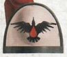
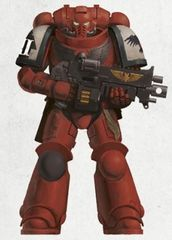
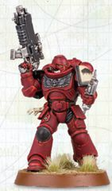
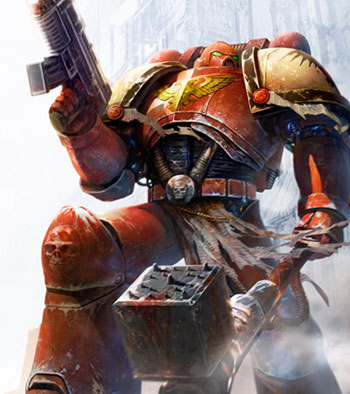
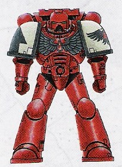

# 0318 血鸦 Blood Ravens

精校状态：中文行文已逐段精校，部分术语仍为暂定

分类：通用概念 / 帝国 Imperium / 中央政务部 Adeptus Terra / 阿斯塔特修会 Adeptus Astartes

原文来源：https://www.bilibili.com/opus/1122081320188510243

原作者：帝国神选罐头

原文时间：编辑于 2025年10月11日 12:46

[返回分类目录](目录.md) · [全书目录](../../目录.md)

<!-- A0318-B0001 -->
**英文原文**

The Blood Ravens are a mysterious Chapter of Space Marines dedicated to the acquisition of knowledge as well as service to the Imperium of Man.

<!-- /A0318-B0001 -->

<!-- A0318-B0002 -->

原译文

血鸦是星际战士的一个神秘战团，致力于获取知识并为人类帝国服务。

**校订译文**

血鸦是星际战士的一个神秘战团，致力于获取知识并为人类帝国服务。

<!-- /A0318-B0002 -->

<!-- A0318-B0003 图片 -->

<!-- A0318-B0004 图片 -->

<!-- A0318-B0005 -->
**英文原文**

Founding Chapter:Unknown

<!-- /A0318-B0005 -->

<!-- A0318-B0006 -->

原译文

建军战团：未知

**校订译文**

建军战团：未知

<!-- /A0318-B0006 -->

<!-- A0318-B0007 -->
**英文原文**

Founding:Pre-early M37

<!-- /A0318-B0007 -->

<!-- A0318-B0008 -->

原译文

建军：M37早期

**校订译文**

建军：第37千年早期以前

<!-- /A0318-B0008 -->

<!-- A0318-B0009 -->
**英文原文**

Chapter Master:Gabriel Angelos

<!-- /A0318-B0009 -->

<!-- A0318-B0010 -->

原译文

战团长：加百列·安杰罗斯

**校订译文**

战团长：加百列·安杰罗斯

<!-- /A0318-B0010 -->

<!-- A0318-B0011 -->
**英文原文**

Homeworld:n/a; Fleet-based Chapter (Formerly Aurelia)

<!-- /A0318-B0011 -->

<!-- A0318-B0012 -->

原译文

家园世界：无，舰基战团（前为奥瑞利亚）

**校订译文**

家园世界：无，舰基战团（前为奥瑞利亚）

<!-- /A0318-B0012 -->

<!-- A0318-B0013 -->
**英文原文**

Fortress-Monastery:Battle Barge Omnis Arcanum

<!-- /A0318-B0013 -->

<!-- A0318-B0014 -->

原译文

堡垒修道院：战斗驳船全知奥秘号

**校订译文**

要塞修道院：战斗驳船全知奥秘号

<!-- /A0318-B0014 -->

<!-- A0318-B0015 -->
**英文原文**

Colours:Dark red/black/parchment white.

<!-- /A0318-B0015 -->

<!-- A0318-B0016 -->

原译文

颜色：暗红/黑色/羊皮纸白

**校订译文**

颜色：暗红/黑色/羊皮纸白

<!-- /A0318-B0016 -->

<!-- A0318-B0017 -->
**英文原文**

Specialty:Large number of Librarians

<!-- /A0318-B0017 -->

<!-- A0318-B0018 -->

原译文

专业：大量智库

**校订译文**

特点：智库员人数众多

<!-- /A0318-B0018 -->

<!-- A0318-B0019 -->
**英文原文**

Strength:Unknown

<!-- /A0318-B0019 -->

<!-- A0318-B0020 -->

原译文

力量：未知

**校订译文**

兵力：未知

<!-- /A0318-B0020 -->

<!-- A0318-B0021 -->
**英文原文**

Battle Cry:"Knowledge is power, guard it well." , "None shall find us wanting." (After Third Aurelian Crusade) , "Victory over death!" (After defeating the Necrons on Kronus)

<!-- /A0318-B0021 -->

<!-- A0318-B0022 -->

原译文

战吼：“知识就是力量，好好保护它。”，“没有人会发现我们的不足。”（第三次奥瑞利安远征后），“战胜死亡！”（在克罗诺斯击败死灵后）

**校订译文**

战吼：“知识即力量，务必守护。”；“绝不负所托。”（第三次奥瑞利安远征后）；“战胜死亡！”（在克罗诺斯击败太空死灵后）

<!-- /A0318-B0022 -->

<!-- A0318-B0023 -->
## Overview 概述

<!-- /A0318-B0023 -->

<!-- A0318-B0024 -->
**英文原文**

The Blood Ravens possess a cadre of powerful Librarians and are noted for their ability to predict enemy movements and fall on them with the precise application of force required. Their origins are unknown and a cause of much speculation to themselves and to others.

<!-- /A0318-B0024 -->

<!-- A0318-B0025 -->

原译文

血鸦拥有一支强大的智库队伍，以其预测敌人动向并精确使用所需武力的能力而闻名。他们的起源是未知的，这引起了他们自己和他人的猜测。

**校订译文**

血鸦拥有一批强大的智库员，擅长预测敌人的动向，并以恰到好处的兵力实施精准打击。他们的起源至今不明，战团内外对此都有诸多猜测。

<!-- /A0318-B0025 -->

<!-- A0318-B0026 图片 -->

<!-- A0318-B0027 -->
**英文原文**

Currently, the Blood Ravens are reckoned to be on the verge of extinction, having lost their Chapter Master and a good part of their Chapter (either literally or to Chaos) in the decade-lasting Aurelian Crusade. However in M42, the Blood Ravens were given the ability to create Primaris Space Marines in order to bolster their dwindling ranks.

<!-- /A0318-B0027 -->

<!-- A0318-B0028 -->

原译文

目前，血鸦被认为濒临灭绝，在持续十年的奥瑞利安远征中失去了他们的战团长和大部分战团（无论是字面上的还是混乱的）。然而，在M42中，血鸦被赋予了原铸星际战士的能力，以加强其不断减少的队伍。

**校订译文**

血鸦在持续十年的奥瑞利安远征中失去了战团长和相当一部分成员；这些人或是战死，或是堕入混沌。因此，战团一度被认为濒临覆灭。不过，在第42千年，血鸦获得了制造原铸星际战士的技术，以补充日益凋零的兵力。

**校注：** 原文概述以濒临覆灭描述战团，后文又叙述重建后的状况，属于不同资料时点；保留并以“一度”交代时序。

<!-- /A0318-B0028 -->

<!-- A0318-B0029 -->
## History 历史

<!-- /A0318-B0029 -->

<!-- A0318-B0030 -->
### Founding 建军

<!-- /A0318-B0030 -->

<!-- A0318-B0031 -->
**英文原文**

The precise Founding in which the Blood Ravens were created is unknown; their own Chapter histories only begin in early M37, though other Imperial records contain some small references to the Chapter proving their existence before then. It is important to note that the Blood Ravens' histories are completely absent before the M37 date; they are not just spotty or fragmentary records. As a result, the Astartes of the Chapter know absolutely nothing about their origins, including having no knowledge of their primogenitor legion or primarch. This absence of information about a Primarch has resulted in the Blood Ravens focusing their spiritual reverence on the Emperor. However, they do have one particular mytho-historical figure of import in the form of Azariah Vidya, known as the Great Father of the Blood Ravens.

<!-- /A0318-B0031 -->

<!-- A0318-B0032 -->

原译文

血鸦的确切建军时间尚不清楚；他们自己的战团历史只开始于M37早期，尽管其他帝国记录中包含了一些对战团的小引用，证明了他们在此之前的存在。值得注意的是，在M37时期之前，血鸦的历史完全缺失；它们不仅仅是零散或零碎的记录。因此，该战团的阿斯塔特对他们的起源一无所知，包括对他们的始祖军团或原体一无所知。由于缺乏关于原体的信息，血鸦将他们的精神敬畏集中在帝皇身上。然而，他们确实有一个特别重要的神话历史人物，阿扎里亚·维迪亚，被称为血鸦之父。

**校订译文**

血鸦究竟诞生于哪一次建军，至今无人知晓。战团自身的历史记录始于第37千年早期，但帝国其他档案中的零星记载证明，他们在此之前就已存在。血鸦在第37千年之前的历史记录是彻底缺失，而非仅有残缺或散佚。因此，战团成员对自身起源一无所知，既不知道始祖军团，也不知道自己的原体。这使血鸦将精神上的崇敬集中于帝皇。不过，他们仍有一位介于神话与历史之间的重要人物：被尊称为“血鸦之父”的阿扎里亚·维迪亚。

<!-- /A0318-B0032 -->

<!-- A0318-B0033 图片 -->

<!-- A0318-B0034 -->

原译文

Blood Raven Astartes 血鸦阿斯塔特

**校订译文**

Blood Raven Astartes 血鸦阿斯塔特

<!-- /A0318-B0034 -->

<!-- A0318-B0035 -->
**英文原文**

Azariah Vidya is reputed to have been a member of the Chapter during its first years. According to the legend (for actual records of this event apparently do not exist), during a disastrous campaign against a Chaotic uprising in the Gothic Sector, their Chapter Master, Master of Sanctity and most of their elite 1st Company were killed in action. The young Chapter, now without much of their senior cadre, turned to Chief Librarian Vidya for leadership. Vidya, already said to be an expert in the ways of the Ruinous Powers, turned to both research and guile to achieve victory; researching and documenting the enemies' movements, tactics and histories for clues, as well as using his Space Marine and Imperial Guard forces to probe enemy lines, strengths and reactions. After some months of such scrying and research, Vidya claimed he had the full knowledge to defeat those arrayed against them, launching a counterattack of surgical Astartes strikes on apparently deserted enemy positions that turned out to be hiding critical Chaos staging bases. The strikes were perfect, sweeping aside those before them, leading to the quick and bloody close of the campaign. In the aftermath, it was discovered that the whole rebellion (and therefore the associated extermination of the Blood Ravens veterans) had been organised by the Alpha Legion.

<!-- /A0318-B0035 -->

<!-- A0318-B0036 -->

原译文

阿扎里亚·维迪亚在战团成立的最初几年被认为是战团的成员。根据传说（关于这一事件的实际记录显然不存在），在一场针对哥特星区混沌叛乱的灾难性战役中，他们的战团长、圣洁导师和大部分精英第一连队在战斗中丧生。年轻的战团现在没有多少高级干部，于是求助于首席智库维迪亚的领导。维迪亚，已经被认为是毁灭力量的专家，为了取得胜利，他转向了研究和狡猾；研究和记录敌人的行动、战术和历史以寻找线索，并利用他的星际战士和帝国卫队部队探测敌人的战线、力量和反应。经过几个月的激烈争论和研究，维迪亚声称他完全有能力击败那些与他们对抗的人，对显然被遗弃的敌人阵地发动了阿斯塔特式的反击，这些阵地实际上隐藏着关键的混沌集结基地。打击是完美的，将面前一扫而空，导致战役迅速而血腥地结束。之后，人们发现整个叛乱（以及与之相关的对血鸦老兵的灭绝）都是由阿尔法军团组织的。

**校订译文**

据说，阿扎里亚·维迪亚在战团成立初期便已是其中一员。传说，在镇压哥特星区一场混沌叛乱的惨烈战役中，血鸦的战团长、圣洁导师以及精锐第一连的大部分成员阵亡；关于此事，似乎并无实际档案留存。这个年轻战团失去了大批高层，只得请首席智库员维迪亚主持大局。维迪亚据说早已深谙混沌诸神的手段，他以研究和谋略寻求胜利：一面记录、分析敌军的行动、战术与历史，从中寻找线索，一面派遣星际战士和帝国卫队试探敌人的防线、兵力与反应。经过数月的占卜与研究，他宣称已掌握击败敌军所需的一切情报，随即命令阿斯塔特对一些看似废弃的敌军阵地实施精确反击。这些地点实际隐藏着混沌的重要集结基地。打击分毫不差，摧枯拉朽，使战役迅速在血腥厮杀中结束。事后人们才发现，整场叛乱，以及随之而来的血鸦老兵大规模覆灭，都是阿尔法军团策划的。

<!-- /A0318-B0036 -->

<!-- A0318-B0037 -->
**英文原文**

Following the success of this campaign Vidya was asked by the 'Secret Masters' of the Chapter to officially become Chapter Master; something he did while retaining his position as Chief Librarian. This resulted in the tradition of the Blood Ravens whereby Librarians are sometimes afforded dual-roles as command officers.

<!-- /A0318-B0037 -->

<!-- A0318-B0038 -->

原译文

在这场战役取得成功后，维迪亚被战团的“秘密大师”要求正式成为战团长；他在担任首席智库期间所做的事情。这导致了血鸦的传统，智库有时被赋予指挥官的双重角色。

**校订译文**

战役获胜后，战团的“秘密大师”请维迪亚正式出任战团长；他接受了这一职务，同时保留首席智库员的身份。血鸦由此形成了一项传统：智库员有时也兼任部队指挥官。

<!-- /A0318-B0038 -->

<!-- A0318-B0039 -->
### The Fated 宿命

<!-- /A0318-B0039 -->

<!-- A0318-B0040 -->
**英文原文**

The Blood Ravens' 5th company is known as the 'Fated', and though the reasons for this are obscure, it may go back to an incident recorded in the annals of the Chapter's Librarium, but never spoken of openly. In M38 the entire 5th company was recorded as having been lost in the Warp, but the truth of the matter may be far darker; it is whispered that one of the company Librarians was seduced by the lure of the ruinous powers, and turned his fellow brethren to Chaos. This notion is by-and-large dismissed by the Chapter today, but for unknown reasons the current members of the Blood Ravens 5th Company wear badges of redemption, penitence and shame upon their armour suits.

<!-- /A0318-B0040 -->

<!-- A0318-B0041 -->

原译文

血鸦的第五连队被称为“宿命”，尽管其原因尚不清楚，但可能可以追溯到该战团智库馆年鉴中记录的一件事，但从未公开提及。在M38，整个第五连队都被记录为在亚空间中迷失了，但事情的真相可能要黑暗得多；有传言说，连队的一名智库被毁灭性力量的诱惑所诱，把他的兄弟们变成了混沌。今天，总的来说，这个概念被战团驳回了，但由于未知的原因，血鸦第五连队的现任成员在他们的盔甲上佩戴着救赎、忏悔和耻辱的徽章。

**校订译文**

血鸦第五连被称为“宿命”。这一称号的来历并不明确，或许与战团档案馆年鉴中记载、却从不公开谈论的一桩往事有关。记录称，第38千年时，整个第五连在亚空间中失踪；但真相可能更为黑暗。有传言说，连队的一名智库员受到混沌诸神的引诱，并将其他战斗兄弟也引向混沌。如今，战团大体上否认这种说法。然而，第五连现役成员仍在护甲上佩戴象征救赎、忏悔与耻辱的徽记，原因不明。

<!-- /A0318-B0041 -->

<!-- A0318-B0042 图片 -->

<!-- A0318-B0043 -->

原译文

Blood Ravens Firstborn 血鸦长子

**校订译文**

Blood Ravens Firstborn 血鸦长子

<!-- /A0318-B0043 -->

<!-- A0318-B0044 -->
### Loss of Aurelia 奥瑞利亚陷落

<!-- /A0318-B0044 -->

<!-- A0318-B0045 -->
**英文原文**

In M40 the Great Unclean One Ulkair was unleashed upon the Blood Ravens homeworld of Aurelia. Despite the best efforts of then-Chapter Master Moriah and Chief Librarian Azariah Kyras - who succeeded in sealing Ulkair - Aurelia was consumed by the Warp.

<!-- /A0318-B0045 -->

<!-- A0318-B0046 -->

原译文

在M40，大不净者乌凯尔被释放到血鸦的家园世界奥瑞利亚。尽管当时的战团长莫里亚和首席智库阿扎里亚·凯拉斯尽了最大努力，成功封死了乌凯尔，但奥瑞利亚还是被亚空间吞噬了。

**校订译文**

第40千年，大不净者乌凯尔被释放到血鸦的家园世界奥瑞利亚。时任战团长莫里亚与首席智库员阿扎里亚·凯拉斯虽竭尽全力，成功封印了乌凯尔，却仍未能阻止奥瑞利亚被亚空间吞噬。

<!-- /A0318-B0046 -->

<!-- A0318-B0047 -->

原译文

41st Millennium 第41个千年

**校订译文**

41st Millennium 第41个千年

<!-- /A0318-B0047 -->

<!-- A0318-B0048 -->
**英文原文**

The Blood Ravens of fact, not of legend, are driven by the need to discover the truth about their origins, as well as the philosophy of the gaining of knowledge. To this end, they have developed friendly interactions with the Adeptus Mechanicus and have often been assigned to Explorator missions to unknown/unexplored areas of the Galaxy as a result. Combined with their own missions to seek out ancient ruins, mythic sites or other sources of information, the Blood Ravens have done much to expand the boundaries of both Imperial knowledge and space.

<!-- /A0318-B0048 -->

<!-- A0318-B0049 -->

原译文

血鸦事实上，不是传说，是出于发现其起源真相的需要，以及获取知识的哲学。为此，他们与机械神教建立了友好的互动关系，因此经常被分配到银河系未知/未探索地区的探索者任务。结合他们自己寻找古代遗迹、神话遗址或其他信息来源的任务，血鸦为扩大帝国知识和空间的边界做了很多工作。

**校订译文**

在有史料可考的历史中，血鸦始终受两种追求驱使：查明自身起源的真相，以及不断获取知识。为此，他们与机械修会建立了友好关系，也因此常被派往银河中未知或尚未探索的区域，参与探索舰队的任务。加上他们自行寻找古代遗迹、传说中的圣地和其他知识来源的行动，血鸦为拓展帝国的知识与疆域作出了许多贡献。

<!-- /A0318-B0049 -->

<!-- A0318-B0050 -->
**英文原文**

They are known to have fought the Orks on numerous occasions and the Xenos species is amongst the Chapter's oldest foes. This has led an abiding enmity to develop between the Blood Ravens and Orks, which continues to this day. The Chapter has also become notable for engaging their heretic brethren, with some of their most recent campaigns featuring heavy interaction against the forces of Chaos. Of particular import are the actions of the 3rd Company under Gabriel Angelos on the world of Tartarus, where the Alpha Legion (as well as various xenos forces) were combated, the multi-company force commanded by Captain Davian Thule who had to deal with Word Bearers interference during a complex mission primarily directed against a Necron threat on the world of Kronus, and perhaps most critically, the failed Kaurava campaign commanded by Captain Indrick Boreale, in which a full 5 Companies of the Blood Ravens were lost.

<!-- /A0318-B0050 -->

<!-- A0318-B0051 -->

原译文

众所周知，他们曾多次与欧克作战，异型物种是该战团最古老的敌人之一。这导致了血鸦和兽人之间持久的敌意，这种敌意一直持续到今天。该战团还因与异端兄弟的接触而闻名，他们最近的一些战役以与混沌势力的激烈互动为特色。特别重要的是加百列·安杰罗斯领导的第三连队在塔尔塔罗斯世界的行动，阿尔法军团（以及各种异型部队）在那里作战，戴维安·图勒连长指挥的多个连队部队在一项主要针对克罗诺斯世界的死灵威胁的复杂任务中不得不应对怀言者的干扰，也许最关键的是，英德里克·波里尔连长指挥的失败的考拉瓦战役，在这场战役中，整整5个血鸦连队都损失了。

**校订译文**

血鸦曾多次与欧克蛮人交战，这一异形种族是战团最古老的宿敌之一，双方的深仇延续至今。血鸦也因对抗堕为异端的昔日兄弟而闻名；他们近期的多场战役都涉及与混沌军队的激战。其中尤为重要的包括：加百列·安杰罗斯率第三连在塔尔塔罗斯对抗阿尔法军团及多支异形势力；戴维安·图勒连长率领多个连队，在克罗诺斯执行主要针对太空死灵威胁的复杂任务时，还须应对怀言者的干扰；以及损失可能最为惨重的考拉瓦战役——英德里克·波里尔连长指挥的远征以失败告终，血鸦整整损失了五个连队。

<!-- /A0318-B0051 -->

<!-- A0318-B0052 -->
**英文原文**

This loss was a serious blow to the Chapter, robbing them of half their manpower in one defeat. This resulted in the Blood Ravens being forced to concentrate on building up their numbers and protecting their Recruiting Worlds for some time, although this period did not pass without serious incident. Multiple xenos threats - including a considerable invasion by a Tyranid splinter fleet and a concurrent Ork Waaagh! - assailed the Chapter, which eventually found itself combating not only the heretics of the Black Legion, but insidious heretical threats from within its own ranks, including betrayal by their Chapter Master Azariah Kyras.

<!-- /A0318-B0052 -->

<!-- A0318-B0053 -->

原译文

这场失利对战团来说是一个沉重的打击，在一次失败中夺走了他们一半的人力。这导致血鸦被迫在一段时间内集中精力增加人数并保护他们的招募世界，尽管这段时间并没有没有发生严重事件。多重异型威胁，包括泰伦分离舰队的大规模入侵和同时发生的欧克Waaagh！-攻击了战团，战团最终发现自己不仅要对抗黑色军团的异端，还要对抗来自其内部的暗中异端威胁，包括战团长阿扎里亚·凯拉斯的背叛。

**校订译文**

一场败仗便夺走了半数兵力，对战团造成沉重打击。此后一段时间，血鸦不得不集中力量补充人员、保卫征兵世界，但严重危机仍接踵而至。多股异形势力袭击了战团，其中包括一支泰伦分支舰队的大规模入侵，以及同时发动的欧克 Waaagh!。最终，血鸦不仅要对抗黑色军团的异端，还必须面对潜伏于自身内部的异端威胁，甚至包括战团长阿扎里亚·凯拉斯的背叛。

<!-- /A0318-B0053 -->

<!-- A0318-B0054 -->
**英文原文**

Years later, an aged Angelos led the Blood Ravens to the world of Acheron, battling old enemies such as Macha and Gorgutz 'Ead 'Unter for the legendary Spear of Khaine. After tracking Gorgutz's forces to The Vault containing the Spear, the Blood Ravens were caught in an Inquisition orbital bombardment that intended to destroy the device but instead opened the vault it was sealed in. However, he survives and leads an attack on the Temple of the Spear of Khaine that overruns both the Eldar and Ork forces. When they come to the Spear they instead find a trap that frees a Bloodthirster and its Daemonic hordes. Desperate, Angelos had the Battle Barge The Dauntless collide with a fissure in Acheron's surface to prevent the Daemonic infestation from spreading. Angelos was able to teleport to safety before the planet was destroyed.

<!-- /A0318-B0054 -->

<!-- A0318-B0055 -->

原译文

几年后，年迈的安杰罗斯带领血鸦队来到冥河世界，与玛查和猎头者戈古兹等宿敌作战，争夺传说中的凯恩之矛。在追踪戈古兹的部队至装有长矛的秘库后，血鸦在审判庭的轨道轰炸中被截住，该轰炸旨在摧毁该装置，但却打开了密封的秘库。然而，他幸存下来，并领导了对凯恩之矛神殿的攻击，这场攻击超过了灵族和欧克部队。当他们来到长矛时，他们反而发现了一个陷阱，可以释放一个嗜血狂魔及其恶魔部落。绝望之下，安杰罗斯让战斗驳船无畏号与冥河表面的裂隙相撞，以防止恶魔的侵扰蔓延。安杰罗斯能够在行星被摧毁之前传送到安全地带。

**校订译文**

多年后，年迈的安杰罗斯率血鸦前往黄泉星，与玛查和“猎头者”戈古兹等宿敌争夺传说中的凯恩之矛。他们追踪戈古兹的部队，来到存放长矛的秘库，却遭到审判庭轨道轰炸的波及。轰炸原本意在摧毁这件武器，结果反而打开了封存它的秘库。安杰罗斯幸存下来，随后率军进攻凯恩之矛神殿，击溃了灵族与欧克部队。然而，他们接近长矛后才发现那是一个陷阱，释放出了一头嗜血狂魔及其恶魔大军。危急之下，安杰罗斯命令战斗驳船无畏号撞入黄泉星地表的一道裂隙，以阻止恶魔侵袭继续蔓延。他在行星毁灭前成功传送至安全地带。

**校注：** Acheron 是此处星球专名，按全书第18篇既有地名统一为黄泉星；原译冥河留在对照，未沿用本轮初拟的阿刻戎。

<!-- /A0318-B0055 -->

<!-- A0318-B0056 -->
**英文原文**

In M41 the Blood Ravens homeworld of Aurelia emerged back into the Materium. This re-emergence was orchestrated by the Black Legion, and it was only by the heroics of the Third and Fifth Companies that their plans to devastate Sub-sector Aurelia were thwarted. What was left of Aurelia remains in realspace to this day and is heavily monitored by both the Blood Ravens and the Inquisition and is garrisoned by regiments of the Imperial Guard.

<!-- /A0318-B0056 -->

<!-- A0318-B0057 -->

原译文

在M41，奥瑞利亚的血鸦家园世界重新回到了物质界。这次重新出现是由黑色军团精心策划的，只有第三和第五连队的英勇事迹才能挫败他们摧毁奥瑞利亚分区的计划。奥瑞利亚的遗迹至今仍在现实空间中，受到血鸦和审判庭的严密监视，并由帝国卫队的部队驻守。

**校订译文**

第41千年，血鸦的家园世界奥瑞利亚重返物质宇宙。这次回归是黑色军团策划的阴谋；第三连与第五连英勇作战，才挫败了他们毁灭奥瑞利亚次星区的计划。奥瑞利亚的残余部分至今仍留在现实空间，受到血鸦和审判庭的严密监控，并有帝国卫队各团驻防。

<!-- /A0318-B0057 -->

<!-- A0318-B0058 -->
### Age of the Dark Imperium 黑暗帝国时代

<!-- /A0318-B0058 -->

<!-- A0318-B0059 -->
**英文原文**

At the end of the 41st Millennium the Blood Ravens still reeling from the Acheron Campaign, the three Aurelian Crusades, and the Kaurava Campaign. Chapter Master Angelos had been planning to begin a rebuilding of the Chapter and decreed that this consolidation was to be conducted alongside large-scale recruitment. Blood Trials to find aspirants were carried out on every world from which the Blood Ravens recruited, and they were held more frequently. Production of arms, ships, and other war materiel increased. Angelos declared that, once enough of the Chapter had been rebuilt, the Blood Ravens would strike out into the galaxy anew.

<!-- /A0318-B0059 -->

<!-- A0318-B0060 -->

原译文

在第41个千年结束时，血鸦仍在遭受冥河战役、三次奥瑞利安远征和考拉瓦战役的打击。战团长安杰罗斯一直计划开始重建战团，并下令在大规模招募的同时进行这一整合。在血鸦的每个招募世界都进行了寻找有志者的鲜血试炼，而且试炼的频率更高。武器、舰船和其他战争物资的生产有所增加。安杰罗斯宣称，一旦战团的重建足够，血鸦将重新进入银河系。

**校订译文**

第41千年末，血鸦仍未从黄泉星战役、三次奥瑞利安远征与考拉瓦战役的创伤中恢复。战团长安杰罗斯开始筹划重建，下令在整顿战团的同时大规模征兵。所有征兵世界都更加频繁地举办鲜血试炼，以选拔候选者；武器、舰船及其他军需物资的产量也随之提高。安杰罗斯宣布，一旦战团恢复到足够的实力，血鸦便将再度出征银河。

<!-- /A0318-B0060 -->

<!-- A0318-B0061 -->
**英文原文**

But this grand rebuilding was not to be. Scant weeks after initiating his plans, madness erupted in the sky as the Great Rift emerged and the Astronomican went out. Contact between the Blood Ravens detachments conducting Blood Trials and the Omnis Arcanum became next to impossible. Ships full of aspirants were lost to the warp. All over Sub-sector Aurelia, outbreaks of mutation and other psychic phenomena were endemic. Some Blood Ravens, psychically sensitive as many are, perished or were driven to madness by the surge in empyric energy. Those Librarians able to make some sense of the distortion reported terrible visions and nightmares, some even of the Great Unclean One Ulkair stirring in his prison in the core of old Aurelia. Entire Astropathic choirs died horrendous deaths as uncontrollable forces built up inside them to the point that their heads exploded under the expanding pressure. Worse still, many worlds under the Blood Ravens protection cried out for aid, with the entire Aurelian Sub-Sector now beset by Daemons. Ever a stubborn warrior of honor, Angelos ordered the Blood Ravens to try and intervene wherever they could and for many years the Chapter bled, isolated from the greater Imperium.

<!-- /A0318-B0061 -->

<!-- A0318-B0062 -->

原译文

但这次大规模的重建并没有实现。在启动他的计划后不到几周，随着大裂隙的出现和星炬的消失，天空中爆发了疯狂。进行鲜血试炼的血鸦分队与全知奥秘号之间的联系几乎是不可能的。满载着有志者的飞船在亚空间中迷失了方向。在整个奥瑞利亚分区，突变和其他灵能现象的爆发是地方性的。一些像许多人一样灵能敏感的血鸦，被至高天的能量的激增所毁灭或推向疯狂。那些能够理解这种扭曲的智库报告了可怕的幻觉和噩梦，有些甚至是大不净者乌凯尔在旧奥瑞利亚星核的监狱里骚动。由于无法控制的力量在他们体内积聚，他们的头部在不断扩大的压力下爆炸，整个星语唱诗班都惨死了。更糟糕的是，在血鸦的保护下，许多世界都在呼喊援助，整个奥瑞利安分区现在都被恶魔包围了。安杰罗斯是一位顽固的荣誉战士，他命令血鸦队尽可能地进行干预，多年来，该战团一直在流血，与更大的帝国隔绝。

**校订译文**

然而，这场宏大的重建未能如愿。计划启动仅数周，大裂隙便撕开天幕，星炬随之熄灭。各地举办鲜血试炼的血鸦分队几乎无法再与全知奥秘号取得联系，满载候选者的舰船迷失于亚空间。奥瑞利亚次星区各地普遍爆发变异和其他灵能异象。许多血鸦成员对灵能格外敏感，一些人被骤增的至高天能量杀死，或被逼至疯狂。少数尚能解读这场扭曲的智库员报告了可怕的幻象与噩梦，有人甚至看见大不净者乌凯尔在旧奥瑞利亚星核的牢狱中蠢蠢欲动。失控的力量在星语者体内不断积聚，直至压力令头颅爆裂，整支星语唱诗班就这样惨死。更糟的是，血鸦庇护的许多世界纷纷求援，整个奥瑞利亚次星区都遭到了恶魔侵袭。安杰罗斯仍坚守着战士的荣誉，下令血鸦尽一切可能驰援各地。此后多年，战团与帝国其余地区隔绝，不断为这些战事流血。

<!-- /A0318-B0062 -->

<!-- A0318-B0063 -->
**英文原文**

Imperial contact was eventually reestablished by the Adeptus Custodes Shield Captain Pertinax, whose Cruiser tracked down the Blood Ravens flotilla under 7th Company Captain Atanaxis and welcomed them back into the Imperium at the behalf of Roboute Guilliman, who the Blood Ravens didn't even know had since been resurrected. The Custodes brought with them teams of Tech-Priests, Thralls, and Servitors as well as the new gene-seed needed to begin Primaris Space Marine production within the Blood Ravens. Atanaxis hoped to gleam some information on his Chapter's true origin from the Primaris technology and gene-seed, but stated that Gabriel Angelos was not to be informed of all this until they had something to report.

<!-- /A0318-B0063 -->

<!-- A0318-B0064 -->

原译文

帝国的联系最终由禁军盾卫连长佩蒂纳克斯重新建立，他的巡洋舰在第七连队连长阿塔纳西斯的带领下追踪了血鸦舰队，并代表罗伯特·基里曼欢迎他们回到帝国，血鸦甚至不知道他已经复活了。禁军带来了由技术神甫、奴隶和机仆组成的团队，以及在血鸦中开始原铸星际战士生产所需的新基因种子。阿塔纳西斯希望从原铸技术和基因种子中透露一些关于其战团真实起源的信息，但表示在他们有事情要报告之前，不会通知加百列·安杰罗斯这一切。

**校订译文**

帝皇禁军盾卫连长佩蒂纳克斯最终帮助血鸦恢复了与帝国的联系。他乘坐的巡洋舰找到了第七连连长阿塔纳西斯率领的血鸦小型舰队，并代表罗保特·基里曼欢迎他们重归帝国；血鸦此时甚至还不知道基里曼已经复活。禁军带来了由技术祭司、奴工与机仆组成的团队，以及在血鸦战团内部制造原铸星际战士所需的新基因种子。阿塔纳西斯希望借助这些技术与基因种子，探知战团真正起源的线索，但要求在取得可汇报的成果之前，暂不将此事告知加百列·安杰罗斯。

**校注：** 原译误将阿塔纳西斯写成禁军巡洋舰的指挥者；英文 whose Cruiser tracked down the Blood Ravens flotilla under ... 指佩蒂纳克斯的舰船找到阿塔纳西斯率领的血鸦舰队。

<!-- /A0318-B0064 -->

<!-- A0318-B0065 -->
**英文原文**

Many years later, the Blood Ravens were part of Guilliman's Indomitus Crusade and had hundreds of Primaris Marines waging in the titanic campaign. Using their talents for research, the Blood Ravens Apothecaries and Librarians applied every kind of scrutiny known to them to the gene-seed and Primaris technology provided for them. What they might have discovered is naught but suspicion and conjecture to any outside the Chapter who know of the Blood Ravens’ deep desire to seek out knowledge of their origins, and the Secret Masters in particular have made a point of ensuring that the knowledge they have gleaned remains secret.

<!-- /A0318-B0065 -->

<!-- A0318-B0066 -->

原译文

许多年后，血鸦是基里曼的不屈远征的一部分，有数百名原铸星际战士在这场巨大的战役中作战。血鸦药剂师和智库利用他们的研究才能，对为他们提供的基因种子和原铸技术进行了各种审查。他们可能发现的只是怀疑和猜测，对于任何知道血鸦渴望了解其起源的人来说，尤其是秘密大师们，他们特别注意确保他们收集到的知识是秘密的。

**校订译文**

多年后，血鸦参加了基里曼的不屈远征，数百名原铸星际战士投入这场规模空前的战争。血鸦的药剂师和智库员发挥研究专长，以他们掌握的种种手段检验获赠的基因种子与原铸技术。战团外部的人即便知道血鸦迫切希望查明自身起源，也只能猜测他们究竟发现了什么。秘密大师尤其注重保密，确保研究所得始终不为外人所知。

**校注：** 原文将外界的猜测与秘密大师掌握却保密的研究结果区分；原译混淆了信息知情范围。

<!-- /A0318-B0066 -->

<!-- A0318-B0067 -->
**英文原文**

The Blood Ravens have also sought to purge the fallen Bastion Theta of its Ork infestation and recover its endangered relics.

<!-- /A0318-B0067 -->

<!-- A0318-B0068 -->

原译文

血鸦还试图清除陷落的西塔堡垒的兽人侵扰，并恢复其濒临灭绝的遗迹。

**校订译文**

血鸦还曾试图清剿盘踞在失陷的西塔堡垒中的欧克蛮人，并抢救其中濒临损毁的圣物。

<!-- /A0318-B0068 -->

<!-- A0318-B0069 -->
## Organisation 组织

<!-- /A0318-B0069 -->

<!-- A0318-B0070 -->
**英文原文**

Notionally a Codex Chapter, the Blood Ravens' most obvious deviation from strict Codex adherence is the high number of Librarians in their ranks, as well as the practice of affording Librarians dual-roles as unit commanders (for example, as Company Captains or even Chapter Master as well as their Librarius rank). The actual commanders of the Blood Ravens are known as the Secret Masters, and as befits such a title, little is known of who these marines are or what positions they officially hold within the command tree. Many of these Masters are psykers who specialise in studying the ways of Chaos, so that the Blood Ravens may better fight against the heretics, and who are believed to sometimes form up battle-squads of the Chapter's Librarians to lead into battle.

<!-- /A0318-B0070 -->

<!-- A0318-B0071 -->

原译文

从概念上讲，血鸦是一个圣典战团，他们与严格遵守圣典的最明显偏差是他们队伍中有大量的智库，以及为智库提供单位指挥官双重角色的做法（例如，作为连长甚至是战团长以及他们的智库级别）。血鸦的实际指挥官被称为秘密大师，作为这样一个头衔，人们对这些战士是谁或他们在指挥树中的正式职位知之甚少。这些大师中有许多是专门研究混沌方法的灵能者，这样血鸦就可以更好地对抗异端，据信他们有时会组成战团智库的战斗小队来领导战斗。

**校订译文**

血鸦名义上是遵循《阿斯塔特圣典》的战团，其最明显的例外是智库员数量众多，而且这些人可以在保留智库部门职级的同时兼任部队指挥官，例如连长，甚至战团长。血鸦的实际领导者被称为“秘密大师”；正如这一称号所示，外界几乎不知道他们是谁，也不清楚他们在指挥体系中正式担任何职。许多秘密大师是专门研究混沌之道的灵能者，目的是让血鸦更有效地对抗异端。据说，他们有时还会将战团的智库员编成战斗小队，亲自率领其参战。

<!-- /A0318-B0071 -->

<!-- A0318-B0072 -->
**英文原文**

The dangers of large numbers of psychically active members studying the ways of heresy are not unknown to the Chapter, and so the Blood Ravens attempt to self-monitor themselves strenuously against taint. Those souls who fall (for some inevitably do, either in the initiation process itself or after a lifetime of service) are kept for a time in the Librarium Sanatorium, before being ritually executed by the Master of Sanctity. Initiates who fail the initiation rites in other ways and that are driven insane and/or mutated by exposure to the warp are led away in pentagrammically warded chains to a chamber simply known as The Tower where they are kept to be studied by the Chapter so as to ascertain what went wrong and how the knowledge of their failure can be put to better use. There exists a rumour of daemons being summoned and placed within these failed initiates, before being banished, a rumour that, should it be discovered to be true, would surely spell the end of the Blood Ravens as an Imperial body.

<!-- /A0318-B0072 -->

<!-- A0318-B0073 -->

原译文

本战团并不陌生大量灵能活跃成员研究异端方式的危险，因此血鸦试图自我监控，以防止受到污染。那些堕落的灵魂（因为有些人不可避免地会堕落，无论是在启蒙过程中还是在一生的服役之后）都会被关在智库馆疗养院一段时间，然后由圣洁导师仪式性地处决。以其他方式未能通过入会仪式的信徒，以及因暴露于亚空间而变得疯狂和/或变异的信徒被带到一个名为“塔”的房间，在那里他们被战团研究，以确定出了什么问题，以及如何更好地利用对他们失败的了解。有传言称，在被放逐之前，恶魔被召唤并安置在这些失败的信徒中，如果这一传言被发现是真的，那么血鸦作为帝国之体的终结肯定会到来。

**校订译文**

战团深知，让大量灵能者研究异端之道存在危险，因此血鸦以严格的自我监督防范腐化。无论是在入团过程中，还是经历一生的服役后，总有人难免堕落。这些人会先被关押在智库疗养所一段时间，再由圣洁导师依仪式处决。另一些新兵未能通过入团仪式，并因接触亚空间而发疯、变异，或两者兼有；他们会被刻有五芒防护符的锁链束缚，带往一间仅称为“高塔”的密室。战团将他们留在那里研究，以查明出了什么差错，以及如何更好地利用这些失败所提供的知识。另有传言称，血鸦会召唤恶魔，让其附身于这些失败的新兵，然后再将恶魔放逐。这一传言若被证实，血鸦作为帝国所属战团的历史势必就此终结。

**校注：** 补回原译遗漏的 pentagrammically warded chains（刻有五芒防护符的锁链）；传闻中的召唤、附身和放逐顺序按英文保留。

<!-- /A0318-B0073 -->

<!-- A0318-B0074 -->
**英文原文**

The use of Librarians in the Chapter goes beyond simple battlefield deployment. As seekers and users of knowledge, the Blood Ravens prefer to approach each campaign and mission slowly and methodically, with an emphasis put on a careful planning stage. The Chapter will use its Librarians to the fullest in predicting enemy movements and likely behaviour. Once all possible occurrences have been discerned, the Blood Ravens will strike swiftly and with full force, never varying from the original plan. They are also able to strike before any obvious enemy movements have been made, ending campaigns before they have truly begun. These habits draw criticism from others in the Imperium however, who view their slowness to act as cowardice and their ability to predict enemy action as verging on the sorcerous.

<!-- /A0318-B0074 -->

<!-- A0318-B0075 -->

原译文

本战团中智库的使用超出了简单的战场部署。作为知识的寻求者和使用者，血鸦更喜欢缓慢而有条不紊地完成每一场战役和任务，重点是精心规划阶段。该战团将充分利用其智库来预测敌人的行动和可能的行为。一旦所有可能的事件都被发现，血鸦将迅速全力出击，永远不会偏离最初的计划。他们还能够在任何明显的敌人行动之前发动攻击，在真正开始之前结束战役。然而，这些习惯招致了帝国中其他人的批评，他们认为自己行动迟缓是懦弱，预测敌人行动的能力近乎巫术。

**校订译文**

智库员在血鸦战团中的作用不限于直接参战。作为知识的寻求者和运用者，血鸦总是从容而有条理地筹备每一场战役、每一项任务，尤其重视周密的计划。他们充分利用智库员的能力，预测敌军的动向及可能采取的行动。一旦辨明所有可能的情况，血鸦便迅速全力出击，严格执行原定计划。他们甚至能在敌军显露明显行动前先发制人，让战役尚未真正开始就已结束。不过，帝国内部也有人因此批评血鸦，认为他们迟迟不行动是怯懦，而预知敌军行动的本领则近乎巫术。

<!-- /A0318-B0075 -->

<!-- A0318-B0076 -->
**英文原文**

Further criticism has been made by the Inquisition, who has issues with the Blood Ravens' practice of acquiring chaotic weapons and artefacts for both study and simply to deny them to the enemy. While the Blood Ravens claim to destroy these recoveries, there is little evidence for this, and it is believed the Blood Ravens have amassed quite the collection of interesting devices.

<!-- /A0318-B0076 -->

<!-- A0318-B0077 -->

原译文

审判庭提出了进一步的批评，他们对血鸦获取混沌武器和圣物的做法提出了质疑，这些武器和圣物既是为了研究，也是为了拒绝敌人使用。虽然血鸦声称摧毁了这些回收物，但几乎没有证据表明这一点，据信血鸦已经收集了大量有趣的设备。

**校订译文**

审判庭也提出了批评，质疑血鸦收集混沌武器与器物的做法。血鸦收集这些物品，既是为了研究，也是不让敌人继续使用。虽然他们声称事后会将缴获之物销毁，但能证明这一点的证据寥寥；外界认为，他们实际上已经积累了颇为丰富的奇异器物收藏。

<!-- /A0318-B0077 -->

<!-- A0318-B0078 -->
### Geneseed Origin 基因种子起源

<!-- /A0318-B0078 -->

<!-- A0318-B0079 -->
**英文原文**

There is much speculation around the exact origin of the Blood Ravens, most specifically about which of the First Founding Legions they are derived from. Several possibilities have been presented by various interested parties, which can be found below.

<!-- /A0318-B0079 -->

<!-- A0318-B0080 -->

原译文

关于血鸦的确切起源有很多猜测，最具体的是它们来自哪个初次建军军团。各利益相关方提出了几种可能性，见下文。

**校订译文**

关于血鸦的确切起源，尤其是他们源自哪个初次建军军团，存在诸多猜测。对此感兴趣的各方提出了以下几种可能：

<!-- /A0318-B0080 -->

<!-- A0318-B0081 -->
**英文原文**

Blood Angels: Argument principally based around the Chapter's name and heraldry.

<!-- /A0318-B0081 -->

<!-- A0318-B0082 -->

原译文

圣血天使：主要围绕战团名称和纹章展开的争论。

**校订译文**

圣血天使：主要依据是战团名称和纹章的相似之处。

<!-- /A0318-B0082 -->

<!-- A0318-B0083 -->
**英文原文**

Raven Guard: Argument principally based around the Chapter's name and heraldry.

<!-- /A0318-B0083 -->

<!-- A0318-B0084 -->

原译文

暗鸦守卫：主要围绕该战团的名称和纹章进行论证。

**校订译文**

暗鸦守卫：主要依据是战团名称和纹章的相似之处。

<!-- /A0318-B0084 -->

<!-- A0318-B0085 -->
**英文原文**

Dark Angels: General rumour.

<!-- /A0318-B0085 -->

<!-- A0318-B0086 -->

原译文

黑暗天使：谣言四起。

**校订译文**

黑暗天使：只有笼统的传闻。

<!-- /A0318-B0086 -->

<!-- A0318-B0087 -->
## Culture 文化

<!-- /A0318-B0087 -->

<!-- A0318-B0088 -->
**英文原文**

The Blood Ravens are noted as a very scholarly chapter. They also maintain some of the most extensive libraries in the Imperium.

<!-- /A0318-B0088 -->

<!-- A0318-B0089 -->

原译文

血鸦被认为是一个非常学术的战团。他们还维护着帝国中一些最广大的图书馆。

**校订译文**

血鸦以重视学问著称。他们还拥有帝国中一些藏书最为丰富的图书馆。

<!-- /A0318-B0089 -->

<!-- A0318-B0090 -->
## Homeworld 家园世界

<!-- /A0318-B0090 -->

<!-- A0318-B0091 -->
**英文原文**

The Blood Ravens once called Aurelia of the Aurelia Subsector in the Korianis Sector, their home, and their fortress monastery of Selenon was their permanent base of operations. A hive world that served as the sub-sector’s capital, Aurelia was advanced and prosperous. In later years of M40, however, it was engulfed by a warp storm that was summoned by the Great Unclean One Ulkair. Despite the best efforts of Chapter Master Moriah and Chief Librarian Azariah Kyras, who succeeded in sealing Ulkair, Aurelia was totally consumed by the Warp. Thereafter, the Chapter became fleet based.

<!-- /A0318-B0091 -->

<!-- A0318-B0092 -->

原译文

血鸦曾在科里安尼斯星区称为奥瑞利亚分区的奥瑞利亚，他们的家，他们的赛琳娜要塞修道院是他们的永久行动基地。奥瑞利亚是一个巢都世界，是该分区的首都，它很先进，也很繁荣。然而，在M40的后期，它被大不净者乌凯尔召唤的亚空间风暴吞没了。尽管战团长莫里亚和首席智库阿扎里亚·凯拉斯尽了最大努力，成功封死了乌凯尔，但奥瑞利亚还是被亚空间完全吞噬了。此后，该战团成为舰基。

**校订译文**

血鸦的家园曾是科里安尼斯星区、奥瑞利亚次星区的奥瑞利亚，他们以塞勒农要塞修道院为常设行动基地。奥瑞利亚是一座先进而繁荣的巢都世界，也是次星区首府。然而，第40千年晚期，大不净者乌凯尔召来的亚空间风暴吞没了这颗星球。战团长莫里亚与首席智库员阿扎里亚·凯拉斯虽然竭尽全力，成功封印了乌凯尔，却仍未能阻止奥瑞利亚彻底沦入亚空间。此后，血鸦成为以舰队为基地的战团。

<!-- /A0318-B0092 -->

<!-- A0318-B0093 -->
## Chapter Elements 战团单位

原题：Chapter Elements 战团成员

<!-- /A0318-B0093 -->

<!-- A0318-B0094 -->
### Notable Relics 著名圣物

<!-- /A0318-B0094 -->

<!-- A0318-B0095 -->

原译文

Alexian's Blade 阿列克谢之刃

**校订译文**

Alexian's Blade 阿列克谢之刃

<!-- /A0318-B0095 -->

<!-- A0318-B0096 -->

原译文

Azariah's Cincture 阿扎里亚束带

**校订译文**

Azariah's Cincture 阿扎里亚束带

<!-- /A0318-B0096 -->

<!-- A0318-B0097 -->

原译文

God-Splitter 裂神者

**校订译文**

God-Splitter 裂神者

<!-- /A0318-B0097 -->

<!-- A0318-B0098 -->

原译文

Rogal's Fist 罗格之拳

**校订译文**

Rogal's Fist 罗格之拳

<!-- /A0318-B0098 -->

<!-- A0318-B0099 -->
### Vessels 舰船

原题：Vessels 载具

<!-- /A0318-B0099 -->

<!-- A0318-B0100 -->
**英文原文**

Unusually, every Blood Ravens vessel is equipped with its own Librarium and a full complement of curatorial staff who record every event that happens on the ship, as well as storing the mission testimonies of the Chapter Librarians who travel aboard. These records are eventually copied to the Librarium Sanctorum, in an attempt to ensure the Blood Ravens have an uninterrupted record of their own history.

<!-- /A0318-B0100 -->

<!-- A0318-B0101 -->

原译文

不同寻常的是，每艘血鸦战舰都配备了自己的智库馆和全套的管理人员，他们记录船上发生的每一件事，并存储船上战团智库的任务证词。这些记录最终被复制到智库圣所，以确保血鸦对自己的历史有不间断的记录。

**校订译文**

与众不同的是，血鸦每艘舰船都设有自己的藏书库，并配备完整的档案管理人员。他们记录舰上发生的一切，也保存随舰出行的战团智库员所提交的任务报告。这些记录最终会被抄存至藏书圣所，以尽可能保证战团的历史记录不再中断。

<!-- /A0318-B0101 -->

<!-- A0318-B0102 -->
**英文原文**

Dauntless — Battle Barge, destroyed during the Acheron campaign.

<!-- /A0318-B0102 -->

<!-- A0318-B0103 -->

原译文

无畏 — 战斗驳船，在冥河战役中被摧毁。

**校订译文**

无畏号——战斗驳船，在黄泉星战役中被摧毁。

<!-- /A0318-B0103 -->

<!-- A0318-B0104 -->
**英文原文**

Omnis Arcanum — Battle Barge, Chapter Monastery and site of the Librarium Sanctorum.

<!-- /A0318-B0104 -->

<!-- A0318-B0105 -->

原译文

全知奥秘 — 战斗驳船、战团修道院和智库圣所所在地。

**校订译文**

全知奥秘号——战斗驳船，兼作战团修道院，也是藏书圣所所在地。

<!-- /A0318-B0105 -->

<!-- A0318-B0106 -->
**英文原文**

Litany of Fury — Battle Barge assigned to the 3rd Company.

<!-- /A0318-B0106 -->

<!-- A0318-B0107 -->

原译文

愤怒之光 — 分配给第三连队的战斗驳船。

**校订译文**

狂怒祷文号——配属第三连的战斗驳船。

<!-- /A0318-B0107 -->

<!-- A0318-B0108 -->
**英文原文**

The Observer — Battle Barge.

<!-- /A0318-B0108 -->

<!-- A0318-B0109 -->

原译文

观察者 — 战斗驳船。

**校订译文**

观察者号——战斗驳船。

**校注：** 英文先将 The Observer 列为战斗驳船，后又列为 Escort；是否同名舰或资料错误无法由本稿判断，两项均保留。

<!-- /A0318-B0109 -->

<!-- A0318-B0110 -->
**英文原文**

Scientia Est Potentia — Battle Barge.

<!-- /A0318-B0110 -->

<!-- A0318-B0111 -->

原译文

知识即是力量 - 战斗驳船。

**校订译文**

知识即力量号——战斗驳船。

<!-- /A0318-B0111 -->

<!-- A0318-B0112 -->
**英文原文**

Armageddon — Strike Cruiser.

<!-- /A0318-B0112 -->

<!-- A0318-B0113 -->

原译文

世界末日 — 打击巡洋舰

**校订译文**

阿玛吉多顿号——打击巡洋舰。

<!-- /A0318-B0113 -->

<!-- A0318-B0114 -->
**英文原文**

Rage of Erudition — Strike Cruiser.

<!-- /A0318-B0114 -->

<!-- A0318-B0115 -->

原译文

博学之怒 — 打击巡洋舰。

**校订译文**

博学之怒号——打击巡洋舰。

<!-- /A0318-B0115 -->

<!-- A0318-B0116 -->
**英文原文**

Ravenous Spirit — Strike Cruiser.

<!-- /A0318-B0116 -->

<!-- A0318-B0117 -->

原译文

狂暴之魂 — 打击巡洋舰。

**校订译文**

饕餮之魂号——打击巡洋舰。

<!-- /A0318-B0117 -->

<!-- A0318-B0118 -->
**英文原文**

Retribution — Strike Cruiser.

<!-- /A0318-B0118 -->

<!-- A0318-B0119 -->

原译文

报复 — 打击巡洋舰。

**校订译文**

报复号——打击巡洋舰。

<!-- /A0318-B0119 -->

<!-- A0318-B0120 -->
**英文原文**

Glory of Calderis - Cruiser.

<!-- /A0318-B0120 -->

<!-- A0318-B0121 -->

原译文

卡德利之荣耀号 - 巡洋舰

**校订译文**

卡德利斯之荣耀号——巡洋舰。

<!-- /A0318-B0121 -->

<!-- A0318-B0122 -->
**英文原文**

Raven's Spear - Sword Frigate.

<!-- /A0318-B0122 -->

<!-- A0318-B0123 -->

原译文

渡鸦之矛 - 剑级护卫舰

**校订译文**

渡鸦之矛号——剑级护卫舰。

<!-- /A0318-B0123 -->

<!-- A0318-B0124 -->
**英文原文**

The Observer - Escort.

<!-- /A0318-B0124 -->

<!-- A0318-B0125 -->

原译文

观察者 - 护卫舰

**校订译文**

观察者号——护航舰。

<!-- /A0318-B0125 -->

<!-- A0318-B0126 -->
### Notable Members of the Blood Ravens 血鸦著名成员

<!-- /A0318-B0126 -->

<!-- A0318-B0127 -->
**英文原文**

Azariah Vidya — Great Father of the Chapter.

<!-- /A0318-B0127 -->

<!-- A0318-B0128 -->

原译文

阿扎里亚·维迪亚 — 战团的伟大之父。

**校订译文**

阿扎里亚·维迪亚——被尊称为“血鸦之父”。

<!-- /A0318-B0128 -->

<!-- A0318-B0129 -->
**英文原文**

Gabriel Angelos — Captain of the 3rd Company, Chapter Master (Possibly; see Notes)

<!-- /A0318-B0129 -->

<!-- A0318-B0130 -->

原译文

加百列·安杰罗斯 — 第三连队连长，战团长（可能）

**校订译文**

加百列·安杰罗斯——第三连连长，可能担任战团长（参见下文注释）。

<!-- /A0318-B0130 -->

<!-- A0318-B0131 -->
**英文原文**

Apollo Diomedes — Former Captain of the Honour Guard, now a Chaplain

<!-- /A0318-B0131 -->

<!-- A0318-B0132 -->

原译文

阿波罗·迪奥梅德斯 — 前荣誉卫队连长，现任牧师

**校订译文**

阿波罗·迪奥梅德斯——前荣誉卫队队长，现任教士。

<!-- /A0318-B0132 -->

<!-- A0318-B0133 -->
**英文原文**

Jonah Orion- Chief Librarian

<!-- /A0318-B0133 -->

<!-- A0318-B0134 -->

原译文

约拿·俄里翁 - 首席智库

**校订译文**

约拿·俄里翁——首席智库员。

<!-- /A0318-B0134 -->

<!-- A0318-B0135 -->
**英文原文**

Atanaxis - Captain

<!-- /A0318-B0135 -->

<!-- A0318-B0136 -->

原译文

阿塔纳西斯 - 连长

**校订译文**

阿塔纳西斯 - 连长

<!-- /A0318-B0136 -->

<!-- A0318-B0137 -->
**英文原文**

Indrick Boreale — Brother-Captain (Dec.)

<!-- /A0318-B0137 -->

<!-- A0318-B0138 -->

原译文

英德里克·波里尔 — 兄弟连长

**校订译文**

英德里克·波里尔——战斗兄弟会连长，已故。

<!-- /A0318-B0138 -->

<!-- A0318-B0139 -->
**英文原文**

Rhamah — Librarian of the 9th Company.

<!-- /A0318-B0139 -->

<!-- A0318-B0140 -->

原译文

拉玛 — 第九连队智库。

**校订译文**

拉玛——第九连智库员。

<!-- /A0318-B0140 -->

<!-- A0318-B0141 -->
**英文原文**

Mikelus — Reclusiarch.

<!-- /A0318-B0141 -->

<!-- A0318-B0142 -->

原译文

米凯卢斯 — 隐修长

**校订译文**

米凯卢斯 — 隐修长

<!-- /A0318-B0142 -->

<!-- A0318-B0143 -->
**英文原文**

Gordian — Apothecary.

<!-- /A0318-B0143 -->

<!-- A0318-B0144 -->

原译文

戈迪安 — 药剂师。

**校订译文**

戈迪安 — 药剂师。

<!-- /A0318-B0144 -->

<!-- A0318-B0145 -->
**英文原文**

Galan — Apothecary.

<!-- /A0318-B0145 -->

<!-- A0318-B0146 -->

原译文

加兰 — 药剂师。

**校订译文**

加兰 — 药剂师。

<!-- /A0318-B0146 -->

<!-- A0318-B0147 -->
**英文原文**

Valestis - Epistolary

<!-- /A0318-B0147 -->

<!-- A0318-B0148 -->

原译文

瓦莱斯蒂斯 - 星语官

**校订译文**

瓦莱斯蒂斯 - 星语官

<!-- /A0318-B0148 -->

<!-- A0318-B0149 -->
**英文原文**

Martellus — Techmarine.

<!-- /A0318-B0149 -->

<!-- A0318-B0150 -->

原译文

马特勒斯 — 技术军士

**校订译文**

马特勒斯——科技战士。

<!-- /A0318-B0150 -->

<!-- A0318-B0151 -->
**英文原文**

Aramus — The youngest Force Commander in the chapter's history. He eventually rises to lead is company, depending on playthrough, as Captain and replacing Davian Thule.

<!-- /A0318-B0151 -->

<!-- A0318-B0152 -->

原译文

阿拉莫斯 — 战团历史上最年轻的部队指挥官。他最终升任连长，取代戴维安·图勒，领导连队，这取决于游戏过程。

**校订译文**

阿拉莫斯——战团历史上最年轻的部队指挥官。根据玩家选择的游戏路线，他最终可能接替戴维安·图勒，晋升连长并指挥该连。

<!-- /A0318-B0152 -->

<!-- A0318-B0153 -->
**英文原文**

Tarkus — Sergeant of the 5th Company, 1st squad.

<!-- /A0318-B0153 -->

<!-- A0318-B0154 -->

原译文

塔库斯 — 第五连队军士，第一小队。

**校订译文**

塔库斯——第五连第一小队军士。

<!-- /A0318-B0154 -->

<!-- A0318-B0155 -->
**英文原文**

Thaddeus — Sergeant of the 5th Company, 7th squad.

<!-- /A0318-B0155 -->

<!-- A0318-B0156 -->

原译文

撒迪厄斯 — 第五连队军士，第七小队。

**校订译文**

撒迪厄斯——第五连第七小队军士。

<!-- /A0318-B0156 -->

<!-- A0318-B0157 -->
**英文原文**

Avitus — Sergeant of the 5th company, 9th squad.

<!-- /A0318-B0157 -->

<!-- A0318-B0158 -->

原译文

阿维图斯 — 第五连队军士，第九小队。

**校订译文**

阿维图斯——第五连第九小队军士。

<!-- /A0318-B0158 -->

<!-- A0318-B0159 -->
**英文原文**

Cyrus — Scout Sergeant.

<!-- /A0318-B0159 -->

<!-- A0318-B0160 -->

原译文

塞勒斯 — 侦察军士

**校订译文**

塞勒斯 — 侦察军士

<!-- /A0318-B0160 -->

<!-- A0318-B0161 -->
**英文原文**

Davian Thule — Dreadnought, former Captain of the 4th Company

<!-- /A0318-B0161 -->

<!-- A0318-B0162 -->

原译文

戴维安·图勒 — 无畏，前第四连队连长

**校订译文**

戴维安·图勒 — 无畏，前第四连队连长

<!-- /A0318-B0162 -->

<!-- A0318-B0163 -->
**英文原文**

Yriel Rikarius - Former 2nd Company Captain

<!-- /A0318-B0163 -->

<!-- A0318-B0164 -->

原译文

伊里尔·里卡里乌斯 — 前第二连队连长

**校订译文**

伊里尔·里卡里乌斯 — 前第二连队连长

<!-- /A0318-B0164 -->

<!-- A0318-B0165 -->
### Renegade Members 变节成员

<!-- /A0318-B0165 -->

<!-- A0318-B0166 -->
**英文原文**

Azariah Kyras — Renegade, formerly Chapter Master and Chief Librarian both, Daemon Prince of the Maledictum.

<!-- /A0318-B0166 -->

<!-- A0318-B0167 -->

原译文

阿扎里亚·凯拉斯 — 叛徒，前战团长和首席智库，诅咒之印的恶魔王子。

**校订译文**

阿扎里亚·凯拉斯——叛徒，曾兼任战团长与首席智库员，诅咒之印的恶魔亲王。

**校注：** 原文将凯拉斯称为 Daemon Prince of the Maledictum；此表述与正文叙述的具体关联没有展开，不据外部记忆擅改。

<!-- /A0318-B0167 -->

<!-- A0318-B0168 -->
**英文原文**

Isador Akios — Librarian.

<!-- /A0318-B0168 -->

<!-- A0318-B0169 -->

原译文

伊萨多·阿基奥斯 — 智库

**校订译文**

伊萨多·阿基奥斯——智库员。

<!-- /A0318-B0169 -->

<!-- A0318-B0170 -->
**英文原文**

Nox — Librarian.

<!-- /A0318-B0170 -->

<!-- A0318-B0171 -->

原译文

诺克斯 — 智库

**校订译文**

诺克斯——智库员。

<!-- /A0318-B0171 -->

<!-- A0318-B0172 -->
**英文原文**

Seraphis — Librarian; banished from the Chapter for unknown crimes (hinted that it was because he was looking too much into Chaotic knowledge). Was killed on Medrengard by the Iron Warriors.

<!-- /A0318-B0172 -->

<!-- A0318-B0173 -->

原译文

塞拉菲斯 — 智库；因未知罪行被逐出战团（暗示这是因为他过于关注混沌知识）。在梅德伦加德被钢铁勇士杀死。

**校订译文**

塞拉菲斯——智库员，因不明罪行被逐出战团；原文暗示，这与他过度钻研混沌知识有关。他在梅德伦加德被钢铁勇士杀死。

<!-- /A0318-B0173 -->

<!-- A0318-B0174 -->
## Trivia 琐事

<!-- /A0318-B0174 -->

<!-- A0318-B0175 -->
### Notes 注释

<!-- /A0318-B0175 -->

<!-- A0318-B0176 -->
### Gabriel Angelos 加百列·安杰罗斯

<!-- /A0318-B0176 -->

<!-- A0318-B0177 -->
**英文原文**

The current Chapter Master of the Blood Ravens (and their general status) varies somewhat on which ending of Dawn of War II: Retribution is considered "true" (at this time there is no clearly official reckoning as to the 'true' conclusion of events). For example, Gabriel Angelos is either Chapter Master or deceased.

<!-- /A0318-B0177 -->

<!-- A0318-B0178 -->

原译文

目前血鸦的战团长（及其一般地位）在《战争黎明2：报应》的结局被认为是“真实的”（目前还没有明确的官方统计事件的“真实”结论）上有所不同。例如，加百列·安杰洛斯要么是战团长，要么已经牺牲。

**校订译文**

血鸦由谁担任战团长，以及战团的整体状况，会因采用《战争黎明 II：报应》的哪条结局而有所不同。本段所述资料阶段尚未明确官方认定的结局；例如，加百列·安杰罗斯在不同结局中或成为战团长，或已阵亡。

**校注：** 本段保留早期资料对《报应》多结局的讨论；紧接的后文已依据《战争黎明 III》解释战团长身份，不把历史上的不确定性误当作整篇现状。

<!-- /A0318-B0178 -->

<!-- A0318-B0179 图片 -->

<!-- A0318-B0180 -->

原译文

Gabriel Angelos 加百列·安杰罗斯

**校订译文**

Gabriel Angelos 加百列·安杰罗斯

<!-- /A0318-B0180 -->

<!-- A0318-B0181 -->
**英文原文**

Related to this issue, Angelos is explicitly stated to be Chapter Master in the Blood Ravens Index Astartes article. However, this article predated Angelos being made Chapter Master in the video game series by some time and was previously considered an example of conflicting sources.

<!-- /A0318-B0181 -->

<!-- A0318-B0182 -->

原译文

与这个问题相关，安杰罗斯在血鸦阿斯塔特索引文章中被明确称为战团长。然而，这篇文章比安杰罗斯在电子游戏系列中成为战团长早了一段时间，以前被认为是一个相互冲突的来源的例子。

**校订译文**

与此相关，《阿斯塔特索引》的血鸦专文明确将安杰罗斯称为战团长。但该文发表时间早于电子游戏系列中他获任战团长的情节，因此过去曾被视为资料相互矛盾的例子。

<!-- /A0318-B0182 -->

<!-- A0318-B0183 -->
**英文原文**

As of the release of Dawn of War III, Gabriel Angelos is the newest Chapter Master of the Blood Ravens. Combined with a model release from Forge World, this would indicate an end to the ambiguity, and that Angelos is the new confirmed Master.

<!-- /A0318-B0183 -->

<!-- A0318-B0184 -->

原译文

随着《战争黎明3》的公开，加百列·安杰洛斯成为了血鸦的最新战团长。结合FW发布的模型，这将表明模糊的结束，安杰罗斯是新确认的大师。

**校订译文**

《战争黎明 III》发行后，加百列·安杰罗斯已被明确列为血鸦的新任战团长。结合 Forge World 推出的相应模型，这意味着此前的歧义应已消除，安杰罗斯的战团长身份得到确认。

<!-- /A0318-B0184 -->

<!-- A0318-B0185 -->
### Other Blood Ravens 其他血鸦

<!-- /A0318-B0185 -->

<!-- A0318-B0186 -->
**英文原文**

Aramus, Tarkus, Thaddeus, Avitus, and Davian Thule have some ambiguity on which company they originate from. This is due to conflicting sources between the games and novelisations. Some sources list the group as being the 4th Company, while others list them as being from the "Fated" 5th Company. However, it is important to note that all are from the same company.

<!-- /A0318-B0186 -->

<!-- A0318-B0187 -->

原译文

阿拉莫斯、塔库斯、撒迪厄斯、阿维图斯和戴维安·图勒对他们来自哪个连队有些模糊。这是由于游戏和小说之间的来源冲突造成的。一些消息来源将小队列为第四连队，而另一些消息来源则将其列为“宿命”第五连队。然而，值得注意的是，他们都来自同一个连队。

**校订译文**

阿拉莫斯、塔库斯、撒迪厄斯、阿维图斯和戴维安·图勒究竟属于哪个连队，存在资料分歧，原因是游戏与小说改编的记载不一致。一些资料将他们归于第四连，另一些则归于“宿命”第五连。不过，各种记载都一致认为，这些人属于同一个连队。

<!-- /A0318-B0187 -->

<!-- A0318-B0188 -->
### Possible Thousand Sons connections 可能的千子关联

<!-- /A0318-B0188 -->

<!-- A0318-B0189 -->
**英文原文**

While direct in-universe mentions of a connection between the Blood Ravens and the Thousand Sons is nonexistent, a significant amount of allusion is made to the subject in a variety of sources. A summation of these incidences and their implications follows:

<!-- /A0318-B0189 -->

<!-- A0318-B0190 -->

原译文

虽然宇宙中没有直接提到血鸦和千子之间的联系，但在各种来源中都有大量关于这个主题的影射。这些事件及其影响总结如下：

**校订译文**

目前，设定内没有直接确认血鸦与千子存在渊源的记载，但多种资料对此作出了不少暗示。以下汇总相关线索及其可能含义：

<!-- /A0318-B0190 -->

<!-- A0318-B0191 -->
**英文原文**

The Blood Ravens are established to have enough similarities in battle doctrine (i.e. high number of Psykers and the use thereof) to the Thousand Sons that it has been noted by observers within the fiction itself.

<!-- /A0318-B0191 -->

<!-- A0318-B0192 -->

原译文

血鸦与千子在战斗理论上有足够的相似之处（即大量的灵能者及其使用），以至于小说中的观察者都注意到了这一点。

**校订译文**

血鸦与千子的作战理念存在明显相似之处，例如都拥有大量灵能者，并重视对其能力的运用；就连故事中的人物也注意到了这些共通点。

<!-- /A0318-B0192 -->

<!-- A0318-B0193 -->
**英文原文**

The pre-Heresy heraldry of the Thousand Sons is similar to the heraldry of the Blood Ravens; specifically the Thousand Sons Corvidae cult, who as well as wearing the red armour of all Thousand Sons, also sport a black raven insignia (though admittedly of just the raven's head rather than the whole bird). But since the there are many successor chapters that have notably different colours and chapter symbol from their founding Legion is this not the greatest of connections. Just as the in-universe speculations about the Blood Ravens being Blood Angels or Raven Guard successors based on similarities in names and heraldry.

<!-- /A0318-B0193 -->

<!-- A0318-B0194 -->

原译文

千子的叛乱前纹章与血鸦的纹章相似；特别是千子黑鸦学派，他们除了穿着所有千子的红色盔甲外，还佩戴着黑色乌鸦徽章（尽管不可否认的是，只是乌鸦的头，而不是整只鸟）。但由于许多子战团的颜色和战团符号与他们的建军军团明显不同，这并不是最大的联系。正如宇宙中基于名字和纹章的相似性，推测血鸦是圣血天使或暗鸦守卫的子战团一样。

**校订译文**

千子在荷鲁斯之乱前的纹章与血鸦颇为相似，尤其是黑鸦学派：他们穿着千子通用的红色护甲，并佩戴黑色渡鸦徽记，尽管徽记只画了鸦首，而非整只渡鸦。然而，许多子战团的配色与标志都和始祖军团明显不同，因此这一点并不是有力证据。设定内也有人仅凭名称与纹章相似，推测血鸦源自圣血天使或暗鸦守卫；两类推测的依据相仿。

<!-- /A0318-B0194 -->

<!-- A0318-B0195 -->
**英文原文**

The Psyker Kallista Eris had a vision concerning the fate of the Thousand Sons shortly before the Burning of Prospero. Among other things she mentioned "The Ravens. I see them too. The lost sons and a Raven of blood. They cry out for salvation and knowledge, but it is denied!" There are several possible interpretations of these words, but the language used is clearly pertinent to Blood Ravens speculation.

<!-- /A0318-B0195 -->

<!-- A0318-B0196 -->

原译文

灵能者卡利斯塔·埃里斯在普罗斯佩罗之焚前不久就对千子的命运有了一个幻象。除此之外，她还提到了“渡鸦。我也看到了他们。迷失的子嗣和一只血鸦。他们呼喊着救赎和知识，但被拒绝了！”这些话有几种可能的解释，但使用的语言显然与血鸦的猜测有关。

**校订译文**

在普罗斯佩罗焚毁前不久，灵能者卡利斯塔·埃里斯曾看见与千子命运有关的幻象。她说过这样一段话：“渡鸦。我也看见了他们。迷失的子嗣，还有一只血鸦。他们呼求救赎与知识，却遭到拒绝！”这些话存在多种解释，但其中的措辞显然与血鸦起源的猜测有关。

<!-- /A0318-B0196 -->

<!-- A0318-B0197 -->
**英文原文**

The Blood Ravens' motto "Knowledge is power" was uttered by the Thousand Son Corvidae member Revuel Arvida upon his decision to dedicate himself to discovering the true causes of his Legion's destruction and combat them. Arvida was a member of the fleet-elements of the Thousand Sons who were sent into hiding by Magnus the Red prior to the Space Wolves' attack upon the Legion and therefore did not fall to Chaos during the Burning of Prospero. Thus we have a (at that moment) non-Chaos aligned Corvidae Son dedicating himself to fighting the Ruinous Powers in the future. It is also worth mentioning that in his name, Revuel Arvida, certain stylistic similarities could be claimed to that of Azariah Vidya, Great Father of the Blood Ravens. This motto was also stated by the Thousand Son Mhotep whilst locked in combat with a daemon. A counter-point to this potential link is that the Blood Ravens motto is a tenet uttered by various, non-Blood Raven individuals in a variety of other sources. However recently in The Last Son of Prospero (Short Story), Arvida is revealed to be Janus, founder of the Grey Knights, as opposed to having any connection with the founding of the Blood Ravens.

<!-- /A0318-B0197 -->

<!-- A0318-B0198 -->

原译文

血鸦的座右铭“知识就是力量”是由千子黑鸦学派成员雷韦尔·阿维达在决定致力于发现其军团毁灭的真正原因并与之作战时说出的。阿维达是千子舰队的一员，在太空野狼攻击军团之前，他被赤红之马格努斯派往躲藏，因此在普罗斯佩罗之焚期间没有堕入混沌。因此，我们有一个（在那一刻）不与混沌结盟的黑鸦之子，致力于在未来与毁灭力量作战。同样值得一提的是，在他的名字雷韦尔·阿维达中，可以声称与血鸦之父阿扎里亚·维迪亚在风格上有某些相似之处。千子莫泰普在与恶魔交战时也说过这句座右铭。这种潜在联系的一个反驳点是，血鸦的座右铭是各种非血鸦个体在各种其他来源中说出的信条。然而，最近在《最后的普罗斯佩罗之子》（短篇小说）中，阿维达被揭露为灰骑士的创始人雅努斯，而不是与血鸦的成立有任何联系。

**校订译文**

千子黑鸦学派成员雷韦尔·阿维达决心查明军团遭毁灭的真正原因并与之抗争时，曾说过血鸦的格言“知识即力量”。太空野狼袭击前，红魔马格努斯命令千子的一部分舰队隐匿起来，阿维达就在其中，因此他未在普罗斯佩罗焚毁时堕入混沌。由此，资料中出现了一名当时尚未效忠混沌、并立志在未来对抗混沌诸神的黑鸦学派成员。有人还认为，雷韦尔·阿维达与血鸦之父阿扎里亚·维迪亚的名字在形式上有些相似。另一名千子成员莫泰普也在与恶魔交战时说过这句格言。不过，其他资料中许多不属于血鸦的人物同样说过这句话，因此不能单凭格言建立联系。短篇小说《普罗斯佩罗最后之子》后来揭示，阿维达即灰骑士创立者雅努斯，而非借此确认他与血鸦建团有关。

**校注：** 关于血鸦与千子的关系，本节是原作者汇总的推测性线索，不构成已确认的血统结论。

<!-- /A0318-B0198 -->

<!-- A0318-B0199 -->
**英文原文**

The Blood Ravens' Rahe's Paradise outpost was discovered to be built upon the ruins of a previous Astartes structure, one that dated from "ten millennia ago". While no identification markings could be found upon it, a red-painted Astartes shoulder plate was excavated from these ruins. Additionally, these ancient Astartes were revealed to have allied themselves with Eldar forces present upon the planet to defeat a great evil, and to have agreed to maintain stewardship over the world in order to thwart this evil should it return. Ten millennia ago possibly references the birth of the Imperium, although the Thousand Sons were not the only Astartes Legion to wear red as their primary colour at this time, seeing as the Blood Angels continue to do so (and one cannot dismiss the notion that this may include the two unknown Legions), there is also the possibility of members from other Legions with a red pauldron as part of their personal heraldry. It's also possible that the pauldron is from a 2:nd Founding Chapter.

<!-- /A0318-B0199 -->

<!-- A0318-B0200 -->

原译文

血鸦的拉赫天堂前哨被发现建在“一万年前”阿斯塔特建筑的废墟上。虽然上面找不到识别标记，但从这些废墟中挖掘出了一块涂有红色的阿斯塔特肩甲。此外，这些古老的阿斯塔特被揭露与行星上存在的灵族部队结盟，以击败一个巨大的邪恶，并同意在世界上保持管理，以便在邪恶回归时挫败它。一万年前可能指的是帝国的诞生，尽管千子军团并不是当时唯一一个以红色为主要颜色的阿斯塔特军团，但随着圣血天使继续这样做（人们不能排除这可能包括两个未知军团的想法），也有可能来自其他军团的成员在他们的个人纹章中佩戴红色肩甲。也有可能这个肩甲来自二次建军战团。

**校订译文**

人们发现，血鸦在拉赫天堂的前哨建于一座“一万年前”的阿斯塔特建筑遗址之上。遗址未留下可供辨认身份的标记，但出土了一块涂成红色的阿斯塔特肩甲。资料还揭示，这些古代阿斯塔特曾与星球上的灵族联手击败某个强大的邪恶，并约定继续守护这颗星球，防范它卷土重来。“一万年前”可能指帝国诞生之时，但千子并非当时唯一以红色为主色的军团：圣血天使一直使用红色，也不能排除两个身份不明的军团曾采用这种颜色。此外，这块肩甲也可能来自其他军团，把红色作为个人纹章的一部分；甚至可能属于某个二次建军战团。

<!-- /A0318-B0200 -->

<!-- A0318-B0201 -->
**英文原文**

During an incident on the planet Arcadia, Librarian Rhamah of the Blood Ravens suffered amnesia and fell in with the Prodigal Sons warband of Thousand Sons Sorcerer-lord Ahzek Ahriman. Throughout this association Ahriman and his warband referred to Rhamah variously as "Son of Ahriman", "friend of Ahriman" and as a "lost brother". Furthermore, when Rhamah locates an ancient Eldar tome - called Quezul'reah — that bears the crest of the Blood Ravens upon its cover, Ahriman concedes that he once owned a copy of the book and that another one was in the possession of Azariah Vidya (of whom Ahriman states, "I knew Vidya better than you might expect"). He further states to Rhamah "We are not so different, you and I. We were not always so different...there was a time, long ago, before the Change, when the Thousand Sons of Magnus wore the blood-red armour of their Primarch." No explanation is given for what any of this means, and it should be noted that Ahriman is a master of deceit and trickery who was attempting to use Rhamah for his own ends.

<!-- /A0318-B0201 -->

<!-- A0318-B0202 -->

原译文

在阿卡迪亚行星上的一次事件中，血鸦的智库拉玛患上了失忆症，并与千子巫师领主阿扎克·阿里曼的浪子战帮会合。在整个交往过程中，阿里曼和他的战士们将拉玛称为“阿里曼之子”、“阿里曼的朋友”和“迷失的兄弟”。此外，当拉玛找到一本名为奎祖尔'瑞亚的古老灵族巨著时，阿里曼承认他曾经拥有这本书的副本，另一本属于阿扎里亚·维迪亚（阿里曼说，“我比你想象的更了解维迪亚”）。他进一步对拉玛说：“我们并没有那么不同，你和我。我们并不总是那么不同……很久以前，在变化之前，马格努斯的千子穿着他们原体的血红色盔甲。”没有解释这意味着什么，应该指出的是，阿里曼是一个欺骗和诡计的大师，他试图利用拉玛达到自己的目的。

**校订译文**

在阿卡迪亚行星的一次事件中，血鸦智库员拉玛失忆，并辗转加入千子巫师领主阿扎克·阿里曼的浪子战帮。相处期间，阿里曼及其战帮曾称拉玛为“阿里曼之子”“阿里曼的朋友”和“失散的兄弟”。后来，拉玛找到一本名为《奎祖尔'瑞亚》的古老灵族典籍，封面竟带有血鸦的徽章。阿里曼承认，自己曾持有此书的一个副本，另一个副本则由阿扎里亚·维迪亚持有；他还说：“我对维迪亚的了解，远比你想象的深。”他进一步对拉玛说道：“你和我，并没有那么不同。我们并非一直像如今这样不同……很久以前，在异变发生之前，马格努斯的千子也曾穿着原体那般血红的护甲。”资料没有解释这些话究竟意味着什么。还需考虑到，阿里曼深谙欺骗与诡计，当时正试图利用拉玛达成自己的目的。

**校注：** 补回英文中“典籍封面带有血鸦徽章”的关键线索；同时保留阿里曼可能欺骗拉玛的限定。

<!-- /A0318-B0202 -->

<!-- A0318-B0203 -->
**英文原文**

In Index Astartes - Knowledge is Power: the Blood Ravens Space Marine Chapter (in White Dwarf 305 (UK)) and in Index Astartes - Blood Ravens: Non Shall Find Us Wanting (in White Dwarf July 2019) the section talking of their combat doctrine alludes to how their use of foresight to guide them and warn them is how Magnus the Red's path of damnation begun.

<!-- /A0318-B0203 -->

<!-- A0318-B0204 -->

原译文

在《阿斯塔特索引 - 知识就是力量：血鸦星际战士战团》（载于《白矮人305期》（英国））和《阿斯塔特索引 - 血鸦：无人会发现我们有所欠缺》（载于《白矮人2019年7月刊》）中，谈论他们的战斗理论的部分暗示了他们如何利用先见来引导和警告他们，这就是赤红之马格努斯的诅咒之路是如何开始的。

**校订译文**

《白矮人》英国版第305期的《阿斯塔特索引——知识即力量：血鸦星际战士战团》，以及2019年7月号的《阿斯塔特索引——血鸦：绝不负所托》，都在论述作战理念时作出暗示：血鸦依靠预见能力获得指引和预警，而红魔马格努斯当初正是循着这样的道路，一步步走向堕落。

<!-- /A0318-B0204 -->

本篇核心术语与暂定项

以下列出本篇出现的英文原形及核心术语表用词。同形词可能指不同对象，具体词义以本篇正文和校注为准；单复数、别名和仅见于图注的名称可能尚未列入。完整候选见[术语表](../../术语表/双语术语候选.csv)。

| 英文 | 采用中文 | 状态 |
| --- | --- | --- |
| Space Marines | 星际战士 | 官方已核对 |
| Blood Angels | 圣血天使 | 官方已核对 |
| Dark Angels | 黑暗天使 | 官方已核对 |
| Grey Knights | 灰骑士 | 官方已核对 |
| Space Wolves | 太空野狼 | 官方已核对 |
| Adeptus Custodes | 帝皇禁军 | 官方已核对 |
| Adeptus Mechanicus | 机械修会 | 官方已核对 |
| Imperial Guard | 帝国卫队 | 暂定·语境区分 |
| Thousand Sons | 千子 | 官方已核对 |
| Eldar | 灵族 | 暂定·语境区分 |
| Necrons | 太空死灵 | 官方已核对 |
| Orks | 欧克蛮人 | 官方已核对 |
| Psyker | 灵能者 | 官方已核对 |
| Librarian | 智库员 | 官方已核对 |
| Roboute Guilliman | 罗保特·基里曼 | 官方已核对 |
| Astronomican | 星炬 | 暂定 |
| Warp | 亚空间 | 官方已核对 |
| Great Rift | 大裂隙 | 官方已核对 |
| Inquisition | 审判庭 | 暂定 |
| Imperium of Man | 人类帝国 | 官方已核对 |
| Imperium | 帝国 | 暂定·简称 |
| Sorcerer | 巫师 | 官方已核对 |
| Waaagh! | Waaagh! | 暂定·保留原文 |
| Librarius | 智库（机构）／智库学派（灵能学派） | 语境定译·官方待核 |
| Indomitus | 不屈学派 | 暂定·学派语境 |
| History | 历史 | 编辑用语已统一 |
| Conflicting sources | 来源冲突 | 编辑用语已统一 |
| Notes | 注释 | 编辑用语已统一 |
| Apollo Diomedes | 阿波罗·狄俄墨得斯 | 暂定 |
| Azariah Kyras | 亚撒利雅·凯拉斯 | 暂定 |
| Blood Ravens | 血鸦 | 暂定 |
| Techmarine | 科技战士 | 官方已核对 |
| Emperor | 帝皇 | 官方已核对 |
| Primarch | 原体 | 官方已核对 |
| Battle Barge | 战斗驳船 | 暂定·官方待核 |
| Hive World | 巢都世界 | 暂定·官方待核 |
| Forge World | 铸造世界 | 暂定·官方待核 |
| Word Bearers | 怀言者 | 暂定·官方待核 |
| Daemon Prince | 恶魔亲王 | 官方已核对 |
| Black Legion | 黑色军团 | 暂定·官方待核 |
| Iron Warriors | 钢铁勇士 | 暂定·官方待核 |
| Magnus the Red | 红魔马格努斯 | 官方已核对 |
| Indomitus Crusade | 不屈远征 | 暂定·官方待核 |
| Sector | 星区 | 暂定·官方待核 |
| Subsector | 次星区 | 暂定·官方待核 |
| Armageddon | 阿玛吉多顿 | 暂定·官方待核 |
| Kronus | 克洛诺斯 | 暂定·官方待核 |
| Calderis | 卡德里斯 | 暂定·官方待核 |
| Acheron | 黄泉星 | 暂定·官方待核 |
| Kaurava Campaign | 考拉瓦战役 | 暂定·官方待核 |
| Third Aurelian Crusade | 第三次奥瑞利安远征 | 暂定·官方待核 |
| Tech | 技术语 | 暂定·官方待核 |
| Epistolary | 星语官 | 暂定·官方待核 |
| Chief Librarian | 首席智库员 | 暂定·官方待核 |
| Master | 导师（审判庭职衔）／舰务官（舰员职务） | 语境定译·官方待核 |
| Mission | 教团／传教机构 | 暂定 |
| Librarium | 智库馆 | 暂定·官方待核 |
| Master of Sanctity | 圣洁导师 | 暂定·官方待核 |
| Reclusiarch | 隐修长 | 暂定·官方待核 |
| Chaplain | 教士 | 官方已核对 |
| Apothecary | 药剂师 | 官方已核对 |
| Ancient | 旗手 | 官方已核对 |
| Scout Sergeant | 侦察兵军士 | 暂定·官方待核 |
| Cadre | 骨干连（寂静修女）／核心队（钛族） | 语境定译·钛族词根参考 |
| Corvidae Cult | 黑鸦学派 | 暂定·官方待核 |
| Honour Guard | 荣誉卫队 | 暂定·官方待核 |
| Alpha Legion | 阿尔法军团 | 暂定·官方待核 |
| Raven Guard | 暗鸦守卫 | 官方已核 |
| Lost Sons | 失落之子 | 暂定·官方待核 |
| Founding | 建军 | 暂定·官方待核 |
| Revuel Arvida | 雷韦尔·阿维达 | 暂定·官方待核 |
| Ahzek Ahriman | 阿扎克·阿里曼 | 暂定·官方待核 |
| Space Marine | 星际战士 | 暂定·官方待核 |
| Chapter | 战团 | 暂定·官方待核 |
| Fortress-monastery | 要塞修道院 | 暂定·官方待核 |
| Chapter Master | 战团长 | 暂定·官方待核 |
| Captain | 连长 | 暂定·官方待核 |
| Sergeant | 军士 | 暂定·官方待核 |
| Brother | 修士 | 暂定·官方待核 |
| Scout | 侦察兵 | 暂定·官方待核 |
| Primaris Space Marine | 原铸星际战士 | 暂定·官方待核 |
| Gabriel Angelos | 加百列·安杰罗斯 | 暂定·官方待核 |
| First Founding | 初次建军 | 暂定·官方待核 |
| The Kaurava Campaign | 考拉瓦战役 | 暂定·官方待核 |
| Aramus | 阿拉莫斯 | 暂定·官方待核 |
| Indrick Boreale | 英德里克·博雷亚莱 | 暂定·官方待核 |
| Codex Chapter | 圣典战团 | 暂定·官方待核 |
| Gene-seed | 基因种子 | 暂定·官方待核 |
| Strike Cruiser | 打击巡洋舰 | 暂定·官方待核 |
| Monitor | 监视者 | 暂定·官方待核 |
| Initiates | 进阶者 | 官方已核 |
| Brother-Captain | 兄弟会连长（灰骑士）／兄弟连长（通称） | 语境定译·灰骑士职衔官译已核 |
| Selenon | 塞勒农 | 暂定·官方待核 |
| Librarium Sanctorum | 藏书圣所 | 暂定·官方待核 |
| Librarium Sanatorium | 智库疗养所 | 暂定·官方待核 |
| Litany of Fury | 狂怒祷文号 | 暂定·官方待核 |
| Ravenous Spirit | 饕餮之魂号 | 暂定·官方待核 |
| Powers | 能天使 | 暂定·官方待核 |
| Xenos | 异形 | 暂定·官方待核 |
| Great Unclean One | 大不净者 | 官方已核对 |
| Bloodthirster | 嗜血狂魔 | 官方已核对 |
| Seekers | 寻觅者 | 官方已核对 |
| Ruinous Powers | 毁灭诸力 | 暂定·官方待核 |
| Prodigal Sons | 浪子 | 暂定·官方待核 |
| Yriel | 伊瑞尔 | 暂定·官方待核 |
| Kaurava | 考拉瓦 | 暂定·官方待核 |
| Medrengard | 梅林德加德 | 暂定·官方待核 |
| Dreadnought | 无畏机甲 | 暂定·官方待核 |
| Combat Doctrine | 作战理论 | 暂定·官方待核 |
| Thule | 图勒 | 暂定·官方待核 |
| Janus | 雅努斯 | 暂定·官方待核 |
| Arcadia | 阿卡迪亚 | 暂定·官方待核 |
| The Blood | 鲜血 | 暂定·官方待核 |
| Moriah | 莫里亚 | 暂定·官方待核 |
| Maledictum | 诅咒之印 | 暂定·官方待核 |
| Blood Trials | 鲜血试炼 | 暂定·官方待核 |
| Isador Akios | 伊萨多·阿基奥斯 | 暂定·官方待核 |
| Macha | 玛查 | 暂定·官方待核 |
| Rhamah | 拉玛 | 暂定·官方待核 |
| Spear of Khaine | 凯恩之矛 | 暂定·官方待核 |
| Gorgutz | 戈古兹 | 暂定·官方待核 |
| Omnis Arcanum | 全知奥秘号 | 暂定·官方待核 |
| Atanaxis | 阿塔纳西斯 | 暂定·官方待核 |
| Thaddeus | 撒迪厄斯 | 暂定·官方待核 |
| Cyrus | 赛勒斯 | 暂定·官方待核 |
| Tarkus | 塔库斯 | 暂定·官方待核 |
| Martellus | 马特勒斯 | 暂定·官方待核 |
| Jonah Orion | 约拿·俄里翁 | 暂定·官方待核 |
| Yriel Rikarius | 伊瑞尔·里卡里乌斯 | 暂定·官方待核 |
| Warp Storm | 亚空间风暴 | 暂定·官方待核 |
| Korianis Sector | 科里亚尼斯星区 | 暂定·官方待核 |
| Gorgutz 'Ead 'Unter | 猎头者戈古兹 | 暂定·官方待核 |
| Kallista Eris | 卡利斯塔·埃利斯 | 暂定·官方待核 |
| Davian Thule | 戴维安·图勒 | 暂定·官方待核 |
| Mhotep | 姆霍特普 | 暂定·官方待核 |

