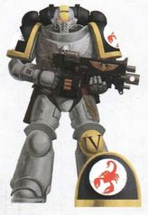

# 0319 红蝎 Red Scorpions

精校状态：中文行文已逐段精校，部分术语仍为暂定

分类：通用概念 / 帝国 Imperium / 中央政务部 Adeptus Terra / 阿斯塔特修会 Adeptus Astartes

原文来源：https://www.bilibili.com/opus/1122348029082337289

原作者：帝国神选罐头

原文时间：2025年10月11日 12:03

[返回分类目录](目录.md) · [全书目录](../../目录.md)

<!-- A0319-B0001 -->
**英文原文**

The Red Scorpions are a Space Marine Chapter of unknown origin.

<!-- /A0319-B0001 -->

<!-- A0319-B0002 -->

原译文

红蝎是一个起源不明的星际战士战团。

**校订译文**

红蝎是一个起源不明的星际战士战团。

<!-- /A0319-B0002 -->

<!-- A0319-B0003 图片 -->

<!-- A0319-B0004 图片 -->

<!-- A0319-B0005 -->
**英文原文**

Founding Chapter:Unknown

<!-- /A0319-B0005 -->

<!-- A0319-B0006 -->

原译文

建军战团：未知

**校订译文**

建军战团：未知

<!-- /A0319-B0006 -->

<!-- A0319-B0007 -->
**英文原文**

Founding:Unknown, evidence suggests a pre-M35 founding

<!-- /A0319-B0007 -->

<!-- A0319-B0008 -->

原译文

建军：未知，证据表明M35之前的建军

**校订译文**

建军：不明；现有证据表明早于第35千年。

<!-- /A0319-B0008 -->

<!-- A0319-B0009 -->
**英文原文**

Descendants:Unknown

<!-- /A0319-B0009 -->

<!-- A0319-B0010 -->

原译文

子战团：未知

**校订译文**

子战团：未知

<!-- /A0319-B0010 -->

<!-- A0319-B0011 -->
**英文原文**

Chapter Master:Lord High Commander Carab Culln(de jure), Captains Casan Sabius and Sirae Karagon (de facto)

<!-- /A0319-B0011 -->

<!-- A0319-B0012 -->

原译文

战团长：至高领主指挥官卡拉布·库伦（法律上）、卡桑·萨比乌斯和西雷·卡拉贡连长（事实上）

**校订译文**

战团长：至高领主指挥官卡拉布·库伦（名义上）；卡桑·萨比乌斯与西拉·卡拉贡两位连长（实际主持战团事务）。

<!-- /A0319-B0012 -->

<!-- A0319-B0013 -->
**英文原文**

Homeworld:Zaebus Minoris/Crusading Chapter

<!-- /A0319-B0013 -->

<!-- A0319-B0014 -->

原译文

家园世界：泽巴斯·米诺若斯/远征战团

**校订译文**

家园世界：泽巴斯·米诺若斯/远征战团

<!-- /A0319-B0014 -->

<!-- A0319-B0015 -->
**英文原文**

Fortress-Monastery:Vigil, a large battle station in orbit around the moon of Zaebus Minoris

<!-- /A0319-B0015 -->

<!-- A0319-B0016 -->

原译文

堡垒修道院：警戒，围绕泽巴斯·米诺若斯卫星轨道运行的大型战斗空间站

**校订译文**

要塞修道院：警戒堡，一座环绕泽巴斯·米诺若斯之卫星运行的大型战斗空间站。

<!-- /A0319-B0016 -->

<!-- A0319-B0017 -->
**英文原文**

Colours:Dark Charcoal Grey, Black shoulder pads and backpack; Yellow details

<!-- /A0319-B0017 -->

<!-- A0319-B0018 -->

原译文

颜色：深炭灰色，黑色肩甲和背包；黄色细节

**校订译文**

颜色：深炭灰色，黑色肩甲和背包；黄色细节

<!-- /A0319-B0018 -->

<!-- A0319-B0019 -->
**英文原文**

Specialty:None

<!-- /A0319-B0019 -->

<!-- A0319-B0020 -->

原译文

专业：无

**校订译文**

作战专长：无特定专长。

<!-- /A0319-B0020 -->

<!-- A0319-B0021 -->
**英文原文**

Strength:9 full Companies and reduced strength Scout company.

<!-- /A0319-B0021 -->

<!-- A0319-B0022 -->

原译文

力量：9个整连队和兵力减少的侦察连队。

**校订译文**

兵力：九个满编连，以及一个未满编的侦察连。

<!-- /A0319-B0022 -->

<!-- A0319-B0023 -->
**英文原文**

Battle Cry:Strength in Purity!

<!-- /A0319-B0023 -->

<!-- A0319-B0024 -->

原译文

战吼：纯洁之力！

**校订译文**

战吼：纯洁之力！

<!-- /A0319-B0024 -->

<!-- A0319-B0025 -->
## Origins 起源

<!-- /A0319-B0025 -->

<!-- A0319-B0026 -->
**英文原文**

The origins of the Red Scorpions Chapter are unknown. No records remain of the chapter's founding or from which Space Marine Legion their geneseed was first taken. This secrecy has led to some of the Imperium's hierarchy questioning the loyalty of a chapter that keeps its history secret and holds itself answerable to the Emperor alone. Despite this, the chapter assists wherever it can, carrying out thousands of relief missions. It is known, however, that the chapter has existed for at least 5,000 years.

<!-- /A0319-B0026 -->

<!-- A0319-B0027 -->

原译文

红蝎战团的起源尚不清楚。没有关于该战团成立的记录，也没有关于他们的基因最初来自哪个星际战士军团的记录。这种保密性导致帝国的一些高层质疑一个对历史保密并仅对帝皇负责的战团的忠诚度。尽管如此，战团仍尽其所能提供协助，执行了数千次救援任务。然而，众所周知，这一战团已经存在了至少5000年。

**校订译文**

红蝎战团的起源不明。有关其建军情况，以及基因种子最初取自哪个星际战士军团的记录，均已无存。战团将自身历史秘而不宣，又自认只须对帝皇负责，这使帝国部分高层对他们的忠诚产生怀疑。尽管如此，红蝎仍尽其所能援助各地，执行过数千次解围和救援任务。目前能够确定的是，战团已存在至少五千年。

<!-- /A0319-B0027 -->

<!-- A0319-B0028 -->
## Notable Engagements 著名交战

<!-- /A0319-B0028 -->

<!-- A0319-B0029 -->
**英文原文**

857.M38: Siege of Helios — The Chapter is called to assist in the prolonged siege of the traitor stronghold on Helios. The Chapter's Master of the Forge created the Land Raider Helios by mounting extra Whirlwind launchers onto existing Land Raiders. He took this step because the Red Scorpions mistrusted the Imperial Guard units they were sent to work with, fearing the Chapter may become tainted by forces already exposed to the traitors' corruption.

<!-- /A0319-B0029 -->

<!-- A0319-B0030 -->

原译文

赫利俄斯围城 — 战团受命协助长期围攻赫利俄斯的叛徒据点。该战团的铸造大师通过在现有的兰德掠袭者上安装额外的旋风发射器，创造了兰德掠袭者赫利俄斯。他采取这一步骤是因为红蝎不信任他们被派去合作的帝国卫队，担心战团可能会被已经暴露在叛徒腐化中的部队所污染。

**校订译文**

857.M38：赫利俄斯围城战——红蝎奉命增援，对赫利俄斯叛军据点的围攻已持续许久。战团铸造大师在现有兰德掠袭者战车上加装旋风导弹发射器，制成赫利俄斯型兰德掠袭者。之所以这样做，是因为红蝎不信任奉命与之协同的帝国卫队，担心这些已经接触叛徒腐化的部队会污染战团。

<!-- /A0319-B0030 -->

<!-- A0319-B0031 -->
**英文原文**

633-635.M39: Second Aegisine Crusade — The Red Scorpions battle Heretek forces.

<!-- /A0319-B0031 -->

<!-- A0319-B0032 -->

原译文

第二次艾吉辛远征 — 红蝎与异端部队作战。

**校订译文**

633—635.M39：第二次艾吉辛远征——红蝎与技术异端部队交战。

<!-- /A0319-B0032 -->

<!-- A0319-B0033 -->
**英文原文**

Late M39: Ordon Crusade — The entire chapter deployed in the wilderness space of the Ordon Rift in Segmentum Tempestus for 300 years, during which time it was feared they had been destroyed. It is unknown what happened during these three centuries.

<!-- /A0319-B0033 -->

<!-- A0319-B0034 -->

原译文

奥尔登远征 — 整个战团在暴风星域的奥尔登裂隙的荒芜空间部署了300年，在此期间，人们担心它们已经被摧毁。不知道这三个世纪发生了什么。

**校订译文**

第39千年晚期：奥尔登远征——整个战团在暴风星域奥尔登裂隙的荒野宙域部署了三百年，外界一度担心他们已全军覆没。这三个世纪里究竟发生过什么，至今无人知晓。

<!-- /A0319-B0034 -->

<!-- A0319-B0035 -->
**英文原文**

321.M40: The Red Scorpions defend the Hive World of M'kond from the orks of Waaagh! Gulgrag.

<!-- /A0319-B0035 -->

<!-- A0319-B0036 -->

原译文

红蝎保护姆'康德的巢都世界免受古尔格拉格的Waaagh！的攻击。

**校订译文**

321.M40：红蝎保卫巢都世界姆'康德，对抗古尔格拉格的欧克 Waaagh!。

<!-- /A0319-B0036 -->

<!-- A0319-B0037 -->
**英文原文**

M41: Galen V suppression (Galen V Expeditionary Force - involved Land Raiders in Codex approved Cobalt/Ammonium desert camouflage for the cobalt chromate deserts of Galen V)

<!-- /A0319-B0037 -->

<!-- A0319-B0038 -->

原译文

盖伦五号压制（盖伦五号远征军 - 参加战斗的兰德掠袭者，采用圣典批准的钴/铵沙漠伪装，用于盖伦五号的铬酸钴沙漠）

**校订译文**

第41千年：盖伦五号镇压行动——盖伦五号远征军投入了兰德掠袭者战车，并为其采用《圣典》认可的钴／铵沙漠迷彩，以适应该星球的铬酸钴沙漠。

<!-- /A0319-B0038 -->

<!-- A0319-B0039 -->
**英文原文**

826.M41: Siege of Vraks — A strike force composed of elements of the 1st, 3rd, 6th, and 8th companies arrive during the Siege of Vraks on the Strike Cruiser Arx Fidelis. Led by Commander Ainea, the strike force aids in the final breaching of the curtain wall surrounding the Fortress of Vraks. Veteran Sergeant Carab Culln leads the Vanguard squad that carried the teleport homer used by Commander Ainea and his squad of Terminators to arrive at, and subsequently hold, the breach in the curtain wall where the besieging army would pour through.

<!-- /A0319-B0039 -->

<!-- A0319-B0040 -->

原译文

弗拉克斯围城 — 在弗拉克斯围城期间，由第1、第3、第6和第8连队组成的打击部队乘坐打击巡洋舰忠诚堡垒号抵达弗拉克斯。在指挥官艾尼亚的带领下，打击部队协助最终突破了弗拉克斯堡垒周围的幕墙。老兵军士卡拉布·库伦带领先锋小队，该小队携带了指挥官艾尼亚和他的终结者小队使用的传送信标，抵达并随后守住了幕墙上的缺口，攻城军队从那里涌入。

**校订译文**

826.M41：弗拉克斯围城战——由第一、第三、第六和第八连部分兵力组成的打击部队，乘打击巡洋舰忠诚堡垒号抵达。在艾尼亚指挥官率领下，他们协助攻破了弗拉克斯要塞外围的城墙。老兵军士卡拉布·库伦率先锋小队携带传送信标，指引艾尼亚与其终结者小队传送至城墙缺口。他们随后守住缺口，让攻城大军得以从此涌入。

<!-- /A0319-B0040 -->

<!-- A0319-B0041 -->
**英文原文**

830.M41: The Red Scorpions return to Vraks, this time with a strike force personally led by Lord High Commander Verant Ortys in response to Inquisitor Lord Hector Rex's request for aid. The Battle Barge Sword of Ordon arrives in orbit, carrying 400 of the chapter's battle-brothers, including Veteran Sergeant Carab Culln. The Red Scorpions proceed to participate in the retaking of the Fortress of Vraks, particularly the battle of Saint Leonis' Gate.

<!-- /A0319-B0041 -->

<!-- A0319-B0042 -->

原译文

红蝎返回弗拉克斯，这次是由至高领主指挥官维兰特·奥尔提斯亲自领导的打击部队，以回应审判官领主赫克托·雷克斯的援助请求。奥尔登之剑号战斗驳船抵达轨道，搭载了400名该战团的战斗兄弟，其中包括老兵军士卡拉布·库伦。红蝎继续参与夺回弗拉克斯要塞，特别是圣莱奥尼斯之门之战。

**校订译文**

830.M41：红蝎重返弗拉克斯。为回应审判官领主赫克托·雷克斯的求援，至高领主指挥官维兰特·奥尔提斯亲自率领打击部队出征。战斗驳船奥尔登之剑号进入轨道，舰上搭载了四百名战斗兄弟，包括老兵军士卡拉布·库伦。红蝎随后参加夺回弗拉克斯要塞的作战，尤其是圣莱奥尼斯之门战役。

<!-- /A0319-B0042 -->

<!-- A0319-B0043 -->
**英文原文**

850.M41: Marines from the chapter's 1st and 6th Companies, led by Commander Carab Culln assist Ordo Xenos Inquisitor Solomon Lok during an investigation and subsequent battle against Tyranids on Beta Anphelion IV. The Chapter comes under surveillance by the Ordo Hereticus for their actions, along with Inquisitor Lord Varius of the Ordo Xenos.

<!-- /A0319-B0043 -->

<!-- A0319-B0044 -->

原译文

第1和第6连队的战士在指挥官卡拉布·库伦的带领下，在贝塔·安菲利翁四号上对泰伦的调查和随后的战斗中协助圣锤修会审判官所罗门·洛克。该战团因其行为受到讨逆修会的监视，还有攘外修会的审判官领主瓦留斯。

**校订译文**

850.M41：第一连与第六连的战士在卡拉布·库伦指挥官率领下，于贝塔·安菲利翁四号协助异形审判庭审判官所罗门·洛克，先展开调查，随后与泰伦交战。战团与异形审判庭的审判官领主瓦留斯均因此次行动受到异端审判庭监视。

**校注：** 原译将 Ordo Xenos 分别误作圣锤修会和攘外修会，现按用户定译统一为异形审判庭；Ordo Hereticus 为异端审判庭。

<!-- /A0319-B0044 -->

<!-- A0319-B0045 -->
**英文原文**

906.M41: The Badab War — The chapter is brought in, along with the Minotaurs, to protect shipping and space lanes and to reinforce the Fire Hawks and Marines Errant during the Badab War. Due to the Red Scorpions' unyielding devotion to Codex scripture and their unwillingness to fraternize with less traditional Chapters, their operations in the War are mainly confined to space-lane duties. They are involved in several bloody ship-to-ship boarding actions against the renegade Executioners chapter , while the Minotaurs carried out similar boarding actions against the renegade Lamenters, which caused the Lamenters to surrender.

<!-- /A0319-B0045 -->

<!-- A0319-B0046 -->

原译文

巴达布战争 — 该战团与米诺陶一起被引入，以保护航运和太空航线，并在巴达布战争期间增援火鹰和游侠战士。由于红蝎对圣典的坚定忠诚，以及他们不愿意与不太传统的战团建立友谊，他们在战争中的行动主要局限于太空通道任务。他们参与了几次针对叛徒处刑者战团的血腥船对船跳帮行动，而米诺陶对叛徒恸哭者也进行了类似的跳帮行动，导致恸哭者投降。

**校订译文**

906.M41：巴达布战争——红蝎与米诺陶被派来保护航运及太空航道，并增援火鹰和游侠战士。由于红蝎严格奉行《圣典》教条，不愿与较少遵循传统的战团密切合作，他们在战争中的任务主要限于守卫航道。红蝎曾对变节的处刑者战团发动数次血腥跳帮战；与此同时，米诺陶以类似方式攻击变节的恸哭者，并迫使后者投降。

<!-- /A0319-B0046 -->

<!-- A0319-B0047 -->

原译文

906.M41: The Angstrom Incident 安斯特罗姆事件

**校订译文**

906.M41: The Angstrom Incident 安斯特罗姆事件

<!-- /A0319-B0047 -->

<!-- A0319-B0048 -->
**英文原文**

907.M41: The Red Scorpions return to the galactic east to undertake their normal duties, due to Ork incursions in the Ultima Segmentum (most likely by Urgok the Unstoppable).

<!-- /A0319-B0048 -->

<!-- A0319-B0049 -->

原译文

红蝎返回银河系东部执行他们的正常任务，因为欧克入侵了极限星域（最有可能的是不可阻挡的乌尔戈克）。

**校订译文**

907.M41：极限星域遭欧克入侵，红蝎因此返回银河东部，恢复常规职责。入侵者很可能是“不可阻挡者”乌尔戈克。

<!-- /A0319-B0049 -->

<!-- A0319-B0050 -->
**英文原文**

999.M41: Third War for Armageddon — A single company arrives at the end of the first year of conflict during the Season of Fire and awaits the Season of Shadows to commence hostilities in Warzone Armageddon.

<!-- /A0319-B0050 -->

<!-- A0319-B0051 -->

原译文

第三次阿玛吉多顿战争 — 一个连队在火季的第一年冲突结束时抵达，等待影季在阿玛吉多顿战区开始敌对行动。

**校订译文**

999.M41：第三次阿玛吉多顿战争——战争第一年末，正值火季，红蝎的一个连抵达战区，等待影季到来后开始作战。

<!-- /A0319-B0051 -->

<!-- A0319-B0052 -->
**英文原文**

Undated — Battle with Eldar forces (location unknown). It is known that at least one Red Scorpions Rhino with spaced armour fought there.

<!-- /A0319-B0052 -->

<!-- A0319-B0053 -->

原译文

与灵族部队作战（位置未知）。据了解，至少有一辆覆盖间隔装甲的红蝎犀牛在那里战斗。

**校订译文**

年代不明：在地点不详的战斗中对抗灵族。已知至少有一辆加装间隔装甲的红蝎犀牛战车参战。

<!-- /A0319-B0053 -->

<!-- A0319-B0054 -->
**英文原文**

Undated — The Scoring of Entessian — Red Scorpions forces (including Dreadnoughts and Conqueror Class Robots) supported the Firebrands Titan Legion fighting Rebel Robots during the attack on Myrdinn City's industrial sector.

<!-- /A0319-B0054 -->

<!-- A0319-B0055 -->

原译文

恩德西安刻痕 — 在袭击默丁城工业区期间。红蝎部队（包括无畏和征服者级机兵）支援了炎纹泰坦军团与叛军机兵的战斗。

**校订译文**

年代不明：恩德西安刻痕之战——进攻默丁城工业区时，红蝎部队（包括无畏机甲与征服者级机兵）支援炎纹泰坦军团，与叛乱机兵交战。

<!-- /A0319-B0055 -->

<!-- A0319-B0056 -->
**英文原文**

More recently, they have been involved in operations against Hive Fleet Kraken and the growing Ork empire of Urgok the Unstoppable as well as the Octarius War.

<!-- /A0319-B0056 -->

<!-- A0319-B0057 -->

原译文

最近，他们参与了针对虫巢舰队克拉肯和不断壮大的不可阻挡的乌尔戈克的欧克帝国以及奥克塔琉斯战争的行动。

**校订译文**

在较近时期，红蝎参与了对抗克拉肯虫巢舰队的行动、对“不可阻挡者”乌尔戈克不断扩张的欧克帝国的作战，以及奥克塔琉斯战争。

<!-- /A0319-B0057 -->

<!-- A0319-B0058 -->
## Gene-Seed 基因种子

<!-- /A0319-B0058 -->

<!-- A0319-B0059 -->
**英文原文**

The Chapter is noted for the purity of geneseed tithes which is heavily tied to its fanatical belief in purity, in deed and thought as well as physically. According to an assessment of progenoid samples by Inquisitor Lord Varius's acolytes, the Chapter retains over 94% purity, with the only exception being an overactive Betcher's Gland. It was for this reason that Varius chose the Red Scorpions as the gene source for his proposed new founding to counter the Tyranid hive fleets. However, the Chapter has repeatedly refused to allow more samples to be examined by the Inquisition or the Adeptus Mechanicus Biologis.

<!-- /A0319-B0059 -->

<!-- A0319-B0060 -->

原译文

本战团以基因种子什一税的纯洁性而闻名，这与它在行为、思想和身体上对纯洁的狂热信仰密切相关。根据审判官领主瓦留斯的侍僧对基因收存腺样本的评估，该战团保留了94%以上的纯净度，唯一的例外是过度活跃的贝彻腺体。正是出于这个原因，瓦留斯选择红蝎作为他提出的新发现的基因来源，以对抗泰伦的虫巢舰队。然而，该战团一再拒绝让审判庭或机械修会生物贤者检查更多样本。

**校订译文**

红蝎缴纳的基因种子什一税以纯净著称，这与他们对行为、思想乃至肉体纯洁性的狂热信念密切相关。审判官领主瓦留斯麾下侍僧对基因收存腺样本的评估表明，该战团的基因种子纯净度超过94%，唯一异常是贝彻腺体过度活跃。因此，瓦留斯计划通过一次新的建军来对抗泰伦虫巢舰队时，选中了红蝎作为基因来源。不过，战团一再拒绝向审判庭或机械修会的生物学专家提供更多样本供其检验。

**校注：** new founding 指新的建军计划，非“新发现”；Adeptus Mechanicus Biologis 在此指机械修会生物学人员，未强行补出原文没有的 Magos 职衔。

<!-- /A0319-B0060 -->

<!-- A0319-B0061 -->
**英文原文**

Despite its extreme purity, the Red Scorpions' gene-seed is highly genericised; it has none of the defining features that might be used to tie it to any specific Space Marine Legion.

<!-- /A0319-B0061 -->

<!-- A0319-B0062 -->

原译文

红蝎的基因种子极其纯净，且它具有高度的通用性；它没有任何可以用来将其与任何特定的星际战士联系起来的可定义特征。

**校订译文**

红蝎的基因种子虽然极其纯净，却高度缺乏个体特征：其中没有任何可据以判断其源自某个特定星际战士军团的明显标志。

<!-- /A0319-B0062 -->

<!-- A0319-B0063 -->
## Homeworld 家园世界

<!-- /A0319-B0063 -->

<!-- A0319-B0064 -->
**英文原文**

The Fortress-Monastery of the Red Scorpions is a space station named Vigil that orbits Zaebus Minoris and/or its moon. The location of Vigil is a well-kept secret only Chapter members and high-ranking members of the Administratum know.

<!-- /A0319-B0064 -->

<!-- A0319-B0065 -->

原译文

红蝎要塞修道院是一个名为警戒的空间站，围绕泽巴斯·米诺若斯和/或其卫星运行。警戒的位置是一个严格保密的秘密，只有战团成员和内务部的高级成员知道。

**校订译文**

红蝎的要塞修道院是一座名为“警戒堡”的空间站，环绕泽巴斯·米诺若斯及／或其卫星运行。其位置严格保密，只有战团成员与内政部高层知晓。

**校注：** 原文用 and/or，且同篇不同段落对环绕行星或卫星的表述不完全一致，保留其不确定性。 Vigil 按第229篇既有设施名统一为警戒堡；与静默修女的同形编制名称警戒团分开。

<!-- /A0319-B0065 -->

<!-- A0319-B0066 -->
**英文原文**

Recruits are drawn from Zaebus Minoris, a small, arid world inhabited by primitive tribes of humans. The tribes' traditions tie into the recruitment process of the Chapter. Missionary Galactica reports that all male infants are presented to their tribes' temple at the first full moon of its life. A few are taken by the "gods" - selected, after stringent genetic testing, by Chapter Apothecaries as potential future Marines. Because these recruits will have had no experience with their parent culture, the Chapter is all these recruits will know. The monastery itself is a large battle-station which orbits the moon of Zaebus Minoris, and from this base the Chapter sends strike forces out across the galaxy to destroy those who would threaten the Imperium. Indeed, they could almost be considered a Crusading Chapter because they treat Vigil as a simple base of operations rather than the centre of a great realm. The Chapter's armoury is well-stocked, and they are known to field a wide variety of vehicles, particularly Drop Pods and Land Raiders. Their forge is renowned for its ability to maintain (and manufacture in limited amounts) a variety of patterns of Astartes Power Armour, especially the treasured Mark IV pattern, commonly issued to the Chapter's veterans as a sign of rank. The Red Scorpions are also famous for the quality of their arms, and extraordinary weapons such as power swords, axes, or fists are also issued to the veterans, fulfilling both a practical and symbolic purpose. This association of military rank with quality wargear is exemplified in a collection of relic blades known as the "Tears of the Scorpion", each with its own legend and wielded by one of the Chapter's Commanders. Indeed, the only shortage of any kind of wargear that the Red Scorpions have is a dwindling supply of Terminator Armor due to heavy use, notably during the Siege of Vraks, Beta Anphelion IV, and the Badab War.

<!-- /A0319-B0066 -->

<!-- A0319-B0067 -->

原译文

新兵来自泽巴斯·米诺若斯，一个由原始人类部落居住的干旱小世界。部落的传统与该战团的招募过程息息相关。卡拉狄加传教士报告说，所有男婴都会在他们部落的神殿迎来生命中的第一个满月时被送到神殿。其中一些被“神”选中，经过严格的基因检测，被战团药剂师选为未来战士的潜在成员。因为这些新兵对他们的父母文化没有任何经验，所以这些新兵只会知道战团。修道院本身就是一个围绕泽巴斯·米诺若斯卫星运行的大型战斗空间站，从这个基地，战团向整个银河系派遣打击部队，摧毁那些威胁帝国的人。事实上，他们几乎可以被视为一个远征战争，因为他们将警戒视为一种简单的行动基础，而不是一个伟大领域的中心。该战团的军械库储备充足，众所周知，他们部署了各种各样的载具，特别是空降仓和兰德掠袭者。他们的铸造厂以能够维护（和有限数量地制造）各种阿斯塔特动力盔甲型号而闻名，尤其是珍贵的Mark IV型，通常作为军衔标志颁发给该战团的老兵。红蝎也以其武器的质量而闻名，并且还向老兵发放了力量剑、斧或拳等非凡的武器，实现了实用和象征性的目的。这种军衔与优质战争装备的联系在一系列被称为“蝎泪”的圣物刃中得到了体现，每把剑刃都有自己的传说，由战团的一名指挥官使用。事实上，红蝎所拥有的任何一种战争装备的唯一短缺是由于大量使用而导致的终结者装甲供应减少，特别是在弗拉克斯围城、贝塔·安菲利翁四号和巴达布战争期间。

**校订译文**

红蝎从泽巴斯·米诺若斯征募新兵。这是一个干旱的小型世界，居住着原始人类部落；当地传统与战团的征兵过程紧密相连。银河传教团报告称，每个男婴都会在出生后的第一个满月之夜被送往部落神殿，少数婴儿会被“神明”带走——实际上，是战团药剂师经过严格基因检测，将他们选为未来星际战士的候选者。这些孩子尚未接触出生部落的文化，因此战团将成为他们唯一熟悉的社会。红蝎的修道院是一座环绕泽巴斯·米诺若斯之卫星的大型战斗空间站，战团从这里向银河各地派遣打击部队，消灭威胁帝国的敌人。他们几乎可算作远征战团，因为他们只把警戒堡视为行动基地，而非庞大领地的中心。战团军械库储备充足，能部署多种载具，尤其是空降舱与兰德掠袭者战车。其铸造厂擅长维护各种型号的阿斯塔特动力甲，也能少量制造这些护甲，尤其是珍贵的 Mark IV 型；这种护甲通常配发给老兵，作为地位的象征。红蝎武器的品质同样出众，动力剑、动力斧和动力拳等精良武器也会配给老兵，兼有实用与象征意义。一组名为“蝎泪”的圣物刃最能体现这种军阶与优质装备的联系：每柄剑都有自己的传说，并由战团的一位指挥官执掌。红蝎唯一短缺的装备是终结者护甲；长期的大量使用，尤其是在弗拉克斯围城战、贝塔·安菲利翁四号战役及巴达布战争中的消耗，使其存量日益减少。

**校注：** 英文写作 Missionary Galactica，形式不同于核心定译中的 Missionaria Galaxia；依此处作为报告来源的机构语境暂按银河传教团处理，词形疑点保留供复核。

<!-- /A0319-B0067 -->

<!-- A0319-B0068 -->
## Organization 组织

<!-- /A0319-B0068 -->

<!-- A0319-B0069 -->
**英文原文**

The Red Scorpions consider the Codex Astartes as religious scripture, and their chapter organization closely follows codex standards. The chain of command within the Chapter is highly authoritarian, and all orders given by a superior are to be obeyed without question. Captains are called Commanders, and the Chapter Master is known as the Lord High Commander. The Master of the Apothecarion traditionally holds the position of second-in-command due to the Chapter's emphasis on purity, and they also maintain a larger Apothecarion. The Chapter's Apothecaries are often attached to Tactical squads to ensure the retrieval of the Chapter's geneseed. Being a Codex Chapter, the Red Scorpions favor a combined-arms approach to the destruction of the Imperium's enemies whenever possible. Each Battle-Brother is expected to be a master of all forms of warfare described in the Codex and available for re-assignment to different squad types and companies as the need arises.

<!-- /A0319-B0069 -->

<!-- A0319-B0070 -->

原译文

红蝎认为阿斯塔特圣典是宗教经文，他们的战团组织严格遵循圣堂标准。战团内的指挥链是高度权威的，上级下达的所有命令都必须毫无疑问地服从。连长被称为指挥官，战团长被称为至高领主指挥官。由于该战团强调纯洁，药剂大师传统上担任二把手，他们还保留了更大量的药剂师。该战团的药剂师通常隶属于战术小队，以确保取回该战团的基因种子。作为一个圣典战团，红蝎赞成在可能的情况下采用联合武器的方法来摧毁帝国的敌人。每个战斗兄弟都有望成为圣典中描述的所有形式战争的大师，并在需要时重新分配给不同的小队类型和连队。

**校订译文**

红蝎将《阿斯塔特圣典》奉为宗教经典，战团编制紧随《圣典》标准。其指挥体系高度集权，上级命令必须无条件服从。连长称为“指挥官”，战团长称为“至高领主指挥官”。由于格外重视纯洁性，药剂大师按传统担任战团副手，药剂部门的规模也比通常更大。药剂师常随战术小队行动，以确保回收战团的基因种子。作为遵循《圣典》的战团，红蝎只要条件允许，便倾向于以多兵种协同作战歼灭帝国之敌。每位战斗兄弟都须熟练掌握《圣典》所述的各种作战方式，能够根据需要调往不同类型的小队和连队。

<!-- /A0319-B0070 -->

<!-- A0319-B0071 -->
**英文原文**

Although the Chapter relies heavily on the Codex Astartes for strategic and tactical deployments, it can unexpectedly innovate when circumstances dictate. A particularly notable example is the Siege of Helios, where the Chapter's Techmarines developed the Land Raider Helios due to their distrust of the Imperial Guard assets fighting alongside them. The Land Raider Helios has now been adopted by many Chapters and was recently approved by the Mechanicus. Despite being fully capable of undertaking covert operations, the Red Scorpions abhor them, and prefer to face their enemies proudly bearing their colors. This, combined with a reduced Scout Company due to strict recruitment standards, ensures that the Chapter's Neophytes are often deployed in the main battle line as an auxiliary force.

<!-- /A0319-B0071 -->

<!-- A0319-B0072 -->

原译文

尽管该战团在战略和战术部署上严重依赖阿斯塔特圣典，但在情况需要时，它可以出乎意料地进行创新。一个特别值得注意的例子是赫利俄斯围城，由于不信任与他们并肩作战的帝国卫队，该战团的技术军士开发了兰德掠袭者赫利俄斯。兰德掠袭者赫利俄斯现已被许多战团采用，最近还得到了机械教的批准。尽管红蝎完全有能力进行秘密行动，但他们憎恶它，更愿意自豪地面对他们的敌人。这一点，再加上由于严格的招募标准而减少的侦察连队，确保了该战团的新进者经常作为辅助部队部署在主战线上。

**校订译文**

红蝎虽然在战略与战术部署上高度依赖《阿斯塔特圣典》，却也会在形势迫使之下作出出人意料的创新。赫利俄斯围城战就是典型例子：由于不信任共同作战的帝国卫队，战团科技战士研制了赫利俄斯型兰德掠袭者战车。此型战车如今已被许多战团采用，最近也获得机械修会认可。红蝎完全有能力执行隐秘行动，却对此深感厌恶，更愿意骄傲地亮出战团涂装，正面迎敌。加上严格征兵标准导致侦察连兵力较少，战团新兵因而常作为辅助力量，被部署到正面战线上。

<!-- /A0319-B0072 -->

<!-- A0319-B0073 -->
## Beliefs 信仰

<!-- /A0319-B0073 -->

<!-- A0319-B0074 -->
**英文原文**

The Red Scorpions do not seem to venerate any Primarch above the others, giving their devotion solely to the Emperor. Some say that their strict adherence to the Codex Astartes shows that they are a Successor Chapter of the Ultramarines, but there is little other evidence to support this besides the purity of their gene-seed. Indeed, the preservation of their gene-seed is the Chapter's core belief. The Red Scorpion's devotion to the purity of their gene-seed has made them isolationists, scorning those who they believe are less pure or deviate from the Codex, and they will go to any lengths to retrieve the Chapter's due from their fallen Brothers. They will not serve alongside abhumans, and view all the other military arms of the Imperium as untrustworthy. They are also staunch traditionalists and protectors of authority, and are quick to aid Imperial governors or cardinals faced with rebellion. The Red Scorpions are also extremely xenophobic, detesting the alien and the mutant in all their forms.

<!-- /A0319-B0074 -->

<!-- A0319-B0075 -->

原译文

红蝎似乎并不比其他人更崇拜任何一位原体，他们只忠于帝皇。有人说，他们严格遵守阿斯塔特圣典表明他们是极限战士的子战团，但除了基因种子的纯度外，几乎没有其他证据支持这一点。事实上，保护他们的基因种子是本战团的核心信念。红蝎对其基因种子纯度的执着使他们成为孤立主义者，蔑视那些他们认为不那么纯净或偏离圣典的人，他们将不遗余力地从他们死去的兄弟那里取回本战团的权利。他们不会与亚人并肩作战，并认为帝国的所有其他军事力量都是不可靠的。他们也是坚定的传统主义者和权威的保护者，并迅速帮助面临叛乱的帝国统治者或红衣主教。红蝎也非常仇外，憎恨各种形态的外星人和变种人。

**校订译文**

红蝎似乎并不格外尊崇某一位原体，而是将全部敬意献给帝皇。有人据其严格遵循《阿斯塔特圣典》，推测他们是极限战士的子战团；但除了基因种子纯净之外，几乎没有其他证据支持这一说法。事实上，保存基因种子正是战团的核心信念。红蝎对基因纯洁的执着，使他们倾向于自我孤立，鄙视被他们视为不够纯净或偏离《圣典》的人，并不惜一切代价从阵亡兄弟身上收回属于战团的基因种子。他们拒绝与亚人并肩服役，也不信任帝国其他军事力量。他们还是坚定的传统与权威捍卫者，遇到帝国总督或枢机主教面临叛乱，总会迅速援助。红蝎极端仇视异形，也憎恶一切形态的变种人。

<!-- /A0319-B0075 -->

<!-- A0319-B0076 -->
## Chapter Elements 战团单位

原题：Chapter Elements 战团成员

<!-- /A0319-B0076 -->

<!-- A0319-B0077 -->
### Fleet 舰队

<!-- /A0319-B0077 -->

<!-- A0319-B0078 -->
**英文原文**

The Red Scorpions are assumed to have a large fleet at their disposal, given their history and salvage rights following the Badab War, but so far only three ships have been mentioned in official GW material and Forge World publications to date - the Battle Barges Auel's Bane and Sword of Ordon, and the Strike Cruiser Arx Fidelis.

<!-- /A0319-B0078 -->

<!-- A0319-B0079 -->

原译文

考虑到巴达布战争后的历史和打捞权，红蝎被认为拥有庞大的舰队可供支配，但到目前为止，官方GW材料和FW出版物中只提到了三艘舰船 — 战斗驳船奥尔之灾号和奥尔登之剑号，以及打击巡洋舰忠诚堡垒号。

**校订译文**

考虑到红蝎的历史，以及巴达布战争结束后获得的打捞权，外界推测他们拥有规模可观的舰队。不过，截至原资料所述时点，Games Workshop 官方资料与 Forge World 出版物只提及三艘舰船：战斗驳船奥尔之灾号、奥尔登之剑号，以及打击巡洋舰忠诚堡垒号。

<!-- /A0319-B0079 -->

<!-- A0319-B0080 -->
### Notable Vehicles 著名载具

<!-- /A0319-B0080 -->

<!-- A0319-B0081 -->
**英文原文**

Belasarius — Land Raider Phobos.

<!-- /A0319-B0081 -->

<!-- A0319-B0082 -->

原译文

贝利撒留 — 兰德掠袭者火卫一

**校订译文**

贝利撒留号——福波斯型兰德掠袭者战车。

**校注：** Phobos 在此为战车型号，暂用音译福波斯，避免被误读为车辆部署地点火卫一。

<!-- /A0319-B0082 -->

<!-- A0319-B0083 -->
**英文原文**

Iron Seraph — Land Raider Helios.

<!-- /A0319-B0083 -->

<!-- A0319-B0084 -->

原译文

钢铁六翼天使 — 兰德掠袭者赫利俄斯

**校订译文**

钢铁六翼天使号——赫利俄斯型兰德掠袭者战车。

<!-- /A0319-B0084 -->

<!-- A0319-B0085 -->
**英文原文**

Judgement of Fire — Land Raider Hecate.

<!-- /A0319-B0085 -->

<!-- A0319-B0086 -->

原译文

火焰裁决 — 兰德掠袭者赫卡忒

**校订译文**

火焰裁决号——赫卡忒型兰德掠袭者战车。

<!-- /A0319-B0086 -->

<!-- A0319-B0087 -->
**英文原文**

Encarmine — Whirlwind Scorpius. Fought in the Third War for Armageddon.

<!-- /A0319-B0087 -->

<!-- A0319-B0088 -->

原译文

猩红 — 旋风天蝎座。在第三次阿玛吉多顿战争中战斗。

**校订译文**

猩红号——天蝎型旋风战车，曾参加第三次阿玛吉多顿战争。

<!-- /A0319-B0088 -->

<!-- A0319-B0089 -->
### Notable Members 著名成员

<!-- /A0319-B0089 -->

<!-- A0319-B0090 -->
**英文原文**

Carab Culln — Culln is the current Lord High Commander of the Red Scorpions. He was inducted from the primitive world of Zaebus Minoris and has risen through the ranks of the Red Scorpions to take his current position after the death of Lord High Commander Ortys. According to quotes attributed to him he considers abhumans such as Beastmen and Ogryns to be subhuman and is highly reluctant to allow his troops to serve anywhere near them. He considers the use of camouflage to be cowardice, although there is nothing to suggest the Chapter as a whole shares this belief; on the contrary, the chapter is noted to strictly follow Codex camouflage designs, to such an extent that they refuse to fight alongside chapters using "unofficial" designs. At some point, Carab Culln was grievously wounded and interred within the shell of a Dreadnought, and now the Capatins Casan Sabius and Sirae Karagon have become the de facto leaders of the Chapter.

<!-- /A0319-B0090 -->

<!-- A0319-B0091 -->

原译文

卡拉布·库伦是红蝎的现任最高指挥官。他从泽巴斯·米诺若斯的原始世界中被引入，并在至高领主指挥官奥尔提斯牺牲后通过红蝎的等级上升到现在的位置。根据他所引用的话，他认为野兽人和欧格林等亚人是非人，非常不愿意让他的军队在他们附近的任何地方服役。他认为使用伪装是懦弱的，尽管没有任何迹象表明整个战团都认同这一信念；相反，该战团严格遵循圣典的伪装设计，以至于他们拒绝与使用“非官方”设计的战团并肩作战。在某个时刻，卡拉布·库伦受了重伤，被埋葬在一艘无畏机甲里，现在连长卡桑·萨比乌斯和西拉·卡拉贡已经成为该战团事实上的领导人。

**校订译文**

卡拉布·库伦——红蝎现任至高领主指挥官。他在原始世界泽巴斯·米诺若斯被征募入团，逐级晋升，在奥尔提斯阵亡后接任现职。据记载，他将野兽人、欧格林等亚人视为低等人类，极不愿意让自己的部队在这些人附近作战。他还认为使用迷彩是怯懦的表现，但没有迹象表明整个战团认同这一看法。相反，红蝎严格采用《圣典》规定的迷彩，甚至拒绝与使用“非正式”图案的战团协同。后来，库伦身负重伤，被安置进无畏机甲。如今，卡桑·萨比乌斯与西拉·卡拉贡两位连长已经成为战团实际上的领导者。

<!-- /A0319-B0091 -->

<!-- A0319-B0092 -->
**英文原文**

Verant Ortys — Supreme Leader of the Red Scorpions circa 830.M41. Accepts Lord Inquisitor Hector Rex's request for aid, and personally leads a strike force of 400 battle-brothers in the retaking of the Fortress of Vraks, capturing Saint Leonis' Gate from waves of heretics, mutants, and finally daemons. Ortys was killed during the Badab War in The Betrayal at Grief on 3.390.906.M41.

<!-- /A0319-B0092 -->

<!-- A0319-B0093 -->

原译文

维兰特·奥尔提斯 — 红蝎的最高领袖，约830.M41。接受审判官领主赫克托·雷克斯的援助请求，并亲自率领一支由400名战斗兄弟组成的打击部队夺回了弗拉克斯要塞，从异端、变种人和最后的恶魔手中夺取了圣莱奥尼斯之门。奥尔提斯于3.390.906.M41在巴达布战争的悲伤之叛中被杀。

**校订译文**

维兰特·奥尔提斯——约830.M41时担任红蝎最高领袖。他接受审判官领主赫克托·雷克斯的求援，亲率四百名战斗兄弟参加夺回弗拉克斯要塞的战斗，击败一波波异端、变种人，最后战胜恶魔，夺下圣莱奥尼斯之门。3.390.906.M41，奥尔提斯在巴达布战争的格里夫背叛事件中遇害。

**校注：** Grief 在 The Betrayal at Grief 中为地点名，不能仅按普通词义译为悲伤；暂定格里夫。

<!-- /A0319-B0093 -->

<!-- A0319-B0094 -->
**英文原文**

Ainea — Commander of the Red Scorpions 3rd Company circa 826.M41. Led a task force that answered Marshal Kagori's request for aid, and captured the breach in the curtain wall of the Fortress of Vraks that finally allowed the 88th Siege Army to enter the Citadel proper.

<!-- /A0319-B0094 -->

<!-- A0319-B0095 -->

原译文

艾尼亚 — 红蝎第三连队指挥官，约于826.M41。领导了一支特遣部队，回应了卡戈里元帅的援助请求，并占领了弗拉克斯堡垒幕墙的缺口，最终使第88攻城军得以进入城堡。

**校订译文**

艾尼亚——约826.M41时担任红蝎第三连指挥官。他率特遣部队响应卡戈里元帅的求援，夺取弗拉克斯要塞外墙的缺口，使第88攻城军终于得以进入要塞内部。

<!-- /A0319-B0095 -->

<!-- A0319-B0096 -->
**英文原文**

Sevrin Loth — Magister of the Red Scorpions and is considered one of the most powerful Librarians, not only in his Chapter, but throughout all of the Astartes. Inducted from a feudal planet within the Ordon Rift, he soon started to display powerful psychic powers during martial training; able to break bones with thought alone. Loth has a reputation for being a relentless fighter as skilled in personal combat as he is mentally.

<!-- /A0319-B0096 -->

<!-- A0319-B0097 -->

原译文

塞弗林·罗斯 — 红蝎的导师，被认为是最强大的智库之一，不但在他的战团中，而且在整个阿斯塔特中都是如此。他来自奥尔登裂隙的一个封建行星，在军事训练中很快就表现出强大的灵能力量；仅凭思考就能折断骨头。罗斯以无情的战士而闻名，他在个人战斗方面和灵能上一样熟练。

**校订译文**

塞弗林·罗斯——红蝎的导师，被认为是整个阿斯塔特群体中最强大的智库员之一。他从奥尔登裂隙的一颗封建行星被征募入团，在军事训练中很快便显露出强大的灵能，单凭意念就能折断骨头。罗斯以作战冷酷坚决著称，近身格斗的造诣与其灵能本领同样出众。

<!-- /A0319-B0097 -->

<!-- A0319-B0098 -->
**英文原文**

Kregor Thann — Master Apothecary. Also a member of the Deathwatch

<!-- /A0319-B0098 -->

<!-- A0319-B0099 -->

原译文

克雷戈尔·坦恩 — 药剂大师。也是死亡守望的成员

**校订译文**

克雷戈尔·坦恩 — 药剂大师。也是死亡守望的成员

<!-- /A0319-B0099 -->

<!-- A0319-B0100 -->
**英文原文**

Casan Sabius: Captain. One of the two de facto Chapter Masters of the Red Scorpions since the wounding of Carab Culln.

<!-- /A0319-B0100 -->

<!-- A0319-B0101 -->

原译文

卡桑·萨比乌斯：连长。自卡拉布·库伦受伤以来，红蝎事实上的两位战团长之一。

**校订译文**

卡桑·萨比乌斯：连长。自卡拉布·库伦受伤以来，红蝎事实上的两位战团长之一。

<!-- /A0319-B0101 -->

<!-- A0319-B0102 -->
**英文原文**

Sirae Karagon: Captain. One of the two de facto Chapter Masters of the Red Scorpions since the wounding of Carab Culln.

<!-- /A0319-B0102 -->

<!-- A0319-B0103 -->

原译文

西拉·卡拉贡：连长。自卡拉布·库伦受伤以来，红蝎事实上的两位战团长之一。

**校订译文**

西拉·卡拉贡：连长。自卡拉布·库伦受伤以来，红蝎事实上的两位战团长之一。

<!-- /A0319-B0103 -->

<!-- A0319-B0104 -->
**英文原文**

Nalr — Chaplain Dreadnought.

<!-- /A0319-B0104 -->

<!-- A0319-B0105 -->

原译文

纳尔 — 牧师无畏

**校订译文**

纳尔——教士无畏机甲。

<!-- /A0319-B0105 -->

<!-- A0319-B0106 -->
**英文原文**

Galtus — Dreadnought.

<!-- /A0319-B0106 -->

<!-- A0319-B0107 -->

原译文

加尔图斯 — 无畏

**校订译文**

加尔图斯 — 无畏

<!-- /A0319-B0107 -->

<!-- A0319-B0108 -->
**英文原文**

Justinian — Dreadnought.

<!-- /A0319-B0108 -->

<!-- A0319-B0109 -->

原译文

查士丁尼 — 无畏

**校订译文**

查士丁尼 — 无畏

<!-- /A0319-B0109 -->

<!-- A0319-B0110 -->
**英文原文**

Haas — Veteran Sergeant with he has a bionic left arm. His Mark 4 armour incorporates an Iron Halo and he has served in over 60 missions.

<!-- /A0319-B0110 -->

<!-- A0319-B0111 -->

原译文

哈斯 — 这位老兵军士有一只仿生左臂。他的Mark IV盔甲采用了铁光环，他已经执行了60多次任务。

**校订译文**

哈斯——老兵军士，左臂为仿生义肢。他的 Mark IV 型动力甲装有钢铁光环，曾参加六十余次任务。

<!-- /A0319-B0111 -->

本篇核心术语与暂定项

以下列出本篇出现的英文原形及核心术语表用词。同形词可能指不同对象，具体词义以本篇正文和校注为准；单复数、别名和仅见于图注的名称可能尚未列入。完整候选见[术语表](../../术语表/双语术语候选.csv)。

| 英文 | 采用中文 | 状态 |
| --- | --- | --- |
| Deathwatch | 死亡守望 | 官方已核对 |
| Adeptus Mechanicus | 机械修会 | 官方已核对 |
| Imperial Guard | 帝国卫队 | 暂定·语境区分 |
| Eldar | 灵族 | 暂定·语境区分 |
| Tyranids | 泰伦虫族 | 官方已核对 |
| Orks | 欧克蛮人 | 官方已核对 |
| Terminator | 终结者 | 官方已核对 |
| Ultramarines | 极限战士 | 官方已核对 |
| Inquisition | 审判庭 | 暂定 |
| Inquisitor | 审判官 | 官方已核对 |
| Imperium | 帝国 | 暂定·简称 |
| Waaagh! | Waaagh! | 暂定·保留原文 |
| History | 历史 | 编辑用语已统一 |
| Administratum | 内政部 | 暂定 |
| Teleport Homer | 传送信标 | 暂定·官方待核 |
| Emperor | 帝皇 | 官方已核对 |
| Primarch | 原体 | 官方已核对 |
| Battle Barge | 战斗驳船 | 暂定·官方待核 |
| Hive World | 巢都世界 | 暂定·官方待核 |
| Forge World | 铸造世界 | 暂定·官方待核 |
| Mutant | 变种人 | 暂定·官方待核 |
| Octarius | 奥克塔琉斯 | 暂定·官方待核 |
| Ordo Hereticus | 异端审判庭 | 用户指定 |
| Ordo Xenos | 异形审判庭 | 用户指定 |
| Segmentum Tempestus | 暴风星域 | 暂定·官方待核 |
| Ultima Segmentum | 极限星域 | 暂定·官方待核 |
| Segmentum | 星域 | 暂定·官方待核 |
| Sector | 星区 | 暂定·官方待核 |
| Beastmen | 野兽人 | 暂定·官方待核 |
| Armageddon | 阿玛吉多顿 | 暂定·官方待核 |
| Badab | 巴达布 | 暂定·官方待核 |
| Phobos | 火卫一 | 暂定·官方待核 |
| Titan | 泰坦 | 暂定·官方待核 |
| Land Raider | 兰德掠袭者战车 | 官方已核对 |
| Assignment | 灵能分级 | 暂定·官方待核 |
| Inquisitor Lord | 领主审判官 | 暂定 |
| Master | 导师（审判庭职衔）／舰务官（舰员职务） | 语境定译·官方待核 |
| Missionary | 传教士 | 暂定 |
| Minotaurs | 米诺陶 | 暂定·官方待核 |
| Master of the Forge | 铸造大师 | 暂定·官方待核 |
| Master of the Apothecarion | 药剂大师 | 暂定·官方待核 |
| Apothecarion | 药剂部 | 暂定·官方待核 |
| Chaplain | 教士 | 官方已核对 |
| Apothecary | 药剂师 | 官方已核对 |
| Rhino | 犀牛战车 | 官方已核对 |
| Whirlwind | 旋风战车 | 官方已核对 |
| Vigil | 警戒团（静默修女编制）／警戒堡（红蝎空间站）／守夜星（行星） | 语境定译·官方待核 |
| Space Marine Legion | 星际战士军团 | 暂定·官方待核 |
| Founding | 建军 | 暂定·官方待核 |
| Iron Halo | 铁光环 | 暂定·官方待核 |
| Power Armour | 动力盔甲 | 暂定·官方待核 |
| Space Marine | 星际战士 | 暂定·官方待核 |
| Chapter | 战团 | 暂定·官方待核 |
| Fortress-monastery | 要塞修道院 | 暂定·官方待核 |
| Chapter Master | 战团长 | 暂定·官方待核 |
| Captain | 连长 | 暂定·官方待核 |
| Veteran | 老兵 | 暂定·官方待核 |
| Terminators | 终结者 | 暂定·官方待核 |
| Sergeant | 军士 | 暂定·官方待核 |
| Brother | 修士 | 暂定·官方待核 |
| Scout | 侦察兵 | 暂定·官方待核 |
| Vanguard | 先锋 | 暂定·官方待核 |
| Battle-Brother | 战斗兄弟 | 暂定·官方待核 |
| Red Scorpions | 红蝎 | 暂定·官方待核 |
| Casan Sabius | 卡桑·萨比乌斯 | 暂定·官方待核 |
| Sirae Karagon | 西拉·卡拉贡 | 暂定·官方待核 |
| Carab Culln | 卡拉布·库伦 | 暂定·官方待核 |
| Codex Astartes | 阿斯塔特圣典 | 暂定·官方待核 |
| Executioners | 处刑者 | 语境定译·官方待核 |
| Lamenters | 恸哭者 | 暂定·官方待核 |
| Fire Hawks | 火鹰 | 暂定·官方待核 |
| Marines Errant | 游侠战士 | 暂定·官方待核 |
| Armoury | 军械库 | 暂定·官方待核 |
| Land Raiders | 兰德掠袭者 | 暂定·官方待核 |
| Tactical Squads | 战术小队 | 暂定·官方待核 |
| Codex Chapter | 圣典战团 | 暂定·官方待核 |
| Gene-seed | 基因种子 | 暂定·官方待核 |
| Strike Cruiser | 打击巡洋舰 | 暂定·官方待核 |
| Scout Company | 侦察连 | 暂定·官方待核 |
| Betcher's Gland | 贝彻腺体 | 暂定·官方待核 |
| Land Raider Helios | 赫利俄斯型兰德掠袭者战车 | 暂定·官方待核 |
| Land Raider Phobos | 福波斯型兰德掠袭者战车 | 暂定·官方待核 |
| Land Raider Hecate | 赫卡忒型兰德掠袭者战车 | 暂定·官方待核 |
| Whirlwind Scorpius | 天蝎型旋风战车 | 暂定·官方待核 |
| Grief | 格里夫 | 暂定·官方待核 |
| Sevrin Loth | 塞弗林·罗斯 | 暂定·官方待核 |
| Lord High Commander | 至高领主指挥官 | 暂定·官方待核 |
| Powers | 能天使 | 暂定·官方待核 |
| Risen | 赦天使 | 暂定·官方待核 |
| Xenos | 异形 | 暂定·官方待核 |
| Raider | 掠袭者飞艇 | 官方已核对 |
| Marshal | 元帅 | 官方已核对 |
| Dreadnought | 无畏机甲 | 暂定·官方待核 |
| Kregor Thann | 克雷戈尔·坦恩 | 暂定·官方待核 |
| Zaebus | 泽巴斯 | 暂定·官方待核 |
| Firebrands | 火印军团 | 暂定·官方待核 |
| Zaebus Minoris | 泽巴斯·米诺若斯 | 暂定·官方待核 |
| Betrayal at Grief | 格里夫背叛事件 | 暂定·官方待核 |
| Solomon Lok | 所罗门·洛克 | 暂定·官方待核 |
| Wilderness Space | 荒野空域 | 暂定·官方待核 |
| Solomon | 所罗门 | 暂定·官方待核 |
| Urgok the Unstoppable | 不可阻挡的乌尔戈克 | 暂定·官方待核 |
| Helios | 赫利俄斯 | 暂定·官方待核 |
| Verant Ortys | 韦朗特·奥尔蒂斯 | 暂定·官方待核 |
| Corruption | 腐败 | 暂定·官方待核 |
| Beta | 贝塔号 | 暂定·官方待核 |
| Octarius War | 奥克塔琉斯战争 | 暂定·官方待核 |
| Beta Anphelion IV | 贝塔-安菲利翁四号星 | 暂定·官方待核 |
| Kraken | 克拉肯 | 暂定·官方待核 |
| Chaplain Dreadnought | 教士无畏机甲 | 暂定·官方待核 |
| Galen | 加兰 | 暂定·官方待核 |
| Nalr | 纳尔 | 暂定·官方待核 |
| Fidelis | 菲德利斯 | 暂定·官方待核 |

