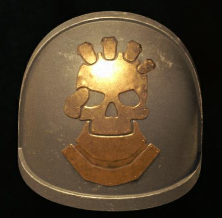
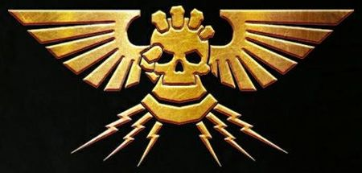
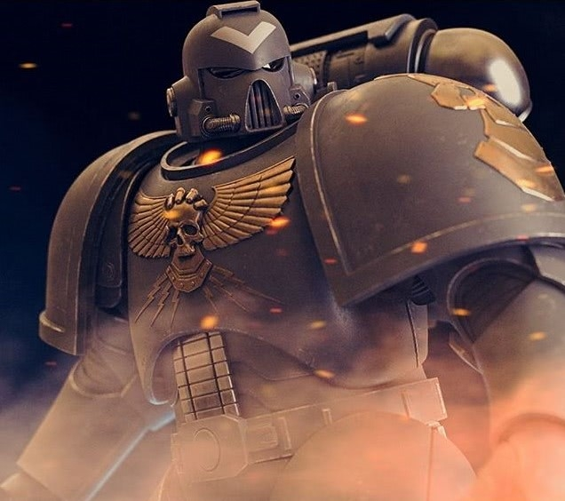
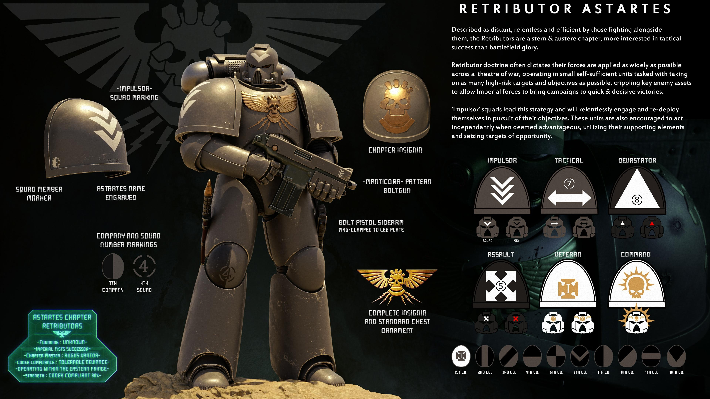
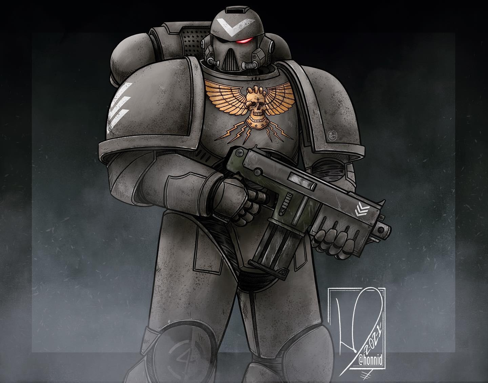

# 0320 天罚行者 Retributors

精校状态：中文行文已逐段精校，部分术语仍为暂定

分类：通用概念 / 帝国 Imperium / 中央政务部 Adeptus Terra / 阿斯塔特修会 Adeptus Astartes

原文来源：https://www.bilibili.com/opus/1157560215322755077

原作者：帝国神选罐头

原文时间：编辑于 2026年05月01日 13:46

[返回分类目录](目录.md) · [全书目录](../../目录.md)

原篇名：惩戒者 Retributors

<!-- A0320-B0001 -->
**英文原文**

The Retributors are a Chapter of Space Marines that has faced against many threats to the Imperium of Man, including hordes of foes, cunning witchcraft, and terrifying unknown technologies.

<!-- /A0320-B0001 -->

<!-- A0320-B0002 -->

原译文

惩戒者是星际战士的一个战团，他们面临着人类帝国的许多威胁，包括成群的敌人、狡猾的巫术和可怕的未知技术。

**校订译文**

天罚行者是一个星际战士战团，曾迎战各种威胁人类帝国的敌人，包括蜂拥而至的大军、阴险的巫术，以及可怕的未知技术。

**校注：** 本稿按全书核心定译将 Retributors 统一为天罚行者；原篇译名惩戒者保留在原译对照中。

<!-- /A0320-B0002 -->

<!-- A0320-B0003 图片 -->

<!-- A0320-B0004 -->
## Known Engagements 已知交战

<!-- /A0320-B0004 -->

<!-- A0320-B0005 -->
**英文原文**

482.M39 - Hunting the leaders of the Argosa Uprisings.

<!-- /A0320-B0005 -->

<!-- A0320-B0006 -->

原译文

追捕阿尔戈萨叛乱的领导人。

**校订译文**

482.M39：追捕阿尔戈萨叛乱的首领。

<!-- /A0320-B0006 -->

<!-- A0320-B0007 图片 -->

<!-- A0320-B0008 -->

原译文

Full insignia. Seen used on chest piece of armour 完全徽章。出现在胸甲上

**校订译文**

Full insignia. Seen used on chest piece of armour 完整徽章，可见于护甲的胸甲部分。

<!-- /A0320-B0008 -->

<!-- A0320-B0009 -->
## Trivia 琐事

<!-- /A0320-B0009 -->

<!-- A0320-B0010 -->
**英文原文**

The Retributors were created by Syama Pederson for the fan film Astartes. They were purely a fan work until 2021, when Games Workshop gave the Astartes project official support.

<!-- /A0320-B0010 -->

<!-- A0320-B0011 -->

原译文

惩戒者由夏玛·佩德森为粉丝电影《阿斯塔特》创作。它们纯粹是粉丝的作品直到2021年，当Games Workshop为阿斯塔特项目提供官方支持时。

**校订译文**

天罚行者由夏玛·佩德森为同人影片《阿斯塔特》创作。起初，他们完全属于同人创作；2021年，Games Workshop 开始为《阿斯塔特》项目提供官方支持。

<!-- /A0320-B0011 -->

<!-- A0320-B0012 图片 -->

<!-- A0320-B0013 -->

原译文

Note 1 注释1

**校订译文**

Note 1 注释1

<!-- /A0320-B0013 -->

<!-- A0320-B0014 -->
**英文原文**

The creator, Syama Pederson, has delved further into the lore of the Chapter on his Patreon, including their founding chapter and background. Since he has done so in his private capacity and not in his role as an associate of Games Workshop this information cannot be regarded as officially endorsed by the company. According to the information given on Patreon the Retributors are descendants of the Imperial Fists and are fleet-based, the Chapter Master is Augustus Vantor. Their exact strength is not stated but described as Codex compliant with tolerable deviance. The Retributors' specialty is shock assault and high-risk targeting. They operate primarily along the Eastern Fringe.

<!-- /A0320-B0014 -->

<!-- A0320-B0015 -->

原译文

创作者夏玛·佩德森进一步深入研究了关于他的Patreon的战团的传说，包括他们的建军战团和背景。由于他是以个人身份这样做的，而不是作为GW的合伙人，因此这些信息不能被视为公司的官方认可。根据Patreon上提供的信息，惩戒者是帝国之拳的后裔，舰基，战团长是奥古斯都·万托尔。它们的确切力量没有说明，但被描述为符合圣典的可容忍偏差。惩戒者的专长是突击和高风险目标。他们主要在东部边缘活动。

**校订译文**

创作者夏玛·佩德森曾在自己的 Patreon 页面上进一步介绍天罚行者的设定，包括始祖战团与背景。由于这些内容以他个人身份发表，而非代表 Games Workshop 合作者的身份，因此不能视为得到该公司的官方认可。按 Patreon 上的介绍，天罚行者是帝国之拳的后裔，以舰队为基地，战团长为奥古斯都·万托尔。其确切兵力未予公布，仅称编制大体遵循《圣典》，偏差在可容许的范围内。战团擅长震撼突击与打击高风险目标，主要活动于银河东部边缘。

**校注：** 本段是原作者明确区分的个人 Patreon 补充设定；保留“未经公司官方认可”的来源限定，未将其列为官设认证。

<!-- /A0320-B0015 -->

<!-- A0320-B0016 图片 -->

<!-- A0320-B0017 -->
**英文原文**

Described as relentless, efficient, and distant, they are known for their stern and austere nature who are more interested in battlefield success than glory. Their doctrine maintains that their forces are applied as widely as possible across a theatre, operating in small self-sufficient units tasked with eliminating as many as high-risk targets as possible. Their "Impulsor" Squads are leaders in this strategy and are known to work in a highly independent fashion with other supporting Imperial elements.

<!-- /A0320-B0017 -->

<!-- A0320-B0018 -->

原译文

他们被描述为无情、高效、疏远，以其严厉而严肃的性格而闻名，他们更感兴趣的是战场上的成功而不是荣耀。他们的理论认为，他们的部队在整个战场尽可能广泛地应用，在小型自给自足的单位中作战，任务是消灭尽可能多的高风险目标。他们的“冲击者”小队是这一战略的领导者，以高度独立的方式与其他支援的帝国成员合作而闻名。

**校订译文**

天罚行者被形容为冷酷、高效而疏离，以严厉朴素的作风著称，比起荣耀更重视实际战果。他们的作战理念是将兵力尽可能广泛地分布在整个战区，以能够独立维持行动的小型单位作战，尽量消灭更多高风险目标。“冲击者”小队是执行这一战略的中坚，通常在高度自主的状态下与帝国其他支援部队协同。

**校注：** Impulsor 在此为惩戒者的特殊小队名称，不与同名星际战士载具强行合并。

<!-- /A0320-B0018 -->

<!-- A0320-B0019 图片 -->

本篇核心术语与暂定项

以下列出本篇出现的英文原形及核心术语表用词。同形词可能指不同对象，具体词义以本篇正文和校注为准；单复数、别名和仅见于图注的名称可能尚未列入。完整候选见[术语表](../../术语表/双语术语候选.csv)。

| 英文 | 采用中文 | 状态 |
| --- | --- | --- |
| Space Marines | 星际战士 | 官方已核对 |
| Imperium of Man | 人类帝国 | 官方已核对 |
| Imperium | 帝国 | 暂定·简称 |
| Imperial Fists | 帝国之拳 | 暂定 |
| Eastern Fringe | 东部边缘 | 暂定·官方待核 |
| Master | 导师（审判庭职衔）／舰务官（舰员职务） | 语境定译·官方待核 |
| Founding | 建军 | 暂定·官方待核 |
| Chapter | 战团 | 暂定·官方待核 |
| Chapter Master | 战团长 | 暂定·官方待核 |
| Impulsor | 脉冲战车（载具）／冲击者（小队名） | 语境定译·载具官译已核 |
| Retributors | 天罚行者 | 暂定·官方待核 |
| Games Workshop | Games Workshop | 暂定·官方待核 |

