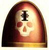
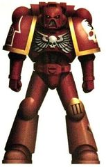
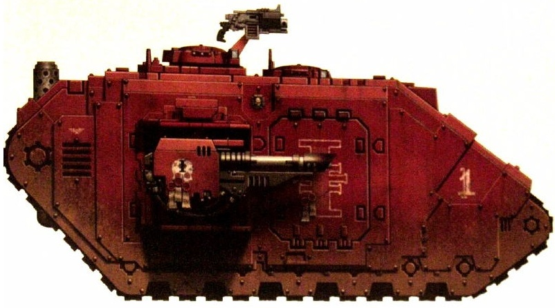
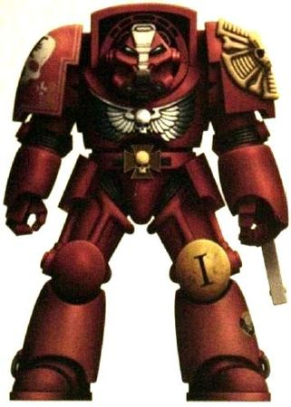
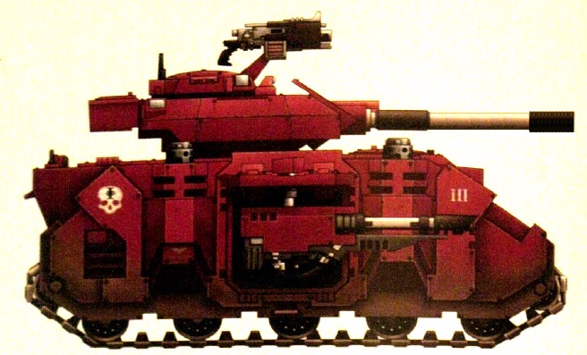

# 0322 红色猎手 Red Hunters

精校状态：中文行文已逐段精校，部分术语仍为暂定

分类：通用概念 / 帝国 Imperium / 中央政务部 Adeptus Terra / 阿斯塔特修会 Adeptus Astartes

原文来源：https://www.bilibili.com/opus/1210387067545059361

原作者：帝国神选罐头

原文时间：2026年06月05日 18:00

[返回分类目录](目录.md) · [全书目录](../../目录.md)

<!-- A0322-B0001 -->
**英文原文**

The Red Hunters are a Space Marine Chapter with ties to the Inquisition (as shown by the Inquisition symbol on their armour).

<!-- /A0322-B0001 -->

<!-- A0322-B0002 -->

原译文

红色猎手是一个与审判庭有联系的星际战士战团（如他们盔甲上的审判庭标志所示）。

**校订译文**

红色猎手是一个与审判庭有联系的星际战士战团（如他们盔甲上的审判庭标志所示）。

<!-- /A0322-B0002 -->

<!-- A0322-B0003 图片 -->

<!-- A0322-B0004 图片 -->

<!-- A0322-B0005 图片 -->

<!-- A0322-B0006 -->
**英文原文**

Homeworld:Montsegnur

<!-- /A0322-B0006 -->

<!-- A0322-B0007 -->

原译文

家园世界：蒙塞格努尔

**校订译文**

家园世界：蒙塞格努尔

<!-- /A0322-B0007 -->

<!-- A0322-B0008 -->
**英文原文**

Colours:Red armour with white squad specialty symbol; pauldron trim shows Company colours.

<!-- /A0322-B0008 -->

<!-- A0322-B0009 -->

原译文

配色：红色盔甲，白色小队特殊标志；肩甲边缘显示了连队颜色。

**校订译文**

配色：红色护甲，配白色小队职能标志；肩甲镶边采用所属连队的颜色。

<!-- /A0322-B0009 -->

<!-- A0322-B0010 -->
**英文原文**

Specialty:Inquisitorial Service

<!-- /A0322-B0010 -->

<!-- A0322-B0011 -->

原译文

专长：审判官服务

**校订译文**

专长：为审判庭执行任务。

<!-- /A0322-B0011 -->

<!-- A0322-B0012 -->
## Background & Chapter Cult 背景与战团信仰

原题：Background & Chapter Cult 背景&战团教派

<!-- /A0322-B0012 -->

<!-- A0322-B0013 -->
**英文原文**

The Red Hunters are one of the rare chapters whose Chapter Cult openly worships the Emperor of Mankind as a god. Their uniform is red, with a white skull with a black Inquisition symbol on its head as a Chapter badge.

<!-- /A0322-B0013 -->

<!-- A0322-B0014 -->

原译文

红色猎手是少有的战团教派公开将人类帝皇尊为神的战团之一。他们的制服是红色的，有一个白色的颅骨，上有一个黑色的审判庭标志，作为战团徽章。

**校订译文**

红色猎手属于少数公开奉人类帝皇为神的星际战士战团。他们采用红色涂装，战团徽章为一颗白色颅骨，额头绘有黑色审判庭标记。

<!-- /A0322-B0014 -->

<!-- A0322-B0015 图片 -->

<!-- A0322-B0016 -->

原译文

Red Hunters Land Raider that belongs to the 1st Company. This transport was used during the assault upon the Cardinal Gate 属于第一连队的红色猎手兰德掠袭者。这辆运输车是在袭击红衣主教之门时使用的

**校订译文**

Red Hunters Land Raider that belongs to the 1st Company. This transport was used during the assault upon the Cardinal Gate 红色猎手第一连的一辆兰德掠袭者战车，曾用于进攻枢机之门。

<!-- /A0322-B0016 -->

<!-- A0322-B0017 -->
**英文原文**

So strong is the link between this Chapter and the three great Inquisitorial orders that rumours abound that they had been founded at the request of the Inquisitorial Representative on Terra, and that there was a secret pact between the Inquisition and the Chapter for mutual support. The Chapter is tied to the Inquisition by ancient bonds of honour and duty and are often called upon to face the servants of the Ruinous Powers and other fell enemies of Mankind. Fighting in Inquisitorial strike forces and providing protection for the most senior Inquisitor-Lords, the Red Hunters have confronted numerous horrors no mortals can face and be allowed to live should they survive, lest they taint others.

<!-- /A0322-B0017 -->

<!-- A0322-B0018 -->

原译文

战团与三大审判庭修会之间的联系如此紧密，以至于谣言四起，他们是应泰拉上的审判庭代表的要求而建军的，审判庭和战团之间有一项相互支持的秘密协议。战团与审判庭有着古老的荣誉和责任纽带，经常被要求面对毁灭力量之仆和其他人类的堕落之敌。在审判庭打击部队中战斗，并为最高级的审判官领主提供保护，红色猎手面临着没有凡人能面对的恐怖，即便他们幸存下来，也不能让他们活着，以免污染他人。

**校订译文**

红色猎手与审判庭三大分支联系极为紧密，因此有许多传闻称，战团是应泰拉审判庭代表的要求建立的，双方还缔结了互相支援的秘密协议。古老的荣誉与责任将他们同审判庭紧密相连，战团常受召对抗混沌诸神的仆从及其他邪恶的人类之敌。无论是加入审判庭打击部队，还是保护最高阶的审判官领主，红色猎手都曾面对无数可怖存在。凡人一旦目睹这些恐怖，即使幸存也通常不获准继续活着，以免将污染传给他人。

<!-- /A0322-B0018 -->

<!-- A0322-B0019 -->
**英文原文**

When forces serve alongside certain units of the Inquisition, many witness the full horror of a daemonic incursion or similar phenomenon. When those of the Imperial Guard or similar types of Imperial warriors witness such things, a common protocol that is utilised is that they are often put to death soon after, a mercy considering the corruption and insanity that will inevitably have taken root in their mortal hearts. As such, Chapter's line brethren are routinely subjected to a mnemonic purgation ("mind-wipe") rite, a protocol that preserves their souls and their physical abilities, albeit at the cost of their memories, skills, experience and personality. This makes them an even more valuable weapon in the hands of the secretive and often necessarily brutal Inquisition.

<!-- /A0322-B0019 -->

<!-- A0322-B0020 -->

原译文

当部队与审判庭的某些单位并肩作战时，许多人目睹了恶魔入侵或类似现象的全部恐怖。当帝国卫队或类似类型的帝国战士目睹这些事情时，一个常见的规程是，他们经常很快被处死，考虑到腐化和疯狂将不可避免地在他们凡人之心中扎根，这是一种仁慈。因此，战团的兄弟经常受到记忆净化（“思维抹除”）仪式的约束，这是一种保护他们的灵魂和身体能力的规程，尽管是以牺牲他们的记忆、技能、经验和个性为代价的。这使得他们在秘密且往往残酷的审判庭手中成为更有价值的武器。

**校订译文**

与审判庭某些部队并肩作战时，许多战士会亲眼目睹恶魔入侵或类似现象的全部恐怖。帝国卫队及其他凡人部队若有这种经历，常见处置是战后不久即被处死；在执行者看来，腐化与疯狂必将在凡人的心灵中扎根，因此死亡反倒是一种仁慈。红色猎手的普通战斗兄弟则会例行接受记忆净化，即“思维抹除”仪式。这种程序保存他们的灵魂与身体能力，却抹去记忆、技能、经验与个性，也使他们成为秘密行事、往往认为自己必须采取残酷手段的审判庭手中更有价值的武器。

**校注：** 本段处决与记忆净化的理由是原资料对审判庭做法的叙述，未改写为普遍有效的事实判断。

<!-- /A0322-B0020 -->

<!-- A0322-B0021 图片 -->

<!-- A0322-B0022 -->

原译文

Red Hunters veteran wearing Tactical Dreadnought Armour 穿战术无畏盔甲的红色猎手老兵

**校订译文**

Red Hunters veteran wearing Tactical Dreadnought Armour 穿战术无畏盔甲的红色猎手老兵

<!-- /A0322-B0022 -->

<!-- A0322-B0023 -->
## Notable Battles 著名战斗

<!-- /A0322-B0023 -->

<!-- A0322-B0024 -->

原译文

688.M40: The Second Abonian Genocide 第二次阿博尼安种族灭绝

**校订译文**

688.M40: The Second Abonian Genocide 第二次阿博尼安种族灭绝

<!-- /A0322-B0024 -->

<!-- A0322-B0025 -->
**英文原文**

444.M41: First War for Armageddon — in the aftermath of the war, the Red Hunters were called to aid the Inquisition in purging the Imperial survivors. At the climax of the series of clashes between the Inquisition and Space Wolves known as the Months of Shame, the Red Hunters' entire chapter fleet under the command of Chapter Master Daemar was mobilized at the behest of Lord Inquisitor Ghesmei Kysnaros to besiege the Wolves homeworld of Fenris.

<!-- /A0322-B0025 -->

<!-- A0322-B0026 -->

原译文

第一次阿玛吉多顿战争 — 战争结束后，红色猎手被召集来协助审判庭清洗帝国幸存者。在被称为耻辱之月的审判庭和太空野狼之间的一系列冲突达到高潮时，在领主审判官盖斯梅·基斯纳罗斯的命令下，红色猎手在战团长戴玛尔的指挥下动员了整个战团舰队，围攻野狼的家园世界芬里斯。

**校订译文**

444.M41：第一次阿玛吉多顿战争——战后，红色猎手奉召协助审判庭清洗帝国一方的幸存者。审判庭与太空野狼随后爆发一连串冲突，史称“耻辱之月”。冲突达到顶峰时，应审判官领主盖斯梅·基斯纳罗斯之命，战团长戴玛尔率红色猎手整个战团舰队出动，围攻太空野狼的家园世界芬里斯。

<!-- /A0322-B0026 -->

<!-- A0322-B0027 -->

原译文

742.M41: The Damocles Crusade 达摩克利斯远征

**校订译文**

742.M41: The Damocles Crusade 达摩克利斯远征

<!-- /A0322-B0027 -->

<!-- A0322-B0028 -->
**英文原文**

812-830.M41: Siege of Vraks — The Siege of Vraks saw the deployment of a significant force of Red Hunters, centered around the 3rd Company. The entire force was never deployed as a single unit and were often divided amongst Ordo Malleus Inquisitors to act as an elite cadre of shock troops for their operations. Hence, squads and vehicles could be found just about anywhere along the front, with Red Hunters being present in small numbers at most major battles until the end of the campaign. The Red Hunters saw extensive action during the final stages of the Siege of Vraks, mainly in offensive actions against the final renegade stronghold, the Citadel. A particularly dark day for the chapter saw roughly 150 brothers of the chapter perform an ill-fated drop pod assault on the Armoury Gate, which led to the citadel's undercroft. Unfortunately they were beset by a Chaos Reaver Battle Titan of the Legio Vulcanum and hordes of archenemy soldiers. Despite attempts by the 269th Death Korps Siege Regiment's efforts to breach the gate and provide an escape route for the Red Hunters trapped in the "Death Pit", the entire force was destroyed to a man. The Red Hunters saw action once again alongside Lord Inquisitor Hector Rex, brother Astartes of the Grey Knights Chapter, and Krieg Grenadiers of the 158th and 150th regiments. This engagement would be more successful than the assault on the Armoury Gate and see the Cardinal Gate breached and the Bloodthirster An'ggrath banished back to the warp. The final engagements also saw the deployment of Red Hunters Terminator Squads. They were critical in aiding the Death Korps Engineers' efforts to clear the Undercroft. The 3rd Squad of 1st Company, Squad Zokura, achieved a kill-to-death ratio of 97:1 during this operation.

<!-- /A0322-B0028 -->

<!-- A0322-B0029 -->

原译文

弗拉克斯围城 — 弗拉克斯围城部署了一支以第三连队为中心的重要红色猎手分遣队。整个部队从未作为一个单一的单位部署，经常被分配给圣锤修会审判官，作为其精英突击部队行动。因此，在前线的任何地方都可以找到小队和载具，在大多数重大战斗中，直到战役结束，红色猎手都会少量出现。红色猎手在弗拉克斯围城的最后阶段看到了广泛的行动，主要是对最后一个叛徒据点，城堡的进攻行动。在一个特别黑暗的日子里，战团大约有150名兄弟对军械库之门进行了不幸的空投舱突击，最终通向了城堡的地下室。不幸的是，他们被火神军团的混沌掠夺者泰坦和成群的死敌部落士兵所包围。尽管第269死亡军团攻城兵团试图突破大门，为被困在“死亡坑”中的红色猎手提供逃生路线，但整个部队还是被摧毁了。红色猎手再次与领主审判官赫克托·雷克斯、灰骑士战团的兄弟阿斯塔特以及第158和150兵团的克里格掷弹兵并肩作战。这次交战比袭击军械库之门更成功，红衣主教之门被攻破，嗜血狂魔安'格拉斯被放逐回亚空间。在最后的交战中，还部署了红色猎手终结者小队。他们在协助死亡军团工兵清除地下室的努力中发挥了关键作用。在这次行动中，第一连队第三小队佐库拉小队的杀伤率达到了97:1。

**校订译文**

812—830.M41：弗拉克斯围城战——红色猎手投入了一支以第三连为核心的大规模部队。这支力量从未集中部署，而是经常分派给各位恶魔审判庭审判官，作为执行任务的精锐突击兵力。因此，前线各处都可见红色猎手小队与载具；直到战役结束，他们都以较小规模参加了多数重要战斗。围城战最后阶段，红色猎手参与大量进攻，主要目标是叛军最后的据点——内堡。战团曾遭逢极为惨痛的一天：约一百五十名战斗兄弟乘空降舱突袭通往内堡地下区的军械库之门，却被火神泰坦军团的一台混沌掠夺者战斗泰坦及大批宿敌士兵围困。克里格死亡军团第269攻城团虽尝试攻破大门，为陷入“死亡坑”的红色猎手打开退路，但这支部队仍全军覆没，无一生还。此后，红色猎手与审判官领主赫克托·雷克斯、灰骑士战团的阿斯塔特兄弟，以及第158和第150团的克里格掷弹兵再次并肩作战。这次行动比军械库之门的突袭更为成功：枢机之门被攻破，嗜血狂魔安'格拉斯被放逐回亚空间。最后阶段的战斗还投入了红色猎手终结者小队，他们对死亡军团工兵清剿内堡地下区至关重要。第一连第三小队，即佐库拉小队，在此次行动中取得了97∶1的击杀与阵亡人数之比。

<!-- /A0322-B0029 -->

<!-- A0322-B0030 -->
**英文原文**

915.M41: Start of The Red Hunt — The Chapter was ordered to shadow the penitent crusades of the three rebel Chapters sided with Astral Claws during the Badab War. The order was given by the Inquisitional Representative and it was also ratified by Senatorum Imperialis.

<!-- /A0322-B0030 -->

<!-- A0322-B0031 -->

原译文

红色狩猎开始 — 在巴达布战争期间，该战团被命令为支持星辰之爪的三个变节战团的忏悔远征提供跟踪。该命令由审判庭代表下达，并得到了帝国参议院的批准。

**校订译文**

915.M41：红色狩猎开始——审判庭代表下令，并经帝国参议院批准，命红色猎手尾随监视三个变节战团的忏悔远征。这三个战团都曾在巴达布战争中支持星辰之爪。

<!-- /A0322-B0031 -->

<!-- A0322-B0032 -->
**英文原文**

956.M41: Following The Red Hunt, a full task force of the Red Hunters, several high-ranking Inquisitors and their retinues vanished during the tracking the Mantis Warriors near the moons of Lomea. Their fate is still unknown and the Mantis Warriors have not shared any information about that despite subsequent investigations.

<!-- /A0322-B0032 -->

<!-- A0322-B0033 -->

原译文

在红色狩猎之中，一支由红色猎手组成的满编特遣部队，几名高级审判官及其随从在洛米亚的卫星附近追踪螳螂勇士时消失了。他们的命运仍然未知，尽管随后进行了调查，但螳螂勇士没有分享任何相关信息。

**校订译文**

956.M41：在红色狩猎之后，红色猎手的一支完整特遣部队，连同数位高级审判官及其随从，在洛米亚诸卫星附近追踪螳螂勇士时失踪。他们的下落至今不明；尽管事后有人展开调查，螳螂勇士仍未提供任何相关信息。

**校注：** 英文写 Following The Red Hunt，与上文“红色狩猎开始”及持续跟踪的时序略显不明；暂忠实保留“之后”，不改造成确定的行动阶段。

<!-- /A0322-B0033 -->

<!-- A0322-B0034 -->
**英文原文**

993.M41: Following The Red Hunt, Red Hunters suffered losses fighting the Tyranids of Hive Fleet Kraken alongside the Lamenters Chapter, whose penitent crusade the Red Hunters were assigned to track.

<!-- /A0322-B0034 -->

<!-- A0322-B0035 -->

原译文

在红色狩猎之中，红色猎手在和恸哭者战团并肩与虫巢舰队克拉肯的泰伦作战时遭受了损失，他们被指派追踪恸哭者的忏悔远征。

**校订译文**

993.M41：在红色狩猎之后，红色猎手奉命跟踪恸哭者的忏悔远征，并在与该战团共同对抗克拉肯虫巢舰队的泰伦时蒙受损失。

**校注：** 同段英文用 Following The Red Hunt；保留源文时序，不擅自判定红色狩猎确切结束年份。

<!-- /A0322-B0035 -->

<!-- A0322-B0036 -->
**英文原文**

999.M41: Campaign against the Night Reapers.

<!-- /A0322-B0036 -->

<!-- A0322-B0037 -->

原译文

对抗午夜收割者的战役。

**校订译文**

999.M41：参加对抗暗夜收割者的战役。

<!-- /A0322-B0037 -->

<!-- A0322-B0038 -->
**英文原文**

Late M41, date unknown: The Red Hunters fought alongside the White Scars and Celestial Lions Chapters to purge the third moon of Woebetide from an Enslaver plague.

<!-- /A0322-B0038 -->

<!-- A0322-B0039 -->

原译文

红色猎手与白色伤疤和天狮战团并肩作战，以清除沃拜泰德的第三个月亮上的奴役者瘟疫。

**校订译文**

第41千年晚期，具体日期不明：红色猎手与白疤、天狮战团共同作战，清除沃拜泰德第三颗卫星上的奴役者灾患。

<!-- /A0322-B0039 -->

<!-- A0322-B0040 -->
## Organisation 组织

<!-- /A0322-B0040 -->

<!-- A0322-B0041 -->
**英文原文**

Although still a Chapter of Space Marines that look to the Codex Astartes for its organisation and spiritual guidance, the Chapter makes their squads available for rapid responses to Inquisitorial calls for assistance. Often times, an honour guard of Red Hunters squads are called forward to the frontlines to provide personal protection to high ranking Inquisitor Lords.

<!-- /A0322-B0041 -->

<!-- A0322-B0042 -->

原译文

尽管星际战士战团仍然是一个依靠阿斯塔特圣典进行组织和精神指导的战团，但该战团使他们的小队能够快速响应审判庭的援助呼吁。经常，红色猎人的荣誉卫队小队被召集到前线，为高级审判官领主提供个人保护。

**校订译文**

红色猎手仍以《阿斯塔特圣典》作为编制及精神上的准则，同时保持各小队能够迅速响应审判庭的求援。他们经常抽调小队组成荣誉卫队，前往前线贴身保护高阶审判官领主。

<!-- /A0322-B0042 -->

<!-- A0322-B0043 图片 -->

<!-- A0322-B0044 -->

原译文

An example of a Red Hunters Predator Destructor. These vehicles formed the backbone of the Chapter's deployment to Vraks 红色猎手掠食者破坏者的一个例子。这些载具构成了战团在弗拉克斯部署的支柱

**校订译文**

An example of a Red Hunters Predator Destructor. These vehicles formed the backbone of the Chapter's deployment to Vraks 红色猎手的一辆破坏者型掠食者战车。这类载具构成了战团在弗拉克斯部署兵力的骨干。

<!-- /A0322-B0044 -->

<!-- A0322-B0045 -->
## Chapter Elements 战团单位

原题：Chapter Elements 战团成员

<!-- /A0322-B0045 -->

<!-- A0322-B0046 -->
## Notable Vessels 著名战舰

<!-- /A0322-B0046 -->

<!-- A0322-B0047 -->
**英文原文**

In Sacred Trust - Battle Barge. Took part in the Months of Shame.

<!-- /A0322-B0047 -->

<!-- A0322-B0048 -->

原译文

神圣信任号 - 战斗驳船。参加了耻辱之月。

**校订译文**

神圣信任号 - 战斗驳船。参加了耻辱之月。

<!-- /A0322-B0048 -->

<!-- A0322-B0049 -->
**英文原文**

Purity of Loyalty - Strike Cruiser. Took part in the Months of Shame, destroyed during the final battle in Fenris' orbit.

<!-- /A0322-B0049 -->

<!-- A0322-B0050 -->

原译文

忠诚纯净号 - 打击巡洋舰。参加了耻辱之月，在芬里斯轨道上的最后一场战斗中被摧毁。

**校订译文**

忠诚纯净号 - 打击巡洋舰。参加了耻辱之月，在芬里斯轨道上的最后一场战斗中被摧毁。

<!-- /A0322-B0050 -->

<!-- A0322-B0051 -->
## Notable Named Vehicles 著名命名载具

<!-- /A0322-B0051 -->

<!-- A0322-B0052 -->
**英文原文**

Secutor Crimson — Caestus Assault Ram.

<!-- /A0322-B0052 -->

<!-- A0322-B0053 -->

原译文

追击深红号 — 拳套突击艇

**校订译文**

追击深红号 — 拳套突击艇

<!-- /A0322-B0053 -->

<!-- A0322-B0054 -->
## Notable Members 著名成员

<!-- /A0322-B0054 -->

<!-- A0322-B0055 -->
**英文原文**

Daemar — Chapter Master at the time of the First War for Armageddon.

<!-- /A0322-B0055 -->

<!-- A0322-B0056 -->

原译文

戴玛尔 — 第一次阿玛吉多顿战争时期的战团长

**校订译文**

戴玛尔 — 第一次阿玛吉多顿战争时期的战团长

<!-- /A0322-B0056 -->

<!-- A0322-B0057 -->
**英文原文**

Isar Korvinus — Captain of Fourth Company.

<!-- /A0322-B0057 -->

<!-- A0322-B0058 -->

原译文

伊萨尔·科维努斯 — 第四连队连长

**校订译文**

伊萨尔·科维努斯 — 第四连队连长

<!-- /A0322-B0058 -->

<!-- A0322-B0059 -->
**英文原文**

Targus — Techmarine. Took part in the Damocles Crusade.

<!-- /A0322-B0059 -->

<!-- A0322-B0060 -->

原译文

塔格斯 — 技术军士，参加达摩克利斯远征

**校订译文**

塔格斯——科技战士，曾参加达摩克利斯远征。

<!-- /A0322-B0060 -->

本篇核心术语与暂定项

以下列出本篇出现的英文原形及核心术语表用词。同形词可能指不同对象，具体词义以本篇正文和校注为准；单复数、别名和仅见于图注的名称可能尚未列入。完整候选见[术语表](../../术语表/双语术语候选.csv)。

| 英文 | 采用中文 | 状态 |
| --- | --- | --- |
| Space Marines | 星际战士 | 官方已核对 |
| Grey Knights | 灰骑士 | 官方已核对 |
| Space Wolves | 太空野狼 | 官方已核对 |
| Imperial Guard | 帝国卫队 | 暂定·语境区分 |
| Tyranids | 泰伦虫族 | 官方已核对 |
| Terminator | 终结者 | 官方已核对 |
| Warp | 亚空间 | 官方已核对 |
| Inquisition | 审判庭 | 暂定 |
| Inquisitor | 审判官 | 官方已核对 |
| Enslaver | 奴役者 | 暂定 |
| Ordo Malleus | 恶魔审判庭 | 用户指定 |
| Techmarine | 科技战士 | 官方已核对 |
| Emperor of Mankind | 人类帝皇 | 暂定 |
| Emperor | 帝皇 | 官方已核对 |
| Battle Barge | 战斗驳船 | 暂定·官方待核 |
| The Order | 秩序 | 暂定·官方待核 |
| Terra | 泰拉 | 暂定·官方待核 |
| Damocles Crusade | 达摩克利斯远征 | 暂定·官方待核 |
| Armageddon | 阿玛吉多顿 | 暂定·官方待核 |
| Badab | 巴达布 | 暂定·官方待核 |
| Fenris | 芬里斯 | 暂定·官方待核 |
| Titan | 泰坦 | 暂定·官方待核 |
| Clear | 清明 | 暂定·官方待核 |
| Inquisitorial Representative | 审判庭代表 | 暂定 |
| Master | 导师（审判庭职衔）／舰务官（舰员职务） | 语境定译·官方待核 |
| Cardinal | 红衣主教 | 暂定 |
| Ancient | 旗手 | 官方已核对 |
| Drop Pod | 空降舱 | 官方已核·中英对照 |
| Cadre | 骨干连（寂静修女）／核心队（钛族） | 语境定译·钛族词根参考 |
| Night Reapers | 暗夜收割者 | 暂定·官方待核 |
| Honour Guard | 荣誉卫队 | 暂定·官方待核 |
| White Scars | 白疤 | 官方已核 |
| Scars | 伤疤 | 暂定·官方待核 |
| Penitent | 忏悔 | 暂定·官方待核 |
| Space Marine | 星际战士 | 暂定·官方待核 |
| Chapter | 战团 | 暂定·官方待核 |
| Chapter Master | 战团长 | 暂定·官方待核 |
| Captain | 连长 | 暂定·官方待核 |
| Brother | 修士 | 暂定·官方待核 |
| Chapter cult | 战团教派 | 暂定·官方待核 |
| Codex Astartes | 阿斯塔特圣典 | 暂定·官方待核 |
| Mantis Warriors | 螳螂勇士 | 暂定·官方待核 |
| Lamenters | 恸哭者 | 暂定·官方待核 |
| Celestial Lions | 天狮 | 暂定·官方待核 |
| The Months of Shame | 耻辱之月 | 暂定·官方待核 |
| Armoury | 军械库 | 暂定·官方待核 |
| Red Hunters | 红色猎手 | 暂定·官方待核 |
| Strike Cruiser | 打击巡洋舰 | 暂定·官方待核 |
| Caestus Assault Ram | 拳套突击撞击艇 | 暂定·官方待核 |
| Terminator Squads | 终结者小队 | 暂定·官方待核 |
| Mortal | 凡人 | 暂定·官方待核 |
| Cardinal Gate | 枢机之门 | 暂定·官方待核 |
| Powers | 能天使 | 暂定·官方待核 |
| Enslaver Plague | 奴役者瘟疫 | 暂定·官方待核 |
| Bloodthirster | 嗜血狂魔 | 官方已核对 |
| Ruinous Powers | 毁灭诸力 | 暂定·官方待核 |
| Imperialis | 帝国徽记 | 暂定·官方待核 |
| Ghesmei Kysnaros | 盖斯梅·凯斯纳罗斯 | 暂定·官方待核 |
| Mercy | 仁慈 | 暂定·官方待核 |
| Krieg | 克里格 | 暂定·官方待核 |
| Daemar | 戴玛尔 | 暂定·官方待核 |
| Astral Claws | 星辰之爪 | 暂定·官方待核 |
| Corruption | 腐败 | 暂定·官方待核 |
| Secutor Crimson | 绯红追击者号 | 暂定·官方待核 |
| Kraken | 克拉肯 | 暂定·官方待核 |

