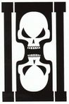
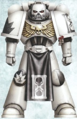
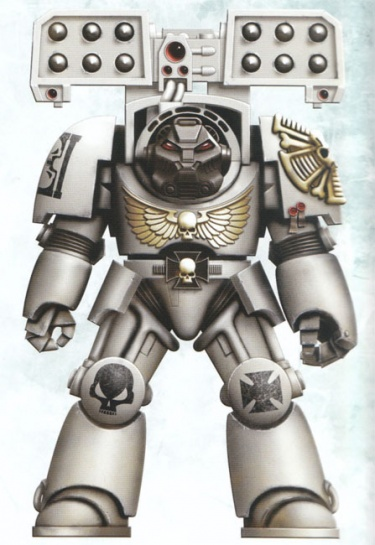
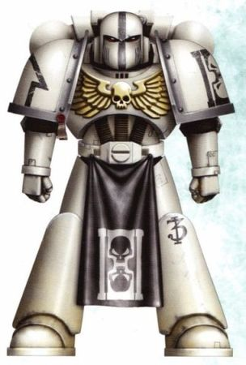
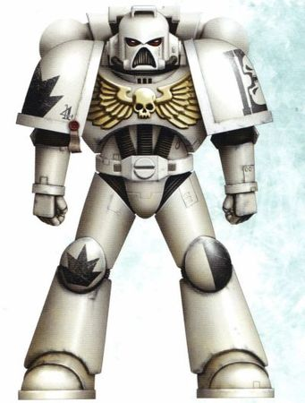
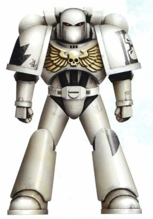
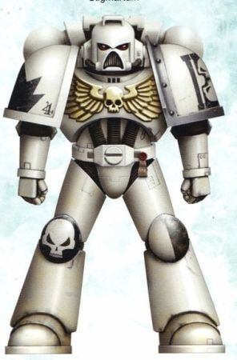
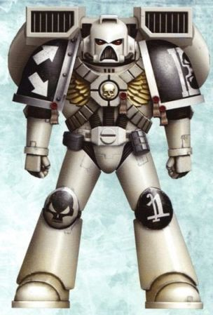
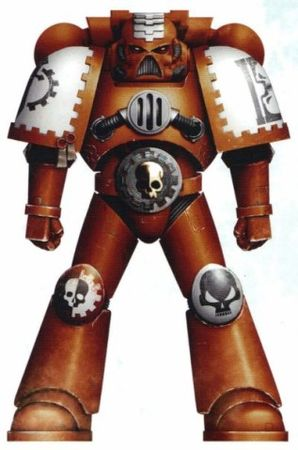

# 0323 星辰幻影 Star Phantoms

精校状态：中文行文已逐段精校，部分术语仍为暂定

分类：通用概念 / 帝国 Imperium / 中央政务部 Adeptus Terra / 阿斯塔特修会 Adeptus Astartes

原文来源：https://www.bilibili.com/opus/1210394802757042180

原作者：帝国神选罐头

原文时间：2026年06月05日 18:30

[返回分类目录](目录.md) · [全书目录](../../目录.md)

<!-- A0323-B0001 -->
**英文原文**

The Star Phantoms are a loyalist Space Marine Chapter who played a pivotal part in the Badab War.

<!-- /A0323-B0001 -->

<!-- A0323-B0002 -->

原译文

星辰幻影是一支忠诚派星际战士战团，在巴达布战争中发挥了关键作用。

**校订译文**

星辰幻影是一支忠诚派星际战士战团，在巴达布战争中发挥了关键作用。

<!-- /A0323-B0002 -->

<!-- A0323-B0003 图片 -->

<!-- A0323-B0004 图片 -->

<!-- A0323-B0005 -->
**英文原文**

Founding Chapter:Unknown, speculated Dark Angels but both chapters deny this

<!-- /A0323-B0005 -->

<!-- A0323-B0006 -->

原译文

建军战团：未知，推测黑暗天使，但两个战团都否认这一点

**校订译文**

始祖战团：不明；有人推测为黑暗天使，但双方均予以否认。

<!-- /A0323-B0006 -->

<!-- A0323-B0007 -->
**英文原文**

Founding:23rd (Sentinel) Founding, circa M38

<!-- /A0323-B0007 -->

<!-- A0323-B0008 -->

原译文

建军时间：第23次(警戒)建军，大约M38

**校订译文**

建军时间：第23次(警戒)建军，大约M38

<!-- /A0323-B0008 -->

<!-- A0323-B0009 -->
**英文原文**

Homeworld:Jahga (current), Haakonath (former, destroyed)

<!-- /A0323-B0009 -->

<!-- A0323-B0010 -->

原译文

家园世界：贾加（目前），哈克纳特（前，被毁）

**校订译文**

家园世界：贾加（目前），哈克纳特（前，被毁）

<!-- /A0323-B0010 -->

<!-- A0323-B0011 -->
**英文原文**

Fortress-Monastery:Memento Mori

<!-- /A0323-B0011 -->

<!-- A0323-B0012 -->

原译文

堡垒修道院：终有一死

**校订译文**

要塞修道院：终有一死

<!-- /A0323-B0012 -->

<!-- A0323-B0013 -->
**英文原文**

Colours:Ash white with black shoulder insets and golden aquila

<!-- /A0323-B0013 -->

<!-- A0323-B0014 -->

原译文

配色：灰白色，黑色肩部镶嵌和金色天鹰

**校订译文**

配色：灰白色，肩甲内面为黑色，配金色天鹰徽记。

<!-- /A0323-B0014 -->

<!-- A0323-B0015 -->
**英文原文**

Strength:Current numbers unknown, less than 400 Battle Brothers at the end of the Badab War

<!-- /A0323-B0015 -->

<!-- A0323-B0016 -->

原译文

力量：目前的人数未知，巴达布战争结束时不到400名战斗兄弟

**校订译文**

兵力：现有数量不明；巴达布战争结束时，战斗兄弟不足四百人。

<!-- /A0323-B0016 -->

<!-- A0323-B0017 -->
## History 历史

<!-- /A0323-B0017 -->

<!-- A0323-B0018 -->
**英文原文**

The Star Phantoms are a Chapter whose many victories remain unsung because of its own penchant for secrecy and isolationism. As part of the Sentinel Founding early in the 38th Millennium, the Chapter was founded to shore up the defences of the Imperium in many vulnerable parts of its vast domain. Initially based in the Mausoleum world of Haakoneth, the Chapter became fleet-based by necessity upon the destruction of the planet in 120.M40, and since that time had been grimly plying the space lanes of Segmentum Obscurus.

<!-- /A0323-B0018 -->

<!-- A0323-B0019 -->

原译文

星辰幻影是一个战团，由于其自身对保密和孤立主义的偏好，许多胜利仍未公布。作为第38个千年初警戒建军的一部分，该战团的建军是为了在帝国广阔领土的许多脆弱地区加强防御。该战团最初位于哈克纳特陵墓世界，在120.M40行星毁灭后，该战团成为舰基，从那时起，它一直在朦胧星域的太空航线上艰难地航行。

**校订译文**

星辰幻影偏好保密与独立行事，因此许多胜利无人传颂。战团诞生于第38千年早期的警戒建军，目的是加强帝国辽阔疆域中多处薄弱地带的防御。他们最初驻扎在陵墓世界哈科内斯。120.M40，该星球毁灭，战团被迫转为以舰队为基地，自此便冷峻地巡行于朦胧星域的各条航道。

**校注：** 英文信息栏写 Haakonath，正文与小标题写 Haakoneth；保留英文词形差异，中文按第233篇已定名称统一为哈科内斯。

<!-- /A0323-B0019 -->

<!-- A0323-B0020 -->
**英文原文**

The Chapter was counted as one of those who participated in the Macharian Crusade, but after the death of Lord Solar Macharius participated in the Imperial civil war known as the Macharian Heresy. The Star Phantoms were said to have been subsequently responsible for the annihilation of the 17th Terrax Guard on Thoth, and the near destruction of their former allies, the Marines Malevolent. Ultimately, the Chapter was cleared of heresy by the Inquisition.

<!-- /A0323-B0020 -->

<!-- A0323-B0021 -->

原译文

该战团被视为马卡里亚远征的参与者之一，但在太阳领主马卡里乌斯去世后，参加了被称为马卡里亚叛乱的帝国内战。据说，星辰幻影随后对透特第17特拉克斯卫队的歼灭以及他们的前盟友恶意战士的近乎毁灭负有责任。最终，审判庭清除了战团的异端。

**校订译文**

星辰幻影曾参加马卡里亚远征。在太阳领主马卡里乌斯去世后，他们又卷入了史称“马卡里亚叛乱”的帝国内战。据说，他们随后在透特歼灭了第17特拉克斯卫队，并几乎摧毁了昔日盟友恶意战士战团。审判庭最终认定，针对星辰幻影的异端指控不成立。

**校注：** cleared of heresy 指洗清异端指控，原译“清除了战团的异端”易误解为清洗了战团内部人员。

<!-- /A0323-B0021 -->

<!-- A0323-B0022 -->
## The Badab War 巴达布战争

<!-- /A0323-B0022 -->

<!-- A0323-B0023 -->
**英文原文**

The Chapter arrived in strength in the Maelstrom Zone in 912.M41, mostly due to the intervention of Legate-Inquisitor Frain and his acolytes, and pledged all of its ten Companies to the Loyalist cause. The Chapter's fleet, led by the battle barge Memento Mori, played a pivotal part in the destruction of the infamous Ring of Steel, the star fort network surrounding the Badab system.

<!-- /A0323-B0023 -->

<!-- A0323-B0024 -->

原译文

战团于912.M41在大漩涡区强大起来，主要是由于使节审判官弗兰及其随从的干预，并承诺其所有十个连队都支持忠诚派事业。由战斗驳船终有一死号率领的战团舰队在摧毁臭名昭著的钢铁之环（巴达布星系周围的星堡网络）中发挥了关键作用。

**校订译文**

主要由于使节审判官弗兰及其侍僧的介入，星辰幻影于912.M41大举抵达大漩涡区域，承诺将全部十个连投入忠诚派一方。由战斗驳船终有一死号领衔的战团舰队，在摧毁环绕巴达布星系的著名星堡网络“钢铁之环”时发挥了关键作用。

<!-- /A0323-B0024 -->

<!-- A0323-B0025 -->
**英文原文**

When the final attack on Badab Primaris came, the Star Phantoms were given the glory of leading the first wave of attackers. Two of its companies supported the marines of the Fire Hawks and Sons of Medusa in taking the High Guard orbital fortress, while its remaining forces, some seven companies strong, would join the heavy assault elements of the other participating Loyalist Chapters as well as Inquisitorial Storm Troopers in besieging the seat of the Tyrant's power: the Palace of Thorns itself.

<!-- /A0323-B0025 -->

<!-- A0323-B0026 -->

原译文

当对巴达布主星的最后一次进攻到来时，星辰幻影被授予了领导第一波进攻者的荣耀。它的两个连队支援美杜莎之子和火鹰的战士占领了至高守卫轨道堡垒，而剩下的部队，大约有七个连队，将与其他参与的忠诚派战团的重型突击成员以及审判庭风暴兵一起围攻暴君的权力所在地：荆棘宫殿本身。

**校订译文**

对巴达布主星的最终进攻开始时，星辰幻影获授率领第一波攻势的荣耀。两个连支援火鹰与美杜莎之子，夺取至高守卫轨道堡垒；其余约七个连则与其他忠诚战团的重型突击部队、审判庭风暴兵一道，围攻暴君的权力中枢——荆棘宫殿。

<!-- /A0323-B0026 -->

<!-- A0323-B0027 -->
**英文原文**

Almost two hundred battle-brothers of the Chapter died in the opening assault alone, but that was only a prelude to the carnage that was to come. What followed was a deadly meat grinder of battle, as defender and attacker desperately sought to gain the upper hand in a torn cityscape that had been turned into a veritable death trap. Events soon tipped in the Loyalists' favour, but against all logic the Palace of Thorns remained unbreached, even with the participation of the Titans of Legio Crucius.

<!-- /A0323-B0027 -->

<!-- A0323-B0028 -->

原译文

仅在第一次进攻中，就有近200名战斗兄弟牺牲，但这只是即将到来的大屠杀的前奏。接下来是一场致命的肉搏战，防御者和攻击者拼命地试图在一个被撕裂的城市中占据上风，这个城市已经变成了一个名副其实的死亡陷阱。事件很快对忠诚派有利，但与所有逻辑相反，即使有十字军团的泰坦参与，荆棘宫殿仍然完好无损。

**校订译文**

仅最初的突击就有近两百名战斗兄弟阵亡，而这只是更大惨剧的序幕。随后，战斗变成血腥的绞肉机：攻守双方在破碎的城市废墟中拼命争夺优势，整片城区已化为致命陷阱。战局很快倒向忠诚派，但令人难以置信的是，即便十字泰坦军团参战，荆棘宫殿仍未被攻破。

<!-- /A0323-B0028 -->

<!-- A0323-B0029 -->
**英文原文**

The second day of the siege fared much better, as the lightning field that had surrounded the stronghold suddenly flickered and died, an indirect result of the sabotage of countless hive reactors by the Carcharodons. Although the field eventually came back up, the short period it was down was enough for the Star Phantoms assault forces, led by Captain Zhrukal Androcles, to force their way into the fortress. It was in this final assault that, through a quirk of fate, Captain Androcles and his squad encountered Lugft Huron and his honour guard in the lower catacombs of the palace. The two forces met in mutual annihilation, but while Androcles fell in the battle, he was able to apparently deal a mortal blow to the Tyrant, care of a point-blank blast from the dying Captain's combi-melta.

<!-- /A0323-B0029 -->

<!-- A0323-B0030 -->

原译文

围城的第二天情况要好得多，因为包围要塞的闪电立场突然闪烁并消亡，这是噬人鲨破坏无数巢都反应堆的间接结果。尽管战场最终恢复了，但短暂的沦陷时间足以让兹鲁卡尔·安德罗克勒斯连长率领的星辰幻影突击部队强行进入堡垒。正是在这次最后的进攻中，由于命运的安排，安德罗克勒斯连长和他的小队在宫殿的下部墓穴遇到了鲁夫特·休伦和他的荣誉卫队。这两支部队在相互歼灭中相遇，但当安德洛克勒斯在战斗中倒下时，他显然能够对暴君进行致命打击，这是垂死的连长的复合热熔枪带来的近距离爆炸。

**校订译文**

围攻第二天，形势明显好转。噬人鲨破坏了大量巢都反应堆，间接导致环绕要塞的闪电力场闪烁后熄灭。虽然力场最终恢复，但短暂的空窗已经足够兹鲁卡尔·安德罗克勒斯连长率星辰幻影突击部队强行攻入要塞。最终突击中，命运让安德罗克勒斯与其小队在宫殿下层墓穴遭遇鲁夫特·休伦及其荣誉卫队。双方展开近乎同归于尽的厮杀。安德罗克勒斯虽在战斗中倒下，却在临死前以复合热熔枪抵近开火，对暴君造成了看似致命的重创。

**校注：** field 在此始终指防护力场，原译先作立场、后作战场，均已修正；“看似致命”保留英文 apparently 的限定。

<!-- /A0323-B0030 -->

<!-- A0323-B0031 -->
## The Aftermath 余波

<!-- /A0323-B0031 -->

<!-- A0323-B0032 -->
**英文原文**

In recognition for their service the Star Phantoms were given dominion over the shattered remains of the Badab sector. Being fleet-based for so long, the Chapter accepted this as if it was a reward long in the coming. Taking its pick of the planets, it settled on the ice moon of Jahga, where they chose to bring down the heavily-damaged Memento Mori, and use the ancient warship as the base of their new Fortress-Monastery.

<!-- /A0323-B0032 -->

<!-- A0323-B0033 -->

原译文

为了表彰他们的贡献，星辰幻影被赋予了对巴达布星区的破碎残骸的统治权。由于长期舰基，该战团接受了这一点，就好像这是一种长期的回报。它选择了行星，定居在贾加的冰雪卫星上，在那里他们选择了摧毁严重受损的终有一死号，并将这艘古老的战舰作为他们新堡垒修道院的基础。

**校订译文**

为表彰他们的功绩，帝国将残破的巴达布星区交由星辰幻影统治。战团以舰队为家已久，将此视为迟来的奖赏。他们在可选世界中选定了冰封卫星贾加，将重创的终有一死号降至地表，以这艘古老战舰为基础建立新的要塞修道院。

**校注：** bring down 指让受损战舰降至卫星地表作为基地，非摧毁；后文 scuttled 按永久停用并改建的语境表达，未擅自设定入水凿沉。

<!-- /A0323-B0033 -->

<!-- A0323-B0034 -->
## Other engagements 其他交战

<!-- /A0323-B0034 -->

<!-- A0323-B0035 -->

原译文

Massacre of Kormarg 科马格大屠杀

**校订译文**

Massacre of Kormarg 科马格大屠杀

<!-- /A0323-B0035 -->

<!-- A0323-B0036 -->

原译文

Death of Haakoneth 哈克纳特之死

**校订译文**

Death of Haakoneth 哈克纳特之死

<!-- /A0323-B0036 -->

<!-- A0323-B0037 -->

原译文

Scourging of Kerrack 凯拉克之灾

**校订译文**

Scourging of Kerrack 凯拉克之灾

<!-- /A0323-B0037 -->

<!-- A0323-B0038 -->
## Gene-Seed 基因种子

<!-- /A0323-B0038 -->

<!-- A0323-B0039 -->
**英文原文**

It is unknown which Chapter's gene-seed was used during the Founding of the Star Phantoms. Some suspect that the Star Phantoms' gene-seed originated from the Dark Angels. However, both the Dark Angels and Star Phantoms vehemently deny this, though this speculation likely came about based on observances of similar livery, iconography and other trappings, which along with their penchant for isolationism in all that they do, has likely birthed this unfounded assumption of lineage.

<!-- /A0323-B0039 -->

<!-- A0323-B0040 -->

原译文

尚不清楚在星辰幻影的建军过程中使用了哪一战团的基因种子。有人怀疑星辰幻影的基因种子来自黑暗天使。然而，黑暗天使和星辰幻影都强烈否认这一点，尽管这种猜测可能是基于对类似制服、形象和其他装饰的观察，再加上他们所做的一切都倾向于孤立主义，这可能导致了这种毫无根据的血统假设。

**校订译文**

星辰幻影建军时究竟使用哪个战团的基因种子，至今不明。有人猜测他们源自黑暗天使，但双方都强烈否认。这一猜测很可能源于两者相似的涂装、徽记与其他装饰，以及各方面都倾向于自我孤立的作风；并无确切血统证据。

<!-- /A0323-B0040 -->

<!-- A0323-B0041 -->
## Organisation 组织

<!-- /A0323-B0041 -->

<!-- A0323-B0042 -->
**英文原文**

The Star Phantoms broadly conform to the standards laid down in the Codex Astartes, but have displayed a marked preference for first strike tactics, exemplified by drop pod assaults. The Chapter also seems to prefer long-ranged bombardment using heavy weaponry over the chaos of melee combat, though it is capable of the latter when it is tactically expedient to do so. For the battle-brothers of the Chapter no one mode of combat holds more glory than another; all that matters is that their enemy is disposed of.

<!-- /A0323-B0042 -->

<!-- A0323-B0043 -->

原译文

星辰幻影大致符合阿斯塔特圣典规定的标准，但表现出对先发制人战术的明显偏好，例如空投舱突击。该战团似乎也更喜欢使用重型武器进行远程轰炸，而不是混乱的近战，尽管在战术上有利的情况下，它能够做到后者。对于该战团的战斗兄弟来说，没有一种战斗模式比另一种更光荣；重要的是他们的敌人被消灭了。

**校订译文**

星辰幻影大体遵循《阿斯塔特圣典》的规范，但明显偏爱先发制人的战术，空降舱突击就是典型。他们也更愿意用重武器实施远程轰击，而非投入混乱的近战；不过，只要战术需要，他们同样能胜任近身搏杀。在战团的战斗兄弟看来，任何一种作战方式都不比另一种更光荣，唯一要紧的是消灭敌人。

<!-- /A0323-B0043 -->

<!-- A0323-B0044 图片 -->

<!-- A0323-B0045 -->

原译文

Star Phantoms Terminator Veteran Malach with Cyclone Missile Launcher 星辰幻影终结者老兵马拉赫配备旋风导弹发射器

**校订译文**

Star Phantoms Terminator Veteran Malach with Cyclone Missile Launcher 星辰幻影终结者老兵马拉赫配备旋风导弹发射器

<!-- /A0323-B0045 -->

<!-- A0323-B0046 -->
**英文原文**

Instead of having two Devastator Squads per Battle Company as per Codex norm, the Star Phantoms instead have three. These warriors have gained a reputation for being indiscriminate in their use of the firepower at their disposal, inflicting massive collateral damage, to the point where the Lord Solar Macharius himself is said to have stated that the Chapter was "Unsuitable for tactical close support of other Imperial Units".

<!-- /A0323-B0046 -->

<!-- A0323-B0047 -->

原译文

按照圣典规范，每个战斗连队没有两个毁灭者小队，而是有三个。这些战士以不分青红皂白地使用火力而闻名，造成了巨大的附带损害，据说太阳领主马卡里乌斯本人曾表示，该战团“不适合对其他帝国部队进行战术上的近距离支援”。

**校订译文**

《圣典》通常规定每个战斗连编有两个破坏者小队，星辰幻影则设有三个。他们因毫无顾忌地倾泻火力、造成严重附带损害而闻名。据说，太阳领主马卡里乌斯本人也曾评价该战团：“不适合为其他帝国部队提供战术近距支援。”

<!-- /A0323-B0047 -->

<!-- A0323-B0048 -->
**英文原文**

The Chapter's armoury maintains an abundance of plasma and melta-based weaponry, and indeed it is a mark of honour among the Chapter's leaders to go into battle using a combi-plasma or combi-melta wrought by the Chapter's Techmarines.

<!-- /A0323-B0048 -->

<!-- A0323-B0049 -->

原译文

该战团的军械库拥有丰富的等离子和热熔武器，事实上，使用该战团技术军士制造的复合等离子枪或复合热熔枪参加战斗是该战团领导人的荣誉标志。

**校订译文**

战团军械库储有大量等离子与热熔武器。对战团指挥者而言，携带本团科技战士打造的复合等离子枪或复合热熔枪参战，也是一种荣誉的象征。

<!-- /A0323-B0049 -->

<!-- A0323-B0050 -->
**英文原文**

As a Chapter obsessed with death and ritual, every Company or detachment of the Star Phantoms has its own attached Mortuary Chaplain who serves as an administer of rites. Four Reclusiarchs and the Master of Sanctity are attached to the Chapter Command and oversee the Chapter Cult.

<!-- /A0323-B0050 -->

<!-- A0323-B0051 -->

原译文

作为一个痴迷于死亡和仪式的战团，星辰幻影的每个连队或分遣队都有自己的附属葬仪牧师，担任仪式的管理者。四名隐修长和圣洁导师隶属于战团指挥部，监督战团教派。

**校订译文**

星辰幻影痴迷于死亡与仪式，每个连或分遣队都配有一名葬仪教士，负责主持仪式。战团指挥部另设四名隐修长与一名圣洁导师，共同监督战团信仰。

<!-- /A0323-B0051 -->

<!-- A0323-B0052 -->
## Culture 文化

<!-- /A0323-B0052 -->

<!-- A0323-B0053 -->
**英文原文**

Unsung and unremembered, the Star Phantoms are shrouded in secrecy. They are notoriously isolationist and independent, seldom embracing outside command. This has led them to clashing with Imperial authorities and even other Chapter's in the past, giving them a poor reputation in the wider Imperium. This independent streak combined with their unnatural obsession with death and mortuary rituals has raised some questions within the Imperium. The Inquisition has conducted several investigations in the Chapter in search of any blasphemy, particularly after the Macharian Heresy. However none of these investigations found any taint.

<!-- /A0323-B0053 -->

<!-- A0323-B0054 -->

原译文

星辰幻影默默无闻，笼罩在秘密之中。他们以孤立主义和独立著称，很少接受外界的指挥。这导致他们过去与帝国当局甚至其他战团发生冲突，使他们在更广泛的帝国中声誉不佳。这种独立性，再加上他们对死亡和丧葬仪式的非自然痴迷，在帝国内部引发了一些问题。审判庭所对该战团进行了几次调查，以寻找任何亵渎，特别是在马卡里安叛乱之后。然而，这些调查都没有发现任何污染。

**校订译文**

星辰幻影鲜有人传颂，也很少被人铭记，始终笼罩在秘密之中。他们以孤立、独立的作风著称，极少接受外部指挥，过去因此与帝国当局乃至其他战团发生过冲突，在帝国各地声誉不佳。这种强烈的独立倾向，加上对死亡与丧葬仪式异乎寻常的痴迷，引发了不少质疑。审判庭曾多次调查战团是否存在亵渎行为，尤其是在马卡里亚叛乱之后；但所有调查都未发现腐化。

<!-- /A0323-B0054 -->

<!-- A0323-B0055 -->
## Chapter Cult 战团信仰

原题：Chapter Cult 战团教派

<!-- /A0323-B0055 -->

<!-- A0323-B0056 -->
**英文原文**

The powerful Mortuary Cult of the Star Phantoms embraces the divinity of the Emperor, who is hailed as the Imperator Mortifex. To the Star Phantoms, the God-Emperor is the judge of the souls of the dead and the keeper of martyrs which has divinely ordained the Chapter to kill His foes. The cult of the Star Phantoms is infamous for its complex and elaborate funeral customs for fallen Battle-Brothers, and it is common for every member of the Chapter to maintain a personal reliquary containing grim items such as the ashes of fallen comrades. They are also prone to using the dust of their enemies grounded up bones as lapping powder for their armour.

<!-- /A0323-B0056 -->

<!-- A0323-B0057 -->

原译文

强大的星辰幻影丧葬教派信奉帝皇的神性，被誉为帝皇制死者。对于星辰幻影来说，神皇是死者灵魂的审判者和殉道者的守护者，他神圣地任命了杀死敌人的战团。星辰幻影的教派因其复杂而精致的阵亡战斗兄弟葬礼习俗而著名，战团的每个成员都会保存一个个人圣骨盒，里面装着阵亡战友的骨灰等严峻物品。他们也倾向于用敌人磨碎的骨头的灰尘作为盔甲的研磨粉。

**校订译文**

星辰幻影强大的丧葬教派承认帝皇的神性，尊其为“制死帝皇”。在他们看来，神皇既是亡魂的审判者，也是殉道者的守护者；战团奉其神谕，杀戮帝皇的敌人。星辰幻影为阵亡战斗兄弟举行的葬礼复杂而繁复，令人印象深刻。战团成员通常各自保存一只圣骨盒，内装阵亡战友的骨灰等阴森遗物。他们还常将敌人的骨头磨成粉，用来研磨、抛光自己的护甲。

**校注：** Imperator Mortifex 是帝皇在此战团信仰中的尊号，暂作制死帝皇，待核官方译法；原译误将被尊称者写成教派。

<!-- /A0323-B0057 -->

<!-- A0323-B0058 -->
## Chapter Elements 战团单位

原题：Chapter Elements 战团成员

<!-- /A0323-B0058 -->

<!-- A0323-B0059 -->
## Known Vessels 已知战舰

<!-- /A0323-B0059 -->

<!-- A0323-B0060 -->
**英文原文**

Memento Mori — Battle Barge. Took part in the final stage of the Badab War. After the war it was scuttled on Jahga and is now used as the Chapter's Fortress-Monastery.

<!-- /A0323-B0060 -->

<!-- A0323-B0061 -->

原译文

终有一死号 — 战斗驳船。参加了巴达布战争的最后阶段。战争结束后，它在贾加被凿沉，现在被用作战团的堡垒修道院。

**校订译文**

终有一死号——战斗驳船，参加了巴达布战争最后阶段的战斗。战后，它在贾加地表被弃置停用，改作战团的要塞修道院。

<!-- /A0323-B0061 -->

<!-- A0323-B0062 -->
**英文原文**

Pale Wrath — Battle Barge. Took part in the final stage of the Badab War.

<!-- /A0323-B0062 -->

<!-- A0323-B0063 -->

原译文

苍白之怒号 — 战斗驳船。参加了巴达布战争的最后阶段。

**校订译文**

苍白之怒号 — 战斗驳船。参加了巴达布战争的最后阶段。

<!-- /A0323-B0063 -->

<!-- A0323-B0064 -->
**英文原文**

Spectre of Fear — Strike Cruiser

<!-- /A0323-B0064 -->

<!-- A0323-B0065 -->

原译文

恐惧幽魂号 — 打击巡洋舰

**校订译文**

恐惧幽魂号 — 打击巡洋舰

<!-- /A0323-B0065 -->

<!-- A0323-B0066 -->
## Known Named Vehicles 已知命名载具

<!-- /A0323-B0066 -->

<!-- A0323-B0067 -->
**英文原文**

Death of the Faithless — Land Raider. Attached to the 1st Company Veterans during Battle of the Palace of Thorns during the Badab War

<!-- /A0323-B0067 -->

<!-- A0323-B0068 -->

原译文

无信之死号 — 兰德掠袭者。巴达布战争期间荆棘宫殿之战中隶属于第一连队老兵

**校订译文**

无信之死号——兰德掠袭者战车，在巴达布战争的荆棘宫殿之战中配属第一连老兵。

<!-- /A0323-B0068 -->

<!-- A0323-B0069 -->
**英文原文**

Spectre of Death — Caestus Assault Ram

<!-- /A0323-B0069 -->

<!-- A0323-B0070 -->

原译文

死亡幽魂号 — 拳套突击艇

**校订译文**

死亡幽魂号 — 拳套突击艇

<!-- /A0323-B0070 -->

<!-- A0323-B0071 -->
**英文原文**

Spectral Nine — Land Speeder Tempest. Attached to the 3rd Company during the Battle of the Palace of Thorns during the Badab War

<!-- /A0323-B0071 -->

<!-- A0323-B0072 -->

原译文

九谱号 — 兰德速攻艇暴风。巴达布战争荆棘宫殿之战期间隶属于第三连队

**校订译文**

幽影九号——暴风型兰德速攻艇，在巴达布战争的荆棘宫殿之战中配属第三连。

<!-- /A0323-B0072 -->

<!-- A0323-B0073 -->
## Known Members 已知成员

<!-- /A0323-B0073 -->

<!-- A0323-B0074 -->
**英文原文**

Zhrukal Androcles — Captain of the Star Phantoms 9th Company, he and his detachment were the ones fated to encounter the Tyrant of Badab during the climax of the siege of the Palace of Thorns. In the bloody melee that followed he and his men were laid low, but not before Zhrukal himself manages to near-fatally wound Lugft Huron with a blast from his combi-melta.

<!-- /A0323-B0074 -->

<!-- A0323-B0075 -->

原译文

兹鲁卡尔·安德罗克勒斯 — 作为星辰幻影第九连队的连长，他和他的分遣队注定要在荆棘宫殿围城的高潮中遇到巴达布暴君。在随后发生的血腥混战中，他和他的部下被击倒，但在此之前，兹鲁卡尔本人用他的复合热熔枪几乎致命地击中了鲁夫特·休伦。

**校订译文**

兹鲁卡尔·安德罗克勒斯——星辰幻影第九连连长。荆棘宫殿围攻战达到高潮时，他与分遣队偶然遭遇巴达布暴君。在随后的血腥混战中，他和部下悉数倒下，但兹鲁卡尔在阵亡前以复合热熔枪击中鲁夫特·休伦，使其濒临死亡。

<!-- /A0323-B0075 -->

<!-- A0323-B0076 -->
**英文原文**

Festaron — Member of the Deathwatch, killed in action.

<!-- /A0323-B0076 -->

<!-- A0323-B0077 -->

原译文

费斯塔隆 — 死亡守望的成员，行动中被杀

**校订译文**

费斯塔隆——曾服役于死亡守望，阵亡。

<!-- /A0323-B0077 -->

<!-- A0323-B0078 -->
**英文原文**

Tula — Member of the Deathwatch, killed by a Tau Stormsurge Battlesuit on QX-937.

<!-- /A0323-B0078 -->

<!-- A0323-B0079 -->

原译文

图拉 — 死亡守望的成员，在QX-937上被钛风暴潮战斗服所杀

**校订译文**

图拉——死亡守望成员，在 QX-937 被一台钛族风暴潮战斗服杀死。

<!-- /A0323-B0079 -->

<!-- A0323-B0080 -->
## Trivia 琐事

<!-- /A0323-B0080 -->

<!-- A0323-B0081 -->
## Conflicting sources 来源冲突

<!-- /A0323-B0081 -->

<!-- A0323-B0082 -->
**英文原文**

Despite their founding being listed as M38, the Star Phantoms are also listed to have fought alongside the Flesh Tearers in the cleansing of the Sakkara System, less than one hundred years after the end of the Horus Heresy (i.e. in M31).

<!-- /A0323-B0082 -->

<!-- A0323-B0083 -->

原译文

尽管他们的建军被列为M38，但星辰幻影也被列为在荷鲁斯叛乱结束不到一百年后（即M31）与撕肉者一起清洗萨卡拉星系。

**校订译文**

虽然资料将星辰幻影的建军时间列为第38千年，但另有记载称，他们在荷鲁斯之乱结束后不到一百年、即第31千年时，曾与撕肉者一同净化萨卡拉星系。两种说法互相矛盾。

**校注：** 建军年份与参战年份的冲突由原资料明确指出，两项保留，不凭推测强行统一。

<!-- /A0323-B0083 -->

<!-- A0323-B0084 图片 -->

<!-- A0323-B0085 -->

原译文

Brother Mors 修士莫斯

**校订译文**

Brother Mors 战斗兄弟莫斯

<!-- /A0323-B0085 -->

<!-- A0323-B0086 图片 -->

<!-- A0323-B0087 -->

原译文

Brother Dhrytin 修士德瑞汀

**校订译文**

Brother Dhrytin 战斗兄弟德瑞汀

<!-- /A0323-B0087 -->

<!-- A0323-B0088 图片 -->

<!-- A0323-B0089 -->

原译文

Brother Pretanus 修士普雷塔努斯

**校订译文**

Brother Pretanus 战斗兄弟普雷塔努斯

<!-- /A0323-B0089 -->

<!-- A0323-B0090 图片 -->

<!-- A0323-B0091 -->

原译文

Brother Laskan 修士拉斯坎

**校订译文**

Brother Laskan 战斗兄弟拉斯坎

<!-- /A0323-B0091 -->

<!-- A0323-B0092 图片 -->

<!-- A0323-B0093 -->

原译文

Brother Lynch 修士林奇

**校订译文**

Brother Lynch 战斗兄弟林奇

<!-- /A0323-B0093 -->

<!-- A0323-B0094 图片 -->

<!-- A0323-B0095 -->

原译文

Techmarine Brother-Adept Eresh 技术军士专家修士伊瑞什

**校订译文**

Techmarine Brother-Adept Eresh 科技战士、技术专家兄弟伊瑞什

<!-- /A0323-B0095 -->

本篇核心术语与暂定项

以下列出本篇出现的英文原形及核心术语表用词。同形词可能指不同对象，具体词义以本篇正文和校注为准；单复数、别名和仅见于图注的名称可能尚未列入。完整候选见[术语表](../../术语表/双语术语候选.csv)。

| 英文 | 采用中文 | 状态 |
| --- | --- | --- |
| Dark Angels | 黑暗天使 | 官方已核对 |
| Deathwatch | 死亡守望 | 官方已核对 |
| Horus Heresy | 荷鲁斯之乱 | 官方已核对 |
| Inquisition | 审判庭 | 暂定 |
| Inquisitor | 审判官 | 官方已核对 |
| Imperium | 帝国 | 暂定·简称 |
| Maelstrom | 大漩涡 | 官方已核对 |
| Emperor | 帝皇 | 官方已核对 |
| Battle Barge | 战斗驳船 | 暂定·官方待核 |
| Horus | 荷鲁斯 | 暂定·官方待核 |
| Segmentum Obscurus | 朦胧星域 | 暂定·官方待核 |
| Segmentum | 星域 | 暂定·官方待核 |
| Sector | 星区 | 暂定·官方待核 |
| Badab | 巴达布 | 暂定·官方待核 |
| Obscurus | 朦胧星 | 暂定·官方待核 |
| Medusa | 美杜莎 | 暂定·官方待核 |
| Blank | 空白者 | 暂定·官方待核 |
| Land Raider | 兰德掠袭者战车 | 官方已核对 |
| Aquila | 天鹰 | 暂定·官方待核 |
| Master | 导师（审判庭职衔）／舰务官（舰员职务） | 语境定译·官方待核 |
| Master of Sanctity | 圣洁导师 | 暂定·官方待核 |
| Chaplain | 教士 | 官方已核对 |
| Ancient | 旗手 | 官方已核对 |
| Drop Pod | 空降舱 | 官方已核·中英对照 |
| Honour Guard | 荣誉卫队 | 暂定·官方待核 |
| Founding | 建军 | 暂定·官方待核 |
| Space Marine | 星际战士 | 暂定·官方待核 |
| Chapter | 战团 | 暂定·官方待核 |
| Fortress-monastery | 要塞修道院 | 暂定·官方待核 |
| Captain | 连长 | 暂定·官方待核 |
| Devastator | 破坏者 | 暂定·官方待核 |
| Chapter cult | 战团教派 | 暂定·官方待核 |
| Flesh Tearers | 撕肉者 | 暂定·官方待核 |
| Codex Astartes | 阿斯塔特圣典 | 暂定·官方待核 |
| Fire Hawks | 火鹰 | 暂定·官方待核 |
| Star Phantoms | 星辰幻影 | 暂定·官方待核 |
| Armoury | 军械库 | 暂定·官方待核 |
| Devastator Squads | 破坏者小队 | 暂定·官方待核 |
| Carcharodons | 噬人鲨 | 暂定·官方待核 |
| Marines Malevolent | 恶意战士 | 暂定·官方待核 |
| Sons of Medusa | 美杜莎之子 | 暂定·官方待核 |
| Gene-seed | 基因种子 | 暂定·官方待核 |
| Strike Cruiser | 打击巡洋舰 | 暂定·官方待核 |
| Caestus Assault Ram | 拳套突击撞击艇 | 暂定·官方待核 |
| Mortal | 凡人 | 暂定·官方待核 |
| Haakonath | 哈科内斯 | 暂定·官方待核 |
| Mortuary Chaplain | 葬仪教士 | 暂定·官方待核 |
| Imperator Mortifex | 制死帝皇 | 暂定·官方待核 |
| Spectral Nine | 幽影九号 | 暂定·官方待核 |
| Stormsurge | 风暴潮 | 官方已核对 |
| Dominion | 主天使 | 暂定·官方待核 |
| The Faithless | 无信者 | 暂定·官方待核 |
| First Strike | 首击 | 暂定·官方待核 |
| Lord Solar | 太阳领主 | 暂定·官方待核 |
| Raider | 掠袭者飞艇 | 官方已核对 |
| Wrought | 锻造秘库 | 暂定·官方待核 |
| The Dark | 《黑暗》 | 暂定·官方待核 |
| System | 星系（恒星系统） | 暂定·官方待核 |
| Badab Primaris | 巴达布主星 | 暂定·官方待核 |
| Macharian Crusade | 马卡里安远征 | 暂定·官方待核 |
| Macharius | 马卡里乌斯 | 暂定·官方待核 |
| Thoth | 透特 | 暂定·官方待核 |
| Macharian Heresy | 马卡里安叛乱 | 暂定·官方待核 |
| Lugft Huron | 鲁夫特·休伦 | 暂定·官方待核 |
| Zhrukal Androcles | 兹鲁卡尔·安德罗克勒斯 | 暂定·官方待核 |
| Palace of Thorns | 荆棘宫殿 | 暂定·官方待核 |
| Combi-Melta | 复合热熔枪 | 暂定·官方待核 |
| Legio Crucius | 十字军团 | 暂定·官方待核 |
| Land Speeder Tempest | 暴风型兰德速攻艇 | 暂定·官方待核 |
| Spectre of Death | 死亡怨灵号 | 暂定·官方待核 |

