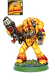
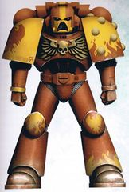
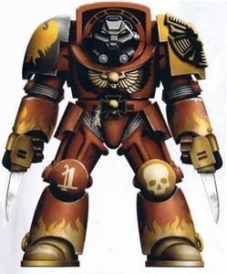
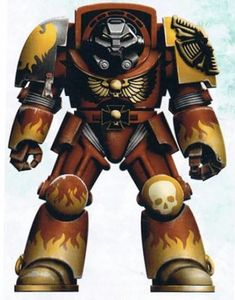
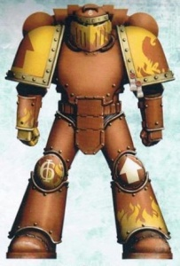
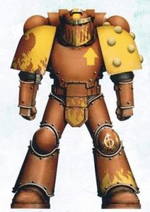
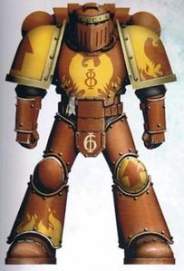
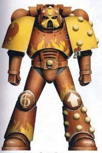
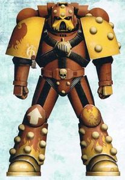

# 0325 火鹰 Fire Hawks

精校状态：中文行文已逐段精校，部分术语仍为暂定

分类：通用概念 / 帝国 Imperium / 中央政务部 Adeptus Terra / 阿斯塔特修会 Adeptus Astartes

原文来源：https://www.bilibili.com/opus/1217734180318740532

原作者：帝国神选罐头

原文时间：2026年06月25日 13:10

[返回分类目录](目录.md) · [全书目录](../../目录.md)

<!-- A0325-B0001 -->
**英文原文**

The Fire Hawks were a loyalist Space Marine Chapter which took part in the conflicts during the Age of Apostasy and the Badab War. They were lost in the Warp in 963.M41.

<!-- /A0325-B0001 -->

<!-- A0325-B0002 -->

原译文

火鹰是一支忠诚派星际战士战团，参与了叛教时代和巴达布战争期间的冲突。他们在963.M41在亚空间中迷失。

**校订译文**

火鹰是一支忠诚派星际战士战团，参与了叛教时代和巴达布战争期间的冲突。他们在963.M41在亚空间中迷失。

<!-- /A0325-B0002 -->

<!-- A0325-B0003 图片 -->

<!-- A0325-B0004 图片 -->

<!-- A0325-B0005 图片 -->

<!-- A0325-B0006 -->
**英文原文**

Founding Chapter:Claims to be of Ultramarines stock, but the Ultramarines have never publicly acknowledged kinship

<!-- /A0325-B0006 -->

<!-- A0325-B0007 -->

原译文

建军战团：声称为极限战士，但极限战士从未公开承认过亲裔关系

**校订译文**

始祖战团：自称源于极限战士，但极限战士从未公开承认这一血缘关系。

<!-- /A0325-B0007 -->

<!-- A0325-B0008 -->
**英文原文**

Founding:M36 (Cursed) 21st Founding

<!-- /A0325-B0008 -->

<!-- A0325-B0009 -->

原译文

建军时间：M36（诅咒）第21次建军

**校订译文**

建军时间：M36（诅咒）第21次建军

<!-- /A0325-B0009 -->

<!-- A0325-B0010 -->
**英文原文**

Chapter Master:Stibor Lazaerek (last recorded)

<!-- /A0325-B0010 -->

<!-- A0325-B0011 -->

原译文

战团长：斯蒂博尔·拉扎雷克（最后记录）

**校订译文**

战团长：斯蒂博尔·拉扎雷克（最后记录）

<!-- /A0325-B0011 -->

<!-- A0325-B0012 -->
**英文原文**

Homeworld:Zhoros (destroyed) / Cousteau XI (rendered uninhabitable)

<!-- /A0325-B0012 -->

<!-- A0325-B0013 -->

原译文

家园世界：卓洛斯（已毁灭）/库斯托11号（变得无法居住）

**校订译文**

家园世界：卓洛斯（已毁灭）/库斯托11号（变得无法居住）

<!-- /A0325-B0013 -->

<!-- A0325-B0014 -->
**英文原文**

Fortress-Monastery:Raptorus Rex

<!-- /A0325-B0014 -->

<!-- A0325-B0015 -->

原译文

堡垒修道院：猛禽君王号

**校订译文**

要塞修道院：猛禽君王号

<!-- /A0325-B0015 -->

<!-- A0325-B0016 -->
**英文原文**

Colours:Red with yellow pauldrons and markings

<!-- /A0325-B0016 -->

<!-- A0325-B0017 -->

原译文

配色：红色，带黄色肩甲和标记

**校订译文**

配色：红色，带黄色肩甲和标记

<!-- /A0325-B0017 -->

<!-- A0325-B0018 -->
**英文原文**

Specialty:Assault/Shock Tactics

<!-- /A0325-B0018 -->

<!-- A0325-B0019 -->

原译文

专业：突击/震撼战术

**校订译文**

作战专长：突击与震撼战术。

<!-- /A0325-B0019 -->

<!-- A0325-B0020 -->
**英文原文**

Strength:Lost/Unknown

<!-- /A0325-B0020 -->

<!-- A0325-B0021 -->

原译文

力量：失落/未知

**校订译文**

兵力：全团失踪，现状不明。

<!-- /A0325-B0021 -->

<!-- A0325-B0022 -->
## History 历史

<!-- /A0325-B0022 -->

<!-- A0325-B0023 -->
**英文原文**

The Fire Hawks have long been a byword for devastation and wrath. In their history they have seen great victories, bloody deeds and terrible reversals, being one of only a very few Chapters on record known to have survived the destruction of two separate home worlds, and being brought back from the brink of extinction many times.

<!-- /A0325-B0023 -->

<!-- A0325-B0024 -->

原译文

火鹰长期以来一直是破坏和愤怒的代名词。在他们的历史上，他们看到了伟大的胜利、血腥的行动和可怕的反转，这是有记录以来为数不多的在两个单独的家园世界毁灭后幸存下来的战团之一，并且多次从消亡的边缘被带回来。

**校订译文**

火鹰长期以来都是毁灭与愤怒的代名词。他们的历史充满辉煌胜利、血腥战事与惨痛挫败，是有记录以来极少数在先后失去两个家园世界后仍然存续的战团之一，也曾多次从覆灭边缘恢复过来。

<!-- /A0325-B0024 -->

<!-- A0325-B0025 -->
## Notable Battles 著名战斗

<!-- /A0325-B0025 -->

<!-- A0325-B0026 -->
**英文原文**

The Fire Hawks have also long been notably embroiled deeply in the wars of the Age of Apostasy. In one of their first actions they fought alongside the Black Templars, Imperial Fists, Soul Drinkers, and the Martian Skitarii against Goge Vandire. They did not escape unscathed, as during these battles their homeworld of Zhoros was destroyed by Thermal Bombs. At the conclusion of the Age of Apostasy they were rewarded for their actions in his support by Sebastian Thor himself, who issued them with the right to use the Great Crusade-era mobile void-fortress, Raptorus Rex as their fortress monastery. The Fire Hawks became a fleet-based chapter as a result.

<!-- /A0325-B0026 -->

<!-- A0325-B0027 -->

原译文

火鹰长期以来也明显深陷于叛教时代的战争中。在他们的第一次行动中，他们与黑色圣堂、帝国之拳、饮魂者和火星护教军并肩作战，对抗高戈·范迪尔。他们并没有毫发无损地幸免于难，因为在这些战斗中，他们的家园世界卓洛斯被热能炸弹摧毁了。在叛教时代结束时，他们因支持塞巴斯蒂安·托尔而获得奖励，塞巴斯蒂安·托尔本人授予他们使用大远征时代的移动虚空堡垒猛禽君王号作为他们的堡垒修道院的权利。因此，火鹰成为了一个舰基战团。

**校订译文**

火鹰曾深度卷入叛教时代的战争。建团初期的一次行动中，他们与黑色圣堂、帝国之拳、饮魂者及火星护教军并肩作战，对抗高戈·范迪尔。但火鹰也付出了惨痛代价，家园世界卓洛斯在战火中被热能炸弹摧毁。叛教时代结束后，塞巴斯蒂安·托尔亲自奖赏他们对自己的支持，授予战团使用大远征时代机动虚空堡垒猛禽君王号的权利，供其充当要塞修道院。火鹰因此成为以舰队为基地的战团。

<!-- /A0325-B0027 -->

<!-- A0325-B0028 -->
**英文原文**

They were also the first loyalist Chapter to become engaged in the Badab War after one of their vessels, the Rapturous Flame, was attacked and captured by the Mantis Warriors in 904.M41. The Fire Hawks quickly became fully engaged in the conflict, with an effective frontline brethren fighting strength of 86%, a projected Chapter maximum at the start of the war. Despite the power of their fleet, the Fire Hawks suffered terrible losses in the early years of the war, both in terms of battle-brethren and vessels. Eventually casualties reduced the Chapter's effective strength to an estimated 22% by the war's third year, and Lazaerek was forced to bow to Loyalist command pressure to withdraw his remaining forces or risk his Chapter's extinction. The Chapter was relegated to the sidelines until the very closing stages of the war when Lazaerek successfully petitioned the Loyalist Command for his Chapter's involvement again in the fight, and the star-fortress Raptorus Rex, the single-most powerful warship in the Maelstrom Zone, was used as a lynchpin of the Angstrom blockade. Also during the Badab War Fire Hawks created a new pattern of the Razorback — the Infernum Pattern Razorback — to effectively breach the enemy fortifications and deliver the Space Marines squads inside the breaches.

<!-- /A0325-B0028 -->

<!-- A0325-B0029 -->

原译文

他们也是第一个参与巴达布战争的忠诚派，因为他们的一艘战舰猛禽火焰号在904.M41被螳螂勇士袭击并夺取。火鹰迅速全面投入冲突，前线兄弟的有效战斗力为86%，这是战争开始时预计的战团最大值。尽管他们的舰队很强大，但在战争初期，火鹰在战斗兄弟和战舰方面都遭受了巨大的损失。最终，在战争的第三年，伤亡人数使该战团的有效兵力减少到估计的22%，拉扎雷克被迫让步于忠诚派指挥部的压力，撤回剩余的部队，否则将面临战团消亡的风险。在战争的最后阶段，拉扎雷克成功地向忠诚派指挥部请愿，要求其战团再次参与战斗，而大漩涡区唯一最强大的战舰 — 猛禽君王号，则被用作安斯特罗姆封锁的关键。同样在巴达布战争期间，火鹰创造了一种新的豪猪型号 — 炼狱型豪猪 — 以有效地突破敌人的防御工事，并将星际战士小队运送到缺口内。

**校订译文**

904.M41，火鹰的战舰狂喜烈焰号遭螳螂勇士袭击并俘获，他们由此成为第一个卷入巴达布战争的忠诚派战团。火鹰迅速全面参战，开战时可投入前线的战斗兄弟约占战团满编兵力的86%，已是当时估计能够动用的上限。尽管舰队强大，他们在战争头几年仍损失了大量战斗兄弟与舰船。到第三年，估计有效兵力仅剩满编的22%。拉扎雷克面对忠诚派指挥部的压力，被迫撤回残余部队，否则战团就可能覆灭。此后，火鹰长期退居次要地位，直到战争即将结束时，拉扎雷克才成功请求忠诚派指挥部允许战团重返战场。大漩涡区域单舰实力最强的星堡猛禽君王号由此成为封锁安斯特罗姆的关键。在巴达布战争期间，火鹰还研制了炼狱型豪猪战车，用于有效突破敌方工事，并将星际战士小队送入突破口。

**校注：** Rapturous Flame 的 Rapturous 意为狂喜，与 Raptorus Rex 的猛禽并非同一词根，故舰名暂改狂喜烈焰号。86%及22%均按原文战团有效兵力比例保留，不据此精确推算人数。

<!-- /A0325-B0029 -->

<!-- A0325-B0030 -->
## Disappearance of the Fire Hawks 火鹰的消失

<!-- /A0325-B0030 -->

<!-- A0325-B0031 -->
**英文原文**

The beginning of the end came when the Fire Hawks were called to the Crows World subsector in 963.M41 to deal with Dark Eldar pirates. The entire chapter fleet, as well as the Raptorus Rex, attempted a warp jump from the Pireaus System, 120 light years from Crows World. The space fortress, five ships, over 800 brethren and 2,000 other personnel were expected to reach Crows World within no more than 12 hours. They never arrived.

<!-- /A0325-B0031 -->

<!-- A0325-B0032 -->

原译文

963.M41，当火鹰被召集到乌鸦世界分区处理黑暗灵族海盗时，结束的开始就来了。整个战团舰队，以及猛禽君王号，都试图从距离乌鸦世界120光年的比雷埃夫斯星系进行亚空间跳跃。太空堡垒、五艘舰船、800多名修士和2000名其他人员预计将在不超过12小时内到达乌鸦世界。但他们再未到达。

**校订译文**

963.M41，火鹰奉召前往鸦星次星区剿灭黑暗灵族海盗，战团的末路由此开始。包括猛禽君王号在内的整支舰队，从距鸦星一百二十光年的比雷埃夫斯星系跃入亚空间。这座太空堡垒、五艘舰船、八百余名战斗兄弟与两千名其他人员，预计最多十二小时便可抵达鸦星。然而，他们始终没有到达。

**校注：** 十二小时为英文给定的预计亚空间航行时间，非按现实空间光速换算的旅时。

<!-- /A0325-B0032 -->

<!-- A0325-B0033 -->
**英文原文**

In 983.M41 the chapter was officially declared lost in the warp and assumed destroyed. It’s said that the Bell of Lost Souls tolled a thousand times, and that the Emperor himself ordered a black candle to be lit in the Chapel of Fallen Heroes. Despite this, there have been scattered sightings and rumours of the old chapter still fighting in the farthest reaches of the galaxy, their old flagship being at the lead.

<!-- /A0325-B0033 -->

<!-- A0325-B0034 -->

原译文

于983.M41，正式宣布该战团在亚空间中迷失，并假定已被毁灭。据说迷失灵魂之钟敲响了一千次，帝皇亲自下令在牺牲英雄礼拜堂点燃一支黑色蜡烛。尽管如此，仍有零星的目击和谣言称，旧战团仍在银河系最遥远的地方作战，他们的旧旗舰仍在其首。

**校订译文**

983.M41，帝国正式宣布火鹰在亚空间失踪，并推定全团覆灭。据说，亡魂之钟为之鸣响一千次，帝皇还亲自下令在陨落英雄礼拜堂点燃一支黑色蜡烛。尽管如此，银河最遥远的区域仍不时传出目击报告与传闻：这个昔日战团依然在旧日旗舰的带领下作战。

**校注：** 帝皇亲自下令等情节为英文中的“据说”，保留传闻口吻，不据外部设定擅删。

<!-- /A0325-B0034 -->

<!-- A0325-B0035 -->
**英文原文**

Rumours fed by a long line of coincidences have been said by conspiracy theorists to implicate the Officio Assassinorum in the loss of the Fire Hawks' fleet, though nothing has ever been substantiated.

<!-- /A0325-B0035 -->

<!-- A0325-B0036 -->

原译文

阴谋论者说，一系列巧合引发的谣言将刺客庭与火鹰舰队的迷失联系起来，尽管没有任何证据。

**校订译文**

一连串巧合滋生了各种传闻，一些阴谋论者据此声称刺客庭与火鹰舰队失踪有关，但这些说法从未得到证实。

<!-- /A0325-B0036 -->

<!-- A0325-B0037 -->
## Fate 命运

<!-- /A0325-B0037 -->

<!-- A0325-B0038 -->
**英文原文**

As many as two hundred members of the Chapter may have survived and renamed themselves the Legion of the Damned.

<!-- /A0325-B0038 -->

<!-- A0325-B0039 -->

原译文

该战团可能有多达200名成员幸存下来，并将自己重新命名为受诅军团。

**校订译文**

战团可能有多达两百名成员幸存，并改称“诅咒军团”。

**校注：** 英文只称可能有幸存者改名，未确定火鹰与诅咒军团的关系；保留 may 限定。

<!-- /A0325-B0039 -->

<!-- A0325-B0040 -->
## Timeline 时间线

<!-- /A0325-B0040 -->

<!-- A0325-B0041 -->

原译文

M36 — Founded 建军

**校订译文**

M36 — Founded 建军

<!-- /A0325-B0041 -->

<!-- A0325-B0042 -->
**英文原文**

c.378.M36 — Entered into the conflicts of the Age of Apostasy.

<!-- /A0325-B0042 -->

<!-- A0325-B0043 -->

原译文

陷入了叛教时代的冲突。

**校订译文**

约378.M36：卷入叛教时代的战争。

<!-- /A0325-B0043 -->

<!-- A0325-B0044 -->
**英文原文**

Homeworld of Zhoros destroyed by Frateris Templar fleet.

<!-- /A0325-B0044 -->

<!-- A0325-B0045 -->

原译文

佐罗斯家园世界被圣堂兄弟会舰队摧毁。

**校订译文**

家园世界卓洛斯被圣堂兄弟会舰队摧毁。

<!-- /A0325-B0045 -->

<!-- A0325-B0046 -->
**英文原文**

Received the Raptorous Rex as a gift from Sebastian Thor, became fleet-based chapter.

<!-- /A0325-B0046 -->

<!-- A0325-B0047 -->

原译文

从塞巴斯蒂安·托尔那里收到猛禽君王号作为礼物，成为舰基战团。

**校订译文**

获塞巴斯蒂安·托尔赠予猛禽君王号，转为以舰队为基地的战团。

<!-- /A0325-B0047 -->

<!-- A0325-B0048 -->
**英文原文**

M38

**补译**

第38千年

<!-- /A0325-B0048 -->

<!-- A0325-B0049 -->
**英文原文**

770.M38 - Chosen to take part in the Great Malagantine Purge, the extermination of the population of the heretical Malagant sector.

<!-- /A0325-B0049 -->

<!-- A0325-B0050 -->

原译文

被选中参加大马拉甘廷净化，灭绝异端马拉甘特星区的人口。

**校订译文**

770.M38：获选参加马拉甘廷大净化，灭绝异端马拉甘特星区的居民。

<!-- /A0325-B0050 -->

<!-- A0325-B0051 -->
**英文原文**

791.M38 - Conclusion of the purge; received the new homeworld of Cousteau XI.

<!-- /A0325-B0051 -->

<!-- A0325-B0052 -->

原译文

净化结束；接受了库斯托11号的新家园世界。

**校订译文**

791.M38：净化结束，获得库斯托十一号作为新的家园世界。

<!-- /A0325-B0052 -->

<!-- A0325-B0053 -->
**英文原文**

M40

**补译**

第40千年

<!-- /A0325-B0053 -->

<!-- A0325-B0054 -->
**英文原文**

228.M40 - The First Castigation of Golgotha.

<!-- /A0325-B0054 -->

<!-- A0325-B0055 -->

原译文

第一次各各他惩罚。

**校订译文**

228.M40：第一次各各他惩戒。

<!-- /A0325-B0055 -->

<!-- A0325-B0056 -->
**英文原文**

M41

**补译**

第41千年

<!-- /A0325-B0056 -->

<!-- A0325-B0057 -->
**英文原文**

780.M41 - The Lycanthos Drift Campaign; Chapter Master Stibor Lazaerek passed over by Lugft Huron for overall command.

<!-- /A0325-B0057 -->

<!-- A0325-B0058 -->

原译文

莱坎索斯漂流区战役；战团长斯蒂博尔·拉扎雷克接替鲁夫特·休伦担任总指挥。

**校订译文**

780.M41：莱坎索斯漂流区战役——总指挥权交给鲁夫特·休伦，而未授予火鹰战团长斯蒂博尔·拉扎雷克。

**校注：** passed over 指拉扎雷克未获选，原译“接替休伦担任总指挥”将结果完全颠倒，已纠正。

<!-- /A0325-B0058 -->

<!-- A0325-B0059 -->
**英文原文**

902.M41 - The Thirteenth Castigation of Golgotha.

<!-- /A0325-B0059 -->

<!-- A0325-B0060 -->

原译文

第十三次各各他惩罚。

**校订译文**

902.M41：第十三次各各他惩戒。

<!-- /A0325-B0060 -->

<!-- A0325-B0061 -->
**英文原文**

904.M41 - Investigated missing Imperial fleets in the Maelstrom Zone; fired upon by Mantis Warriors. Entered the Badab War as a result.

<!-- /A0325-B0061 -->

<!-- A0325-B0062 -->

原译文

调查了大漩涡区失踪的帝国舰队；被螳螂勇士射击。因此，加入了巴达布战争。

**校订译文**

904.M41：调查大漩涡区域失踪的帝国舰队时，遭螳螂勇士开火攻击，因而卷入巴达布战争。

<!-- /A0325-B0062 -->

<!-- A0325-B0063 -->
**英文原文**

906.M41 - Questioned by the Inquisition in order to establish culpability for the war; cleared of any wrongdoing.

<!-- /A0325-B0063 -->

<!-- A0325-B0064 -->

原译文

被审判庭质疑，以确定战争的罪行；没有任何不当行为。

**校订译文**

906.M41：接受审判庭质询，以查明战争责任；最终被认定没有不当行为。

<!-- /A0325-B0064 -->

<!-- A0325-B0065 -->
**英文原文**

907.M41 - Entire chapter strength stands at 22% due to casualties incurred in the war, chapter placed on rear duties for remainder of the war.

<!-- /A0325-B0065 -->

<!-- A0325-B0066 -->

原译文

由于战争中的伤亡，整个战团的兵力为22%，在战争的剩余时间里，战团被安排在后方执行任务。

**校订译文**

907.M41：战争伤亡使全团兵力仅剩满编的22%，战团被安排在此后战争中承担后方任务。

**校注：** 此时间线将后续任务概括为后方勤务，正文另叙述战争最后阶段重返战场；两段保留，视为概述精度差异。

<!-- /A0325-B0066 -->

<!-- A0325-B0067 -->
**英文原文**

912.M41 - Conclusion of the Badab War.

<!-- /A0325-B0067 -->

<!-- A0325-B0068 -->

原译文

巴达布战争结束。

**校订译文**

912.M41：巴达布战争结束。

<!-- /A0325-B0068 -->

<!-- A0325-B0069 -->
**英文原文**

963.M41 - Entire chapter vanish in the warp.

<!-- /A0325-B0069 -->

<!-- A0325-B0070 -->

原译文

整个战团在亚空间中消失了。

**校订译文**

963.M41：整个战团在亚空间失踪。

<!-- /A0325-B0070 -->

<!-- A0325-B0071 -->
**英文原文**

983.M41 - The Fire Hawks are officially declared lost.

<!-- /A0325-B0071 -->

<!-- A0325-B0072 -->

原译文

火鹰正式被宣告迷失。

**校订译文**

983.M41：帝国正式宣布火鹰失踪。

<!-- /A0325-B0072 -->

<!-- A0325-B0073 -->
## Gene-seed 基因种子

<!-- /A0325-B0073 -->

<!-- A0325-B0074 -->
**英文原文**

The Chapter itself claims antecedence from the renowned Ultramarines gene-seed, although certain defects and variations in the samples held in the archives of the Adeptus Terra speak against this, and the Lords of Macragge have never publicly acknowledged kinship.

<!-- /A0325-B0074 -->

<!-- A0325-B0075 -->

原译文

战团本身声称起源于著名的极限战士基因种子，尽管中央政务部档案中保存的样本中的某些缺陷和变异对此表示反对，而马库拉格领主从未公开承认亲裔关系。

**校订译文**

火鹰自称承袭著名的极限战士基因种子。然而，中央政务部保存的样本存在某些缺陷与变异，与这种说法并不相符，马库拉格的统治者也从未公开承认双方的血缘关系。

<!-- /A0325-B0075 -->

<!-- A0325-B0076 -->
## Notable Elements 著名单位与成员

原题：Notable Elements 著名成员

<!-- /A0325-B0076 -->

<!-- A0325-B0077 -->
## Notable Vessels 著名战舰

<!-- /A0325-B0077 -->

<!-- A0325-B0078 -->
**英文原文**

Raptorus Rex — Star Fort

<!-- /A0325-B0078 -->

<!-- A0325-B0079 -->

原译文

猛禽君王号 — 星堡

**校订译文**

猛禽君王号 — 星堡

<!-- /A0325-B0079 -->

<!-- A0325-B0080 -->
**英文原文**

Rapturous Flame — Strike Cruiser

<!-- /A0325-B0080 -->

<!-- A0325-B0081 -->

原译文

猛禽火焰号 — 打击巡洋舰

**校订译文**

狂喜烈焰号——打击巡洋舰。

<!-- /A0325-B0081 -->

<!-- A0325-B0082 -->
**英文原文**

Slaughtering Star — Strike Cruiser

<!-- /A0325-B0082 -->

<!-- A0325-B0083 -->

原译文

屠宰星辰号 — 打击巡洋舰

**校订译文**

屠戮星辰号——打击巡洋舰。

<!-- /A0325-B0083 -->

<!-- A0325-B0084 -->
**英文原文**

Red Harbinger — Vanguard Cruiser

<!-- /A0325-B0084 -->

<!-- A0325-B0085 -->

原译文

红色预兆号 — 先锋巡洋舰

**校订译文**

赤红先兆号——先锋巡洋舰。

<!-- /A0325-B0085 -->

<!-- A0325-B0086 -->
**英文原文**

Ravage — Destroyer

<!-- /A0325-B0086 -->

<!-- A0325-B0087 -->

原译文

蹂躏号 — 驱逐舰

**校订译文**

蹂躏号 — 驱逐舰

<!-- /A0325-B0087 -->

<!-- A0325-B0088 -->
**英文原文**

Absolute — Spacecraft

<!-- /A0325-B0088 -->

<!-- A0325-B0089 -->

原译文

绝对真理号 — 星舰

**校订译文**

绝对号——星舰。

<!-- /A0325-B0089 -->

<!-- A0325-B0090 -->
## Notable Named Vehicles 著名命名载具

<!-- /A0325-B0090 -->

<!-- A0325-B0091 -->
**英文原文**

Orlandra — Land Raider Proteus

<!-- /A0325-B0091 -->

<!-- A0325-B0092 -->

原译文

奥兰德拉号 — 兰德掠袭者普罗透斯

**校订译文**

奥兰德拉号——普罗透斯型兰德掠袭者战车。

<!-- /A0325-B0092 -->

<!-- A0325-B0093 -->
## Notable Members 著名成员

<!-- /A0325-B0093 -->

<!-- A0325-B0094 -->
**英文原文**

Elam Courbray — Knight Captain

<!-- /A0325-B0094 -->

<!-- A0325-B0095 -->

原译文

伊拉姆·库布雷 — 骑士连长

**校订译文**

伊拉姆·库布雷 — 骑士连长

<!-- /A0325-B0095 -->

<!-- A0325-B0096 -->
**英文原文**

Narth Orlandra — one of the founders of the Chapter

<!-- /A0325-B0096 -->

<!-- A0325-B0097 -->

原译文

纳尔斯·奥兰德拉 — 战团的创立者之一

**校订译文**

纳尔斯·奥兰德拉 — 战团的创立者之一

<!-- /A0325-B0097 -->

<!-- A0325-B0098 -->
**英文原文**

Stibor Lazaerek — last recorded Chapter Master

<!-- /A0325-B0098 -->

<!-- A0325-B0099 -->

原译文

斯蒂博尔·拉扎雷克 — 最后记录的战团长

**校订译文**

斯蒂博尔·拉扎雷克 — 最后记录的战团长

<!-- /A0325-B0099 -->

<!-- A0325-B0100 图片 -->

<!-- A0325-B0101 -->

原译文

Knight-Terminator Surtur 骑士终结者苏尔特尔

**校订译文**

Knight-Terminator Surtur 骑士终结者苏尔特尔

<!-- /A0325-B0101 -->

<!-- A0325-B0102 图片 -->

<!-- A0325-B0103 -->

原译文

Knight-Veteran Zann 骑士终结者赞恩

**校订译文**

Knight-Veteran Zann 骑士老兵赞恩

**校注：** Knight-Veteran 是骑士老兵，并非 Knight-Terminator 骑士终结者。

<!-- /A0325-B0103 -->

<!-- A0325-B0104 图片 -->

<!-- A0325-B0105 -->

原译文

Armiger-Brother Avar 扈从兄弟阿瓦尔

**校订译文**

Armiger-Brother Avar 侍从兄弟阿瓦尔

<!-- /A0325-B0105 -->

<!-- A0325-B0106 图片 -->

<!-- A0325-B0107 -->

原译文

Preceptor-Brother Laugarda 导师兄弟劳加达

**校订译文**

Preceptor-Brother Laugarda 导师兄弟劳加达

<!-- /A0325-B0107 -->

<!-- A0325-B0108 图片 -->

<!-- A0325-B0109 -->

原译文

Knight-Brother Sorosev 骑士兄弟索罗塞夫

**校订译文**

Knight-Brother Sorosev 骑士兄弟索罗塞夫

<!-- /A0325-B0109 -->

<!-- A0325-B0110 图片 -->

<!-- A0325-B0111 -->

原译文

Armiger-Brother Betancourt 侍从兄弟贝当古

**校订译文**

Armiger-Brother Betancourt 侍从兄弟贝当古

<!-- /A0325-B0111 -->

<!-- A0325-B0112 图片 -->

<!-- A0325-B0113 -->

原译文

Armiger-Brother Borusa 侍从兄弟博鲁萨

**校订译文**

Armiger-Brother Borusa 侍从兄弟博鲁萨

<!-- /A0325-B0113 -->

<!-- A0325-B0114 -->
## Trivia 琐事

<!-- /A0325-B0114 -->

<!-- A0325-B0115 -->
## Conflicting sources 来源冲突

<!-- /A0325-B0115 -->

<!-- A0325-B0116 -->
**英文原文**

The Fire Hawks' colour scheme and insignia have changed between their first appearance and the current edition of the background; the dominance of yellow and red has been switched and the mushroom cloud symbol has now become one more relevant to the chapter's name.

<!-- /A0325-B0116 -->

<!-- A0325-B0117 -->

原译文

火鹰的配色方案和徽章在首次亮相和当前版本的背景之间发生了变化；黄色和红色的主导地位已经发生了转变，蘑菇云标志现在又与该战团的名称相关。

**校订译文**

火鹰首次登场时的配色与徽章，同原资料所述的当前版本已有差别：黄色与红色在涂装中的主次关系对调了，原来的蘑菇云徽记也被更贴合战团名称的标志取代。

<!-- /A0325-B0117 -->

<!-- A0325-B0118 -->
**英文原文**

In addition, the Badab War book places the second siege of Terra at 378.M36 - almost a hundred years after the date implied by the Witch Hunters codex (circa 287).

<!-- /A0325-B0118 -->

<!-- A0325-B0119 -->

原译文

此外，《巴达布战争》一书将第二次泰拉围城的时间定在378.M36，比《猎巫人》圣典（约287年）暗示的日期晚了近一百年。

**校订译文**

此外，《巴达布战争》一书将第二次泰拉围城战定于378.M36，比《圣典：猎巫人》暗示的日期——约287.M36——晚了近一百年。

**校注：** 此处为原作者列出的年代冲突，保留两种来源的年份，不强制合并。

<!-- /A0325-B0119 -->

本篇核心术语与暂定项

以下列出本篇出现的英文原形及核心术语表用词。同形词可能指不同对象，具体词义以本篇正文和校注为准；单复数、别名和仅见于图注的名称可能尚未列入。完整候选见[术语表](../../术语表/双语术语候选.csv)。

| 英文 | 采用中文 | 状态 |
| --- | --- | --- |
| Space Marines | 星际战士 | 官方已核对 |
| Black Templars | 黑色圣堂 | 官方已核对 |
| Eldar | 灵族 | 暂定·语境区分 |
| Dark Eldar | 黑暗灵族 | 暂定·旧称对应 |
| Ultramarines | 极限战士 | 官方已核对 |
| Warp | 亚空间 | 官方已核对 |
| Inquisition | 审判庭 | 暂定 |
| Warp Jump | 亚空间跳跃 | 暂定 |
| History | 历史 | 编辑用语已统一 |
| Maelstrom | 大漩涡 | 官方已核对 |
| Imperial Fists | 帝国之拳 | 暂定 |
| Emperor | 帝皇 | 官方已核对 |
| Adeptus Terra | 中央政务部 | 暂定 |
| Officio Assassinorum | 刺客庭 | 暂定·官方待核 |
| Age of Apostasy | 叛教时代 | 暂定·官方待核 |
| Goge Vandire | 高戈·范迪尔 | 暂定·官方待核 |
| Frateris Templar | 圣堂兄弟会 | 暂定·官方待核 |
| Great Crusade | 大远征 | 暂定·官方待核 |
| Terra | 泰拉 | 暂定·官方待核 |
| Skitarii | 护教军 | 暂定·官方待核 |
| Sector | 星区 | 暂定·官方待核 |
| Subsector | 次星区 | 暂定·官方待核 |
| Badab | 巴达布 | 暂定·官方待核 |
| Macragge | 马库拉格 | 暂定·官方待核 |
| Land Raider | 兰德掠袭者战车 | 官方已核对 |
| Witch Hunters | 猎巫者 | 暂定 |
| Master | 导师（审判庭职衔）／舰务官（舰员职务） | 语境定译·官方待核 |
| Razorback | 豪猪战车 | 官方已核对 |
| Founding | 建军 | 暂定·官方待核 |
| Destroyer | 毁灭者 | 暂定·官方待核 |
| Space Marine | 星际战士 | 暂定·官方待核 |
| Chapter | 战团 | 暂定·官方待核 |
| Fortress-monastery | 要塞修道院 | 暂定·官方待核 |
| Chapter Master | 战团长 | 暂定·官方待核 |
| Captain | 连长 | 暂定·官方待核 |
| Vanguard | 先锋 | 暂定·官方待核 |
| Soul Drinkers | 饮魂者 | 暂定·官方待核 |
| Mantis Warriors | 螳螂勇士 | 暂定·官方待核 |
| Fire Hawks | 火鹰 | 暂定·官方待核 |
| The Black Templars | 黑色圣堂 | 暂定·官方待核 |
| Legion of the Damned | 诅咒军团 | 暂定·官方待核 |
| Gene-seed | 基因种子 | 暂定·官方待核 |
| Strike Cruiser | 打击巡洋舰 | 暂定·官方待核 |
| Crows World | 鸦星 | 暂定·官方待核 |
| Rapturous Flame | 狂喜烈焰号 | 暂定·官方待核 |
| Bell of Lost Souls | 亡魂之钟 | 暂定·官方待核 |
| Chapel of Fallen Heroes | 陨落英雄礼拜堂 | 暂定·官方待核 |
| Red Harbinger | 赤红先兆号 | 暂定·官方待核 |
| Absolute | 绝对号 | 暂定·官方待核 |
| The Purge | 净世疫军 | 暂定·官方待核 |
| Proteus | 普罗透斯 | 暂定·官方待核 |
| Raider | 掠袭者飞艇 | 官方已核对 |
| System | 星系（恒星系统） | 暂定·官方待核 |
| Angstrom | 埃格斯特朗 | 暂定·官方待核 |
| Sebastian Thor | 塞巴斯蒂安·托尔 | 暂定·官方待核 |
| Lugft Huron | 鲁夫特·休伦 | 暂定·官方待核 |
| Lazaerek | 拉扎雷克 | 暂定·官方待核 |
| Pireaus | 比雷埃夫斯 | 暂定·官方待核 |
| Infernum Pattern Razorback | 炼狱型豪猪战车 | 暂定·官方待核 |
| The Loss | 失落 | 暂定·官方待核 |
| Land Raider Proteus | 普罗透斯型兰德掠袭者 | 暂定·官方待核 |
| Orlandra | 奥兰德拉号 | 暂定·官方待核 |

