# 0326 I - 黑暗天使 Dark Angels

精校状态：中文行文已逐段精校，部分术语仍为暂定

分类：通用概念 / 帝国 Imperium / 中央政务部 Adeptus Terra / 阿斯塔特修会 Adeptus Astartes

原文来源：https://www.bilibili.com/opus/1091506367100878857

原作者：帝国神选罐头

原文时间：编辑于 2025年09月16日 21:01

[返回分类目录](目录.md) · [全书目录](../../目录.md)

<!-- A0326-B0001 -->
**英文原文**

The Dark Angels, known in High Gothic as Angelis Tenebraium, were the I Legion of the twenty original Space Marine Legions. Their Primarch is Lion El'Jonson. After remaining loyal to the Emperor during the Horus Heresy, this legion was later re-organized and divided into several Chapters during the Second Founding. One of these chapters would keep the original legion's name and assets, though all of the Dark Angels descendants continue to work together to hunt The Fallen as the Unforgiven.

<!-- /A0326-B0001 -->

<!-- A0326-B0002 -->

原译文

黑暗天使，在高哥特语中被称为黑暗天使，是20个原初星际战士军团中的第一军团。他们的原体是莱昂·艾尔庄森。在荷鲁斯叛乱期间忠于帝皇后，该军团在二次建军期间重新组织并分为几个战团。其中个一战团将保留原始军团的名称和资产，尽管所有黑暗天使的子战团继续共同努力，将堕天使作为不可饶恕者追捕。

**校订译文**

黑暗天使在高哥特语中称为 Angelis Tenebraium，是最初二十个星际战士军团中的第一军团，原体为莱昂·艾尔’庄森。他们在荷鲁斯之乱期间忠于帝皇，随后在二次建军中重组并拆分为多个战团，其中一个保留了原军团的名称与资产。黑暗天使及其各支后裔战团仍以“戴罪者”之名协同行动，追捕堕天使。

<!-- /A0326-B0002 -->

<!-- A0326-B0003 图片 -->
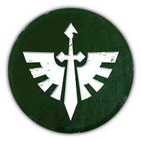

<!-- A0326-B0004 图片 -->
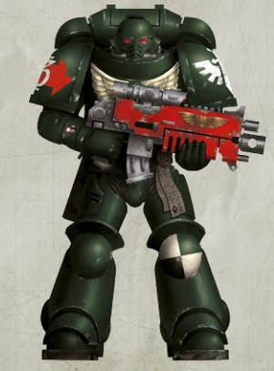

<!-- A0326-B0005 -->
**英文原文**

Legion Number:I

<!-- /A0326-B0005 -->

<!-- A0326-B0006 -->

原译文

军团编号：I

**校订译文**

军团编号：I

<!-- /A0326-B0006 -->

<!-- A0326-B0007 -->
**英文原文**

Primarch:Lion El'Jonson

<!-- /A0326-B0007 -->

<!-- A0326-B0008 -->

原译文

原体：莱昂·艾尔庄森

**校订译文**

原体：莱昂·艾尔’庄森

<!-- /A0326-B0008 -->

<!-- A0326-B0009 -->
**英文原文**

Homeworld:Caliban (destroyed); Fleet-based

<!-- /A0326-B0009 -->

<!-- A0326-B0010 -->

原译文

家园世界：卡利班（毁灭）；舰基

**校订译文**

家园世界：卡利班（毁灭）；舰基

<!-- /A0326-B0010 -->

<!-- A0326-B0011 -->
**英文原文**

Fortress-Monastery:The Rock

<!-- /A0326-B0011 -->

<!-- A0326-B0012 -->

原译文

堡垒修道院：巨石

**校订译文**

要塞修道院：巨石

<!-- /A0326-B0012 -->

<!-- A0326-B0013 -->
**英文原文**

Chapter Master:Azrael

<!-- /A0326-B0013 -->

<!-- A0326-B0014 -->

原译文

战团长：阿兹瑞尔

**校订译文**

战团长：阿兹瑞尔

<!-- /A0326-B0014 -->

<!-- A0326-B0015 -->
**英文原文**

Colours:Pre-Heresy: Black; Post-Heresy: Dark Green;Deathwing: Bone; Ravenwing: Black

<!-- /A0326-B0015 -->

<!-- A0326-B0016 -->

原译文

颜色：叛乱前：黑；叛乱后：暗绿；死翼：骨色；鸦翼：黑

**校订译文**

颜色：叛乱前：黑；叛乱后：暗绿；死翼：骨色；鸦翼：黑

<!-- /A0326-B0016 -->

<!-- A0326-B0017 -->
**英文原文**

Specialty:Combined arms,Plasma Weaponry Deathwing: Terminator veterans and hunting the Fallen. Ravenwing: Fast attack Experimental weaponry & tactics, extermination (pre-Horus Heresy)

<!-- /A0326-B0017 -->

<!-- A0326-B0018 -->

原译文

专长：复合武器，等离子武器。死翼：终结者老兵和追捕堕天使。鸦翼：快速攻击实验武器&战术，灭绝令（荷鲁斯叛乱前）

**校订译文**

作战专长：多兵种协同、等离子武器；死翼擅用终结者老兵，并负责追捕堕天使；鸦翼擅长快速突击。荷鲁斯之乱前，军团还擅用试验性武器与战术，执行彻底歼灭任务。

**校注：** 英文在 Ravenwing: Fast attack 后缺少分隔，按段落列项语义区分鸦翼快速突击与军团在大叛乱前的试验性武器、灭绝任务，未把全部能力归给鸦翼。

<!-- /A0326-B0018 -->

<!-- A0326-B0019 -->
**英文原文**

Strength:~1000 marines

<!-- /A0326-B0019 -->

<!-- A0326-B0020 -->

原译文

兵力：约1000名星际战士

**校订译文**

兵力：约1000名星际战士

<!-- /A0326-B0020 -->

<!-- A0326-B0021 -->
**英文原文**

Battle Cry:"Repent! For tomorrow you die!" or "For the Lion!"

<!-- /A0326-B0021 -->

<!-- A0326-B0022 -->

原译文

战吼：“忏悔！明日即死亡！”或“为了莱昂！”

**校订译文**

战吼：“忏悔！明日即死亡！”或“为了莱昂！”

<!-- /A0326-B0022 -->

<!-- A0326-B0023 -->
**英文原文**

Successor Chapters:

**补译**

子战团：

<!-- /A0326-B0023 -->

<!-- A0326-B0024 -->
**英文原文**

Angels of Absolution, Angels of Defiance, Angels of Redemption, Angels of Vengeance, Angels of Vigilance (rumored), Angels of Wrath

<!-- /A0326-B0024 -->

<!-- A0326-B0025 -->

原译文

赦免天使，反抗天使，救赎天使，复仇天使，警戒天使（传闻），愤怒天使

**校订译文**

赦免天使，反抗天使，救赎天使，复仇天使，警戒天使（传闻），愤怒天使

<!-- /A0326-B0025 -->

<!-- A0326-B0026 -->
**英文原文**

Blades of Vengeance, Bringers of Judgement, Bladekeepers

<!-- /A0326-B0026 -->

<!-- A0326-B0027 -->

原译文

复仇之刃，审判使者，守刃者

**校订译文**

复仇之刃，审判使者，守刃者

<!-- /A0326-B0027 -->

<!-- A0326-B0028 -->
**英文原文**

Consecrators, Cowled Wardens

<!-- /A0326-B0028 -->

<!-- A0326-B0029 -->

原译文

奉献者，罩袍守望

**校订译文**

奉献者，罩袍监察者

<!-- /A0326-B0029 -->

<!-- A0326-B0030 -->

原译文

Disciples of Caliban 卡利班门徒

**校订译文**

Disciples of Caliban 卡利班门徒

<!-- /A0326-B0030 -->

<!-- A0326-B0031 -->

原译文

Fallen 堕天使

**校订译文**

Fallen 堕天使

<!-- /A0326-B0031 -->

<!-- A0326-B0032 -->

原译文

Guardians of the Covenant 圣约守卫者

**校订译文**

Guardians of the Covenant 圣约守卫者

<!-- /A0326-B0032 -->

<!-- A0326-B0033 -->
**英文原文**

Knights of Abhorrence, ‎Knights of the Crimson Order, Knights of Redemption, Knights of the Shrouded Skull

<!-- /A0326-B0033 -->

<!-- A0326-B0034 -->

原译文

憎恶骑士，深红骑士团骑士，救赎骑士，覆颅骑士

**校订译文**

憎恶骑士，深红骑士团骑士，救赎骑士，覆颅骑士

<!-- /A0326-B0034 -->

<!-- A0326-B0035 -->

原译文

Lions Sable 狮貂

**校订译文**

Lions Sable 暗夜之狮

<!-- /A0326-B0035 -->

<!-- A0326-B0036 -->
**英文原文**

Penitent Blades, Penumbra's Talons, Persecutors of Darkness, Prime Absolvers

<!-- /A0326-B0036 -->

<!-- A0326-B0037 -->

原译文

忏悔之刃，半影之爪，暗黑迫害者，首赦者

**校订译文**

忏悔之刃，半影之爪，暗黑迫害者，首赦者

<!-- /A0326-B0037 -->

<!-- A0326-B0038 -->

原译文

Repentant Brotherhood 悔过兄弟会

**校订译文**

Repentant Brotherhood 悔过兄弟会

<!-- /A0326-B0038 -->

<!-- A0326-B0039 -->
**英文原文**

Star Phantoms (suspected), Stewards of the Sanctum

<!-- /A0326-B0039 -->

<!-- A0326-B0040 -->

原译文

星辰幻影（疑似），圣地干事

**校订译文**

星辰幻影（疑似），圣地干事

<!-- /A0326-B0040 -->

<!-- A0326-B0041 -->

原译文

The Unnamed 无名者

**校订译文**

The Unnamed 无名者

<!-- /A0326-B0041 -->

<!-- A0326-B0042 -->
## History 历史

<!-- /A0326-B0042 -->

<!-- A0326-B0043 -->
### Unification Wars 统一战争

<!-- /A0326-B0043 -->

<!-- A0326-B0044 -->
**英文原文**

The Dark Angels have the honour of being the first Space Marine Legion created by The Emperor of Mankind. Their origins are however shrouded in mystery and secrecy, though it is said their Gene-Seed was in production a century before the end of the Unification Wars. During their earliest days Prototype Space Marines such as Abraxus Ghent were created from the Gene-Seed of Lion El'Jonson and served as the template for later Astartes to come. Known as the Primordial Strain, almost none of these initial prototypes are known to not have survived the process of becoming Space Marines but they nonetheless formed the basis of the initial culture of the First Legion. The subjects of these early experiments were recruited from genetically pure and uncorrupted inhabitants of Terra, themselves hard to find amid the many Atomic wars and genetic plagues. The Emperor mainly acquired such subjects through captured foes and purchasing slaves from nomadic clans. As a result the earliest Dark Angels were diverse culturally and recruited from across Terra, in contrast with most of the other Legions during their earliest days. The First Legion became the crucible in which all the cultures of Old Night combined with the Emperor's genetic prowess to create a new and formidable strain of warrior. Most of the new recruits threw aside their former cultures and instead took on new names drawn from the tales of Old Earth, such as Gilgamesh, Heracles, Tarchon, and Hengist.

<!-- /A0326-B0044 -->

<!-- A0326-B0045 -->

原译文

黑暗天使有幸成为人类帝皇创建的第一个星际战士军团。然而，它们的起源笼罩在神秘和秘密之中，尽管据说他们的基因种子在统一战争结束前一个世纪就已经生产出来了。在早期，阿布拉克斯·根特等原型星际战士是由莱昂·艾尔庄森的基因种子创建的，并作为后来阿斯塔特的模板。被称为原种的这些最初的原型几乎都没有在成为星际战士的过程中幸存下来，但它们仍然构成了第一军团最初文化的基础。这些早期实验的受试者是从泰拉的基因纯净和未腐化的居民中招募的，他们在许多原子战争和基因瘟疫后很难找到。帝皇主要通过俘虏敌人和从游牧部落购买奴隶来获得这些人。因此，最早的黑暗天使在文化上是多样化的，并从泰拉各地招募，这与他们早期的大多数其他军团形成鲜明对比。第一军团成为了熔炉，在这里，旧夜的所有文化与帝皇的基因能力相结合，创造了一种新的、强大的战士。大多数新兵抛弃了他们以前的文化，转而取了旧地球故事中的新名字，如吉尔伽美什、赫拉克勒斯、塔尔孔和亨吉斯特。

**校订译文**

黑暗天使享有作为帝皇亲手创建的第一个星际战士军团的殊荣，但其起源始终笼罩在秘密之中。据说，早在统一战争结束前一个世纪，军团的基因种子便已开始生产。最初，阿布拉克斯·根特等原型星际战士以莱昂·艾尔’庄森的基因种子改造而成，成为后来阿斯塔特的范本。这批原型被称为“原种”；其中有记载的改造死亡者寥寥。他们仍为第一军团最初的文化奠定了基础。这些早期实验对象须从泰拉基因纯净、未受污染的居民中挑选，而在经历多次核战争与基因瘟疫后，这类人已难以寻觅。帝皇主要从战俘中挑选，或向游牧部族购买奴隶，取得所需人选。因此，最早的黑暗天使来自泰拉各地，文化背景多样，与多数其他军团初创时的情况不同。第一军团成为熔炉，将旧夜时代的各种文化同帝皇高超的基因技术熔铸在一起，造就全新的强大战士。多数新兵抛弃了旧有文化，改用源自古地球传说的名字，例如吉尔伽美什、赫拉克勒斯、塔尔孔与亨吉斯特。

**校注：** 英文写 almost none ... are known to not have survived，存在双重否定，字面意为“有记载的未幸存者几乎没有”；原译反作“几乎都没有幸存”。此处忠实保留字面范围并显式提示，需回查英语原始出处是否多写 not。

<!-- /A0326-B0045 -->

<!-- A0326-B0046 图片 -->
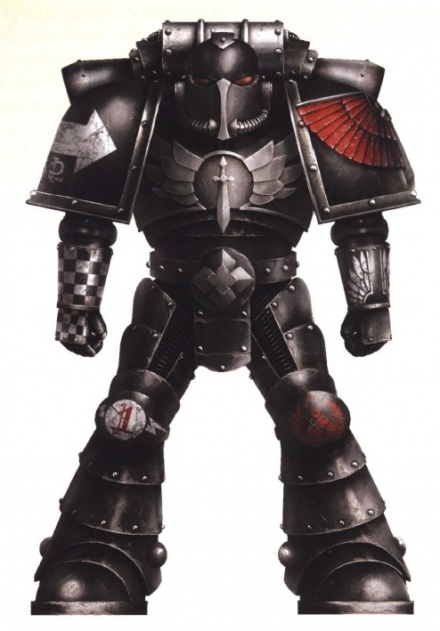

<!-- A0326-B0047 -->

原译文

Dark Angels Space Marine, original colours 黑暗天使星际战士，最初颜色

**校订译文**

Dark Angels Space Marine, original colours 黑暗天使星际战士，最初颜色

<!-- /A0326-B0047 -->

<!-- A0326-B0048 -->
**英文原文**

The Dark Angels first known engagement - and indeed the first combat engagement of the Legiones Astartes - was combating the Palace Coup at the end of the Unification Wars. These earliest warriors quickly gained a reputation amongst the disparate armies of the Emperor as the Uncrowned Princes. Fighting at first as small groups within the Emperor's own hosts, these Crowns inspired both unity and a certain arrogance in the first Space Marines and spurred them to lead the way amongst the growing Astartes brotherhood. The Uncrowned Princes would become the first Hosts of the First Legion and were later refined into the Hexagrammaton by Lion El'Jonson. These Hosts were not bound by Company or Commander and existed throughout the Legion, at any given battle at least some small number of a given Host would be present to advise and lead their comrades. As many as 18 Hosts were known to exist in the Legion's early years, though by the end of the Great Crusade only six existed. These early hosts gained fame in battles of the Unification Wars such as the Third Siege of Antioch in 603.M30, in which nine Hosts spread across four Companies saw action, though they numbered less than 30 warriors each. In these actions the First Legion became the testbed for the various tactics and doctrines that would later become the Principia Bellicosa of the Legiones Astartes. As other Legions grew in size, some of the more specialized Hosts became obsolete and were disbanded while others were simply destroyed in combat due to their inadequacies. Far from harming the Legion, it left the First Legion a well-honed weapon forged by a bond between disparate warriors. This bond was based upon a sense of superiority and distinction instilled in them.

<!-- /A0326-B0048 -->

<!-- A0326-B0049 -->

原译文

黑暗天使第一次已知的交战 — 事实上也是阿斯塔特军团的第一次战斗交战 — 是在统一战争结束时与皇宫政变作战。这些最早的战士很快在帝皇的不同军队中获得了无冕王子的声誉。起初，在帝皇的天军中作为小队作战，激发了第一批星际战士的团结和某种傲慢，并促使他们在不断壮大的阿斯塔特兄弟会中发挥领导作用。无冕王子将成为第一军团的第一批军队，后来被莱昂·艾尔庄森精炼为六翼。这些天军不受连队或指挥官的约束，存在于整个军团中，在任何一场战斗中，至少会有一小部分天军在场，为他们的战友提供建议和领导。在军团的早期，已知存在多达18个天军，尽管到大远征结束时，只存在6个。这些早期的天军在统一战争中声名鹊起，603.M30的第三次安条克围城，其中分布在四个连队的九个天军参加了战斗，尽管他们每个的战士人数不到30人。在这些行动中，第一军团成为各种战术和学说的试验场，这些战术和学说后来成为阿斯塔特军团的战策基理。随着其他军团规模的扩大，一些更专业的天军变得过时并被解散，而另一些则因其不足而在战斗中被摧毁。它非但没有伤害第一军团，反而让第一军团成为由不同战士之间的纽带锻造而成的精良武器。这种联系是基于灌输给他们的优越感和区别感。

**校订译文**

黑暗天使首次有记录的交战，也是阿斯塔特军团首次投入战斗，是在统一战争末期镇压皇宫政变。这些最早的战士很快在帝皇麾下来源各异的军队中赢得“无冕王子”的称号。他们起初以小规模队伍随帝皇大军作战；这一称号既强化了首批星际战士的团结，也滋生了某种傲慢，促使他们在不断壮大的阿斯塔特兄弟群体中争当先锋。无冕王子逐渐形成第一军团最早的“天军”，后来由莱昂·艾尔’庄森整理为六翼体系。天军不受单一连队或指挥官的编制限制，成员分布于整个军团；任何一场战斗中，通常都有某一天军的少量成员在场，为同袍提供指导并带领作战。军团早期已知曾有多达十八支天军，到大远征结束时则只剩六支。这些早期天军在统一战争中建立威名，例如603.M30的第三次安条克围城战：分属四个连队的九支天军参战，尽管每支投入的战士都不足三十人。在这些行动中，第一军团试验各种战术与学说，最终形成了后来阿斯塔特军团的《军团组织法典》。其他军团逐渐壮大后，一些过于专门化的天军不再适用，遂被解散；另一些则因自身缺陷在战斗中覆灭。这一过程并未削弱第一军团，反而以不同战士间的纽带，将其锻造成一件磨砺精良的武器。而这种纽带，建立在战士心中深植的优越感与独特身份之上。

**校注：** 天军 Host 是跨连队的专门组织，与普通军队的 host 分开；Principia Bellicosa 按核心定译军团组织法典。

<!-- /A0326-B0049 -->

<!-- A0326-B0050 图片 -->
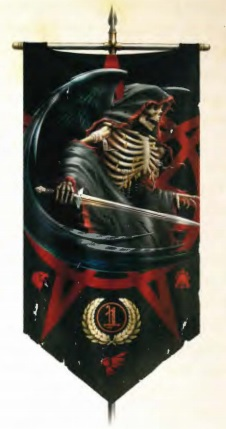

<!-- A0326-B0051 -->

原译文

The winged reaper, the original symbol of the 1st Legion 带翼收割者，第一军团的最初标志

**校订译文**

The winged reaper, the original symbol of the 1st Legion 带翼收割者，第一军团的最初标志

<!-- /A0326-B0051 -->

<!-- A0326-B0052 -->
**英文原文**

The First Legion was by far the largest Astartes force by the later of the Unification Wars, numbering 10,000 while the other Legiones were often a few hundred each. At the Siege of Samerkend in 668.M30 the First Legion took to the field en mass publicly for the first time. With the Emperor himself at their head, the First Legion faced its first true combat test as all 10,000 Astartes backed by contingents from four other Legions took to the field against 200,000 gene-forged Udug Hul of the Great King of Akkad. It took only ten hours for the First Legion to emerge victorious and slay the Great King of Akkad, whose head was given to the first Legion Master Hector Thrane. This first victory was to set a pattern of the First Legion's battles during the Unification Wars and the Sol System, pitting them against the most horrific of foes with orders to eradicate them completely. This process repeated itself at Fortress Thirty-One in the Thulean Wastes and the Battle of Karnakon amid the cryo-volcanic mountains of Sedna. To prosecute these horrific campaigns the Emperor granted the First Legion the most forbidden and ancient weaponry from his vaults. These included biological weaponry which assailed the enemy at the genetic level, radiation weapons, nanite scourges, magna planet-breakers, and vortrex weaponry.

<!-- /A0326-B0052 -->

<!-- A0326-B0053 -->

原译文

到统一战争后期，第一军团是迄今为止最大的阿斯塔特部队，人数为10000人，而其他军团通常各只有几百人。668.M30的萨默肯围城中，第一军团首次公开亮相。在帝皇亲自率领下，第一军团面临着第一次真正的战斗考验，所有10000名阿斯塔特在其他四个军团的特遣队的支持下，与阿卡德伟大国王的200,000名基因铸造的乌杜格·胡尔作战。第一军团只花了十个小时就取得了胜利，杀死了阿卡德伟大国王，他的头被交给了第一军团团长赫克托·瑟兰。这场第一场胜利为第一军团在统一战争和太阳系期间的战斗设定了典范，让他们与最可怕的敌人对抗，并下令彻底消灭他们。这一过程在图林荒原的三十一号要塞和塞德纳低温火山山脉中的卡纳克之战中重演。为了进行这些可怕的战役，帝皇从他的秘库里给了第一军团最禁止和最古老的武器。这些武器包括在基因层面攻击敌人的生物武器、辐射武器、纳米天灾、巨型行星破坏者和涡旋武器。

**校订译文**

统一战争后期，第一军团已有一万名阿斯塔特，规模远超通常仅有数百人的其他军团。668.M30的萨默肯围城战中，第一军团首次公开以大规模兵力出战。在帝皇亲自率领下，全体一万名阿斯塔特与来自另外四个军团的分遣队，一同对抗阿卡德大王的二十万名基因改造战士乌杜格·胡尔，迎来首次真正的大战考验。仅十小时后，第一军团便赢得胜利，杀死阿卡德大王，将其首级献给首任军团长赫克托·瑟兰。这场胜利确立了他们在统一战争及太阳系征战中的典型使命：迎战最骇人的敌人，并将其彻底消灭。图林荒原的三十一号要塞，以及塞德纳冰火山山脉间的卡纳克之战，都再次遵循了这一模式。为打赢这些恐怖战役，帝皇从秘库中取出极为古老、被列为禁忌的武器授予第一军团，包括直接攻击敌人基因的生物武器、辐射武器、纳米灾疫、巨型碎星武器与涡旋武器。

**校注：** vortrex 疑为 vortex 的拼写错误，按上下文译为涡旋武器；magna planet-breakers 为武器描述，暂译巨型碎星武器，未补未见的技术细节。

<!-- /A0326-B0053 -->

<!-- A0326-B0054 -->
**英文原文**

Thus among the armies of Unification it was the First Legion which became synonymous with death and were feared and regarded with ominous superstition by their mortal allies. This reputation eventually found its way into the Legion itself, and they adopted the skeletal icon of death as their own. While other growing Legions were granted lesser honours of standing triumphant in mundane wars of conquest, the First realized that they were the left hand of the Emperor himself and took pride in their solitary self-imposed exile and dour demeanour. In time they became known as the Angels of Death, a title that has since become synonymous to all Space Marines but was originally theirs alone.

<!-- /A0326-B0054 -->

<!-- A0326-B0055 -->

原译文

因此，在统一军队中，第一军团成为了死亡的代名词，被他们的凡人盟友视为不祥迷信。这种声誉最终进入了军团本身，他们采用了死亡的骷髅图标作为自己的标志。虽然其他不断壮大的军团在世俗的征服战争中获得了较少的胜利荣誉，但第一军团意识到他们是帝皇的左手，并为他们孤独的自我放逐和阴沉的举止感到自豪。随着时间的推移，他们被称为“死亡天使”，这个头衔后来成为所有星际战士的代名词，但最初只是他们的。

**校订译文**

因此，在统一战争的军队中，第一军团成了死亡的代名词。凡人盟友既恐惧他们，也以各种不祥的迷信看待他们。这种声名最终影响了军团自身，他们选用象征死亡的骷髅作为标志。其他日渐壮大的军团在寻常征服战争中凯旋，获得在第一军团看来较低一等的荣誉；第一军团则认定自己是帝皇的左手，并以自我隔绝的孤独与冷峻作风为傲。渐渐地，他们被称为“死亡天使”。这一称号后来成为所有星际战士的代名词，最初却只属于他们。

<!-- /A0326-B0055 -->

<!-- A0326-B0056 -->
### Great Crusade 大远征

<!-- /A0326-B0056 -->

<!-- A0326-B0057 -->
**英文原文**

In the earliest days of the Great Crusade the First pushed out of the Sol System, cleansing the Oort Cloud and keeping watch along the Heliopause border for terrors that sought to slip into the Emperor's new realm. They also liberated the outermost edges of the Sol System, recovering whatever few Human survivors could be found. By this point the Legion had become isolated and developed a complex culture of ciphers and rituals alongside the creation of the first specialized Orders. Upon their return from the outer Sol System their grey armor had been changed to pitch black. Upon their return they mustered at Saturn, where the Emperor gifted them a fleet of ancient but highly advanced warships. In the ensuing Great Crusade across the greater Galaxy the First Legion continued their role as exterminators, using forbidden Archaeotech such as Gene-Phages and Rad-Waves to annihilate enemies deemed too terrible to face in open battle. As other Legions and Expeditionary Fleet oversaw the colonization and compliance of countless worlds The First fought nightmarish creatures and Xenos without hesitation or complaint. Many of their campaigns, such as those as Behtelgen IV, have been deemed classified and thus to many the early career of the First Legion seems lacking.

<!-- /A0326-B0057 -->

<!-- A0326-B0058 -->

原译文

在大远征的最初几天，第一军团冲出了太阳系，清理了奥尔特星云，并沿着太阳系边界监视着试图潜入帝皇新领域的恐怖活动。他们还解放了太阳系的最外边缘，找到了为数不多的人类幸存者。到那时，军团已经被孤立，并在创建第一个专门的骑士团的同时，发展了一种复杂的密码和仪式文化。当他们从外太阳系返回时，他们的灰色盔甲已经变成了漆黑。他们返回后，在土星集合，帝皇送给他们一支古老但高度先进的战舰舰队。在随后的银河系大远征中，第一军团继续扮演着灭绝者的角色，使用被禁止的考古技术，如基因噬菌体和辐射波，消灭被认为太可怕而无法在公开战斗中面对的敌人。当其他军团和远征舰队监督无数世界的殖民化和顺从时，第一军团毫不犹豫地与噩梦般的生物和异型作战。他们的许多战役，如贝特尔根四号，都被视为机密，因此对许多人来说，第一军团的早期职业生涯似乎缺乏记录。

**校订译文**

大远征初期，第一军团向太阳系外缘推进，清剿奥尔特云，守望日球层顶的边界，阻挡试图潜入帝皇新领土的恐怖之物。他们也解放了太阳系最偏远的区域，救出能够找到的少数人类幸存者。此时，军团已日趋孤立，并在建立最早的专门骑士团的同时，发展出复杂的密码与仪式文化。从太阳系外缘返回时，他们的灰色护甲已改成漆黑。他们在土星集结，帝皇在那里赐予他们一支古老而技术先进的舰队。随后的银河大远征中，第一军团继续充当灭绝者，使用基因噬体、辐射波等禁忌古科技，消灭那些被认为过于可怕、不宜正面交锋的敌人。当其他军团与远征舰队负责无数世界的殖民和归顺时，第一军团毫不迟疑、毫无怨言地迎战噩梦般的生物与异形。他们的许多战役，包括贝特尔根四号之战，都被列为机密，因此外界看来，第一军团早期的战史显得有所缺失。

<!-- /A0326-B0058 -->

<!-- A0326-B0059 -->
**英文原文**

These trials would face the Legion into a fearsome weapon and its Legion Master stood as the Left Hand of the Emperor. This role continued even as early Primarchs such as Leman Russ were rediscovered, with the Legion Master being 3rd in the Imperial Court after Malcador and Horus. However amid the countless battles the Hosts of the Hexagrammaton, once an ever-shifting body of knowledge that changed to meet each challenge, had become stagnant. The warriors of the First assumed they had reached the apex of skill and could learn no more. Recruitment from outside their enclaves on Terra was minimal and each battle led them further down the path of arrogance. Tradition and ritual became more valued than innovation, and each Order and Host jealously guarded their small fragments of lore. The Legion began to turn in upon itself as other Legions such as the Luna Wolves, Ultramarines, and Imperial Fists had grown in prestige and number of triumphs. The final blow for the Legion's fragile pride came at Canis-Balor where the First was overcome by an unknown Xenos breed and Exterminatus was enacted at the cost of Grandmaster Thrane's life.

<!-- /A0326-B0059 -->

<!-- A0326-B0060 -->

原译文

这些考验将使军团成为一种可怕的武器，其军团长站在帝皇的左手边。即使像黎曼·鲁斯这样的早期原体被重新发现，这一角色也在继续，军团长在帝国议会中排名第三，仅次于马卡多和荷鲁斯。然而，在无数的战斗中，曾经是一个不断变化的知识体系，为了应对每一个挑战而改变，六翼天军已经停滞不前。第一代的战士们认为他们已经达到了技能的顶峰，再也学不到了。从他们在泰拉的飞地外招募的人员很少，每一场战斗都使他们进一步走上了傲慢的道路。传统和仪式变得比创新更有价值，每个骑士团和天军都小心翼翼地保护着他们的小知识片段。随着其他军团，如影月苍狼、极限战士和帝国之拳的声望和胜利次数的增长，军团开始转向自己。对军团脆弱的骄傲的最后一击来自采尼斯-巴勒，在那里，第一军团被一个未知的异型种族所击败，而灭绝令的颁布是以瑟兰大导师的生命为代价的。

**校订译文**

这些考验将军团锻造成可怖的利器，其军团长也以“帝皇的左手”自居。即使黎曼·鲁斯等早期找回的原体已归来，这一地位也未动摇：军团长在帝国宫廷中位列第三，仅次于马卡多与荷鲁斯。然而，在无尽战斗中，六翼天军原本随挑战而变化的知识体系逐渐僵化。第一军团战士自认技艺已臻巅峰，再无可学之处，几乎只在泰拉原有的征募地招收新人；每场战斗都让他们更加傲慢。传统与仪式日益凌驾于创新之上，各骑士团和天军都将自己掌握的零星知识严加保密。影月苍狼、极限战士和帝国之拳等其他军团的威望与战功不断增长，第一军团却越发封闭。采尼斯—巴勒之败给他们脆弱的骄傲以最后一击：军团被一种不明异形击溃，最终执行灭绝令，瑟兰大导师也为此丧命。

<!-- /A0326-B0060 -->

<!-- A0326-B0061 -->
**英文原文**

In the aftermath of the Canis-Balor debacle turmoil swept the Legion as the various Orders and Hosts struggled for primacy. To settle this problem the First Legion held a great Council at Gramarye that saw bitter vitriol and admonition. The Council was unable to choose a new Grandmaster, forcing Malcador to intervene and choose Urian Vendraig. Vendraig's new task was to unify and rejuvenate the Legion and in an unprecedented move allowed Remembrancers to stay by his side and document the First Legion's ascension. Shortly therafter, the Imperium encountered the vicious Rangda. In their initial campaigns against the Rangad at Advex-Mors the First Legion lost 5,000 Astartes over four months. In the initial Rangdan Xenocides the divisions of the Legion were only exacerbated. At Karkasarn the First Legion attempted to regain its glory, only for Grandmaster Vendraig to meet his end after launching a hasty assault.

<!-- /A0326-B0061 -->

<!-- A0326-B0062 -->

原译文

采尼斯-巴勒大败后，随着各骑士团和天军为争夺首要地位而斗争，混乱席卷了军团。为了解决这个问题，第一军团在格拉马里举行了一次大会，会上发表了尖刻的尖酸刻薄的言论和警告。会议无法选出一位新的大导师，迫使马卡多介入并选择尤里安·万德拉戈。万德拉戈的新任务是统一和振兴军团，并采取了前所未有的举措，让纪述者留在他身边，记录第一军团的崛起。不久之后，帝国遇到了恶毒的冉丹。在阿德维克斯-莫里斯对冉丹的最初战役中，第一军团在四个月内损失了5000名阿斯塔特。在最初的冉丹大屠杀中，军团的分裂加剧。在卡尔卡萨尔，第一军团试图重新获得荣耀，但万德拉戈大导师在发动仓促的进攻后，却以失败告终。

**校订译文**

采尼斯—巴勒惨败后，各骑士团与天军争夺主导权，军团陷入动荡。为平息纷争，第一军团在格拉马里召开大会，会场却充斥尖刻的谩骂与指责。会议无法选出新大导师，迫使马卡多介入，指定尤里安·万德拉戈接任。万德拉戈的任务是重新团结并振兴军团。他采取前所未有的举措，允许纪述者随侍左右，记录第一军团的复兴。不久，帝国遭遇凶恶的冉丹。在阿德维克斯—莫里斯展开的最初战役中，第一军团仅四个月就损失五千名阿斯塔特。初期的冉丹灭绝战争加剧了军团分裂。他们试图在卡尔卡萨尔重获荣耀，万德拉戈大导师却因仓促发动突击而阵亡。

**校注：** meet his end 指阵亡，原译仅写“以失败告终”，遗漏人物死亡结果；Rangad 与 Rangda 原文词形差异不改变中文同一族名。

<!-- /A0326-B0062 -->

<!-- A0326-B0063 -->
**英文原文**

Vendraig's death stung the First Legion hard, as did Roboute Guilliman's scolding of them at the end of the battle. Command of the Legion fell to the Council of Masters who split it across the stars to seek vindication in conquest. They gave battle without remorse and without regard for their own life. The 9th and 14th Chapters took the coral citadels of Melnoch from the Fra'al in a single night at the cost of a tenth of their own, all to outpace the Luna Wolves elsewhere in the cluster. Upon Vorsingun a force of 1,000 Initiates and 4,000 war engines of the Host of Iron battled an Ork horde over three times its size. They prevailed, but again at a fearsome price. Yet for each victory the Legion could not regain its former reputation. By the mid Great Crusade they had become known as grim death-seekers as each Chapter, Host, and Order waged its own independent wars.

<!-- /A0326-B0063 -->

<!-- A0326-B0064 -->

原译文

万德拉戈的死深深地刺痛了第一军团，罗伯特·基里曼在战斗结束时对他们的责骂也是如此。军团的指挥权落在了导师议会手中，他们将军团分散到各个星球，以寻求征服的正义。他们毫无悔意地战斗，也不考虑自己的生命。第9战团和第14战团在一个晚上以十分之一的代价从弗拉尔手中夺取了梅尔诺赫的珊瑚城堡，所有这些都超过了星簇中其他地方的影月苍狼。在沃辛根，一支由1000名信徒和4000台钢铁天军的战争引擎组成的部队与一支规模超过其三倍的欧克部落作战。他们赢了，但再次付出了可怕的代价。然而，每一次胜利，军团都无法恢复以前的声誉。到大远征中期，他们已经被称为冷酷的寻死者，因为每个战团、天军和骑士团都发动了自己的独立战争。

**校订译文**

万德拉戈之死让第一军团备受打击，战后罗保特·基里曼的斥责更令他们痛苦。指挥权随后落入导师议会之手，议会将军团拆散派往群星各地，企图以征服洗雪耻辱。他们作战毫不留情，也不惜牺牲自己的性命。第九与第十四战团以损失一成兵力的代价，一夜间从弗拉尔手中攻下梅尔诺赫的珊瑚城堡，只为抢在同一星团其他地方作战的影月苍狼之前。在沃辛根，一千名正式战士与钢铁天军的四千台战争引擎，迎战规模超过自身三倍的欧克大军。他们虽获胜，却再次付出惨重代价。然而，无论取得多少胜利，军团仍无法恢复昔日声望。到大远征中期，各战团、天军和骑士团都在独立征战，而第一军团则以冷峻的寻死者之名为人所知。

**校注：** Initiates 在军团正式战士语境使用，不等于尚在训练的新兵；按本篇与各翼的正式成员称谓统一。

<!-- /A0326-B0064 -->

<!-- A0326-B0065 -->
### The Coming of the Lion 莱昂的到来

<!-- /A0326-B0065 -->

<!-- A0326-B0066 -->
**英文原文**

However the fortune of the Legion changed dramatically when the First Legion's Primarch Lion El'Jonson was discovered on Caliban. Upon reunion with his Legion The Lion tested his sons mettle by dueling the captain of the company presented before him. Though not clad in Power Armour and facing a Terminator-clad captain, The Lion bested his foe and it is said both sides learned respect for the other. From that day forth The Lion renamed the Legion the Dark Angels. Announced by the Primarch, the connotation was in fact first drawn by his mentor Luther, who quoted a section from the legend upon first seeing Astartes descending using jump packs: "And the angels of darkness descended upon pinions of fire and light...the great and terrible dark angels." The first 500 Warriors to stand alongside The Lion on Caliban would become known as the Five Hundred Companions.

<!-- /A0326-B0066 -->

<!-- A0326-B0067 -->

原译文

然而，当第一军团的原体莱昂·艾尔庄森在卡利班被发现时，军团的命运发生了巨大的变化。在与他的军团重聚后，莱昂通过与面前的连队连长决斗来考验他的子嗣的勇气。虽然没有穿上动力盔甲，面对着一个穿着终结者的连长，但莱昂击败了他的敌人，据说双方都学会了尊重对方。从那天起，莱昂将军团更名为黑暗天使。由原体宣布，其内涵实际上是由他的导师卢瑟首先绘制的，卢瑟在第一次看到阿斯塔特使用跳跃背包下降时引用了传说中的一段话：“黑暗天使降临在火与光的羽翼上……伟大而可怕的黑暗天使。”第一批在卡利班站在莱昂旁边的500名战士被称为五百伙友。

**校订译文**

然而，当第一军团的原体莱昂·艾尔’庄森在卡利班被找到后，军团的命运发生了剧变。与军团重逢时，雄狮通过挑战列队迎接他的那个连的连长，考验子嗣的本领。他没有穿动力甲，面对的却是一名身着终结者护甲的连长，但仍赢得决斗。据说，双方由此学会了彼此尊重。从那天起，雄狮将军团改名为“黑暗天使”。这一名称虽由原体宣布，典故却最先由他的导师卢瑟提出：初次看见阿斯塔特以跳跃背包降落时，卢瑟引用了传说中的一段话：“黑暗之天使乘火与光的羽翼降临……伟大而可怖的黑暗天使。”最早在卡利班侍立雄狮身旁的五百名战士，后来被称为“五百伙友”。

<!-- /A0326-B0067 -->

<!-- A0326-B0068 -->
**英文原文**

The Council of Masters however became anxious at the news, with some worried what their Primarch would think regarding the state of the Legion and and others remaining prideful. However The Lion granted new purpose and vision for the fractured Legion, his first act being to merge the many teachings of Caliban with the First Legion's Hexagrammaton. He combined both to create something new and more refined. Alongside his Xana allies the Lion then took a newly mustered host of 20,000 Legionaries - a third of the Legion - and embarked on a Crusade of his own. He sought out the scattered Companies of Dark Angels across the Great Crusade. Each Company encountered accepted their Primarch with dour allegiance and each had their Captain tested in battle by The Lion. The Lion demonstrated his worth by actions and skill rather than words and vague promises, allowing those that might doubt him to match their blades against his in honest combat. Within a few short years The Lion had gathered 100,000 Legionaires to his side and mustered them at the Legion's ancient stronghold at Gramarye.

<!-- /A0326-B0068 -->

<!-- A0326-B0069 -->

原译文

然而，导师议会对这一消息感到焦虑，一些人担心他们的原体会对军团的状态有什么看法，而另一些人则仍然感到自豪。然而，莱昂为分裂的军团赋予了新的目标和愿景，他的第一个行动是将卡利班的许多教义与第一军团的六翼融合在一起。他将两者结合起来，创造了一些新的、更精致的东西。随后，莱昂与他的夏纳盟友一起，召集了新召集的2万名军团士兵 — 占军团总数的三分之一 — 并开始了自己的远征。他在大远征中寻找分散的黑暗天使军团。每个遇到的连队都以严肃的忠诚接受了他们的原体，每个连队的连长都在战斗中接受了莱昂的考验。莱昂通过行动和技能而不是言语和模糊的承诺来证明自己的价值，让那些可能怀疑他的人在真诚的战斗中用剑刃来对抗他。在短短几年内，莱昂已经召集了10万名军团成员，并将他们聚集在军团在格拉马里的古老据点。

**校订译文**

导师议会听到原体归来的消息，却感到不安。有些人担忧他会如何看待军团的现状，另一些人则仍抱持傲慢。雄狮为分裂的军团赋予了新目标与方向，首先将卡利班的诸多传统同第一军团的六翼体系融合，形成更为完善的新制度。随后，他与夏纳盟友一道，率新近集结的两万名军团战士——约占全团三分之一——展开自己的远征，逐一寻找散布于大远征各战线的黑暗天使连队。每个连都以冷峻而忠诚的态度迎接原体，每位连长也都接受他的战斗考验。雄狮以行动与技艺证明自己，允许心存怀疑者堂堂正正地与他比剑，而不靠空泛言辞与承诺服众。短短数年，他身边便集结了十万名军团战士，并将他们召回格拉马里这座军团古老的据点。

<!-- /A0326-B0069 -->

<!-- A0326-B0070 -->
**英文原文**

At Gramarye another Legion Council was held and this time The Lion dueled the ceremonial Council Champion Pyrhus Calagat, master of the Host of Fire. In an hour long legendary duel the Primarch won the trial and accepted the titles of Grandmaster of the First Legion and the six Wings of the Hexagrammaton: the Deathwing, Ravenwing, Dreadwing, Firewing, Ironwing, and Stormwing. Before his Legion the Lion took a final oath before his sons, and they in turn swore oaths of their own to their Primarch. His oath sworn, the Lion placed new masters over each Wing and formalized the various informal Orders in the style of Caliban's Knightly Orders. By this time the new recruits from Caliban were ready and The Lion swiftly incorporated them into The Legion. The Lion's first act was to move on Karkasarn, which had since rose in rebellion against its Ultramarines garrison. The reorganized Dark Angels under The Lion fought brilliantly, sweeping aside any memories of their earlier humbling on the world and saving their Ultramarines allies from being overwhelmed.

<!-- /A0326-B0070 -->

<!-- A0326-B0071 -->

原译文

在格拉马里，又举行了一次军团会议，这次莱昂与议会冠军、火焰天军之主皮鲁斯·卡拉加特决斗。在长达一小时的传奇决斗中，原体赢得了试炼，并接受了第一军团大导师和六重圣道六翼的称号：死翼、鸦翼、恐翼、炎翼、铁翼和风暴翼。在他的军团面前，莱昂在他的子嗣面前做了最后的宣誓，他们又向他们的原体宣誓。他宣誓后，莱昂在每个翼上都任命了新的导师，并以卡利班骑士勋章的风格正式确立了各种非正式的勋章。这时，卡利班的新兵已经准备就绪，莱昂迅速将他们编入了军团。莱昂的第一个行动是向卡尔卡萨尔进军，卡尔卡萨尔叛乱反抗其极限战士驻军。重组后的黑暗天使在莱昂的带领下进行了出色的战斗，扫除了他们早期在世界上的任何屈辱记忆，并拯救了他们的极限战士盟友免于被击败。

**校订译文**

格拉马里再次召开军团大会。这一次，雄狮与担任议会礼仪冠军的火焰天军之主皮鲁斯·卡拉加特决斗。经过长达一小时、后来成为传奇的较量，原体通过试炼，接受第一军团及六翼的大导师之位。六翼分别为死翼、鸦翼、恐翼、炎翼、铁翼与风暴翼。雄狮在全军子嗣面前作出最终誓言，战士们也向原体宣誓效忠。随后，他为每一翼任命新导师，并参照卡利班骑士团的形式，将原本松散的各类骑士团正式制度化。此时，卡利班的新兵已训练完毕，雄狮迅速将他们编入军团。他首先挥军卡尔卡萨尔；该地此时已叛乱，反抗驻守的极限战士。重组后的黑暗天使在雄狮率领下战绩卓著，一扫此前在此蒙受的屈辱，并救下濒临被击溃的极限战士盟友。

**校注：** Order 在此为骑士团或内部组织，原译误作“勋章”；标题应理解为军团及六翼的大导师，不是原体本人获得六个翼名。

<!-- /A0326-B0071 -->

<!-- A0326-B0072 -->
**英文原文**

As though to answer The Lion's call the Rangda renewed their invasion of the Imperium. In the Rangdan Xenocides waged on, this time with The Lion leading his Legion alongside his brother Leman Russ. As the first of the Astartes Legions, the Dark Angels were quite large during the early to mid Great Crusade. However during the Rangdan Xenocides the First Legion lost 50,000 Battle-Brothers saving the northern Imperium, a steep cost they would never truly recover from. This contributed to the Dark Angels eventually losing their status as the most powerful Space Marine Legion, a title that would ultimately be claimed by the Ultramarines.

<!-- /A0326-B0072 -->

<!-- A0326-B0073 -->

原译文

仿佛是为了回应莱昂的召唤，冉丹再次入侵了帝国。在冉丹大屠杀中，这一次莱昂与他的兄弟黎曼·鲁斯一起领导他的军团。作为阿斯塔特军团的第一支，黑暗天使在大远征早期到中期相当庞大。然而，在冉丹大屠杀期间，第一军团失去了5万名战斗兄弟，拯救了帝国北方，这是他们永远无法真正恢复的巨大代价。这导致了黑暗天使最终失去了他们作为最强大的星际战士军团的地位，这一头衔最终被极限战士夺得。

**校订译文**

仿佛回应雄狮的召唤，冉丹再次入侵帝国，冉丹灭绝战争继续。这一次，雄狮亲率军团，与兄弟黎曼·鲁斯共同作战。作为最早的阿斯塔特军团，黑暗天使在大远征早期至中期拥有庞大兵力。然而，为拯救帝国北部，第一军团在冉丹灭绝战争中损失五万名战斗兄弟，此后始终未能真正弥补这一惨重损失。这也促使黑暗天使最终失去最强大星际战士军团的地位，而这一地位后来由极限战士取得。

<!-- /A0326-B0073 -->

<!-- A0326-B0074 -->
**英文原文**

Caliban was made the homeworld of the Dark Angels and the whole of the Order moved to join the ranks of the Astartes. Those knights who were still young enough had the Legion's gene seed implanted within them. Those too old for this process underwent surgery to transform them into elite warriors of the Imperium. Although they were not full Space Marines, their enhancements granted them special abilities and a lifespan beyond those of normal men. The first to be brought into the Legion in this way was Luther, who became Jonson's second-in-command, just as he always had been within the Order. However, the Dark Angel's contributions to the Great Crusade had barely begun when the Lion sent Luther and a small contingent of Dark Angels back to Caliban, purportedly to garrison the world and increase the speed and quality of the training given to the Legion's recruits. Whatever the reason, the force sent back felt disgraced and rejected.

<!-- /A0326-B0074 -->

<!-- A0326-B0075 -->

原译文

卡利班成为了黑暗天使的家园，整个骑士团都加入了阿斯塔特的行列。那些还足够年轻的骑士体内植入了军团的基因种子。那些年纪太大而无法进行这一过程的人接受了手术，将他们变成了帝国的精英战士。虽然他们不是完整的星际战士，但他们的增强赋予了他们特殊的能力和超出正常人的寿命。第一个以这种方式加入军团的是卢瑟，他成为庄森的副手，就像他一直在骑士团一样。然而，当莱昂派卢瑟和一小队黑暗天使回到卡利班时，黑暗天使对大远征的贡献才刚刚开始，据称是为了驻扎世界，提高军团新兵的训练速度和质量。无论出于什么原因，被遣返的部队都感到耻辱和被拒绝。

**校订译文**

卡利班成为黑暗天使的家园世界，整个骑士团都加入了阿斯塔特的行列。年龄仍适宜的骑士接受军团基因种子植入；年龄过大的成员则通过其他外科改造，成为帝国的精锐战士。他们并非完整意义上的星际战士，但强化手术仍赋予他们非凡能力，以及超出常人的寿命。卢瑟是第一个以这种方式加入军团的人，并成为庄森的副手，延续了他在骑士团中的地位。然而，黑暗天使投入大远征不久，雄狮便将卢瑟与一小支黑暗天使部队送回卡利班，名义上是让他们驻守母星，并提升新兵训练的速度与质量。无论真正原因是什么，被遣返的人都感到受辱和遭到排斥。

<!-- /A0326-B0075 -->

<!-- A0326-B0076 -->
**英文原文**

The Great Crusade had to go on: there were countless human worlds that were still under the influence of Chaos or suppressed by the harsh rule of alien races. In an infamous episode of the Great Crusade, the Lion and Leman Russ, Primarch of the Space Wolves Legion, came to blows over the latter's action during the siege of the Crimson Fortress. This event began a feud that still continues strong in the 41st millennium, usually taking the form of a ritualistic duel between two elected champions, although it has been known to manifest itself in a very violent manner. As Jonson's fame spread throughout the galaxy and reports of his great deeds and prowess in battle reached the Legion's homeworld, Luther felt robbed of his share of the glory. He wanted the fame and recognition that he felt he deserved as Jonson's equal. His role as planetary governor of some half-forgotten backwater world seemed more and more to him like an insult. The seed of jealousy and dissension that had been planted within Luther when Jonson was made the Grand Master of the Order now began to grow and rankle within his heart as the Primarch became more and more celebrated and famous.

<!-- /A0326-B0076 -->

<!-- A0326-B0077 -->

原译文

大远征必须继续下去：有无数的人类世界仍然处于混沌的影响之下，或者被异型的严酷统治所压制。在大远征的一个臭名昭著的事件中，莱昂和太空野狼军团的原体黎曼·鲁斯在围攻深红要塞期间对后者的行动进行了抨击。这一事件引发了一场在第41个千年仍然激烈的争斗，通常表现为两位受选冠军之间的仪式性决斗，尽管众所周知，这场争斗会以非常暴力的方式表现出来。随着庄森的名声传遍整个银河系，关于他在战斗中的伟大事迹和英勇事迹的报道传到了军团的家园世界，卢瑟感到自己的荣誉被剥夺了。他希望得到与庄森平起平坐的名声和认可。他作为一个半被遗忘的死水世界的行星总督，对他来说似乎越来越像是一种侮辱。当庄森被任命为骑士团的大导师时，卢瑟心中播下的嫉妒和分歧的种子现在开始在他的心中生长和怨恨，因为这位原体变得越来越出名。

**校订译文**

大远征仍须继续：无数人类世界还受混沌影响，或遭异形残酷统治。在大远征一桩著名冲突中，雄狮因太空野狼原体黎曼·鲁斯在围攻深红要塞时的举动，与他大打出手。由此形成的宿怨直到第41千年仍然延续，通常表现为双方各选一名冠军进行仪式性决斗，但有时也会演变成极为暴烈的冲突。随着庄森名扬银河，赫赫战功不断传回家园，卢瑟觉得属于自己的荣耀被夺走了。他自认与庄森平起平坐，理应得到同等的声望与认可；如今却只能担任一个偏远、近乎被遗忘世界的总督，越发觉得这是侮辱。早在庄森获任骑士团大导师时，嫉妒与不满的种子就已埋入卢瑟心中。如今原体日益声名显赫，这些情绪也不断滋长，折磨着他。

**校注：** came to blows 指两位原体动手交战，原译“进行了抨击”弱化并错置主语。

<!-- /A0326-B0077 -->

<!-- A0326-B0078 图片 -->
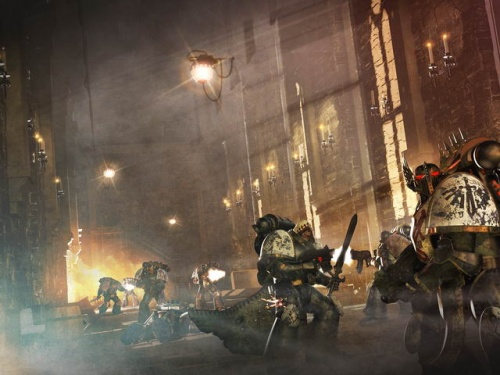

<!-- A0326-B0079 -->

原译文

Dark Angels Space Marines on Caliban 卡利班上的黑暗天使星际战士

**校订译文**

Dark Angels Space Marines on Caliban 卡利班上的黑暗天使星际战士

<!-- /A0326-B0079 -->

<!-- A0326-B0080 -->
**英文原文**

The seeds of heresy were further planted during the Dark Angels crusade against the Sarosh, who managed to sneak a nuclear warhead onto the Lion's flagship. Invincible Reason. Luther discovered the plot and for a moment, overcome by jealously, wondered if he should leave Jonson to his fate. However he quickly proved his loyalty by foiling the Sarosh assassination attempt, but somehow The Lion discovered his hesitation. Luther and a portion of the Dark Angels were sent to Caliban, but left to aid Horus during the Zaramund Campaign. The Lion was furious at this unapproved deployment and angrily demanded Luther return to his banishment. Feeling abandoned on Caliban and dealing with a rebellion by the landless nobility and Chaos agents, Luther, and his forces would slowly turn against their Primarch. However the many internal Orders and sects of the Dark Angels made them all but immune to the Warrior Lodges of the now-treacherous Horus and the Word Bearers, allowing them to be immune from the subversion that befall other Legions.

<!-- /A0326-B0080 -->

<!-- A0326-B0081 -->

原译文

在黑暗天使对萨罗什的远征中，叛乱的种子被进一步播下，萨罗什设法将核弹头偷偷带到了莱昂的旗舰无敌理性号上。卢瑟发现了这个阴谋，有一瞬间，他被嫉妒所征服，想知道他是否应该让庄森自生自灭。然而，他很快通过挫败萨罗什的暗杀企图证明了自己的忠诚，但不知何故，莱昂发现了他的犹豫。卢瑟和一部分黑暗天使被派往卡利班，但在扎拉蒙德战役中留下来帮助荷鲁斯。莱昂对这种未经批准的部署感到愤怒，愤怒地要求卢瑟回到流放地。感觉被抛弃在卡利班，并处理无地贵族和混沌特工的叛乱，卢瑟和他的部队慢慢转而反对他们的原体。然而，黑暗天使的许多内部骑士团和教派使他们几乎不受现在背信弃义的荷鲁斯和怀言者的战士结社的影响，使他们免受如其他军团的颠覆。

**校订译文**

对萨罗什人的远征又埋下了更多背叛的种子。萨罗什人设法将核弹头偷运上雄狮的旗舰无敌理性号。卢瑟发现阴谋后，一度被嫉妒吞噬，犹豫是否该任庄森自生自灭；但他很快以行动证明忠诚，挫败了暗杀。雄狮却不知通过何种途径察觉了他的迟疑。卢瑟与一部分黑暗天使被送回卡利班，后来却擅自离开，在扎拉蒙德战役中援助荷鲁斯。雄狮对这次未经批准的出动大为震怒，勒令卢瑟返回流放之地。卢瑟及其部队既觉得自己被遗弃在卡利班，又须应对失地贵族与混沌代理人发动的叛乱，便逐渐转而敌视原体。不过，黑暗天使内部众多的骑士团与派系，使其几乎不受荷鲁斯和怀言者所推行的战士结社渗透，因而避免了其他军团遭遇的那种颠覆。

**校注：** left to aid Horus 指离开卡利班去援助荷鲁斯，原译作留下来，与后句勒令返回相矛盾。

<!-- /A0326-B0081 -->

<!-- A0326-B0082 -->
### The Horus Heresy 荷鲁斯之乱

原题：The Horus Heresy 荷鲁斯叛乱

<!-- /A0326-B0082 -->

<!-- A0326-B0083 -->
**英文原文**

By the end of the Great Crusade the Dark Angels had a strength slightly under 200,000 Space Marines, but many of these were spread out across the Galaxy and unaware of the greater galactic developments.

<!-- /A0326-B0083 -->

<!-- A0326-B0084 -->

原译文

到大远征结束时，黑暗天使的力量略低于20万名星际战士，但其中许多人分散在银河系各地，没有意识到银河系的更大发展。

**校订译文**

大远征结束时，黑暗天使拥有略少于二十万名星际战士，但大量兵力散布银河各地，对银河整体局势的重大变化并不知情。

<!-- /A0326-B0084 -->

<!-- A0326-B0085 图片 -->
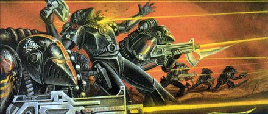

<!-- A0326-B0086 -->

原译文

Heresy-era Dark Angels 叛乱时期黑暗天使

**校订译文**

Heresy-era Dark Angels 叛乱时期黑暗天使

<!-- /A0326-B0086 -->

<!-- A0326-B0087 -->
**英文原文**

During the Horus Heresy, the Dark Angels were far from Terra, campaigning on the Gordian League shield worlds, and were unable to participate directly in the events taking place there. Nonetheless, The Lion was able to lead a small strike force to the Forge World of Diamat, denying traitor forces an important supply base. Once the bulk of the Legion was free from the war against the Gordian League, Warmaster Horus ordered the Night Lords to intercept them on the Eastern Fringe and stop them from aiding the Emperor, but after ambushing and destroying much of the Night Lords fleet in the Thramas Crusade. During the battle, Night Lords Primarch Konrad Curze became stranded aboard the Dark Angels flagship Invincible Reason, eluding capture and killing every search team sent against him. While the Lion hunted Curze himself, the Dark Angels fleet set course for Terra but became lost due to the Ruinstorm.

<!-- /A0326-B0087 -->

<!-- A0326-B0088 -->

原译文

在荷鲁斯叛乱期间，黑暗天使远离泰拉，在戈迪亚联盟屏障世界上进行战役，无法直接参与那里发生的事件。尽管如此，莱昂还是能够带领一支小型打击部队前往迪亚马特铸造世界，使叛徒部队无法获得重要的补给基地。一旦大部分军团从与戈迪亚联盟的战争中解放出来，战帅荷鲁斯命令午夜领主在东部边缘拦截他们，阻止他们协助帝皇，但在萨拉玛斯远征中伏击并摧毁了大部分午夜领主舰队之后。在战斗中，午夜领主原体康拉德·柯兹被困在黑暗天使旗舰无敌理性号上，躲过了抓捕，杀死了所有派来对付他的搜索队。当莱昂自己追捕科兹时，黑暗天使舰队驶向泰拉，但由于毁灭风暴而迷失了方向。

**校订译文**

荷鲁斯之乱爆发时，黑暗天使远离泰拉，正在戈尔迪安联盟的屏障世界作战，无法直接介入泰拉局势。尽管如此，雄狮仍率一支小型打击部队前往铸造世界迪亚马特，阻止叛军获得这处重要补给基地。军团主力摆脱与戈尔迪安联盟的战争后，战帅荷鲁斯命午夜领主在银河东部边缘拦截他们，阻止其援助帝皇。黑暗天使则在萨拉玛斯远征中设伏，摧毁了午夜领主舰队的大部。战斗期间，午夜领主原体康拉德·科兹被困在黑暗天使旗舰无敌理性号上。他躲避追捕，杀死每支派来搜寻他的队伍。雄狮亲自猎捕科兹时，黑暗天使舰队开始驶向泰拉，却因毁灭风暴而迷失。

**校注：** 英文 but after 引出的分句残缺，译文依已给出的动作补齐最小句法关系，未补入新事件。

<!-- /A0326-B0088 -->

<!-- A0326-B0089 -->
**英文原文**

During their battles against Daemons in the Warp, the Dark Angels violated the Council of Nikea on direct orders from The Lion by reestablishing Librarians. Due to the Warp Storms plaguing the Eastern Fringes the Dark Angels followed the Pharos and moved to Ultramar and joined with Roboute Guilliman and his Ultramarines, helping form the brief Imperium Secundus. During the Lion's obsessive hunt for Curze, the Dark Angels were used to enforce martial law on Macragge and the Dreadwing hunted the Night Haunter across Ultramar. Meanwhile, another detachment of Dark Angels under Captain Ormand reinforced the Space Wolves against the Alpha Legion at the Alaxxes Nebula while another under Corswain was tasked by The Lion with hunting down Calas Typhon following the Battle of Perditus.

<!-- /A0326-B0089 -->

<!-- A0326-B0090 -->

原译文

在亚空间与恶魔的战斗中，黑暗天使根据莱昂的直接命令，重建了智库，违反了尼凯亚会议。由于亚空间风暴困扰着东部边缘，黑暗天使跟随法罗斯前往奥特拉马，并与罗伯特·基里曼和他的极限战士会合，帮助组建了短暂的第二帝国。在莱昂痴迷于追捕科兹的过程中，黑暗天使被用来对马库拉格实施戒严令，恐翼在奥特拉马追捕午夜幽魂。与此同时，奥蒙德连长率领的另一支黑暗天使分队在阿拉克西斯星云加强了太空野狼对抗阿尔法军团的力量，而考斯韦恩率领的另外一支分队则在佩迪图斯之战后被莱昂派去追捕卡拉斯·泰丰斯。

**校订译文**

在亚空间中对抗恶魔时，雄狮直接下令恢复智库员制度，违反了尼凯亚会议的禁令。银河东部边缘深受亚空间风暴困扰，黑暗天使循法罗斯灯塔的指引来到奥特拉玛，与罗保特·基里曼及极限战士会合，参与建立了短暂存在的第二帝国。雄狮执着于追捕科兹，黑暗天使因此被用于在马库拉格实施戒严，恐翼则在奥特拉玛各地搜捕午夜幽魂。与此同时，奥蒙德连长率领的一支分遣队在阿拉克斯星云增援太空野狼，对抗阿尔法军团；佩迪图斯之战后，另一支由考斯韦恩率领的部队则奉雄狮之命追击卡拉斯·提丰。

**校注：** Calas Typhon 按核心译为卡拉斯·提丰，与其后来使用的 Typhus 泰丰斯区分。

<!-- /A0326-B0090 -->

<!-- A0326-B0091 图片 -->
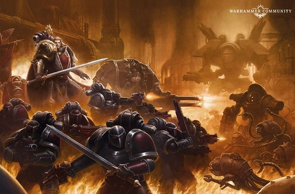

<!-- A0326-B0092 -->

原译文

Lion El'Jonson leads the Dark Angels during the Horus Heresy 莱昂·艾尔庄森领导黑暗天使在荷鲁斯叛乱期间

**校订译文**

Lion El'Jonson leads the Dark Angels during the Horus Heresy 莱昂·艾尔’庄森在荷鲁斯之乱期间率领黑暗天使。

<!-- /A0326-B0092 -->

<!-- A0326-B0093 -->
**英文原文**

Ultimately after a number of disasters, clashes between Guilliman, Sanguinius, and Lion El'Jonson, and a vision by Sanguinius that the Emperor was alive, Imperium Secundus was abolished. The three Primarch's led their Legions in an attempt to breach the Ruinstorm and reach Terra. Through an arduous journey, they eventually reached Davin, the nexus of the Ruinstorm, and engaged a vast Daemonic host. After the battle and the destruction of Davin, a way to Terra through the Ruinstorm was clear. However, in their way stood many enemy blockades as Horus had foreseen this route. Sanguinius and the Blood Angels raced directly for Terra, as was their destiny, while Guilliman and Lion El'Jonson led the Ultramarines and Dark Angels in diversionary attacks against Horus' blockade.

<!-- /A0326-B0093 -->

<!-- A0326-B0094 -->

原译文

最终，在经历了一系列灾难、基里曼、圣吉列斯和莱昂·艾尔庄森之间的冲突，以及圣吉列斯认为帝皇还活着的愿景之后，第二帝国被废除。三位原体率领他们的军团试图突破毁灭风暴，到达泰拉。经过一段艰苦的旅程，他们最终到达了毁灭风暴的中心戴文，并被一位庞大的恶魔宿主吸引。在战斗和戴文的毁灭之后，通过毁灭风暴前往泰拉的道路变得清晰起来。然而，由于荷鲁斯预见到了这条路线，许多敌人封锁了他们。圣吉列斯和圣血天使直接冲向泰拉，这是他们的命运，而基里曼和莱昂·艾尔庄森则带领极限战士和黑暗天使对荷鲁斯的封锁进行了转移注意力的攻击。

**校订译文**

在接连发生灾难，基里曼、圣吉列斯与莱昂·艾尔’庄森屡次冲突，又由圣吉列斯通过幻象得知帝皇尚在世后，第二帝国最终被废止。三位原体率领各自军团，试图冲破毁灭风暴、抵达泰拉。经历艰辛航程，他们终于来到风暴的枢纽戴文，与一支庞大的恶魔军队交战。战斗结束，戴文遭到毁灭，穿越风暴前往泰拉的道路随之打开。然而，荷鲁斯早已料到这条路线，沿途布置了多重封锁。圣吉列斯与圣血天使直奔泰拉，履行自己的命运；基里曼与雄狮则率极限战士及黑暗天使发动牵制进攻，分散荷鲁斯封锁部队的兵力。

**校注：** Daemonic host 是恶魔军队，不是恶魔宿主；engaged 指交战，原译误成受到吸引。

<!-- /A0326-B0094 -->

<!-- A0326-B0095 -->
**英文原文**

By the time of the Siege of Terra the Lion hoped to draw away traitor forces from the Throneworld by striking at their own homeworlds. As a result, the Dark Angels destroyed several traitor homeworlds such as Chemos, Nuceria, and Barbarus. Meanwhile Corswain's fleet of Dark Angels was able to reach Terra and aid the loyalists. Rendezvousing with Admiral Niora Su-Kassen and using the Imperator Somnium to break the traitor blockade of Terra, Corswain and his 10,000 Dark Angels were able to land upon the Throneworld's surface and recapture the Astronomican.

<!-- /A0326-B0095 -->

<!-- A0326-B0096 -->

原译文

在泰拉围城时，莱昂希望通过袭击家园世界来从王座世界中吸引叛徒势力。结果，黑暗天使摧毁了几个叛徒的家园世界，如彻莫斯、努凯里亚和巴巴鲁斯。与此同时，考斯韦恩的黑暗天使舰队能够到达泰拉并帮助忠诚者。与海军上将尼奥拉·苏-卡珊会面，并利用帝皇幻梦号打破了对泰拉的叛徒封锁，考斯韦恩和他的10,000名黑暗天使得以降落在王座世界的表面并夺回了星炬。

**校订译文**

泰拉围城战期间，雄狮试图攻击叛军的家园世界，吸引其兵力离开王座世界。黑暗天使因此毁灭了彻莫斯、努凯里亚、巴巴鲁斯等多颗叛军母星。与此同时，考斯韦恩的黑暗天使舰队成功抵达泰拉，支援忠诚派。他们与海军上将尼奥拉·苏—卡珊会合，利用帝皇幻梦号突破叛军封锁，使考斯韦恩及其一万名黑暗天使得以登陆泰拉，夺回星炬。

<!-- /A0326-B0096 -->

<!-- A0326-B0097 -->
**英文原文**

The Dark Angels main fleet was eventually able to set course for Terra. Their impending arrival, closely following that of the Ultramarines and Space Wolves legions, (who had overcome similar obstacles), forced Horus to gamble everything on a duel with the Emperor, his former master. Horus was defeated by the Emperor, although the Emperor himself was fatally wounded and had to be entombed within the life-preserving mechanism of the Golden Throne. Lion El'Jonson was stricken with grief over the fact that he had not been able to protect the Emperor against Horus. After the Heresy, the Dark Angels helped restore order to the Imperium. However, during this time, the Dark Angels who had been left behind on Caliban became agitated at being forced to essentially babysit a backwater planet. This led to the leader of the garrison, Luther, turning to the Gods of Chaos, who had just been defeated with the death of their champion Horus during the Heresy.

<!-- /A0326-B0097 -->

<!-- A0326-B0098 -->

原译文

黑暗天使主舰队最终能够为泰拉设定航向。他们即将到来，紧随极限战士和太空野狼军团（他们克服了类似的障碍）的到来，迫使荷鲁斯孤注一掷，与他的前主人帝皇决斗。荷鲁斯被帝皇击败，尽管帝皇本人受了致命伤，不得不被安葬在黄金王座的救生机制内。莱昂·艾尔庄森因未能保护帝皇免受荷鲁斯的攻击而深感悲痛。叛乱之后，黑暗天使帮助恢复了帝国的秩序。然而，在这段时间里，被留在卡利班的黑暗天使因为被迫照顾一个死水星球而变得焦躁不安。这导致驻军领袖卢瑟转向混沌诸神，他们刚刚在叛乱期间因他们死亡的冠军荷鲁斯而被击败。

**校订译文**

黑暗天使主力舰队最终得以驶向泰拉。极限战士与太空野狼也已克服类似障碍，而黑暗天使即将紧随其后抵达；这迫使荷鲁斯孤注一掷，与昔日的主人帝皇决斗。帝皇击败了荷鲁斯，却也身负致命重伤，只能被安置在黄金王座的维生装置中。莱昂·艾尔’庄森因未能保护帝皇免遭荷鲁斯重创而悲痛万分。叛乱结束后，黑暗天使协助帝国恢复秩序。然而，留守卡利班的成员对看管一个偏远星球的任务愈发不满，最终使驻军领袖卢瑟转向混沌诸神；诸神此前刚因其冠军荷鲁斯战死而遭受失败。

**校注：** 本段与前文对卢瑟转向混沌的阶段描述有所重叠，按原资料保留，未擅自将其精确限定为叛乱结束后才开始。

<!-- /A0326-B0098 -->

<!-- A0326-B0099 -->
### The Great Betrayal 大背叛

<!-- /A0326-B0099 -->

<!-- A0326-B0100 -->
**英文原文**

The Dark Angels returned to Caliban after the war, but they were fired upon by the planetary defences. They were forced to assault their own homeworld, where they found that their brethren had betrayed them. In a duel which mirrored that of the Emperor and Horus, Luther and Lion El'Jonson fought, resulting in Luther mortally wounding his former friend. Luther went insane upon realizing he had struck down his close friend and was captured. In a fit of rage at being defeated once again, the Chaos Gods opened a warp rift in the planet which scattered the traitorous "Fallen Angels" throughout the galaxy. Other sources state that the Warp Rift was caused by a causal loop in the 41st Millennium after Azrael, Cypher, Typhus, and others attempted to rewrite the history of Caliban with the Tuchulcha Engine. Regardless of the truth, one of the "Fallen Angels" who escaped is Cypher, who reportedly took with him the Lion Blade, the sword of El'Jonson, when he was sent through the warp.

<!-- /A0326-B0100 -->

<!-- A0326-B0101 -->

原译文

战争结束后，黑暗天使回到了卡利班，但他们遭到了行星防御的袭击。他们被迫攻击自己的家园世界，在那里他们发现他们的兄弟背叛了他们。在一场反映帝皇和荷鲁斯决斗的决斗中，卢瑟和莱昂·艾尔庄森发生了战斗，导致卢瑟致命地伤害了他的前朋友。卢瑟意识到自己击倒了密友并被抓获，精神错乱。在再次被击败的愤怒中，混沌诸神在行星上打开了一个亚空间裂隙，将叛乱的“堕天使”分散到整个银河系。其他消息来源称，亚空间裂隙是由第41个千年的因果循环引起的，此前阿兹瑞尔、赛弗、泰丰斯和其他人试图用图丘查引擎重写卡利班的历史。不管真相如何，逃脱的“堕天使”之一是塞弗，据信，当他被送过亚空间时，他带走了艾尔庄森的狮剑。

**校订译文**

战后，黑暗天使返回卡利班，却遭到行星防御设施开火攻击。他们被迫突袭自己的家园，发现留守兄弟已然背叛。在一场仿佛重演帝皇与荷鲁斯之战的决斗中，卢瑟重创了昔日好友莱昂·艾尔’庄森，使其濒死。意识到自己击倒至交后，卢瑟精神崩溃，随后被俘。混沌诸神因再度失败而暴怒，在卡利班撕开亚空间裂隙，将背叛的“堕天使”抛散到银河各地。另有资料称，裂隙其实由第41千年的一个因果闭环造成：阿兹瑞尔、塞弗、泰弗斯等人试图利用图丘查引擎改写卡利班历史，由此触发了这一事件。无论哪一种解释为真，塞弗都是逃脱的堕天使之一。据说，他被卷入亚空间时，带走了艾尔’庄森的狮剑。

<!-- /A0326-B0101 -->

<!-- A0326-B0102 -->
**英文原文**

The Dark Angel space fleet also bombarded the planet mercilessly, and this caused the structure of the planet to collapse. The bombardment, combined with the newly formed warp rift, broke the planet up and it is now an asteroid field. This betrayal has tainted their honour in the eyes of the Dark Angels themselves. Given that the event was purely within the Legion itself, and was on a world far from Terra, nobody outside of the Legion knows it occurred. Within the Chapters itself, only the elite veterans are permitted this knowledge - in the modern Dark Angels Chapter, only the Deathwing and senior officers know this secret. The Chapter leadership will go to great lengths to ensure that this knowledge does not reach the Imperium at large, even at times going so far as to disobey direct orders from Inquisitors and cause overly curious individuals to "disappear".

<!-- /A0326-B0102 -->

<!-- A0326-B0103 -->

原译文

黑暗天使太空舰队也无情地轰炸了这颗行星，这导致了行星的结构崩溃。这次轰炸，再加上新形成的亚空间裂隙，使这颗行星破碎，现在它是一个小行星带。这种背叛玷污了在黑暗天使眼中的荣誉。鉴于这一事件纯粹是在军团内部发生的，而且发生在一个远离泰拉的世界上，军团之外的人都不知道这件事的发生。在战团本身中，只有精英老兵才被允许知道这个秘密 — 在现代的黑暗天使战团中，只有死翼和高级军官知道这个秘密。战团领导层将竭尽全力确保这些知识不会传播到整个帝国，即使有时甚至会违背审判官的直接命令，导致过于好奇的人“消失”。

**校订译文**

黑暗天使舰队同时对卡利班实施无情轰炸，导致星球结构崩溃。轨道轰击与新形成的亚空间裂隙共同撕碎了行星，使其化为如今的小行星带。在黑暗天使自己看来，这场背叛玷污了军团的荣誉。由于事情发生在军团内部，地点又远离泰拉，军团以外无人知晓。在各后裔战团中，也只有精锐老兵获准了解此事；对现代黑暗天使而言，知情者限于死翼与高级军官。战团领袖不惜一切代价阻止秘密传遍帝国，有时甚至违抗审判官的直接命令，或让好奇过度的人“消失”。

<!-- /A0326-B0103 -->

<!-- A0326-B0104 图片 -->
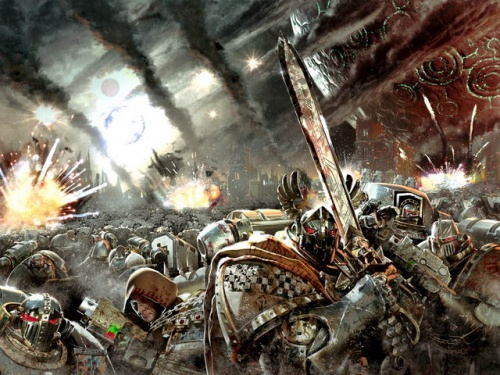

<!-- A0326-B0105 -->

原译文

The Dark Angels Legion 黑暗天使军团

**校订译文**

The Dark Angels Legion 黑暗天使军团

<!-- /A0326-B0105 -->

<!-- A0326-B0106 -->
**英文原文**

Only the most senior members, known as the Inner Circle, know the greatest secret - that Luther, the great traitor, is still alive and insane, living in a stasis cell deep within the Rock. Lion El'Jonson's body was supposedly never found; Luther claims, in his near-senseless mutterings, that the Lion is near and will return and forgive him. The Lion actually sleeps in the most secret chamber in the rock, his presence known only by the Watchers in the Dark and the Emperor himself, until the time he will awaken and lead his chapter on a new and even greater crusade. That day, so Luther said to current Supreme Grand Master Azrael, is almost at hand.

<!-- /A0326-B0106 -->

<!-- A0326-B0107 -->

原译文

只有最资深的成员，即所谓的内环，知道最大的秘密 — 大叛徒卢瑟仍然活着，精神错乱，生活在巨石深处的一个静滞舱里。莱昂·艾尔庄森的尸体据说从未被发现；卢瑟在他近乎无意义的喃喃自语中声称，莱昂就在附近，会回来原谅他。莱昂实际上沉睡在巨石中最秘密的房间里，只有黑暗守望者和帝皇知道他的存在，直到他醒来并带领他的战团进行一场新的、更伟大的远征。正如卢瑟对现任至高大导师阿兹瑞尔所说，那一天即将到来。

**校订译文**

当时，只有被称为“内环”的最高阶成员知道最深的秘密：大叛徒卢瑟仍然活着，却已精神错乱，被囚禁在巨石深处的静滞牢房中。外界据称始终没能找到莱昂·艾尔’庄森的遗体。卢瑟在近乎无意义的呓语中坚称，雄狮就在近旁，终会回来并宽恕他。实际上，雄狮沉睡于巨石最隐秘的密室，只有黑暗守望者和帝皇知道他的所在，等待苏醒后率领战团踏上更为宏大的新远征。卢瑟曾告诉时任至高大导师阿兹瑞尔，那一天已经近在眼前。

**校注：** 此段描述雄狮回归前的资料状态，与后文较新事件分开，改用历史时态避免把沉睡写成全篇当前结论。

<!-- /A0326-B0107 -->

<!-- A0326-B0108 -->
### Post-Heresy 叛乱后

<!-- /A0326-B0108 -->

<!-- A0326-B0109 -->
**英文原文**

Caliban was destroyed during the Betrayal, shattered by the warp rift and orbital bombardment. The remains now form a sizeable asteroid field. The largest piece, which survived due to the massive void shields in operation around the largest fortress-monastery, called the Tower of Angels, was hollowed out and became a gigantic spaceship/monastery which is now the home of the Dark Angels. This ship is known simply as The Rock. Sometime after the Betrayal, the Dark Angels changed their primary heraldry colour from black to dark green. Lion El'Jonson had previously decreed that Dark Angels could change their armour to green in memory of the war against the Great Beasts of Caliban.

<!-- /A0326-B0109 -->

<!-- A0326-B0110 -->

原译文

卡利班在背叛中被摧毁，被亚空间裂隙和轨道轰炸粉碎。这些残骸现在形成了一个相当大的小行星带。最大的一块，由于在最大的堡垒修道院周围运作的巨大虚空盾而幸存下来，被称为天使之塔，被挖空成为一艘巨大的宇宙飞船/修道院，现在是黑暗天使的家园。这艘船被简称为巨石。在背叛之后的某个时候，黑暗天使将他们的主要纹章颜色从黑色改为深绿色。莱昂·艾尔庄森此前曾下令，黑暗天使可以将他们的盔甲换成绿色，以纪念与卡利班巨兽的战争。

**校订译文**

大背叛期间，卡利班被亚空间裂隙与轨道轰炸撕碎，残骸形成一片庞大的小行星带。其中最大的一块，因其上最大的要塞修道院“天使之塔”受到强大虚空盾保护而幸存。黑暗天使将这块残骸内部掏空，改造成兼具修道院功能的巨型星舰，成为他们新的家园，简称“巨石”。大背叛之后的某个时期，黑暗天使将战团主色由黑色改为深绿。莱昂·艾尔’庄森此前曾准许战士将护甲涂绿，以纪念对卡利班巨兽的战争。

**校注：** Tower of Angels 指堡垒修道院名称，非小行星残片名称；原译修饰关系不清。

<!-- /A0326-B0110 -->

<!-- A0326-B0111 -->
**英文原文**

This story of treachery and betrayal is the Dark Angels' secret shame. None know of it other than some of the Dark Angels, their Successor Chapters, and, maybe, the Emperor on his Golden Throne. Within the Chapter itself very few Brother-Marines know exactly what happened during those fateful days. At the Council of , the first Chapter Master of the newly christened Dark Angels Chapter, Farith Redloss, proclaimed that the Sons of the Lion could never be forgiven of their shame until all of the Fallen are hunted down and forced to repent. The Dark Angels and their successor Chapters, the Unforgiven, have never ceased in this quest.

<!-- /A0326-B0111 -->

<!-- A0326-B0112 -->

原译文

这个变节和背叛的故事是黑暗天使的秘密耻辱。除了一些黑暗天使、他们的子战团，也许还有坐在黄金王座上的帝皇，没有人知道这件事。在战团内部，很少有星际战士兄弟确切地知道在那些决定性的日子里发生了什么。在法瑞斯会议上，新命名的黑暗天使战团的第一位战团长法瑞斯·雷德洛斯宣布，除非所有堕天使都被追捕并被迫忏悔，否则莱昂之子的耻辱永远不会被原谅。黑暗天使和他们的子战团，不可饶恕者，从未停止过这一搜索。

**校订译文**

这段背叛的历史，是黑暗天使秘不示人的耻辱。除部分黑暗天使及其后裔战团成员，以及可能知情的黄金王座上的帝皇外，无人知道真相；即便在战团内部，清楚了解那几日经过的战斗兄弟也寥寥无几。新近成立的黑暗天使战团首任战团长法瑞斯·雷德洛斯曾在一次会议上宣布，只有将所有堕天使捕获并迫使其忏悔，雄狮之子才能洗清耻辱、得到宽恕。黑暗天使与其后裔战团——统称戴罪者——从未停止这一追猎。

**校注：** 英文 At the Council of 后缺失会议名称。原译凭后文人名补成“法瑞斯会议”没有依据，现只译“一次会议”并标记缺文。

<!-- /A0326-B0112 -->

<!-- A0326-B0113 图片 -->
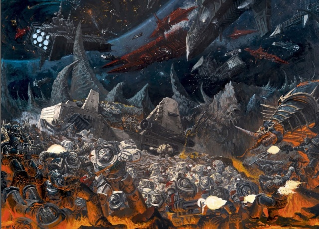

<!-- A0326-B0114 -->

原译文

The Deathwing battles the forces of Chaos 死翼与混沌部队作战

**校订译文**

The Deathwing battles the forces of Chaos 死翼与混沌部队作战

<!-- /A0326-B0114 -->

<!-- A0326-B0115 -->
### Recent History 近期历史

<!-- /A0326-B0115 -->

<!-- A0326-B0116 -->
**英文原文**

M32

**补译**

第32千年

<!-- /A0326-B0116 -->

<!-- A0326-B0117 -->
**英文原文**

580.M31 - 635.M32: The Forgotten Wars — The Dark Angels battle Chaos forces at the edge of the Eye of Terror.

<!-- /A0326-B0117 -->

<!-- A0326-B0118 -->

原译文

被遗忘的战争 — 黑暗天使在恐惧之眼的边缘与混沌势力作战。

**校订译文**

580.M31—635.M32：被遗忘的战争——黑暗天使在恐惧之眼边缘对抗混沌军队。

<!-- /A0326-B0118 -->

<!-- A0326-B0119 -->
**英文原文**

544.M32: War of the Beast — As the Dark Angels battle the Orks across the galaxy, the 4th Company under Captain Adnachiel arrived on Terra to take part in the push on Ullanor.

<!-- /A0326-B0119 -->

<!-- A0326-B0120 -->

原译文

野兽战争 — 当黑暗天使在银河系与兽人作战时，阿德纳希尔连长率领的第四连抵达泰拉，参与了对乌兰诺的推进。

**校订译文**

544.M32：野兽战争——黑暗天使在银河各地与欧克蛮人交战；阿德纳希尔连长率第四连抵达泰拉，参加向乌兰诺发动的进攻。

<!-- /A0326-B0120 -->

<!-- A0326-B0121 -->
**英文原文**

M33

**补译**

第33千年

<!-- /A0326-B0121 -->

<!-- A0326-B0122 -->
**英文原文**

560.M33: 2nd Mortis Gate Campaign — Almost the entire chapter deploys for battle.

<!-- /A0326-B0122 -->

<!-- A0326-B0123 -->

原译文

第二次莫提斯之门战役 — 几乎整个战团都部署在战斗中。

**校订译文**

560.M33：第二次莫提斯之门战役——几乎整个战团都投入作战。

<!-- /A0326-B0123 -->

<!-- A0326-B0124 -->

原译文

732 - 822.M33: Red Stars Campaign 红星战役

**校订译文**

732 - 822.M33: Red Stars Campaign 红星战役

<!-- /A0326-B0124 -->

<!-- A0326-B0125 -->
**英文原文**

After the Red Stars Campaign, Supreme Grand Master Morderan is convinced by the word of Luther to seek parlay with Cypher. However the Fallen Angel leads the Dark Angels to a disaster that naerly destroys the Chapter and led to Mordrean's fall to despair.

<!-- /A0326-B0125 -->

<!-- A0326-B0126 -->

原译文

红星战役后，至高大导师莫德兰被卢瑟的话说服，寻求与赛弗的对话。然而，堕天使带领黑暗天使陷入了一场灾难，这场灾难彻底摧毁了战团，导致莫德兰堕入绝望之中。

**校订译文**

红星战役结束后，至高大导师莫德兰听信卢瑟之言，寻求与塞弗谈判。但这名堕天使将黑暗天使引入了一场几乎毁灭战团的灾难，也使莫德兰陷入绝望。

**校注：** 英文 naerly 为 nearly 拼写错误，意为几乎毁灭；原译“彻底摧毁”误将程度写绝。Morderan／Mordrean 词形不一致，中文暂统一莫德兰。

<!-- /A0326-B0126 -->

<!-- A0326-B0127 -->
**英文原文**

M34

**补译**

第34千年

<!-- /A0326-B0127 -->

<!-- A0326-B0128 -->

原译文

101.M34: Bloodpox Campaign 血疹战役

**校订译文**

101.M34: Bloodpox Campaign 血疹战役

<!-- /A0326-B0128 -->

<!-- A0326-B0129 -->
**英文原文**

M35

**补译**

第35千年

<!-- /A0326-B0129 -->

<!-- A0326-B0130 -->

原译文

975.M35: Hrakon Campaign 哈尔孔战役

**校订译文**

975.M35: Hrakon Campaign 哈尔孔战役

<!-- /A0326-B0130 -->

<!-- A0326-B0131 -->

原译文

980.M35: Hrud Rising 赫鲁德叛乱

**校订译文**

980.M35: Hrud Rising 赫鲁德叛乱

<!-- /A0326-B0131 -->

<!-- A0326-B0132 -->
**英文原文**

M36

**补译**

第36千年

<!-- /A0326-B0132 -->

<!-- A0326-B0133 -->

原译文

408.M36: Plague of Unbelief 无信瘟疫

**校订译文**

408.M36: Plague of Unbelief 无信瘟疫

<!-- /A0326-B0133 -->

<!-- A0326-B0134 -->

原译文

439.M36: Rebulus Cleansing 瑞波勒斯清洗

**校订译文**

439.M36: Rebulus Cleansing 瑞波勒斯清洗

<!-- /A0326-B0134 -->

<!-- A0326-B0135 -->

原译文

673.M36: Siege of Dominus Prime 统御主星围城

**校订译文**

673.M36: Siege of Dominus Prime 统御主星围城

<!-- /A0326-B0135 -->

<!-- A0326-B0136 -->

原译文

913.M36: Suppression of The Bellis Rebellion 镇压贝利斯叛乱

**校订译文**

913.M36: Suppression of The Bellis Rebellion 镇压贝利斯叛乱

<!-- /A0326-B0136 -->

<!-- A0326-B0137 -->
**英文原文**

M37

**补译**

第37千年

<!-- /A0326-B0137 -->

<!-- A0326-B0138 -->
**英文原文**

551.M37: Battle of Persembe — The 3rd Company under Master Baradiel battles the hordes of the Chaos Lord Potchek on the world of Persembe.

<!-- /A0326-B0138 -->

<!-- A0326-B0139 -->

原译文

佩尔森贝之战 — 巴拉迪尔导师率领的第三连在佩尔森贝世界与混沌领主波契克的大军作战。

**校订译文**

551.M37：佩尔森贝之战——巴拉迪尔导师率第三连，在佩尔森贝迎战混沌领主波契克的大军。

<!-- /A0326-B0139 -->

<!-- A0326-B0140 -->

原译文

551.M37: Battle for Kurin's Acropolis 库林卫城之战

**校订译文**

551.M37: Battle for Kurin's Acropolis 库林卫城之战

<!-- /A0326-B0140 -->

<!-- A0326-B0141 -->

原译文

871.M37: Battle of Midpoint 中点之战

**校订译文**

871.M37: Battle of Midpoint 中点之战

<!-- /A0326-B0141 -->

<!-- A0326-B0142 -->

原译文

883.M37: Zambeque Rebellion 赞班克叛乱

**校订译文**

883.M37: Zambeque Rebellion 赞班克叛乱

<!-- /A0326-B0142 -->

<!-- A0326-B0143 -->
**英文原文**

M38

**补译**

第38千年

<!-- /A0326-B0143 -->

<!-- A0326-B0144 -->
**英文原文**

299.M38: Altid Crusade — The Dark Angels assault the world of Altid 156 and battle Elucidax the Keeper.

<!-- /A0326-B0144 -->

<!-- A0326-B0145 -->

原译文

阿尔提德远征 — 黑暗天使袭击了阿尔提德156的世界，并与守密者伊路西达克斯作战。

**校订译文**

299.M38：阿尔提德远征——黑暗天使进攻阿尔提德156号世界，与“守护者”伊路西达克斯交战。

**校注：** 原文仅称 the Keeper，未写 Keeper of Secrets，故暂按称号译守护者，不无据认定为守密者大魔。

<!-- /A0326-B0145 -->

<!-- A0326-B0146 -->

原译文

Date Unknown: The Hundred Planet Rebellion 百星叛乱

**校订译文**

Date Unknown: The Hundred Planet Rebellion 百星叛乱

<!-- /A0326-B0146 -->

<!-- A0326-B0147 -->
**英文原文**

M39

**补译**

第39千年

<!-- /A0326-B0147 -->

<!-- A0326-B0148 -->

原译文

814.M39: Relief of Rael's World 救援赖尔世界

**校订译文**

814.M39: Relief of Rael's World 救援赖尔世界

<!-- /A0326-B0148 -->

<!-- A0326-B0149 -->
**英文原文**

M41

**补译**

第41千年

<!-- /A0326-B0149 -->

<!-- A0326-B0150 -->

原译文

Date Unknown, Early M41: Macharian Heresy 马卡里安叛乱

**校订译文**

Date Unknown, Early M41: Macharian Heresy 马卡里亚叛乱

<!-- /A0326-B0150 -->

<!-- A0326-B0151 -->
**英文原文**

775.M41: Fourth Quadrant Rebellion — The entire Chapter deployed, playing a crucial role in crushing the insurrection. Sammael, Master of the Ravenwing defeated the Fallen Kaligar in a duel lasting a full day and a night.

<!-- /A0326-B0151 -->

<!-- A0326-B0152 -->

原译文

第四象限叛乱 — 整个战团部署，在粉碎叛乱中发挥了至关重要的作用。鸦翼导师萨麦尔在一场持续一天一夜的决斗中击败了堕天使卡利加。

**校订译文**

775.M41：第四象限叛乱——整个战团出动，为镇压叛乱发挥了关键作用。鸦翼导师萨麦尔在持续整整一天一夜的决斗中击败堕天使卡利加。

<!-- /A0326-B0152 -->

<!-- A0326-B0153 -->

原译文

Egamonnon Revolt 埃加蒙农叛乱

**校订译文**

Egamonnon Revolt 埃加蒙农叛乱

<!-- /A0326-B0153 -->

<!-- A0326-B0154 -->
**英文原文**

821.M41 Siege of Vraks — Supreme Grand Master Azrael led nearly half of the chapter during the Siege. The force arrived on board the Battle Barge Angel of Retribution and the Strike Cruisers Sword of Caliban and Salvation and a small number of Escorts.

<!-- /A0326-B0154 -->

<!-- A0326-B0155 -->

原译文

弗拉克斯围城 — 至高大导师阿兹瑞尔在围城中领导了近一半的战团。这支部队乘坐复仇天使号、卡利班之剑号和救赎号打击巡洋舰以及少量护卫舰抵达。

**校订译文**

821.M41：弗拉克斯围城战——至高大导师阿兹瑞尔率近半战团兵力参战。他们乘战斗驳船复仇天使号、打击巡洋舰卡利班之剑号与救赎号，以及少量护航舰抵达。

<!-- /A0326-B0155 -->

<!-- A0326-B0156 -->
**英文原文**

897.M41: Faze V Uprising — The Dark Angels battle a diabolical machine intelligence and insurgent uprising on the world of Faze V.

<!-- /A0326-B0156 -->

<!-- A0326-B0157 -->

原译文

法泽五号叛乱 — 黑暗天使在法泽五号世界与恶魔般的机器智能和叛乱作战。

**校订译文**

897.M41：法泽五号起义——黑暗天使在法泽五号世界对抗险恶的机器智能，并镇压叛乱。

<!-- /A0326-B0157 -->

<!-- A0326-B0158 -->
**英文原文**

Date Unknown, Late M41: Battle for Honoria — The Dark Angels and their Imperial Guard allies battle Waaagh! Groblonik.

<!-- /A0326-B0158 -->

<!-- A0326-B0159 -->

原译文

霍诺里亚之战 — 黑暗天使和他们的帝国卫队盟友与格罗布洛尼克的Waaagh！作战。

**校订译文**

第41千年晚期，日期不明：霍诺里亚之战——黑暗天使与帝国卫队盟友共同迎战格罗布洛尼克的 Waaagh!。

<!-- /A0326-B0159 -->

<!-- A0326-B0160 -->
**英文原文**

Battle for Sularian Gate — Last major engagement of the Battle for Honoria. Librarian Ezekiel defeats Warboss Groblonik in a duel and kills him, shattering his Waaagh!.

<!-- /A0326-B0160 -->

<!-- A0326-B0161 -->

原译文

苏拉里安之门之战 — 霍诺里亚之战的最后一场重要战役。智库以西结在一场决斗中击败了战争头目格罗布洛尼克，并杀死了他，粉碎了他的Waaagh！。

**校订译文**

苏拉里安之门之战——霍诺里亚之战最后一场重要交锋。智库员以西结在决斗中击败并杀死战争头目格罗布洛尼克，瓦解了他的 Waaagh!。

<!-- /A0326-B0161 -->

<!-- A0326-B0162 -->

原译文

Date Unknown, Late M41: Second Battle of Exyrion 第二次埃克西里昂之战

**校订译文**

Date Unknown, Late M41: Second Battle of Exyrion 第二次埃克西里昂之战

<!-- /A0326-B0162 -->

<!-- A0326-B0163 -->

原译文

959-961.M41: Pandorax Campaign 潘多拉克斯战役

**校订译文**

959-961.M41: Pandorax Campaign 潘多拉克斯战役

<!-- /A0326-B0163 -->

<!-- A0326-B0164 -->

原译文

996.M41: Cleansing of Durganion XIII 杜尔加尼翁十三号清洗

**校订译文**

996.M41: Cleansing of Durganion XIII 杜尔加尼翁十三号清洗

<!-- /A0326-B0164 -->

<!-- A0326-B0165 -->
**英文原文**

997.M41: Battle of Piscina IV — The 3rd, 5th and 9th Companies took part in the campaign; the 3rd company was honoured for its defence of the Koth Ridge.

<!-- /A0326-B0165 -->

<!-- A0326-B0166 -->

原译文

皮西纳四号之战 — 第三、第五和第九连参加了这场战役；第三连因保卫科斯岭而获得荣誉。

**校订译文**

997.M41：皮希纳四号之战——第三、第五和第九连参战，第三连因保卫科斯岭而获嘉奖。

<!-- /A0326-B0166 -->

<!-- A0326-B0167 -->
**英文原文**

Date Unknown: Elimination of Makir’s Chaos coven.

<!-- /A0326-B0167 -->

<!-- A0326-B0168 -->

原译文

根除马基尔的混沌势力。

**校订译文**

日期不明：剿灭马基尔的混沌密会。

<!-- /A0326-B0168 -->

<!-- A0326-B0169 -->
**英文原文**

Date Unknown: Kapua Campaign — The Ravenwing battles a Chaos force in the Kapua system. Sammael becomes Grand Master of the Ravenwing.

<!-- /A0326-B0169 -->

<!-- A0326-B0170 -->

原译文

卡普亚战役 — 鸦翼在卡普亚星系中与混沌势力作战。萨麦尔成为鸦翼大导师。

**校订译文**

日期不明：卡普亚战役——鸦翼在卡普亚星系与混沌军队交战，萨麦尔成为鸦翼大导师。

<!-- /A0326-B0170 -->

<!-- A0326-B0171 -->
**英文原文**

Date Unknown: Battle for Bane's Landing — The 5th Company under Master Balthasar confronts the Chaos Space Marine warband known as the Crimson Slaughter in a quest for vengeance for their earlier killings of Battle-Brothers.

<!-- /A0326-B0171 -->

<!-- A0326-B0172 -->

原译文

灾祸降落之战 — 巴尔塔萨导师率领的第五连与被称为深红屠杀者的混沌星际战士交战，为他们早些时候杀害战斗兄弟的行为报仇。

**校订译文**

日期不明：灾祸登陆点之战——巴尔塔萨导师率第五连迎战深红屠杀者混沌星际战士战帮，为此前被其杀害的战斗兄弟复仇。

<!-- /A0326-B0172 -->

<!-- A0326-B0173 -->
**英文原文**

Date Unknown: Battle for Prefectia — Dark Angels with support of the Imperial Knight Capulan fought there with the Tau KV128 Stormsurge, piloted by Shas'vre Doros.

<!-- /A0326-B0173 -->

<!-- A0326-B0174 -->

原译文

总督争夺战 — 黑暗天使在帝国骑士卡普兰的支援下，与夏斯'维的多罗斯驾驶的钛KV128风暴潮在那里作战。

**校订译文**

日期不明：总督星争夺战——黑暗天使在帝国骑士卡普兰支援下，与钛族夏斯'维阶军官多罗斯驾驶的 KV128 风暴潮交战。

**校注：** Shas'vre 为头衔或军阶，多罗斯才是驾驶员名；原译拆作“夏斯'维的多罗斯”导致人名关系不清。

<!-- /A0326-B0174 -->

<!-- A0326-B0175 -->
**英文原文**

Date Unknown: Gehöft Incursion — When the planet Gehöft became the point of the Blighted Claw attack and Daemonic incursion, Dark Angels of Sammael with the aid of the White Scars Chapter and Brindelweld Imperial Guard arrived to help the inhabitants. Unfortunately it was to late and despite the fury confrontation, the planet was lost and undergo Exterminatus.

<!-- /A0326-B0175 -->

<!-- A0326-B0176 -->

原译文

格霍夫特入侵 — 当格霍夫特行星成为枯萎之爪攻击和恶魔入侵的地点时，萨麦尔的黑暗天使在白色疤痕战团和布林德尔韦尔德帝国卫队的帮助下抵达帮助居民。不幸的是，时间太晚了，尽管发生了愤怒的对抗，但这颗行星还是失去了，并经历了灭绝令。

**校订译文**

日期不明：格霍夫特入侵——枯萎之爪进攻格霍夫特，并引发恶魔入侵。萨麦尔率黑暗天使赶来救援，得到白疤战团与布林德尔韦尔德帝国卫队的协助。然而他们终究来迟，纵然奋战，星球仍告失守，最终遭到灭绝令。

<!-- /A0326-B0176 -->

<!-- A0326-B0177 -->
**英文原文**

Date Unknown: Battle of the Caliban System — The entirety of the Dark Angels chapter battles the combined fleet of Typhus and the Fallen Angel Astelan at the Caliban System to prevent them from bringing the Fallen into the present.

<!-- /A0326-B0177 -->

<!-- A0326-B0178 -->

原译文

卡利班星系之战 — 整个黑暗天使战团在卡利班星系与泰丰斯和堕落天使阿斯特兰的联合舰队作战，以防止他们将堕天使带入当下。

**校订译文**

日期不明：卡利班星系之战——整个黑暗天使战团与泰弗斯及堕天使阿斯特兰的联合舰队交战，阻止其将过去的堕天使带到当前时代。

<!-- /A0326-B0178 -->

<!-- A0326-B0179 -->
**英文原文**

999.M41: 13th Black Crusade — All 10 Companies are deployed around the Eye of Terror to combat Abaddon the Despoiler. The Dark Angels search for the mysterious Voice of the Emperor.

<!-- /A0326-B0179 -->

<!-- A0326-B0180 -->

原译文

第13次黑色远征 — 所有10个连都部署在恐惧之眼周围，与掠夺者阿巴顿作战。黑暗天使寻找神秘的皇帝之声。

**校订译文**

999.M41：第十三次黑色远征——十个连全部部署于恐惧之眼周边，对抗掠夺者阿巴顿。黑暗天使同时搜寻神秘的“帝皇之声”。

<!-- /A0326-B0180 -->

<!-- A0326-B0181 -->
**英文原文**

999.M41: Siege of the Fenris System — Due to the manipulations of the Changeling, the Dark Angels are tricked into gathering a coalition and moving on the Homeworld of the Space Wolves, Fenris.

<!-- /A0326-B0181 -->

<!-- A0326-B0182 -->

原译文

芬里斯星系围攻 — 由于变化灵的操纵，黑暗天使被诱骗聚集一个联盟，前往太空野狼的家园世界芬里斯。

**校订译文**

999.M41：芬里斯星系围攻——诡变灵施展诡计，诱使黑暗天使纠集联军，进军太空野狼的家园世界芬里斯。

<!-- /A0326-B0182 -->

<!-- A0326-B0183 -->
**英文原文**

~999.M41 The Siege of The Rock — During the formation of the Great Rift, a Daemonic army under the Fallen Daemon Prince Marbas invades The Rock. The incursion is quickly defeated, by Azrael quickly realizes it was a diversion in order to set Luther free.

<!-- /A0326-B0183 -->

<!-- A0326-B0184 -->

原译文

巨石围攻 — 在大裂隙形成期间，堕天使恶魔王子马尔巴斯率领的恶魔军队入侵了巨石。入侵很快就被击败了，阿兹瑞尔很快意识到这是为了让卢瑟自由而转移注意力。

**校订译文**

约999.M41：巨石围攻——大裂隙形成期间，堕天使出身的恶魔亲王马尔巴斯率恶魔大军侵入巨石。入侵很快被击退，但阿兹瑞尔随即意识到，这只是为了救出卢瑟而发动的佯攻。

<!-- /A0326-B0184 -->

<!-- A0326-B0185 -->
**英文原文**

~999.M41: Ultramar Campaign & Terran Crusade — Dark Angels elements answer the call of the reborn Primarch Roboute Guilliman fighting alongside not only Space Wolves but even the Fallen.

<!-- /A0326-B0185 -->

<!-- A0326-B0186 -->

原译文

奥特拉马战役和泰拉远征 — 黑暗天使成员响应了重生的原体罗伯特·基里曼的号召，不仅与太空野狼并肩作战，甚至与堕天使并肩作战。

**校订译文**

约999.M41：奥特拉玛战役与泰拉远征——部分黑暗天使响应复生原体罗保特·基里曼的号召，不仅与太空野狼协同，甚至与堕天使并肩作战。

<!-- /A0326-B0186 -->

<!-- A0326-B0187 -->
**英文原文**

M42

**补译**

第42千年

<!-- /A0326-B0187 -->

<!-- A0326-B0188 -->

原译文

~999.M41 — Present: The Indomitus Crusade 不屈远征

**校订译文**

~999.M41 — Present: The Indomitus Crusade 不屈远征

<!-- /A0326-B0188 -->

<!-- A0326-B0189 -->
**英文原文**

Date Unknown: The Massacre at Darkmor — Six Unforgiven chapters are devastated in an ambush orchestrated by Cypher. In the aftermath of the disaster Azrael organizes a summit of all Unforgiven Chapters Supreme Grand Masters at The Rock. During the summit, Roboute Guilliman and his new Indomitus Crusade docks at The Rock and delivers much-needed Primaris Space Marine reinforcements. Relieved that Guilliman apparently did not know or at least did not care about the truth of The Fallen, Azrael pledges his forces to the new Crusade.

<!-- /A0326-B0189 -->

<!-- A0326-B0190 -->

原译文

达克莫尔大屠杀 — 六个不可饶恕者战团在赛弗策划的伏击中被摧毁。灾难发生后，阿兹瑞尔在巨石组织了一次所有不可饶恕者战团至高大导师的峰会。在峰会期间，罗伯特·基里曼和他的新不屈远征在巨石停靠，并提供急需的原铸星际战士增援部队。由于基里曼显然不知道或至少不关心堕天使的真相，阿兹瑞尔松了一口气，承诺将他的部队投入新的远征。

**校订译文**

日期不明：达克莫尔大屠杀——六个戴罪者战团在塞弗策划的伏击中遭到重创。灾难过后，阿兹瑞尔召集所有戴罪者战团的至高大导师，在巨石召开峰会。会议期间，罗保特·基里曼率新组建的不屈远征舰队停靠巨石，送来急需的原铸星际战士增援。基里曼似乎并不知道堕天使的秘密，至少也没有对此深究；阿兹瑞尔因此松了口气，承诺投入兵力参加远征。

**校注：** devastated 指遭毁灭性打击，不能据此断言六个战团全部覆灭，现用重创。

<!-- /A0326-B0190 -->

<!-- A0326-B0191 -->

原译文

Date Unknown: Invasion of the Stygius Sector 冥河星区入侵

**校订译文**

Date Unknown: Invasion of the Stygius Sector 冥河星区入侵

<!-- /A0326-B0191 -->

<!-- A0326-B0192 -->

原译文

Date Unknown: Hundred Day War 百日战争

**校订译文**

Date Unknown: Hundred Day War 百日战争

<!-- /A0326-B0192 -->

<!-- A0326-B0193 -->
**英文原文**

Date Unknown: Combating a Genestealer Cult rebellion on Muz.

<!-- /A0326-B0193 -->

<!-- A0326-B0194 -->

原译文

在穆兹与基因窃取者教派叛乱作斗争。

**校订译文**

日期不明：在穆兹镇压基因窃取者教派叛乱。

<!-- /A0326-B0194 -->

<!-- A0326-B0195 -->
**英文原文**

Date Unknown: The secret Purging of Allhallow in cooperation with the Tau due to a psychic plague affecting its population.

<!-- /A0326-B0195 -->

<!-- A0326-B0196 -->

原译文

由于影响其人口的秘密瘟疫，与钛合作秘密净化万圣星。

**校订译文**

日期不明：万圣星居民遭灵能瘟疫侵袭，黑暗天使因此与钛族秘密合作，对该世界展开净化。

**校注：** psychic plague 是灵能瘟疫，非秘密瘟疫；秘密修饰净化行动及合作。

<!-- /A0326-B0196 -->

<!-- A0326-B0197 -->

原译文

Date Unknown: The Battle for Artisan. 工匠之战

**校订译文**

Date Unknown: The Battle for Artisan. 工匠之战

<!-- /A0326-B0197 -->

<!-- A0326-B0198 -->
**英文原文**

Date Unknown: War of Beasts — The Dark Angels lead a force of Unforgiven to Vigilus for their own ends. Though they aid the Imperial defenders, during the height of the fighting the Ravenwing abandons the battle to pursue their unknown agenda.

<!-- /A0326-B0198 -->

<!-- A0326-B0199 -->

原译文

野兽战争 — 黑暗天使为了自己的目的，带领一支不可饶恕者部队前往警戒星。虽然他们帮助帝国守军，但在战斗最激烈的时候，鸦翼放弃了战斗，转而追求他们未知的议程。

**校订译文**

日期不明：野兽之战——黑暗天使怀着自己的目的，率戴罪者部队前往警戒星。他们虽然援助帝国守军，但在战斗最激烈时，鸦翼却撤离战场，执行外界不知情的任务。

<!-- /A0326-B0199 -->

<!-- A0326-B0200 -->
**英文原文**

Date Unknown: Assault on Sortiarius — The Dark Angels 5th Company under Master Lazarus battles the Thousand Sons on Sortiarius alongside the Grey Knights in order to foil the ritual of Magnus the Red.

<!-- /A0326-B0200 -->

<!-- A0326-B0201 -->

原译文

攻击索提尔瑞斯 — 拉撒路导师率领的黑暗天使第五连与灰骑士一起在索提尔瑞斯与千子作战，以挫败赤红之马格努斯的仪式。

**校订译文**

日期不明：突袭索提尔瑞斯——拉撒路导师率黑暗天使第五连与灰骑士并肩作战，在索提尔瑞斯对抗千子，阻止红魔马格努斯完成仪式。

<!-- /A0326-B0201 -->

<!-- A0326-B0202 -->
**英文原文**

Date Unknown: Battle on Dekidua against the Necrons alongside the Blood Angels.

<!-- /A0326-B0202 -->

<!-- A0326-B0203 -->

原译文

在德基杜瓦与圣血天使并肩作战，对抗死灵。

**校订译文**

日期不明：在德基杜瓦与圣血天使并肩作战，对抗太空死灵。

<!-- /A0326-B0203 -->

<!-- A0326-B0204 -->

原译文

Date Unknown: The Octarius War 奥克塔琉斯战争

**校订译文**

Date Unknown: The Octarius War 奥克塔琉斯战争

<!-- /A0326-B0204 -->

<!-- A0326-B0205 -->
**英文原文**

Date Unknown: As part of the Arks of Omen Campaign, The Rock is assaulted by Vashtorr and allied Chaos forces in search of a fragment of The Key. After being lured into an ambush, Vashtorr's forces board The Rock and nearly capture its key fragment. However due to intervention by Be'lakor, the Dark Angels are able to hold out long enough to regroup and reinforce themselves with forces from a nearby Indomitus Crusade taskforce. Shortly afterwards, a vengeful Azrael summons nearly three fourths of the total strength of the Unforgiven to hunt down Vashtorr in the Somnium Stars. In the subsequent Battle of Idolatros, the Dark Angels and their Successors discover that Lion El'Jonson has returned to the Imperium after ten thousand years of absence. Though Imperial forces are able to inflict heavy losses on the forces of Chaos, Vashtorr is able to acquire the Tuchulcha and complete The Key. Azrael remains Supreme Grand Master of the Unforgiven as Lion El'Jonson goes on to establish his own Protectorate in Imperium Nihilus and recruits Loyalist Fallen to defend it.

<!-- /A0326-B0205 -->

<!-- A0326-B0206 -->

原译文

作为噩兆方舟战役的一部分，巨石被瓦什托尔和其混沌盟友部队袭击，以寻找钥匙的碎片。在被诱骗伏击后，瓦什托尔的部队登上了巨石，几乎夺取了它的关键碎片。然而，由于比拉克的干预，黑暗天使能够坚持足够长的时间，与附近的不屈远征特遣部队的部队重新集结和加强自己。不久之后，复仇的阿兹瑞尔召集了不可饶恕者近四分之三的总兵力，在幻梦群星追捕瓦什托尔。在随后的盲信星之战中，黑暗天使和他们的子战团发现，莱昂·艾尔庄森在离开一万年后回到了帝国。虽然帝国军队能够给混沌部队造成重大损失，但瓦什托尔能够获得图丘查并完成钥匙。阿兹瑞尔仍然是不可饶恕者的至高大导师，因为莱昂·艾尔庄森继续在帝国暗面建立自己的保护领地，并招募忠诚的堕天使来保卫它。

**校订译文**

日期不明：噩兆方舟战役期间，瓦什托尔及其混沌盟军为寻找“钥匙”的一块碎片而袭击巨石。在一次诱伏行动后，瓦什托尔的军队登上巨石，几乎夺走其中的钥匙碎片。由于比拉克尔介入，黑暗天使得以坚持至重新整军，并获得附近一支不屈远征特遣部队的增援。不久后，决心复仇的阿兹瑞尔召集了戴罪者总兵力的近四分之三，前往幻梦群星追猎瓦什托尔。在随后的盲信星之战中，黑暗天使与其子战团发现，莱昂·艾尔’庄森在消失一万年后已经重返帝国。帝国军队虽给混沌造成重创，瓦什托尔仍夺得图丘查，完成了“钥匙”。此后，阿兹瑞尔继续担任戴罪者的至高大导师；雄狮则在帝国暗面建立自己的保护领，并招募仍然忠诚的堕天使守卫那里。

**校注：** 原文 After being lured into an ambush 的省略主语与后面的 Vashtorr’s forces 接续不清，暂保留为“一次诱伏行动后”，不无据指定被诱伏者。key fragment 指名为The Key的器物碎片，非仅“关键碎片”。

<!-- /A0326-B0206 -->

<!-- A0326-B0207 -->
### Unknown/Uncategorised 未知/未分类

<!-- /A0326-B0207 -->

<!-- A0326-B0208 -->
**英文原文**

The Battle of Quintus — ???

<!-- /A0326-B0208 -->

<!-- A0326-B0209 -->

原译文

昆图斯战役

**校订译文**

昆图斯之战——详情不明。

<!-- /A0326-B0209 -->

<!-- A0326-B0210 -->
**英文原文**

Pontus Rebellion — ???

<!-- /A0326-B0210 -->

<!-- A0326-B0211 -->

原译文

蓬托斯叛乱

**校订译文**

蓬托斯叛乱——详情不明。

<!-- /A0326-B0211 -->

<!-- A0326-B0212 -->
**英文原文**

Tyrannic Wars: Defence of Straton

<!-- /A0326-B0212 -->

<!-- A0326-B0213 -->

原译文

泰伦战争：斯特拉顿防御

**校订译文**

泰伦战争：斯特拉顿防御

<!-- /A0326-B0213 -->

<!-- A0326-B0214 -->

原译文

The Defence of Rikkai 立海星防御

**校订译文**

The Defence of Rikkai 立海星防御

<!-- /A0326-B0214 -->

<!-- A0326-B0215 -->
## Gene-seed 基因种子

<!-- /A0326-B0215 -->

<!-- A0326-B0216 -->
**英文原文**

As the first Space Marine Legion, Dark Angels Gene-Seed is among the purest and least degraded. Remarkably, Dark Angels Apothecaries have observed that gene-seed carried by Primaris Space Marines is universally of the highest quality they have ever seen, and so the Chapter's stock is qualitatively and quantitatively in excellent health. There are no known aberrations in the Dark Angels gene-seed, which makes the historic reluctance of the High Lords of Terra to use it in new Foundings perplexing. In the Era Indomitus, however, this policy appears to have been relaxed. Some in the Inquisition argue that Roboute Guilliman was involved in this decision, while others claim that there is a desire in Terran and Martian circles to counter-balance the amount of Ultramarines successors.

<!-- /A0326-B0216 -->

<!-- A0326-B0217 -->

原译文

作为第一个星际战士军团，黑暗天使基因种子是最纯净、退化最少的。值得注意的是，黑暗天使药剂师观察到，原铸星际战士携带的基因种子普遍具有他们所见过的最高质量，因此该战团的库存在质量和数量上都非常健康。黑暗天使基因种子中没有已知的异常，这使得泰拉的高领主在历史上不愿在新的建军中使用它令人困惑。然而，在不屈时期，这一政策似乎已经放宽。审判庭的一些人认为，罗伯特·基里曼参与了这一决定，而另一些人则声称，在泰拉和火星的圈子里，有一种愿望来平衡极限战士子战团的数量。

**校订译文**

作为最早的星际战士军团，黑暗天使的基因种子属于最纯净、退化最少的一类。药剂师还发现，原铸星际战士携带的基因种子普遍达到了他们所见过的最高品质，使战团的基因种子储备在质量和数量上都保持良好。既然其中没有已知异常，泰拉高领主在历史上却始终不愿大量用它建立新战团，便显得令人费解。不过，进入不屈时代后，这项政策似乎有所放宽。审判庭中有人认为基里曼参与了决策，也有人声称，泰拉和火星的某些高层希望借此平衡极限战士子战团过多的局面。

<!-- /A0326-B0217 -->

<!-- A0326-B0218 图片 -->
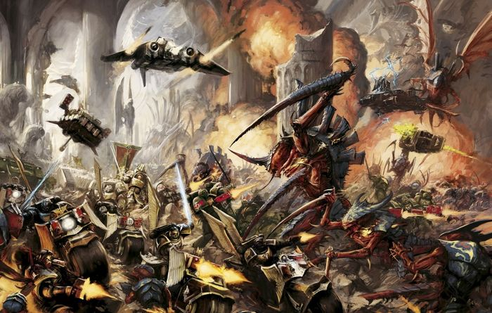

<!-- A0326-B0219 -->

原译文

Dark Angels battle Tyranids 黑暗天使与泰伦作战

**校订译文**

Dark Angels battle Tyranids 黑暗天使与泰伦作战

<!-- /A0326-B0219 -->

<!-- A0326-B0220 -->
### Successors 子战团

<!-- /A0326-B0220 -->

<!-- A0326-B0221 -->
**英文原文**

The Dark Angels and their successor chapters are collectively known as the "Unforgiven" and generally maintain close links with each other. The Chapter Masters of each chapter belong to the Inner Circle and also carry the honorific of "Grand Master of the Inner Circle". The Dark Angels Chapter Master is also the Inner Circle supreme leader and every member of the circle answer to him when it comes to the hunt for the Fallen.

<!-- /A0326-B0221 -->

<!-- A0326-B0222 -->

原译文

黑暗天使及其子战团统称为“不可饶恕者”，通常彼此保持密切联系。每个战团的战团长都属于内环，并带有“内环大导师”的尊称。黑暗天使战团长也是内环的最高领袖，当涉及到寻找堕天使时，内环的每个成员都要向他负责。

**校订译文**

黑暗天使及其子战团统称“戴罪者”，通常保持密切联系。各战团长均为内环成员，并拥有“内环大导师”的尊称。黑暗天使战团长同时是内环的最高领袖；涉及追捕堕天使时，所有内环成员都须服从他。

<!-- /A0326-B0222 -->

<!-- A0326-B0223 -->
**英文原文**

Dark Angel's Successor Chapters, much like themselves, will abandon everything for the hunt of the Fallen. It's known that the Dark Angels Legion sired at least three Second Founding chapters, although several others are also thought to hail from this Founding.

<!-- /A0326-B0223 -->

<!-- A0326-B0224 -->

原译文

黑暗天使的子战团，就像他们自己一样，将放弃一切去追捕堕天使。众所周知，黑暗天使军团至少有三个二次建军战团，尽管其他几个战团也被认为来自这次建军。

**校订译文**

黑暗天使的子战团与母团一样，会为追捕堕天使放下一切其他事务。已知至少三个子战团源于黑暗天使在二次建军中的拆分；此外还有几个战团也被认为诞生于此次建军。

<!-- /A0326-B0224 -->

<!-- A0326-B0225 -->
## Culture 文化

<!-- /A0326-B0225 -->

<!-- A0326-B0226 -->
**英文原文**

The organisation of the Dark Angels Chapter has been shaped primarily by events in its history; as a result, it is different from that of any other. The Chapter is monastic in nature with much time being given over to worship and prayer. There are also many different levels within the Chapter that individuals may gradually rise through. On attaining each level, they find out a little more about the truth behind the Dark Angels' origins. Most Dark Angels themselves know nothing about the beginnings of the Chapter. It is only those at the very top who have learned the whole truth.

<!-- /A0326-B0226 -->

<!-- A0326-B0227 -->

原译文

黑暗天使战团的组织主要是由其历史上的事件塑造的；因此，它与其他任何都不同。战团本质上是修道院式的，有很多时间用于礼拜和祈祷。战团中还有许多不同的等级，个人可以逐渐提升。在达到每个级别后，他们会更多地了解黑暗天使起源背后的真相。大多数黑暗天使自己对战团的起源一无所知。只有最高层的人才知道全部真相。

**校订译文**

黑暗天使的组织结构深受自身历史塑造，因此与其他战团迥异。战团带有浓厚的修道团体性质，成员将大量时间用于礼拜与祈祷。内部又分为许多层级，战士可以逐步晋升；每进入一层，便获知更多有关战团起源的真相。多数成员对此几乎一无所知，只有最顶层的人才掌握全貌。

<!-- /A0326-B0227 -->

<!-- A0326-B0228 图片 -->
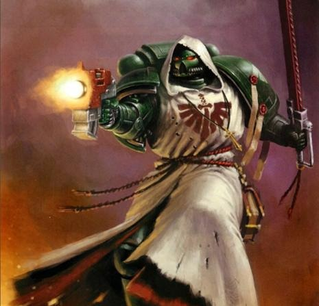

<!-- A0326-B0229 -->

原译文

Dark Angels Space Marine 黑暗天使星际战士

**校订译文**

Dark Angels Space Marine 黑暗天使星际战士

<!-- /A0326-B0229 -->

<!-- A0326-B0230 -->
**英文原文**

The Dark Angels are known for their bewildering array of ancient rites and rituals, such as the Feast of Malediction and the Rite of Sins Renounced to the three-day Mindchant of the Iron Penance and the Liturgy of the Thrice-avenged. Most of these rituals are led by Chaplains and are all cold and solemn ceremonies. None of these are without meaning, and are heavily tied to ascension deeper into the Inner Circle.

<!-- /A0326-B0230 -->

<!-- A0326-B0231 -->

原译文

黑暗天使以其令人眼花缭乱的古代仪式和典礼而闻名，如诅咒节和放弃三天的钢铁忏悔正念的罪恶仪式，以及三重复仇仪式。这些仪式大多由牧师主持，都是冷酷而庄严的仪式。这些都不是没有意义的，并且与提升到更深层的内环密切相关。

**校订译文**

黑暗天使以繁复的古老仪式著称，包括诅咒之宴、弃罪礼、持续三天的钢铁苦修心诵，以及三重复仇礼仪。这些仪式大多由教士主持，冷峻而庄严。它们都有特定含义，并与进入内环更深层级的过程紧密相连。

**校注：** 原译将四个独立仪式串接错位，现逐项分开；Mindchant暂译心诵，原文没有正念修习含义。

<!-- /A0326-B0231 -->

<!-- A0326-B0232 -->
**英文原文**

The Dark Angels themselves are known to speak amongst one another in Calibanite, a collection of dozens of languages carried on from their origin world of Caliban. These are officially Codified as Lingua Mortis by Imperial Census-takers. The written version of at least one Calibanite tongue was described as being inscribed with a neat, rounded script. A dedicated Battle-Cant is also known to be made use of by the Lion’s sons. Where it is sometimes spoken between brother’s in a more casual manner outside of the field of Battle.

<!-- /A0326-B0232 -->

<!-- A0326-B0233 -->

原译文

众所周知，黑暗天使在卡利班语中彼此交谈，卡利班语是从他们的起源世界卡利班延续下来的数十种语言的集合。这些被帝国人口普查员正式编纂为死亡之语。至少有一种卡利班语的书面版本被描述为刻有整洁、圆润的文字。众所周知，莱昂的子嗣也会使用专门的战歌。在战场之外，兄弟之间有时会以更随意的方式说话。

**校订译文**

黑暗天使彼此交谈时常用卡利班诸语，即从母星传承下来的数十种语言。帝国人口普查人员将其正式归类为“死亡之语”。至少其中一种语言的书写文字被描述为整齐圆润。雄狮之子也使用一套专门的战斗密语；在战场之外，战斗兄弟有时还会用它进行较为随意的交谈。

**校注：** Battle-Cant指战斗密语或行话，非战歌；最后一句所述日常使用的仍是同一种密语。

<!-- /A0326-B0233 -->

<!-- A0326-B0234 -->
**英文原文**

The Dark Angels have accepted the new Primaris Space Marines out of necessity, but the Inner Circle remains sceptical of their presence as they have not gone through the strict rituals and tests of loyalty present to the rest of the Chapter. The Inner Circle debated over what to do about initiating Primaris into the Deathwing. However, this issue was resolved when one of the existing Deathwing members, Lazarus, survived the Rubicon Primaris and a newer Primaris named Apharan was vouched for to take the trials by Azrael himself. Since then, more Primaris have joined the ranks of the Deathwing, including Primaris Bladeguard Veterans.

<!-- /A0326-B0234 -->

<!-- A0326-B0235 -->

原译文

黑暗天使出于必要接受了新的原铸星际战士，但内环仍然对他们的存在持怀疑态度，因为他们没有经历战团其他成员所面临的严格仪式和忠诚测试。内环就如何启动死翼原铸进行了辩论。然而，当现有的死翼成员之一拉撒路在原铸手术中幸存下来，并且一位名叫阿法兰的新原铸被阿兹瑞尔本人担保接受试炼时，这个问题得到了解决。从那时起，更多的原铸加入了死翼的行列，包括原铸剑卫老兵。

**校订译文**

黑暗天使出于现实需要接纳了原铸星际战士，但内环仍心存疑虑，因为这些新人尚未经历其他成员必须通过的严格仪式与忠诚考验。内环曾为如何准许原铸加入死翼而争论不休。后来，原有死翼成员拉撒路成功完成原铸跨越手术，阿兹瑞尔又亲自为原铸新人阿法兰担保，允许其接受试炼，问题才得以解决。此后，越来越多的原铸加入死翼，其中包括原铸剑卫老兵。

<!-- /A0326-B0235 -->

<!-- A0326-B0236 -->
## Combat Doctrine 作战理论

<!-- /A0326-B0236 -->

<!-- A0326-B0237 -->
**英文原文**

In the same vein as their father Lion El'Jonson, Dark Angels officers are expert tacticians and specialists and have been quick to capitalize on the skills of Primaris Space Marines and the particular varieties of their squad types. New specialized formations have been developed alongside ancient patterns such as the Hammer of Caliban and Scout Recon Stalker Strike. Caliban's Reach is but one example, which combines the firepower of Hellblasters and Devastators with Centurions to devastating effect. The advanced infiltration and reconnaissance skills all Primaris Space Marines learn as part of their Vanguard training is of great value to a chapter seeking hidden foes. The Omniscramblers of Infiltrator Squads can severely disrupt enemy communications, allowing Ravenwing squadrons to strike without their quarry being warned. The Divinator-class Auspexes of the Incursors collect data from battlefields that previously would have been almost impossible to extract. This yields new information to the Inner Circle to act upon without Vanguard Space Marine's knowledge.

<!-- /A0326-B0237 -->

<!-- A0326-B0238 -->

原译文

与他们的父亲莱昂·艾尔庄森一样，黑暗天使军官是专业的战术家和专家，并且很快利用了原铸星际战士的技能及其特殊的小队类型。除了卡利班之锤和侦察兵侦查追猎者打击等古老模式外，还开发了新的专业编队。卡利班之域只是一个例子，它将地狱轰击者和毁灭者的火力与百夫长相结合，产生了毁灭性的效果。作为先锋训练的一部分，所有原铸星际战士都学习了先进的渗透和侦察技能，这对寻找隐藏敌人的战团来说非常有价值。渗透者小队的全频干扰器可以严重干扰敌人的通信，使鸦翼中队能够在没有引起猎物警惕的情况下进行攻击。入侵者的占卜者级鸟卜仪从战场上收集以前几乎不可能提取的数据。这为内环提供了新的信息，可以在没有先锋星际战士的情况下采取行动。

**校订译文**

黑暗天使的军官继承了莱昂·艾尔’庄森的风格，既是出色的战术家，也各有所长。他们迅速利用原铸星际战士的本领与各类专门小队，在卡利班之锤、侦察追猎打击等古老编阵之外，发展出新的专门战斗编组。“卡利班之域”便是一例，它将地狱轰击者、破坏者与百夫长的火力结合，威力惊人。所有原铸都在先锋训练中学习先进的渗透与侦察技能，对搜寻隐匿敌人的战团尤其有用。渗透者小队的全频干扰器能严重扰乱敌方通信，让鸦翼中队在猎物尚未得到警告时发动攻击。入侵者携带的占卜师级鸟卜仪则能从战场收集过去几乎无法获取的数据，为内环提供新的行动线索，而先锋星际战士自身并不知道这些信息的用途。

**校注：** without Vanguard Space Marine’s knowledge 指先锋战士不知内情，原译误为行动时不需要先锋战士参与。

<!-- /A0326-B0238 -->

<!-- A0326-B0239 图片 -->
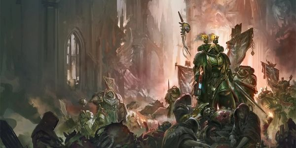

<!-- A0326-B0240 -->

原译文

Dark Angels 黑暗天使

**校订译文**

Dark Angels 黑暗天使

<!-- /A0326-B0240 -->

<!-- A0326-B0241 -->
**英文原文**

In addition, the Dark Angels are known to have access to a disproportionate amount of Plasma Weaponry. During the time of the Great Crusade, complementing the concentration of skill and hard-won knowledge of the Dark Angels Hexagrammaton. Was one of the most deadly arsenals in the entire Imperium. Much of the technology routinely deployed by the Dark Angels was of an order of complexity beyond that available to the younger Legions and on par with those of the Legio Custodes, produced in dedicated manufactoria on Terra and elsewhere such as the Legion Fiefdoms of Gramarye, and Caliban to the specifications of the Dark Angels learned forge masters to designs dating back millennia. Exotic plasma weaponry, munitions of archaic and unstable design as well as variants of armoured vehicles and void craft based on unique technologies, all were the sole province of the First Legion. Indeed, it is noted that the Legion holds in its armoured reserves war machines rarely fielded since the earliest days of the Unification Wars, and others which, much to the chagrin of the Mechanicum, are of entirely unknown provenance. This proved a potent force multiplier on the battlefield, amplifying the superior skills of the Dark Angels and allowing them to prevail against foes that lesser technology could not defeat. As well as those advanced weapons and designs they used openly, the Dark Angels also maintained large stocks of weapons of a darker renown. Within the sealed vaults of Caliban and Gramarye, as well as a number of secret caches scattered across the Imperium and guarded by dedicated Orders, were vast stores of weaponry long since proscribed to the other military arms of the Imperium. Gene-phages capable of annihilating all life upon a planetary body in mere hours, core-breaching magna munitions that could tear a planet apart from within, stockpiles of ancient Silica-virae - the dreaded scourge of the nanite pronounced the ultimate heresy by the adepts of Mars--all could be found within the armouries of the Dark Angels. Such weapons could not be unleashed lightly, for they served only a single purpose - the utter destruction of life. They were of no use to conquerors, only to destroyers, and they served as the ultimate sanction for those enemies deserving of only annihilation.

<!-- /A0326-B0241 -->

<!-- A0326-B0242 -->

原译文

此外，众所周知，黑暗天使可以获得不相称的等离子武器。在大远征期间，补充了黑暗天使六翼的技能和来之不易的知识。是整个帝国中最致命的武器库之一。黑暗天使经常部署的许多技术的复杂性超出了年轻军团的范围，与禁军军团的技术相当，这些技术是在泰拉和其他地方的专用铸造厂生产的，如格拉马里的军团封地和卡利班，符合黑暗天使学习的铸造大师的规范，可以追溯到数千年前的设计。奇异的等离子武器、设计陈旧且不稳定的弹药，以及基于独特技术的装甲载具和虚空飞行器的变体，都是第一军团的唯一领域。事实上，值得注意的是，军团在其装甲储备中拥有自统一战争早期以来很少部署的战争机器，以及其他让机械神教非常懊恼的机械，它们的来源完全未知。事实证明，这在战场上是一个强大的力量倍增器，放大了黑暗天使的卓越技能，使他们能够战胜低技术的敌人。除了他们公开使用的先进武器和设计外，黑暗天使还拥有大量知名度较低的武器。在卡利班和格拉马里的密封库内，以及分散在帝国各地并由专门命令守卫的许多秘密藏匿处，都是大量武器，这些武器早已被禁止用于帝国的其他军事武器。能够在短短几个小时内消灭行星上所有生命的基因噬菌体，可以从内部撕裂行星的破核巨型弹药，古代二氧化硅病毒的库存 — 被火星专家称为终极异端的纳米虫的可怕祸害 — 所有这些都可以在黑暗天使的军械库中找到。这种武器不能轻易释放，因为它们只有一个目的 — 彻底摧毁生命。它们对征服毫无用处，只对破坏有用，它们是对那些只应该被消灭的敌人的最终制裁。

**校订译文**

黑暗天使拥有的等离子武器数量也远超常态。大远征时期，与六翼精湛的战技及来之不易的知识相辅相成的，是帝国最致命的武器库之一。军团经常使用的许多技术，其复杂程度超过较年轻军团所能获得的装备，足以比肩禁军军团。泰拉及格拉马里、卡利班等军团领地上的专属制造设施，依据数千年前的设计，按照黑暗天使博学铸造大师的要求生产这些装备。奇异的等离子武器、设计古老而不稳定的弹药，以及依托独有技术制造的装甲车辆与虚空舰船变型，都由第一军团独占。其装甲储备中既有自统一战争初期以来便鲜少投入使用的战争机器，也有来源完全不明、令机械教深感恼怒的装备。这些优势显著增强了战团本已高超的作战能力，使其能够战胜依靠较落后技术无法击败的敌人。除公开使用的先进武器外，黑暗天使还储有大量声名阴森的禁忌兵器。在卡利班与格拉马里的封存秘库，以及帝国各地由专门骑士团看守的秘密储藏点中，堆放着其他帝国军队早已被禁止使用的武器：能在数小时内灭绝整颗星球生命的基因噬体，能够穿透地核、从内部撕裂行星的巨型弹药，以及大量古代硅基病毒——被火星技术专家视为终极异端的可怖纳米灾疫。这些武器不能轻易启用，因为它们只有一个目的：彻底摧毁生命。它们只能用于毁灭，而无法帮助征服，是对那些仅配被抹除的敌人所施加的最终制裁。

**校注：** Dark Angels learned forge masters 中 learned 为博学；of a darker renown 指阴森恶名，非知名度较低。基因噬体／硅基病毒为暂定技术名，不凭词面增添生物学机制。

<!-- /A0326-B0242 -->

<!-- A0326-B0243 -->
**英文原文**

By the last years of the Great Crusade, shortly before the outbreak of the Horus Heresy, the Dark Angels claimed a strength of approximately 180,000 to 200,000 warriors, while other accounts claimed they had raised as many as a quarter of a million from the world of Caliban alone. In terms of sheer size this placed them in the upper tier of the Legiones Astartes, alongside such Legions as the Ultramarines and Sons of Horus, and despite the rise of the younger Legions to rival their glory, they still remained one of the single most powerful military forces in the Imperium. Additional records from the period have noted a much lower field strength for the Dark Angels, sometimes as low as 50,000. These reports are likely due to the confusion that the Dark Angels' organisational procedures and heraldry caused for most unfamiliar observers. The dense nature of the ciphers they used and the secretive nature of many of its sub-formations often led to some amount of bewilderment for outsiders, especially when combined with the fluid and shifting nature of authority and command within the Legion, sometimes even to the degree that it led to military setbacks when working alongside other Imperium forces. Surprisingly, the Dark Angels have made little attempt to remedy this situation, indeed some of their commanders, especially the older veterans of the Great Crusade, seem to take a quiet pride in the confusion it occasions among the least disciplined of their allies. In particular, a common practise by some Dark Angels forces is to arrive without announcing to their allies who commands the First Legion contingent, leaving their counterparts to determine whom to greet as warlord by the heraldry they display. Those few who make the correct choice, or who are wary enough to make no judgement, are treated with respect and those who choose poorly watched carefully for further lapses in judgement. Such tests of worth are commonplace among the Dark Angels, both for their own initiates and for those that would fight alongside them, for the sons of the Lion judge the worth of no warrior on rumour and hearsay alone.

<!-- /A0326-B0243 -->

<!-- A0326-B0244 -->

原译文

在大远征的最后几年，即荷鲁斯叛乱爆发前不久，黑暗天使声称拥有约18万至20万名战士，而其他人则声称他们仅从卡利班世界就筹集了多达25万。就规模而言，这使他们与极限战士和荷鲁斯之子等军团一起处于阿斯塔特军团的上层，尽管年轻的军团崛起，与他们的荣耀相抗衡，但他们仍然是帝国中最强大的军事力量之一。该时期的其他记录表明，黑暗天使的人数要低得多，有时低至50000。这些报道可能是由于黑暗天使的组织程序和纹章给大多数不熟悉的观察者造成的混乱。他们使用的密码的密集性和许多子编队的隐秘性往往会让外界感到困惑，尤其是当与军团内部权力和指挥的流动性和变化性相结合时，有时甚至会导致与其他帝国部队并肩作战时的军事挫折。令人惊讶的是，黑暗天使几乎没有试图纠正这种情况，事实上，他们的一些指挥官，尤其是大远征的老兵，似乎对他们最不自律的盟友所造成的混乱感到自豪。特别是，一些黑暗天使部队的一种常见做法是，在没有向盟友宣布谁指挥第一军团特遣队的情况下到达，让他们的对手根据他们展示的纹章来决定谁是战争领主。那些做出正确选择的少数人，或者那些足够谨慎而不做出判断的人，会受到尊重，而那些选择不当的人则会被仔细观察，以防判断进一步失误。这种价值测试在黑暗天使中很常见，无论是对他们自己的同袍还是对那些愿意与他们并肩作战的人来说，因为莱昂之子们不会仅仅根据谣言和传闻来判断战士的价值。

**校订译文**

大远征最后几年、荷鲁斯之乱爆发前夕，黑暗天使自称拥有十八万至二十万名战士；另有记载称，他们仅从卡利班就征募过多达二十五万人。单论规模，他们与极限战士、荷鲁斯之子同处阿斯塔特军团的第一梯队。即便较年轻的军团崛起，足以与他们争辉，黑暗天使仍是帝国最强大的军事力量之一。不过，同期也有记录将其可投入战场的兵力估得低得多，有时仅五万人。这很可能源于外界不熟悉黑暗天使的组织方式与纹章，因而产生误判。复杂密码、秘密编组，以及军团内部不断变化的权威与指挥关系，经常让外人无所适从，甚至在与其他帝国部队协同时造成军事挫折。黑暗天使却鲜少尝试补救；某些指挥官，尤其资深的大远征老兵，似乎还暗自得意于让纪律最差的盟友陷入困惑。部分黑暗天使部队抵达战区时，惯常不向盟友说明谁是第一军团分遣队的指挥官，让对方仅凭纹章判断该向谁致敬。选对的人，或谨慎到不贸然判断的人，会得到尊重；判断错误者则受到密切观察，以防其再次失误。这种考验在军团中十分常见，对新兵和盟友都一视同仁，因为雄狮之子从不只凭传闻判断一名战士的价值。

**校注：** counterparts指盟军对应人员，原译“对手”易误认为敌军；五万人指field strength，不强行与总征募人数统一。

<!-- /A0326-B0244 -->

<!-- A0326-B0245 -->
**英文原文**

Such actions are most often encountered among the more veteran formations of the Legion. Those forces whose tallies of victories and vanquished foes were so impressive that some among the newly-recruited regiments of the Imperium's armies thought them fabrications and even those who had served in the Great Crusade long enough to have heard of the valour of the First Legion rarely knew the full scope of their victories and sacrifices. Indeed, the Dark Angels remained one of the most experienced bodies of warriors within the Legiones Astartes. Despite the many dire battles they had faced, they had always retained a core of veterans to pass on the hard-won skills and knowledge of their struggles, indeed much of the structure of the Wings and Orders was dedicated to exactly this task. As such they had maintained a level of skill and proficiency in every sphere of warfare that, while sometimes less specialised than the younger Legion, could rarely be equalled among the Legiones Astartes. Given these material and organisational preferences the Dark Angels tended to a sparse pattern of deployment, scattering their numbers widely in relatively small detachments, relying more on the potency of their weaponry and the individual prowess of their warriors than on sheer numbers. Capitalising on the diverse nature of the warriors that made up each Chapter and Company, individual battle forces of the Dark Angels were most often little more than a handful of Chapters operating in close support, often a force as small as a few thousand warriors. Where other fleets relied more on the numbers they could bring to bear, the Dark Angels emphasised the fluid nature of their units which were able to quickly and efficiently reform as needed within a local theatre of war in order to meet the challenges of a given engagement. It was a rare sight to see large numbers of the First Legion gathered in any one place, and such a sight was considered a portent of the worst kind, for the grim, black-armoured ranks of the Dark Angels were only amassed to face the most dire of threats. Indeed, many among the ranks of the Imperial Army considered it a grave misfortune to be tasked with serving as support to the Dark Angels, not due to any mistreatment at the hands of the Legiones Astartes, but rather because the battlefields upon which they walked were inimical to the lives of merely mortal warriors and only the most skilled or fortunate soldiers survived such a tour of duty. Despite this long-held superstition, those few regiments that had served alongside the Dark Angels and survived held the battle honours granted them by the Lion with pride, despite the bloody price paid for their acquisition.

<!-- /A0326-B0245 -->

<!-- A0326-B0246 -->

原译文

这种行动最常见于军团中较老练的编队。这些部队的胜利和被击败的敌人的记录令人印象深刻，以至于帝国军队中一些新建立的兵团认为它们是捏造的，甚至那些在大远征中服役足够长时间的人也很少知道他们的胜利和牺牲的全面。事实上，黑暗天使仍然是军团中最有经验的战士之一。尽管他们面临着许多可怕的战斗，但他们一直保留着一个由老兵组成的核心，将来之不易的技能和战斗知识传授给他们，事实上，翼与骑士团的大部分结构都致力于这项任务。因此，他们在战争的各个领域都保持了一定的技能和熟练程度，虽然有时不如年轻的军团专业，但阿斯塔特军团很少能与之匹敌。鉴于这些物质和组织偏好，黑暗天使倾向于稀疏的部署模式，将他们的人数分散在相对较小的分遣队中，更多地依靠他们的武器力量和战士的个人实力，而不是纯粹的人数。利用组成每个战团和连队的战士的多样性，黑暗天使的单独战斗部队通常只不过是少数几个紧密支持的战团，通常只有几千名战士。在其他舰队更依赖于他们能带来的人数的情况下，黑暗天使强调了他们部队的流动性，这些部队能够在当地战区内根据需要快速有效地进行改变，以应对特定交战的挑战。看到大量第一军团聚集在任何一个地方都是罕见的，这样的景象被认为是最糟糕的预兆，因为黑暗天使冷酷的黑甲队伍只是为了面对最可怕的威胁而集结的。事实上，帝国军队中的许多人认为，被赋予支援黑暗天使的任务是一种严重的不幸，这不是因为阿斯塔特军团的任何虐待，而是因为他们所走过的战场对凡人战士的生命有害，只有最熟练或最幸运的士兵才能在这样的服役中幸存下来。尽管有这种长期存在的迷信，但那些与黑暗天使并肩作战并幸存下来的少数团自豪地获得了莱昂授予他们的战斗荣誉，尽管他们的获得付出了血腥的代价。

**校订译文**

这种做法尤其常见于军团的老兵部队。他们的胜绩和歼敌记录如此惊人，以至于帝国新建的一些团认为那是杜撰；即便在大远征中服役已久、听闻过第一军团英勇事迹的人，也很少了解其全部胜利与牺牲。黑暗天使确实是阿斯塔特中最富经验的战士群体之一。无论遭遇多少恶战，他们总能保留一批核心老兵，将艰难积累的技艺与知识传承下去；翼与骑士团的大部分组织安排，正是为此服务。因此，他们在各类战争领域都保持极高造诣。虽然有时不如较年轻军团那样专精，但在阿斯塔特中仍鲜有匹敌。凭借装备与组织优势，黑暗天使倾向于广泛分散部署，以较小分遣队行动，主要依赖武器威力和战士个人本领。各战团、各连成员的多样专长，使他们能以少数几个战团密切协同组成独立作战部队，兵力往往只有几千人。其他舰队依赖可集结的数量，黑暗天使则重视编组的灵活性，能在局部战区迅速重整，应对具体战斗的需要。第一军团大规模集中于一地极为罕见，也被视为最恶劣的预兆，因为冷峻的黑甲队列只有面对最可怕的威胁才会如此集结。许多帝国军士兵视获派支援黑暗天使为大难临头，并非阿斯塔特会虐待他们，而是第一军团踏足的战场对凡人过于凶险，只有最老练或最幸运的士兵才能活着完成任务。然而，那少数并肩作战后幸存的团，始终珍视雄狮授予的战斗荣誉，尽管获得它们曾付出惨烈代价。

<!-- /A0326-B0246 -->

<!-- A0326-B0247 -->
## Organisation 组织

<!-- /A0326-B0247 -->

<!-- A0326-B0248 -->
### Great Crusade & Heresy-era 大远征与荷鲁斯之乱时期

原题：Great Crusade & Heresy-era 大远征&叛乱前

<!-- /A0326-B0248 -->

<!-- A0326-B0249 -->
**英文原文**

Initially during the Unification Wars and Early Great Crusade the Dark Angels Legion was divided into a number of Hosts and Orders of Battle. Most of these Hosts were later reorganized by Lion El'Jonson into the Hexagrammaton, although the Orders of the Hekatonystika endured all the way into the Great Crusade and Horus Heresy.

<!-- /A0326-B0249 -->

<!-- A0326-B0250 -->

原译文

最初，在统一战争和大远征早期期间，黑暗天使军团被划分为多个天军和战斗骑士团。这些天军中的大多数后来被莱昂·艾尔庄森重组为六翼，尽管百秘骑士团一直持续到大远征和荷鲁斯叛乱。

**校订译文**

统一战争及大远征初期，黑暗天使军团分为多个天军与战斗骑士团。莱昂·艾尔’庄森后来将大多数天军重组为六翼体系，而百秘骑士团则一直延续到大远征与荷鲁斯之乱时期。

<!-- /A0326-B0250 -->

<!-- A0326-B0251 图片 -->
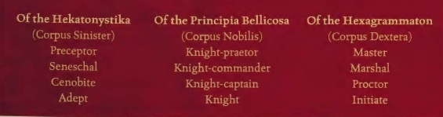

<!-- A0326-B0252 -->

原译文

The various Dark Angels titles of the Heresy era 叛乱时期的各种黑暗天使头衔

**校订译文**

The various Dark Angels titles of the Heresy era 叛乱时期的各种黑暗天使头衔

<!-- /A0326-B0252 -->

<!-- A0326-B0253 -->
**英文原文**

Members of the Heresy-era Dark Angels often had allegiance to three different bodies: That of their Order, that of their Hexagrammaton host, and that of their Chapter and Company. It was only through superb skill, familiarity, and long-term indoctrination that the Dark Angels were able to avoid chaos with such a system and indeed used it to their full potential. Those formations which followed the Principia Bellicosa within the Dark Angels were known as the Corpus Nobilis.

<!-- /A0326-B0253 -->

<!-- A0326-B0254 -->

原译文

叛乱时期的黑暗天使成员通常效忠于三个不同的机构：他们的骑士团，他们的六翼天军，以及他们的战团和连队。只有通过高超的技能、通晓和长期的灌输，黑暗天使才能避免这种系统的混乱，并真正充分发挥其潜力。在黑暗天使中遵循战策基理的那些编队被称为中军。

**校订译文**

荷鲁斯之乱时期，一名黑暗天使通常同时隶属三套体系：自己的骑士团、六翼中的某支天军，以及战团和连队。唯有凭借高超本领、对制度的熟悉与长期训练，他们才能在这种结构下避免混乱，并充分发挥其效用。军团内遵循《军团组织法典》编制的部分，被称为“中军”。

<!-- /A0326-B0254 -->

<!-- A0326-B0255 -->
**英文原文**

By the time of the Horus Heresy the Hexagrammaton or Corpus Dextera consisted of six specialized "Wings": the Deathwing, Ravenwing, Dreadwing, Ironwing, Firewing, and Stormwing. These formations were a legacy of the Unification Wars.

<!-- /A0326-B0255 -->

<!-- A0326-B0256 -->

原译文

到荷鲁斯叛乱时期，六翼或右军由六个专门的“翼”组成：死翼、鸦翼、恐翼、铁翼、炎翼和风暴翼。这些编队是统一战争的遗产。

**校订译文**

到荷鲁斯之乱时期，六翼或右军由六个专门的“翼”组成：死翼、鸦翼、恐翼、铁翼、炎翼和风暴翼。这些编队是统一战争的遗产。

<!-- /A0326-B0256 -->

<!-- A0326-B0257 -->
**英文原文**

The Hekatonystika or Corpus Sinister served as the hidden counterpart of the Hexagrammaton and was charged with keeping its most dangerous secrets safe. Publicly, the Dark Angels maintained traditional Chapters and Companies, but each of their Commanders secretly held allegiance to one of the Dark Angels Orders. There were hundreds of Dark Angels orders, which varied in size; some only had a dozen or so members. Though some encompassed entire Chapters of Knights. Each Order had its own strict hierarchy, and unlike the Hosts they were far more secretive. Members of the Orders communicated with one another via ciphers and cryptic signals.

<!-- /A0326-B0257 -->

<!-- A0326-B0258 -->

原译文

百秘骑士团或左军是六翼的隐藏对应，负责保护其最危险的秘密。在公开场合，黑暗天使维持着传统的战团和连队，但他们的每个指挥官都秘密效忠于一个黑暗天使骑士团。有数百个黑暗天使的骑士团，规模各不相同；有些只有十几个成员。有些包含了整个战团的骑士。每个骑士团都有自己严格的等级制度，与天军不同，他们更加隐秘。骑士团成员通过密码和神秘信号相互交流。

**校订译文**

百秘骑士团又称“左军”，是与六翼相对应的隐秘体系，负责保管军团最危险的秘密。公开编制中，黑暗天使沿用传统的战团与连队，但每位指挥官又秘密隶属某个内部骑士团。这些骑士团有数百个，规模悬殊，有的仅十来名成员，有的则包含整整一个战团的骑士。各团都有严格的等级制度，保密程度远超天军；成员彼此以密码和隐晦信号交流。

<!-- /A0326-B0258 -->

<!-- A0326-B0259 -->
**英文原文**

Supreme authority of the Legion rested with its Primarch, Lion El'Jonson. Before this, a Grandmaster ruled but, after two successive deaths of these figures during the Great Crusade, the Council of Masters (consisting of the six heads of the Hexagrammaton) took over strategic operations of the Legion. Even after Lion El'Jonson's arrival, the Council of Masters continued to play an important role. Below these were the Conclave of Preceptors from the various Orders. The Preceptors took on a strategic leadership role only when their specialist skills were demanded by the conflict at hand. This created a flexible chain of command that allowed for a multitude of simultaneous deployments rather than massing in a single warzone. It played to the strengths of The Lion, who had little interest in micro-managing his Legion's strategies and instead excelled in direct battlefield command.

<!-- /A0326-B0259 -->

<!-- A0326-B0260 -->

原译文

军团的至高权威在于其原体莱昂·艾尔庄森。在此之前，由一位大导师统治，但在大远征期间，这些人物连续两次死亡后，导师议会（由六位六翼首领组成）接管了军团的战略行动。即使在莱昂·艾尔庄森到来之后，导师议会仍然发挥着重要作用。下面是来自不同骑士团的教导者密会。只有当手头的冲突需要他们的专业技能时，教导者才承担起战略领导角色。这创建了一个灵活的指挥链，允许同时进行大量部署，而不是在一个战区集结。它发挥了莱昂的优势，莱昂对微观管理军团的战略不感兴趣，而是擅长直接指挥战场。

**校订译文**

军团最高权力归于原体莱昂·艾尔’庄森。在他归来之前，军团由大导师统领；大远征期间，两任大导师相继阵亡后，由六翼首领组成的导师议会接管战略指挥。即便雄狮归来，议会仍然发挥重要作用。其下则是各骑士团教导者组成的密会。只有当一场战争需要某位教导者的专长时，他才会取得相应的战略指挥权。这种灵活的指挥体系使军团能够同时开展多处部署，无须集中在单一战区，也符合雄狮的长处：他无意事无巨细地管理军团战略，却擅长亲临战场指挥。

<!-- /A0326-B0260 -->

<!-- A0326-B0261 -->
**英文原文**

During the earlier years of the Great Crusade the First legion possessed a war fleet numbering several hundred warships. However, by the time of the Horus Heresy In order to support the widely spread web of independent Companies and Chapters the Dark Angels maintained perhaps the greatest fleet of all the Legiones Astartes, both in terms of sheer number of capital class vessels and in the impressive firepower of those craft. With the third of the legion placed with the Lion being able to muster at least 900 warships, 300 capital and 600 smaller ships, during the Thramas Crusade. The First Legion were also granted the honour of a tithe of those few remaining Terran vessels found by the Emperor. These ancient craft almost all dated back to the years before Old Night, relics of forgotten technologies and lost aspirations of grandeur. Among these were to be found fleets of massive Gloriana Class Battleships, Promethean Class Cruisers, and Tiamat Class Destroyers, all far surpassing more modern designs in potency and made available to few other than the Emperor's own guards. Among these relic ships were unique and murderous killing engines such as the Dark Sovereign.

<!-- /A0326-B0261 -->

<!-- A0326-B0262 -->

原译文

在大远征的早期，第一军团拥有一支由数百艘战舰组成的舰队。然而，到了荷鲁斯叛乱时期，为了支持广泛传播的独立连队和战团网络，黑暗天使在主力级战舰的数量和这些舰船令人印象深刻的火力方面，保持了可能是所有军团中最强大的舰队。在萨拉玛斯远征期间，第三军团被安置在莱昂身边，能够召集至少900艘战舰、300艘主力舰和600艘小型舰艇。第一军团还获得了帝皇发现的为数不多的泰拉船只的十分之一的荣誉。这些古老的工艺几乎都可以追溯到旧夜之前的年份，是被遗忘的技术和失去的宏伟抱负的遗物。其中包括由大型荣光女王级战列舰、普罗米修斯级巡洋舰和提亚马特级驱逐舰组成的舰队，它们的效力远远超过了更现代的设计，除了帝皇自己的卫队外，很少有人能使用。在这些遗物中，有独特而凶残的杀戮引擎，如黑暗君主号。

**校订译文**

大远征早期，第一军团拥有数百艘战舰。到荷鲁斯之乱时，为支援散布各地、独立行动的战团与连队，黑暗天使维持着一支可能在所有阿斯塔特军团中最强大的舰队，无论主力舰数量还是舰艇火力都极为突出。萨拉玛斯远征期间，仅随雄狮行动的三分之一军团兵力，便能集结至少九百艘战舰：三百艘主力舰，以及六百艘较小舰艇。第一军团还获殊荣，从帝皇发现的少量残存泰拉古舰中分得一部分。这些舰船几乎都建于旧夜之前，是失传技术与被遗忘宏愿的遗物。其中有巨大的荣光女王级战列舰、普罗米修斯级巡洋舰及提亚马特级驱逐舰，威力远超较新的设计；除帝皇自己的卫队外，很少有人能得到。黑暗君主号等独一无二的致命战争机器，也在这些古舰之列。

**校注：** a third of the legion 指军团的三分之一，原译误成第三军团；tithe在分配古舰的语境不硬译准确十分之一。

<!-- /A0326-B0262 -->

<!-- A0326-B0263 -->
**英文原文**

Just as with the many disparate Companies of the Legion, the fleet was also widely spread, most often operating either as a support flotilla attached to a Chapter or as one of the rarer deep range patrol squadrons. Support flotilla were comprised of the heaviest ships available, with the core of many being a Glorianna Class Battleship or other first-rate warship supported by one or more squadrons of cruisers. Support flotilla were intended to provide transport for the attached Chapters, allowing them to breach heavily-defended systems without support and assault a specified target without the need for extensive auxiliary forces.

<!-- /A0326-B0263 -->

<!-- A0326-B0264 -->

原译文

与军团中许多不同的连队一样，这支舰队也分布广泛，最常见的是作为隶属于某个战团的支援舰队或作为罕见的远程巡逻中队之一。支援舰队由现有最重的战舰组成，其中许多舰队的核心是荣光女王级战列舰或其他由一个或多个巡洋舰中队支援的一流战舰。支援舰队旨在为附属部队提供运输，使他们能够在没有支援的情况下突破防御严密的星系，并在不需要大量辅助部队的情况下攻击特定目标。

**校订译文**

和军团分散的连队一样，其舰队也广布各地，通常作为配属某个战团的支援分舰队行动，少数则组成远程巡逻编队。支援分舰队由能够调集的最重型战舰构成，许多以一艘荣光女王级战列舰或其他一等战舰为核心，再配以一个或多个巡洋舰中队。它们负责运送所属战团，使之能够独力突破防御严密的星系，并在无须大量辅助部队的情况下突击指定目标。

<!-- /A0326-B0264 -->

<!-- A0326-B0265 -->
**英文原文**

They also served to provide orbital fire support to Legiones Astartes forces engaged in battle and a base for Legion interface craft, either to serve as an orbital supply line or to launch airstrikes or interdiction missions. By contrast, the patrol fleets maintained a smaller contingent of Legion warriors, rarely more than Company strength, and fielded more deep range cruisers and sleek escort craft mounting scanning augurs and other equipment unique to the Dark Angels. These squadrons were tasked with seeking out unknown nests of xenos or isolationist and belligerent human enclaves, much in the same manner as the more specialised White Scars fleets. Those Legiones Astartes Companies accompanying the fleet were used solely to assess the threat level of the enemies discovered, mounting spoiling raids or brief hit and run campaigns before withdrawing back to their orbital fortresses. Those deemed dangerous by the veterans of the First Legion were annihilated from orbit and those marked as vulnerable left for the Great Crusade that followed in the fleet's wake.

<!-- /A0326-B0265 -->

<!-- A0326-B0266 -->

原译文

它们还为参与战斗的阿斯塔特军团部队提供轨道火力支援，并为军团登录飞行器提供基地，作为轨道补给线或发动空袭或拦截任务。相比之下，巡逻舰队维持了一支规模较小的军团战士队伍，很少超过连级兵力，并部署了更多的远程巡洋舰和安装扫描占卜仪的光亮护卫飞行器以及黑暗天使独有的其他设备。这些中队的任务是寻找未知的异型巢穴或孤立主义和好战的人类飞地，与更专业的白色疤痕舰队的方式大致相同。伴随舰队的阿斯塔特军团连队仅用于评估发现的敌人的威胁程度，在撤退回轨道堡垒之前进行破坏性突袭或短暂的跑打。那些被第一军团老兵视为危险的人被从轨道上消灭，而那些被标记为易受攻击的人则留在了舰队之后的大远征中。

**校订译文**

这些舰队还为作战中的阿斯塔特提供轨道火力支援，并作为往返轨道与地表的军团飞行器基地，维系轨道补给，或执行空袭与遮断任务。相比之下，巡逻舰队搭载的军团战士较少，通常不超过一个连，更多使用远航巡洋舰和外形修长的护航舰，装备扫描鸟卜仪及其他黑暗天使独有设备。它们的任务是寻找未知异形巢穴，以及孤立、好战的人类据点，与更为专门化的白疤舰队颇为相似。随舰的阿斯塔特连队只负责评估发现之敌的威胁程度，通过扰袭或短促的游击战加以试探，然后撤回轨道堡垒。被第一军团老兵判为危险的敌人，会遭轨道火力歼灭；被认为较易征服的目标，则留给紧随舰队而来的大远征部队。

<!-- /A0326-B0266 -->

<!-- A0326-B0267 -->
**英文原文**

With assets spread across the galaxy, the First Legion placed little emphasis on maintaining a large number of holdings and fortresses. Indeed, there are only two large outposts held by the Dark Angels, the ancient fortress of Gramarye which played host to the halls of the Council of Masters and the vast industrial facilities that produced many of the Legion's more esoteric weapons and had long been concealed from the scrutiny of the Mechanicum, and the more recently acquired fortress of the Order on Caliban. These two worlds saw the largest concentration of the Legion's infrastructure, and were both heavily fortified and defended. Other holdings on Terra, where a significant portion of the Legion's recruitment was still conducted, and the scattered chantry houses of the various Orders Militant, were less well defended, but not intended as frontline combat installations. The standard pattern of operations within the Legion saw these holdings used as bases for resupply for a force that was primarily based within the mobile halls of the fleet. Only on the rarest of occasions did any of the Chapters of the Dark Angels return to their halls for any lengthy period of rest, with garrison duty left to the rawest recruits and those masters and seneschals with Deathwing lifeguard cadres that stood warden over those domains.

<!-- /A0326-B0267 -->

<!-- A0326-B0268 -->

原译文

由于资产遍布银河系，第一军团很少强调维护大量的所有和堡垒。事实上，只有两个由黑暗天使控制的大型前哨，一个是格拉马里的古老堡垒，它是导师议会大厅的所在地，还有生产许多军团更深奥武器的巨大工业设施，这些武器长期以来一直被机械教所掩盖，另一个是最近获得的卡利班骑士团的堡垒。这两个世界是军团基础设施最集中的地方，都有严密的增强和防御。泰拉上的其他领地，军团的大部分招募工作仍在那里进行，以及各种民兵组织分散的教堂，防御较差，但不打算作为前线作战设施。根据军团内部的标准行动模式，这些财产被用作主要驻扎在舰队机动大厅内的部队的补给基地。只有在极少数情况下，黑暗天使的任何一个战团才会回到他们的大厅进行长时间的休息，驻军任务留给最初始的新兵和那些拥有死翼救援队干部的导师和总管，他们在这些领域担任守望者。

**校订译文**

第一军团的力量散布银河，因此并不重视经营大量领地与要塞。他们只有两处大型据点：古老的格拉马里堡垒，以及后来获得的卡利班骑士团堡垒。前者设有导师议会大厅与庞大工业设施，制造军团许多奇异武器，并长期避开机械教的审查。这两个世界集中了军团最多的基础设施，均防御森严。泰拉上的其他据点，以及各武装骑士团分散的祈祷所，防御较弱，但本就不作为前线战斗设施；军团仍有相当一部分新兵来自泰拉。按照通常的行动模式，这些领地只是补给基地，军团主力主要生活在流动舰队中。各战团极少回驻据点长期休整，驻防职责留给最年轻的新兵，以及带领死翼贴身卫队守护领地的导师和总管。

**校注：** long been concealed from the scrutiny of the Mechanicum 指军团设施躲避机械教审查，原译颠倒为由机械教掩盖；Deathwing lifeguard是贴身护卫，不是救援队。

<!-- /A0326-B0268 -->

<!-- A0326-B0269 -->
### Post Heresy-era 叛乱后

<!-- /A0326-B0269 -->

<!-- A0326-B0270 -->
**英文原文**

To outside observers, the Dark Angels seem to follow the standard Codex Astartes organization - comprising 10 companies of roughly 100 Marines plus Headquarters Staff, however, they do have several organisational differences which are unique to them and their Successor Chapters -

<!-- /A0326-B0270 -->

<!-- A0326-B0271 -->

原译文

在外部观察者看来，黑暗天使似乎遵循了标准的阿斯塔特圣典组织 — 由大约100名星际战士和总部工作人员组成的10个连组成，然而，他们确实有一些组织差异，这是他们及其子战团所独有的-

**校订译文**

外界看来，黑暗天使似乎遵循《阿斯塔特圣典》的标准编制，设十个约有百名战士的连，另加指挥部人员。不过，他们及其子战团确实存在一些独有的组织差异。

**校注：** 原文为每连约百人、另加指挥部人员，旧译易读成全团仅百人。

<!-- /A0326-B0271 -->

<!-- A0326-B0272 -->
**英文原文**

Inner Circle: It is in the organization of the Dark Angels' higher levels that the chapter deviates from the dictates of the Codex Astartes. At the highest level of the Chapter is the Inner Circle, which consists of a number of officers who stand apart from the company organization, and include the Chapter's Librarians and Interrogator-Chaplains. Companies are each led by a Master, who is part of the Inner Circle.

<!-- /A0326-B0272 -->

<!-- A0326-B0273 -->

原译文

内环：正是在黑暗天使更高层次的组织中，战团偏离了阿斯塔特圣典的规定。战团的最高级别是内环，由许多与连队组织不同的军官组成，包括战团的智库和审讯牧师。每个连队都由一位导师领导，他是内环的一部分。

**校订译文**

内环：黑暗天使在高层结构上偏离《圣典》规定。战团最上层是内环，由多位独立于连队编制的军官组成，包括智库员与审讯教士。各连则由一名内环成员统领，其称号为“导师”。

<!-- /A0326-B0273 -->

<!-- A0326-B0274 -->
**英文原文**

The first two companies are also uniquely organized:

<!-- /A0326-B0274 -->

<!-- A0326-B0275 -->

原译文

前两个连队的组织结构也很独特：

**校订译文**

前两个连队的组织结构也很独特：

<!-- /A0326-B0275 -->

<!-- A0326-B0276 -->
**英文原文**

The First Company is called the Deathwing, which often fights in Terminator armour.

<!-- /A0326-B0276 -->

<!-- A0326-B0277 -->

原译文

第一连被称为死翼，经常穿着终结者盔甲作战。

**校订译文**

第一连被称为死翼，经常穿着终结者盔甲作战。

<!-- /A0326-B0277 -->

<!-- A0326-B0278 -->
**英文原文**

The Second Company is the Ravenwing, which is a formation consisting entirely of fast and highly mobile units such as bike and Land Speeder squadrons.

<!-- /A0326-B0278 -->

<!-- A0326-B0279 -->

原译文

第二连是鸦翼，这是一个完全由快速和高度机动的部队组成的编队，如摩托和兰德速攻艇中队。

**校订译文**

第二连是鸦翼，这是一个完全由快速和高度机动的部队组成的编队，如摩托和兰德速攻艇中队。

<!-- /A0326-B0279 -->

<!-- A0326-B0280 -->
**英文原文**

The remainder of the Chapter is organized along Codex lines, though they are not deployed as such. Rather than being deployed on the Company level, the Dark Angels frequently deploy as Strike Forces based around the lore of Caliban such as the heavy assault Beastslayer Strike Force and Scourge of Caliban many-pronged assault force. The most frequently used type of strike force is the Lion's Blade, a demi-company formation supported by elements of Deathwing and Ravenwing. It is often strengthened by drawing squads from the 10th Company as well as Scouts.

<!-- /A0326-B0280 -->

<!-- A0326-B0281 -->

原译文

战团的其余部分是按照圣典的思路组织的，尽管它们没有这样部署。黑暗天使不是部署在连队层面，而是经常部署基于卡利班传说的打击部队，如重型突击野兽杀手突击队和卡利班天灾多方面的突击队。最常用的打击力量是莱昂之刃，这是一种由死翼和鸦翼部队支持的半连编队。它经常通过从第10连和侦察兵抽调小队来加强。

**校订译文**

战团其余部分按《圣典》编制，但实际出征未必以连为单位。黑暗天使经常依据卡利班传说中的主题组成打击部队，例如擅长重型突击的屠兽者打击部队，以及从多个方向同时进攻的卡利班天灾部队。最常见的是“雄狮之刃”：以半个连为核心，配属死翼与鸦翼部队，往往还会抽调第十连小队及侦察兵加以增强。

<!-- /A0326-B0281 -->

<!-- A0326-B0282 -->
### Chapter Disposition 战团布置

<!-- /A0326-B0282 -->

<!-- A0326-B0283 -->
### Headquarters 总部

<!-- /A0326-B0283 -->

<!-- A0326-B0284 -->
### Chapter Command 战团指挥

<!-- /A0326-B0284 -->

<!-- A0326-B0285 图片 -->
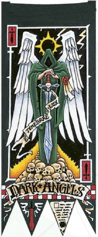

<!-- A0326-B0286 -->

原译文

Inner Circle 内环

**校订译文**

Inner Circle 内环

<!-- /A0326-B0286 -->

<!-- A0326-B0287 -->
**英文原文**

Azrael, Supreme Grand Master of the Dark Angels

<!-- /A0326-B0287 -->

<!-- A0326-B0288 -->

原译文

阿兹瑞尔，黑暗天使至高大导师

**校订译文**

阿兹瑞尔，黑暗天使至高大导师

<!-- /A0326-B0288 -->

<!-- A0326-B0289 -->
**英文原文**

The Company Masters, including:

<!-- /A0326-B0289 -->

<!-- A0326-B0290 -->

原译文

连队导师，包括：

**校订译文**

连队导师，包括：

<!-- /A0326-B0290 -->

<!-- A0326-B0291 -->
**英文原文**

Belial, Grand Master of the Deathwing

<!-- /A0326-B0291 -->

<!-- A0326-B0292 -->

原译文

贝利亚，死翼大导师

**校订译文**

贝利亚，死翼大导师

<!-- /A0326-B0292 -->

<!-- A0326-B0293 -->
**英文原文**

Ezekiel, Grand Master of Librarians

<!-- /A0326-B0293 -->

<!-- A0326-B0294 -->

原译文

以西结，智库大导师

**校订译文**

以西结，智库员大导师

<!-- /A0326-B0294 -->

<!-- A0326-B0295 -->
**英文原文**

Sammael, Grand Master of the Ravenwing

<!-- /A0326-B0295 -->

<!-- A0326-B0296 -->

原译文

萨麦尔，鸦翼大导师

**校订译文**

萨麦尔，鸦翼大导师

<!-- /A0326-B0296 -->

<!-- A0326-B0297 -->
**英文原文**

Sapphon, Grand Master of Chaplains

<!-- /A0326-B0297 -->

<!-- A0326-B0298 -->

原译文

萨芬，牧师大导师

**校订译文**

萨芬，教士大导师

<!-- /A0326-B0298 -->

<!-- A0326-B0299 -->
### Reclusiam 隐修圣殿

原题：Reclusiam 隐修会

<!-- /A0326-B0299 -->

<!-- A0326-B0300 图片 -->

<!-- A0326-B0301 -->

原译文

Sapphon 萨芬

**校订译文**

Sapphon 萨芬

<!-- /A0326-B0301 -->

<!-- A0326-B0302 -->
### Grand Master of Chaplains 教士大导师

原题：Grand Master of Chaplains 牧师大导师

<!-- /A0326-B0302 -->

<!-- A0326-B0303 -->

原译文

30 Interrogator Chaplains 30名审讯牧师

**校订译文**

30 Interrogator Chaplains 30名审讯教士

<!-- /A0326-B0303 -->

<!-- A0326-B0304 -->
### Librarius 智库

<!-- /A0326-B0304 -->

<!-- A0326-B0305 图片 -->
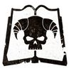

<!-- A0326-B0306 -->

原译文

Ezekiel 以西结

**校订译文**

Ezekiel 以西结

<!-- /A0326-B0306 -->

<!-- A0326-B0307 -->
### Grand Master of Librarians 智库员大导师

原题：Grand Master of Librarians 智库大导师

<!-- /A0326-B0307 -->

<!-- A0326-B0308 -->

原译文

4 Epistolaries 4名星语官

**校订译文**

4 Epistolaries 4名星语官

<!-- /A0326-B0308 -->

<!-- A0326-B0309 -->

原译文

8 Codiciers 8名典记员

**校订译文**

8 Codiciers 8名典记员

<!-- /A0326-B0309 -->

<!-- A0326-B0310 -->

原译文

8 Lexicaniums 8名编修员

**校订译文**

8 Lexicaniums 8名编修员

<!-- /A0326-B0310 -->

<!-- A0326-B0311 -->

原译文

4 Acolytes 4名侍僧

**校订译文**

4 Acolytes 4名侍僧

<!-- /A0326-B0311 -->

<!-- A0326-B0312 -->
### Armourium 军械库

<!-- /A0326-B0312 -->

<!-- A0326-B0313 图片 -->
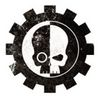

<!-- A0326-B0314 -->

原译文

Belaphor 贝拉福尔

**校订译文**

Belaphor 贝拉福尔

<!-- /A0326-B0314 -->

<!-- A0326-B0315 -->
### Master of the Rock 巨石之主

<!-- /A0326-B0315 -->

<!-- A0326-B0316 -->

原译文

22 Techmarines 22名技术军士

**校订译文**

22 Techmarines 22名科技战士

<!-- /A0326-B0316 -->

<!-- A0326-B0317 -->

原译文

113 Servitors 113名机仆

**校订译文**

113 Servitors 113名机仆

<!-- /A0326-B0317 -->

<!-- A0326-B0318 -->

原译文

Razorbacks 豪猪

**校订译文**

Razorbacks 豪猪战车

<!-- /A0326-B0318 -->

<!-- A0326-B0319 -->

原译文

16 Predators 16辆掠食者

**校订译文**

16 Predators 16辆掠食者战车

<!-- /A0326-B0319 -->

<!-- A0326-B0320 -->

原译文

12 Whirlwinds 12辆旋风

**校订译文**

12 Whirlwinds 12辆旋风战车

<!-- /A0326-B0320 -->

<!-- A0326-B0321 -->

原译文

21 Land Raiders 21辆兰德掠袭者

**校订译文**

21 Land Raiders 21辆兰德掠袭者战车

<!-- /A0326-B0321 -->

<!-- A0326-B0322 -->

原译文

Stormraven Gunships 风暴鸦炮艇

**校订译文**

Stormraven Gunships 风暴鸦炮艇

<!-- /A0326-B0322 -->

<!-- A0326-B0323 -->
### Apothecarion 药剂部

<!-- /A0326-B0323 -->

<!-- A0326-B0324 图片 -->

<!-- A0326-B0325 -->

原译文

Razaek 拉扎克

**校订译文**

Razaek 拉扎克

<!-- /A0326-B0325 -->

<!-- A0326-B0326 -->
### Master of the Apothecarion 药剂大师

原题：Master of the Apothecarion 药剂部之主

<!-- /A0326-B0326 -->

<!-- A0326-B0327 -->

原译文

10 Apothecaries 10名药剂师

**校订译文**

10 Apothecaries 10名药剂师

<!-- /A0326-B0327 -->

<!-- A0326-B0328 -->
**英文原文**

Fleet Command

**补译**

舰队指挥部

<!-- /A0326-B0328 -->

<!-- A0326-B0329 -->
### Nephalor 尼法洛

<!-- /A0326-B0329 -->

<!-- A0326-B0330 -->
### Grand Master of the Fleet 舰队大导师

<!-- /A0326-B0330 -->

<!-- A0326-B0331 -->

原译文

8 Battle Barges 8艘战斗驳船

**校订译文**

8 Battle Barges 8艘战斗驳船

<!-- /A0326-B0331 -->

<!-- A0326-B0332 -->

原译文

16 Strike Cruisers 16艘打击巡洋舰

**校订译文**

16 Strike Cruisers 16艘打击巡洋舰

<!-- /A0326-B0332 -->

<!-- A0326-B0333 -->

原译文

21 Rapid Strike Vessels 21艘快速打击战舰

**校订译文**

21 Rapid Strike Vessels 21艘快速打击战舰

<!-- /A0326-B0333 -->

<!-- A0326-B0334 -->

原译文

31 Thunderhawks 31架雷鹰

**校订译文**

31 Thunderhawks 31架雷鹰

<!-- /A0326-B0334 -->

<!-- A0326-B0335 -->
**英文原文**

Others

**补译**

其他人员

<!-- /A0326-B0335 -->

<!-- A0326-B0336 -->
### Sepharon 塞法伦

<!-- /A0326-B0336 -->

<!-- A0326-B0337 -->
### Warden of the Gates 门户看守者

原题：Warden of the Gates 门户守望者

<!-- /A0326-B0337 -->

<!-- A0326-B0338 -->

原译文

1,200 Servitors 1200名机仆

**校订译文**

1,200 Servitors 1200名机仆

<!-- /A0326-B0338 -->

<!-- A0326-B0339 -->

原译文

Administrative Staff 管理人员

**校订译文**

Administrative Staff 管理人员

<!-- /A0326-B0339 -->

<!-- A0326-B0340 -->

原译文

Support Personel (Chapter Serfs) 支持人员（战团仆役）

**校订译文**

Support Personel (Chapter Serfs) 后勤支援人员（战团农奴）

<!-- /A0326-B0340 -->

<!-- A0326-B0341 -->
### Brother Apharan 阿法兰兄弟

<!-- /A0326-B0341 -->

<!-- A0326-B0342 -->
### Warden of the Rock 巨石守望者

<!-- /A0326-B0342 -->

<!-- A0326-B0343 -->

原译文

6 Venerable Dreadnoughts 6位神圣无畏

**校订译文**

6 Venerable Dreadnoughts 6台神圣无畏机甲

<!-- /A0326-B0343 -->

<!-- A0326-B0344 -->
### Companies 连队

<!-- /A0326-B0344 -->

<!-- A0326-B0345 -->
**英文原文**

The current Companies and their Captains are as follows.

<!-- /A0326-B0345 -->

<!-- A0326-B0346 -->

原译文

目前的连队及其连长如下。

**校订译文**

目前的连队及其连长如下。

<!-- /A0326-B0346 -->

<!-- A0326-B0347 -->

原译文

1st Company 第一连队

**校订译文**

1st Company 第一连队

<!-- /A0326-B0347 -->

<!-- A0326-B0348 -->

原译文

"The Deathwing" “死翼”

**校订译文**

"The Deathwing" “死翼”

<!-- /A0326-B0348 -->

<!-- A0326-B0349 图片 -->
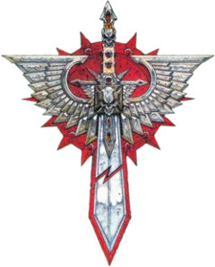

<!-- A0326-B0350 -->

原译文

Belial 贝利亚

**校订译文**

Belial 贝利亚

<!-- /A0326-B0350 -->

<!-- A0326-B0351 -->
### Master of the Deathwing 死翼导师

<!-- /A0326-B0351 -->

<!-- A0326-B0352 -->

原译文

2 Strikemasters 2名打击大师

**校订译文**

2 Strikemasters 2名打击大师

<!-- /A0326-B0352 -->

<!-- A0326-B0353 -->

原译文

Chaplain 牧师

**校订译文**

Chaplain 教士

<!-- /A0326-B0353 -->

<!-- A0326-B0354 -->

原译文

Apothecary 药剂师

**校订译文**

Apothecary 药剂师

<!-- /A0326-B0354 -->

<!-- A0326-B0355 -->

原译文

Company Ancient 连队旗手

**校订译文**

Company Ancient 连队旗手

<!-- /A0326-B0355 -->

<!-- A0326-B0356 -->

原译文

Company Champion 连队冠军

**校订译文**

Company Champion 连队冠军

<!-- /A0326-B0356 -->

<!-- A0326-B0357 -->

原译文

Deathwing Knights 死翼骑士

**校订译文**

Deathwing Knights 死翼骑士

<!-- /A0326-B0357 -->

<!-- A0326-B0358 -->

原译文

Deathwing Command Squad 死翼指挥组

**校订译文**

Deathwing Command Squad 死翼指挥小队

<!-- /A0326-B0358 -->

<!-- A0326-B0359 -->

原译文

20 Terminator Squad 20个终结者小队

**校订译文**

20 Terminator Squad 20个终结者小队

<!-- /A0326-B0359 -->

<!-- A0326-B0360 -->

原译文

9 Venerable Dreadnoughts 9位神圣无畏

**校订译文**

9 Venerable Dreadnoughts 9台神圣无畏机甲

<!-- /A0326-B0360 -->

<!-- A0326-B0361 -->

原译文

Land Raiders 兰德掠袭者

**校订译文**

Land Raiders 兰德掠袭者战车

<!-- /A0326-B0361 -->

<!-- A0326-B0362 -->

原译文

2nd Company 第二连队

**校订译文**

2nd Company 第二连队

<!-- /A0326-B0362 -->

<!-- A0326-B0363 -->

原译文

"The Ravenwing" “鸦翼”

**校订译文**

"The Ravenwing" “鸦翼”

<!-- /A0326-B0363 -->

<!-- A0326-B0364 图片 -->
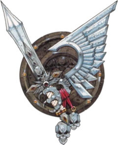

<!-- A0326-B0365 -->

原译文

Sammael 萨麦尔

**校订译文**

Sammael 萨麦尔

<!-- /A0326-B0365 -->

<!-- A0326-B0366 -->
### Master of the Ravenwing 鸦翼导师

<!-- /A0326-B0366 -->

<!-- A0326-B0367 -->

原译文

2 Talonmasters 2名利爪大师

**校订译文**

2 Talonmasters 2名利爪大师

<!-- /A0326-B0367 -->

<!-- A0326-B0368 -->

原译文

Chaplain 牧师

**校订译文**

Chaplain 教士

<!-- /A0326-B0368 -->

<!-- A0326-B0369 -->

原译文

Apothecary 药剂师

**校订译文**

Apothecary 药剂师

<!-- /A0326-B0369 -->

<!-- A0326-B0370 -->

原译文

Ravenwing Command Squad 鸦翼指挥组

**校订译文**

Ravenwing Command Squad 鸦翼指挥小队

<!-- /A0326-B0370 -->

<!-- A0326-B0371 -->

原译文

Company Ancient 连队旗手

**校订译文**

Company Ancient 连队旗手

<!-- /A0326-B0371 -->

<!-- A0326-B0372 -->

原译文

Company Champion 连队冠军

**校订译文**

Company Champion 连队冠军

<!-- /A0326-B0372 -->

<!-- A0326-B0373 -->

原译文

Black Knights 黑骑士

**校订译文**

Black Knights 黑骑士

<!-- /A0326-B0373 -->

<!-- A0326-B0374 -->

原译文

6 Attack Squadrons 6个攻击中队

**校订译文**

6 Attack Squadrons 6个攻击中队

<!-- /A0326-B0374 -->

<!-- A0326-B0375 -->

原译文

4 Support Squadrons 4个支援中队

**校订译文**

4 Support Squadrons 4个支援中队

<!-- /A0326-B0375 -->

<!-- A0326-B0376 -->
**英文原文**

Land Speeders (Including Vengeance Patterns and Darkshrouds)

<!-- /A0326-B0376 -->

<!-- A0326-B0377 -->

原译文

兰德速攻艇（包括复仇型和黑幕）

**校订译文**

兰德速攻艇，包括复仇型与鸦翼黑幕飞艇。

<!-- /A0326-B0377 -->

<!-- A0326-B0378 -->
**英文原文**

Dark Talons and Nephilim Jetfighters

<!-- /A0326-B0378 -->

<!-- A0326-B0379 -->

原译文

暗爪和拿非利喷气战斗机

**校订译文**

鸦翼黑暗之爪战机与涅菲里姆战机。

<!-- /A0326-B0379 -->

<!-- A0326-B0380 -->
### Battle Companies 战斗连队

<!-- /A0326-B0380 -->

<!-- A0326-B0381 -->

原译文

3rd Company 第三连队

**校订译文**

3rd Company 第三连队

<!-- /A0326-B0381 -->

<!-- A0326-B0382 -->

原译文

"The Unmerciful" “无情”

**校订译文**

"The Unmerciful" “无情”

<!-- /A0326-B0382 -->

<!-- A0326-B0383 图片 -->
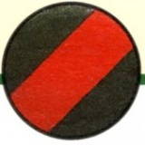

<!-- A0326-B0384 -->

原译文

Master Gabrael 加百列导师

**校订译文**

Master Gabrael 加百列导师

<!-- /A0326-B0384 -->

<!-- A0326-B0385 -->
### Master of the Arsenal 军械大师

原题：Master of the Arsenal 军械之主

<!-- /A0326-B0385 -->

<!-- A0326-B0386 -->

原译文

2 Lieutenants 2名副官

**校订译文**

2 Lieutenants 2名副官

<!-- /A0326-B0386 -->

<!-- A0326-B0387 -->

原译文

Chaplain 牧师

**校订译文**

Chaplain 教士

<!-- /A0326-B0387 -->

<!-- A0326-B0388 -->

原译文

Apothecary 药剂师

**校订译文**

Apothecary 药剂师

<!-- /A0326-B0388 -->

<!-- A0326-B0389 -->

原译文

Command Squad 指挥组

**校订译文**

Command Squad 指挥小队

<!-- /A0326-B0389 -->

<!-- A0326-B0390 -->

原译文

Company Ancient 连队旗手

**校订译文**

Company Ancient 连队旗手

<!-- /A0326-B0390 -->

<!-- A0326-B0391 -->

原译文

Company Champion 连队冠军

**校订译文**

Company Champion 连队冠军

<!-- /A0326-B0391 -->

<!-- A0326-B0392 -->

原译文

Company Veterans 连队老兵

**校订译文**

Company Veterans 连队老兵

<!-- /A0326-B0392 -->

<!-- A0326-B0393 -->

原译文

6 Battleline Squads 6个战线小队

**校订译文**

6 Battleline Squads 6个战线小队

<!-- /A0326-B0393 -->

<!-- A0326-B0394 -->

原译文

2 Close Support Squads 2个近战支援小队

**校订译文**

2 Close Support Squads 2个近战支援小队

<!-- /A0326-B0394 -->

<!-- A0326-B0395 -->

原译文

2 Fire Support Squads 2个火力支援小队

**校订译文**

2 Fire Support Squads 2个火力支援小队

<!-- /A0326-B0395 -->

<!-- A0326-B0396 -->

原译文

3 Dreadnoughts 3位无畏

**校订译文**

3 Dreadnoughts 3台无畏机甲

<!-- /A0326-B0396 -->

<!-- A0326-B0397 -->

原译文

Rhinos 犀牛

**校订译文**

Rhinos 犀牛战车

<!-- /A0326-B0397 -->

<!-- A0326-B0398 -->

原译文

Razorbacks 豪猪

**校订译文**

Razorbacks 豪猪战车

<!-- /A0326-B0398 -->

<!-- A0326-B0399 -->

原译文

Repulsors 反击者

**校订译文**

Repulsors 反重力战车

<!-- /A0326-B0399 -->

<!-- A0326-B0400 -->

原译文

4th Company 第四连队

**校订译文**

4th Company 第四连队

<!-- /A0326-B0400 -->

<!-- A0326-B0401 -->

原译文

"The Feared" “恐惧”

**校订译文**

"The Feared" “令人畏惧者”

<!-- /A0326-B0401 -->

<!-- A0326-B0402 图片 -->
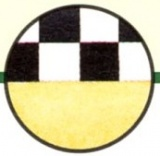

<!-- A0326-B0403 -->

原译文

Master Korahael 科拉海尔导师

**校订译文**

Master Korahael 科拉海尔导师

<!-- /A0326-B0403 -->

<!-- A0326-B0404 -->
### Master of the Fleet 舰队大师

原题：Master of the Fleet 舰队之主

<!-- /A0326-B0404 -->

<!-- A0326-B0405 -->

原译文

2 Lieutenants 2名副官

**校订译文**

2 Lieutenants 2名副官

<!-- /A0326-B0405 -->

<!-- A0326-B0406 -->

原译文

Chaplain 牧师

**校订译文**

Chaplain 教士

<!-- /A0326-B0406 -->

<!-- A0326-B0407 -->

原译文

Apothecary 药剂师

**校订译文**

Apothecary 药剂师

<!-- /A0326-B0407 -->

<!-- A0326-B0408 -->

原译文

Company Ancient 连队旗手

**校订译文**

Company Ancient 连队旗手

<!-- /A0326-B0408 -->

<!-- A0326-B0409 -->

原译文

Company Champion 连队冠军

**校订译文**

Company Champion 连队冠军

<!-- /A0326-B0409 -->

<!-- A0326-B0410 -->

原译文

Company Veterans 连队老兵

**校订译文**

Company Veterans 连队老兵

<!-- /A0326-B0410 -->

<!-- A0326-B0411 -->

原译文

6 Battleline Squads 6个战线小队

**校订译文**

6 Battleline Squads 6个战线小队

<!-- /A0326-B0411 -->

<!-- A0326-B0412 -->

原译文

2 Close Support Squads 2个近战支援小队

**校订译文**

2 Close Support Squads 2个近战支援小队

<!-- /A0326-B0412 -->

<!-- A0326-B0413 -->

原译文

2 Fire Support Squads 2个火力支援小队

**校订译文**

2 Fire Support Squads 2个火力支援小队

<!-- /A0326-B0413 -->

<!-- A0326-B0414 -->

原译文

2 Dreadnoughts 2位无畏

**校订译文**

2 Dreadnoughts 2台无畏机甲

<!-- /A0326-B0414 -->

<!-- A0326-B0415 -->

原译文

Rhinos 犀牛

**校订译文**

Rhinos 犀牛战车

<!-- /A0326-B0415 -->

<!-- A0326-B0416 -->

原译文

Razorbacks 豪猪

**校订译文**

Razorbacks 豪猪战车

<!-- /A0326-B0416 -->

<!-- A0326-B0417 -->

原译文

Repulsors 反击者

**校订译文**

Repulsors 反重力战车

<!-- /A0326-B0417 -->

<!-- A0326-B0418 -->

原译文

5th Company 第五连队

**校订译文**

5th Company 第五连队

<!-- /A0326-B0418 -->

<!-- A0326-B0419 -->

原译文

"The Unrelenting" “冷酷”

**校订译文**

"The Unrelenting" “不屈不挠者”

<!-- /A0326-B0419 -->

<!-- A0326-B0420 图片 -->
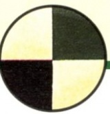

<!-- A0326-B0421 -->

原译文

Master Lazarus 拉萨路导师

**校订译文**

Master Lazarus 拉撒路导师

<!-- /A0326-B0421 -->

<!-- A0326-B0422 -->
### Keeper of the Unseen Ritual 无形秘仪守护者

<!-- /A0326-B0422 -->

<!-- A0326-B0423 -->

原译文

2 Lieutenants 2名副官

**校订译文**

2 Lieutenants 2名副官

<!-- /A0326-B0423 -->

<!-- A0326-B0424 -->

原译文

Chaplain 牧师

**校订译文**

Chaplain 教士

<!-- /A0326-B0424 -->

<!-- A0326-B0425 -->

原译文

Apothecary 药剂师

**校订译文**

Apothecary 药剂师

<!-- /A0326-B0425 -->

<!-- A0326-B0426 -->

原译文

Command Squad 指挥组

**校订译文**

Command Squad 指挥小队

<!-- /A0326-B0426 -->

<!-- A0326-B0427 -->

原译文

Company Ancient 连队旗手

**校订译文**

Company Ancient 连队旗手

<!-- /A0326-B0427 -->

<!-- A0326-B0428 -->

原译文

Company Champion 连队冠军

**校订译文**

Company Champion 连队冠军

<!-- /A0326-B0428 -->

<!-- A0326-B0429 -->

原译文

Company Veterans 连队老兵

**校订译文**

Company Veterans 连队老兵

<!-- /A0326-B0429 -->

<!-- A0326-B0430 -->

原译文

6 Battleline Squads 6个战线连队

**校订译文**

6 Battleline Squads 6个战线小队

<!-- /A0326-B0430 -->

<!-- A0326-B0431 -->

原译文

2 Close Support Squads 2个近战支援小队

**校订译文**

2 Close Support Squads 2个近战支援小队

<!-- /A0326-B0431 -->

<!-- A0326-B0432 -->

原译文

2 Fire Support Squads 2个火力支援小队

**校订译文**

2 Fire Support Squads 2个火力支援小队

<!-- /A0326-B0432 -->

<!-- A0326-B0433 -->

原译文

4 Dreadnoughts 4位无畏

**校订译文**

4 Dreadnoughts 4台无畏机甲

<!-- /A0326-B0433 -->

<!-- A0326-B0434 -->

原译文

Rhinos 犀牛

**校订译文**

Rhinos 犀牛战车

<!-- /A0326-B0434 -->

<!-- A0326-B0435 -->

原译文

Razorbacks 豪猪

**校订译文**

Razorbacks 豪猪战车

<!-- /A0326-B0435 -->

<!-- A0326-B0436 -->

原译文

Repulsors 反击者

**校订译文**

Repulsors 反重力战车

<!-- /A0326-B0436 -->

<!-- A0326-B0437 -->
### Reserve Companies 预备连队

<!-- /A0326-B0437 -->

<!-- A0326-B0438 -->

原译文

6th Company 第六连队

**校订译文**

6th Company 第六连队

<!-- /A0326-B0438 -->

<!-- A0326-B0439 -->

原译文

"The Resolute" “坚决”

**校订译文**

"The Resolute" “坚决”

<!-- /A0326-B0439 -->

<!-- A0326-B0440 图片 -->
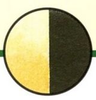

<!-- A0326-B0441 -->

原译文

Master Araphil 阿拉斐尔导师

**校订译文**

Master Araphil 阿拉斐尔导师

<!-- /A0326-B0441 -->

<!-- A0326-B0442 -->
### Master of the Rites 祭仪大师

<!-- /A0326-B0442 -->

<!-- A0326-B0443 -->

原译文

2 Lieutenants 2名副官

**校订译文**

2 Lieutenants 2名副官

<!-- /A0326-B0443 -->

<!-- A0326-B0444 -->

原译文

Chaplain 牧师

**校订译文**

Chaplain 教士

<!-- /A0326-B0444 -->

<!-- A0326-B0445 -->

原译文

Apothecary 药剂师

**校订译文**

Apothecary 药剂师

<!-- /A0326-B0445 -->

<!-- A0326-B0446 -->

原译文

Command Squad 指挥组

**校订译文**

Command Squad 指挥小队

<!-- /A0326-B0446 -->

<!-- A0326-B0447 -->

原译文

Company Veterans 连队老兵

**校订译文**

Company Veterans 连队老兵

<!-- /A0326-B0447 -->

<!-- A0326-B0448 -->

原译文

Company Ancient 连队旗手

**校订译文**

Company Ancient 连队旗手

<!-- /A0326-B0448 -->

<!-- A0326-B0449 -->

原译文

Company Champion 连队冠军

**校订译文**

Company Champion 连队冠军

<!-- /A0326-B0449 -->

<!-- A0326-B0450 -->

原译文

10 Battleline Squads 10个战线小队

**校订译文**

10 Battleline Squads 10个战线小队

<!-- /A0326-B0450 -->

<!-- A0326-B0451 -->

原译文

1 Dreadnought 1位无畏

**校订译文**

1 Dreadnought 1台无畏机甲

<!-- /A0326-B0451 -->

<!-- A0326-B0452 -->

原译文

Rhinos 犀牛

**校订译文**

Rhinos 犀牛战车

<!-- /A0326-B0452 -->

<!-- A0326-B0453 -->

原译文

Razorbacks 豪猪

**校订译文**

Razorbacks 豪猪战车

<!-- /A0326-B0453 -->

<!-- A0326-B0454 -->

原译文

Repulsors 反击者

**校订译文**

Repulsors 反重力战车

<!-- /A0326-B0454 -->

<!-- A0326-B0455 -->

原译文

7th Company 第七连队

**校订译文**

7th Company 第七连队

<!-- /A0326-B0455 -->

<!-- A0326-B0456 -->

原译文

"The Unbowed" “不屈”

**校订译文**

"The Unbowed" “不屈”

<!-- /A0326-B0456 -->

<!-- A0326-B0457 图片 -->
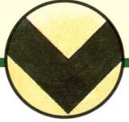

<!-- A0326-B0458 -->

原译文

Master Ezekiah 伊泽基亚导师

**校订译文**

Master Ezekiah 伊泽基亚导师

<!-- /A0326-B0458 -->

<!-- A0326-B0459 -->
### Master of the Watchers 守望堡主

原题：Master of the Watchers 守望大师

<!-- /A0326-B0459 -->

<!-- A0326-B0460 -->

原译文

2 Lieutenants 2名副官

**校订译文**

2 Lieutenants 2名副官

<!-- /A0326-B0460 -->

<!-- A0326-B0461 -->

原译文

Chaplain 牧师

**校订译文**

Chaplain 教士

<!-- /A0326-B0461 -->

<!-- A0326-B0462 -->

原译文

Apothecary 药剂师

**校订译文**

Apothecary 药剂师

<!-- /A0326-B0462 -->

<!-- A0326-B0463 -->

原译文

Company Veterans 连队老兵

**校订译文**

Company Veterans 连队老兵

<!-- /A0326-B0463 -->

<!-- A0326-B0464 -->

原译文

Company Ancient 连队旗手

**校订译文**

Company Ancient 连队旗手

<!-- /A0326-B0464 -->

<!-- A0326-B0465 -->

原译文

Company Champion 连队冠军

**校订译文**

Company Champion 连队冠军

<!-- /A0326-B0465 -->

<!-- A0326-B0466 -->

原译文

10 Battleline Squads 10个战线小队

**校订译文**

10 Battleline Squads 10个战线小队

<!-- /A0326-B0466 -->

<!-- A0326-B0467 -->

原译文

3 Dreadnoughts 3位无畏

**校订译文**

3 Dreadnoughts 3台无畏机甲

<!-- /A0326-B0467 -->

<!-- A0326-B0468 -->

原译文

Rhinos 犀牛

**校订译文**

Rhinos 犀牛战车

<!-- /A0326-B0468 -->

<!-- A0326-B0469 -->

原译文

Razorbacks 豪猪

**校订译文**

Razorbacks 豪猪战车

<!-- /A0326-B0469 -->

<!-- A0326-B0470 -->

原译文

Repulsors 反击者

**校订译文**

Repulsors 反重力战车

<!-- /A0326-B0470 -->

<!-- A0326-B0471 -->

原译文

8th Company 第八连队

**校订译文**

8th Company 第八连队

<!-- /A0326-B0471 -->

<!-- A0326-B0472 -->

原译文

"The Wrathful" “愤怒”

**校订译文**

"The Wrathful" “愤怒”

<!-- /A0326-B0472 -->

<!-- A0326-B0473 图片 -->
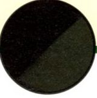

<!-- A0326-B0474 -->

原译文

Master Molochi 莫洛奇导师

**校订译文**

Master Molochi 莫洛奇导师

<!-- /A0326-B0474 -->

<!-- A0326-B0475 -->
### Master of Condemnation 谴责之主

<!-- /A0326-B0475 -->

<!-- A0326-B0476 -->

原译文

2 Lieutenants 2名副官

**校订译文**

2 Lieutenants 2名副官

<!-- /A0326-B0476 -->

<!-- A0326-B0477 -->

原译文

Chaplain 牧师

**校订译文**

Chaplain 教士

<!-- /A0326-B0477 -->

<!-- A0326-B0478 -->

原译文

Apothecary 药剂师

**校订译文**

Apothecary 药剂师

<!-- /A0326-B0478 -->

<!-- A0326-B0479 -->

原译文

Command Squad 指挥组

**校订译文**

Command Squad 指挥小队

<!-- /A0326-B0479 -->

<!-- A0326-B0480 -->

原译文

Company Veterans 连队老兵

**校订译文**

Company Veterans 连队老兵

<!-- /A0326-B0480 -->

<!-- A0326-B0481 -->

原译文

Company Ancient 连队旗手

**校订译文**

Company Ancient 连队旗手

<!-- /A0326-B0481 -->

<!-- A0326-B0482 -->

原译文

Company Champion 连队冠军

**校订译文**

Company Champion 连队冠军

<!-- /A0326-B0482 -->

<!-- A0326-B0483 -->

原译文

10 Close Support Squads 10个近战支援小队

**校订译文**

10 Close Support Squads 10个近战支援小队

<!-- /A0326-B0483 -->

<!-- A0326-B0484 -->

原译文

2 Dreadnoughts 2位无畏

**校订译文**

2 Dreadnoughts 2台无畏机甲

<!-- /A0326-B0484 -->

<!-- A0326-B0485 -->

原译文

Rhinos 犀牛

**校订译文**

Rhinos 犀牛战车

<!-- /A0326-B0485 -->

<!-- A0326-B0486 -->

原译文

Razorbacks 豪猪

**校订译文**

Razorbacks 豪猪战车

<!-- /A0326-B0486 -->

<!-- A0326-B0487 -->

原译文

Repulsors 反击者

**校订译文**

Repulsors 反重力战车

<!-- /A0326-B0487 -->

<!-- A0326-B0488 -->

原译文

9th Company 第九连队

**校订译文**

9th Company 第九连队

<!-- /A0326-B0488 -->

<!-- A0326-B0489 -->

原译文

"The Remorseless" “残酷”

**校订译文**

"The Remorseless" “无悔者”

<!-- /A0326-B0489 -->

<!-- A0326-B0490 图片 -->
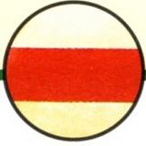

<!-- A0326-B0491 -->

原译文

Master Xerophus 泽拉普斯导师

**校订译文**

Master Xerophus 泽拉普斯导师

<!-- /A0326-B0491 -->

<!-- A0326-B0492 -->
### Master of Relics 遗物大师

原题：Master of Relics 遗物之主

<!-- /A0326-B0492 -->

<!-- A0326-B0493 -->

原译文

2 Lieutenants 2名副官

**校订译文**

2 Lieutenants 2名副官

<!-- /A0326-B0493 -->

<!-- A0326-B0494 -->

原译文

Chaplain 牧师

**校订译文**

Chaplain 教士

<!-- /A0326-B0494 -->

<!-- A0326-B0495 -->

原译文

Apothecary 药剂师

**校订译文**

Apothecary 药剂师

<!-- /A0326-B0495 -->

<!-- A0326-B0496 -->

原译文

Command Squad 指挥组

**校订译文**

Command Squad 指挥小队

<!-- /A0326-B0496 -->

<!-- A0326-B0497 -->

原译文

Company Veterans 连队老兵

**校订译文**

Company Veterans 连队老兵

<!-- /A0326-B0497 -->

<!-- A0326-B0498 -->

原译文

Company Ancient 连队旗手

**校订译文**

Company Ancient 连队旗手

<!-- /A0326-B0498 -->

<!-- A0326-B0499 -->

原译文

Company Champion 连队冠军

**校订译文**

Company Champion 连队冠军

<!-- /A0326-B0499 -->

<!-- A0326-B0500 -->

原译文

10 Fire Support Squads 10个火力支援小队

**校订译文**

10 Fire Support Squads 10个火力支援小队

<!-- /A0326-B0500 -->

<!-- A0326-B0501 -->

原译文

4 Dreadnoughts 4位无畏

**校订译文**

4 Dreadnoughts 4台无畏机甲

<!-- /A0326-B0501 -->

<!-- A0326-B0502 -->

原译文

Rhinos 犀牛

**校订译文**

Rhinos 犀牛战车

<!-- /A0326-B0502 -->

<!-- A0326-B0503 -->

原译文

Razorbacks 豪猪

**校订译文**

Razorbacks 豪猪战车

<!-- /A0326-B0503 -->

<!-- A0326-B0504 -->

原译文

Repulsors 反击者

**校订译文**

Repulsors 反重力战车

<!-- /A0326-B0504 -->

<!-- A0326-B0505 -->
### Scout Company 侦察连队

<!-- /A0326-B0505 -->

<!-- A0326-B0506 -->

原译文

10th Company 第十连队

**校订译文**

10th Company 第十连队

<!-- /A0326-B0506 -->

<!-- A0326-B0507 -->

原译文

"The Redeemed" “救赎”

**校订译文**

"The Redeemed" “获救赎者”

<!-- /A0326-B0507 -->

<!-- A0326-B0508 图片 -->
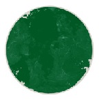

<!-- A0326-B0509 -->

原译文

Master Ranaeus 拉内乌斯导师

**校订译文**

Master Ranaeus 拉内乌斯导师

<!-- /A0326-B0509 -->

<!-- A0326-B0510 -->
### Master of Recruits 新兵之主

<!-- /A0326-B0510 -->

<!-- A0326-B0511 -->

原译文

2 Lieutenants 2名副官

**校订译文**

2 Lieutenants 2名副官

<!-- /A0326-B0511 -->

<!-- A0326-B0512 -->

原译文

Chaplain 牧师

**校订译文**

Chaplain 教士

<!-- /A0326-B0512 -->

<!-- A0326-B0513 -->

原译文

Apothecary 药剂师

**校订译文**

Apothecary 药剂师

<!-- /A0326-B0513 -->

<!-- A0326-B0514 -->

原译文

10 Scout Squad/Vanguards 10个侦察小队/先锋

**校订译文**

10 Scout Squad/Vanguards 10个侦察兵／先锋小队

<!-- /A0326-B0514 -->

<!-- A0326-B0515 -->

原译文

117 Unassigned 177个未分配者

**校订译文**

117 Unassigned 117名尚未分配编制者

**校注：** 英文数量为117，原译177有误。与下一行Neophytes合读，指尚未分配编制的新兵。

<!-- /A0326-B0515 -->

<!-- A0326-B0516 -->

原译文

Neophytes 新进者

**校订译文**

Neophytes 新兵

<!-- /A0326-B0516 -->

<!-- A0326-B0517 -->
## Recruitment 招募

<!-- /A0326-B0517 -->

<!-- A0326-B0518 -->
**英文原文**

As the Dark Angels are no longer based on an actual world, they draw their recruits from a variety of planets, mainly highly primitive worlds. The Dark Angels have sworn oaths to protect thousands of worlds which, in return, supply potential aspirants for the chapter.

<!-- /A0326-B0518 -->

<!-- A0326-B0519 -->

原译文

由于黑暗天使不再以实际的世界为基础，他们从各种行星上招募新兵，主要是高度原始的世界。黑暗天使已经宣誓要保护成千上万的世界，作为回报，这些世界为战团提供了潜在的有志者。

**校订译文**

黑暗天使不再以某一颗行星为基地，因此从多个世界征募新兵，主要是生活方式极为原始的星球。他们誓言保护数千个世界，后者则提供有潜力的入团候选者作为回报。

<!-- /A0326-B0519 -->

<!-- A0326-B0520 图片 -->
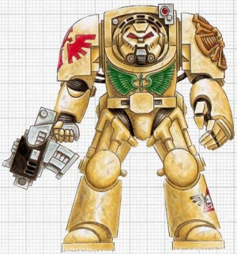

<!-- A0326-B0521 -->

原译文

Deathwing Terminator 死翼终结者

**校订译文**

Deathwing Terminator 死翼终结者

<!-- /A0326-B0521 -->

<!-- A0326-B0522 -->
**英文原文**

Representatives of the Dark Angels visit each recruiting world once within a normal human's lifetime and take the strongest juveniles from the population. Each recruit is thoroughly screened, and from the moment he is accepted into the Chapter as a Space Marine his past becomes irrelevant.

<!-- /A0326-B0522 -->

<!-- A0326-B0523 -->

原译文

黑暗天使的代表在正常人的一生中访问每个募兵世界一次，并从人群中挑选出最强壮的青少年。每个新兵都经过彻底筛选，从他被接纳为星际战士的那一刻起，他的过去就变得无关紧要了。

**校订译文**

黑暗天使的代表大约每隔普通人一生的时间，便造访各征兵世界一次，从当地挑选最强健的少年。每名新兵都要接受严格筛选；从获准以星际战士身份加入战团那一刻起，过去便不再重要。

<!-- /A0326-B0523 -->

<!-- A0326-B0524 -->
**英文原文**

After the Heresy, the Dark Angels recruited from a single planet (known as the Plains World). Sometime before the 41st Millennium a group of returning Deathwing found that their planet had been overrun fifty years earlier by Genestealers, with only a few untainted humans remaining. The Terminators, whose duty and honour required the extermination of the genestealers, prepared themselves for battle. Because the odds of their success were nearly non-existent, the Terminators engaged in their native death ritual. Instead of anointing their skin with white ash, they anointed their armour. The Terminators cleansed the world and rescued the enslaved populace, and in honour of those few Terminators, their armour was ever after white. Meanwhile, the Dark Angels leadership, the Inner Circle, recognized the folly of relying upon one planet for manpower and so diversified their recruiting grounds.

<!-- /A0326-B0524 -->

<!-- A0326-B0525 -->

原译文

叛乱之后，黑暗天使从一个星球（被称为平原世界）招募。在第41个千年之前的某个时候，一群归来的死翼发现，他们的星球在50年前就被基因窃取者占领了，只剩下少数未受污染的人类。终结者的职责和荣誉要求消灭基因窃取者，他们为战斗做好了准备。因为他们成功的可能性几乎不存在，终结者们开始了他们的本土死亡仪式。他们没有用白灰抹他们的皮肤，而是抹了他们的盔甲。终结者们净化了世界，拯救了被奴役的民众，为了纪念那些少数终结者，他们的盔甲永远是白色的。与此同时，黑暗天使的领导层，即内环，认识到依靠一个星球获取人力的愚蠢，因此使他们的招募范围扩大。

**校订译文**

荷鲁斯之乱后，黑暗天使一度仅从一颗称为“平原世界”的星球征兵。第41千年之前的某个时期，一群返回故乡的死翼战士发现，这里早在五十年前便被基因窃取者占据，未受污染的人类所剩无几。职责与荣誉要求他们消灭敌人，于是这些终结者准备迎战。由于胜算渺茫，他们先举行故乡的临终仪式，但没有将白灰涂在皮肤上，而是涂上护甲。最终，他们净化了星球，解救被奴役的居民。为纪念这少数终结者，死翼此后始终采用白色护甲。与此同时，内环意识到只依赖一个世界征兵的危险，因而拓展了征募来源。

**校注：** 本段保留旧资料对死翼白色护甲起源的记述；前述大远征时期的死翼传统可能有不同解释，未将资料版本强行改成一致。

<!-- /A0326-B0525 -->

<!-- A0326-B0526 -->
### Known Recruitment Worlds 著名募兵世界

<!-- /A0326-B0526 -->

<!-- A0326-B0527 -->
**英文原文**

The Dark Angels recruit from thousands of worlds across the galaxy. Known recruitment worlds include:

<!-- /A0326-B0527 -->

<!-- A0326-B0528 -->

原译文

黑暗天使从银河系数千个世界招募成员。已知的募兵世界包括：

**校订译文**

黑暗天使从银河系数千个世界招募成员。已知的募兵世界包括：

<!-- /A0326-B0528 -->

<!-- A0326-B0529 -->

原译文

Aginor Sigma 阿吉诺尔18号

**校订译文**

Aginor Sigma 阿吉诺尔·西格玛

**校注：** Sigma为希腊字母，不直接改作序数18；世界名暂用阿吉诺尔·西格玛。

<!-- /A0326-B0529 -->

<!-- A0326-B0530 -->

原译文

Bartia 巴蒂亚

**校订译文**

Bartia 巴蒂亚

<!-- /A0326-B0530 -->

<!-- A0326-B0531 -->
**英文原文**

Bregundia — Semi-Feral World.

<!-- /A0326-B0531 -->

<!-- A0326-B0532 -->

原译文

布雷冈迪亚 — 半蛮荒世界

**校订译文**

布雷冈迪亚 — 半蛮荒世界

<!-- /A0326-B0532 -->

<!-- A0326-B0533 -->
**英文原文**

Duthovan — Recruitment world during the Great Crusade.

<!-- /A0326-B0533 -->

<!-- A0326-B0534 -->

原译文

杜索万 — 大远征期间的募兵世界

**校订译文**

杜索万 — 大远征期间的募兵世界

<!-- /A0326-B0534 -->

<!-- A0326-B0535 -->
**英文原文**

Gramarye — Great Crusade/Heresy-era.

<!-- /A0326-B0535 -->

<!-- A0326-B0536 -->

原译文

格拉马里 — 大远征/叛乱时期

**校订译文**

格拉马里 — 大远征/叛乱时期

<!-- /A0326-B0536 -->

<!-- A0326-B0537 -->

原译文

Grymmport 格莱姆港

**校订译文**

Grymmport 格莱姆港

<!-- /A0326-B0537 -->

<!-- A0326-B0538 -->
**英文原文**

Grymm's Landing — Destroyed

<!-- /A0326-B0538 -->

<!-- A0326-B0539 -->

原译文

格莱姆登陆场 — 毁灭

**校订译文**

格莱姆登陆场 — 毁灭

<!-- /A0326-B0539 -->

<!-- A0326-B0540 -->
**英文原文**

Kalabria — Desert World

<!-- /A0326-B0540 -->

<!-- A0326-B0541 -->

原译文

卡拉布里亚 — 沙漠世界

**校订译文**

卡拉布里亚 — 沙漠世界

<!-- /A0326-B0541 -->

<!-- A0326-B0542 -->
**英文原文**

Kimmeria — Feral World

<!-- /A0326-B0542 -->

<!-- A0326-B0543 -->

原译文

基梅利亚 — 蛮荒世界

**校订译文**

基梅利亚 — 蛮荒世界

<!-- /A0326-B0543 -->

<!-- A0326-B0544 -->

原译文

Narcium 纳西姆

**校订译文**

Narcium 纳西姆

<!-- /A0326-B0544 -->

<!-- A0326-B0545 -->

原译文

New Macedon 新马其顿

**校订译文**

New Macedon 新马其顿

<!-- /A0326-B0545 -->

<!-- A0326-B0546 -->
**英文原文**

Numarc — Ice World

<!-- /A0326-B0546 -->

<!-- A0326-B0547 -->

原译文

努马克 — 冰雪世界

**校订译文**

努马克 — 冰雪世界

<!-- /A0326-B0547 -->

<!-- A0326-B0548 -->

原译文

Nymidae 宁米代

**校订译文**

Nymidae 宁米代

<!-- /A0326-B0548 -->

<!-- A0326-B0549 -->

原译文

Piscina V 皮塞纳五号

**校订译文**

Piscina V 皮希纳五号

<!-- /A0326-B0549 -->

<!-- A0326-B0550 -->
**英文原文**

Plains World — Overrun by Genestealers.

<!-- /A0326-B0550 -->

<!-- A0326-B0551 -->

原译文

平原世界 — 基因窃取者横行

**校订译文**

平原世界 — 基因窃取者横行

<!-- /A0326-B0551 -->

<!-- A0326-B0552 -->

原译文

Slathe 斯拉斯

**校订译文**

Slathe 斯拉斯

<!-- /A0326-B0552 -->

<!-- A0326-B0553 -->

原译文

Styx 冥河

**校订译文**

Styx 冥河

<!-- /A0326-B0553 -->

<!-- A0326-B0554 -->
**英文原文**

In addition, the Dark Angels are known to maintain fortified bastions on other worlds, including Piscina IV.

<!-- /A0326-B0554 -->

<!-- A0326-B0555 -->

原译文

此外，众所周知，黑暗天使在其他星球上维护着坚固的堡垒，包括皮塞纳四号。

**校订译文**

黑暗天使也在其他世界设有坚固堡垒，其中包括皮希纳四号。

<!-- /A0326-B0555 -->

<!-- A0326-B0556 -->
## Fortress-monastery 要塞修道院

<!-- /A0326-B0556 -->

<!-- A0326-B0557 -->
**英文原文**

The ruins of Caliban are located in the Cadian Sector, close to the Eye of Terror. Prior to the Great Crusade and the Horus Heresy, the planet of Caliban was covered with lush forests inhabited by creatures warped by Chaos. The humans of the planet were a proud, martial people forced to live in great fortress monasteries of stone.

<!-- /A0326-B0557 -->

<!-- A0326-B0558 -->

原译文

卡利班的废墟位于卡迪安星区，靠近恐惧之眼。在大远征和荷鲁斯叛乱之前，卡利班行星被茂密的森林所覆盖，那里居住着被混沌扭曲的生物。星球上的人类是一个自豪的、好战的民族，被迫生活在巨大的石头堡垒修道院中。

**校订译文**

卡利班的残骸位于卡迪亚星区，靠近恐惧之眼。在大远征与荷鲁斯之乱前，这颗星球覆盖着茂密森林，其中栖息着被混沌扭曲的生物。当地人类骄傲尚武，却被迫居住在庞大的石砌要塞修道院中。

<!-- /A0326-B0558 -->

<!-- A0326-B0559 图片 -->
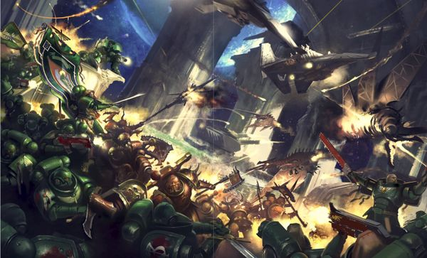

<!-- A0326-B0560 -->

原译文

Dark Angels, including Primaris Space Marines, battle the forces of Chaos 黑暗天使，包括原铸星际战士，与混沌部队作战

**校订译文**

Dark Angels, including Primaris Space Marines, battle the forces of Chaos 黑暗天使，包括原铸星际战士，与混沌部队作战

<!-- /A0326-B0560 -->

<!-- A0326-B0561 -->
**英文原文**

The Dark Angels rebuilt their fortress-monastery on the asteroid that had borne the old one, drilling deep into the bedrock and rebuilding the ruins. The new fortress is known officially as The Tower of Angels but is more commonly referred to as The Rock. The Rock has been equipped with warp engines, enabling faster-than-light transit through the Immaterium.

<!-- /A0326-B0561 -->

<!-- A0326-B0562 -->

原译文

黑暗天使在承载旧修道院的小行星上重建了他们的堡垒修道院，深入基岩并重建了废墟。这座新堡垒的正式名称是天使之塔，但通常被称为巨石。巨石配备了亚空间引擎，能够以比光速更快的速度通过非物质界。

**校订译文**

黑暗天使在承载旧修道院的那块小行星残骸上重建基地，向基岩深处开凿，并修复地表废墟。新堡垒的正式名称是“天使之塔”，通常则称“巨石”。它装备了亚空间引擎，能够穿行非物质界，实现超光速航行。

<!-- /A0326-B0562 -->

<!-- A0326-B0563 -->
**英文原文**

The warrens beneath The Rock are where the Dark Angels bring their fallen brethren to be redeemed by their Interrogator-Chaplains. It is believed by the Inquisition to hold many other secrets.

<!-- /A0326-B0563 -->

<!-- A0326-B0564 -->

原译文

巨石下的区域是黑暗天使带着他们堕落的兄弟被审讯牧师救赎的地方。审判庭认为它掌握着许多其他秘密。

**校订译文**

巨石下层如迷宫般的密道与牢房，是黑暗天使关押堕落兄弟、由审讯教士迫使其忏悔以求救赎的地方。审判庭相信，这里还隐藏着许多其他秘密。

<!-- /A0326-B0564 -->

<!-- A0326-B0565 -->
**英文原文**

However, even this pales in comparison to the greatest secret held by the Dark Angels. This secret is known only to the Watchers in the Dark and to the Emperor himself. Deep within the bedrock of the asteroid which is their home, there is a solitary chamber. In this chamber, attended to by the Watchers in the Dark, lies the sleeping form of Lion El'Jonson.

<!-- /A0326-B0565 -->

<!-- A0326-B0566 -->

原译文

然而，与黑暗天使所掌握的最大秘密相比，这也相形见绌。这个秘密只有黑暗守望者和帝皇自己知道。在他们的家园小行星的基岩深处，有一个单独的房间。在这个由黑暗守望者照料的房间里，躺着沉睡的莱昂·艾尔庄森。

**校订译文**

不过，在雄狮回归前，这一切都比不上巨石最深处的秘密。只有黑暗守望者与帝皇知晓：小行星基岩深处的一间隐秘密室中，莱昂·艾尔’庄森在守望者的照料下沉睡。

**校注：** 此为雄狮回归前的秘密，已调整为历史叙述，与本篇不屈时代及噩兆方舟战役后的状态区分。

<!-- /A0326-B0566 -->

<!-- A0326-B0567 图片 -->
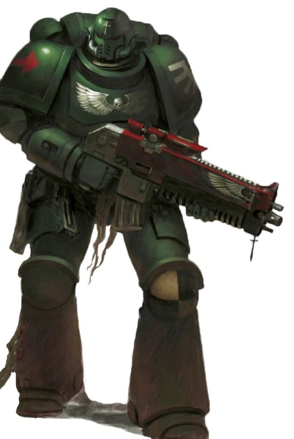

<!-- A0326-B0568 -->

原译文

Dark Angels Primaris Space Marine 黑暗天使原铸星际战士

**校订译文**

Dark Angels Primaris Space Marine 黑暗天使原铸星际战士

<!-- /A0326-B0568 -->

<!-- A0326-B0569 -->
## Noted Elements of the Dark Angels 黑暗天使的著名单位与成员

原题：Noted Elements of the Dark Angels 黑暗天使的著名成员

<!-- /A0326-B0569 -->

<!-- A0326-B0570 -->
### Vessels 战舰

<!-- /A0326-B0570 -->

<!-- A0326-B0571 -->
**英文原文**

The Rock — Space station, current base of operations and Fortress Monastery

<!-- /A0326-B0571 -->

<!-- A0326-B0572 -->

原译文

巨石 — 空间站，目前的行动基地和堡垒修道院

**校订译文**

巨石 — 空间站，目前的行动基地和要塞修道院

<!-- /A0326-B0572 -->

<!-- A0326-B0573 -->
**英文原文**

Invincible Reason — Flagship & Gloriana Class Battleship

<!-- /A0326-B0573 -->

<!-- A0326-B0574 -->

原译文

无敌理性号 — 旗舰和荣光女王级战列舰

**校订译文**

无敌理性号 — 旗舰和荣光女王级战列舰

<!-- /A0326-B0574 -->

<!-- A0326-B0575 -->
### Vehicles 载具

<!-- /A0326-B0575 -->

<!-- A0326-B0576 -->
**英文原文**

Corvex — The last known Imperial Jetbike and personal transport of Sammael

<!-- /A0326-B0576 -->

<!-- A0326-B0577 -->

原译文

渡鸦 — 最后一个已知的帝国悬浮摩托和萨麦尔的个人交通工具

**校订译文**

渡鸦号——萨麦尔的私人座驾，原资料称其为帝国最后一辆已知仍存的喷气摩托。

**校注：** 原文称last known Imperial Jetbike，与别处帝皇禁军喷气摩托资料存在范围或年代疑点；保留原资料归属并标注，不断言为整个设定唯一现存车辆。Corvex沿用现稿渡鸦号，暂定。

<!-- /A0326-B0577 -->

<!-- A0326-B0578 -->
### Notable Members 著名成员

<!-- /A0326-B0578 -->

<!-- A0326-B0579 -->
**英文原文**

Heresy Era

**补译**

荷鲁斯之乱时期

<!-- /A0326-B0579 -->

<!-- A0326-B0580 -->
**英文原文**

Lion El'Jonson — The Dark Angels Primarch

<!-- /A0326-B0580 -->

<!-- A0326-B0581 -->

原译文

莱昂·艾尔庄森 — 黑暗天使原体

**校订译文**

莱昂·艾尔’庄森——黑暗天使原体。

<!-- /A0326-B0581 -->

<!-- A0326-B0582 -->
**英文原文**

Luther — Grand Master of the Order

<!-- /A0326-B0582 -->

<!-- A0326-B0583 -->

原译文

卢瑟 — 骑士团大导师

**校订译文**

卢瑟 — 骑士团大导师

<!-- /A0326-B0583 -->

<!-- A0326-B0584 -->
**英文原文**

Corswain — Seneschal, Captain-Paladin of the Ninth Order

<!-- /A0326-B0584 -->

<!-- A0326-B0585 -->

原译文

考斯韦恩 — 总管，第九骑士团的圣骑士连长

**校订译文**

考斯韦恩 — 总管，第九骑士团的圣骑士连长

<!-- /A0326-B0585 -->

<!-- A0326-B0586 -->

原译文

The Lord Cypher 塞弗领主

**校订译文**

The Lord Cypher 塞弗领主

<!-- /A0326-B0586 -->

<!-- A0326-B0587 -->
**英文原文**

Holguin — Voted Lieutenant of the Deathwing

<!-- /A0326-B0587 -->

<!-- A0326-B0588 -->

原译文

霍尔金 — 死翼受选副官

**校订译文**

霍尔金 — 死翼受选副官

<!-- /A0326-B0588 -->

<!-- A0326-B0589 -->
**英文原文**

Farith Redloss — Voted Lieutenant of the Dreadwing, became the first post-Heresy Supreme Grand Master

<!-- /A0326-B0589 -->

<!-- A0326-B0590 -->

原译文

法瑞斯·瑞德罗斯 — 死翼受选副官，成为叛乱后第一个至高大导师

**校订译文**

法瑞斯·雷德洛斯——恐翼受选副官，后来成为荷鲁斯之乱后首位至高大导师。

**校注：** Dreadwing为恐翼，原译死翼误与Deathwing混同；Farith Redloss按本篇较早写法统一法瑞斯·雷德洛斯。

<!-- /A0326-B0590 -->

<!-- A0326-B0591 -->
**英文原文**

Astelan — First Master on Caliban

<!-- /A0326-B0591 -->

<!-- A0326-B0592 -->

原译文

阿斯特兰 — 卡利班上的第一导师

**校订译文**

阿斯特兰 — 卡利班上的第一导师

<!-- /A0326-B0592 -->

<!-- A0326-B0593 -->
**英文原文**

Alajos — Master of the Ninth Order during the Horus Heresy. Killed by Sevatar during the Thramas Crusade

<!-- /A0326-B0593 -->

<!-- A0326-B0594 -->

原译文

阿拉霍斯 — 荷鲁斯叛乱时期第九骑士团导师。萨拉马斯远征期间被赛维塔杀死

**校订译文**

阿拉霍斯——荷鲁斯之乱时期的第九骑士团导师，在萨拉玛斯远征中被赛维塔杀死。

<!-- /A0326-B0594 -->

<!-- A0326-B0595 -->
**英文原文**

Tragan — Was a Sergeant in the Dark Angels Legion's Ninth Order during the Horus Heresy, where he served under Captain Alajos command. He took part in the Thramas Crusade. Later he became the Captain of the Ninth Order instead of Alajos

<!-- /A0326-B0595 -->

<!-- A0326-B0596 -->

原译文

塔拉甘 — 在荷鲁斯叛乱时期，他是黑暗天使军团第九骑士团的一名军事，在阿拉霍斯连长的指挥下服役。他参加了萨拉马斯远征。后来，他代替阿拉霍斯成为了第九骑士团的连长

**校订译文**

塔拉甘——荷鲁斯之乱时期黑暗天使第九骑士团的军士，隶属阿拉霍斯连长麾下，参加过萨拉玛斯远征。后来，他接替阿拉霍斯成为第九骑士团连长。

<!-- /A0326-B0596 -->

<!-- A0326-B0597 -->
**英文原文**

Abdaziel Magron — Heresy era Sergeant awakened in 41 Millennium

<!-- /A0326-B0597 -->

<!-- A0326-B0598 -->

原译文

阿布达齐尔·马格伦 — 第41个千年醒来的叛乱时期军士

**校订译文**

阿布达齐尔·马格伦 — 第41个千年醒来的叛乱时期军士

<!-- /A0326-B0598 -->

<!-- A0326-B0599 -->
**英文原文**

Nemean — Blackshield and later Knights-Errant

<!-- /A0326-B0599 -->

<!-- A0326-B0600 -->

原译文

尼米恩 — 黑盾和后来的游侠骑士

**校订译文**

尼米恩 — 黑盾和后来的游侠骑士

<!-- /A0326-B0600 -->

<!-- A0326-B0601 -->
**英文原文**

Urian Vendraig - Legion Master

<!-- /A0326-B0601 -->

<!-- A0326-B0602 -->

原译文

尤里安·万德拉戈 - 军团长

**校订译文**

尤里安·万德拉戈 - 军团长

<!-- /A0326-B0602 -->

<!-- A0326-B0603 -->
**英文原文**

Marduk Sedras - Dreadwing Eskaton

<!-- /A0326-B0603 -->

<!-- A0326-B0604 -->

原译文

马杜克·赛德拉斯 - 死翼终灭者

**校订译文**

马杜克·赛德拉斯——恐翼终灭者。

**校注：** Dreadwing为恐翼，非死翼。

<!-- /A0326-B0604 -->

<!-- A0326-B0605 -->
**英文原文**

Elikas - Chief Librarian

<!-- /A0326-B0605 -->

<!-- A0326-B0606 -->

原译文

埃利亚斯 - 首席智库

**校订译文**

埃利卡斯——首席智库员。

**校注：** Elikas 原译埃利亚斯遗漏了k所对应的音节，暂定埃利卡斯。

<!-- /A0326-B0606 -->

<!-- A0326-B0607 -->
### Post Heresy 叛乱后

<!-- /A0326-B0607 -->

<!-- A0326-B0608 -->
**英文原文**

Primarch - Lion El'Jonson (recently returned)

<!-- /A0326-B0608 -->

<!-- A0326-B0609 -->

原译文

原体 - 莱昂·艾尔庄森（最近回归）

**校订译文**

原体——莱昂·艾尔’庄森，近期已回归。

<!-- /A0326-B0609 -->

<!-- A0326-B0610 -->
**英文原文**

Azrael — Current Supreme Grand Master of The Dark Angels and Keeper of The Truth

<!-- /A0326-B0610 -->

<!-- A0326-B0611 -->

原译文

阿兹瑞尔 — 现任黑暗天使至高大导师兼真理守护者

**校订译文**

阿兹瑞尔 — 现任黑暗天使至高大导师兼真理守护者

<!-- /A0326-B0611 -->

<!-- A0326-B0612 -->
**英文原文**

Sapphon — Current Grand Master of Chaplains & Master of Sanctity. He received the post neither due to age nor ability as an interrogator (Asmodai is his superior in both these things) but due to his ability as an inspirational leader, also referred to as the Finder of Secrets.

<!-- /A0326-B0612 -->

<!-- A0326-B0613 -->

原译文

萨芬 — 现任牧师大导师和圣洁导师。他之所以得到这个职位，既不是因为年龄，也不是因为审讯者的能力（阿斯莫代在这两方面都比他优秀），而是因为他是一位鼓舞人心的领导者，也被称为秘密发现者。

**校订译文**

萨芬——现任教士大导师兼圣洁导师。他获此任命，并非因资历或审讯能力出众——阿斯莫德在这两方面都胜过他——而是因为他擅长激励他人，具备出色的领导才能。他也被称为“秘密发现者”。

<!-- /A0326-B0613 -->

<!-- A0326-B0614 -->
**英文原文**

Asmodai — Master Interrogator-Chaplain

<!-- /A0326-B0614 -->

<!-- A0326-B0615 -->

原译文

阿斯莫代 — 审讯牧师导师

**校订译文**

阿斯莫德——审讯教士导师。

<!-- /A0326-B0615 -->

<!-- A0326-B0616 -->
**英文原文**

Raguel - Interrogator-Chaplain

<!-- /A0326-B0616 -->

<!-- A0326-B0617 -->

原译文

拉贵尔 - 审讯牧师

**校订译文**

拉贵尔——审讯教士。

<!-- /A0326-B0617 -->

<!-- A0326-B0618 -->
**英文原文**

Ezekiel — Current Chief Librarian, Keeper of the Book of Salvation and Holder of The Keys

<!-- /A0326-B0618 -->

<!-- A0326-B0619 -->

原译文

以西结 — 现任首席智库、救赎之书保管者和钥匙持有者

**校订译文**

以西结——现任首席智库员、《救赎之书》的保管者与钥匙持有者。

<!-- /A0326-B0619 -->

<!-- A0326-B0620 -->
**英文原文**

Zadkiel — Epistolary

<!-- /A0326-B0620 -->

<!-- A0326-B0621 -->

原译文

萨基尔 — 星语官

**校订译文**

扎德基尔 — 星语官

<!-- /A0326-B0621 -->

<!-- A0326-B0622 -->
**英文原文**

Sepharon — Master of the Logisticiam and Warden of the Gates

<!-- /A0326-B0622 -->

<!-- A0326-B0623 -->

原译文

塞法伦 — 后勤之主兼门户守望者

**校订译文**

塞法伦 — 后勤之主兼门户看守者

<!-- /A0326-B0623 -->

<!-- A0326-B0624 -->
**英文原文**

Belial — Master of the Deathwing.

<!-- /A0326-B0624 -->

<!-- A0326-B0625 -->

原译文

贝利亚 — 死翼导师

**校订译文**

贝利亚 — 死翼导师

<!-- /A0326-B0625 -->

<!-- A0326-B0626 -->
**英文原文**

Apharan - First Primaris Deathwing Member

<!-- /A0326-B0626 -->

<!-- A0326-B0627 -->

原译文

阿法兰 - 第一位原铸死翼成员

**校订译文**

阿法兰 - 第一位原铸死翼成员

<!-- /A0326-B0627 -->

<!-- A0326-B0628 -->
**英文原文**

Sammael — Master of the Ravenwing.

<!-- /A0326-B0628 -->

<!-- A0326-B0629 -->

原译文

萨麦尔 — 鸦翼导师

**校订译文**

萨麦尔 — 鸦翼导师

<!-- /A0326-B0629 -->

<!-- A0326-B0630 -->
**英文原文**

Astoran — Master of the 3rd Company and Master of the Arsenal

<!-- /A0326-B0630 -->

<!-- A0326-B0631 -->

原译文

阿斯托兰 — 第三连队导师和军械之主

**校订译文**

阿斯托兰 — 第三连队导师和军械大师

**校注：** 本篇编制表将第三连导师列为Gabrael，本名单另列Astoran；可能来自不同年代或版本，不强行视作同一人。

<!-- /A0326-B0631 -->

<!-- A0326-B0632 -->
**英文原文**

Korahael — Master of the 4th Company and Master of the Fleet

<!-- /A0326-B0632 -->

<!-- A0326-B0633 -->

原译文

科拉希尔 — 第四连队导师和舰队之主

**校订译文**

科拉海尔——第四连导师兼舰队大师。

<!-- /A0326-B0633 -->

<!-- A0326-B0634 -->
**英文原文**

Lazarus — Master of the 5th Company and Keeper of the Unseen Ritual

<!-- /A0326-B0634 -->

<!-- A0326-B0635 -->

原译文

拉撒路 — 第五连队导师和无形秘仪守护者

**校订译文**

拉撒路 — 第五连队导师和无形秘仪守护者

<!-- /A0326-B0635 -->

<!-- A0326-B0636 -->
### Notable Fallen Angels 著名堕天使

<!-- /A0326-B0636 -->

<!-- A0326-B0637 -->
**英文原文**

Cypher — The most hated of the Fallen, supposedly took the Lion Sword

<!-- /A0326-B0637 -->

<!-- A0326-B0638 -->

原译文

塞弗 — 最令人憎恨的堕天使，据说拿走了狮剑

**校订译文**

塞弗——最受憎恨的堕天使，据说带走了狮剑。

<!-- /A0326-B0638 -->

<!-- A0326-B0639 -->
**英文原文**

Luther — Former right-hand man to Lion El'Jonson

<!-- /A0326-B0639 -->

<!-- A0326-B0640 -->

原译文

卢瑟 — 莱昂·艾尔庄森的前得力助手

**校订译文**

卢瑟——莱昂·艾尔’庄森昔日的得力助手。

<!-- /A0326-B0640 -->

<!-- A0326-B0641 -->
**英文原文**

Astelan — Former Master of the Order on Caliban, a Terran

<!-- /A0326-B0641 -->

<!-- A0326-B0642 -->

原译文

阿斯特兰 — 前卡利班上的骑士团导师，泰拉裔

**校订译文**

阿斯特兰 — 前卡利班上的骑士团导师，泰拉裔

<!-- /A0326-B0642 -->

<!-- A0326-B0643 -->
**英文原文**

Cadmus — Tracked and killed by Jeremiah Gieyus

<!-- /A0326-B0643 -->

<!-- A0326-B0644 -->

原译文

卡德摩斯 — 被杰里迈亚·吉尤斯追踪并杀死

**校订译文**

卡德摩斯 — 被杰里迈亚·吉尤斯追踪并杀死

<!-- /A0326-B0644 -->

<!-- A0326-B0645 -->
**英文原文**

Zhebdek Abaddas — former Captain

<!-- /A0326-B0645 -->

<!-- A0326-B0646 -->

原译文

泽布德克·阿巴达斯 — 前连长

**校订译文**

泽布德克·阿巴达斯 — 前连长

<!-- /A0326-B0646 -->

<!-- A0326-B0647 -->
**英文原文**

Marbas - Only Fallen to have become a Daemon Prince

<!-- /A0326-B0647 -->

<!-- A0326-B0648 -->

原译文

玛巴斯 - 唯一成为恶魔王子的堕天使

**校订译文**

马尔巴斯——原资料称其为唯一升格为恶魔亲王的堕天使。

**校注：** “唯一”保留为原资料中的断言，不据此推演其他堕天使的最终命运。

<!-- /A0326-B0648 -->

<!-- A0326-B0649 -->
**英文原文**

Zabriel - Uncrowned Prince, Former initiate of the Dreadwing, first to be redeemed as one of the Risen, currently serves as the Lion’s emissary.

<!-- /A0326-B0649 -->

<!-- A0326-B0650 -->

原译文

扎布瑞尔 - 无冕王子，前恐翼信徒，第一批被救赎为赦天使的人之一，目前担任莱昂的使者。

**校订译文**

扎布瑞尔——无冕王子，曾是恐翼正式成员，是首位得到宽恕、成为赦天使的人，如今担任雄狮的使者。

**校注：** initiate of the Dreadwing 指恐翼正式成员，不是新兵；与望教者postulant区分。

<!-- /A0326-B0650 -->

<!-- A0326-B0651 -->
**英文原文**

Kai - Former Knight-Commander, redeemed as one of the Lion’s Risen.

<!-- /A0326-B0651 -->

<!-- A0326-B0652 -->

原译文

凯 - 前骑士指挥官，被救赎为莱昂的赦天使之一

**校订译文**

凯 - 前骑士指挥官，被救赎为莱昂的赦天使之一

<!-- /A0326-B0652 -->

<!-- A0326-B0653 -->
**英文原文**

Unique Troops & Vehicles (Also used by Successor Chapters)

<!-- /A0326-B0653 -->

<!-- A0326-B0654 -->

原译文

独特的部队和载具（也由子战团使用）

**校订译文**

独特的部队和载具（也由子战团使用）

<!-- /A0326-B0654 -->

<!-- A0326-B0655 -->

原译文

Interrogator-Chaplain 审讯牧师

**校订译文**

Interrogator-Chaplain 审讯教士

<!-- /A0326-B0655 -->

<!-- A0326-B0656 -->

原译文

Deathwing 死翼

**校订译文**

Deathwing 死翼

<!-- /A0326-B0656 -->

<!-- A0326-B0657 -->

原译文

Deathwing Strikemaster 死翼打击大师

**校订译文**

Deathwing Strikemaster 死翼打击大师

<!-- /A0326-B0657 -->

<!-- A0326-B0658 -->

原译文

Deathwing Command Squad 死翼指挥组

**校订译文**

Deathwing Command Squad 死翼指挥小队

<!-- /A0326-B0658 -->

<!-- A0326-B0659 -->

原译文

Deathwing Champion 死翼冠军

**校订译文**

Deathwing Champion 死翼冠军

<!-- /A0326-B0659 -->

<!-- A0326-B0660 -->

原译文

Deathwing Apothecary 死翼药剂师

**校订译文**

Deathwing Apothecary 死翼药剂师

<!-- /A0326-B0660 -->

<!-- A0326-B0661 -->

原译文

Deathwing Bladeguard Veteran 死翼剑卫老兵

**校订译文**

Deathwing Bladeguard Veteran 死翼剑卫老兵

<!-- /A0326-B0661 -->

<!-- A0326-B0662 -->

原译文

Deathwing Knight 死翼骑士

**校订译文**

Deathwing Knight 死翼骑士

<!-- /A0326-B0662 -->

<!-- A0326-B0663 -->

原译文

Deathwing Land Raider 死翼兰德掠袭者

**校订译文**

Deathwing Land Raider 死翼兰德掠袭者战车

<!-- /A0326-B0663 -->

<!-- A0326-B0664 -->

原译文

Ravenwing 鸦翼

**校订译文**

Ravenwing 鸦翼

<!-- /A0326-B0664 -->

<!-- A0326-B0665 -->

原译文

Ravenwing Command Squad 鸦翼指挥组

**校订译文**

Ravenwing Command Squad 鸦翼指挥小队

<!-- /A0326-B0665 -->

<!-- A0326-B0666 -->

原译文

Ravenwing Ancient 鸦翼旗手

**校订译文**

Ravenwing Ancient 鸦翼旗手

<!-- /A0326-B0666 -->

<!-- A0326-B0667 -->

原译文

Ravenwing Champion 鸦翼冠军

**校订译文**

Ravenwing Champion 鸦翼冠军

<!-- /A0326-B0667 -->

<!-- A0326-B0668 -->

原译文

Ravenwing Black Knight 鸦翼黑骑士

**校订译文**

Ravenwing Black Knight 鸦翼黑骑士

<!-- /A0326-B0668 -->

<!-- A0326-B0669 -->

原译文

Darkshroud 黑幕

**校订译文**

Darkshroud 黑幕飞艇

<!-- /A0326-B0669 -->

<!-- A0326-B0670 -->

原译文

Land Speeder Vengeance 兰德速攻艇复仇

**校订译文**

Land Speeder Vengeance 复仇型兰德速攻艇

<!-- /A0326-B0670 -->

<!-- A0326-B0671 -->

原译文

Nephilim Jetfighter 拿非利喷气战斗机

**校订译文**

Nephilim Jetfighter 涅菲里姆战机

<!-- /A0326-B0671 -->

<!-- A0326-B0672 -->

原译文

Dark Talon 暗爪

**校订译文**

Dark Talon 黑暗之爪战机

<!-- /A0326-B0672 -->

<!-- A0326-B0673 -->

原译文

Inner Circle Companions 内环伴卫

**校订译文**

Inner Circle Companions 内环近卫

**校注：** Inner Circle Companions采用官方内环近卫，不能与大远征时期Deathwing Companions或Knights Cenobium混为同一单位。

<!-- /A0326-B0673 -->

<!-- A0326-B0674 -->

原译文

Mortis Dreadnought 莫迪斯无畏

**校订译文**

Mortis Dreadnought 莫迪斯型无畏机甲

<!-- /A0326-B0674 -->

<!-- A0326-B0675 -->

原译文

Land Raider Ares 兰德掠袭者阿瑞斯

**校订译文**

Land Raider Ares 阿瑞斯型兰德掠袭者战车

<!-- /A0326-B0675 -->

<!-- A0326-B0676 -->

原译文

Land Raider Solemnus Aggressor 兰德掠袭者庄严侵略者

**校订译文**

Land Raider Solemnus Aggressor 庄严侵略者型兰德掠袭者战车

<!-- /A0326-B0676 -->

<!-- A0326-B0677 -->

原译文

Deathwing Companions (Heresy-era) 死翼伴卫（叛乱时期）

**校订译文**

Deathwing Companions (Heresy-era) 死翼伴卫（叛乱时期）

<!-- /A0326-B0677 -->

<!-- A0326-B0678 -->

原译文

Stormwing (Heresy-era) 风暴翼（叛乱时期）

**校订译文**

Stormwing (Heresy-era) 风暴翼（叛乱时期）

<!-- /A0326-B0678 -->

<!-- A0326-B0679 -->

原译文

Ironwing (Heresy-era) 铁翼

**校订译文**

Ironwing (Heresy-era) 铁翼（荷鲁斯之乱时期）

<!-- /A0326-B0679 -->

<!-- A0326-B0680 -->

原译文

Excindio Battle-Automata 灭绝者自动机兵

**校订译文**

Excindio Battle-Automata 毁灭者自动机兵

<!-- /A0326-B0680 -->

<!-- A0326-B0681 -->

原译文

Forge-Wright 铸炉工匠

**校订译文**

Forge-Wright 铸炉工匠

<!-- /A0326-B0681 -->

<!-- A0326-B0682 -->

原译文

Dreadwing (Heresy-era) 恐翼（叛乱时期）

**校订译文**

Dreadwing (Heresy-era) 恐翼（叛乱时期）

<!-- /A0326-B0682 -->

<!-- A0326-B0683 -->

原译文

Interemptors 屠灭者

**校订译文**

Interemptors 屠灭者

<!-- /A0326-B0683 -->

<!-- A0326-B0684 -->

原译文

Naufragia 纳夫拉基亚

**校订译文**

Naufragia 纳夫拉基亚

<!-- /A0326-B0684 -->

<!-- A0326-B0685 -->

原译文

Firewing (Heresy-era) 炎翼

**校订译文**

Firewing (Heresy-era) 炎翼（荷鲁斯之乱时期）

<!-- /A0326-B0685 -->

<!-- A0326-B0686 -->

原译文

Enigmatii 迷影

**校订译文**

Enigmatii 迷影

<!-- /A0326-B0686 -->

<!-- A0326-B0687 -->

原译文

Knights Cenobium (Heresy-era) 内环骑士（叛乱时期）

**校订译文**

Knights Cenobium (Heresy-era) 内环骑士（叛乱时期）

<!-- /A0326-B0687 -->

<!-- A0326-B0688 -->

原译文

Gun-crawler(Unification era) 爬行火炮（统一时期）

**校订译文**

Gun-crawler(Unification era) 爬行火炮（统一时期）

<!-- /A0326-B0688 -->

<!-- A0326-B0689 -->

原译文

Promethean Class Cruiser (Heresy-era) 普罗米修斯级巡洋舰

**校订译文**

Promethean Class Cruiser (Heresy-era) 普罗米修斯级巡洋舰（荷鲁斯之乱时期）

<!-- /A0326-B0689 -->

<!-- A0326-B0690 -->

原译文

Tiamat Class Destroyer (Heresy-era) 提亚马特级驱逐舰

**校订译文**

Tiamat Class Destroyer (Heresy-era) 提亚马特级驱逐舰（荷鲁斯之乱时期）

<!-- /A0326-B0690 -->

<!-- A0326-B0691 -->
### Trivia 琐事

<!-- /A0326-B0691 -->

<!-- A0326-B0692 -->
**英文原文**

At the 2012 Black Library Weekender, Gav Thorpe said the Dark Angels are unique among the First Founding Space Marine Legions in that, although they obeyed the Codex Astartes and divided into chapters, they are so single-minded in their pursuit of the Fallen that, in a way, they remain united as a Legion.

<!-- /A0326-B0692 -->

<!-- A0326-B0693 -->

原译文

在2012年的黑色图书馆周末，加夫·索普表示，黑暗天使在初次建军的星际战士中是独一无二的，因为尽管他们遵守了阿斯塔特圣典并分为几个战团，但他们在追逐堕天使的过程中是如此一心一意，以至于在某种程度上，他们仍然团结一致。

**校订译文**

在2012年黑色图书馆周末活动上，加夫·索普表示，黑暗天使在初次建军的星际战士军团中独树一帜：虽然他们遵照《阿斯塔特圣典》拆分为多个战团，却因全心追猎堕天使而始终目标一致，从某种意义上说，仍作为一个军团团结在一起。

<!-- /A0326-B0693 -->

<!-- A0326-B0694 -->
### Conflicting sources 来源冲突

<!-- /A0326-B0694 -->

<!-- A0326-B0695 -->
**英文原文**

In the novel Angels of Darkness by Gav Thorpe, a different version of the events on Caliban is presented: instead of Luther, the order to open fire on the Lion's fleet come from Astelan, a Terran "Chapter Master" of the Dark Angels. This terrible truth is uncovered by the Dark Angels Chaplain Boreas.

<!-- /A0326-B0695 -->

<!-- A0326-B0696 -->

原译文

在加夫·索普的小说黑暗天使中，卡利班事件的另一个版本被呈现出来：向莱昂舰队开火的命令不是来自卢瑟，而是来自黑暗天使的泰拉裔“战团长”阿斯特兰。这个可怕的真相是由黑暗天使牧师波瑞亚斯揭露的。

**校订译文**

加夫·索普的小说《黑暗天使》呈现了卡利班事件的另一种版本：下令向雄狮舰队开火的并非卢瑟，而是泰拉出身的黑暗天使“战团长”阿斯特兰。黑暗天使教士波瑞亚斯揭开了这一可怕真相。

<!-- /A0326-B0696 -->

<!-- A0326-B0697 -->
**英文原文**

This version is partially reconciled with the previous version in the novel Fallen Angels by Mike Lee, where Luther leads the Fallen's revolt against Lion El'Jonson and the rest of the Dark Angels, while Astelan is Luther's subordinate and placed in charge of Caliban's entire defence.

<!-- /A0326-B0697 -->

<!-- A0326-B0698 -->

原译文

这个版本与迈克·李的小说堕天使中的前一个版本部分一致，在该版本中，卢瑟领导堕天使反抗莱昂·艾尔庄森和其他黑暗天使，而阿斯特兰是卢瑟的下属，负责卡利班的整体防御。

**校订译文**

迈克·李的小说《堕天使》在一定程度上调和了这一说法与此前版本：卢瑟领导堕天使反抗莱昂·艾尔’庄森及其余黑暗天使，而阿斯特兰作为卢瑟的部下，负责卡利班的全部防务。

<!-- /A0326-B0698 -->

本篇核心术语与暂定项

以下列出本篇出现的英文原形及核心术语表用词。同形词可能指不同对象，具体词义以本篇正文和校注为准；单复数、别名和仅见于图注的名称可能尚未列入。完整候选见[术语表](../../术语表/双语术语候选.csv)。

| 英文 | 采用中文 | 状态 |
| --- | --- | --- |
| Space Marines | 星际战士 | 官方已核对 |
| Blood Angels | 圣血天使 | 官方已核对 |
| Dark Angels | 黑暗天使 | 官方已核对 |
| Grey Knights | 灰骑士 | 官方已核对 |
| Space Wolves | 太空野狼 | 官方已核对 |
| Imperial Guard | 帝国卫队 | 暂定·语境区分 |
| Imperial Army | 帝国军 | 暂定·官方待核 |
| Thousand Sons | 千子 | 官方已核对 |
| Necrons | 太空死灵 | 官方已核对 |
| Orks | 欧克蛮人 | 官方已核对 |
| Librarian | 智库员 | 官方已核对 |
| Terminator | 终结者 | 官方已核对 |
| Roboute Guilliman | 罗保特·基里曼 | 官方已核对 |
| Ultramar | 奥特拉玛 | 官方已核对 |
| Ultramarines | 极限战士 | 官方已核对 |
| Be'lakor | 比拉克尔 | 官方已核对 |
| Horus Heresy | 荷鲁斯之乱 | 官方已核对 |
| Astronomican | 星炬 | 暂定 |
| Warp | 亚空间 | 官方已核对 |
| Great Rift | 大裂隙 | 官方已核对 |
| Inquisition | 审判庭 | 暂定 |
| Imperium | 帝国 | 暂定·简称 |
| Mechanicum | 机械教 | 暂定·历史称谓 |
| Faster-Than-Light | 超光速航行 | 暂定 |
| Waaagh! | Waaagh! | 暂定·保留原文 |
| Promethean | 普罗米修斯学派 | 暂定·学派语境 |
| Indomitus | 不屈学派 | 暂定·学派语境 |
| History | 历史 | 编辑用语已统一 |
| Equipment | 装备 | 编辑用语已统一 |
| Eye of Terror | 恐惧之眼 | 官方已核对 |
| Imperial Fists | 帝国之拳 | 暂定 |
| Emperor of Mankind | 人类帝皇 | 暂定 |
| Emperor | 帝皇 | 官方已核对 |
| Primarch | 原体 | 官方已核对 |
| Battle Barge | 战斗驳船 | 暂定·官方待核 |
| Forge World | 铸造世界 | 暂定·官方待核 |
| Word Bearers | 怀言者 | 暂定·官方待核 |
| Daemon Prince | 恶魔亲王 | 官方已核对 |
| Night Lords | 午夜领主 | 暂定·官方待核 |
| The Order | 秩序 | 暂定·官方待核 |
| Great Crusade | 大远征 | 暂定·官方待核 |
| Barbarus | 巴巴鲁斯 | 暂定·官方待核 |
| Compliance | 归顺；纳入帝国统治 | 暂定·官方待核 |
| Terra | 泰拉 | 暂定·官方待核 |
| Luna Wolves | 影月苍狼 | 暂定·官方待核 |
| Horus | 荷鲁斯 | 暂定·官方待核 |
| Sons of Horus | 荷鲁斯之子 | 暂定·官方待核 |
| Gordian League | 戈尔迪安联盟 | 暂定·官方待核 |
| Lion El'Jonson | 莱昂·艾尔’庄森 | 官方已核对 |
| Diamat | 迪亚马特 | 暂定·官方待核 |
| Stalker | 追猎者 | 暂定·官方待核 |
| High Lords of Terra | 泰拉高领主 | 暂定·官方待核 |
| Magnus the Red | 红魔马格努斯 | 官方已核对 |
| Era Indomitus | 不屈时代 | 暂定·官方待核 |
| Imperium Nihilus | 帝国暗面 | 暂定·官方待核 |
| Indomitus Crusade | 不屈远征 | 暂定·官方待核 |
| War of Beasts | 野兽之战 | 暂定·官方待核 |
| Golden Throne | 黄金王座 | 暂定·官方待核 |
| Legiones Astartes | 阿斯塔特军团 | 暂定·官方待核 |
| Unification Wars | 统一战争 | 暂定·官方待核 |
| Sector | 星区 | 暂定·官方待核 |
| Eastern Fringe | 东部边缘 | 暂定·官方待核 |
| High Gothic | 高哥特语 | 暂定·官方待核 |
| Redeemed | 被救赎者 | 暂定·官方待核 |
| Brotherhood | 兄弟会 | 暂定·官方待核 |
| Old Night | 旧夜 | 暂定·官方待核 |
| Konrad Curze | 康拉德·科兹 | 暂定·官方待核 |
| Thramas Crusade | 萨拉玛斯远征 | 暂定·官方待核 |
| Deeper | 深人 | 暂定·官方待核 |
| Mars | 火星 | 暂定·官方待核 |
| Caliban | 卡利班 | 暂定·官方待核 |
| Nuceria | 努凯里亚 | 暂定·官方待核 |
| Fenris | 芬里斯 | 暂定·官方待核 |
| Davin | 戴文 | 暂定·官方待核 |
| Bregundia | 布雷冈迪亚 | 暂定·官方待核 |
| Prefectia | 总督星 | 暂定·官方待核 |
| Luna | 月球 | 暂定·官方待核 |
| Piscina IV | 皮希纳四号 | 暂定·官方待核 |
| Chemos | 彻莫斯 | 暂定·官方待核 |
| Macragge | 马库拉格 | 暂定·官方待核 |
| Vigilus | 警戒星 | 暂定·官方待核 |
| Imperium Secundus | 第二帝国 | 暂定·官方待核 |
| Pharos | 灯塔 | 暂定·官方待核 |
| Clear | 清明 | 暂定·官方待核 |
| Epistolary | 星语官 | 暂定·官方待核 |
| Chief Librarian | 首席智库员 | 暂定·官方待核 |
| Grandmaster | 大导师 | 暂定 |
| Master | 导师（审判庭职衔）／舰务官（舰员职务） | 语境定译·官方待核 |
| Voice of the Emperor | 帝皇之声 | 暂定·官方待核 |
| Marduk | 马尔杜克 | 暂定·官方待核 |
| Orders Militant | 战斗修会（战斗修女）／武装骑士团（黑暗天使） | 语境定译·官方待核 |
| Primordial Strain | 原种 | 暂定·官方待核 |
| Abraxus Ghent | 阿布拉克斯·根特 | 暂定·官方待核 |
| Rangdan Xenocides | 冉丹灭绝战争 | 暂定·官方待核 |
| Master of Sanctity | 圣洁导师 | 暂定·官方待核 |
| Interrogator-Chaplain | 审讯教士 | 暂定·官方待核 |
| Master of the Arsenal | 军械大师 | 暂定·官方待核 |
| Master of the Fleet | 舰队大师 | 暂定·官方待核 |
| Unforgiven | 戴罪者 | 暂定·官方待核 |
| Chaplain | 教士 | 官方已核对 |
| Asmodai | 阿斯莫德 | 官方已核对 |
| Ancient | 旗手 | 官方已核对 |
| First Master | 首席舰务官（舰员职务）／第一大师（极限战士职衔） | 语境定译·官方待核 |
| Companions | 近侍 | 暂定·官方待核 |
| Ullanor | 乌兰诺 | 暂定·官方待核 |
| Space Marine Legion | 星际战士军团 | 暂定·官方待核 |
| Lieutenant | 副官 | 暂定·官方待核 |
| White Scars | 白疤 | 官方已核 |
| Alpha Legion | 阿尔法军团 | 暂定·官方待核 |
| Angels of Death | 死亡天使 | 暂定·官方待核 |
| Second Founding | 二次建军 | 暂定·官方待核 |
| Scars | 伤疤 | 暂定·官方待核 |
| Penitent | 忏悔 | 暂定·官方待核 |
| Warrior Lodges | 战士结社 | 暂定·官方待核 |
| The Battle of Perditus | 佩迪图斯之战 | 暂定·官方待核 |
| Nemean | 涅墨亚 | 暂定·官方待核 |
| Knights-Errant | 游侠骑士 | 暂定·官方待核 |
| Founding | 建军 | 暂定·官方待核 |
| Sol | 太阳系 | 暂定·官方待核 |
| Legion Master | 军团长 | 暂定·官方待核 |
| Hector Thrane | 赫克托·瑟兰 | 暂定·官方待核 |
| Urian Vendraig | 尤里安·万德拉戈 | 暂定·官方待核 |
| Astelan | 阿斯特兰 | 暂定·官方待核 |
| Corswain | 考斯韦恩 | 暂定·官方待核 |
| Holguin | 霍尔金 | 暂定·官方待核 |
| Calas Typhon | 卡拉斯·提丰 | 暂定·官方待核 |
| Champion | 冠军 | 暂定·官方待核 |
| Despoiler | 劫掠者 | 暂定·官方待核 |
| Power Armour | 动力盔甲 | 暂定·官方待核 |
| Dreadwing | 恐翼 | 暂定·官方待核 |
| Space Marine | 星际战士 | 暂定·官方待核 |
| Chapter | 战团 | 暂定·官方待核 |
| Fortress-monastery | 要塞修道院 | 暂定·官方待核 |
| Chapter Master | 战团长 | 暂定·官方待核 |
| Captain | 连长 | 暂定·官方待核 |
| Veteran | 老兵 | 暂定·官方待核 |
| Terminators | 终结者 | 暂定·官方待核 |
| Sergeant | 军士 | 暂定·官方待核 |
| Brother | 修士 | 暂定·官方待核 |
| Scout | 侦察兵 | 暂定·官方待核 |
| Vanguard | 先锋 | 暂定·官方待核 |
| Infiltrator | 渗透者 | 暂定·官方待核 |
| Vanguard Space Marine | 先锋星际战士 | 暂定·官方待核 |
| Primaris Space Marine | 原铸星际战士 | 暂定·官方待核 |
| Azrael | 阿兹瑞尔 | 官方已核 |
| Sammael | 萨麦尔 | 官方已核 |
| Belial | 贝利亚 | 官方已核 |
| Ezekiel | 以西结 | 暂定·官方待核 |
| Lazarus | 拉撒路 | 官方已核 |
| Codex Astartes | 阿斯塔特圣典 | 暂定·官方待核 |
| First Founding | 初次建军 | 暂定·官方待核 |
| Angels of Absolution | 赦免天使 | 暂定·官方待核 |
| Angels of Redemption | 救赎天使 | 暂定·官方待核 |
| Angels of Vengeance | 复仇天使 | 暂定·官方待核 |
| Destroyers | 毁灭者 | 暂定·官方待核 |
| Star Phantoms | 星辰幻影 | 暂定·官方待核 |
| Angels of Defiance | 反抗天使 | 暂定·官方待核 |
| Blades of Vengeance | 复仇之刃 | 暂定·官方待核 |
| Knights of Redemption | 救赎骑士 | 暂定·官方待核 |
| Knights of the Shrouded Skull | 覆颅骑士 | 暂定·官方待核 |
| Prime Absolvers | 首赦者 | 暂定·官方待核 |
| Land Speeders | 兰德速攻艇 | 暂定·官方待核 |
| Warden of the Gates | 门户看守者 | 暂定·官方待核 |
| Supreme Grand Master | 至高大导师 | 暂定·官方待核 |
| Grand Master of the Deathwing | 死翼大导师 | 暂定·官方待核 |
| Grand Master of the Ravenwing | 鸦翼大导师 | 暂定·官方待核 |
| Grand Master of Chaplains | 教士大导师 | 暂定·官方待核 |
| Centurions | 百夫长 | 暂定·官方待核 |
| Absolvers | 赦免者 | 暂定·官方待核 |
| Angels of Vigilance | 警戒天使 | 暂定·官方待核 |
| Angels of Wrath | 愤怒天使 | 暂定·官方待核 |
| Bladekeepers | 守刃者 | 暂定·官方待核 |
| Bringers of Judgement | 审判使者 | 暂定·官方待核 |
| Consecrators | 奉献者 | 暂定·官方待核 |
| Cowled Wardens | 罩袍监察者 | 暂定·官方待核 |
| Knights of Abhorrence | 憎恶骑士 | 暂定·官方待核 |
| Knights of the Crimson Order | 深红骑士团骑士 | 暂定·官方待核 |
| Penitent Blades | 忏悔之刃 | 暂定·官方待核 |
| Persecutors of Darkness | 暗黑迫害者 | 暂定·官方待核 |
| Reborn | 复生者（战团）／重生者（死神军自称） | 语境定译·官方待核 |
| Stewards of the Sanctum | 圣地干事 | 暂定·官方待核 |
| Gene-seed | 基因种子 | 暂定·官方待核 |
| Gloriana Class Battleship | 荣光女王级战列舰 | 暂定·官方待核 |
| Mortal | 凡人 | 暂定·官方待核 |
| Principia Bellicosa | 军团组织法典 | 暂定·官方待核 |
| Rubicon Primaris | 原铸跨越手术 | 暂定·官方待核 |
| Initiates | 进阶者 | 官方已核 |
| Grief | 格里夫 | 暂定·官方待核 |
| Stormsurge | 风暴潮 | 官方已核对 |
| Anointed | 受膏者 | 暂定·官方待核 |
| Zadkiel | 扎德基尔 | 暂定·官方待核 |
| Alaxxes Nebula | 阿拉克斯星云 | 暂定·官方待核 |
| Angelis Tenebraium | 黑暗天使 | 暂定·官方待核 |
| Hexagrammaton | 六翼 | 暂定·官方待核 |
| Host | 天军 | 暂定·官方待核 |
| Hekatonystika | 百秘骑士团 | 暂定·官方待核 |
| Corpus Nobilis | 中军 | 暂定·官方待核 |
| Corpus Dextera | 右军 | 暂定·官方待核 |
| Corpus Sinister | 左军 | 暂定·官方待核 |
| Uncrowned Princes | 无冕王子 | 暂定·官方待核 |
| Five Hundred Companions | 五百伙友 | 暂定·官方待核 |
| Feast of Malediction | 诅咒之宴 | 暂定·官方待核 |
| Rite of Sins Renounced | 弃罪礼 | 暂定·官方待核 |
| Mindchant of the Iron Penance | 钢铁苦修心诵 | 暂定·官方待核 |
| Liturgy of the Thrice-avenged | 三重复仇礼仪 | 暂定·官方待核 |
| Lingua Mortis | 死亡之语 | 暂定·官方待核 |
| Battle-Cant | 战斗密语 | 暂定·官方待核 |
| Silica-virae | 硅基病毒 | 暂定·官方待核 |
| Beastslayer Strike Force | 屠兽者打击部队 | 暂定·官方待核 |
| Scourge of Caliban | 卡利班天灾 | 暂定·官方待核 |
| Corvex | 渡鸦号 | 暂定·官方待核 |
| Farith Redloss | 法瑞斯·雷德洛斯 | 暂定·官方待核 |
| Korahael | 科拉海尔 | 暂定·官方待核 |
| Cypher | 塞弗 | 官方已核对 |
| Marbas | 马尔巴斯 | 暂定·官方待核 |
| Elikas | 埃利卡斯 | 暂定·官方待核 |
| Risen | 赦天使 | 暂定·官方待核 |
| Pyrhus Calagat | 皮鲁斯·卡拉加特 | 暂定·官方待核 |
| Calibanite | 卡利班诸语 | 暂定·官方待核 |
| Xenos | 异形 | 暂定·官方待核 |
| Rangda | 冉丹 | 暂定·官方待核 |
| Rangdan | 冉丹 | 暂定·官方待核 |
| Initiate | 正式成员 | 暂定·官方待核 |
| Ironwing | 铁翼 | 暂定·官方待核 |
| Host of Iron | 钢铁天军 | 暂定·官方待核 |
| Seekers | 寻觅者 | 官方已核对 |
| The Changeling | 诡变灵 | 官方已核对 |
| Abaddon the Despoiler | 掠夺者阿巴顿 | 官方已核对 |
| Typhus | 泰弗斯 | 官方已核对 |
| The Blighted Claw | 枯萎之爪 | 暂定·官方待核 |
| Horde | 部落 | 暂定·官方待核 |
| Warboss | 战争头目 | 官方已核对 |
| The Beast | 野兽 | 暂定·官方待核 |
| Sortiarius | 索提尔瑞斯 | 暂定·官方待核 |
| Sanctum | 圣所星 | 暂定·官方待核 |
| Greet | 格利特 | 暂定·官方待核 |
| Strain | 群系 | 暂定·官方待核 |
| Gav Thorpe | 加夫·索普 | 暂定·官方待核 |
| Marduk Sedras | 玛杜克·赛德拉斯 | 暂定·官方待核 |
| Vengeance | 复仇号 | 暂定·官方待核 |
| Chaplains | 教士 | 暂定·官方待核 |
| Cadmus | 卡德摩斯 | 暂定·官方待核 |
| Grand Master | 大导师 | 暂定·官方待核 |
| Ciphers | 密员 | 暂定·官方待核 |
| Niora Su-Kassen | 尼奥拉·苏·卡森 | 暂定·官方待核 |
| Zabriel | 扎布里尔 | 暂定·官方待核 |
| Tuchulcha | 图丘查 | 暂定·官方待核 |
| Shield Worlds | 盾牌诸世界 | 暂定·官方待核 |
| Gramarye | 格拉马利 | 暂定·官方待核 |
| Captain-Paladin | 圣骑士连长 | 暂定·官方待核 |
| Alajos | 阿拉霍斯 | 暂定·官方待核 |
| Kimmeria | 基梅里亚 | 暂定·官方待核 |
| Keeper of the Truth | 真理守护者 | 暂定·官方待核 |
| Book of Salvation | 救赎之书 | 暂定·官方待核 |
| Holder of the Keys | 执钥者 | 暂定·官方待核 |
| Master Interrogator-Chaplain | 审讯教士导师 | 暂定·官方待核 |
| The Key | 钥匙 | 暂定·官方待核 |
| Ormand | 奥曼德 | 暂定·官方待核 |
| Sevatar | 赛维塔 | 暂定·官方待核 |
| Crucible | 熔炉星 | 暂定·官方待核 |
| Invincible Reason | 无敌理性号 | 暂定·官方待核 |
| Gehöft | 格霍夫特 | 暂定·官方待核 |
| Bear | 熊 | 暂定·官方待核 |
| Iron Penance | 钢铁忏悔 | 暂定·官方待核 |
| Sphere | 防御圈 | 暂定·官方待核 |
| Jeremiah Gieyus | 杰里迈亚·吉尤斯 | 暂定·官方待核 |
| Boreas | 波瑞亚斯 | 暂定·官方待核 |
| The Dark | 《黑暗》 | 暂定·官方待核 |
| The Blood | 鲜血 | 暂定·官方待核 |
| Quintus | 昆图斯 | 暂定·官方待核 |
| Council of Masters | 大师议会 | 暂定·官方待核 |
| Price | 普莱斯 | 暂定·官方待核 |
| Ruinstorm | 毁灭风暴 | 暂定·官方待核 |
| System | 星系（恒星系统） | 暂定·官方待核 |
| Kai | 凯 | 暂定·官方待核 |
| Xana | 夏娜 | 暂定·官方待核 |
| Caliban (destroyed) | 卡利班 | 暂定·官方待核 |
| Piscina | 皮希纳 | 暂定·官方待核 |
| Feral World | 蛮荒世界 | 暂定·官方待核 |
| Angelis | 安杰利斯 | 暂定·官方待核 |
| Akkad | 阿卡德 | 暂定·官方待核 |
| Udug Hul | 乌杜格·胡尔 | 暂定·官方待核 |
| Palace Coup | 皇宫政变 | 暂定·官方待核 |
| Sedna | 塞德娜 | 暂定·官方待核 |
| Imperator Somnium | 帝皇幻梦号 | 暂定·官方待核 |
| Defiance | 反抗号 | 暂定·官方待核 |
| Tower of Angels | 天使之塔 | 暂定·官方待核 |
| Zaramund | 扎拉蒙德 | 暂定·官方待核 |
| Advex-Mors | 阿德维克斯-莫尔斯 | 暂定·官方待核 |
| Terran Crusade | 泰拉远征 | 暂定·官方待核 |
| Omen | 预兆号 | 暂定·官方待核 |
| Hollowed | 空心者 | 暂定·官方待核 |
| claw | 利爪分队 | 暂定·官方待核 |
| Somnium Stars | 幻梦群星 | 暂定·官方待核 |
| Black Library | 黑图书馆 | 暂定·官方待核 |
| Gene-Phages | 基因噬体 | 暂定·官方待核 |
| Terminator Armour | 终结者盔甲 | 暂定·官方待核 |
| Jetbike | 喷气摩托 | 暂定·官方待核 |
| Sword of Caliban | 卡利班之剑号 | 暂定·官方待核 |
| Enclaves | 飞地 | 暂定·官方待核 |
| Cadian Sector | 卡迪亚星区 | 暂定·官方待核 |
| Saturn | 土星 | 暂定·官方待核 |
| Fourth Quadrant | 第四象限 | 暂定·官方待核 |
| Sol System | 太阳系 | 暂定·官方待核 |

