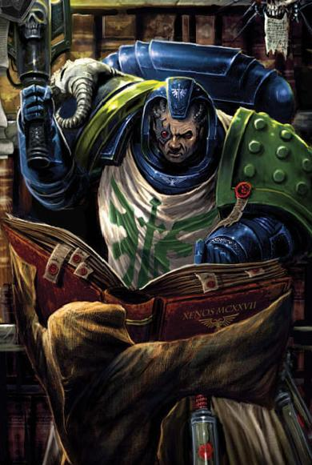
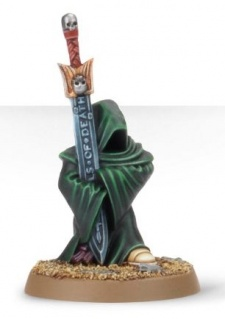

# 0328 黑暗守望者 Watchers in the Dark

精校状态：中文行文已逐段精校，部分术语仍为暂定

分类：通用概念 / 帝国 Imperium / 中央政务部 Adeptus Terra / 阿斯塔特修会 Adeptus Astartes

原文来源：https://www.bilibili.com/opus/1218465901019398166

原作者：帝国神选罐头

原文时间：2026年06月27日 12:30

[返回分类目录](目录.md) · [全书目录](../../目录.md)

<!-- A0328-B0001 -->
**英文原文**

Watchers in the Dark are a diminutive robed race of creatures which inhabit the Rock, the mobile fortress-monastery of the Dark Angels Space Marine Chapter.

<!-- /A0328-B0001 -->

<!-- A0328-B0002 -->

原译文

黑暗守望者是一个穿着长袍的小型生物种族，居住在巨石上，巨石是黑暗天使星际战士战团的移动堡垒修道院。

**校订译文**

黑暗守望者是一种身形矮小、身披长袍的生物，栖居在黑暗天使战团的机动要塞修道院——巨石之中。

<!-- /A0328-B0002 -->

<!-- A0328-B0003 -->
## Overview 概述

<!-- /A0328-B0003 -->

<!-- A0328-B0004 -->
**英文原文**

The Watchers watched over the comatose body of the Dark Angel Primarch Lion El'Jonson within a secret chamber at the core of the Rock. They are semi-unique as they possess a near exclusive ability to resist the warp entities, a trait which is shared with the rare and mysterious Pariahs who completely nullify the warp around them. These silent creatures have been known to carry Dark Angels weapons to battle, and seem to be immune to all acts of violence. Dark Angels accompanied by them are destined to greatness, but they will never give direct aid in battle.

<!-- /A0328-B0004 -->

<!-- A0328-B0005 -->

原译文

守望者们在巨石的核心的一个秘密房间里看护黑暗天使原体莱昂·艾尔庄森昏迷的身体。它们是半独特的，因为它们具有抵抗亚空间实体的近乎排他性的能力，这是罕见而神秘的被遗弃者所共有的特征，他们完全消除了周围的亚空间。众所周知，这些沉默的生物会携带黑暗天使武器作战，似乎对所有暴力行为都免疫。伴随着他们的黑暗天使注定会伟大，但他们永远不会在战斗中直接提供帮助。

**校订译文**

黑暗守望者曾在巨石核心的秘密房间里，照看陷入沉睡的黑暗天使原体莱昂·艾尔’庄森。他们抵御亚空间实体的能力极为罕见，几乎只为其独有；少数拥有类似特性的存在，是神秘的“贱民”，后者能够彻底消除周围的亚空间影响。这些沉默的生物有时会替黑暗天使携带武器来到战场，似乎不受任何暴力伤害。得到他们陪伴的黑暗天使往往注定成就非凡，但守望者从不直接出手助战。

**校注：** Pariahs依核心表使用贱民，指具有亚空间阻断特性者，非普通被遗弃者；“完全消除周围亚空间”按效果译为消除亚空间影响，未补生理机制。

<!-- /A0328-B0005 -->

<!-- A0328-B0006 图片 -->

<!-- A0328-B0007 -->

原译文

Watcher in the Dark holding a book for a Dark Angel to read 黑暗守望者拿着一本书，供黑暗天使阅读

**校订译文**

Watcher in the Dark holding a book for a Dark Angel to read 黑暗守望者拿着一本书，供黑暗天使阅读

<!-- /A0328-B0007 -->

<!-- A0328-B0008 -->
**英文原文**

Despite their usual silence and small stature, Watchers are intelligent creatures who psychically communicate with one another. They have been seeking to guide the Dark Angels against Chaos since before the Horus Heresy, and are acquainted with the likes of Eldrad Ulthran. The Watchers seemed to welcome the coming Destruction of Caliban, viewing it as their last hope in their ambitions against Chaos.

<!-- /A0328-B0008 -->

<!-- A0328-B0009 -->

原译文

尽管守望者通常沉默寡言，身材矮小，但他们是聪明的生物，在心灵上相互交流。自荷鲁斯叛乱之前，他们就一直在寻求引导黑暗天使对抗混沌，并且熟悉埃尔德拉德·乌斯兰这样的人。守望者似乎对即将到来的卡利班的毁灭表示欢迎，认为这是他们对抗混沌野心的最后希望。

**校订译文**

守望者虽然矮小且通常保持沉默，却是具有智慧的生物，彼此通过灵能交流。早在荷鲁斯之乱前，他们便试图引导黑暗天使对抗混沌，也认识艾尔德拉德·乌瑟兰等人物。他们似乎欢迎卡利班即将毁灭的命运，视其为实现自身反混沌目标的最后希望。

**校注：** Eldrad Ulthran 依GW09/GW10第6页官方人名统一“艾尔德拉德·乌瑟兰”；原埃尔德拉德·乌斯兰留于对照。

<!-- /A0328-B0009 -->

<!-- A0328-B0010 -->
## History 历史

<!-- /A0328-B0010 -->

<!-- A0328-B0011 -->
**英文原文**

Native creatures to Caliban according to Zahariel, the Watchers in the Dark were thwarting 'the most ancient evil', considering the warp-tainted Great Beasts of Caliban just as a symptom of it, and were present on the planet long before the coming of the Emperor. According to the Ouroboros, at some point the Watchers became its "jailers". During the power struggle among The Fallen on Caliban as the Horus Heresy unfolded, the Watchers sided with the Lord Cypher against Astelan and Zahariel.

<!-- /A0328-B0011 -->

<!-- A0328-B0012 -->

原译文

根据扎哈瑞尔的说法，卡利班的本土生物，黑暗守望者正在阻止“最古老的邪恶”，认为卡利班被亚空间扭曲的巨兽只是它的征召，并且早在帝皇到来之前就存在于这个行星上。根据衔尾蛇的说法，在某个时候，守望者成为了它的“狱卒”。在荷鲁斯叛乱展开的卡利班上的堕天使之间的权力斗争中，守望者站在塞弗领主一边，对抗阿斯特兰和扎哈瑞尔。

**校订译文**

据扎哈瑞尔所言，黑暗守望者是卡利班的原生生物，早在帝皇到来前就已存在。他们一直阻挠“最古老的邪恶”，认为那些被亚空间扭曲的卡利班巨兽只是邪恶显露出的征兆。衔尾蛇则声称，守望者后来成了它的“狱卒”。荷鲁斯之乱期间，卡利班上的堕天使争夺权力时，守望者站在塞弗领主一方，对抗阿斯特兰与扎哈瑞尔。

**校注：** symptom指征兆，原稿“征召”为错字。

<!-- /A0328-B0012 -->

<!-- A0328-B0013 -->
**英文原文**

Following the Destruction of Caliban some of the Watchers survived and now inhabit a portion of their former homeworld, The Rock. They continue to aid the Dark Angels chapter in their own mysterious ways.

<!-- /A0328-B0013 -->

<!-- A0328-B0014 -->

原译文

卡利班的毁灭后，一些守望者幸存下来，现在居住在他们以前的家园世界巨石的一部分。他们继续以自己神秘的方式帮助黑暗天使战团。

**校订译文**

卡利班毁灭后，一些守望者幸存，栖居在母星残存的一部分——巨石之中。他们继续以神秘的方式帮助黑暗天使。

**校注：** 巨石本身就是卡利班残片，原译误成居住在家园世界“巨石”的一部分。

<!-- /A0328-B0014 -->

<!-- A0328-B0015 -->
**英文原文**

Upon the awakening of Lion El'Jonson in Mirror-Caliban, it was the Watchers who attempted to guide him back into the Imperium.

<!-- /A0328-B0015 -->

<!-- A0328-B0016 -->

原译文

在镜像卡利班中，莱昂·艾尔庄森醒来后，守望者试图引导他回到帝国。

**校订译文**

莱昂·艾尔’庄森在镜像卡利班苏醒后，正是守望者试图引导他重返帝国。

<!-- /A0328-B0016 -->

<!-- A0328-B0017 图片 -->

<!-- A0328-B0018 -->

原译文

Watchers in the Dark 黑暗守望者

**校订译文**

Watchers in the Dark 黑暗守望者

<!-- /A0328-B0018 -->

<!-- A0328-B0019 -->
## Trivia 琐事

<!-- /A0328-B0019 -->

<!-- A0328-B0020 -->
**英文原文**

The Watchers in the Dark are probably named after the Watchers, a type of biblical angel that is mentioned in various religious texts.

<!-- /A0328-B0020 -->

<!-- A0328-B0021 -->

原译文

黑暗守望者可能是以守望者命名的，守望者是一种在各种宗教文本中提到的圣经天使。

**校订译文**

黑暗守望者可能得名于宗教文本中的“守望天使”（Watchers），即出现在多种相关经籍中的一类天使。

<!-- /A0328-B0021 -->

本篇核心术语与暂定项

以下列出本篇出现的英文原形及核心术语表用词。同形词可能指不同对象，具体词义以本篇正文和校注为准；单复数、别名和仅见于图注的名称可能尚未列入。完整候选见[术语表](../../术语表/双语术语候选.csv)。

| 英文 | 采用中文 | 状态 |
| --- | --- | --- |
| Dark Angels | 黑暗天使 | 官方已核对 |
| Horus Heresy | 荷鲁斯之乱 | 官方已核对 |
| Warp | 亚空间 | 官方已核对 |
| Imperium | 帝国 | 暂定·简称 |
| Emperor | 帝皇 | 官方已核对 |
| Primarch | 原体 | 官方已核对 |
| Horus | 荷鲁斯 | 暂定·官方待核 |
| Lion El'Jonson | 莱昂·艾尔’庄森 | 官方已核对 |
| Caliban | 卡利班 | 暂定·官方待核 |
| Ancient | 旗手 | 官方已核对 |
| Astelan | 阿斯特兰 | 暂定·官方待核 |
| Space Marine | 星际战士 | 暂定·官方待核 |
| Chapter | 战团 | 暂定·官方待核 |
| Fortress-monastery | 要塞修道院 | 暂定·官方待核 |
| Cypher | 塞弗 | 官方已核对 |
| Ouroboros | 乌洛波洛斯 | 暂定·官方待核 |
| Eldrad Ulthran | 艾尔德拉德·乌瑟兰 | 官方已核对 |
| The Lord Cypher | 塞弗领主 | 暂定·官方待核 |
| Mirror-Caliban | 镜像卡利班 | 暂定·官方待核 |
| Zahariel | 扎哈瑞尔 | 暂定·官方待核 |
| The Dark | 《黑暗》 | 暂定·官方待核 |

