# 0329 死翼 Deathwing

精校状态：中文行文已逐段精校，部分术语仍为暂定

分类：通用概念 / 帝国 Imperium / 中央政务部 Adeptus Terra / 阿斯塔特修会 Adeptus Astartes

原文来源：https://www.bilibili.com/opus/1212613578610180177

原作者：帝国神选罐头

原文时间：2026年06月11日 18:00

[返回分类目录](目录.md) · [全书目录](../../目录.md)

<!-- A0329-B0001 -->
**英文原文**

The Deathwing is the First Company of the Dark Angels Space Marines Chapter. The Deathwing (and the chapter's second company, the Ravenwing) are not part of the standard Codex Astartes structure system, although the remaining companies of the chapter do adhere to the Codex. The Dark Angels' successor Chapters (collectively known as the Unforgiven) also have similar formations, although they are not referred to by the same title. The Deathwing is an honoured position within all Unforgiven Chapters, and only upon ascension to the Deathwing can one eventually be admitted to the Inner Circle. The Current Master of the Deathwing is Belial.

<!-- /A0329-B0001 -->

<!-- A0329-B0002 -->

原译文

死翼是黑暗天使星际战士战团的第一连队。死翼（以及战团的第二连队鸦翼）不属于标准的阿斯塔特圣典结构体系，尽管战团的其余连队确实遵守圣典。黑暗天使的子战团（统称为不可饶恕者）也有类似的结构，尽管它们的头衔不同。死翼是所有不可饶恕者战团中的一个荣誉职位，只有晋升到死翼，一个人才能最终被接纳进入内环。死翼的现任导师是贝利亚。

**校订译文**

死翼是黑暗天使战团的第一连。它与第二连鸦翼一样，采用偏离《阿斯塔特圣典》标准的编制；战团其余连队则遵循《圣典》。黑暗天使的后裔战团与母团统称戴罪者，也设有类似部队，但名称并不相同。加入这类精锐部队，在所有戴罪者战团中都是殊荣；晋升死翼，也是日后获准进入内环的必经之路。现任死翼导师为贝利亚。

<!-- /A0329-B0002 -->

<!-- A0329-B0003 图片 -->
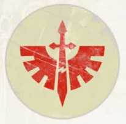

<!-- A0329-B0004 -->

原译文

Deathwing Symbol 死翼标志

**校订译文**

Deathwing Symbol 死翼标志

<!-- /A0329-B0004 -->

<!-- A0329-B0005 -->
**英文原文**

Affiliation：1st Company of the Dark Angels

<!-- /A0329-B0005 -->

<!-- A0329-B0006 -->

原译文

隶属：黑暗天使第一连队

**校订译文**

隶属：黑暗天使第一连队

<!-- /A0329-B0006 -->

<!-- A0329-B0007 -->
**英文原文**

Grand Master:Belial

<!-- /A0329-B0007 -->

<!-- A0329-B0008 -->

原译文

大导师：贝利亚

**校订译文**

大导师：贝利亚

<!-- /A0329-B0008 -->

<!-- A0329-B0009 -->
**英文原文**

Specialty:Terminator veterans and hunting the Fallen, Special Operations, Lifeguard duties.

<!-- /A0329-B0009 -->

<!-- A0329-B0010 -->

原译文

专长：终结者老兵和狩猎堕天使、特种作战、救生员职责。

**校订译文**

专长：终结者老兵作战、追捕堕天使、特种行动与贴身护卫。

<!-- /A0329-B0010 -->

<!-- A0329-B0011 -->
**英文原文**

Colours:Bone, Red & Green

<!-- /A0329-B0011 -->

<!-- A0329-B0012 -->

原译文

配色：骨色，红色&绿色

**校订译文**

配色：骨色，红色&绿色

<!-- /A0329-B0012 -->

<!-- A0329-B0013 图片 -->
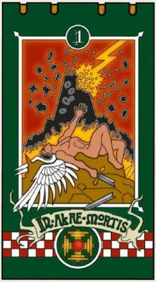

<!-- A0329-B0014 -->

原译文

Deathwing Company Banner 死翼连队旗帜

**校订译文**

Deathwing Company Banner 死翼连队旗帜

<!-- /A0329-B0014 -->

<!-- A0329-B0015 -->
## Overview 概述

<!-- /A0329-B0015 -->

<!-- A0329-B0016 -->
### Origins 起源

<!-- /A0329-B0016 -->

<!-- A0329-B0017 -->
**英文原文**

First formed around 830.M30, in the years of the early Great Crusade, the Deathwing was coalesced out of the shattered remains of the Host of Crowns, a formation once famed for its line breaker squadrons and marksmen. Those of the Hosts’ inner circle who survived to join the Deathwing swore mighty oaths that no member of the Wing would ever leave the field of battle in the hands of the enemy, accepting death over dishonour or retreat. The Deathwing excelled in special operations alongside other units of the Legion, especially as a counterpart to the more numerous Stormwing, with a multitude of sub-disciplines within its ranks. Most renowned among its specialists were those dedicated to the role of line breakers, elite veteran infantry that served to shatter the enemy's formations and create openings for other units or Wings, and the lifeguard cadre deployed to protect officers during battle.

<!-- /A0329-B0017 -->

<!-- A0329-B0018 -->

原译文

死翼最初形成于830.M30左右，在大远征早期的几年里，死翼是从王冠天军的分散残余中合并而成的，王冠天军曾以其破坏者中队和射手而闻名。那些幸存下来加入死翼的天军内环发誓，任何一个死翼成员都不会离开在敌人之手的战场，接受死亡的耻辱或撤退。死翼与军团的其他单位一起特种作战时十分擅长，特别是作为数量更多的风暴翼的对应，其队伍中有许多子系。其专家中最著名的是那些致力于突破防线的人，精锐老练步兵，他们负责粉碎敌人的编队，为其他翼的单位创造机会，以及在战斗中部署来保护军官的救生员干部。

**校订译文**

死翼约于830.M30、大远征初期组建，由遭受重创的王冠天军残部整合而成。王冠天军原本以破阵部队与神射手著称。幸存并加入死翼的原天军内环成员立下重誓：绝不将战场留给敌人，宁死也不受辱或撤退。死翼擅长与军团其他部队协同执行特种任务，尤其适合配合人数更多的风暴翼，内部又分为多种专门领域。其中最著名的是负责破阵的精锐老兵步兵——他们击碎敌方阵形，为其他部队或翼创造突破口——以及负责在战斗中保护军官的贴身卫队。

**校注：** accepting death over dishonour or retreat 指宁死不辱、宁死不退，原译“接受死亡的耻辱或撤退”颠倒关系；Lifeguard均指贴身护卫，非救生员。

<!-- /A0329-B0018 -->

<!-- A0329-B0019 图片 -->
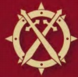

<!-- A0329-B0020 -->

原译文

Heresy-era Deathwing Symbol 叛乱时期死翼标志

**校订译文**

Heresy-era Deathwing Symbol 叛乱时期死翼标志

<!-- /A0329-B0020 -->

<!-- A0329-B0021 -->
**英文原文**

These lifeguard cadre were especially prominent, with few high ranking officers in the Legion lacking a small force of Deathwing veterans sworn to give their lives to ensure their safety. Indeed, it was a detachment of the Deathwing that provided a garrison force for the inner citadels on both Caliban and Gramarye, charged with the safety of the Primarch himself. Given the stringent requirements for entry into even the outer circles of this Wing, its membership remained small but garnered much respect within the Legion, often acting as force commanders in situations where the authority of other factions within the Legion was unclear.

<!-- /A0329-B0021 -->

<!-- A0329-B0022 -->

原译文

这些救生员干部尤其突出，军团中很少有高级军官缺乏一小部分宣誓牺牲生命以确保安全的死翼老兵。事实上，正是死翼的一支分遣队为卡利班和格拉马里的内堡提供了一支驻军部队，负责原体本人的安全。鉴于进入该翼外环的严格要求，其成员人数仍然很少，但在军团内部赢得了极大的尊重，在军团内部其他派系的权力不明确的情况下，他们经常担任部队指挥官。

**校订译文**

这些贴身卫队地位尤其突出。军团中的高级军官身边，几乎都有一小队死翼老兵，誓以性命保卫其安全。卡利班与格拉马里的内堡也由死翼分遣队驻守，负责原体本人的安危。即使进入死翼的外围层级，要求也极为严苛，因此人数始终不多，却在军团中备受尊重。当其他派系之间的指挥权限不明确时，死翼成员常出面统领部队。

<!-- /A0329-B0022 -->

<!-- A0329-B0023 -->
**英文原文**

During the Horus Heresy, casualties would take a toll on the Dark Angels' officer corps, and the veterans of the Deathwing came to assume a greater responsibility over their brethren. Slowly taking a dominant position within the Legion and on the Council of Masters.

<!-- /A0329-B0023 -->

<!-- A0329-B0024 -->

原译文

在荷鲁斯叛乱期间，伤亡将对黑暗天使的军官团造成损失，死翼的老兵开始对他们的兄弟们承担更大的责任。在军团和导师议会中慢慢占据主导地位。

**校订译文**

荷鲁斯之乱期间，黑暗天使军官接连伤亡，死翼老兵逐渐承担起指挥同袍的更多责任，并在军团及导师议会中取得主导地位。

<!-- /A0329-B0024 -->

<!-- A0329-B0025 -->
**英文原文**

The Deathwing is one of the two current incarnations of the original Hexagrammaton formations of the Dark Angels Legion that continues into the 41st Millennium.

<!-- /A0329-B0025 -->

<!-- A0329-B0026 -->

原译文

死翼是延续到第41个千年的黑暗天使军团原初六翼编队的两个当前化身之一。

**校订译文**

黑暗天使最初的六翼体系中，只有两支延续为第41千年的现役编制，死翼便是其中之一。

<!-- /A0329-B0026 -->

<!-- A0329-B0027 -->
### Chapter Secrets 战团秘密

<!-- /A0329-B0027 -->

<!-- A0329-B0028 -->
**英文原文**

The Deathwing is not solely a tactical formation - promotion to the Deathwing also means that an individual is bestowed many of the darkest secrets of the Chapter. The most closely guarded of these secrets is that of the betrayal of Luther and the Fallen, and the subsequent fate of their Primarch, Lion El'Jonson.

<!-- /A0329-B0028 -->

<!-- A0329-B0029 -->

原译文

死翼不仅仅是一种战术编队 — 晋升为死翼也意味着一个人被赋予了战团中许多最黑暗的秘密。这些秘密中最严密的是卢瑟和堕天使的背叛，以及他们的原体，莱昂·艾尔庄森的后续命运。

**校订译文**

死翼不仅是战术部队。获准加入死翼，也意味着得以知晓战团许多最隐秘的往事，其中守护最严的秘密，便是卢瑟与堕天使的背叛，以及原体莱昂·艾尔’庄森此后的命运。

<!-- /A0329-B0029 -->

<!-- A0329-B0030 -->
### Attitude 态度

<!-- /A0329-B0030 -->

<!-- A0329-B0031 -->
**英文原文**

More so even than the regular Dark Angels, the Deathwing are notoriously stubborn and resistant, refusing to buckle under extreme pressure from enemy advances, even when it would be more advantageous to retreat.

<!-- /A0329-B0031 -->

<!-- A0329-B0032 -->

原译文

甚至比普通的黑暗天使更为如此，死翼是出了名的顽固和有抵抗力，拒绝在敌人前进的极端压力下屈服，即使撤退更有利。

**校订译文**

死翼比普通黑暗天使更加顽强固执。面对敌军推进的重压，他们依旧不肯退让，即便撤退本可能更为有利。

<!-- /A0329-B0032 -->

<!-- A0329-B0033 图片 -->
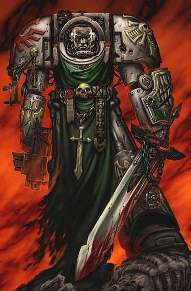

<!-- A0329-B0034 -->

原译文

Deathwing Terminator 死翼终结者

**校订译文**

Deathwing Terminator 死翼终结者

<!-- /A0329-B0034 -->

<!-- A0329-B0035 -->
### Disposition 部署

<!-- /A0329-B0035 -->

<!-- A0329-B0036 -->
**英文原文**

The Deathwing itself contains multiple specialized sub-formations, such as Deathwing Command Squads and the dreaded Deathwing Knights, who comprise the elite of this already veteran Company. As of the Era Indomitus, it has also come to include Primaris Bladeguard Veterans. Deathwing detachments are known as Conclaves.

<!-- /A0329-B0036 -->

<!-- A0329-B0037 -->

原译文

死翼本身包含多个专门的子编队，如死翼指挥组和可怕的死翼骑士，他们组成了这个已经经验丰富的连队的精英。在不屈时代，它还包括原铸剑卫老兵，死翼分遣队被称为秘会。

**校订译文**

死翼包含多种专门编组，例如死翼指挥小队与令人生畏的死翼骑士；后者是这个老兵连中的精英。不屈时代以后，原铸剑卫老兵也加入其中。死翼分遣队称为“秘会”。

<!-- /A0329-B0037 -->

<!-- A0329-B0038 -->
**英文原文**

It rumoured that the Deathwing are oversized in violation of the Codex Astartes

<!-- /A0329-B0038 -->

<!-- A0329-B0039 -->

原译文

据传，死翼的规模过大，违反了阿斯塔特圣典

**校订译文**

据传，死翼的规模过大，违反了阿斯塔特圣典

<!-- /A0329-B0039 -->

<!-- A0329-B0040 -->
### Promotion 晋升

<!-- /A0329-B0040 -->

<!-- A0329-B0041 -->
**英文原文**

When a battle-brother is being considered for a place in the Deathwing, it is standard procedure for them to be judged by the Grand Master of the Librarius, who determines if they are worthy of ascension.

<!-- /A0329-B0041 -->

<!-- A0329-B0042 -->

原译文

当一个战斗兄弟被考虑加入死翼时，由智库馆的大导师对他们进行评判是标准程序，他决定他们是否值得晋升。

**校订译文**

当一名战斗兄弟获提名加入死翼时，通常须由智库大导师评估，判断其是否具备晋升资格。

<!-- /A0329-B0042 -->

<!-- A0329-B0043 -->
### Equipment 装备

<!-- /A0329-B0043 -->

<!-- A0329-B0044 -->
**英文原文**

While it has been stated that the entire Deathwing company fights exclusively in Terminator armour, Dark Angels wearing the bone colour of the 1st Company have also been seen in non-Terminator armour. During the Great Crusade and Horus Heresy, they were known to wear modified versions of MKIV war-plate, including their own design of Artificer wrought helms.

<!-- /A0329-B0044 -->

<!-- A0329-B0045 -->

原译文

虽然有人说整个死翼连队只穿着终结者盔甲作战，但穿着第一连队骨色的黑暗天使也穿非终结者盔甲。在大远征和荷鲁斯叛乱期间，他们穿着改良的MKIV战甲，包括他们自己设计的精工精制头盔。

**校订译文**

有资料称整个死翼连只穿终结者护甲作战，但也曾出现采用第一连骨白涂装、却身穿其他护甲的黑暗天使。大远征及荷鲁斯之乱时期，死翼曾使用改装的 Mark IV 型动力甲，配有专门设计的精工头盔。

<!-- /A0329-B0045 -->

<!-- A0329-B0046 -->
## Heraldry 纹章

<!-- /A0329-B0046 -->

<!-- A0329-B0047 -->
## Heresy Era 叛乱时代

<!-- /A0329-B0047 -->

<!-- A0329-B0048 -->
**英文原文**

During the Horus Heresy, and prior to the events on Thranx, the Deathwing coloured their armour in the black of the legion. Having some of their armour plating painted bone white signified a warrior of the Deathwing that has taken a mortal wound meant for another and survived. Votive ceramite plugs were placed to mark the breach’s taken to a Knight’s armour as a badge of honour with few equals among the pragmatic Dark Angels. The members of the Deathwing bore a number of elements of the unique heraldry used by the Dark Angels, and were often considered indecipherable by their brethren in the other Legions. Symbols of crossed keys were worn on the left greave and the Deathwing’s initiation icons worn on right pauldron, both of which marked the Dark Angel as a warrior who is master in the arts of the Deathwing, as a champion and linebreaker, on the field of battle should he be needed.

<!-- /A0329-B0048 -->

<!-- A0329-B0049 -->

原译文

在荷鲁斯叛乱期间，在特兰克斯事件之前，死翼将他们的盔甲涂成了军团的黑色。他们的一些盔甲被漆成骨白色，象征着死翼的战士已经承受了致命的伤害，并幸存下来。誓言陶钢螺钉被放置在骑士的盔甲上，作为荣誉徽章，在务实的黑暗天使中很少有人能与之匹敌。死翼的成员拥有许多黑暗天使使用的独特纹章元素，他们在其他军团中的兄弟们经常认为他们无法解读。十字键的符号佩戴在左胫甲上，死翼的入会图标佩戴在右肩甲上。这两个标志都表明，这名黑暗天使是一名掌握死翼技艺的战士，如果需要的话，他可以在战场上成为冠军和断线者。

**校订译文**

荷鲁斯之乱期间、特兰克斯事件之前，死翼与军团其他成员一样采用黑色护甲。若某名战士替他人挡下致命一击并幸存，便会将部分甲片涂成骨白色。他们还会以供奉用的陶钢塞片标记护甲曾被击穿之处；在务实的黑暗天使中，这是一种极为崇高的荣誉。死翼采用许多军团独有的纹章元素，其他军团的兄弟往往难以解读。左胫甲上的交叉钥匙，以及右肩甲上的死翼入门徽记，都表明佩戴者精通死翼战技，在需要时可于战场充当冠军与破阵者。

**校注：** 补回原译遗漏的“替他人承受致命伤”；crossed keys是交叉钥匙，不是十字键。

<!-- /A0329-B0049 -->

<!-- A0329-B0050 图片 -->
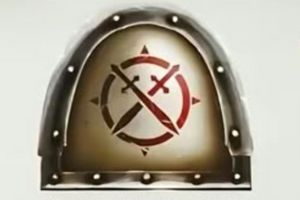

<!-- A0329-B0051 -->

原译文

Heresy-era Deathwing armourial. The field of bone-white marked a warrior that had survived a mortal wound 叛乱时代的死翼盔甲。这片骨白色的区域标志着一位在致命伤中幸存下来的战士

**校订译文**

Heresy-era Deathwing armourial. The field of bone-white marked a warrior that had survived a mortal wound 叛乱时代的死翼盔甲。这片骨白色的区域标志着一位在致命伤中幸存下来的战士

<!-- /A0329-B0051 -->

<!-- A0329-B0052 -->
## Post-Heresy 叛乱后

<!-- /A0329-B0052 -->

<!-- A0329-B0053 -->
**英文原文**

The unique all bone white colour scheme was later adopted as a mark of remembrance for a lone squad of Dark Angel Terminators who freed a recruitment world from a Genestealer infestation and slew a Broodlord that had terrorized the Galaxy. As they did not expect to survive such a confrontation, they painted their armour white in preparation for their deaths. In the end the Deathwing triumphed and a vital part of the Dark Angels' heritage was saved.

<!-- /A0329-B0053 -->

<!-- A0329-B0054 -->

原译文

独特的全骨白色配色方案后来被采用，作为对一支单独的黑暗天使终结者小队的纪念，他们将一个招募世界从基因窃取者的侵扰中解放出来，并杀死了一个威胁银河的鲜血领主。由于他们没想到能在这样的对抗中幸存下来，他们把盔甲漆成白色，为死亡做准备。最后，死翼获胜，黑暗天使遗产的重要部分得以保存。

**校订译文**

后来，死翼采用全身骨白色涂装，纪念一支孤军奋战的黑暗天使终结者小队。他们从基因窃取者手中解放了一颗征兵世界，还杀死一头曾令银河陷入恐惧的族群领主。这些战士原以为自己必死无疑，因此先将护甲涂白，做好赴死准备。最终，死翼赢得胜利，保住了黑暗天使传承中至关重要的一部分。

**校注：** Broodlord=族群领主，GW-09中文37页／GW-10英文36页。原译鲜血领主与Brood含义不符。

<!-- /A0329-B0054 -->

<!-- A0329-B0055 图片 -->
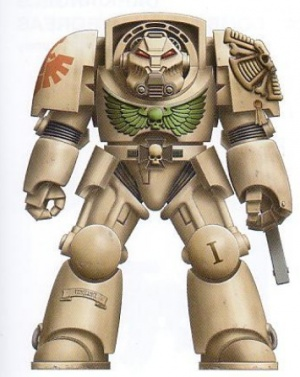

<!-- A0329-B0056 -->

原译文

Deathwing Terminator 死翼终结者

**校订译文**

Deathwing Terminator 死翼终结者

<!-- /A0329-B0056 -->

<!-- A0329-B0057 -->
**英文原文**

The company's armour is a bone white colour, rather than the dark green of the majority of the Chapter, or the black of the original Legion. Originally their armour were black but after a single squad of Terminators freed one of the Chapter's recruitment worlds - and the squad's original homeworld - from a Genestealer infestation it was forever decreed that the company's armour would be white to honour their valour. This alteration of the colour scheme applies only to the Dark Angels, not to their successor Chapters.

<!-- /A0329-B0057 -->

<!-- A0329-B0058 -->

原译文

该连队的盔甲是骨白色的，而不是战团大部分的深绿色或原初军团的黑色。起初，他们的盔甲是黑色的，但在一个终结者小队从基因窃取者的侵扰中解放了战团的一个招募世界 — 以及该小队的起源家园世界 — 之后，该连队的盔甲将永远是白色的，以纪念他们的英勇。这种配色方案的改变只适用于黑暗天使，不适用于他们的子战团。

**校订译文**

死翼的护甲为骨白色，与战团大多数部队的深绿色，以及原军团的黑色皆不相同。最初，死翼也穿黑甲；后来，一支终结者小队从基因窃取者手中解放了战团的一颗征兵世界——同时也是他们自己的故乡。为表彰这一壮举，战团规定死翼此后永久采用白色护甲。这次配色改变只适用于黑暗天使本团，并不适用于各子战团。

<!-- /A0329-B0058 -->

<!-- A0329-B0059 -->
**英文原文**

According to another version, the armour was painted white when the Dark Angels needed to reconquer a lost recruiting world, and the colour change was due to the warriors of the 1st Company being distinguished from the Heretic Astartes.

<!-- /A0329-B0059 -->

<!-- A0329-B0060 -->

原译文

根据另一个版本，当黑暗天使需要重新征服一个失落的招募世界时，盔甲被漆成了白色，颜色的改变是由于第一连队的战士与异端阿斯塔特需要区分。

**校订译文**

另一个版本则称，黑暗天使准备夺回某颗失陷的征兵世界时，将第一连护甲涂白，是为了让他们的战士与异端阿斯塔特有所区别。

<!-- /A0329-B0060 -->

<!-- A0329-B0061 -->
### Insignia 徽章

<!-- /A0329-B0061 -->

<!-- A0329-B0062 -->
**英文原文**

The Deathwing's insignia is a variation of winged sword worn by the rest of the Chapter - the blade of the sword is depicted as being broken in Deathwing iconography.

<!-- /A0329-B0062 -->

<!-- A0329-B0063 -->

原译文

死翼的徽章是战团其余部分所佩戴的带翼剑的变体 — 在死翼图像中，剑刃被描绘为断裂。

**校订译文**

死翼的徽章是战团其余部分所佩戴的带翼剑的变体 — 在死翼图像中，剑刃被描绘为断裂。

<!-- /A0329-B0063 -->

<!-- A0329-B0064 -->
## Forces 部队

<!-- /A0329-B0064 -->

<!-- A0329-B0065 -->
## Pre-Heresy 叛乱前

<!-- /A0329-B0065 -->

<!-- A0329-B0066 图片 -->
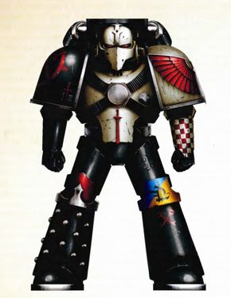

<!-- A0329-B0067 -->

原译文

Heresy-era Deathwing Seneschal 叛乱时期死翼总管

**校订译文**

Heresy-era Deathwing Seneschal 叛乱时期死翼总管

<!-- /A0329-B0067 -->

<!-- A0329-B0068 -->

原译文

Deathwing Praetor 死翼执政官

**校订译文**

Deathwing Praetor 死翼执政官

<!-- /A0329-B0068 -->

<!-- A0329-B0069 -->

原译文

Deathwing Companion 死翼冠军

**校订译文**

Deathwing Companion 死翼伴卫

**校注：** Companion为伴卫，区别同篇Champion冠军，也区别内环近卫Inner Circle Companions。

<!-- /A0329-B0069 -->

<!-- A0329-B0070 图片 -->
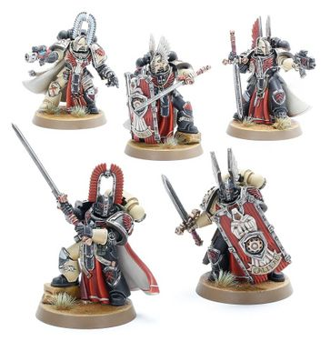

<!-- A0329-B0071 -->

原译文

Heresy-era Deathwing Companions 叛乱时代死翼冠军

**校订译文**

Heresy-era Deathwing Companions 荷鲁斯之乱时期的死翼伴卫

<!-- /A0329-B0071 -->

<!-- A0329-B0072 -->

原译文

Secta Mortis 死亡教派

**校订译文**

Secta Mortis 死亡教派

<!-- /A0329-B0072 -->

<!-- A0329-B0073 -->

原译文

Deathwing Terminators 死翼终结者

**校订译文**

Deathwing Terminators 死翼终结者

<!-- /A0329-B0073 -->

<!-- A0329-B0074 图片 -->
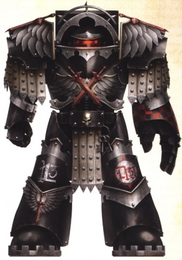

<!-- A0329-B0075 -->

原译文

Heresy-era Deathwing Terminator 叛乱时代死翼终结者

**校订译文**

Heresy-era Deathwing Terminator 叛乱时代死翼终结者

<!-- /A0329-B0075 -->

<!-- A0329-B0076 -->

原译文

Deathwing Rhinos 死翼犀牛

**校订译文**

Deathwing Rhinos 死翼犀牛战车

<!-- /A0329-B0076 -->

<!-- A0329-B0077 -->

原译文

Land Raider Proteus 兰德掠袭者普罗透斯

**校订译文**

Land Raider Proteus 普罗透斯型兰德掠袭者战车

<!-- /A0329-B0077 -->

<!-- A0329-B0078 -->

原译文

Calibanite Grav-Raider 卡利班反重力掠袭者

**校订译文**

Calibanite Grav-Raider 卡利班反重力掠袭者

<!-- /A0329-B0078 -->

<!-- A0329-B0079 -->
## Post-Heresy 叛乱后

<!-- /A0329-B0079 -->

<!-- A0329-B0080 -->

原译文

Deathwing Strikemaster 死翼打击大师

**校订译文**

Deathwing Strikemaster 死翼打击大师

<!-- /A0329-B0080 -->

<!-- A0329-B0081 -->

原译文

Deathwing Command Squad 死翼指挥组

**校订译文**

Deathwing Command Squad 死翼指挥小队

<!-- /A0329-B0081 -->

<!-- A0329-B0082 -->

原译文

Deathwing Champion 死翼冠军

**校订译文**

Deathwing Champion 死翼冠军

<!-- /A0329-B0082 -->

<!-- A0329-B0083 -->

原译文

Deathwing Apothecary 死翼药剂师

**校订译文**

Deathwing Apothecary 死翼药剂师

<!-- /A0329-B0083 -->

<!-- A0329-B0084 -->

原译文

Deathwing Knights 死翼骑士

**校订译文**

Deathwing Knights 死翼骑士

<!-- /A0329-B0084 -->

<!-- A0329-B0085 图片 -->
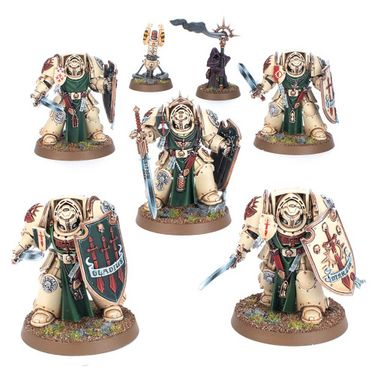

<!-- A0329-B0086 -->

原译文

Deathwing Knights 死翼骑士

**校订译文**

Deathwing Knights 死翼骑士

<!-- /A0329-B0086 -->

<!-- A0329-B0087 -->

原译文

Deathwing Terminators 死翼终结者

**校订译文**

Deathwing Terminators 死翼终结者

<!-- /A0329-B0087 -->

<!-- A0329-B0088 图片 -->
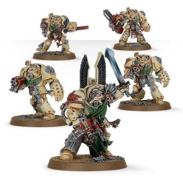

<!-- A0329-B0089 -->

原译文

Deathwing Terminators 死翼终结者

**校订译文**

Deathwing Terminators 死翼终结者

<!-- /A0329-B0089 -->

<!-- A0329-B0090 -->

原译文

Deathwing Bladeguard Veterans 死翼剑卫老兵

**校订译文**

Deathwing Bladeguard Veterans 死翼剑卫老兵

<!-- /A0329-B0090 -->

<!-- A0329-B0091 -->

原译文

Deathwing Land Raider 死翼兰德掠袭者

**校订译文**

Deathwing Land Raider 死翼兰德掠袭者战车

<!-- /A0329-B0091 -->

<!-- A0329-B0092 -->
## Notable Elements 著名成员

<!-- /A0329-B0092 -->

<!-- A0329-B0093 -->
## Notable Heresy-Era Members 著名叛乱时期成员

<!-- /A0329-B0093 -->

<!-- A0329-B0094 -->
**英文原文**

Holguin — Deathbringer, Voted-Lieutenant and Lord of the Deathwing during the Horus Heresy

<!-- /A0329-B0094 -->

<!-- A0329-B0095 -->

原译文

霍尔金 — 死亡使者，荷鲁斯叛乱时期的受选副官和死翼领主

**校订译文**

霍尔金——死亡使者，荷鲁斯之乱时期的死翼受选副官兼领主。

<!-- /A0329-B0095 -->

<!-- A0329-B0096 -->

原译文

Idravain Mors 伊德拉万·摩尔斯

**校订译文**

Idravain Mors 伊德拉万·摩尔斯

<!-- /A0329-B0096 -->

<!-- A0329-B0097 -->
## Notable Post-Heresy Members 著名叛乱后成员

<!-- /A0329-B0097 -->

<!-- A0329-B0098 -->
### Command 指挥

<!-- /A0329-B0098 -->

<!-- A0329-B0099 -->
**英文原文**

Belial — Current Grand Master of the Deathwing

<!-- /A0329-B0099 -->

<!-- A0329-B0100 -->

原译文

贝利亚 — 现任死翼大导师

**校订译文**

贝利亚 — 现任死翼大导师

<!-- /A0329-B0100 -->

<!-- A0329-B0101 -->
**英文原文**

Gabriel — Grand Master previous to Belial

<!-- /A0329-B0101 -->

<!-- A0329-B0102 -->

原译文

加百列 — 贝利亚之前的大导师

**校订译文**

加百列 — 贝利亚之前的大导师

<!-- /A0329-B0102 -->

<!-- A0329-B0103 -->
**英文原文**

Lanval — Grand Master in 939.M41

<!-- /A0329-B0103 -->

<!-- A0329-B0104 -->

原译文

兰瓦尔 — 939.M41的大导师

**校订译文**

兰瓦尔 — 939.M41的大导师

<!-- /A0329-B0104 -->

<!-- A0329-B0105 -->
**英文原文**

Azrael — Grand Master until 939.M41, current Supreme Grand Master

<!-- /A0329-B0105 -->

<!-- A0329-B0106 -->

原译文

阿兹瑞尔 — 直到939.M41的大导师，现任至高大导师

**校订译文**

阿兹瑞尔——至939.M41一直担任死翼大导师，现任战团至高大导师。

<!-- /A0329-B0106 -->

<!-- A0329-B0107 -->
**英文原文**

Gabriel 'Broken Knife' — Successor to Ezekiel as the Grand Master, under whose time the Deathwing continued to paint their armour fully bone-white as a honour to the act of the Deathwing under Ezekiel.

<!-- /A0329-B0107 -->

<!-- A0329-B0108 -->

原译文

加百列“断刀” — 以泽凯尔的继任者，作为大导师，在他的时代，死翼继续将他们的盔甲涂成全骨白色，以纪念以泽凯尔领导下的死翼的行动。

**校订译文**

“断刀”加百列——接替以西结出任大导师。在他任内，死翼继续采用全骨白涂装，以纪念以西结率领死翼完成的壮举。

<!-- /A0329-B0108 -->

<!-- A0329-B0109 -->
**英文原文**

Ezekiel — Grand Master previous to Gabriel (Broken Knife), under whose leadership the Deathwing painted their armour fully bone-white during a expected last stand against Genestealers. Also known as 'Cloud Runner'

<!-- /A0329-B0109 -->

<!-- A0329-B0110 -->

原译文

以泽凯尔 — 加百列（断刀）之前的大导师，在他的领导下，死翼在与基因窃取者的预期最后一战中将他们的盔甲涂成了骨白色。也称为“云朵跑者”

**校订译文**

以西结——“断刀”加百列之前的死翼大导师，又称“云行者”。他率领死翼准备与基因窃取者进行一场预计无人能生还的决战时，下令将护甲全部涂成骨白色。

**校注：** 本处以西结为旧故事中的死翼大导师Cloud Runner，不能仅凭同名与现代首席智库员合并；原译以泽凯尔按姓名词根统一以西结，并保留别名区分。

<!-- /A0329-B0110 -->

<!-- A0329-B0111 -->
**英文原文**

Sachael — Grand Master in 544.M32

<!-- /A0329-B0111 -->

<!-- A0329-B0112 -->

原译文

萨凯尔 — 544.M32的大导师

**校订译文**

萨凯尔 — 544.M32的大导师

<!-- /A0329-B0112 -->

<!-- A0329-B0113 -->
**英文原文**

Bartholomew — First Grand Master of the Deathwing

<!-- /A0329-B0113 -->

<!-- A0329-B0114 -->

原译文

巴沙洛缪 - 第一任死翼大导师

**校订译文**

巴沙洛缪 - 第一任死翼大导师

<!-- /A0329-B0114 -->

<!-- A0329-B0115 -->
### Line Commanders 战线指挥官

<!-- /A0329-B0115 -->

<!-- A0329-B0116 -->
**英文原文**

Barachiel - Sergeant

<!-- /A0329-B0116 -->

<!-- A0329-B0117 -->

原译文

巴拉切 - 军士

**校订译文**

巴拉切 - 军士

<!-- /A0329-B0117 -->

<!-- A0329-B0118 -->
### Battle Brothers 战斗兄弟

<!-- /A0329-B0118 -->

<!-- A0329-B0119 -->
**英文原文**

Apharan — The first Primaris Space Marine inducted into the Deathwing

<!-- /A0329-B0119 -->

<!-- A0329-B0120 -->

原译文

阿法兰 — 第一位进入死翼的原铸星际战士

**校订译文**

阿法兰 — 第一位进入死翼的原铸星际战士

<!-- /A0329-B0120 -->

<!-- A0329-B0121 -->
### Dreadnoughts 无畏

<!-- /A0329-B0121 -->

<!-- A0329-B0122 -->
**英文原文**

Hawk Talon — Dreadnought during the time of Gabriel ('Broken Knife')

<!-- /A0329-B0122 -->

<!-- A0329-B0123 -->

原译文

鹰爪 — 加百列（断刀）时期的无畏

**校订译文**

鹰爪——“断刀”加百列时期的无畏机甲。

<!-- /A0329-B0123 -->

<!-- A0329-B0124 -->
**英文原文**

Zakiel — Redemptor Dreadnought

<!-- /A0329-B0124 -->

<!-- A0329-B0125 -->

原译文

扎克尔 — 蔑视者无畏

**校订译文**

扎克尔——救赎者无畏机甲。

**校注：** Redemptor为救赎者无畏机甲，GW-09中文33页／GW-10英文32页；原译蔑视者对应另一类型，已纠正。

<!-- /A0329-B0125 -->

本篇核心术语与暂定项

以下列出本篇出现的英文原形及核心术语表用词。同形词可能指不同对象，具体词义以本篇正文和校注为准；单复数、别名和仅见于图注的名称可能尚未列入。完整候选见[术语表](../../术语表/双语术语候选.csv)。

| 英文 | 采用中文 | 状态 |
| --- | --- | --- |
| Space Marines | 星际战士 | 官方已核对 |
| Dark Angels | 黑暗天使 | 官方已核对 |
| Terminator | 终结者 | 官方已核对 |
| Horus Heresy | 荷鲁斯之乱 | 官方已核对 |
| Librarius | 智库（机构）／智库学派（灵能学派） | 语境定译·官方待核 |
| Indomitus | 不屈学派 | 暂定·学派语境 |
| Primarch | 原体 | 官方已核对 |
| Great Crusade | 大远征 | 暂定·官方待核 |
| Horus | 荷鲁斯 | 暂定·官方待核 |
| Lion El'Jonson | 莱昂·艾尔’庄森 | 官方已核对 |
| Era Indomitus | 不屈时代 | 暂定·官方待核 |
| Caliban | 卡利班 | 暂定·官方待核 |
| Master | 导师（审判庭职衔）／舰务官（舰员职务） | 语境定译·官方待核 |
| Unforgiven | 戴罪者 | 暂定·官方待核 |
| Cadre | 骨干连（寂静修女）／核心队（钛族） | 语境定译·钛族词根参考 |
| Lieutenant | 副官 | 暂定·官方待核 |
| Holguin | 霍尔金 | 暂定·官方待核 |
| Champion | 冠军 | 暂定·官方待核 |
| Space Marine | 星际战士 | 暂定·官方待核 |
| Chapter | 战团 | 暂定·官方待核 |
| Veteran | 老兵 | 暂定·官方待核 |
| Terminators | 终结者 | 暂定·官方待核 |
| Sergeant | 军士 | 暂定·官方待核 |
| Brother | 修士 | 暂定·官方待核 |
| Battle-Brother | 战斗兄弟 | 暂定·官方待核 |
| Primaris Space Marine | 原铸星际战士 | 暂定·官方待核 |
| Azrael | 阿兹瑞尔 | 官方已核 |
| Belial | 贝利亚 | 官方已核 |
| Ezekiel | 以西结 | 暂定·官方待核 |
| Codex Astartes | 阿斯塔特圣典 | 暂定·官方待核 |
| Supreme Grand Master | 至高大导师 | 暂定·官方待核 |
| Grand Master of the Deathwing | 死翼大导师 | 暂定·官方待核 |
| Redemptor Dreadnought | 救赎者无畏机甲 | 官方已核对 |
| Veteran Company | 老兵连队 | 暂定·官方待核 |
| Artificer | 技工 | 暂定·官方待核 |
| Mortal | 凡人 | 暂定·官方待核 |
| Hexagrammaton | 六翼 | 暂定·官方待核 |
| Host | 天军 | 暂定·官方待核 |
| Host of Crowns | 王冠天军 | 暂定·官方待核 |
| Cloud Runner | 云行者 | 暂定·官方待核 |
| Broodlord | 族群领主 | 官方已核对 |
| Heretic Astartes | 阿斯塔特叛军 | 官方词根参考·整名待核 |
| Thranx | 特兰克斯 | 暂定·官方待核 |
| Dreadnought | 无畏机甲 | 暂定·官方待核 |
| Barachiel | 巴比勒 | 暂定·官方待核 |
| Grand Master | 大导师 | 暂定·官方待核 |
| Gramarye | 格拉马利 | 暂定·官方待核 |
| Wrought | 锻造秘库 | 暂定·官方待核 |
| The Dark | 《黑暗》 | 暂定·官方待核 |
| Council of Masters | 大师议会 | 暂定·官方待核 |
| Sachael | 萨基尔 | 暂定·官方待核 |
| System | 星系（恒星系统） | 暂定·官方待核 |
| Terminator Armour | 终结者盔甲 | 暂定·官方待核 |

