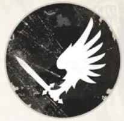
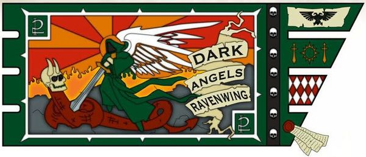
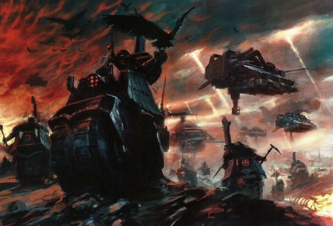
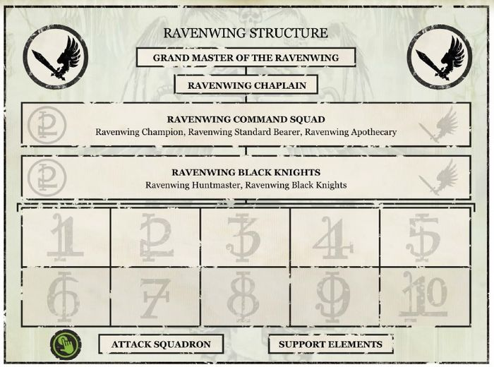
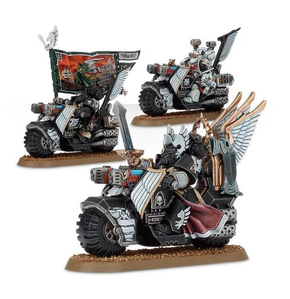
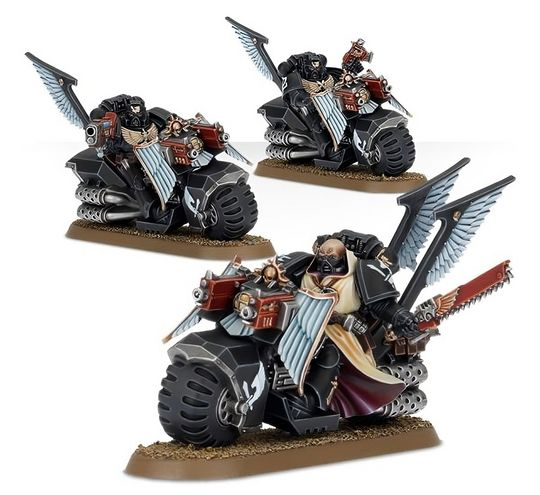
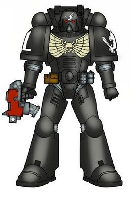
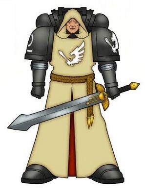
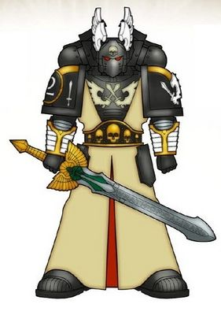

# 0330 鸦翼 Ravenwing

精校状态：中文行文已逐段精校，部分术语仍为暂定

分类：通用概念 / 帝国 Imperium / 中央政务部 Adeptus Terra / 阿斯塔特修会 Adeptus Astartes

原文来源：https://www.bilibili.com/opus/1114165828579754003

原作者：帝国神选罐头

原文时间：2025年09月19日 10:52

[返回分类目录](目录.md) · [全书目录](../../目录.md)

<!-- A0330-B0001 -->
**英文原文**

The Ravenwing is the Second Company of the Dark Angels Space Marines Chapter. Like the First Company, the Deathwing, the Ravenwing are not part of the Codex Astartes structure - although the remaining companies of the chapter adhere to the Codex. Although a versatile and tactically flexible fast-attack force, the true role of the Ravenwing is to hunt members of The Fallen. This secret is only known to high-ranking Black Knights and members of the Inner Circle.

<!-- /A0330-B0001 -->

<!-- A0330-B0002 -->

原译文

鸦翼是黑暗天使星际战士第二连队。与第一连队、死翼一样，鸦翼不是阿斯塔特圣典结构的一部分，尽管该战团的其余连队都遵守圣典。尽管鸦翼是一支多才多艺、战术灵活的快速攻击部队，但它的真正作用是追捕堕天使。这个秘密只有高级黑骑士和内环成员知道。

**校订译文**

鸦翼是黑暗天使战团的第二连。与第一连死翼一样，它采用偏离《阿斯塔特圣典》标准的编制，而战团其余连队则遵循《圣典》。鸦翼是一支能力全面、战术灵活的快速突击部队，其真正使命却是追捕堕天使。只有高阶黑骑士与内环成员知晓这一秘密。

<!-- /A0330-B0002 -->

<!-- A0330-B0003 图片 -->

<!-- A0330-B0004 -->

原译文

Ravenwing Symbol 鸦翼标志

**校订译文**

Ravenwing Symbol 鸦翼标志

<!-- /A0330-B0004 -->

<!-- A0330-B0005 -->
**英文原文**

Affiliation:2nd Company of the Dark Angels

<!-- /A0330-B0005 -->

<!-- A0330-B0006 -->

原译文

隶属：黑暗天使第二连队

**校订译文**

隶属：黑暗天使第二连队

<!-- /A0330-B0006 -->

<!-- A0330-B0007 -->
**英文原文**

Grand Master:Sammael

<!-- /A0330-B0007 -->

<!-- A0330-B0008 -->

原译文

大导师：萨麦尔

**校订译文**

大导师：萨麦尔

<!-- /A0330-B0008 -->

<!-- A0330-B0009 -->
**英文原文**

Specialty:Fast attack, Experimental weaponry & tactics, extermination (pre-Horus Heresy)

<!-- /A0330-B0009 -->

<!-- A0330-B0010 -->

原译文

专业：快速攻击，实验武器和战术，灭绝（荷鲁斯叛乱前）

**校订译文**

作战专长：快速突击；试验性武器与战术、灭绝作战（荷鲁斯之乱前）。

<!-- /A0330-B0010 -->

<!-- A0330-B0011 -->
**英文原文**

Colors:Black armor, white markings, beige Aquilae, Beige tunic for the officers

<!-- /A0330-B0011 -->

<!-- A0330-B0012 -->

原译文

颜色：黑色盔甲，白色线条，米色天鹰，军官米色束腰罩袍

**校订译文**

配色：黑色护甲，白色标记，米色天鹰徽记；军官穿米色罩袍。

<!-- /A0330-B0012 -->

<!-- A0330-B0013 图片 -->

<!-- A0330-B0014 -->

原译文

Ravenwing Company Banner 鸦翼连队旗帜

**校订译文**

Ravenwing Company Banner 鸦翼连队旗帜

<!-- /A0330-B0014 -->

<!-- A0330-B0015 -->
**英文原文**

The current Master of the Ravenwing is Sammael, who rides to battle on the last known surviving Imperial Jetbike.

<!-- /A0330-B0015 -->

<!-- A0330-B0016 -->

原译文

目前的鸦翼导师是萨麦尔，他骑着最后一辆已知幸存的帝国悬浮摩托参加战斗。

**校订译文**

现任鸦翼导师是萨麦尔。他以喷气摩托为座驾，原资料称那是帝国最后一辆已知仍存的此类车辆。

**校注：** “帝国最后一辆已知喷气摩托”为原资料措辞，与帝皇禁军等篇目的车辆资料有年代或范围疑点；按第326篇同项处理。

<!-- /A0330-B0016 -->

<!-- A0330-B0017 图片 -->

<!-- A0330-B0018 -->

原译文

Ravenwing Assault Force 鸦翼突击部队

**校订译文**

Ravenwing Assault Force 鸦翼突击部队

<!-- /A0330-B0018 -->

<!-- A0330-B0019 -->
## Overview 概述

<!-- /A0330-B0019 -->

<!-- A0330-B0020 -->
**英文原文**

The origin of the Ravenwing dates back to pre-Imperial times; originating from both Terran and Caliban. The Wing most changed by the return of Lion El'Jonson, the Ravenwing was named for the Calibanite Order of the Raven which had trained the most fearsome mounted warriors to be found on that savage world, who rode black horses and "could survive alone in the deadly forests of Caliban, heroic figures in matt black armour and winged helms.". Combining those warriors of the Order of the Raven inducted into the Dark Angels with the remnants of the Hosts of Wind and Void, the Lion created a formation that would carve a legend for itself on the battlefields of the Great Crusade and beyond. Based around the principles of mobile attacks, of strike and fade tactics and skirmish warfare, the Ravenwing excelled at the use of light skimmers and aircraft, but also incorporated significant infantry assets. These were mostly reconnaissance squadrons, though among those infantry units specialised in the use of drop pods and other orbital assault doctrines, there were many initiates of the Ravenwing marked by the symbol of a white corvid. When the Legion gave battle to a foe that sought to evade or confuse them, or one whose overwhelming power compelled them to counter it with speed, it was the initiates of the Ravenwing that took to the fore. These initiates were often considered mavericks and glory-hounds by the more hidebound veterans of the other Wings, for the Ravenwing retained a number of more barbaric customs associated with its recruits, many of which hailed from remote feudal worlds. As such, those Calibanite warriors who gained admission to its ranks were often those out of favour with the Masters of the more prestigious Wings or those eager to forge their own legend. It’s role was designed by the Emperor during the Unification Wars as part of the Hosts of the First Legion.

<!-- /A0330-B0020 -->

<!-- A0330-B0021 -->

原译文

鸦翼的起源可以追溯到帝国时代之前；源自泰拉和卡利班。随着莱昂·艾尔庄森的回归，鸦翼的变化最大，鸦翼以卡利班骑士团渡鸦命名，该骑士团训练了蛮荒世界中最可怕的骑兵，他们骑着黑马，“可以在卡利班的致命森林中独自生存，穿着亚光黑色盔甲和带翼头盔的英雄人物”。将那些被引入黑暗天使的渡鸦骑士团战士与流风与虚空天军的残余结合起来，莱昂创造了一个编队，将在大远征及以后的战场上为自己雕刻一个传奇。基于机动攻击、打击和淡入战术以及小规模战斗的原则，鸦翼擅长使用轻型悬浮载具和飞行器，但也包括大量的步兵资产。这些大多是侦查中队，尽管在那些专门使用空投舱和其他轨道攻击理论的步兵部队中，有许多鸦翼的信徒以白鸦的象征为标志。当军团与一个试图躲避或迷惑他们的敌人作战，或者一个压倒性的力量迫使他们快速反击的敌人作战时，鸦翼的信徒脱颖而出。这些信徒经常被其他翼的保守派老兵视为特立独行和荣耀的猎犬，因为鸦翼保留了许多与新兵相关的更野蛮的习俗，其中许多来自偏远的封建世界。因此，那些加入其行列的卡利班战士往往是那些不受更负盛名的翼的导师青睐的人，或者那些渴望打造自己传奇的人。它的角色是由帝皇在统一战争期间设计的，作为第一军团的一部分。

**校订译文**

鸦翼的渊源可追溯到帝国建立前，兼有泰拉与卡利班两地传统。它是莱昂·艾尔’庄森归来后变化最大的一翼，名称来自卡利班的渡鸦骑士团。该团训练出这颗蛮荒星球上最可怕的骑兵：他们骑乘黑马，身穿哑光黑甲、头戴翼盔，能够独自在卡利班的致命森林中生存。雄狮将加入黑暗天使的渡鸦骑士与流风、虚空两支天军的残部合编，组成后来在大远征及更漫长岁月中留下传奇的鸦翼。鸦翼以机动进攻、打了就走及小规模袭扰为原则，擅用轻型悬浮载具与飞行器，也拥有相当数量的步兵。这些步兵主要是侦察部队；擅长空降舱突击和其他轨道空降战法的单位中，也有许多佩戴白鸦标志的鸦翼成员。当敌人试图逃避、迷惑军团，或强大到迫使军团以速度取胜时，鸦翼便会挺身而出。其他翼中固守传统的老兵常把他们看成离经叛道、热衷逐名的人，因为鸦翼保留着许多来自偏远封建世界新兵的粗犷习俗。加入鸦翼的卡利班人，也往往是那些不受声望更高各翼导师青睐，或渴望亲手开创传奇的战士。这一兵种的作战职责，早在统一战争时就已由帝皇为第一军团天军体系设计。

**校注：** strike and fade是打击后迅速脱离，原译“打击和淡入”错译；glory-hounds为逐名之徒的贬义比喻，非真实猎犬。

<!-- /A0330-B0021 -->

<!-- A0330-B0022 -->
**英文原文**

The Ravenwing is a highly specialized formation where speed is more important than heavy firepower. To this end, all of the marines in the company ride into battle on Bikes or Land Speeders on land, including specialized vehicles such as the Land Speeder Vengeance and Darkshroud. In the air, the Ravenwing employs Dark Talons and Nephilim Jetfighters. The Ravenwing's hidden role within the chapter is that of mobile hunters, eternally prowling for their traitorous ancestors, The Fallen. Instead of the usual dark green panoply of the rest of the chapter, the Ravenwing's armour and vehicles are painted jet black, echoing the original colours of the Dark Angels Legion. The Ravenwing also contains specialized sub-formations, such as Ravenwing Command Squads, support squads, Apothecaries, Champions, Ancients, and Ravenwing Black Knights, the latter of whom are the most hardened veterans of the Ravenwing with access to the 2nd Company's Inner Circle. It is these warriors that know the Ravenwing's true mission, hunting the Fallen, and thus they are closely monitored by Chaplain's to make sure their loyalty is in check.

<!-- /A0330-B0022 -->

<!-- A0330-B0023 -->

原译文

鸦翼是一个高度专业化的编队，速度比火力更重要。为此，该连队的所有战士都骑着摩托或陆地上的兰德速攻艇参加战斗，包括兰德速攻艇复仇和黑幕等专用载具。在空中，鸦翼使用暗爪和拿非利喷气式战斗机。鸦翼在战团中的隐藏角色是流动的猎手，永远在寻找他们叛逆的先祖堕天使。鸦翼的盔甲和载具被漆成深黑色，而不是战团其余部分通常的深绿色，与黑暗天使军团的原始颜色相呼应。鸦翼还包含专门的子编队，如鸦翼指挥组、支援小队、药剂师、冠军、旗手和鸦翼黑骑士，后者是鸦翼最老练的老兵，可以进入第二连队的内环。正是这些战士知道鸦翼的真正使命，狩猎堕天使，因此他们受到牧师的密切监视，以确保他们的忠诚得到控制。

**校订译文**

鸦翼的专业化程度很高，重视速度胜过沉重火力。连队战士在地面上乘摩托或兰德速攻艇投入战斗，其中也包括复仇型兰德速攻艇与鸦翼黑幕飞艇等专用载具；空中则使用鸦翼黑暗之爪战机和涅菲里姆战机。他们隐藏的职责是机动猎手，永无止境地搜寻背叛的昔日前辈——堕天使。鸦翼护甲与载具一律漆黑，与其他黑暗天使部队常见的深绿色不同，保留了原军团的配色。其内部设有鸦翼指挥小队、支援小队等专门编组，也有药剂师、冠军、旗手与黑骑士。黑骑士是最坚韧、经验最丰富的老兵，能够进入第二连内环。正是他们知晓追捕堕天使的真正使命，因此教士会密切监督，确保其忠诚无虞。

<!-- /A0330-B0023 -->

<!-- A0330-B0024 图片 -->

<!-- A0330-B0025 -->

原译文

Organization of the Ravenwing 鸦翼组织

**校订译文**

Organization of the Ravenwing 鸦翼组织

<!-- /A0330-B0025 -->

<!-- A0330-B0026 -->
**英文原文**

The Ravenwing typically operates in 10-man squads spread out across different vehicles. Typically, this includes 6 Battle-Brothers on Bikes, two on an Attack Bike, and two more on a Land Speeder. The Master of the Ravenwing could be fielded on a bike or custom Land Speeder. Ravenwing squads are overseen by Talonmasters, which are roughly the equivalent of a Lieutenant. It is rumored that the Ravenwing are oversized in violation of the Adeptus Astartes.

<!-- /A0330-B0026 -->

<!-- A0330-B0027 -->

原译文

鸦翼通常以10人小队的形式运作，分散在不同的载具上。通常，这包括6个驾驶摩托的战斗兄弟，两个驾驶攻击摩托，还有两个驾驶兰德速攻艇。鸦翼的导师可以驾驶摩托或定制的兰德速攻艇。鸦翼小队由利爪大师监督，利爪大师大致相当于副官。据传，鸦翼的规模过大，违反了阿斯塔特修会的规定。

**校订译文**

鸦翼通常以十人小队行动，分乘不同载具：六名战斗兄弟各骑一辆摩托，两人共乘一辆攻击摩托，另两人搭乘一辆兰德速攻艇。鸦翼导师可骑摩托，也可使用定制兰德速攻艇。各小队由利爪大师统辖，其地位大致相当于副官。有传言称，鸦翼规模超编，违反阿斯塔特的编制规定。

**校注：** 英文两人共乘一辆Attack Bike、两人共乘一辆Land Speeder，原译未说明合乘；末句原写Adeptus Astartes而非Codex Astartes，故译为阿斯塔特的编制规定并保留此疑点。

<!-- /A0330-B0027 -->

<!-- A0330-B0028 图片 -->

<!-- A0330-B0029 -->

原译文

Ravenwing Command Squad 鸦翼指挥组

**校订译文**

Ravenwing Command Squad 鸦翼指挥小队

<!-- /A0330-B0029 -->

<!-- A0330-B0030 -->
**英文原文**

During battle, should the Ravenwing face an especially dangerous task they activate the teleportation homers on their bikes, summoning a force of Deathwing and all but guaranteeing victory.

<!-- /A0330-B0030 -->

<!-- A0330-B0031 -->

原译文

在战斗中，如果鸦翼面临特别危险的任务，他们会激活摩托上的传送信标，召唤死翼的部队，几乎可以保证胜利。

**校订译文**

战斗中若遇到格外危险的任务，鸦翼会启动摩托上的传送信标，召来死翼部队；这种增援几乎总能确保胜利。

<!-- /A0330-B0031 -->

<!-- A0330-B0032 图片 -->

<!-- A0330-B0033 -->

原译文

Ravenwing Bike Squad 鸦翼摩托小队

**校订译文**

Ravenwing Bike Squad 鸦翼摩托小队

<!-- /A0330-B0033 -->

<!-- A0330-B0034 -->
**英文原文**

In 666.M38, three successive Grand Masters of the Ravenwing were lost in a single year hunting a group of Fallen, resulting an unprecedented two-decade period where the Ravenwing had no Grand Master, instead using the Master of the Angels of Vengeance as its commander until a suitable replacement could be found.

<!-- /A0330-B0034 -->

<!-- A0330-B0035 -->

原译文

666.M38，连续三位鸦翼大导师在一年内猎杀一群堕天使时迷失，导致鸦翼前所未有的二十年没有大导师，而是使用复仇天使导师作为指挥官，直到找到合适的替代者。

**校订译文**

666.M38，连续三任鸦翼大导师在同一年追捕一群堕天使时折损。这导致鸦翼史无前例地空缺大导师长达二十年，只能由复仇天使战团之主代为统领，直至找到合适的继任者。

**校注：** 英文lost未明确分别为死亡或失踪，暂用折损，不将三人的命运都写作迷失。

<!-- /A0330-B0035 -->

<!-- A0330-B0036 -->
**英文原文**

The Master of the Ravenwing is known as the Ravenbringer.

<!-- /A0330-B0036 -->

<!-- A0330-B0037 -->

原译文

鸦翼的导师被称为渡鸦使者。

**校订译文**

鸦翼的导师被称为渡鸦使者。

<!-- /A0330-B0037 -->

<!-- A0330-B0038 -->
## Colours of the Ravenwing 鸦翼配色

<!-- /A0330-B0038 -->

<!-- A0330-B0039 图片 -->

<!-- A0330-B0040 -->

原译文

Biker 骑手

**校订译文**

Biker 骑手

<!-- /A0330-B0040 -->

<!-- A0330-B0041 图片 -->

<!-- A0330-B0042 -->

原译文

Sergeant 军士

**校订译文**

Sergeant 军士

<!-- /A0330-B0042 -->

<!-- A0330-B0043 图片 -->

<!-- A0330-B0044 -->

原译文

Black Knight 黑骑士

**校订译文**

Black Knight 黑骑士

<!-- /A0330-B0044 -->

<!-- A0330-B0045 -->
## Notable Members 著名成员

<!-- /A0330-B0045 -->

<!-- A0330-B0046 -->
### Grand Masters 大导师

<!-- /A0330-B0046 -->

<!-- A0330-B0047 -->
**英文原文**

Sammael — Current Grand Master of the Ravenwing

<!-- /A0330-B0047 -->

<!-- A0330-B0048 -->

原译文

萨麦尔 — 当前鸦翼大导师

**校订译文**

萨麦尔 — 当前鸦翼大导师

<!-- /A0330-B0048 -->

<!-- A0330-B0049 -->
**英文原文**

Gideon — 347th Grand Master

<!-- /A0330-B0049 -->

<!-- A0330-B0050 -->

原译文

吉迪恩 — 第347任大导师

**校订译文**

吉迪恩 — 第347任大导师

<!-- /A0330-B0050 -->

<!-- A0330-B0051 -->
**英文原文**

Gaius Oblonsky — Former Grand Master.

<!-- /A0330-B0051 -->

<!-- A0330-B0052 -->

原译文

盖乌斯·奥布隆斯基 — 前大导师

**校订译文**

盖乌斯·奥布隆斯基 — 前大导师

<!-- /A0330-B0052 -->

<!-- A0330-B0053 -->
**英文原文**

Bartholomew — First post-Heresy Grand Master

<!-- /A0330-B0053 -->

<!-- A0330-B0054 -->

原译文

巴沙洛缪 — 第一任叛乱后大导师

**校订译文**

巴沙洛缪——荷鲁斯之乱后首任鸦翼大导师。

<!-- /A0330-B0054 -->

<!-- A0330-B0055 -->
**英文原文**

Aloceri — Commander of the Ravenwing during the Horus Heresy

<!-- /A0330-B0055 -->

<!-- A0330-B0056 -->

原译文

阿罗切里 — 荷鲁斯叛乱时期的鸦翼指挥官

**校订译文**

阿罗切里——荷鲁斯之乱时期的鸦翼指挥官。

<!-- /A0330-B0056 -->

<!-- A0330-B0057 -->
**英文原文**

Garradin — Commander of the Ravenwing during the Great Crusade

<!-- /A0330-B0057 -->

<!-- A0330-B0058 -->

原译文

加拉丁 — 大远征时期的鸦翼指挥官

**校订译文**

加拉丁 — 大远征时期的鸦翼指挥官

<!-- /A0330-B0058 -->

<!-- A0330-B0059 -->
### Other 其他

<!-- /A0330-B0059 -->

<!-- A0330-B0060 -->
**英文原文**

Tybalain — Black Knight Huntmaster. Slain during the Battle of the Caliban System

<!-- /A0330-B0060 -->

<!-- A0330-B0061 -->

原译文

泰巴连 — 黑骑士狩猎大师。卡利班星系之战期间被杀

**校订译文**

泰巴连——黑骑士狩猎大师，在卡利班星系之战中阵亡。

<!-- /A0330-B0061 -->

<!-- A0330-B0062 -->
**英文原文**

Astegar — Champion

<!-- /A0330-B0062 -->

<!-- A0330-B0063 -->

原译文

阿斯特加 — 冠军

**校订译文**

阿斯特加 — 冠军

<!-- /A0330-B0063 -->

<!-- A0330-B0064 -->
**英文原文**

Phanuel — Champion.

<!-- /A0330-B0064 -->

<!-- A0330-B0065 -->

原译文

法努埃尔 — 冠军

**校订译文**

法努埃尔 — 冠军

<!-- /A0330-B0065 -->

<!-- A0330-B0066 -->
**英文原文**

Zaelion — Champion

<!-- /A0330-B0066 -->

<!-- A0330-B0067 -->

原译文

扎利昂 — 冠军

**校订译文**

扎利昂 — 冠军

<!-- /A0330-B0067 -->

<!-- A0330-B0068 -->
**英文原文**

Aquila — Sergeant

<!-- /A0330-B0068 -->

<!-- A0330-B0069 -->

原译文

阿奎拉 — 军士

**校订译文**

阿奎拉 — 军士

<!-- /A0330-B0069 -->

<!-- A0330-B0070 -->
**英文原文**

Zamorael — Sergeant

<!-- /A0330-B0070 -->

<!-- A0330-B0071 -->

原译文

扎莫瑞尔 — 军士

**校订译文**

扎莫瑞尔 — 军士

<!-- /A0330-B0071 -->

<!-- A0330-B0072 -->

原译文

Annael 安奈尔

**校订译文**

Annael 安奈尔

<!-- /A0330-B0072 -->

<!-- A0330-B0073 -->

原译文

Balthazan 巴尔萨泽

**校订译文**

Balthazan 巴尔萨泽

<!-- /A0330-B0073 -->

<!-- A0330-B0074 -->

原译文

Meneraeus 梅内雷乌斯

**校订译文**

Meneraeus 梅内雷乌斯

<!-- /A0330-B0074 -->

<!-- A0330-B0075 -->

原译文

Nereal 内瑞尔

**校订译文**

Nereal 内瑞尔

<!-- /A0330-B0075 -->

<!-- A0330-B0076 -->

原译文

Sabrael 萨巴瑞尔

**校订译文**

Sabrael 萨巴瑞尔

<!-- /A0330-B0076 -->

本篇核心术语与暂定项

以下列出本篇出现的英文原形及核心术语表用词。同形词可能指不同对象，具体词义以本篇正文和校注为准；单复数、别名和仅见于图注的名称可能尚未列入。完整候选见[术语表](../../术语表/双语术语候选.csv)。

| 英文 | 采用中文 | 状态 |
| --- | --- | --- |
| Space Marines | 星际战士 | 官方已核对 |
| Adeptus Astartes | 阿斯塔特修会 | 官方已核对 |
| Dark Angels | 黑暗天使 | 官方已核对 |
| Horus Heresy | 荷鲁斯之乱 | 官方已核对 |
| Teleportation | 传送 | 暂定 |
| Emperor | 帝皇 | 官方已核对 |
| The Order | 秩序 | 暂定·官方待核 |
| Great Crusade | 大远征 | 暂定·官方待核 |
| Horus | 荷鲁斯 | 暂定·官方待核 |
| Lion El'Jonson | 莱昂·艾尔’庄森 | 官方已核对 |
| Unification Wars | 统一战争 | 暂定·官方待核 |
| Caliban | 卡利班 | 暂定·官方待核 |
| Feudal Worlds | 封建世界 | 暂定·官方待核 |
| Land Speeder Vengeance | 复仇型兰德速攻艇 | 官方已核对 |
| Aquila | 天鹰 | 暂定·官方待核 |
| Master | 导师（审判庭职衔）／舰务官（舰员职务） | 语境定译·官方待核 |
| Mission | 教团／传教机构 | 暂定 |
| Chaplain | 教士 | 官方已核对 |
| Lieutenant | 副官 | 暂定·官方待核 |
| Champion | 冠军 | 暂定·官方待核 |
| Chapter | 战团 | 暂定·官方待核 |
| Sergeant | 军士 | 暂定·官方待核 |
| Sammael | 萨麦尔 | 官方已核 |
| Codex Astartes | 阿斯塔特圣典 | 暂定·官方待核 |
| Angels of Vengeance | 复仇天使 | 暂定·官方待核 |
| Land Speeders | 兰德速攻艇 | 暂定·官方待核 |
| Grand Master of the Ravenwing | 鸦翼大导师 | 暂定·官方待核 |
| Remnants | 残骸 | 暂定·官方待核 |
| Initiates | 进阶者 | 官方已核 |
| Calibanite | 卡利班诸语 | 暂定·官方待核 |
| Vengeance | 复仇号 | 暂定·官方待核 |
| Bikes | 摩托 | 暂定·官方待核 |
| Grand Master | 大导师 | 暂定·官方待核 |
| Aquilae | 天鹰学派 | 暂定·官方待核 |
| The Dark | 《黑暗》 | 暂定·官方待核 |
| System | 星系（恒星系统） | 暂定·官方待核 |
| Jetbike | 喷气摩托 | 暂定·官方待核 |

