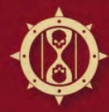

# 0331 恐翼 Dreadwing

精校状态：中文行文已逐段精校，部分术语仍为暂定

分类：通用概念 / 帝国 Imperium / 中央政务部 Adeptus Terra / 阿斯塔特修会 Adeptus Astartes

原文来源：https://www.bilibili.com/opus/1026954683687632914

原作者：帝国神选罐头

原文时间：2025年01月27日 10:28

[返回分类目录](目录.md) · [全书目录](../../目录.md)

<!-- A0331-B0001 -->
**英文原文**

We have come. We are death

<!-- /A0331-B0001 -->

<!-- A0331-B0002 -->
**英文原文**

— war-chant of the Dreadwing

<!-- /A0331-B0002 -->

<!-- A0331-B0003 -->

原译文

我们即将到来。我们即是死亡

**校订译文**

我们已至。我们即死亡。

**校注：** have come为已经到来，原译即将到来时态相反。

<!-- /A0331-B0003 -->

<!-- A0331-B0004 -->

原译文

— 恐翼的战吼

**校订译文**

— 恐翼的战吼

<!-- /A0331-B0004 -->

<!-- A0331-B0005 -->
**英文原文**

The Dreadwing was one of the six specialized formations called Wings of the Dark Angels Space Marine Legion during the Great Crusade and Horus Heresy.

<!-- /A0331-B0005 -->

<!-- A0331-B0006 -->

原译文

恐翼是大远征和荷鲁斯叛乱期间被称为星际战士黑暗天使军团之翼的六个专业编队之一。

**校订译文**

恐翼是黑暗天使军团在大远征及荷鲁斯之乱时期的六个专门作战分支之一，统称六翼。

<!-- /A0331-B0006 -->

<!-- A0331-B0007 图片 -->

<!-- A0331-B0008 -->

原译文

Symbol of the Dreadwing 恐翼标志

**校订译文**

Symbol of the Dreadwing 恐翼标志

<!-- /A0331-B0008 -->

<!-- A0331-B0009 -->
## Overview 概述

<!-- /A0331-B0009 -->

<!-- A0331-B0010 -->
**英文原文**

Perhaps the most feared of all the branches of the Hexagrammaton, garnering a reputation that far outweighed the Wing's influence within the Legion, the Dreadwing was composed of those whose role was the utter annihilation of the enemy, the salting of the earth, and breaking of worlds. When called out from the ranks, the initiates of the Dreadwing were experts in the brutal tactics of massacre, purge, and the deployment of Exterminatus class weaponry, though many also specialised in the use of terror as a weapon. It was an evolution of the Host of Bone, its brutal tactics refined and temperamental nature dulled by the influx of Calibanite recruits, though it retained many of the Skandic ceremonies and titles that had marked its origins. Its initiates were, however, far from dim brutes, for the Dreadwing saw to the duty of caretaking some of the most dangerous technologies that existed anywhere within the Imperium. Its ranks included not only the vast majority of the Legion's Destroyers, Interemptors and Moritat cohorts but also a large number of Techmarines, forge adepts and no few Apothecaries, those considered among the least orthodox of their kind and often of morbid disposition. In the sealed vaults of the Dreadwing rested the least stable of the Dreadnoughts maintained by the Legion, those whose minds were trapped within the horrors of wars long since ended, as well as artificial warriors of a more fearsome nature. In the years after the initial outbreak of the Horus Heresy, as attrition and despair cut at the prohibitions of the Great Crusade, it would also play host to those warriors given dispensation by their Primarch to resume use of their psychic powers. For the Lion would not see his Legion plunged into the greatest war in recorded history barred the use of one of its most powerful weapons. To choose between victory or the sanctity of the dictats of Nikaea was no choice at all, for the Lion would always choose victory, no matter the cost to be paid in the aftermath. The Dreadwing also operated Terminator units known as the Naufragia. Its leader was known as the Dreadbringer.

<!-- /A0331-B0010 -->

<!-- A0331-B0011 -->

原译文

恐翼可能是六翼所有分支中最令人恐惧的，其名声远远超过了翼在军团中的影响力，恐翼由那些以彻底歼灭敌人、摧毁土地和毁灭世界为职责的人组成。当从队伍中被挑选出来时，恐翼的成员是大屠杀、清洗和部署灭绝武器等残酷战术的专家，尽管许多人也专门将恐怖作为武器使用。它是骸骨天军的演变，其残酷战术因卡利班新兵的涌入而得到改进，脾气也有所缓和，尽管它保留了许多标志其起源的斯凯蒂奇仪式和头衔。然而，恐翼的新成员绝非愚蠢的野兽，因为恐翼负责保管帝国境内一些最危险的技术。其队伍不仅包括军团中的绝大多数毁灭者、屠灭者和暗杀精英部队，还包括大量技术军士、铸造大师和不少药剂师，这些人被认为是同类中最不正统的，且往往性格乖僻。在恐翼的密封秘库中，存放着军团维护的最不稳定的无畏机甲，它们的思维被困在早已结束的战争的恐怖之中，还有更可怕的人造战士。在荷鲁斯叛乱最初爆发后的几年里，随着消耗和绝望削弱了大远征的禁令，它还接纳了那些得到他们的基因原体特许、恢复使用灵能的战士。因为狮子不会让他的军团在这场有记录以来最伟大的战争中，被禁止使用其最强大的武器之一。在胜利和尼凯亚法令的神圣性之间做出选择根本就不是选择，因为狮子总是会选择胜利。无论事后付出什么代价。恐翼还运营着被称为纳夫拉基亚的终结者部队。它的领导人被称为恐怖使者。

**校订译文**

恐翼或许是六翼中最令人畏惧的分支，其凶名甚至远超它在军团内实际拥有的影响力。它的使命是彻底歼灭敌人、令土地寸草不生，并摧毁整个世界。奉召组成恐翼部队的成员精通屠杀、净化及灭绝令级武器的使用，也有许多人擅长以恐惧为武器。恐翼由骸骨天军演变而来，卡利班新兵的加入使其残酷战术更加完善，也抑制了原有的暴烈性情，但仍保留许多源于斯凯蒂奇传统的仪式与称号。其成员绝非愚钝莽夫：他们负责保管帝国最危险的一批技术。恐翼不但囊括军团绝大多数毁灭者、屠灭者与暗杀精英部队，还拥有大量科技战士、铸造技术专家及药剂师。这些人往往是各自专业中最离经叛道者，性情也常显得阴郁病态。恐翼的封闭秘库中保存着军团精神状态最不稳定的无畏机甲——其心智仍困在早已结束的战争梦魇里——以及本质更加可怕的人造战士。荷鲁斯之乱爆发后，持续的消耗与绝望逐渐冲破大远征时代的禁限，恐翼也开始接纳获原体特许、重新使用灵能的战士。雄狮不肯让军团在史上最惨烈的战争中，被禁止使用自身最强大的武器之一。若须在胜利与尼凯亚敕令的神圣性之间选择，对他而言根本没有悬念：无论日后付出何种代价，他都会选择胜利。恐翼还指挥一类称为“纳夫拉基亚”的终结者部队，其最高领袖称为“恐怖使者”。

**校注：** forge adepts指铸造技术人员，不等同职衔Master of the Forge铸造大师；原译误提升了职级。

<!-- /A0331-B0011 -->

<!-- A0331-B0012 -->
**英文原文**

The Dreadwing also utilized mass armored assaults of Land Raiders, Spartan Assault Carriers, Mastodons, Whirlwinds, Vindicators, Arquitor Bombards and Fellglaives with advanced Warp weaponry. They employed weapons of mass destruction such as Phosphex, man-portable Atomics, Singularity Drivers, Gene targeted Bio-weaponry, Psionic Phages and Vortex Weapons. The advanced weaponry of the Dreadwing was designed by the Emperor's own armorers. The Dreadwing also made use of Castellax Battle-Automata known as the Black-Watch. During the Great Crusade, the Wing was home to the majority of the Legion’s Librarius, and as the Horus Heresy ground on, Lion El'Jonson also allowed the Dreadwing to utilize Marines with psychic abilities in defiance of the Council of Nikaea.

<!-- /A0331-B0012 -->

<!-- A0331-B0013 -->

原译文

恐翼还利用了由兰德掠袭者、斯巴达突击运兵车、乳齿象、旋风、维护者、曲射手臼炮和残暴刃组成的大规模装甲突击部队，并配备了先进的亚空间武器。他们使用了诸如磷化武器、便携式原子弹、奇点驱动器、基因靶向生物武器、幽体吞噬者和涡旋武器等大规模杀伤性武器。恐翼的先进武器是由帝皇自己的军械士设计的。恐翼还使用了被称为黑卫的堡星自动机兵。在大远征期间，该翼是军团中大多数智库的所在地，随着荷鲁斯叛乱的持续进行，莱昂·艾尔庄森也允许恐翼使用具有灵能能力的星际战士，无视尼凯亚会议的决定。

**校订译文**

恐翼还会集结兰德掠袭者战车、斯巴达突击运兵车、乳齿象重型运兵车、旋风战车、维护者战车、曲射手臼炮车，以及配有先进亚空间武器的残暴刃坦克，发动大规模装甲突击。他们使用的大规模毁灭性武器包括磷化武器、单兵便携核武器、奇点驱动器、基因定向生物武器、灵能噬体及涡旋武器。这些先进装备由帝皇直属的军械匠设计。恐翼还拥有称为“黑卫”的堡星自动机兵。大远征期间，军团大部分智库人员都归于恐翼；随着荷鲁斯之乱持续，莱昂·艾尔’庄森也准许他们重新启用具有灵能能力的战士，不再遵从尼凯亚会议的禁令。

**校注：** Psionic Phages暂作灵能噬体，与Gene-phages基因噬体区分。Fellglaive的亚空间武器表述来自给定英文，不据其他版本改写。

<!-- /A0331-B0013 -->

<!-- A0331-B0014 -->
**英文原文**

The Dreadwing were known to store their terrible arsenal within chambers such as The Dreadwing Sacristy

<!-- /A0331-B0014 -->

<!-- A0331-B0015 -->

原译文

众所周知，恐翼会将他们可怕的武器存放在恐翼圣器室等房间里

**校订译文**

众所周知，恐翼会将他们可怕的武器存放在恐翼圣器室等房间里

<!-- /A0331-B0015 -->

<!-- A0331-B0016 -->
**英文原文**

As of M41, the unit no longer exists.

<!-- /A0331-B0016 -->

<!-- A0331-B0017 -->

原译文

从M41开始，该单位已不存在。

**校订译文**

至第41千年，恐翼已不复存在。

**校注：** as of M41为截至第41千年的状态，并非自第41千年起才撤销编制。

<!-- /A0331-B0017 -->

<!-- A0331-B0018 -->
## Ranks 等级

<!-- /A0331-B0018 -->

<!-- A0331-B0019 -->
**英文原文**

Voted Lieutenant - Leader of the Dreadwing, also known as the Dreadbringer.

<!-- /A0331-B0019 -->

<!-- A0331-B0020 -->

原译文

受选副官 - 恐翼的领导者，也被称为恐怖使者。

**校订译文**

受选副官 - 恐翼的领导者，也被称为恐怖使者。

<!-- /A0331-B0020 -->

<!-- A0331-B0021 -->

原译文

Voted Successor 受选后继者

**校订译文**

Voted Successor 受选后继者

<!-- /A0331-B0021 -->

<!-- A0331-B0022 -->
**英文原文**

Eskaton - A title used to denote a warrior that has overseen the final death of an entire race or world.

<!-- /A0331-B0022 -->

<!-- A0331-B0023 -->

原译文

终灭者 - 一个用于表示监督整个种族或世界的最终死亡的战士的称号。

**校订译文**

终灭者——授予曾主持灭绝整个种族或世界的战士的称号。

<!-- /A0331-B0023 -->

<!-- A0331-B0024 -->

原译文

Lieutenant 副官

**校订译文**

Lieutenant 副官

<!-- /A0331-B0024 -->

<!-- A0331-B0025 -->
**英文原文**

Praefectus - Squad leader.

<!-- /A0331-B0025 -->

<!-- A0331-B0026 -->

原译文

长官 - 小队领导者

**校订译文**

长官 - 小队领导者

<!-- /A0331-B0026 -->

<!-- A0331-B0027 -->

原译文

Initiate 信徒

**校订译文**

Initiate 正式成员

**校注：** 此处Initiate是六翼中相对于Postulant候选人的正式成员，不能套用黑色圣堂军职的官译进阶者，也不等同宗教信徒。

<!-- /A0331-B0027 -->

<!-- A0331-B0028 -->
**英文原文**

Postulant - A legionary who hasn't been properly inducted into the Dreadwing and is not allowed to wear its symbols or sing its chants.

<!-- /A0331-B0028 -->

<!-- A0331-B0029 -->

原译文

望教者 - 一名未被恰当地引入恐翼且不被允许穿戴其标志或吟唱其颂歌的军团士兵。

**校订译文**

望教者——尚未正式获准加入恐翼的军团战士，不得佩戴其徽记，也不得吟唱其战歌。

<!-- /A0331-B0029 -->

<!-- A0331-B0030 -->
## Assets 资产

<!-- /A0331-B0030 -->

<!-- A0331-B0031 -->
### Known Vessels 已知舰船

<!-- /A0331-B0031 -->

<!-- A0331-B0032 -->
**英文原文**

Intolerant - Capital Ship.

<!-- /A0331-B0032 -->

<!-- A0331-B0033 -->

原译文

偏执号 - 主力舰

**校订译文**

偏执号 - 主力舰

<!-- /A0331-B0033 -->

<!-- A0331-B0034 -->
### Notable Members 著名成员

<!-- /A0331-B0034 -->

<!-- A0331-B0035 -->
**英文原文**

Constantine - Dreadbringer, Voted Lieutenant, Paladin, succeeded by Redloss.

<!-- /A0331-B0035 -->

<!-- A0331-B0036 -->

原译文

康斯坦丁 - 恐怖使者，受选副官，圣骑士，由雷德洛斯接替。

**校订译文**

康斯坦丁 - 恐怖使者，受选副官，圣骑士，由雷德洛斯接替。

<!-- /A0331-B0036 -->

<!-- A0331-B0037 -->
**英文原文**

Farith Redloss - Dreadbringer, Voted Lieutenant

<!-- /A0331-B0037 -->

<!-- A0331-B0038 -->

原译文

法洛斯·雷德洛斯 - 恐怖使者，受选副官

**校订译文**

法瑞斯·雷德洛斯——恐怖使者、受选副官。

<!-- /A0331-B0038 -->

<!-- A0331-B0039 -->
**英文原文**

Annael - Lieutenant

<!-- /A0331-B0039 -->

<!-- A0331-B0040 -->

原译文

安纳尔 - 副官

**校订译文**

安奈尔——副官。

<!-- /A0331-B0040 -->

<!-- A0331-B0041 -->
**英文原文**

Danaes - Lieutenant-Ascendant, Third Order

<!-- /A0331-B0041 -->

<!-- A0331-B0042 -->

原译文

达奈斯 - 上级副官，第三修会

**校订译文**

达奈斯——第三骑士团的上级副官。

<!-- /A0331-B0042 -->

<!-- A0331-B0043 -->
**英文原文**

Marduk Sedras - Eskaton

<!-- /A0331-B0043 -->

<!-- A0331-B0044 -->

原译文

马杜克·赛德拉斯 - 终灭者

**校订译文**

马杜克·赛德拉斯 - 终灭者

<!-- /A0331-B0044 -->

<!-- A0331-B0045 -->
**英文原文**

Halswain - Terminator Sergeant

<!-- /A0331-B0045 -->

<!-- A0331-B0046 -->

原译文

哈斯万 - 终结者军士

**校订译文**

哈斯万 - 终结者军士

<!-- /A0331-B0046 -->

<!-- A0331-B0047 -->
**英文原文**

Zabriel - Former Initiate. Unwillingly became a Fallen Angel but now serves Lion El'Jonson as one of The Risen.

<!-- /A0331-B0047 -->

<!-- A0331-B0048 -->

原译文

扎布瑞尔 - 前信徒。不情愿地成为堕天使，但现在为莱昂·艾尔庄森服务，成为赦天使之一。

**校订译文**

扎布瑞尔——曾是恐翼正式成员，并非自愿地成为堕天使；如今作为赦天使之一，效力于莱昂·艾尔’庄森。

<!-- /A0331-B0048 -->

本篇核心术语与暂定项

以下列出本篇出现的英文原形及核心术语表用词。同形词可能指不同对象，具体词义以本篇正文和校注为准；单复数、别名和仅见于图注的名称可能尚未列入。完整候选见[术语表](../../术语表/双语术语候选.csv)。

| 英文 | 采用中文 | 状态 |
| --- | --- | --- |
| Dark Angels | 黑暗天使 | 官方已核对 |
| Terminator | 终结者 | 官方已核对 |
| Horus Heresy | 荷鲁斯之乱 | 官方已核对 |
| Warp | 亚空间 | 官方已核对 |
| Imperium | 帝国 | 暂定·简称 |
| Librarius | 智库（机构）／智库学派（灵能学派） | 语境定译·官方待核 |
| History | 历史 | 编辑用语已统一 |
| Emperor | 帝皇 | 官方已核对 |
| Primarch | 原体 | 官方已核对 |
| Great Crusade | 大远征 | 暂定·官方待核 |
| Horus | 荷鲁斯 | 暂定·官方待核 |
| Lion El'Jonson | 莱昂·艾尔’庄森 | 官方已核对 |
| Council of Nikaea | 尼凯亚会议 | 暂定·官方待核 |
| Marduk | 马尔杜克 | 暂定·官方待核 |
| Space Marine Legion | 星际战士军团 | 暂定·官方待核 |
| Lieutenant | 副官 | 暂定·官方待核 |
| Moritat | 暗杀精英 | 暂定·官方待核 |
| Dreadwing | 恐翼 | 暂定·官方待核 |
| Space Marine | 星际战士 | 暂定·官方待核 |
| Sergeant | 军士 | 暂定·官方待核 |
| Destroyers | 毁灭者 | 暂定·官方待核 |
| Whirlwinds | 旋风 | 暂定·官方待核 |
| Vindicators | 维护者 | 暂定·官方待核 |
| Land Raiders | 兰德掠袭者 | 暂定·官方待核 |
| Initiates | 进阶者 | 官方已核 |
| Powers | 能天使 | 暂定·官方待核 |
| Hexagrammaton | 六翼 | 暂定·官方待核 |
| Host | 天军 | 暂定·官方待核 |
| Farith Redloss | 法瑞斯·雷德洛斯 | 暂定·官方待核 |
| Risen | 赦天使 | 暂定·官方待核 |
| Calibanite | 卡利班诸语 | 暂定·官方待核 |
| Host of Bone | 骸骨天军 | 暂定·官方待核 |
| Psionic Phages | 灵能噬体 | 暂定·官方待核 |
| Initiate | 正式成员 | 暂定·官方待核 |
| Postulant | 望教者 | 暂定·官方待核 |
| Dreadbringer | 恐怖使者 | 暂定·官方待核 |
| Annael | 安奈尔 | 暂定·官方待核 |
| Marduk Sedras | 玛杜克·赛德拉斯 | 暂定·官方待核 |
| Zabriel | 扎布里尔 | 暂定·官方待核 |
| The Dark | 《黑暗》 | 暂定·官方待核 |
| Vortex Weapons | 涡旋武器 | 暂定·官方待核 |
| Defiance | 反抗号 | 暂定·官方待核 |
| Phosphex | 磷化燃剂 | 暂定·官方待核 |
| The Dreadwing Sacristy | 恐翼圣器室 | 暂定·官方待核 |
| Ascendant | 升腾星堡 | 暂定·官方待核 |
| Nikaea | 尼凯亚 | 暂定·官方待核 |

