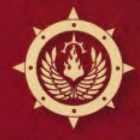
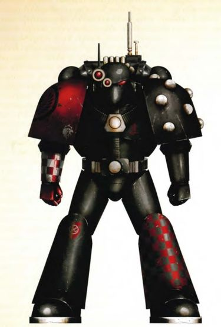

# 0332 炎翼 Firewing

精校状态：中文行文已逐段精校，部分术语仍为暂定

分类：通用概念 / 帝国 Imperium / 中央政务部 Adeptus Terra / 阿斯塔特修会 Adeptus Astartes

原文来源：https://www.bilibili.com/opus/1212621309554458633

原作者：帝国神选罐头

原文时间：2026年06月11日 18:30

[返回分类目录](目录.md) · [全书目录](../../目录.md)

<!-- A0332-B0001 -->
**英文原文**

The Firewing was one of the six "wings" of the Hexagrammaton in the Dark Angels Legion during the Great Crusade and Horus Heresy.

<!-- /A0332-B0001 -->

<!-- A0332-B0002 -->

原译文

炎翼是大远征和荷鲁斯叛乱期间黑暗天使军团中六“翼”之一。

**校订译文**

炎翼是黑暗天使军团在大远征及荷鲁斯之乱时期六翼体系中的一个分支。

<!-- /A0332-B0002 -->

<!-- A0332-B0003 图片 -->

<!-- A0332-B0004 -->

原译文

Firewing Symbol 炎翼标志

**校订译文**

Firewing Symbol 炎翼标志

<!-- /A0332-B0004 -->

<!-- A0332-B0005 -->
## Overview 概述

<!-- /A0332-B0005 -->

<!-- A0332-B0006 -->
**英文原文**

The smallest of the six Wings of the Hexagrammaton, the Firewing was dedicated to all the bloody subtleties of warfare. It was the hidden blade of the Legion, the knife in the dark and the blade against the throat of the foes' commanders. Within its ranks were to be found an eclectic mix of stalkers, champions and Moritat killers, all bound by their shared expertise in the arts of blade and knife, duellists and assassins without peer. The Firewing sought the destruction of the enemy through the violent depletion of their command structure, whether in honourable duels at the heart of a battle or at the hands of subtle killers far from the battlefield. When given free rein upon the field of battle, the initiates of the Firewing chose to wage a war of wills against the enemy, seeking to break their resolve rather than slaughter their ranks. They counted knowledge among the keenest of their weapons, allowing them to strike at the enemy's weakest points where their limited numbers would be most effective. As such they possessed the most extensive library of any of the Wings, a vault that contained the detailed accounting of thousands upon thousands of Xenos and sub-human empires, and which was guarded by a sub-sect of the Firewing dedicated to the cataloguing of those records. Of all the Wings, they remained least changed from their origins in the Wars of Unity on Terra, with many of the eldest marshals of the Firewing being veterans of that conflict and steeped in the culture of Terra and its nearest colonies.

<!-- /A0332-B0006 -->

<!-- A0332-B0007 -->

原译文

作为六翼中最小的一翼，炎翼致力于战争的所有血腥微妙之处。这是军团隐藏的刀刃，黑暗中的刀子，还有抵着敌人指挥官喉咙的刀刃。在它的队伍中，有各种各样的追猎者、冠军和暗杀精英杀手，他们都被自己在刃与刀的技艺、决斗者和刺客方面的共同专业知识所束缚。无论是在战斗的核心进行体面的决斗，还是在远离战场的敏锐杀手之手，炎翼都试图通过暴力消耗其指挥结构来摧毁敌人。当在战场上获得自由时，炎翼的修士选择对敌人发动意志战争，试图打破他们的决心，而不是屠杀他们的队伍。他们将知识视为最敏锐的武器之一，使他们能够打击敌人最薄弱的环节，在那里，他们有限的人数将是最有效的。因此，他们拥有任何翼中最大量的图书馆，一个包含成千上万的异型和亚人帝国详细描述的密库，并由专门对这些记录进行编目的炎翼分派守卫。在所有的翼中，它们与泰拉统一战争中的起源相比变化最小，许多最年长的炎翼元帅都是这场冲突的老兵，并深受泰拉及其最近的殖民地的文化影响。

**校订译文**

炎翼是六翼中规模最小的一支，专精于战争中隐秘而血腥的技艺。它是军团藏起的利刃，是暗处的匕首，也是抵住敌方指挥官咽喉的锋刃。其成员包括追猎者、冠军与暗杀精英，背景各异，却都精通刀剑之术，是无可匹敌的决斗者和刺客。炎翼通过杀伤敌军指挥层，使整个敌军崩溃；既可在战场中央发起光明正大的决斗，也可让隐秘杀手在远离前线处完成刺杀。获准自主行动时，炎翼更倾向于瓦解敌人的意志，而非单纯屠戮士兵。他们视知识为最锋利的武器之一，凭借情报攻击敌人弱点，使有限兵力取得最大效果。因此，炎翼拥有六翼中藏书最丰富的档案库，详细记录成千上万个异形与亚人帝国，并由一个专门整理这些资料的内部派别守卫。在六翼之中，炎翼自泰拉统一战争以来变化最少；许多最资深的元帅亲历过那场战争，深受泰拉及其邻近殖民地文化的熏陶。

<!-- /A0332-B0007 -->

<!-- A0332-B0008 图片 -->

<!-- A0332-B0009 -->

原译文

Firewing Operator 炎翼操作者

**校订译文**

Firewing Operator 炎翼作战人员

<!-- /A0332-B0009 -->

<!-- A0332-B0010 -->
**英文原文**

The Calibanite influence had little impact on the entrenched and complex systems of ritual within the veteran ranks of the Firewing, whose marshals had long made a tradition of recruiting only from Terra and the densely-populated colonies that surrounded it. It was also notable for its strong links to the Sons of Horus, who recruited from a number of the same worlds, a connection that turned to the bitterest hatred with the outbreak of the Horus Heresy, for it would pit those once sworn to eternal loyalty against each other.

<!-- /A0332-B0010 -->

<!-- A0332-B0011 -->

原译文

卡利班的影响对炎翼老兵队伍中根深蒂固的复杂仪式体系影响不大，炎翼元帅长期以来一直有只从泰拉和周围人口稠密的殖民地招募的传统。它还与荷鲁斯之子有着密切的联系，荷鲁斯之子从许多相同的世界招募，这种联系随着荷鲁斯叛乱的爆发而变成了最强烈的仇恨，因为它会让那些曾经发誓永远忠诚的人相互对立。

**校订译文**

卡利班文化未能显著改变炎翼老兵根深蒂固、复杂繁密的仪式体系，其元帅长期坚持只从泰拉及周边人口稠密的殖民地征兵。他们也与荷鲁斯之子联系密切，因为双方有不少相同的征兵世界。然而，荷鲁斯之乱爆发后，这份联系转化为最刻骨的仇恨：曾发誓永远忠诚相待的战士，如今必须彼此厮杀。

<!-- /A0332-B0011 -->

<!-- A0332-B0012 -->
**英文原文**

Long before the events of the Heresy, during the Second Rangdan Xenocide in 862.M30, the Firewing would sustain severe casualties, reducing it to a fraction of its former size at the time as its initiates stood toe-to-toe against Rangdan warmasters and reavers.

<!-- /A0332-B0012 -->

<!-- A0332-B0013 -->

原译文

早在叛乱事件之前，在862.M30的第二次冉丹种族灭绝中，当其修士与冉丹的战帅和掠夺者针锋相对时，炎翼被造成严重伤亡，使其规模缩小到当时的一小部分。

**校订译文**

早在荷鲁斯之乱之前，862.M30的第二次冉丹灭绝战争中，炎翼成员正面迎战冉丹战帅与掠夺者，伤亡惨重，兵力缩减至原来的很小一部分。

<!-- /A0332-B0013 -->

<!-- A0332-B0014 -->
**英文原文**

The Firewing included unique troops known as the Enigmatii. Its troops favored Mk.VI Power Armour due to its advanced augur and vox systems. The wing was also known to recruit those Legion librarians who were skilled in the art of Divination, valuing their skills for premonition and uncovering that which is hidden. A detachment of the Firewing is known as an Echelon.

<!-- /A0332-B0014 -->

<!-- A0332-B0015 -->

原译文

炎翼包括被称为迷影的独特部队。其部队偏爱Mk.VI动力盔甲，因为其具有先进的鸟卜仪和音阵系统。众所周知，该翼还招募了那些精通占卜技艺的军团智库，他们重视自己的占卜技能，并发现了隐藏的东西。炎翼的一支分遣队被称为梯队。

**校订译文**

炎翼拥有称为“迷影”的特殊部队。他们偏爱 Mark VI 型动力甲，重视其先进的鸟卜仪与音阵通信系统。炎翼还吸纳精通占卜之术的军团智库员，看重他们预知未来、揭示隐秘的能力。炎翼分遣队称为“梯队”。

<!-- /A0332-B0015 -->

<!-- A0332-B0016 -->
**英文原文**

The Master of the Firewing is known as the Firebringer.

<!-- /A0332-B0016 -->

<!-- A0332-B0017 -->

原译文

炎翼的导师被称为火焰使者。

**校订译文**

炎翼的导师被称为火焰使者。

<!-- /A0332-B0017 -->

<!-- A0332-B0018 -->
## Notable Elements 著名成员

<!-- /A0332-B0018 -->

<!-- A0332-B0019 -->
## Vessels 舰船

原题：Vessels 载具

<!-- /A0332-B0019 -->

<!-- A0332-B0020 -->
**英文原文**

Forest Sepulchre - Battleship

<!-- /A0332-B0020 -->

<!-- A0332-B0021 -->

原译文

森林坟墓号 - 战列舰

**校订译文**

森林坟墓号 - 战列舰

<!-- /A0332-B0021 -->

<!-- A0332-B0022 -->
## Known Members 已知成员

<!-- /A0332-B0022 -->

<!-- A0332-B0023 -->
**英文原文**

Griffayn - Voted

<!-- /A0332-B0023 -->

<!-- A0332-B0024 -->

原译文

格里芬 - 受选者

**校订译文**

格里芬 - 受选者

<!-- /A0332-B0024 -->

<!-- A0332-B0025 -->
**英文原文**

Vastael - Voted

<!-- /A0332-B0025 -->

<!-- A0332-B0026 -->

原译文

瓦斯塔尔 - 受选者

**校订译文**

瓦斯塔尔 - 受选者

<!-- /A0332-B0026 -->

<!-- A0332-B0027 -->
**英文原文**

Pelagor Marner - Lance-Decurion, 52nd Chapter of the First Host

<!-- /A0332-B0027 -->

<!-- A0332-B0028 -->

原译文

佩拉戈尔·马纳 - 长枪百夫长，第一天军的第52战团

**校订译文**

佩拉戈尔·马纳——第一天军第52战团的长枪十夫长。

**校注：** Decurion与Centurion不同，前者暂按十夫长译，原译百夫长混同；这一职衔译法不用于反推实际人数。

<!-- /A0332-B0028 -->

<!-- A0332-B0029 -->
**英文原文**

Atreus Deucalion - Marshal

<!-- /A0332-B0029 -->

<!-- A0332-B0030 -->

原译文

阿特柔斯·杜卡利翁 - 元帅

**校订译文**

阿特柔斯·杜卡利翁 - 元帅

<!-- /A0332-B0030 -->

<!-- A0332-B0031 -->
**英文原文**

Alais Decur - Sergeant

<!-- /A0332-B0031 -->

<!-- A0332-B0032 -->

原译文

阿拉伊斯·德库尔 - 军士

**校订译文**

阿拉伊斯·德库尔 - 军士

<!-- /A0332-B0032 -->

<!-- A0332-B0033 -->
**英文原文**

Aravain - Librarian

<!-- /A0332-B0033 -->

<!-- A0332-B0034 -->

原译文

阿拉万 - 智库

**校订译文**

阿拉万——智库员。

<!-- /A0332-B0034 -->

<!-- A0332-B0035 -->
## Notes 注释

<!-- /A0332-B0035 -->

<!-- A0332-B0036 -->
**英文原文**

The Firewing flame symbol resembles the heraldry of the Consecrators, a Successor Chapter of the Dark Angels

<!-- /A0332-B0036 -->

<!-- A0332-B0037 -->

原译文

炎翼火焰标志似于黑暗天使的子战团，奉献者的纹章

**校订译文**

炎翼的火焰徽记，与黑暗天使子战团奉献者的纹章相似。

<!-- /A0332-B0037 -->

本篇核心术语与暂定项

以下列出本篇出现的英文原形及核心术语表用词。同形词可能指不同对象，具体词义以本篇正文和校注为准；单复数、别名和仅见于图注的名称可能尚未列入。完整候选见[术语表](../../术语表/双语术语候选.csv)。

| 英文 | 采用中文 | 状态 |
| --- | --- | --- |
| Dark Angels | 黑暗天使 | 官方已核对 |
| Librarian | 智库员 | 官方已核对 |
| Divination | 预知学派 | 官方已核对 |
| Horus Heresy | 荷鲁斯之乱 | 官方已核对 |
| Great Crusade | 大远征 | 暂定·官方待核 |
| Terra | 泰拉 | 暂定·官方待核 |
| Horus | 荷鲁斯 | 暂定·官方待核 |
| Sons of Horus | 荷鲁斯之子 | 暂定·官方待核 |
| Master | 导师（审判庭职衔）／舰务官（舰员职务） | 语境定译·官方待核 |
| Lance | 骑士矛阵 | 暂定·官方待核 |
| Moritat | 暗杀精英 | 暂定·官方待核 |
| Power Armour | 动力盔甲 | 暂定·官方待核 |
| Chapter | 战团 | 暂定·官方待核 |
| Veteran | 老兵 | 暂定·官方待核 |
| Sergeant | 军士 | 暂定·官方待核 |
| Consecrators | 奉献者 | 暂定·官方待核 |
| Initiates | 进阶者 | 官方已核 |
| Hexagrammaton | 六翼 | 暂定·官方待核 |
| Host | 天军 | 暂定·官方待核 |
| Calibanite | 卡利班诸语 | 暂定·官方待核 |
| Xenos | 异形 | 暂定·官方待核 |
| Rangdan | 冉丹 | 暂定·官方待核 |
| Lance-Decurion | 长枪十夫长 | 暂定·官方待核 |
| Echelon | 梯队 | 暂定·官方待核 |
| Enigmatii | 迷影 | 暂定·沿用现稿 |
| Reavers | 劫掠者 | 官方已核对 |
| Marshal | 元帅 | 官方已核对 |
| The Dark | 《黑暗》 | 暂定·官方待核 |
| sub-sect | 分教派 | 暂定·官方待核 |

