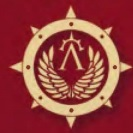

# 0333 铁翼 Ironwing

精校状态：中文行文已逐段精校，部分术语仍为暂定

分类：通用概念 / 帝国 Imperium / 中央政务部 Adeptus Terra / 阿斯塔特修会 Adeptus Astartes

原文来源：https://www.bilibili.com/opus/1026954580618903555

原作者：帝国神选罐头

原文时间：2025年01月27日 10:28

[返回分类目录](目录.md) · [全书目录](../../目录.md)

原篇名：钢翼 Ironwing

<!-- A0333-B0001 -->
**英文原文**

The Ironwing was one of the six specialized "wings" of the Dark Angels Space Marine Legion during the Great Crusade and Horus Heresy.

<!-- /A0333-B0001 -->

<!-- A0333-B0002 -->

原译文

钢翼是大远征和荷鲁斯叛乱期间黑暗天使星际战士军团的六个特殊“翼”之一。

**校订译文**

铁翼是黑暗天使军团在大远征及荷鲁斯之乱时期的六个专门作战分支之一。

<!-- /A0333-B0002 -->

<!-- A0333-B0003 图片 -->

<!-- A0333-B0004 -->

原译文

Ironwing Symbol 钢翼标志

**校订译文**

Ironwing Symbol 铁翼标志

<!-- /A0333-B0004 -->

<!-- A0333-B0005 -->
## Overview 概述

<!-- /A0333-B0005 -->

<!-- A0333-B0006 -->
**英文原文**

The Ironwing was dedicated to the use of overwhelming firepower on the field of battle, to confound the foe by means of barrage and conflagration, to defy their riposte with inviolate armour and carry the day by means of force alone. It was not a subtle Wing, composed as it was of the majority of the Legion's armoured vehicles, heavy Dreadnoughts and field artillery batteries, a force ill-equipped for operations reliant on stealth or subterfuge. Yet, they excelled at the breaking of fortresses by superior firepower and the rapid onslaught of massed war engines to overrun and annihilate an unprepared foe in the open field. Its Marshals were experts on the engagement and destruction of enemy war machines and heavy guns, often called upon to see to the destruction of those apocalyptic engines of destruction encountered by the Legion in its lonely crusade. Though this deployment of massed war engines was by far the most renowned aspect of the Ironwing, it was not the only facet to their doctrine of overwhelming strength. As a merging of the old Hosts of Iron and Stone, the Ironwing also included a substantial number of initiates from the infantry arms of the Legion, mostly those attached to heavy weapon support units, breacher cadres and Terminator squadrons. Indeed, during the last years of the Great Crusade, the Ironwing fielded the largest concentration of Terminators not only in the Dark Angels but in any of the Legions, including a number of experimental patterns of armour unknown in the panoply of other forces. Often employed en masse to storm fortresses or repel the onslaught of the enemy, these warriors earned a fearsome reputation within the Legion, many retaining the old emblem of the Host of Stone and assuming the title of Stoneborn. The brutal attrition of the early years of the Horus Heresy would decimate the ranks of these valiant warriors, ever first in attack or defence of the Legion, and by the end of the rebellion they were a shadow of their former strength.

<!-- /A0333-B0006 -->

<!-- A0333-B0007 -->

原译文

钢翼致力于在战场上使用压倒性的火力，通过弹幕和火焰来击败敌人，用不容亵渎的盔甲蔑视他们的还击，仅靠力量来度过难关。这不是一个灵巧的翼，因为它是由军团的大多数装甲载具、重型无畏和野战炮兵组成的，一只装备不完善于依靠隐形或秘密手段进行作战的部队。然而，他们擅长用强大的火力和大量战争引擎的快速攻击来摧毁堡垒，在开阔的战场上击败并消灭一个毫无准备的敌人。它的元帅们是交战和摧毁敌方战争机械和重型枪支的专家，经常被要求摧毁军团在孤独的远征中遇到的那些末日毁灭引擎。尽管这种大规模战争引擎的部署是钢翼最著名的方面，但这并不是他们压倒性力量学说的唯一方面。作为旧的钢铁与磐石天军的合并，钢翼还包括大量来自军团步兵部门的信徒，主要是那些隶属于重武器支援部队、破坏者骨干和终结者中队。事实上，在大远征的最后几年，钢翼不仅在黑暗天使中，而且在任何军团中都部署了最集中的终结者，包括许多其他部队中未知的实验性装甲型号。这些战士经常被集体用来冲击堡垒或击退敌人的进攻，在军团中赢得了可怕的声誉，许多人保留了磐石天军的旧徽章，并获得了磐石之子的称号。荷鲁斯叛乱早期的残酷消耗摧毁了这些英勇战士的队伍，他们是军团进攻或防御的第一人，到叛乱结束时，他们已经失去了以前的力量。

**校订译文**

铁翼以压倒性的战场火力见长，用弹幕与烈焰摧垮敌军，凭坚不可摧的护甲抵御还击，单靠强大武力赢得胜利。它集中了军团大部分装甲载具、重型无畏机甲和野战炮兵，不擅长隐蔽与欺骗，却精于用优势火力轰垮要塞，或以大批战争引擎迅猛推进，在旷野中碾碎措手不及的敌人。铁翼元帅擅长对抗敌方战争机器与重炮，军团在孤独远征中遭遇灾难级毁灭引擎时，常由他们负责摧毁。大规模机械化作战虽是铁翼最著名的特征，却并非其压倒性力量学说的全部。铁翼由古老的钢铁与磐石两支天军合并而成，也纳入大量步兵成员，主要来自重武器支援部队、攻坚部队和终结者中队。大远征最后几年，铁翼集中的终结者兵力，不仅为黑暗天使最多，在所有军团中也居首位，其中包括其他军队没有的多种试验型护甲。这些战士常大规模投入要塞突击或抵御敌军猛攻，威名令人胆寒。许多人保留磐石天军旧徽，并自称“磐石之子”。他们总是冲在军团攻守最前线，荷鲁斯之乱初期的残酷消耗因此使其伤亡极重；到叛乱结束时，实力已远不如昔。

**校注：** Ironwing按326篇多数写法统一铁翼；breacher暂译攻坚者，与官译Devastator破坏者区分。

<!-- /A0333-B0007 -->

<!-- A0333-B0008 -->
**英文原文**

In terms of their skill in engineering, while the siegemasters of the IV and VII Legions approached their craft in terms of higher walls and heavier guns, superior logistics and crude calculations of risk versus reward. For their counterparts within the knighthood of Caliban it was the maze that dominated. The martial expression of the Spiral Path, it formed the basis of that world’s fortress-building traditions. Within their engineering, the Ironwing brought the byzantine rigour of masters of the Calibanite school. Constructing labyrinths of mirrors and Holo-Fields, blind tunnels, installing portcullises that led nowhere, and engineering randomised systems of openings and closures of the communications and supply lanes that would alter the layout of movement within their fortresses on such a regular basis they could change every half-hour. They would engineer choke points, murder holes and enfilades. Mine bridges, clear firing lines, and install Tarantula sentinel batteries in every corridor. Redouble their guards before battle, reordered the watches, and assign the knights of their Orders to critical junctions. Even going so far as to reinforce the cabling from void banks, adding backups for redundancy, and to double their pre-existing capacity. Individual garrison commanders would have as much knowledge as was needed to hold their section of a bastion’s defensive circles, but no more. Only their Masters would hold the secret codes and encryption algorithms that would allow them to navigate its breadth fully.

<!-- /A0333-B0008 -->

<!-- A0333-B0009 -->

原译文

就他们的工程技能而言，第四和第七军团的攻城大师们在更高的墙壁，更重的枪支、优越的后勤和风险与回报的粗略计算方面接近他们的技艺。对于卡利班骑士团中的同行来说，迷阵占据了主导地位。螺旋之路的军事表现，形成了那个世界堡垒建筑传统的基础。在他们的工程中，钢翼带来了卡利班学派大师们拜占庭式的严谨。建造迷宫般的镜子和全息立场、盲道、通往无处的吊闸，设计通信和补给通道的随机开合系统，使得他们堡垒内的移动布局可以如此频繁地改变，甚至每半小时就会变化一次。他们会设计阻塞点、陷坑和纵射阵地。在每条走廊上埋设地雷，清理射击线，并安装狼蛛哨兵炮台。在战斗前加倍守卫，重新安排监视，并将骑士团的骑士分配到关键路口。甚至进一步加强来自虚空库的布线，增加更多的增援，并将其预设的容量增加一倍。各个驻军指挥官将拥有足以坚守其所在堡垒防御圈区域所需的知识，但不会更多。只有他们的上级才掌握着能让他们全面掌控其范围的秘密代码和加密算法。

**校订译文**

在工程学上，第四与第七军团的攻城专家讲究更高的城墙、更重的火炮、更强的后勤，以及粗略衡量风险与收益；卡利班骑士传统中的同行，则以迷宫为核心。作为“螺旋之路”在军事上的体现，迷宫构成了卡利班筑城传统的基础。铁翼将这一流派繁复而严密的设计运用于防御：以镜面与全息场构筑迷阵，开凿死路，设置通往无用空间的吊闸，并让交通和补给通道随机启闭，使堡垒内的通行布局最频繁可每半小时变化一次。他们设置隘口、射杀孔与纵射阵地，在桥梁布雷，清理射界，在每条走廊安设狼蛛哨戒炮台。战前，他们加倍部署守卫，调整轮值，把各骑士团的战士派往关键节点；还会加强虚空机组的线缆，增设冗余备份，将原有容量提升一倍。每名驻防指挥官只掌握守住自己那段防御圈所必需的信息；唯有导师拥有秘密代码与加密算法，能够通行整个堡垒。

**校注：** Mine bridges是“在桥梁上布雷”，原译错接为每条走廊布雷；murder holes是防御射杀孔，非陷坑。void banks原文未展开，暂译虚空机组，不擅增技术规格。

<!-- /A0333-B0009 -->

<!-- A0333-B0010 -->
**英文原文**

There was a method behind such sparsity of information: if the Legion’s own officers could not navigate a fortress beyond their own redoubts then an intruder could not help but be confounded, and no single act of carelessness or treachery could ever see the entire bastion fall. Such was the philosophy of the Lion.

<!-- /A0333-B0010 -->

<!-- A0333-B0011 -->

原译文

在这种信息匮乏的背后存在着一种条理：如果军团自己的军官都无法在他们自己的防御工事之外驾驭一座堡垒，那么入侵者就必然会感到困惑，而且任何一次疏忽或背叛行为都不可能导致整个堡垒的沦陷。这就是狮子的哲学。

**校订译文**

这种严格限制信息的做法自有道理：如果连军团军官都无法在自己的防区之外自由辨路，入侵者就更会迷失；任何一次疏忽或背叛，也不至于导致整座堡垒沦陷。这正是雄狮的理念。

<!-- /A0333-B0011 -->

<!-- A0333-B0012 -->
**英文原文**

The Knights of the Ironwing were capable of performing delicate surgeries upon their machines, and often took mortal apprentices who would assist the Knights in their duties. Given the wealth of technology fielded by the Ironwing, it’s inner circle was dominated by Forge-lords of the legion, as of all the Wings save the Dreadwing the Ironwing was most hated by the Mechanicum, for the Ironwing and its masters paid little heed to the creed of Mars and employed much technology that was forbidden to the adepts of the Mechanicum.

<!-- /A0333-B0012 -->

<!-- A0333-B0013 -->

原译文

钢翼骑士能够在他们的机械上进行精细的处理，并且经常带凡人学徒来协助骑士履行职责。鉴于钢翼拥有丰富的技术，它的内环由军团的铸造领主主导，就像除了恐翼之外的所有翼一样，钢翼最受机械神教的憎恨，因为钢翼及其导师们几乎不理会火星的信条，并使用了许多机械神教所禁止的技术。

**校订译文**

铁翼骑士能对自己的机器实施如外科手术般精细的维修，也常收凡人为学徒，协助完成职责。由于掌握丰富技术，铁翼内环主要由军团铸造领主构成。在六翼中，除恐翼之外，最受机械教憎恶的就是铁翼：它及其导师很少理会火星教条，还使用了许多机械教技术专家被禁止接触的科技。

**校注：** of all the Wings save the Dreadwing 表示排除恐翼后铁翼最受机械教憎恶，原译使比较关系不清。

<!-- /A0333-B0013 -->

<!-- A0333-B0014 -->
**英文原文**

Ironwing units were equipped with heavily armoured vehicles such as Land Raiders and Dreadnoughts, alongside unique relic war machines for their missions. They also utilized forbidden technology such as the Excindio Battle-Automata, themselves neutered remains of the legendary Iron Men. The Masters and Forge-wrights of the wing were known to be equipped with Artificer Harnesses The Wing employed a unique Terran machine language known as Himalazian Base Code.

<!-- /A0333-B0014 -->

<!-- A0333-B0015 -->

原译文

钢翼部队配备了兰德掠袭者和无畏等重型装甲载具，以及执行任务的独特战争遗机。他们还使用了毁灭者自动机兵等被禁止的技术，这些技术本身就阉割自传说的铁人的遗骸。众所周知，钢翼的导师和铸造士都配备了精工套件。钢翼使用了一种独特的泰拉机器语言，称为喜马拉雅基础代码。

**校订译文**

铁翼执行任务时，使用兰德掠袭者战车、无畏机甲等重装装备，以及独一无二的古老战争机器。他们也采用毁灭者自动机兵等禁忌技术；这些机兵实际上是传说中的铁人残存个体，被限制、削弱后重新利用。铁翼的导师与铸炉工匠常装备精工套件，并使用一套独特的泰拉机器语言，称为“喜马拉雅基础代码”。

**校注：** neutered remains指功能受限的铁人残存个体，不直接断定为尸体或残骸；其机械类型仍遵循核心全名毁灭者自动机兵。

<!-- /A0333-B0015 -->

<!-- A0333-B0016 -->
**英文原文**

The Voted-Lieutenant of the Ironwing was known as the Ironbringer.

<!-- /A0333-B0016 -->

<!-- A0333-B0017 -->

原译文

钢翼的受选副官被称为钢铁使者。

**校订译文**

铁翼的受选副官称为“钢铁使者”。

<!-- /A0333-B0017 -->

<!-- A0333-B0018 -->
## Known Members 著名成员

<!-- /A0333-B0018 -->

<!-- A0333-B0019 -->
**英文原文**

Titus — Dreadnought and Voted Lieutenant during the Horus Heresy

<!-- /A0333-B0019 -->

<!-- A0333-B0020 -->

原译文

泰图斯 — 荷鲁斯叛乱时期的无畏和受选副官

**校订译文**

泰图斯——荷鲁斯之乱时期的无畏机甲战士兼受选副官。

<!-- /A0333-B0020 -->

<!-- A0333-B0021 -->
**英文原文**

Iksal Mordwen — Voted Lieutenant during the Siege of Mykana in the Great Crusade

<!-- /A0333-B0021 -->

<!-- A0333-B0022 -->

原译文

艾卡沙·莫德文 — 大远征米卡纳围城期间的受选副官

**校订译文**

艾卡沙·莫德文 — 大远征米卡纳围城期间的受选副官

<!-- /A0333-B0022 -->

<!-- A0333-B0023 -->
**英文原文**

Duriel — Voted Lieutenant during the Muspel Campaign of the Great Crusade

<!-- /A0333-B0023 -->

<!-- A0333-B0024 -->

原译文

都瑞尔 — 大远征的穆斯佩尔战役中的受选副官

**校订译文**

都瑞尔 — 大远征的穆斯佩尔战役中的受选副官

<!-- /A0333-B0024 -->

本篇核心术语与暂定项

以下列出本篇出现的英文原形及核心术语表用词。同形词可能指不同对象，具体词义以本篇正文和校注为准；单复数、别名和仅见于图注的名称可能尚未列入。完整候选见[术语表](../../术语表/双语术语候选.csv)。

| 英文 | 采用中文 | 状态 |
| --- | --- | --- |
| Dark Angels | 黑暗天使 | 官方已核对 |
| Terminator | 终结者 | 官方已核对 |
| Horus Heresy | 荷鲁斯之乱 | 官方已核对 |
| Mechanicum | 机械教 | 暂定·历史称谓 |
| Great Crusade | 大远征 | 暂定·官方待核 |
| Murder | 谋杀 | 暂定·官方待核 |
| Horus | 荷鲁斯 | 暂定·官方待核 |
| Excindio | 灭绝者 | 暂定·官方待核 |
| Mars | 火星 | 暂定·官方待核 |
| Caliban | 卡利班 | 暂定·官方待核 |
| Excindio Battle-Automata | 灭绝者自动机兵 | 暂定·官方待核 |
| Clear | 清明 | 暂定·官方待核 |
| Space Marine Legion | 星际战士军团 | 暂定·官方待核 |
| Lieutenant | 副官 | 暂定·官方待核 |
| Dreadwing | 恐翼 | 暂定·官方待核 |
| Space Marine | 星际战士 | 暂定·官方待核 |
| Terminators | 终结者 | 暂定·官方待核 |
| Land Raiders | 兰德掠袭者 | 暂定·官方待核 |
| Artificer | 技工 | 暂定·官方待核 |
| Mortal | 凡人 | 暂定·官方待核 |
| Initiates | 进阶者 | 官方已核 |
| Host | 天军 | 暂定·官方待核 |
| Calibanite | 卡利班诸语 | 暂定·官方待核 |
| Ironwing | 铁翼 | 暂定·官方待核 |
| Host of Stone | 磐石天军 | 暂定·官方待核 |
| Stoneborn | 磐石之子 | 暂定·官方待核 |
| Himalazian Base Code | 喜马拉雅基础代码 | 暂定·官方待核 |
| Ironbringer | 钢铁使者 | 暂定·官方待核 |
| Duriel | 杜里尔 | 暂定·官方待核 |
| Dreadnought | 无畏机甲 | 暂定·官方待核 |
| The Dark | 《黑暗》 | 暂定·官方待核 |
| Muspel | 穆斯贝尔 | 暂定·官方待核 |
| Heed | 希德 | 暂定·官方待核 |

