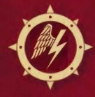

# 0334 风暴翼 Stormwing

精校状态：中文行文已逐段精校，部分术语仍为暂定

分类：通用概念 / 帝国 Imperium / 中央政务部 Adeptus Terra / 阿斯塔特修会 Adeptus Astartes

原文来源：https://www.bilibili.com/opus/1034708663050174468

原作者：帝国神选罐头

原文时间：2025年02月17日 07:58

[返回分类目录](目录.md) · [全书目录](../../目录.md)

<!-- A0334-B0001 -->
**英文原文**

The Stormwing was one of the six specialized "Wings" of the Dark Angels Space Marine Legion during the Great Crusade and Horus Heresy.

<!-- /A0334-B0001 -->

<!-- A0334-B0002 -->

原译文

风暴翼是大远征和荷鲁斯叛乱期间黑暗天使星际战士的六个专业“翼”之一。

**校订译文**

风暴翼是黑暗天使军团在大远征及荷鲁斯之乱时期的六个专门作战分支之一。

<!-- /A0334-B0002 -->

<!-- A0334-B0003 图片 -->

<!-- A0334-B0004 -->

原译文

Symbol of the Stormwing 风暴翼标志

**校订译文**

Symbol of the Stormwing 风暴翼标志

<!-- /A0334-B0004 -->

<!-- A0334-B0005 -->
## Overview 概述

<!-- /A0334-B0005 -->

<!-- A0334-B0006 -->
**英文原文**

The largest of all the Wings, the Stormwing incorporated the majority of the Dark Angels line infantry, training battalions and mobile ordnance batteries within its ranks. The members of this Wing were drilled in the disciplined and stalwart arts of close order warfare and set-piece battles, unshakable on defence and resolute on attack. Its veteran warriors were the core of the Legion's infantry companies, capable of executing complex manoeuvres and formations under the heaviest enemy fire. When the Legion took to the field of battle en masse the veterans of the Stormwing stood in the front ranks, serving to steel the resolve of their brethren and to oversee the execution of orders in the chaos of battle; valued more for their attunement to the subtle shift of war as the massed ranks of friend and foe collided than their vaunted skill-at-arms.

<!-- /A0334-B0006 -->

<!-- A0334-B0007 -->

原译文

作为所有翼中最大的一支，风暴翼在其队伍中纳入了大多数黑暗天使步兵、训练营和移动军械炮组。这个翼的成员被训练成有纪律和紧密阵型作战与预设战场战斗的精湛技艺，防守不可动摇，进攻果断。其经验丰富的战士是军团步兵连队的核心，能够在敌人最猛烈的火力下执行复杂的机动和编队。当军团集体进入战场时，风暴翼的老兵站在前线，在混乱的战斗中坚定兄弟们的决心，监督命令的执行；他们更看重的是，随着敌友队伍的碰撞，他们对战争微妙变化的适应能力，而不是他们吹嘘的武器技能。

**校订译文**

风暴翼规模为六翼之首，囊括黑暗天使大部分战列步兵、训练营与机动炮兵连。其成员精通纪律严明、稳健顽强的密集队形作战与正规会战，守时岿然不动，攻时坚定不移。老兵是军团步兵连队的骨干，即使处于最猛烈的敌火下，也能完成复杂机动与队形变换。军团大规模列阵出战时，风暴翼老兵站在最前列，坚定同袍的意志，并确保命令在混乱中得到执行。他们最受重视的，并非广受赞誉的武艺，而是在敌我大军碰撞时把握战局细微变化的能力。

**校注：** vaunted skill-at-arms指广受称誉的武艺，非必然自吹自擂；training battalions为训练部队编制，不是地理上的训练营地。

<!-- /A0334-B0007 -->

<!-- A0334-B0008 -->
**英文原文**

The inner circles of the Stormwing were notoriously difficult for initiates to gain admittance to, with rigorous trials for those seeking to assume the mantle of Marshal of the Stormwing. Only veterans of the largest engagements were honoured with titles in the Wing, including both senior officers and grizzled warriors of the line, for among their number the scars of war were the most treasured badges of honour. This inner circle also included a surprising number of the Legion's Apothecarion, who were often at the centre of the battle's fury and integral to the massed infantry assaults for which the Stormwing was famous. Indeed, at first the Master of the Stormwing had also held the title of Master of the Apothecarion for the First Legion. In contrast to the inner circle, whose ranks rarely changed and were accounted one of the most conservative and tradition bound groups within the Legion, the outer circles were in constant flux. The Stormwing also specialized in boarding operations.

<!-- /A0334-B0008 -->

<!-- A0334-B0009 -->

原译文

众所周知，风暴翼的内环很难让信徒进入，那些寻求担任风暴翼元帅的人会受到严格的考验。只有参加过最大规模战斗的老兵才能获得翼的荣誉，包括高级军官和头发花白的战士，因为在他们当中，战争的伤痕是最珍贵的荣誉徽章。这个内环还包括数量惊人的军团药剂师，他们经常处于战斗的中心，是风暴翼著名的大规模步兵攻击的组成部分。事实上，起初，风暴翼导师还拥有第一军团药剂大师的头衔。与内环相比，外环则处于不断变化之中，内环的排名很少变化，被认为是军团中最保守、最受传统束缚的群体之一。风暴翼还专门从事跳帮行动。

**校订译文**

风暴翼成员想进入内环极为困难，志在成为风暴翼元帅者更须经受严格考验。只有经历过最大规模会战的老兵，才能获授翼内称号；无论高级军官，还是饱经战火的普通战士，身上的战伤都是最珍贵的荣誉。内环中还有数量惊人的药剂部门成员，他们往往身处激战中心，对风暴翼闻名的大规模步兵突击不可或缺。事实上，早期风暴翼导师还兼任第一军团的药剂大师。内环人员很少更换，是军团最保守、最拘守传统的群体之一；外围层级的人员则始终流动不息。风暴翼也擅长跳帮作战。

<!-- /A0334-B0009 -->

<!-- A0334-B0010 -->
**英文原文**

Stormwing units typically consisted of Breacher Squads and Assault Squads with Boarding Shields.

<!-- /A0334-B0010 -->

<!-- A0334-B0011 -->

原译文

风暴翼单位通常由破坏者小队和带跳帮盾的突击小队组成。

**校订译文**

风暴翼通常编有攻坚小队，以及配备跳帮盾的突击小队。

**校注：** Breacher Squads暂统一攻坚小队，以免与Devastator Squads的官方译名破坏者小队混同；此处不是宣称该大远征单位已有直接官译。

<!-- /A0334-B0011 -->

<!-- A0334-B0012 -->
**英文原文**

The Voted-Lieutenant of the Stormwing was known as the Stormbringer.

<!-- /A0334-B0012 -->

<!-- A0334-B0013 -->

原译文

风暴翼的受选副官被称为风暴使者。

**校订译文**

风暴翼的受选副官被称为风暴使者。

<!-- /A0334-B0013 -->

<!-- A0334-B0014 -->
**英文原文**

As of M41, the unit no longer exists.

<!-- /A0334-B0014 -->

<!-- A0334-B0015 -->

原译文

在M41，该单位已不存在。

**校订译文**

至第41千年，风暴翼已不复存在。

<!-- /A0334-B0015 -->

<!-- A0334-B0016 -->
## Notable Members 著名成员

<!-- /A0334-B0016 -->

<!-- A0334-B0017 -->
**英文原文**

Calloson - Stormbringer during the Horus Heresy

<!-- /A0334-B0017 -->

<!-- A0334-B0018 -->

原译文

卡洛森 - 荷鲁斯叛乱时期的风暴使者

**校订译文**

卡洛森——荷鲁斯之乱时期的风暴使者。

<!-- /A0334-B0018 -->

<!-- A0334-B0019 -->
**英文原文**

Kaye - Great Crusade-era Sergeant

<!-- /A0334-B0019 -->

<!-- A0334-B0020 -->

原译文

凯 - 大远征时期军士

**校订译文**

凯 - 大远征时期军士

<!-- /A0334-B0020 -->

本篇核心术语与暂定项

以下列出本篇出现的英文原形及核心术语表用词。同形词可能指不同对象，具体词义以本篇正文和校注为准；单复数、别名和仅见于图注的名称可能尚未列入。完整候选见[术语表](../../术语表/双语术语候选.csv)。

| 英文 | 采用中文 | 状态 |
| --- | --- | --- |
| Dark Angels | 黑暗天使 | 官方已核对 |
| Horus Heresy | 荷鲁斯之乱 | 官方已核对 |
| Rigorous | 严峻号 | 暂定·官方待核 |
| Great Crusade | 大远征 | 暂定·官方待核 |
| Horus | 荷鲁斯 | 暂定·官方待核 |
| Master | 导师（审判庭职衔）／舰务官（舰员职务） | 语境定译·官方待核 |
| Master of the Apothecarion | 药剂大师 | 暂定·官方待核 |
| Apothecarion | 药剂部 | 暂定·官方待核 |
| Space Marine Legion | 星际战士军团 | 暂定·官方待核 |
| Lieutenant | 副官 | 暂定·官方待核 |
| Scars | 伤疤 | 暂定·官方待核 |
| Space Marine | 星际战士 | 暂定·官方待核 |
| Veteran | 老兵 | 暂定·官方待核 |
| Sergeant | 军士 | 暂定·官方待核 |
| Assault Squads | 突击小队 | 暂定·官方待核 |
| Initiates | 进阶者 | 官方已核 |
| Marshal | 元帅 | 官方已核对 |
| The Dark | 《黑暗》 | 暂定·官方待核 |

