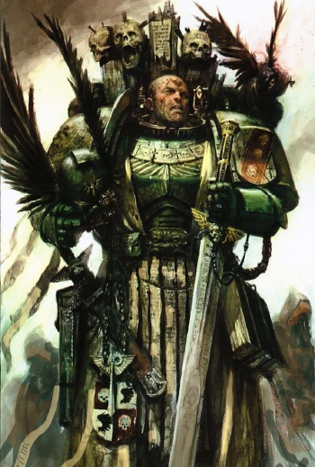

# 0335 大导师 Grand Master

精校状态：中文行文已逐段精校，部分术语仍为暂定

分类：通用概念 / 帝国 Imperium / 中央政务部 Adeptus Terra / 阿斯塔特修会 Adeptus Astartes

原文来源：https://www.bilibili.com/opus/1114154927950659587

原作者：帝国神选罐头

原文时间：2025年09月19日 10:10

[返回分类目录](目录.md) · [全书目录](../../目录.md)

<!-- A0335-B0001 -->
**英文原文**

A Dark Angels Grand Master is a rank used by Dark Angels and their Successor Chapters for certain senior officers.

<!-- /A0335-B0001 -->

<!-- A0335-B0002 -->

原译文

黑暗天使大导师是黑暗天使及其子战团为某些高级军官使用的军衔。

**校订译文**

“大导师”是黑暗天使及其子战团授予部分高级军官的职衔。

<!-- /A0335-B0002 -->

<!-- A0335-B0003 图片 -->

<!-- A0335-B0004 -->

原译文

Dark Angels Company Master 黑暗天使连队导师

**校订译文**

Dark Angels Company Master 黑暗天使连队导师

<!-- /A0335-B0004 -->

<!-- A0335-B0005 -->
## Overview 概述

<!-- /A0335-B0005 -->

<!-- A0335-B0006 -->
**英文原文**

Contrary to most Chapters which are led by Chapter Masters, the Dark Angels and their Successors maintain close ties, bound by an Inner Circle of Grand Masters sworn to hunt down the Fallen. Dark Angels Grand Masters are often given leadership over specific duties and organizations, such as the Chapter Fleet, Deathwing, Ravenwing, and Librarium. The Dark Angels maintain 13 Grand Masters (the 10 Company Masters and the Masters of the Chaplains, Librarians, and the Armoury). Overall command of the Dark Angels and the Unforgiven is given to the Supreme Grand Master, always a member of the Dark Angels Inner Circle who is selected by his predecessor.

<!-- /A0335-B0006 -->

<!-- A0335-B0007 -->

原译文

与大多数由战团长领导的战团相反，黑暗天使和他们的子战团保持着密切的联系，受到发誓要追捕堕天使的大导师的内环的约束。黑暗天使大导师通常被赋予领导特定职责和组织的权力，如战团舰队、死翼、鸦翼和智库。黑暗天使拥有13位大导师（10位连队导师和牧师、智库和军械库导师）。黑暗天使和不可饶恕者的总体指挥权交给了至高大导师，他始终是黑暗天使内环的成员，由他的前任选出。

**校订译文**

多数星际战士战团各由自己的战团长统领，而黑暗天使与其后裔战团则通过大导师组成的内环保持紧密联系，共同誓言追捕堕天使。大导师往往分别掌管某项职责或专门机构，例如舰队、死翼、鸦翼及智库。黑暗天使共有十三位大导师：十位连队导师，以及分别主管教士、智库员和军械库的三位导师。黑暗天使及整个戴罪者群体的最高指挥权归于至高大导师；此人必为黑暗天使内环成员，由前任指定继承。

**校注：** 本篇的十三名大导师说法与其他篇目对Master／Grand Master层级的描述可能不完全一致，按给定原文保留人数和职务，不擅增减。

<!-- /A0335-B0007 -->

<!-- A0335-B0008 -->
## Notable Dark Angels Supreme Grand Masters 著名黑暗天使至高大导师

<!-- /A0335-B0008 -->

<!-- A0335-B0009 -->
**英文原文**

Farith Redloss - First Supreme Grand Master

<!-- /A0335-B0009 -->

<!-- A0335-B0010 -->

原译文

法瑞斯·瑞德罗斯 - 第一名至高大导师

**校订译文**

法瑞斯·雷德洛斯——首任至高大导师。

<!-- /A0335-B0010 -->

<!-- A0335-B0011 -->
**英文原文**

Puriel - M32 during the War of the Beast

<!-- /A0335-B0011 -->

<!-- A0335-B0012 -->

原译文

普瑞尔 - M32野兽战争期间

**校订译文**

普瑞尔 - M32野兽战争期间

<!-- /A0335-B0012 -->

<!-- A0335-B0013 -->
**英文原文**

Purson - M32

<!-- /A0335-B0013 -->

<!-- A0335-B0014 -->

原译文

布松 - M32

**校订译文**

布松 - M32

<!-- /A0335-B0014 -->

<!-- A0335-B0015 -->
**英文原文**

Alloken - M33

<!-- /A0335-B0015 -->

<!-- A0335-B0016 -->

原译文

阿洛肯 - M33

**校订译文**

阿洛肯 - M33

<!-- /A0335-B0016 -->

<!-- A0335-B0017 -->
**英文原文**

Morderan - M33

<!-- /A0335-B0017 -->

<!-- A0335-B0018 -->

原译文

莫德兰 - M33

**校订译文**

莫德兰 - M33

<!-- /A0335-B0018 -->

<!-- A0335-B0019 -->

原译文

Zapherael 撒弗拉尔

**校订译文**

Zapherael 撒弗拉尔

<!-- /A0335-B0019 -->

<!-- A0335-B0020 -->
**英文原文**

Armaros - M34

<!-- /A0335-B0020 -->

<!-- A0335-B0021 -->

原译文

阿玛洛斯 - M34

**校订译文**

阿玛洛斯 - M34

<!-- /A0335-B0021 -->

<!-- A0335-B0022 -->
**英文原文**

Tatraziel - M36, during the Age of Apostasy

<!-- /A0335-B0022 -->

<!-- A0335-B0023 -->

原译文

塔特拉齐尔 - M36，叛教时代时期

**校订译文**

塔特拉齐尔 - M36，叛教时代时期

<!-- /A0335-B0023 -->

<!-- A0335-B0024 -->

原译文

Amathiel 阿玛提尔

**校订译文**

Amathiel 阿玛提尔

<!-- /A0335-B0024 -->

<!-- A0335-B0025 -->

原译文

Duremis 杜列米斯

**校订译文**

Duremis 杜列米斯

<!-- /A0335-B0025 -->

<!-- A0335-B0026 -->

原译文

Hazrael 哈兹瑞尔

**校订译文**

Hazrael 哈兹瑞尔

<!-- /A0335-B0026 -->

<!-- A0335-B0027 -->

原译文

Tyrhis 提尔希斯

**校订译文**

Tyrhis 提尔希斯

<!-- /A0335-B0027 -->

<!-- A0335-B0028 -->
**英文原文**

Anaziel - M37

<!-- /A0335-B0028 -->

<!-- A0335-B0029 -->

原译文

阿纳兹尔 - M37

**校订译文**

阿纳兹尔 - M37

<!-- /A0335-B0029 -->

<!-- A0335-B0030 -->
**英文原文**

Nahariel - M38

<!-- /A0335-B0030 -->

<!-- A0335-B0031 -->

原译文

纳哈瑞尔 - M38

**校订译文**

纳哈瑞尔 - M38

<!-- /A0335-B0031 -->

<!-- A0335-B0032 -->
**英文原文**

Zakaron - M38

<!-- /A0335-B0032 -->

<!-- A0335-B0033 -->

原译文

扎卡戎 - M38

**校订译文**

扎卡戎 - M38

<!-- /A0335-B0033 -->

<!-- A0335-B0034 -->

原译文

Ezerius 埃泽留斯

**校订译文**

Ezerius 埃泽留斯

<!-- /A0335-B0034 -->

<!-- A0335-B0035 -->

原译文

Raphael 拉斐尔

**校订译文**

Raphael 拉斐尔

<!-- /A0335-B0035 -->

<!-- A0335-B0036 -->

原译文

Dameus 达缪斯

**校订译文**

Dameus 达缪斯

<!-- /A0335-B0036 -->

<!-- A0335-B0037 -->

原译文

Cariontis 卡瑞翁提斯

**校订译文**

Cariontis 卡瑞翁提斯

<!-- /A0335-B0037 -->

<!-- A0335-B0038 -->

原译文

Aradiel 阿拉迪尔

**校订译文**

Aradiel 阿拉迪尔

<!-- /A0335-B0038 -->

<!-- A0335-B0039 -->
**英文原文**

Naberius - M41

<!-- /A0335-B0039 -->

<!-- A0335-B0040 -->

原译文

纳贝流士 - M41

**校订译文**

纳贝流士 - M41

<!-- /A0335-B0040 -->

<!-- A0335-B0041 -->
**英文原文**

Azrael - Current Supreme Grand Master

<!-- /A0335-B0041 -->

<!-- A0335-B0042 -->

原译文

阿兹瑞尔 - 现任至高大导师

**校订译文**

阿兹瑞尔 - 现任至高大导师

<!-- /A0335-B0042 -->

<!-- A0335-B0043 -->
## Notable Grand Masters 著名大导师

<!-- /A0335-B0043 -->

<!-- A0335-B0044 -->
**英文原文**

Bartholomew - The first Grand Master of the Deathwing

<!-- /A0335-B0044 -->

<!-- A0335-B0045 -->

原译文

巴沙洛缪 - 第一位死翼大导师

**校订译文**

巴沙洛缪 - 第一位死翼大导师

<!-- /A0335-B0045 -->

<!-- A0335-B0046 -->
**英文原文**

Belial - Grand Master of the Deathwing

<!-- /A0335-B0046 -->

<!-- A0335-B0047 -->

原译文

贝利亚 - 死翼大导师

**校订译文**

贝利亚 - 死翼大导师

<!-- /A0335-B0047 -->

<!-- A0335-B0048 -->
**英文原文**

Ezekiel - Grand Master of the Librarians

<!-- /A0335-B0048 -->

<!-- A0335-B0049 -->

原译文

以西结 - 智库大导师

**校订译文**

以西结——智库员大导师。

<!-- /A0335-B0049 -->

<!-- A0335-B0050 -->
**英文原文**

Josuah - Former Grand Master of the Deathwing

<!-- /A0335-B0050 -->

<!-- A0335-B0051 -->

原译文

约书亚 - 前死翼大导师

**校订译文**

约书亚 - 前死翼大导师

<!-- /A0335-B0051 -->

<!-- A0335-B0052 -->
**英文原文**

Sachael - Grand Master of the Deathwing in M32

<!-- /A0335-B0052 -->

<!-- A0335-B0053 -->

原译文

萨基尔 - M32的死翼大导师

**校订译文**

萨凯尔——第32千年的死翼大导师。

**校注：** Sachael按329篇统一萨凯尔，与Zadkiel扎德基尔不是同一姓名。

<!-- /A0335-B0053 -->

<!-- A0335-B0054 -->
**英文原文**

Sammael - Grand Master of the Ravenwing

<!-- /A0335-B0054 -->

<!-- A0335-B0055 -->

原译文

萨麦尔 - 鸦翼大导师

**校订译文**

萨麦尔 - 鸦翼大导师

<!-- /A0335-B0055 -->

<!-- A0335-B0056 -->
**英文原文**

Sapphon - Grand Master of Chaplains

<!-- /A0335-B0056 -->

<!-- A0335-B0057 -->

原译文

萨芬 - 牧师大导师

**校订译文**

萨芬——教士大导师。

<!-- /A0335-B0057 -->

<!-- A0335-B0058 -->
**英文原文**

Yuriel - Former Master of the Deathwing

<!-- /A0335-B0058 -->

<!-- A0335-B0059 -->

原译文

尤瑞尔 - 前死翼大导师

**校订译文**

尤瑞尔 - 前死翼大导师

<!-- /A0335-B0059 -->

本篇核心术语与暂定项

以下列出本篇出现的英文原形及核心术语表用词。同形词可能指不同对象，具体词义以本篇正文和校注为准；单复数、别名和仅见于图注的名称可能尚未列入。完整候选见[术语表](../../术语表/双语术语候选.csv)。

| 英文 | 采用中文 | 状态 |
| --- | --- | --- |
| Dark Angels | 黑暗天使 | 官方已核对 |
| Age of Apostasy | 叛教时代 | 暂定·官方待核 |
| Master | 导师（审判庭职衔）／舰务官（舰员职务） | 语境定译·官方待核 |
| Librarium | 智库馆 | 暂定·官方待核 |
| Unforgiven | 戴罪者 | 暂定·官方待核 |
| Chapter | 战团 | 暂定·官方待核 |
| Azrael | 阿兹瑞尔 | 官方已核 |
| Sammael | 萨麦尔 | 官方已核 |
| Belial | 贝利亚 | 官方已核 |
| Ezekiel | 以西结 | 暂定·官方待核 |
| Armoury | 军械库 | 暂定·官方待核 |
| Supreme Grand Master | 至高大导师 | 暂定·官方待核 |
| Grand Master of the Librarians | 智库员大导师 | 暂定·官方待核 |
| Grand Master of the Deathwing | 死翼大导师 | 暂定·官方待核 |
| Grand Master of the Ravenwing | 鸦翼大导师 | 暂定·官方待核 |
| Grand Master of Chaplains | 教士大导师 | 暂定·官方待核 |
| Farith Redloss | 法瑞斯·雷德洛斯 | 暂定·官方待核 |
| The Beast | 野兽 | 暂定·官方待核 |
| Chaplains | 教士 | 暂定·官方待核 |
| Grand Master | 大导师 | 暂定·官方待核 |
| Naberius | 纳贝流士 | 暂定·官方待核 |
| The Dark | 《黑暗》 | 暂定·官方待核 |
| Sachael | 萨基尔 | 暂定·官方待核 |

