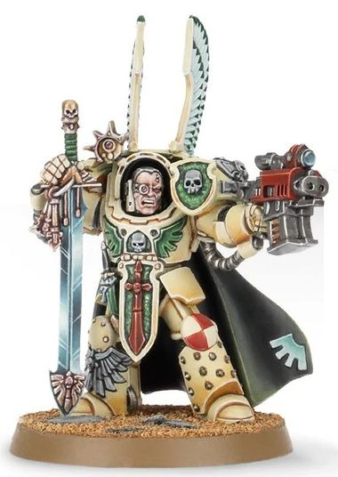

# 0336 死翼打击大师 Deathwing Strikemaster

精校状态：中文行文已逐段精校，部分术语仍为暂定

分类：通用概念 / 帝国 Imperium / 中央政务部 Adeptus Terra / 阿斯塔特修会 Adeptus Astartes

原文来源：https://www.bilibili.com/opus/1022076498476007432

原作者：帝国神选罐头

原文时间：2025年01月14日 06:58

[返回分类目录](目录.md) · [全书目录](../../目录.md)

<!-- A0336-B0001 -->
**英文原文**

Deathwing Strikemasters are specialized Lieutenant ranks, in the Dark Angels Chapter's Deathwing Company

<!-- /A0336-B0001 -->

<!-- A0336-B0002 -->

原译文

死翼打击大师是黑暗天使战团死翼连队中的专业副官军衔

**校订译文**

死翼打击大师是黑暗天使第一连死翼中的特殊副官职衔。

<!-- /A0336-B0002 -->

<!-- A0336-B0003 图片 -->

<!-- A0336-B0004 -->

原译文

Deathwing Strikemaster 死翼打击大师

**校订译文**

Deathwing Strikemaster 死翼打击大师

<!-- /A0336-B0004 -->

<!-- A0336-B0005 -->
**英文原文**

To earn such an esteemed rank, members of the Deathwing must carry out deeds of enormous bravery on countless battlefields, honing their skills as warriors and leaders. In battle, Strikemasters guide their Deathwing brethren with skill and pride, as they bring death to the Dark Angels' enemies.

<!-- /A0336-B0005 -->

<!-- A0336-B0006 -->

原译文

为了获得如此受人尊敬的军衔，死翼的成员必须在无数战场上表现出巨大的勇气，磨练他们作为战士和领导者的技能。在战斗中，打击大师们以技巧和自豪引导他们的死翼兄弟，为黑暗天使的敌人带来死亡。

**校订译文**

要赢得这一受人尊敬的职衔，死翼成员必须在无数战场立下英勇功绩，不断磨砺战技与统御能力。战斗中，打击大师以娴熟而自豪的指挥，率死翼兄弟歼灭黑暗天使之敌。

<!-- /A0336-B0006 -->

本篇核心术语与暂定项

以下列出本篇出现的英文原形及核心术语表用词。同形词可能指不同对象，具体词义以本篇正文和校注为准；单复数、别名和仅见于图注的名称可能尚未列入。完整候选见[术语表](../../术语表/双语术语候选.csv)。

| 英文 | 采用中文 | 状态 |
| --- | --- | --- |
| Dark Angels | 黑暗天使 | 官方已核对 |
| Lieutenant | 副官 | 暂定·官方待核 |
| Chapter | 战团 | 暂定·官方待核 |
| The Dark | 《黑暗》 | 暂定·官方待核 |

