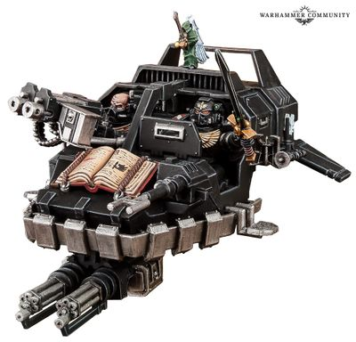

# 0337 鸦翼利爪大师 Ravenwing Talonmaster

精校状态：中文行文已逐段精校，部分术语仍为暂定

分类：通用概念 / 帝国 Imperium / 中央政务部 Adeptus Terra / 阿斯塔特修会 Adeptus Astartes

原文来源：https://www.bilibili.com/opus/1032139619734388741

原作者：帝国神选罐头

原文时间：编辑于 2026年09月09日 09:14

[返回分类目录](目录.md) · [全书目录](../../目录.md)

<!-- A0337-B0001 -->
**英文原文**

Ravenwing Talonmasters are specialised Lieutenants that the Dark Angels introduced to the Ravenwing Company following Lord Commander Guilliman's revision of the Codex Astartes.

<!-- /A0337-B0001 -->

<!-- A0337-B0002 -->

原译文

鸦翼利爪大师是黑暗天使在领主指挥官基里曼修订阿斯塔特圣典后引入鸦翼连队的专业副官。

**校订译文**

领主指挥官基里曼修订《阿斯塔特圣典》后，黑暗天使在鸦翼增设了“利爪大师”这一特殊副官职务。

<!-- /A0337-B0002 -->

<!-- A0337-B0003 图片 -->

<!-- A0337-B0004 -->

原译文

Ravenwing Talonmaster in Land Speeder 兰德速攻艇里的鸦翼利爪大师

**校订译文**

Ravenwing Talonmaster in Land Speeder 兰德速攻艇里的鸦翼利爪大师

<!-- /A0337-B0004 -->

<!-- A0337-B0005 -->
**英文原文**

Unlike the Lieutenants in the chapter's other companies, the Talonmasters' roles have been modified to meet the needs of the Ravenwing and they are charged with directing the company's firepower in battle. Riding in Land Speeders that have been outfitted with additional Auspex Scanners and Vox-casting mechanisms, Talonmasters ensure that even foes hiding in the densest of terrain are spotted, and have their coordinates vox-cast out to all of the Ravenwing's units. Although they are considered officers within the Company, however, the Talonmasters are ranked below the Ravenwing's Black Knights, and none, as of yet, have been initiated into the Inner Circle.

<!-- /A0337-B0005 -->

<!-- A0337-B0006 -->

原译文

与该战团其他连队的副官不同，利爪大师的角色已经过修改，以满足鸦翼的需求，他们负责在战斗中指挥连队的火力。利爪大师乘坐配备了额外鸟卜扫描仪和音阵投射器的兰德速攻艇，确保即使是隐藏在最密集地形中的敌人也能被发现，并将他们的坐标音阵投射到鸦翼的所有部队。尽管他们被视为连队内部的军官，但利爪大师的等级低于鸦翼的黑骑士，而且到目前为止，还没有人被提拔到内环。

**校订译文**

利爪大师的职责经过调整，以适应鸦翼需求，与战团其他连队的副官有所不同：他们主要负责在战斗中协调连队火力。其兰德速攻艇加装鸟卜扫描仪与音阵广播设备，能够发现隐藏在复杂地形深处的敌人，再将坐标传给所有鸦翼部队。按照本段采用的资料，利爪大师虽是连队军官，等级却低于黑骑士，且当时还没有任何一人获准进入内环。

**校注：** 此处等级与入环资格采用较早版本；后文专门列出新版冲突，改用资料时态避免同时宣称两种状态成立。

<!-- /A0337-B0006 -->

<!-- A0337-B0007 -->
**英文原文**

The Talonmaster rank has also been added to all Unforgiven Chapters that have companies similar to the Ravenwing.

<!-- /A0337-B0007 -->

<!-- A0337-B0008 -->

原译文

利爪大师等级也被添加到所有拥有与鸦翼类似连队的戴罪者战团中。

**校订译文**

其他拥有类似鸦翼连队的戴罪者战团，也都增设了利爪大师职务。

<!-- /A0337-B0008 -->

<!-- A0337-B0009 -->
## Conflicting sources 来源冲突

<!-- /A0337-B0009 -->

<!-- A0337-B0010 -->
**英文原文**

In the 8th edition Dark Angels codex, it is claimed that Talonmasters are ranked below the Black Knights in the Ravenwing's hierarchy. Later Dark Angels codices, however, state that Talonmasters are typically elevated to the position from the ranks of the Black Knights. This further contradicts the statement in the 8th edition codex that no Talonmaster has been a member of the Inner Circle, as the Black Knights are members of the Circle.

<!-- /A0337-B0010 -->

<!-- A0337-B0011 -->

原译文

在第8版黑暗天使圣典中，据称利爪大师在鸦翼的等级制度中排名低于黑骑士。然而，后来的黑暗天使圣典指出，利爪大师通常是从黑骑士的行列中晋升到这个职位。这进一步与第8版圣典中的说法相矛盾，即没有利爪大师是内环的成员，因为黑骑士是内环的成员。

**校订译文**

第八版《圣典：黑暗天使》称，利爪大师在鸦翼等级体系中低于黑骑士。然而，后续版本称利爪大师通常由黑骑士晋升而来。由于黑骑士本就是内环成员，这又与第八版“尚无利爪大师属于内环”的说法发生冲突。

<!-- /A0337-B0011 -->

本篇核心术语与暂定项

以下列出本篇出现的英文原形及核心术语表用词。同形词可能指不同对象，具体词义以本篇正文和校注为准；单复数、别名和仅见于图注的名称可能尚未列入。完整候选见[术语表](../../术语表/双语术语候选.csv)。

| 英文 | 采用中文 | 状态 |
| --- | --- | --- |
| Dark Angels | 黑暗天使 | 官方已核对 |
| Unforgiven | 戴罪者 | 暂定·官方待核 |
| Lord Commander | 领主指挥官 | 暂定·官方待核 |
| Chapter | 战团 | 暂定·官方待核 |
| Codex Astartes | 阿斯塔特圣典 | 暂定·官方待核 |
| Land Speeders | 兰德速攻艇 | 暂定·官方待核 |
| Talonmaster | 利爪大师 | 暂定·官方待核 |
| The Dark | 《黑暗》 | 暂定·官方待核 |
| Auspex | 鸟卜仪 | 暂定·官方待核 |

