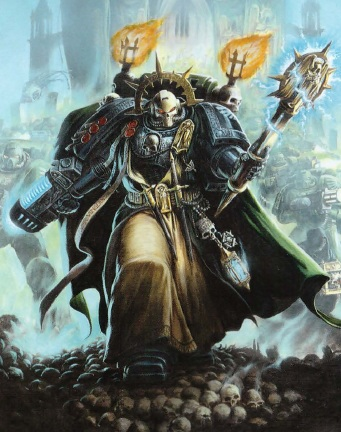
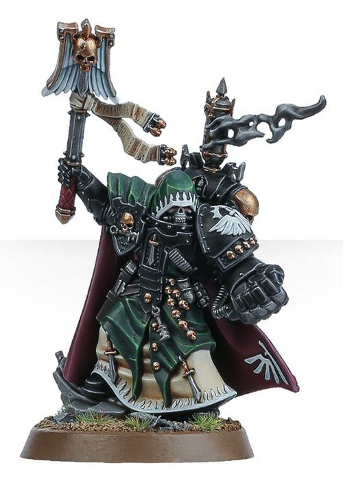

# 0338 审讯教士 Interrogator-Chaplain

精校状态：中文行文已逐段精校，部分术语仍为暂定

分类：通用概念 / 帝国 Imperium / 中央政务部 Adeptus Terra / 阿斯塔特修会 Adeptus Astartes

原文来源：https://www.bilibili.com/opus/1110978516177911810

原作者：帝国神选罐头

原文时间：2025年09月10日 20:44

[返回分类目录](目录.md) · [全书目录](../../目录.md)

原篇名：审讯牧师 Interrogator-Chaplain

<!-- A0338-B0001 -->
**英文原文**

You stand before this brotherhood as a renegade and a traitor. Your actions have brought shame on the Primarch and on the Unforgiven. Your suffering shall be but a beginning to your penance and your screams shall be the harbinger of your contrition.

<!-- /A0338-B0001 -->

<!-- A0338-B0002 -->

原译文

你作为变节者和叛徒站在这个兄弟面前。你的行为给原体和不可饶恕者带来了耻辱。你的痛苦将只是你忏悔的开始，你的尖啸将是你悔悟的预兆。

**校订译文**

你以变节者与叛徒的身份站在众兄弟面前。你的所作所为，让原体与戴罪者蒙羞。苦难只会是你赎罪的开始，而尖叫将预示你的悔悟。

<!-- /A0338-B0002 -->

<!-- A0338-B0003 -->
**英文原文**

— Interrogator-Chaplain Uzrael to an unnamed member of the Fallen

<!-- /A0338-B0003 -->

<!-- A0338-B0004 -->

原译文

—审讯牧师乌兹瑞尔对一名未透露姓名的堕天使成员

**校订译文**

——审讯教士乌兹瑞尔，对一名姓名不详的堕天使。

<!-- /A0338-B0004 -->

<!-- A0338-B0005 -->
**英文原文**

Interrogator-Chaplains are special Chaplains of the Dark Angels.

<!-- /A0338-B0005 -->

<!-- A0338-B0006 -->

原译文

审讯牧师是黑暗天使的特殊牧师。

**校订译文**

审讯教士是黑暗天使战团的一类特殊教士。

<!-- /A0338-B0006 -->

<!-- A0338-B0007 图片 -->

<!-- A0338-B0008 -->

原译文

Interrogator-Chaplain 审讯牧师

**校订译文**

Interrogator-Chaplain 审讯教士

<!-- /A0338-B0008 -->

<!-- A0338-B0009 -->
## Overview 概述

<!-- /A0338-B0009 -->

<!-- A0338-B0010 -->
**英文原文**

They are members of the Dark Angels' Inner Circle and are thus highly respected by their peers. The route to becoming an Interrogator-Chaplain is perilous. He will be observed from a distance throughout his career and may eventually come to learn some of the secrets pertaining to the fall of Caliban. If this is so, he will be brought before the Inner Circle and judged whether he is ready to join them or not. If so he will become a full member and learn the secrets of the chapter. If he is judged not to be ready then he may be mind-scrubbed, or worse.

<!-- /A0338-B0010 -->

<!-- A0338-B0011 -->

原译文

他们是黑暗天使内环的成员，因此受到同伴的高度尊重。成为审讯牧师的道路是危险的。在他的整个职业生涯中，人们将从远处观察他，并可能最终了解一些与卡利班之陨有关的秘密。如果是这样，他将被带到内环面前，并判断他是否准备好加入他们。如果是这样，他将成为一名正式成员，并了解战团的秘密。如果他被判断为没有准备好，那么他可能会被洗脑，甚至更糟。

**校订译文**

审讯教士属于黑暗天使内环，因而深受同袍敬重。通往这一职位的道路却充满危险。候选人在整个服役生涯中都会受到暗中观察，并可能逐渐获知有关卡利班陷落的部分秘密。一旦如此，他便会被带到内环面前，接受是否已有资格加入的评判。通过者成为正式成员，获知战团秘密；未通过者则可能被清除记忆，甚至遭遇更糟的命运。

<!-- /A0338-B0011 -->

<!-- A0338-B0012 -->
**英文原文**

While having similar duties to normal Chaplains, Interrogators have the added duty of making any Fallen repent. For every fallen that repents they may add a black pearl to their Rosarius in honour of this achievement. Master Molochia had a dozen black pearls, making him one of the most successful Interrogator-Chaplains in the history of the Dark Angels.

<!-- /A0338-B0012 -->

<!-- A0338-B0013 -->

原译文

虽然审讯牧师的职责与普通牧师相似，但他们还有让任何堕天使悔改的额外职责。对于每一个悔改的堕天使，他们可以在他们的玫瑰念珠上添加一颗黑珍珠，以纪念这一成就。莫洛奇亚导师有十几颗黑珍珠，使他成为黑暗天使历史上最成功的审讯牧师之一。

**校订译文**

审讯教士承担普通教士的职责，同时还负责迫使堕天使忏悔。每成功使一人悔罪，他们便可在玫瑰念珠上加一颗黑珍珠，以纪念这一成就。莫洛奇亚导师拥有十二颗黑珍珠，是黑暗天使历史上最成功的审讯教士之一。

**校注：** a dozen为十二，原译十几不准确。

<!-- /A0338-B0013 -->

<!-- A0338-B0014 图片 -->

<!-- A0338-B0015 -->

原译文

Interrogator-Chaplain 审讯牧师

**校订译文**

Interrogator-Chaplain 审讯教士

<!-- /A0338-B0015 -->

<!-- A0338-B0016 -->
**英文原文**

Historically, Interrogator-Chaplains have their origins in the Host of Fire of the First Legion during the Unification Wars and Great Crusade. The Chaplains of this host were renowned for their bloody torture.

<!-- /A0338-B0016 -->

<!-- A0338-B0017 -->

原译文

历史上，审讯牧师的起源可以追溯到统一战争和大远征期间第一军团的火焰天军。这个天军的牧师以血腥的折磨而闻名。

**校订译文**

审讯教士的历史可追溯至统一战争及大远征期间，第一军团的火焰天军；该天军的教士以血腥酷刑闻名。

<!-- /A0338-B0017 -->

<!-- A0338-B0018 -->
## Notable Interrogator-Chaplains 著名审讯教士

原题：Notable Interrogator-Chaplains 著名审讯牧师

<!-- /A0338-B0018 -->

<!-- A0338-B0019 -->
**英文原文**

Asmodai — Master Interrogator-Chaplain.

<!-- /A0338-B0019 -->

<!-- A0338-B0020 -->

原译文

阿斯莫代 — 审讯牧师导师

**校订译文**

阿斯莫德——审讯教士导师。

<!-- /A0338-B0020 -->

<!-- A0338-B0021 -->

原译文

Altheous 奥瑟鲁斯

**校订译文**

Altheous 奥瑟鲁斯

<!-- /A0338-B0021 -->

<!-- A0338-B0022 -->

原译文

Belphegor 贝尔芬格

**校订译文**

Belphegor 贝尔芬格

<!-- /A0338-B0022 -->

<!-- A0338-B0023 -->

原译文

Boreas 波瑞亚斯

**校订译文**

Boreas 波瑞亚斯

<!-- /A0338-B0023 -->

<!-- A0338-B0024 -->
**英文原文**

Jeramael — Member of the Deathwatch.

<!-- /A0338-B0024 -->

<!-- A0338-B0025 -->

原译文

杰拉米尔 — 死亡守望成员

**校订译文**

杰拉米尔 — 死亡守望成员

<!-- /A0338-B0025 -->

<!-- A0338-B0026 -->
**英文原文**

Molochia — The most successful Interrogator-Chaplain in the Chapter's history.

<!-- /A0338-B0026 -->

<!-- A0338-B0027 -->

原译文

莫洛奇亚 — 战团历史上最成功的审讯牧师。

**校订译文**

莫洛奇亚——战团历史上最成功的审讯教士。

**校注：** 正文称最成功者之一，名单称最成功者，均来自原文，未虚构排名依据。

<!-- /A0338-B0027 -->

<!-- A0338-B0028 -->

原译文

Palaliah 帕拉利亚

**校订译文**

Palaliah 帕拉利亚

<!-- /A0338-B0028 -->

<!-- A0338-B0029 -->
**英文原文**

Phaleg — took part in the Angels On High incident.

<!-- /A0338-B0029 -->

<!-- A0338-B0030 -->

原译文

法雷格 — 参与了至上天使事件。

**校订译文**

法雷格 — 参与了至上天使事件。

<!-- /A0338-B0030 -->

<!-- A0338-B0031 -->

原译文

Raguel 拉贵尔

**校订译文**

Raguel 拉贵尔

<!-- /A0338-B0031 -->

<!-- A0338-B0032 -->

原译文

Razyl 拉齐尔

**校订译文**

Razyl 拉齐尔

<!-- /A0338-B0032 -->

<!-- A0338-B0033 -->

原译文

Remus 雷穆斯

**校订译文**

Remus 雷穆斯

<!-- /A0338-B0033 -->

<!-- A0338-B0034 -->
**英文原文**

Sapphon — the current Grand Master of Chaplains.

<!-- /A0338-B0034 -->

<!-- A0338-B0035 -->

原译文

萨芬 — 当前的牧师大导师

**校订译文**

萨芬——现任教士大导师。

<!-- /A0338-B0035 -->

<!-- A0338-B0036 -->

原译文

Sarphaecus 萨菲克斯

**校订译文**

Sarphaecus 萨菲克斯

<!-- /A0338-B0036 -->

<!-- A0338-B0037 -->

原译文

Seraphicus 塞拉菲库斯

**校订译文**

Seraphicus 塞拉菲库斯

<!-- /A0338-B0037 -->

<!-- A0338-B0038 -->

原译文

Umariel 乌玛瑞尔

**校订译文**

Umariel 乌玛瑞尔

<!-- /A0338-B0038 -->

<!-- A0338-B0039 -->

原译文

Zacharias 扎卡利亚斯

**校订译文**

Zacharias 扎卡利亚斯

<!-- /A0338-B0039 -->

<!-- A0338-B0040 -->

原译文

Zachius 扎基乌斯

**校订译文**

Zachius 扎基乌斯

<!-- /A0338-B0040 -->

<!-- A0338-B0041 -->

原译文

Zaeroph 扎罗夫

**校订译文**

Zaeroph 扎罗夫

<!-- /A0338-B0041 -->

本篇核心术语与暂定项

以下列出本篇出现的英文原形及核心术语表用词。同形词可能指不同对象，具体词义以本篇正文和校注为准；单复数、别名和仅见于图注的名称可能尚未列入。完整候选见[术语表](../../术语表/双语术语候选.csv)。

| 英文 | 采用中文 | 状态 |
| --- | --- | --- |
| Dark Angels | 黑暗天使 | 官方已核对 |
| Deathwatch | 死亡守望 | 官方已核对 |
| History | 历史 | 编辑用语已统一 |
| Primarch | 原体 | 官方已核对 |
| Great Crusade | 大远征 | 暂定·官方待核 |
| Unification Wars | 统一战争 | 暂定·官方待核 |
| Brotherhood | 兄弟会 | 暂定·官方待核 |
| Caliban | 卡利班 | 暂定·官方待核 |
| Master | 导师（审判庭职衔）／舰务官（舰员职务） | 语境定译·官方待核 |
| Rosarius | 玫瑰念珠 | 暂定·官方待核 |
| Interrogator-Chaplain | 审讯教士 | 暂定·官方待核 |
| Unforgiven | 戴罪者 | 暂定·官方待核 |
| Chaplain | 教士 | 官方已核对 |
| Asmodai | 阿斯莫德 | 官方已核对 |
| Chapter | 战团 | 暂定·官方待核 |
| Grand Master of Chaplains | 教士大导师 | 暂定·官方待核 |
| Host | 天军 | 暂定·官方待核 |
| Chaplains | 教士 | 暂定·官方待核 |
| Grand Master | 大导师 | 暂定·官方待核 |
| Master Interrogator-Chaplain | 审讯教士导师 | 暂定·官方待核 |
| The Dark | 《黑暗》 | 暂定·官方待核 |

