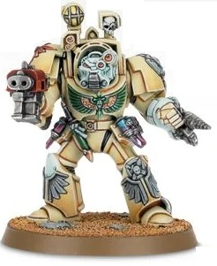

# 0339 死翼药剂师 Deathwing Apothecaries

精校状态：中文行文已逐段精校，部分术语仍为暂定

分类：通用概念 / 帝国 Imperium / 中央政务部 Adeptus Terra / 阿斯塔特修会 Adeptus Astartes

原文来源：https://www.bilibili.com/opus/1021796543937642569

原作者：帝国神选罐头

原文时间：2025年01月13日 12:52

[返回分类目录](目录.md) · [全书目录](../../目录.md)

<!-- A0339-B0001 -->
**英文原文**

Deathwing Apothecaries are Dark Angels Apothecaries, that serve in the Chapter's Deathwing Company.

<!-- /A0339-B0001 -->

<!-- A0339-B0002 -->

原译文

死翼药剂师是黑暗天使药剂师，在战团的死翼连队任职。

**校订译文**

死翼药剂师是黑暗天使药剂师，在战团的死翼连队任职。

<!-- /A0339-B0002 -->

<!-- A0339-B0003 图片 -->

<!-- A0339-B0004 -->

原译文

Deathwing Apothecary 死翼药剂师

**校订译文**

Deathwing Apothecary 死翼药剂师

<!-- /A0339-B0004 -->

<!-- A0339-B0005 -->
**英文原文**

In battles, these veteran warrior-medics strides through volleys of gunfire and vicious melees, in order to aid their wounded Battle Brothers. The Deathwing Apothecaries are also charged with recovering the Progenoid Glands, of those Dark Angels who cannot be saved.

<!-- /A0339-B0005 -->

<!-- A0339-B0006 -->

原译文

在战斗中，这些经验丰富的战斗医疗兵在枪林弹雨和残酷混战中大步前进，以帮助他们受伤的战斗兄弟。死翼药剂师还负责恢复那些无法得救的黑暗天使的基因腺体。

**校订译文**

战斗中，这些经验丰富的战士兼医者穿行于枪林弹雨和惨烈肉搏之间，救助受伤同袍。对于已无力救回的黑暗天使，死翼药剂师则负责回收其基因收存腺。

**校注：** recover指回收基因收存腺，不是恢复腺体功能。

<!-- /A0339-B0006 -->

本篇核心术语与暂定项

以下列出本篇出现的英文原形及核心术语表用词。同形词可能指不同对象，具体词义以本篇正文和校注为准；单复数、别名和仅见于图注的名称可能尚未列入。完整候选见[术语表](../../术语表/双语术语候选.csv)。

| 英文 | 采用中文 | 状态 |
| --- | --- | --- |
| Dark Angels | 黑暗天使 | 官方已核对 |
| Progenoid glands | 基因存收腺 | 暂定·官方待核 |
| Chapter | 战团 | 暂定·官方待核 |
| Veteran | 老兵 | 暂定·官方待核 |

