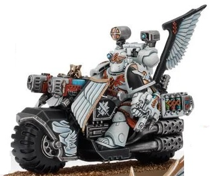

# 0340 鸦翼药剂师 Ravenwing Apothecaries

精校状态：中文行文已逐段精校，部分术语仍为暂定

分类：通用概念 / 帝国 Imperium / 中央政务部 Adeptus Terra / 阿斯塔特修会 Adeptus Astartes

原文来源：https://www.bilibili.com/opus/1031875427741728793

原作者：帝国神选罐头

原文时间：2025年02月09日 16:43

[返回分类目录](目录.md) · [全书目录](../../目录.md)

<!-- A0340-B0001 -->
**英文原文**

Ravenwing Apothecaries are Dark Angels Apothecaries, that serve in the Chapter's Ravenwing Company.

<!-- /A0340-B0001 -->

<!-- A0340-B0002 -->

原译文

鸦翼药剂师是黑暗天使药剂师，在战团的鸦翼连队服役。

**校订译文**

鸦翼药剂师是黑暗天使药剂师，在战团的鸦翼连队服役。

<!-- /A0340-B0002 -->

<!-- A0340-B0003 -->
**英文原文**

Thanks to the power range and speed of their Bikes, they can quickly reach more wounded Battle Brothers than other Apothecaries. This ensures these stricken Dark Angels are returned to their feet faster or that the Ravenwing Apothecaries can swiftly recover their precious Progenoid Glands.

<!-- /A0340-B0003 -->

<!-- A0340-B0004 -->

原译文

由于他们的摩托的功率范围和速度，他们可以比其他药剂师更快地接触到更多受伤的战斗兄弟。这确保了这些受伤的黑暗天使能够更快地站起来，或者鸦翼药剂师能够迅速恢复他们珍贵的基因腺体。

**校订译文**

凭借摩托的动力、续航与速度，鸦翼药剂师能够比其他药剂师更快赶到伤者身边，救助更多战斗兄弟。这使受伤的黑暗天使能更快重返战斗，或在无法挽救时，由药剂师迅速回收珍贵的基因收存腺。

**校注：** power range and speed缺少标点，按车辆性能语境译为动力、续航与速度，非功率范围；recover同样是回收腺体。

<!-- /A0340-B0004 -->

<!-- A0340-B0005 图片 -->

<!-- A0340-B0006 -->

原译文

Ravenwing Apothecary 鸦翼药剂师

**校订译文**

Ravenwing Apothecary 鸦翼药剂师

<!-- /A0340-B0006 -->

本篇核心术语与暂定项

以下列出本篇出现的英文原形及核心术语表用词。同形词可能指不同对象，具体词义以本篇正文和校注为准；单复数、别名和仅见于图注的名称可能尚未列入。完整候选见[术语表](../../术语表/双语术语候选.csv)。

| 英文 | 采用中文 | 状态 |
| --- | --- | --- |
| Dark Angels | 黑暗天使 | 官方已核对 |
| Progenoid glands | 基因存收腺 | 暂定·官方待核 |
| Chapter | 战团 | 暂定·官方待核 |
| Bikes | 摩托 | 暂定·官方待核 |

