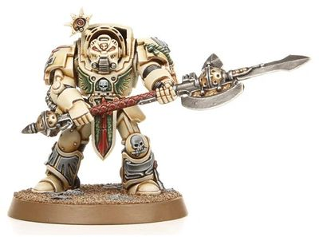

# 0341 死翼冠军 Deathwing Champion

精校状态：中文行文已逐段精校，部分术语仍为暂定

分类：通用概念 / 帝国 Imperium / 中央政务部 Adeptus Terra / 阿斯塔特修会 Adeptus Astartes

原文来源：https://www.bilibili.com/opus/1021796608357957648

原作者：帝国神选罐头

原文时间：2025年01月13日 12:52

[返回分类目录](目录.md) · [全书目录](../../目录.md)

<!-- A0341-B0001 -->
**英文原文**

Deathwing Champions are the Company Champion of the Dark Angels Chapter's Deathwing Company.

<!-- /A0341-B0001 -->

<!-- A0341-B0002 -->

原译文

死翼冠军是黑暗天使战团死翼连队的连队冠军。

**校订译文**

死翼冠军是黑暗天使战团死翼连队的连队冠军。

<!-- /A0341-B0002 -->

<!-- A0341-B0003 图片 -->

<!-- A0341-B0004 -->

原译文

Deathwing Champion 死翼冠军

**校订译文**

Deathwing Champion 死翼冠军

<!-- /A0341-B0004 -->

<!-- A0341-B0005 -->
**英文原文**

Those chosen are the most formidable fighters of the Deathwing and wield an ancient Halberd of Caliban in battle. While fighting the Dark Angels' foes, the Deathwing Champion will swing this fearsome weapon in wide arcs, to strike down multiple foes. The Champion is no less adept in personal combat, and will eagerly seek out the most worthy opponents on the battlefield.

<!-- /A0341-B0005 -->

<!-- A0341-B0006 -->

原译文

受选者是死翼最强大的战士，在战斗中挥舞着古老的卡利班长戟。在与黑暗天使的敌人作战时，死翼冠军将挥舞这件可怕的武器，以宽阔的弧线击倒多个敌人。冠军同样擅长个人作战，会在战场上急切地寻找最有价值的对手。

**校订译文**

死翼冠军从死翼最强悍的战士中选出，手持古老的卡利班长戟征战。他们以大幅度的弧形挥击横扫敌阵，一击便能斩倒数名敌人。冠军同样精通单独决斗，总会主动寻找战场上最值得一战的强敌。

<!-- /A0341-B0006 -->

本篇核心术语与暂定项

以下列出本篇出现的英文原形及核心术语表用词。同形词可能指不同对象，具体词义以本篇正文和校注为准；单复数、别名和仅见于图注的名称可能尚未列入。完整候选见[术语表](../../术语表/双语术语候选.csv)。

| 英文 | 采用中文 | 状态 |
| --- | --- | --- |
| Dark Angels | 黑暗天使 | 官方已核对 |
| Caliban | 卡利班 | 暂定·官方待核 |
| Company Champion | 连队冠军 | 暂定·官方待核 |
| Ancient | 旗手 | 官方已核对 |
| Adept | 帝国任职者（广义）／文吏（行政语境） | 语境定译·官方待核 |
| Champion | 冠军 | 暂定·官方待核 |
| Chapter | 战团 | 暂定·官方待核 |
| Halberd of Caliban | 卡利班长戟 | 暂定·沿用现稿 |
| Halberd | 长戟号 | 暂定·官方待核 |
| The Dark | 《黑暗》 | 暂定·官方待核 |

