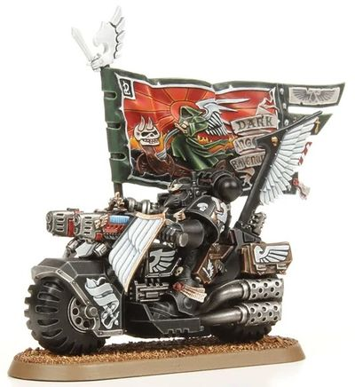

# 0343 鸦翼旗手 Ravenwing Ancient

精校状态：中文行文已逐段精校，部分术语仍为暂定

分类：通用概念 / 帝国 Imperium / 中央政务部 Adeptus Terra / 阿斯塔特修会 Adeptus Astartes

原文来源：https://www.bilibili.com/opus/1031875363284713497

原作者：帝国神选罐头

原文时间：2025年02月09日 16:43

[返回分类目录](目录.md) · [全书目录](../../目录.md)

<!-- A0343-B0001 -->
**英文原文**

Ravenwing Ancients are the Company Ancient of the Dark Angels Chapter's Ravenwing Company.

<!-- /A0343-B0001 -->

<!-- A0343-B0002 -->

原译文

鸦翼旗手是黑暗天使战团鸦翼连队的连队旗手。

**校订译文**

鸦翼旗手是黑暗天使战团鸦翼连队的连队旗手。

<!-- /A0343-B0002 -->

<!-- A0343-B0003 -->
**英文原文**

In battle, they carry one of the Ravenwing's sacred standards and form a rallying point for their Company. Beneath the fluttering banner, the Ravening bring death to their foes and the Ravening Ancient can be found at the very forefront of the Company's devastating Bike charges.

<!-- /A0343-B0003 -->

<!-- A0343-B0004 -->

原译文

在战斗中，他们携带着鸦翼的神圣旗帜之一，并成为他们连队的集结点。在飘扬的旗帜下，鸦翼给敌人带来了死亡，而鸦翼旗手则位于该连队毁灭性的摩托冲锋的最前沿。

**校订译文**

鸦翼旗手在战场上高举鸦翼的一面圣旗，为连队指明集结的位置。鸦翼战士在飘扬的旗帜下将死亡带给敌人，而旗手始终冲在连队势不可挡的摩托突击队列最前方。

**校注：** 英文两处 Ravening 依本段指代校读为 Ravenwing；英文原文保留。

<!-- /A0343-B0004 -->

<!-- A0343-B0005 图片 -->

<!-- A0343-B0006 -->

原译文

Ravenwing Ancient 鸦翼旗手

**校订译文**

Ravenwing Ancient 鸦翼旗手

<!-- /A0343-B0006 -->

本篇核心术语与暂定项

以下列出本篇出现的英文原形及核心术语表用词。同形词可能指不同对象，具体词义以本篇正文和校注为准；单复数、别名和仅见于图注的名称可能尚未列入。完整候选见[术语表](../../术语表/双语术语候选.csv)。

| 英文 | 采用中文 | 状态 |
| --- | --- | --- |
| Dark Angels | 黑暗天使 | 官方已核对 |
| Company Ancient | 连队旗手 | 暂定·官方待核 |
| Ancient | 旗手 | 官方已核对 |
| Chapter | 战团 | 暂定·官方待核 |
| The Dark | 《黑暗》 | 暂定·官方待核 |

