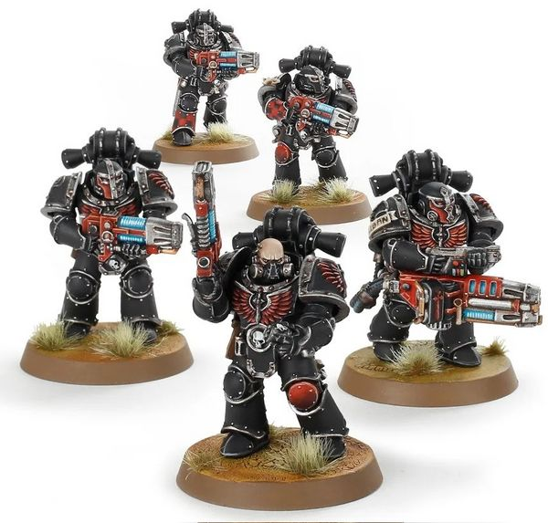

# 0347 屠灭者 Interemptor

精校状态：中文行文已逐段精校，部分术语仍为暂定

分类：通用概念 / 帝国 Imperium / 中央政务部 Adeptus Terra / 阿斯塔特修会 Adeptus Astartes

原文来源：https://www.bilibili.com/opus/1024792068861460482

原作者：帝国神选罐头

原文时间：2025年01月21日 14:36

[返回分类目录](目录.md) · [全书目录](../../目录.md)

<!-- A0347-B0001 -->
**英文原文**

Interemptors were troops of the Dreadwing of the Dark Angels during the Great Crusade and Horus Heresy.

<!-- /A0347-B0001 -->

<!-- A0347-B0002 -->

原译文

屠灭者是大远征和荷鲁斯叛乱期间的黑暗天使恐翼部队。

**校订译文**

屠灭者是大远征与荷鲁斯之乱期间黑暗天使恐翼的部队。

<!-- /A0347-B0002 -->

<!-- A0347-B0003 -->
## Overview 概述

<!-- /A0347-B0003 -->

<!-- A0347-B0004 -->
**英文原文**

Even among the brethren of the infamous Dreadwing, the Interemptors are a grim breed, dedicated as they are to a singular purpose - the utter annihilation of the enemy. When the Interemptors attack, they leave behind no trace of those they conquer - no bodies, no ruins, nothing. They take no trophies of their victories and tell no tales of those that have fallen before them, those consigned to death at their hands are forgotten forever. They are the Lion's ultimate sanction, his final curse for those foolish enough to stand against the First Legion. Their squads were led by a Praefectus.

<!-- /A0347-B0004 -->

<!-- A0347-B0005 -->

原译文

即使在臭名昭著的恐翼的兄弟中，屠灭者也是一个冷酷的类型，因为他们致力于一个单一的目的——彻底消灭敌人。当屠灭者进攻时，他们没有留下任何他们征服的人的踪迹——没有尸体，没有废墟，什么都没有。他们不拿胜利的奖杯，也不讲那些在他们面前倒下的人的故事，那些被他们亲手处死的人永远被遗忘了。它们是狮子的最终制裁，是他对那些愚蠢到足以对抗第一军团的人的最后诅咒。他们的小队由长官领导。

**校订译文**

即使在臭名昭著的恐翼弟兄之中，屠灭者也以冷酷著称。他们只有一个目的：彻底抹除敌人。屠灭者进攻过后，被征服者不会留下任何痕迹——没有尸体，没有废墟，什么都没有。他们不收集胜利的战利品，也不传讲败于其手的敌人的故事；死在他们手中的人将永远被世间遗忘。他们是雄狮最后的制裁手段，是他降予那些愚蠢到敢于对抗第一军团之人的最终诅咒。屠灭者小队由一名长官领导。

<!-- /A0347-B0005 -->

<!-- A0347-B0006 图片 -->

<!-- A0347-B0007 -->

原译文

Squad of Dark Angels Interemptor 黑暗天使屠灭者小队

**校订译文**

Squad of Dark Angels Interemptor 黑暗天使屠灭者小队

<!-- /A0347-B0007 -->

<!-- A0347-B0008 -->
**英文原文**

Interemptors wielded Plasma Burners, Missile Launchers loaded with Rad Missiles or Stasis Missiles, Plasma Incinerators, Chainswords, Phosphex Grenades, Krak Grenades, Melta Bombs,and Rad Grenades. Their radioactive weaponry was devastating, but degraded the warriors over time. Thus a Dreadwing Interemptor was only combat viable for a few decades before requiring bionic augmentation or entombment within a Dreadnought. Their squads were additionally outfitted with a Nuncio-Vox, and Augury Scanners.

<!-- /A0347-B0008 -->

<!-- A0347-B0009 -->

原译文

屠灭者挥舞着等离子燃烧枪、装有辐射导弹或静滞导弹的导弹发射器、等离子焚化枪、链锯剑、磷化手榴弹、穿甲手榴弹、热熔炸弹和辐射手榴弹。他们的辐射武器是毁灭性的，但随着时间的推移，战士们的体质下降了。因此，在需要埋葬在无畏内或进行仿生增强之前，恐翼屠灭者只有在几十年的可战斗性。他们的小队还配备了大使音阵和占卜扫描仪。

**校订译文**

屠灭者装备等离子燃烧枪、可发射辐射导弹或静滞导弹的导弹发射器、等离子焚化枪、链锯剑、磷化手榴弹、穿甲手榴弹、热熔炸弹及辐射手榴弹。这些放射性武器威力惊人，却也会逐渐损伤使用者的身体。因此，恐翼屠灭者通常只能维持数十年的作战能力，此后便需要接受仿生改造，或被安置进无畏机甲。他们的小队还配备通讯引导阵列与鸟卜扫描仪。

<!-- /A0347-B0009 -->

<!-- A0347-B0010 -->
**英文原文**

Their Power Armour was outfitted with Rad-Hardened sub-systems.

<!-- /A0347-B0010 -->

<!-- A0347-B0011 -->

原译文

他们的动力盔甲配备了辐射硬化子系统。

**校订译文**

他们的动力甲装有抗辐射子系统。

<!-- /A0347-B0011 -->

本篇核心术语与暂定项

以下列出本篇出现的英文原形及核心术语表用词。同形词可能指不同对象，具体词义以本篇正文和校注为准；单复数、别名和仅见于图注的名称可能尚未列入。完整候选见[术语表](../../术语表/双语术语候选.csv)。

| 英文 | 采用中文 | 状态 |
| --- | --- | --- |
| Dark Angels | 黑暗天使 | 官方已核对 |
| Horus Heresy | 荷鲁斯之乱 | 官方已核对 |
| Great Crusade | 大远征 | 暂定·官方待核 |
| Horus | 荷鲁斯 | 暂定·官方待核 |
| Nuncio-Vox | 通讯引导阵列 | 暂定·官方待核 |
| Power Armour | 动力盔甲 | 暂定·官方待核 |
| Krak Grenades | 穿甲手榴弹 | 暂定·官方待核 |
| Dreadwing | 恐翼 | 暂定·官方待核 |
| Interemptor | 屠灭者 | 暂定·沿用现稿 |
| Missile Launchers | 导弹发射器 | 暂定·官方待核 |
| Rad-Hardened sub-systems | 抗辐射子系统 | 暂定 |
| Dreadnought | 无畏机甲 | 暂定·官方待核 |
| The Dark | 《黑暗》 | 暂定·官方待核 |
| Phosphex | 磷化燃剂 | 暂定·官方待核 |

