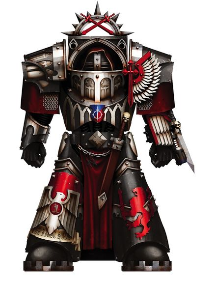
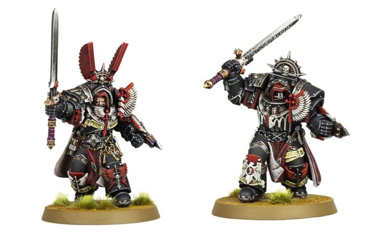

# 0348 内环骑士 Knights Cenobium

精校状态：中文行文已逐段精校，部分术语仍为暂定

分类：通用概念 / 帝国 Imperium / 中央政务部 Adeptus Terra / 阿斯塔特修会 Adeptus Astartes

原文来源：https://www.bilibili.com/opus/1026954477518716933

原作者：帝国神选罐头

原文时间：编辑于 2025年09月24日 11:09

[返回分类目录](目录.md) · [全书目录](../../目录.md)

<!-- A0348-B0001 -->
**英文原文**

The Knights Cenobium were elite warriors of the Inner Circle of the Dark Angels Legion during the Great Crusade and Horus Heresy.

<!-- /A0348-B0001 -->

<!-- A0348-B0002 -->

原译文

内环骑士是大远征和荷鲁斯叛乱期间黑暗天使军团内环的精英战士。

**校订译文**

内环骑士是大远征与荷鲁斯之乱期间黑暗天使军团内环的精锐战士。

<!-- /A0348-B0002 -->

<!-- A0348-B0003 图片 -->

<!-- A0348-B0004 -->

原译文

Knight Cenobium 内环骑士

**校订译文**

Knight Cenobium 内环骑士

<!-- /A0348-B0004 -->

<!-- A0348-B0005 -->
## Overview 概述

<!-- /A0348-B0005 -->

<!-- A0348-B0006 -->
**英文原文**

Within the First Legion there were many separate Orders, each dedicated to a singular method of war. The Cenobium stood as the greatest example of these Orders, their champions and foremost warriors each a keeper of the secrets held by that Order and a practitioner of the form of war they embodied.

<!-- /A0348-B0006 -->

<!-- A0348-B0007 -->

原译文

在第一军团内部，有许多独立的骑士团，每个骑士团都致力于一种独特的战争方法。内环是这些组织中最伟大的例子，他们的冠军和最重要的战士都是该组织所掌握的秘密的守护者，也是他们所体现的战争形式的实践者。

**校订译文**

第一军团内部有许多独立的骑士团，各自专精于一种战法。内环骑士汇聚了这些骑士团最杰出的代表：每一位都是所属骑士团的冠军或顶尖战士，守护着本团的秘密，并精通其独有战法。

<!-- /A0348-B0007 -->

<!-- A0348-B0008 -->
**英文原文**

Unleashed where the fighting was most intense, the Knights Cenobium were a temporary unit that was put together using a cell of warriors from an Order of the Dark Angels on the eve of a mission that required their unique skills. They wore Cataphractii Pattern Terminator Armour and wielded Terranic Greatswords and Plasma Casters.

<!-- /A0348-B0008 -->

<!-- A0348-B0009 -->

原译文

在战斗最激烈的地方，内环骑士是一个临时单位，在需要他们独特技能的任务前夕，使用来自黑暗天使骑士团的战士组成。他们穿着铁骑型终结者盔甲，挥舞着泰拉巨剑和等离子发射器。

**校订译文**

内环骑士是临时编成的部队。每当某项任务需要特定的作战技艺时，黑暗天使便会在任务开始前，从相应的骑士团抽调一组战士，投入战况最激烈之处。他们身穿铁骑型终结者甲，装备泰拉巨剑与等离子发射器。

<!-- /A0348-B0009 -->

<!-- A0348-B0010 图片 -->

<!-- A0348-B0011 -->

原译文

Knights Cenobium 内环骑士

**校订译文**

Knights Cenobium 内环骑士

<!-- /A0348-B0011 -->

<!-- A0348-B0012 -->
## Known Knights Cenobium 著名内环骑士

<!-- /A0348-B0012 -->

<!-- A0348-B0013 -->
**英文原文**

Trigaine — Order of Santales

<!-- /A0348-B0013 -->

<!-- A0348-B0014 -->

原译文

崔盖恩 — 檀香骑士团

**校订译文**

崔盖恩 — 檀香骑士团

**校注：** Order of Santales 为骑士团专名；“檀香骑士团”沿用现稿，未查得官方译名，原词是否有特定词源仍待核。

<!-- /A0348-B0014 -->

<!-- A0348-B0015 -->
**英文原文**

Vendrahel — Knight-Preceptor, Order of the Broken Claws.

<!-- /A0348-B0015 -->

<!-- A0348-B0016 -->

原译文

文德赫 — 教导骑士，断爪骑士团

**校订译文**

文德赫 — 教导骑士，断爪骑士团

<!-- /A0348-B0016 -->

本篇核心术语与暂定项

以下列出本篇出现的英文原形及核心术语表用词。同形词可能指不同对象，具体词义以本篇正文和校注为准；单复数、别名和仅见于图注的名称可能尚未列入。完整候选见[术语表](../../术语表/双语术语候选.csv)。

| 英文 | 采用中文 | 状态 |
| --- | --- | --- |
| Dark Angels | 黑暗天使 | 官方已核对 |
| Terminator | 终结者 | 官方已核对 |
| Horus Heresy | 荷鲁斯之乱 | 官方已核对 |
| Great Crusade | 大远征 | 暂定·官方待核 |
| Horus | 荷鲁斯 | 暂定·官方待核 |
| Mission | 教团／传教机构 | 暂定 |
| Knights Cenobium | 内环骑士 | 暂定·沿用现稿 |
| Order of Santales | 檀香骑士团 | 暂定·沿用现稿，待核 |
| The Dark | 《黑暗》 | 暂定·官方待核 |
| Terminator Armour | 终结者盔甲 | 暂定·官方待核 |
| Cataphractii Pattern | 铁骑型 | 暂定·官方待核 |

